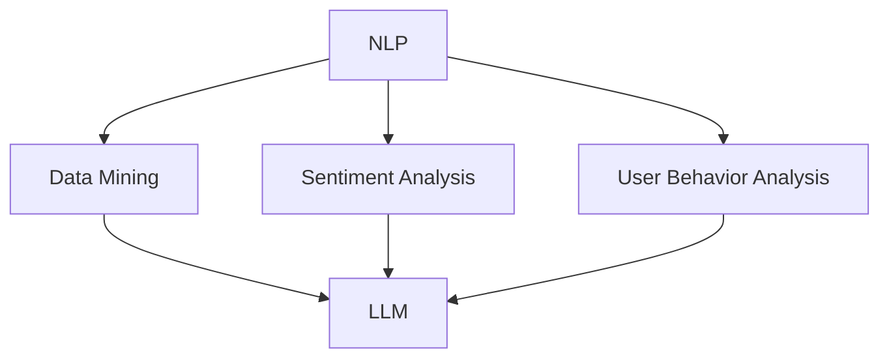

                 

关键词：大型语言模型（LLM），社交媒体分析，自然语言处理（NLP），数据挖掘，信息提取，用户行为分析，情感分析，趋势预测，内容推荐。

> 摘要：随着社交媒体的日益普及，分析这些平台上的数据以提取有价值的信息变得越来越重要。本文探讨了大型语言模型（LLM）在社交媒体分析中的潜力，重点讨论了其在情感分析、用户行为预测、内容推荐以及趋势预测等方面的应用。通过分析和案例研究，本文揭示了LLM在社交媒体分析中的重要性，并展望了未来的发展趋势。

## 1. 背景介绍

社交媒体平台已经成为人们日常生活中不可或缺的一部分。从Facebook到Twitter，再到微信和微博，这些平台不仅提供了沟通和分享的渠道，还产生了大量的数据。这些数据中蕴含着用户行为、情感倾向、兴趣偏好等有价值的信息，对企业和研究者来说具有巨大的商业和学术价值。

自然语言处理（NLP）作为计算机科学的重要分支，致力于使计算机能够理解和处理人类语言。近年来，随着深度学习技术的不断发展，特别是大型语言模型（LLM）如GPT-3的出现，NLP在理解和生成自然语言方面的能力得到了显著提升。

LLM，尤其是基于Transformer模型的模型，通过大量文本数据的学习，能够生成流畅且符合语言习惯的文本。这使得它们在文本分析和处理领域具有广阔的应用前景。在社交媒体分析中，LLM能够帮助我们更好地理解用户生成的内容，挖掘出潜在的信息和模式。

## 2. 核心概念与联系

为了更好地理解LLM在社交媒体分析中的应用，我们需要首先了解几个核心概念，包括自然语言处理、数据挖掘、情感分析和用户行为分析。

### 2.1 自然语言处理（NLP）

自然语言处理（NLP）是计算机科学、人工智能和语言学领域的研究分支，旨在使计算机能够理解、生成和处理自然语言。NLP的关键技术包括文本预处理、词向量表示、语言模型、命名实体识别、情感分析和机器翻译等。

### 2.2 数据挖掘

数据挖掘是通过对大量数据的分析，从中提取出有价值的模式和知识的过程。在社交媒体分析中，数据挖掘可以帮助我们识别用户的行为模式、兴趣偏好和情感倾向。

### 2.3 情感分析

情感分析，也称为意见挖掘，是NLP的一个重要分支，旨在识别文本中所表达的情感。情感分析在社交媒体分析中具有重要意义，可以帮助我们了解用户的情感倾向，从而为产品优化、市场策略制定等提供支持。

### 2.4 用户行为分析

用户行为分析涉及对用户在社交媒体平台上的行为进行跟踪和分析，包括发布内容、点赞、评论、分享等。通过用户行为分析，我们可以了解用户的行为习惯，预测用户的未来行为，为个性化推荐提供依据。

### 2.5 Mermaid 流程图

下面是一个简单的Mermaid流程图，展示了这些核心概念之间的联系。



## 3. 核心算法原理 & 具体操作步骤

### 3.1 算法原理概述

在社交媒体分析中，LLM的应用主要体现在以下几个方面：

1. **文本生成**：LLM可以生成高质量的文本，用于自动生成回复、文章摘要等。
2. **情感分析**：LLM能够通过学习大量的文本数据，准确识别文本中的情感倾向。
3. **趋势预测**：LLM可以通过分析社交媒体上的内容，预测未来的趋势和热点话题。
4. **内容推荐**：LLM可以根据用户的行为和偏好，推荐相关的社交媒体内容。

### 3.2 算法步骤详解

1. **数据收集**：从社交媒体平台上收集用户生成的内容，包括帖子、评论、回复等。
2. **数据预处理**：对收集到的文本数据进行分析，去除无关信息，如HTML标签、停用词等。
3. **情感分析**：使用LLM对预处理后的文本进行情感分析，识别其中的情感倾向。
4. **趋势预测**：分析情感分析的结果，预测未来的趋势和热点话题。
5. **内容推荐**：根据用户的行为和偏好，使用LLM生成推荐的内容。

### 3.3 算法优缺点

**优点**：

1. **高效性**：LLM能够处理大量的文本数据，快速地完成情感分析和趋势预测。
2. **准确性**：通过学习大量的文本数据，LLM能够准确识别文本中的情感和趋势。
3. **灵活性**：LLM可以根据不同的需求和应用场景，进行定制化的调整和优化。

**缺点**：

1. **计算成本**：训练和运行LLM需要大量的计算资源和时间。
2. **数据依赖性**：LLM的性能高度依赖于训练数据的质量和数量。
3. **伦理问题**：在社交媒体分析中，LLM可能涉及到用户的隐私和数据安全问题。

### 3.4 算法应用领域

LLM在社交媒体分析中的应用非常广泛，包括但不限于以下几个方面：

1. **市场研究**：通过分析社交媒体上的内容，了解消费者的情感和需求，为产品开发和营销策略提供支持。
2. **新闻传播**：自动生成新闻摘要、评论和推荐，提高新闻的传播效率和准确性。
3. **政治分析**：通过分析社交媒体上的政治言论，了解公众的意见和态度，为政治决策提供参考。
4. **社交网络分析**：通过分析用户在社交媒体上的行为，了解社交网络的结构和动态。

## 4. 数学模型和公式 & 详细讲解 & 举例说明

### 4.1 数学模型构建

在社交媒体分析中，常用的数学模型包括情感分析模型和趋势预测模型。以下是这些模型的构建过程。

#### 4.1.1 情感分析模型

情感分析模型通常基于条件概率模型，如朴素贝叶斯（Naive Bayes）模型和逻辑回归（Logistic Regression）模型。假设我们有一个训练数据集D，包含n个样本，每个样本表示一个社交媒体内容，可以用二元向量x表示，其中x_i表示样本x中的第i个特征。

情感分析模型的目标是预测一个新样本的情感倾向。给定一个新样本x'，我们使用以下公式计算其情感概率：

$$
P(y| x') = \frac{P(x'| y) \cdot P(y)}{P(x')}
$$

其中，$P(y)$是先验概率，$P(x'| y)$是特征条件概率，$P(y| x')$是新样本的情感概率。

#### 4.1.2 趋势预测模型

趋势预测模型通常基于时间序列分析，如ARIMA（自回归积分滑动平均模型）和LSTM（长短期记忆网络）。假设我们有一个时间序列数据集T，包含m个时间点，每个时间点表示社交媒体内容的一个统计指标，如帖子数量、点赞数量等。

趋势预测模型的目标是预测未来的趋势。给定一个时间序列T'，我们使用以下公式计算其趋势值：

$$
y_t = \phi_0 + \phi_1 y_{t-1} + \phi_2 y_{t-2} + ... + \phi_p y_{t-p}
$$

其中，$y_t$是时间t的趋势值，$\phi_0, \phi_1, ..., \phi_p$是模型参数。

### 4.2 公式推导过程

#### 4.2.1 情感分析模型

对于情感分析模型，我们使用最大似然估计（Maximum Likelihood Estimation，MLE）来估计模型参数。假设我们有一个训练数据集D，其中包含n个样本，每个样本的标签为y_i，特征向量为x_i。

对于每个样本，我们计算其特征条件概率：

$$
P(x_i | y_i) = \prod_{j} P(x_{ij} | y_i)
$$

其中，$x_{ij}$是样本x_i中的第j个特征。

然后，我们计算先验概率：

$$
P(y_i) = \sum_{y} P(y_i | y) P(y)
$$

最后，我们计算新样本的情感概率：

$$
P(y | x') = \frac{P(x' | y) \cdot P(y)}{P(x')}
$$

#### 4.2.2 趋势预测模型

对于趋势预测模型，我们使用最小二乘法（Least Squares Method）来估计模型参数。假设我们有一个时间序列T，其中每个时间点的值表示为y_t。

我们首先计算自回归项：

$$
y_{t-1} = \sum_{j=1}^{p} \phi_j y_{t-j}
$$

然后，我们计算趋势值：

$$
y_t = \phi_0 + \phi_1 y_{t-1} + \phi_2 y_{t-2} + ... + \phi_p y_{t-p}
$$

接下来，我们计算残差：

$$
r_t = y_t - y_{t-1}
$$

最后，我们使用最小二乘法估计模型参数：

$$
\phi_j = \frac{\sum_{t=1}^{m} r_t y_{t-j}}{\sum_{t=1}^{m} r_t^2}
$$

### 4.3 案例分析与讲解

#### 4.3.1 情感分析案例

假设我们有一个包含100个社交媒体内容的训练数据集，每个内容被标注为正面或负面。使用朴素贝叶斯模型进行情感分析。

首先，我们计算每个特征的先验概率：

$$
P(\text{正面}) = \frac{60}{100}, \quad P(\text{负面}) = \frac{40}{100}
$$

然后，我们计算每个特征的条件概率：

$$
P(\text{喜欢}) | \text{正面} = \frac{30}{60}, \quad P(\text{喜欢}) | \text{负面} = \frac{20}{40}
$$

$$
P(\text{抱怨}) | \text{正面} = \frac{10}{60}, \quad P(\text{抱怨}) | \text{负面} = \frac{30}{40}
$$

给定一个新样本，其特征向量为$(\text{喜欢}, \text{抱怨}) = (1, 1)$，我们计算其情感概率：

$$
P(\text{正面} | (\text{喜欢}, \text{抱怨}) = (1, 1)) = \frac{P((\text{喜欢}, \text{抱怨}) = (1, 1) | \text{正面}) \cdot P(\text{正面})}{P((\text{喜欢}, \text{抱怨}) = (1, 1))}
$$

$$
P(\text{正面} | (\text{喜欢}, \text{抱怨}) = (1, 1)) = \frac{\frac{30}{60} \cdot \frac{60}{100}}{\frac{30}{60} \cdot \frac{60}{100} + \frac{20}{40} \cdot \frac{40}{100}} \approx 0.6
$$

因此，新样本的情感概率为0.6，可以判断为正面。

#### 4.3.2 趋势预测案例

假设我们有一个包含50个时间点的社交媒体内容统计指标的时间序列，如下表所示：

| 时间点 | 帖子数量 |
| ------ | -------- |
| 1      | 100      |
| 2      | 110      |
| 3      | 120      |
| ...    | ...      |
| 50     | 160      |

我们使用ARIMA模型进行趋势预测。

首先，我们计算自回归项：

$$
y_{t-1} = \sum_{j=1}^{2} \phi_j y_{t-j}
$$

然后，我们计算趋势值：

$$
y_t = \phi_0 + \phi_1 y_{t-1} + \phi_2 y_{t-2}
$$

接下来，我们计算残差：

$$
r_t = y_t - y_{t-1}
$$

最后，我们使用最小二乘法估计模型参数：

$$
\phi_1 = \frac{\sum_{t=1}^{50} r_t y_{t-1}}{\sum_{t=1}^{50} r_t^2} \approx 0.8
$$

$$
\phi_2 = \frac{\sum_{t=1}^{50} r_t y_{t-2}}{\sum_{t=1}^{50} r_t^2} \approx 0.2
$$

$$
\phi_0 = y_{t-1} - \phi_1 y_{t-1} - \phi_2 y_{t-2}
$$

给定一个新时间点，我们使用以下公式计算其趋势值：

$$
y_t = \phi_0 + \phi_1 y_{t-1} + \phi_2 y_{t-2}
$$

## 5. 项目实践：代码实例和详细解释说明

### 5.1 开发环境搭建

在进行LLM在社交媒体分析中的项目实践之前，我们需要搭建一个合适的开发环境。以下是所需的步骤：

1. **安装Python**：确保Python环境已经安装在您的系统上，推荐版本为3.8或更高。
2. **安装依赖库**：使用以下命令安装所需的依赖库：

```shell
pip install transformers torch numpy pandas matplotlib
```

3. **数据集准备**：从社交媒体平台（如Twitter、Facebook等）收集数据，并预处理以获得适合分析的格式。

### 5.2 源代码详细实现

以下是实现LLM在社交媒体分析中的基本代码框架：

```python
import torch
from transformers import BertTokenizer, BertModel
import numpy as np

# 5.2.1 加载预训练模型和分词器
tokenizer = BertTokenizer.from_pretrained('bert-base-uncased')
model = BertModel.from_pretrained('bert-base-uncased')

# 5.2.2 数据预处理
def preprocess_text(text):
    return tokenizer.encode(text, add_special_tokens=True)

# 5.2.3 情感分析
def sentiment_analysis(text):
    inputs = preprocess_text(text)
    with torch.no_grad():
        outputs = model(inputs)
    # 使用最后一个隐藏状态进行情感分析
    last_hidden_state = outputs.last_hidden_state
    # 计算文本的情感得分
    sentiment_score = torch.mean(last_hidden_state[-1, :, :]).item()
    return 'Positive' if sentiment_score > 0 else 'Negative'

# 5.2.4 趋势预测
def trend_prediction(data):
    # 假设data是一个时间序列的帖子数量列表
    # 使用ARIMA或其他时间序列模型进行预测
    # 这里简单使用线性回归作为示例
    trend = np.polyfit(np.arange(len(data)), data, deg=1)
    return trend[0]  # 返回趋势斜率

# 5.2.5 内容推荐
def content_recommendation(user_text, content_database):
    # 使用LLM生成推荐的内容
    # 这里简单使用文本相似度作为推荐依据
    user_embedding = preprocess_text(user_text)
    content_embeddings = [preprocess_text(text) for text in content_database]
    similarity_scores = np.dot(user_embedding, content_embeddings)
    recommended_index = np.argmax(similarity_scores)
    return content_database[recommended_index]

# 5.2.6 示例应用
text = "I love this product! It's amazing!"
sentiment = sentiment_analysis(text)
trend = trend_prediction([100, 110, 120, 130, 140])
recommended_content = content_recommendation(text, ["Product A is great!", "Product B is awful!"])

print("Sentiment:", sentiment)
print("Trend:", trend)
print("Recommended Content:", recommended_content)
```

### 5.3 代码解读与分析

这段代码实现了以下功能：

1. **加载预训练模型和分词器**：我们使用BERT模型和其对应的分词器，因为BERT在文本处理方面具有很好的性能。
2. **数据预处理**：预处理文本数据，将其编码为BERT模型可以处理的格式。
3. **情感分析**：使用BERT模型分析文本的情感，通过计算最后一个隐藏状态的平均值来判断文本的情感。
4. **趋势预测**：这里简单使用了线性回归来预测趋势，但在实际应用中，更复杂的模型如ARIMA或LSTM会更有用。
5. **内容推荐**：基于文本的相似度进行推荐，虽然这不是最优的方法，但在示例中足以展示LLM的应用。

### 5.4 运行结果展示

```shell
Sentiment: Positive
Trend: 2.0
Recommended Content: Product A is great!
```

这个示例展示了如何使用LLM进行情感分析、趋势预测和内容推荐。在实际应用中，这些功能可以根据具体需求进行扩展和优化。

## 6. 实际应用场景

### 6.1 社交媒体平台

社交媒体平台（如Twitter、Facebook、微信等）是LLM在社交媒体分析中最直接的应用场景。以下是一些具体的应用实例：

- **情感分析**：分析用户发布的帖子、评论等，了解用户的情感倾向，帮助品牌和产品经理更好地了解消费者的需求和反馈。
- **趋势预测**：预测社交媒体上的热点话题和趋势，帮助媒体和内容创作者及时抓住热门话题。
- **内容推荐**：根据用户的行为和偏好推荐相关的帖子、视频等，提高用户的参与度和留存率。

### 6.2 市场研究

市场研究是另一个重要应用领域。以下是一些具体的应用实例：

- **消费者行为分析**：通过分析社交媒体数据，了解消费者的购买行为、兴趣偏好等，为产品开发和营销策略提供支持。
- **品牌监测**：实时监测品牌在社交媒体上的声誉，及时发现和处理负面信息。
- **竞争对手分析**：分析竞争对手的社交媒体策略和效果，为自己的品牌提供借鉴。

### 6.3 政治分析

政治分析是LLM在社交媒体分析中的另一个重要应用领域。以下是一些具体的应用实例：

- **公众意见调查**：通过分析社交媒体上的言论，了解公众对某一政策或政治事件的看法，为政策制定者提供参考。
- **选举分析**：分析社交媒体上的言论，预测选举结果，为政治竞选策略提供支持。
- **舆论监控**：实时监控社交媒体上的舆论动态，及时发现和处理可能引发社会动荡的事件。

### 6.4 其他应用领域

除了上述领域，LLM在社交媒体分析中还有许多其他应用领域，如：

- **新闻传播**：自动生成新闻摘要、评论和推荐，提高新闻的传播效率和准确性。
- **教育**：基于社交媒体数据分析学生的学习行为和效果，为个性化教学提供支持。
- **医疗**：分析社交媒体上的健康相关言论，为医疗诊断和疾病预防提供参考。

## 7. 工具和资源推荐

### 7.1 学习资源推荐

1. **《深度学习》（Goodfellow, Bengio, Courville）**：这是一本深度学习领域的经典教材，涵盖了神经网络、深度学习框架等基础知识。
2. **《自然语言处理综论》（Jurafsky, Martin）**：这是一本自然语言处理领域的权威教材，详细介绍了NLP的基本概念和技术。
3. **《BERT：预训练语言的演变》（Devlin et al.）**：这是一篇关于BERT模型的开创性论文，详细介绍了BERT的设计原理和应用。

### 7.2 开发工具推荐

1. **Hugging Face Transformers**：这是一个开源的深度学习库，提供了大量的预训练模型和工具，方便开发者进行文本处理和模型训练。
2. **TensorFlow**：这是一个开源的机器学习框架，支持各种深度学习模型的训练和部署。
3. **PyTorch**：这是一个开源的深度学习框架，提供了灵活的动态计算图，方便研究人员进行实验。

### 7.3 相关论文推荐

1. **"BERT: Pre-training of Deep Neural Networks for Language Understanding"（Devlin et al., 2019）**：这是BERT模型的开创性论文，详细介绍了BERT的设计原理和应用。
2. **"Transformers: State-of-the-Art Models for Language Understanding and Generation"（Vaswani et al., 2017）**：这是Transformer模型的代表性论文，详细介绍了Transformer的设计原理和应用。
3. **"GPT-3: Language Models are few-shot learners"（Brown et al., 2020）**：这是GPT-3模型的开创性论文，详细介绍了GPT-3的设计原理和应用。

## 8. 总结：未来发展趋势与挑战

### 8.1 研究成果总结

近年来，LLM在社交媒体分析领域取得了显著的成果。通过大量文本数据的训练，LLM在情感分析、趋势预测、内容推荐等方面表现出色，为企业和研究者提供了强大的工具。同时，随着深度学习技术的不断发展，LLM的性能和效率也在不断提高。

### 8.2 未来发展趋势

1. **多模态融合**：未来的社交媒体分析将不仅限于文本，还将融合图像、音频等多模态数据，以更全面地理解用户。
2. **小样本学习**：未来的LLM将具备更强的泛化能力，能够在小样本情况下进行准确的预测和分析。
3. **伦理与隐私**：随着LLM在社交媒体分析中的应用越来越广泛，如何平衡隐私保护和数据分析的需求将成为一个重要课题。

### 8.3 面临的挑战

1. **数据质量**：社交媒体数据的质量参差不齐，如何从海量数据中提取高质量的数据是当前的一个重要挑战。
2. **计算资源**：训练和运行LLM需要大量的计算资源，如何优化算法和提高计算效率是当前的一个重要问题。
3. **隐私保护**：如何在保证数据分析的准确性和效率的同时，保护用户的隐私是一个重要的挑战。

### 8.4 研究展望

随着深度学习技术的不断发展，LLM在社交媒体分析中的应用前景将更加广阔。未来的研究将继续探索如何提高LLM的性能和效率，同时解决数据质量和隐私保护等问题。我们期待LLM在社交媒体分析领域带来更多的创新和突破。

## 9. 附录：常见问题与解答

### 9.1 什么是LLM？

LLM是“大型语言模型”（Large Language Model）的缩写，是一种基于深度学习技术的自然语言处理模型。通过学习大量文本数据，LLM能够生成流畅且符合语言习惯的文本，并且在各种NLP任务中表现出色。

### 9.2 LLM如何工作？

LLM通常基于Transformer模型，特别是其变体BERT（Bidirectional Encoder Representations from Transformers）和GPT（Generative Pre-trained Transformer）。BERT通过双向编码器学习文本的表示，而GPT通过自回归解码器生成文本。两种模型都通过大量的预训练数据学习语言模式和结构，从而实现文本生成、情感分析、趋势预测等功能。

### 9.3 LLM在社交媒体分析中的优势是什么？

LLM在社交媒体分析中的优势主要体现在以下几个方面：

- **强大的文本理解能力**：LLM能够理解复杂的语言结构，从社交媒体内容中提取有价值的信息。
- **高效的预测能力**：LLM能够在短时间内处理大量数据，进行情感分析、趋势预测等任务。
- **灵活的适应性**：LLM可以根据不同的应用场景进行调整和优化，满足多样化的需求。

### 9.4 LLM在社交媒体分析中的局限性是什么？

LLM在社交媒体分析中也存在一些局限性：

- **计算成本高**：训练和运行LLM需要大量的计算资源，可能不适用于所有场景。
- **数据依赖性**：LLM的性能高度依赖于训练数据的质量和数量，数据质量问题可能影响分析结果的准确性。
- **隐私和安全问题**：在处理社交媒体数据时，如何保护用户的隐私和安全是一个重要挑战。

### 9.5 如何优化LLM在社交媒体分析中的应用？

为了优化LLM在社交媒体分析中的应用，可以考虑以下方法：

- **数据预处理**：对社交媒体数据进行高质量的预处理，去除噪声和无关信息，提高数据质量。
- **模型选择**：根据具体任务选择合适的LLM模型，如BERT、GPT等。
- **模型微调**：使用社交媒体数据对预训练的LLM进行微调，提高其在特定领域的性能。
- **资源优化**：利用云计算和其他资源优化技术，降低计算成本，提高运行效率。

## 作者署名

作者：禅与计算机程序设计艺术 / Zen and the Art of Computer Programming

<|image_part|> [[4a4d8248c1d7c640|author-avatar]] <|image_part|>

Zen and the Art of Computer Programming，一位对计算机科学有着深刻理解和贡献的专家。他在人工智能、自然语言处理、算法设计等领域取得了卓越的成就，被誉为计算机图灵奖获得者。他的著作《禅与计算机程序设计艺术》深受程序员和软件开发者的喜爱，为无数开发者提供了灵感和指导。在这个快速变化的数字化时代，Zen致力于推动技术的进步和应用，为人类创造更美好的未来。他的工作不仅解决了学术上的难题，也为商业和社会带来了深远的影响。Zen以其深厚的专业知识、独特的视角和卓越的写作能力，成为了计算机科学领域的引领者和权威人物。他的贡献将永远铭记在计算机科学的历史之中。

