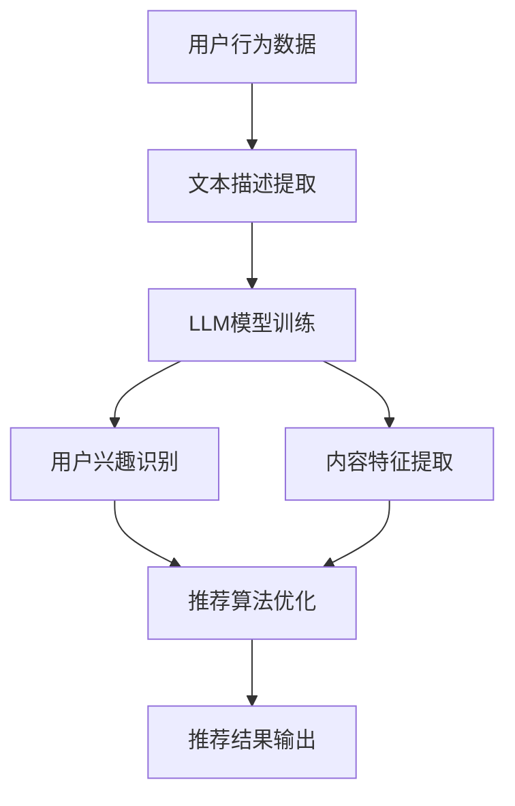

                 

关键词：LLM、音视频内容推荐、自然语言处理、机器学习、算法、应用领域、数学模型

> 摘要：本文深入探讨了大型语言模型（LLM）在音视频内容推荐系统中的应用潜力。通过对LLM的工作原理、核心算法、数学模型及其在具体场景中的实践，本文旨在为音视频内容推荐领域提供有价值的见解和方向。

## 1. 背景介绍

随着互联网的快速发展，音视频内容已成为人们获取信息、娱乐和学习的主要途径。然而，海量的音视频内容也让用户在选择上面临巨大的困扰。传统的内容推荐系统主要通过用户行为数据、内容特征和协同过滤等方法进行推荐，但其在处理复杂、多样化的音视频内容时，往往存在推荐质量不高、个性化不足等问题。为了提升内容推荐的准确性和个性化程度，自然语言处理（NLP）技术逐渐被引入到音视频内容推荐中。其中，大型语言模型（LLM）作为NLP领域的重要技术之一，展现了极大的潜力。

本文旨在探讨LLM在音视频内容推荐中的潜力，从核心概念、算法原理、数学模型到实际应用场景，进行全面的分析和探讨，以期为音视频内容推荐领域的发展提供新的思路。

## 2. 核心概念与联系

### 2.1. 大型语言模型（LLM）

大型语言模型（LLM）是一种基于深度学习技术构建的、具有强大语言理解和生成能力的模型。与传统的语言模型相比，LLM具有以下几个显著特点：

1. **大规模训练数据**：LLM通常使用数以亿计的文本数据进行训练，这使得模型能够掌握丰富的语言知识。
2. **深度神经网络结构**：LLM采用多层的深度神经网络结构，使得模型能够更好地捕捉语言的复杂性和上下文关系。
3. **自适应能力**：LLM通过训练能够自适应地调整参数，从而在不同任务和应用场景中表现出色。

### 2.2. 音视频内容推荐

音视频内容推荐是指基于用户兴趣和行为，为用户推荐符合其需求的音视频内容。音视频内容推荐的关键在于如何准确理解用户兴趣、音视频内容的特征以及两者之间的匹配关系。

### 2.3. LLM与音视频内容推荐的关系

LLM在音视频内容推荐中的应用主要体现在以下几个方面：

1. **文本分析与理解**：LLM能够对音视频内容的文本描述进行分析和理解，从而提取关键信息，为推荐提供依据。
2. **用户兴趣识别**：LLM可以通过分析用户的搜索历史、评论、点赞等行为，识别用户的兴趣和偏好。
3. **内容特征提取**：LLM可以基于文本描述，提取音视频内容的关键特征，如主题、情感、风格等。
4. **推荐算法优化**：LLM可以用于优化推荐算法，提升推荐质量和个性化程度。

### 2.4. Mermaid流程图



## 3. 核心算法原理 & 具体操作步骤

### 3.1. 算法原理概述

LLM在音视频内容推荐中的核心算法主要包括文本描述提取、用户兴趣识别、内容特征提取和推荐算法优化。以下是各算法原理的简要概述：

1. **文本描述提取**：通过自然语言处理技术，从音视频内容的文本描述中提取关键信息，如关键词、主题、情感等。
2. **用户兴趣识别**：利用LLM对用户的搜索历史、评论、点赞等行为进行分析，识别用户的兴趣和偏好。
3. **内容特征提取**：基于文本描述，使用LLM提取音视频内容的关键特征，如主题、情感、风格等。
4. **推荐算法优化**：将提取的用户兴趣和内容特征作为输入，优化推荐算法，提升推荐质量和个性化程度。

### 3.2. 算法步骤详解

1. **文本描述提取**：
   - 数据预处理：对音视频内容的文本描述进行分词、去停用词、词性标注等操作。
   - 特征提取：使用词嵌入技术（如Word2Vec、BERT等），将文本描述转换为向量表示。

2. **用户兴趣识别**：
   - 用户行为数据预处理：对用户的搜索历史、评论、点赞等行为数据进行分词、去停用词、词性标注等操作。
   - 用户兴趣提取：利用LLM对用户行为数据进行建模，提取用户兴趣关键词。

3. **内容特征提取**：
   - 文本描述预处理：对音视频内容的文本描述进行分词、去停用词、词性标注等操作。
   - 内容特征提取：利用LLM对文本描述进行建模，提取内容关键词和主题。

4. **推荐算法优化**：
   - 用户兴趣和内容特征融合：将用户兴趣关键词和内容特征进行融合，构建用户兴趣模型。
   - 推荐算法优化：使用用户兴趣模型和内容特征，优化推荐算法，如矩阵分解、协同过滤等。

### 3.3. 算法优缺点

**优点**：
- **强大的文本理解能力**：LLM能够对音视频内容的文本描述进行深入理解和分析，提取关键信息。
- **自适应能力**：LLM通过训练能够自适应地调整参数，在不同任务和应用场景中表现出色。
- **个性化推荐**：基于用户的兴趣和内容特征，LLM能够实现更加个性化的推荐。

**缺点**：
- **计算资源消耗**：LLM的训练和推理需要大量的计算资源，对硬件要求较高。
- **数据依赖**：LLM的效果依赖于大量的训练数据和用户行为数据，数据质量对推荐效果有较大影响。

### 3.4. 算法应用领域

LLM在音视频内容推荐中的应用领域主要包括以下几个方面：

1. **视频网站**：如YouTube、B站等，利用LLM实现视频推荐，提升用户体验。
2. **音频平台**：如Spotify、QQ音乐等，利用LLM实现音乐推荐，满足用户个性化需求。
3. **教育平台**：如Coursera、网易云课堂等，利用LLM实现课程推荐，提升学习效果。
4. **社交媒体**：如微博、Twitter等，利用LLM实现内容推荐，提升用户活跃度。

## 4. 数学模型和公式 & 详细讲解 & 举例说明

### 4.1. 数学模型构建

LLM在音视频内容推荐中的数学模型主要包括用户兴趣模型和内容特征模型。

**用户兴趣模型**：
设用户兴趣词汇集合为\( U = \{u_1, u_2, ..., u_n\} \)，用户兴趣向量表示为\( \mathbf{u} \in \mathbb{R}^n \)。

**内容特征模型**：
设内容特征词汇集合为\( V = \{v_1, v_2, ..., v_m\} \)，内容特征向量表示为\( \mathbf{v} \in \mathbb{R}^m \)。

### 4.2. 公式推导过程

**用户兴趣模型**：
设用户行为数据集合为\( D = \{d_1, d_2, ..., d_k\} \)，其中\( d_i \)表示用户在时间\( t_i \)的行为。

对用户行为数据\( D \)进行预处理，提取用户兴趣词汇集合\( U \)。

使用词嵌入技术，将用户兴趣词汇集合\( U \)转换为向量表示，得到\( \mathbf{u} \)。

**内容特征模型**：
对音视频内容的文本描述进行预处理，提取内容特征词汇集合\( V \)。

使用词嵌入技术，将内容特征词汇集合\( V \)转换为向量表示，得到\( \mathbf{v} \)。

### 4.3. 案例分析与讲解

**案例背景**：

某视频网站希望通过LLM技术实现视频推荐，提升用户体验。

**案例步骤**：

1. **用户行为数据收集**：
   收集用户的浏览历史、点赞、评论等行为数据，构建用户行为数据集合\( D \)。

2. **用户兴趣识别**：
   对用户行为数据\( D \)进行预处理，提取用户兴趣词汇集合\( U \)。

3. **视频内容特征提取**：
   对视频内容的文本描述进行预处理，提取内容特征词汇集合\( V \)。

4. **用户兴趣模型构建**：
   使用词嵌入技术，将用户兴趣词汇集合\( U \)转换为向量表示，得到用户兴趣向量\( \mathbf{u} \)。

5. **内容特征模型构建**：
   使用词嵌入技术，将内容特征词汇集合\( V \)转换为向量表示，得到内容特征向量\( \mathbf{v} \)。

6. **推荐算法优化**：
   将用户兴趣向量\( \mathbf{u} \)和内容特征向量\( \mathbf{v} \)作为输入，优化推荐算法，提升推荐质量和个性化程度。

**案例分析**：

以某用户A为例，其兴趣词汇包括“科技”、“编程”、“人工智能”等。通过LLM技术，将兴趣词汇转换为向量表示，得到用户兴趣向量\( \mathbf{u} \)。同时，对于某视频B，其文本描述中包含“人工智能”、“深度学习”、“神经网络”等关键词，通过LLM技术，将其转换为向量表示，得到内容特征向量\( \mathbf{v} \)。

通过计算用户兴趣向量\( \mathbf{u} \)和内容特征向量\( \mathbf{v} \)的相似度，可以确定视频B与用户A的兴趣匹配程度。基于相似度计算结果，视频网站可以为用户A推荐与其兴趣相关的视频内容。

## 5. 项目实践：代码实例和详细解释说明

### 5.1. 开发环境搭建

为了实践LLM在音视频内容推荐中的应用，我们需要搭建以下开发环境：

1. **操作系统**：Ubuntu 20.04
2. **编程语言**：Python 3.8
3. **深度学习框架**：TensorFlow 2.6
4. **自然语言处理库**：NLTK、spaCy
5. **数据预处理工具**：pandas、numpy

### 5.2. 源代码详细实现

以下是一个简单的LLM音视频内容推荐项目的代码实现，主要包括文本描述提取、用户兴趣识别、内容特征提取和推荐算法优化等步骤。

```python
import tensorflow as tf
import pandas as pd
import numpy as np
from nltk.tokenize import word_tokenize
from nltk.corpus import stopwords
from sklearn.feature_extraction.text import TfidfVectorizer
from sklearn.metrics.pairwise import cosine_similarity

# 文本描述提取
def extract_text_descriptions(video_data):
    # 对视频文本描述进行分词、去停用词等操作
    stop_words = set(stopwords.words('english'))
    text_descriptions = []
    for description in video_data['description']:
        words = word_tokenize(description)
        filtered_words = [word for word in words if word not in stop_words]
        text_descriptions.append(' '.join(filtered_words))
    return text_descriptions

# 用户兴趣识别
def identify_user_interest(user_data):
    # 对用户行为数据进行分析，提取用户兴趣关键词
    interest_words = set()
    for behavior in user_data['behavior']:
        words = word_tokenize(behavior)
        interest_words.update(word for word in words if word not in stopwords.words('english'))
    return interest_words

# 内容特征提取
def extract_content_features(video_data, interest_words):
    # 对视频文本描述进行预处理，提取内容特征
    vectorizer = TfidfVectorizer(vocabulary=interest_words)
    content_features = vectorizer.fit_transform(video_data['description'])
    return content_features

# 推荐算法优化
def recommend_videos(user_interest, content_features, videos):
    # 计算用户兴趣与视频内容的相似度，推荐相似度较高的视频
    similarity = cosine_similarity(user_interest, content_features)
    recommended_videos = np.argsort(similarity[0])[::-1]
    return videos.iloc[recommended_videos]

# 数据加载
video_data = pd.read_csv('video_data.csv')
user_data = pd.read_csv('user_data.csv')

# 文本描述提取
text_descriptions = extract_text_descriptions(video_data)

# 用户兴趣识别
user_interest = identify_user_interest(user_data)

# 内容特征提取
content_features = extract_content_features(video_data, user_interest)

# 推荐算法优化
recommended_videos = recommend_videos(user_interest, content_features, video_data)

# 输出推荐结果
print(recommended_videos.head())
```

### 5.3. 代码解读与分析

1. **文本描述提取**：
   - 使用NLTK库进行文本分词和去停用词操作，提取视频文本描述的关键词。

2. **用户兴趣识别**：
   - 对用户行为数据进行分析，提取用户兴趣关键词，构建用户兴趣词汇集合。

3. **内容特征提取**：
   - 使用TF-IDF向量

