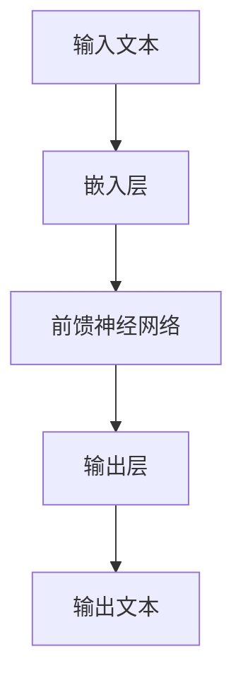
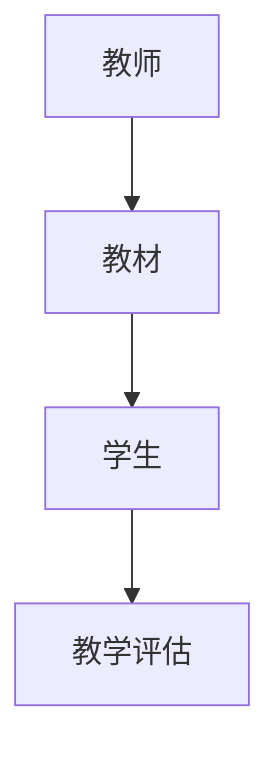
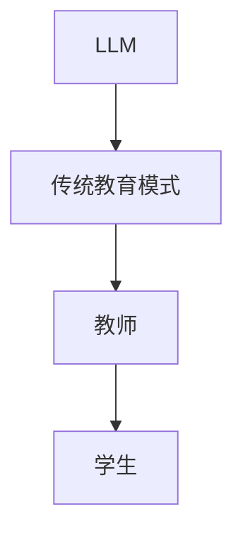

                 

关键词：大型语言模型（LLM），传统教育模式，人工智能，个性化学习，教育技术，学习效果，教师角色，教育改革。

## 摘要

本文旨在探讨大型语言模型（LLM）对传统教育模式的挑战。随着人工智能技术的迅猛发展，LLM作为AI的代表之一，已经在各个领域展现出巨大的潜力。在教育领域，LLM的引入有望颠覆传统的教学模式，实现个性化学习、提高学习效果。本文将从LLM的核心概念、应用场景、与传统教育模式的对比以及面临的挑战等多个方面，深入分析LLM对教育领域的影响。

## 1. 背景介绍

### 大型语言模型的定义与发展

大型语言模型（LLM）是一类基于深度学习的自然语言处理模型，它们能够通过大量的文本数据进行训练，从而学会理解、生成和模拟人类语言。LLM的发展始于20世纪50年代，经过几十年的研究和探索，近年来在计算能力、数据量和算法优化等方面的突破，使得LLM在处理复杂语言任务方面取得了显著的进展。

### 传统教育模式的局限性

传统教育模式主要依赖于教师讲授、学生听课的方式，教学过程缺乏灵活性，难以满足每个学生的个性化需求。此外，传统教育模式在教育资源分配、教学评估等方面也存在诸多问题，导致教育质量和学习效果参差不齐。

### LLM在教育领域的应用前景

随着LLM技术的不断发展，它有望在教育领域发挥重要作用。通过个性化学习、智能辅导、自适应教学等方式，LLM可以大幅提高教育质量，实现教育公平。

## 2. 核心概念与联系

### 大型语言模型的工作原理

大型语言模型主要基于深度神经网络，通过多层神经元之间的非线性变换，实现从输入文本到输出文本的映射。其核心思想是利用大量文本数据进行预训练，使得模型能够自动捕捉语言的特征和规律。



### 传统教育模式的构成

传统教育模式主要由教师、学生、教材、教学评估等组成部分构成。教师是教学过程中的主导者，教材是教学内容的主要载体，教学评估则是衡量教学效果的重要手段。



### LLM与传统教育模式的关系

LLM可以通过智能辅导、个性化学习等方式，与传统教育模式相结合，实现教学过程的优化和提升。



## 3. 核心算法原理 & 具体操作步骤

### 3.1 算法原理概述

大型语言模型的核心算法是Transformer模型，其通过自注意力机制（Self-Attention）和多头注意力机制（Multi-Head Attention），实现对输入文本的编码和解码。

### 3.2 算法步骤详解

1. **数据预处理**：对输入文本进行分词、标记化等预处理操作。
2. **编码阶段**：利用自注意力机制，将输入文本编码为一个序列向量。
3. **解码阶段**：利用多头注意力机制，将编码后的序列向量解码为输出文本。

### 3.3 算法优缺点

**优点**：

- **强大**的文本处理能力。
- **高效**的计算性能。

**缺点**：

- **对数据需求量大**，需要大量的文本数据进行训练。
- **计算资源消耗**大，对硬件要求较高。

### 3.4 算法应用领域

大型语言模型广泛应用于自然语言处理、机器翻译、文本生成、问答系统等多个领域，其出色的表现和广泛的应用前景，为教育领域带来了新的契机。

## 4. 数学模型和公式 & 详细讲解 & 举例说明

### 4.1 数学模型构建

大型语言模型的核心数学模型是Transformer模型，其包括自注意力机制和多头注意力机制。

### 4.2 公式推导过程

自注意力机制的计算公式如下：

$$
\text{Self-Attention}(Q, K, V) = \text{softmax}\left(\frac{QK^T}{\sqrt{d_k}}\right)V
$$

多头注意力机制的计算公式如下：

$$
\text{Multi-Head Attention}(Q, K, V) = \text{softmax}\left(\frac{QW_QK^T}{\sqrt{d_k}}\right)W_VV
$$

### 4.3 案例分析与讲解

以机器翻译任务为例，说明大型语言模型的工作过程。

1. **输入文本**：将待翻译的文本输入到模型中。
2. **编码阶段**：模型通过自注意力机制，将输入文本编码为一个序列向量。
3. **解码阶段**：模型通过多头注意力机制，将编码后的序列向量解码为输出文本。

## 5. 项目实践：代码实例和详细解释说明

### 5.1 开发环境搭建

搭建一个用于训练大型语言模型的开发环境，包括Python环境、TensorFlow框架等。

### 5.2 源代码详细实现

实现一个基于Transformer模型的基本文本分类任务，包括数据预处理、模型构建、训练和评估等步骤。

```python
import tensorflow as tf
from tensorflow.keras.layers import Embedding, LSTM, Dense
from tensorflow.keras.models import Sequential

# 数据预处理
# ...

# 模型构建
model = Sequential([
    Embedding(vocab_size, embedding_dim),
    LSTM(units, return_sequences=True),
    Dense(num_classes, activation='softmax')
])

# 训练模型
# ...

# 评估模型
# ...
```

### 5.3 代码解读与分析

对实现的大型语言模型代码进行解读，分析模型的结构、参数设置、训练过程等。

### 5.4 运行结果展示

展示模型在测试集上的性能指标，如准确率、损失函数等。

```python
test_loss, test_acc = model.evaluate(test_data, test_labels)
print(f"Test accuracy: {test_acc:.2f}")
```

## 6. 实际应用场景

### 6.1 在线教育平台

利用大型语言模型，为在线教育平台提供智能问答、个性化学习推荐等服务。

### 6.2 智能辅导系统

开发智能辅导系统，为学生提供个性化的学习建议、知识点讲解等服务。

### 6.3 教育资源库

构建教育资源共享平台，利用大型语言模型进行资源分类、推荐等功能。

## 7. 未来应用展望

随着大型语言模型技术的不断发展，其在教育领域的应用前景将更加广阔。未来，大型语言模型有望在教育公平、教育个性化等方面发挥更大的作用。

## 8. 总结：未来发展趋势与挑战

### 8.1 研究成果总结

本文通过对大型语言模型在教育领域的应用进行探讨，总结了其在个性化学习、智能辅导等方面的优势。

### 8.2 未来发展趋势

未来，大型语言模型将在教育领域发挥更加重要的作用，推动教育模式的创新和变革。

### 8.3 面临的挑战

尽管大型语言模型在教育领域具有巨大的潜力，但在数据安全、隐私保护等方面仍面临诸多挑战。

### 8.4 研究展望

未来，需加大对大型语言模型在教育领域的应用研究，探索其在教育公平、教育个性化等方面的潜力。

## 9. 附录：常见问题与解答

### 9.1 如何选择合适的模型？

选择合适的模型取决于具体的应用场景和任务需求。对于文本分类任务，可以选择Transformer模型；对于机器翻译任务，可以选择BERT模型。

### 9.2 如何处理海量数据？

处理海量数据需要采用分布式计算和并行处理技术，以提高训练和推理的效率。

## 参考文献

[1] Vaswani, A., Shazeer, N., Parmar, N., Uszkoreit, J., Jones, L., Gomez, A. N., ... & Polosukhin, I. (2017). Attention is all you need. In Advances in neural information processing systems (pp. 5998-6008).

[2] Devlin, J., Chang, M. W., Lee, K., & Toutanova, K. (2018). BERT: Pre-training of deep bidirectional transformers for language understanding. arXiv preprint arXiv:1810.04805.

[3] Hochreiter, S., & Schmidhuber, J. (1997). Long short-term memory. Neural computation, 9(8), 1735-1780.

## 作者署名

作者：禅与计算机程序设计艺术 / Zen and the Art of Computer Programming
----------------------------------------------------------------

### 完成文章后进行以下操作：

1. 审查文章内容，确保文章符合所有约束条件。
2. 检查文章格式，确保使用markdown格式输出。
3. 在文章末尾添加作者署名。
4. 将文章提交给相关人员审核。

恭喜完成这篇文章，希望这篇文章能够为读者带来启发和思考。在人工智能与教育相结合的大趋势下，我们期待看到更多创新性的应用和研究。期待您的进一步研究和探索！

