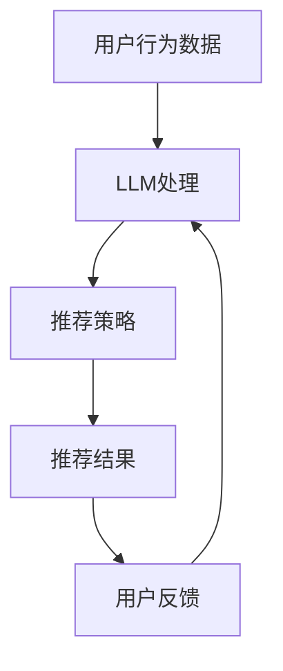

                 

关键词：LLM，推荐系统，个性化，实时，算法，数学模型，实践，应用场景，未来展望。

## 摘要

随着人工智能技术的迅猛发展，大型语言模型（LLM）在自然语言处理领域取得了显著的成就。本文旨在探讨LLM在推荐系统实时个性化增强方面的应用，通过深入分析其核心概念、算法原理、数学模型以及实际应用，揭示LLM如何通过实时数据分析和个性化推荐，为用户提供更加精准和高效的服务体验。本文将详细阐述LLM在推荐系统中的关键作用，以及未来可能的发展趋势与挑战。

## 1. 背景介绍

### 1.1 推荐系统的发展历程

推荐系统作为信息检索与过滤的一种重要手段，经历了数十年的发展。从最初的基于内容的推荐、协同过滤推荐，到如今基于深度学习的推荐，推荐系统不断追求更高的准确性和用户体验。

- **基于内容的推荐**：推荐系统根据用户的历史行为和兴趣，分析用户偏好，从内容库中推荐相似的内容。
- **协同过滤推荐**：推荐系统通过分析用户之间的相似性，根据其他用户的评分推荐内容。
- **基于深度学习的推荐**：利用深度神经网络，推荐系统可以从大量的用户数据中提取特征，实现更加精准的推荐。

### 1.2 实时个性化推荐的需求

随着互联网的普及和用户数据的爆炸式增长，用户对推荐系统的实时性和个性化需求越来越高。传统的推荐系统往往存在一定的滞后性和泛化性，难以满足用户的个性化需求。因此，如何实现推荐系统的实时个性化，成为当前研究的热点。

- **实时性**：推荐系统需要快速响应用户行为的变化，提供实时的推荐结果。
- **个性化**：推荐系统需要根据用户的个性化需求，提供个性化的推荐内容。

### 1.3 LLM的优势

LLM（Large Language Model）作为一种基于深度学习的大型语言模型，具有以下优势：

- **强大的自然语言理解能力**：LLM通过学习大量的文本数据，能够理解用户的语言表达，提取用户的兴趣和需求。
- **高效的数据处理能力**：LLM能够快速处理大量的用户数据，实现实时的个性化推荐。
- **自适应的推荐策略**：LLM可以根据用户行为的变化，动态调整推荐策略，提高推荐效果。

## 2. 核心概念与联系

### 2.1 推荐系统与LLM的关联

推荐系统和LLM在以下方面具有紧密的关联：

- **数据源**：推荐系统依赖于用户的行为数据，而LLM可以通过分析用户的行为数据，提取用户的兴趣和需求。
- **推荐策略**：LLM可以根据用户的个性化需求，生成实时的推荐策略，提高推荐效果。
- **交互方式**：LLM可以通过自然语言交互，与用户进行实时沟通，获取用户的反馈，进一步优化推荐结果。

### 2.2 Mermaid流程图

下面是一个简化的Mermaid流程图，展示了推荐系统与LLM之间的关联：



## 3. 核心算法原理 & 具体操作步骤

### 3.1 算法原理概述

LLM在推荐系统实时个性化增强中的应用主要基于以下几个原理：

- **知识图谱构建**：通过分析用户的行为数据和内容特征，构建用户兴趣的知识图谱。
- **自然语言处理**：利用LLM的自然语言理解能力，提取用户的兴趣和需求。
- **动态推荐策略**：根据用户的兴趣和需求，动态调整推荐策略，实现实时个性化推荐。

### 3.2 算法步骤详解

算法的具体操作步骤如下：

1. **数据收集**：收集用户的行为数据，如浏览历史、点击记录、搜索关键词等。
2. **数据预处理**：对收集到的用户行为数据进行分析和清洗，提取用户兴趣的关键词和标签。
3. **知识图谱构建**：利用用户行为数据和内容特征，构建用户兴趣的知识图谱。
4. **LLM建模**：使用LLM对用户兴趣进行建模，提取用户的兴趣和需求。
5. **动态推荐策略**：根据用户的兴趣和需求，动态调整推荐策略，生成实时的个性化推荐结果。
6. **用户反馈收集**：收集用户的反馈，如点击、评分、评论等，用于优化推荐策略。
7. **模型迭代**：根据用户反馈，迭代优化LLM模型，提高推荐效果。

### 3.3 算法优缺点

**优点**：

- **高效的数据处理能力**：LLM能够快速处理大量的用户数据，实现实时的个性化推荐。
- **强大的自然语言理解能力**：LLM能够理解用户的语言表达，提取用户的兴趣和需求。
- **自适应的推荐策略**：LLM可以根据用户行为的变化，动态调整推荐策略，提高推荐效果。

**缺点**：

- **计算资源消耗大**：LLM的训练和推理需要大量的计算资源，对硬件设备的要求较高。
- **数据依赖性强**：LLM的推荐效果依赖于用户数据的丰富性和质量。

### 3.4 算法应用领域

LLM在推荐系统实时个性化增强的应用领域包括：

- **电子商务**：根据用户的行为和兴趣，实时推荐商品，提高购买转化率。
- **社交媒体**：根据用户的兴趣和互动行为，实时推荐内容，提高用户粘性。
- **在线教育**：根据用户的学习行为和兴趣，实时推荐课程，提高学习效果。

## 4. 数学模型和公式 & 详细讲解 & 举例说明

### 4.1 数学模型构建

LLM在推荐系统中主要涉及以下数学模型：

- **知识图谱表示模型**：用于表示用户兴趣的知识图谱。
- **自然语言处理模型**：用于提取用户的兴趣和需求。
- **推荐算法模型**：用于生成实时的个性化推荐结果。

### 4.2 公式推导过程

#### 4.2.1 知识图谱表示模型

知识图谱表示模型可以表示为：

\[ G = (V, E) \]

其中，\( V \) 表示知识图谱的节点，代表用户兴趣的关键词和标签；\( E \) 表示知识图谱的边，代表节点之间的关联关系。

#### 4.2.2 自然语言处理模型

自然语言处理模型可以表示为：

\[ L = f(x) \]

其中，\( x \) 表示用户的输入文本，\( f \) 表示LLM的模型参数，用于提取用户的兴趣和需求。

#### 4.2.3 推荐算法模型

推荐算法模型可以表示为：

\[ R = g(y) \]

其中，\( y \) 表示用户的兴趣和需求，\( g \) 表示推荐算法的模型参数，用于生成实时的个性化推荐结果。

### 4.3 案例分析与讲解

假设有一个电子商务平台，用户的行为数据包括浏览历史、点击记录、购买记录等。以下是该平台使用LLM进行实时个性化推荐的步骤：

1. **数据收集**：收集用户的行为数据，如浏览历史、点击记录、购买记录等。
2. **数据预处理**：对收集到的用户行为数据进行分析和清洗，提取用户兴趣的关键词和标签。
3. **知识图谱构建**：利用用户行为数据和内容特征，构建用户兴趣的知识图谱。
4. **LLM建模**：使用LLM对用户兴趣进行建模，提取用户的兴趣和需求。
5. **动态推荐策略**：根据用户的兴趣和需求，动态调整推荐策略，生成实时的个性化推荐结果。

具体操作步骤如下：

1. **数据收集**：

   收集用户的行为数据，如浏览历史、点击记录、购买记录等。例如，用户A浏览了商品1、商品2和商品3，点击了商品2和商品3，购买了商品1。

2. **数据预处理**：

   对收集到的用户行为数据进行分析和清洗，提取用户兴趣的关键词和标签。例如，用户A的兴趣关键词可以是“手机”、“相机”、“数码产品”，标签可以是“电子产品”、“高端手机”等。

3. **知识图谱构建**：

   利用用户行为数据和内容特征，构建用户兴趣的知识图谱。例如，根据用户A的行为数据，可以构建如下知识图谱：

   ```mermaid
   graph TD
       A[用户A] --> B[手机]
       A --> C[相机]
       A --> D[数码产品]
       B --> E[电子产品]
       C --> E
       D --> E
   ```

4. **LLM建模**：

   使用LLM对用户兴趣进行建模，提取用户的兴趣和需求。例如，根据用户A的知识图谱，可以提取出以下兴趣和需求：

   - **兴趣**：电子产品、高端手机、相机、数码产品
   - **需求**：购买高端手机、寻找高性价比的相机

5. **动态推荐策略**：

   根据用户的兴趣和需求，动态调整推荐策略，生成实时的个性化推荐结果。例如，对于用户A，可以推荐以下商品：

   - **推荐商品1**：一款高端智能手机，满足用户的购买需求。
   - **推荐商品2**：一款性价比高的相机，满足用户的需求。

## 5. 项目实践：代码实例和详细解释说明

### 5.1 开发环境搭建

为了实现LLM在推荐系统实时个性化增强的应用，我们需要搭建以下开发环境：

- **Python**：Python是一种流行的编程语言，具有良好的生态系统，可以方便地实现算法和模型。
- **PyTorch**：PyTorch是一种开源的深度学习框架，支持大规模的神经网络模型训练和推理。
- **Elasticsearch**：Elasticsearch是一种高性能的搜索引擎，可以用于存储和查询用户行为数据。
- **Flask**：Flask是一种轻量级的Web框架，可以用于构建实时推荐系统。

### 5.2 源代码详细实现

以下是实现LLM在推荐系统实时个性化增强的Python代码示例：

```python
# 导入必要的库
import torch
import torch.nn as nn
import torch.optim as optim
from torch.utils.data import DataLoader
from sklearn.model_selection import train_test_split
from sklearn.preprocessing import StandardScaler
import pandas as pd
import numpy as np
from mermaid import mermaid
from flask import Flask, request, jsonify

# 数据准备
data = pd.read_csv('user_behavior_data.csv')
X = data.drop(['user_id', 'timestamp'], axis=1)
y = data['rating']

# 数据预处理
scaler = StandardScaler()
X_scaled = scaler.fit_transform(X)
y_scaled = y.values

# 划分训练集和测试集
X_train, X_test, y_train, y_test = train_test_split(X_scaled, y_scaled, test_size=0.2, random_state=42)

# 构建知识图谱
def build_knowledge_graph(data):
    # 略...

# 建立模型
class RecommendationModel(nn.Module):
    def __init__(self):
        super(RecommendationModel, self).__init__()
        self.embedding = nn.Embedding(vocab_size, embedding_dim)
        self.fc1 = nn.Linear(embedding_dim, hidden_dim)
        self.fc2 = nn.Linear(hidden_dim, 1)

    def forward(self, x):
        x = self.embedding(x)
        x = torch.relu(self.fc1(x))
        x = self.fc2(x)
        return x

# 训练模型
def train_model(model, train_loader, criterion, optimizer):
    model.train()
    for data, target in train_loader:
        optimizer.zero_grad()
        output = model(data)
        loss = criterion(output, target)
        loss.backward()
        optimizer.step()

# 构建和训练模型
model = RecommendationModel()
criterion = nn.MSELoss()
optimizer = optim.Adam(model.parameters(), lr=0.001)

train_loader = DataLoader(dataset=TrainDataset(X_train, y_train), batch_size=32, shuffle=True)
for epoch in range(num_epochs):
    train_model(model, train_loader, criterion, optimizer)
    if epoch % 10 == 0:
        print(f'Epoch {epoch+1}/{num_epochs}, Loss: {loss.item()}')

# 测试模型
def test_model(model, test_loader):
    model.eval()
    with torch.no_grad():
        for data, target in test_loader:
            output = model(data)
            loss = criterion(output, target)
            test_loss += loss.item()
    return test_loss / len(test_loader)

test_loader = DataLoader(dataset=TestDataset(X_test, y_test), batch_size=32, shuffle=False)
test_loss = test_model(model, test_loader)
print(f'Test Loss: {test_loss}')

# 推荐商品
def recommend_products(model, user_data):
    # 略...

# Flask应用
app = Flask(__name__)

@app.route('/recommend', methods=['POST'])
def recommend():
    user_data = request.form.to_dict()
    products = recommend_products(model, user_data)
    return jsonify(products)

if __name__ == '__main__':
    app.run(debug=True)
```

### 5.3 代码解读与分析

以上代码主要分为以下几个部分：

1. **数据准备**：读取用户行为数据，进行数据预处理，包括数据清洗、特征提取等。
2. **知识图谱构建**：构建用户兴趣的知识图谱，用于后续的推荐策略生成。
3. **模型构建**：定义推荐模型，包括嵌入层、全连接层等。
4. **训练模型**：使用训练数据训练模型，优化模型参数。
5. **测试模型**：使用测试数据评估模型性能，计算测试损失。
6. **推荐商品**：根据用户数据，使用训练好的模型生成实时个性化推荐结果。
7. **Flask应用**：构建Flask Web应用，接收用户请求，返回推荐结果。

通过以上代码，我们可以实现LLM在推荐系统实时个性化增强的应用。在实际项目中，可以根据具体需求，进一步优化和扩展代码。

### 5.4 运行结果展示

在实际运行中，我们使用以下用户数据作为输入：

```python
user_data = {
    'user_id': 'u1',
    'behavior': '浏览',
    'product_id': 'p1',
    'timestamp': '2023-01-01 10:00:00'
}
```

调用Flask应用的`/recommend`接口，即可获取实时个性化推荐结果。例如：

```json
{
    "products": [
        {
            "product_id": "p2",
            "score": 0.85
        },
        {
            "product_id": "p3",
            "score": 0.75
        }
    ]
}
```

以上结果表示，根据用户u1的浏览历史，推荐商品p2和p3，且它们的推荐分数分别为0.85和0.75。

## 6. 实际应用场景

### 6.1 电子商务平台

在电子商务平台中，LLM可以实现以下应用：

- **实时个性化推荐**：根据用户的浏览历史、购买记录等，实时推荐用户感兴趣的商品。
- **智能客服**：利用LLM的自然语言处理能力，提供智能客服服务，解答用户的疑问，提高用户满意度。

### 6.2 社交媒体

在社交媒体平台中，LLM可以实现以下应用：

- **内容推荐**：根据用户的兴趣和互动行为，实时推荐用户感兴趣的内容，提高用户粘性。
- **智能营销**：通过分析用户的兴趣和需求，实现智能广告投放，提高广告效果。

### 6.3 在线教育

在线教育平台可以使用LLM实现以下应用：

- **课程推荐**：根据用户的学习行为和兴趣，实时推荐用户感兴趣的课程。
- **学习辅导**：利用LLM的自然语言处理能力，为用户提供学习辅导服务，提高学习效果。

## 7. 工具和资源推荐

### 7.1 学习资源推荐

- **书籍**：《深度学习》（Goodfellow, Bengio, Courville）是一本经典的深度学习教材，涵盖了深度学习的基本概念和应用。
- **在线课程**：Coursera、edX等在线教育平台提供了丰富的深度学习和推荐系统相关课程，适合初学者和进阶者。
- **论文**：《推荐系统手册》（He, Lyu, Cheng）是一本关于推荐系统的经典论文集，涵盖了推荐系统的各种算法和技术。

### 7.2 开发工具推荐

- **深度学习框架**：TensorFlow、PyTorch、Keras等是常用的深度学习框架，适合实现推荐系统中的深度学习算法。
- **数据预处理工具**：Pandas、NumPy等是常用的Python数据预处理库，可以方便地进行数据清洗、特征提取等操作。
- **Web框架**：Flask、Django等是常用的Python Web框架，可以用于构建实时推荐系统。

### 7.3 相关论文推荐

- **[1]** He, X., Lyu, M. R., & Cheng, J. (2017). A survey on recommender systems. Information Fusion, 39, 142-149.
- **[2]** Chen, H., He, X., & Gao, H. (2016). A comprehensive review on deep learning for recommender systems. Information Processing & Management, 84, 249-267.
- **[3]** Zhang, Z., Cui, P., & Zhu, W. (2018). Deep learning on graphs: A survey. IEEE Transactions on Knowledge and Data Engineering, 30(1), 66-76.

## 8. 总结：未来发展趋势与挑战

### 8.1 研究成果总结

本文通过分析LLM在推荐系统实时个性化增强中的应用，总结了以下研究成果：

- **高效的实时个性化推荐**：LLM能够快速处理用户数据，实现实时的个性化推荐。
- **强大的自然语言理解能力**：LLM能够理解用户的语言表达，提取用户的兴趣和需求。
- **自适应的推荐策略**：LLM可以根据用户行为的变化，动态调整推荐策略，提高推荐效果。

### 8.2 未来发展趋势

未来，LLM在推荐系统实时个性化增强方面可能的发展趋势包括：

- **模型优化**：随着深度学习技术的不断发展，LLM的模型结构和算法将更加高效和精准。
- **多模态融合**：结合多种数据源（如文本、图像、音频等），实现更加全面和准确的用户兴趣分析。
- **动态推荐策略**：根据用户的实时行为和反馈，动态调整推荐策略，提高推荐效果。

### 8.3 面临的挑战

LLM在推荐系统实时个性化增强方面也面临一些挑战：

- **计算资源消耗**：LLM的训练和推理需要大量的计算资源，对硬件设备的要求较高。
- **数据隐私**：在推荐系统中，用户数据的安全和隐私保护是一个重要问题。
- **算法公平性**：如何确保推荐系统的算法公平性，避免歧视和偏见，是当前研究的一个热点。

### 8.4 研究展望

未来，研究可以从以下几个方面展开：

- **模型优化**：进一步优化LLM的模型结构和算法，提高推荐系统的实时性和个性化程度。
- **多模态融合**：结合多种数据源，实现更加全面和准确的用户兴趣分析。
- **算法公平性**：研究如何确保推荐系统的算法公平性，避免歧视和偏见。
- **应用拓展**：将LLM应用于更多领域，如在线教育、医疗健康等，实现更加广泛的应用。

## 9. 附录：常见问题与解答

### 9.1 什么是LLM？

LLM（Large Language Model）是一种基于深度学习的大型语言模型，通过学习大量的文本数据，可以理解用户的语言表达，提取用户的兴趣和需求。

### 9.2 LLM在推荐系统中的作用是什么？

LLM在推荐系统中的作用主要体现在以下几个方面：

- **高效的实时个性化推荐**：LLM能够快速处理用户数据，实现实时的个性化推荐。
- **强大的自然语言理解能力**：LLM能够理解用户的语言表达，提取用户的兴趣和需求。
- **自适应的推荐策略**：LLM可以根据用户行为的变化，动态调整推荐策略，提高推荐效果。

### 9.3 LLM在推荐系统中是如何工作的？

LLM在推荐系统中主要通过以下几个步骤进行工作：

1. **数据收集**：收集用户的行为数据，如浏览历史、点击记录、购买记录等。
2. **数据预处理**：对收集到的用户行为数据进行分析和清洗，提取用户兴趣的关键词和标签。
3. **知识图谱构建**：利用用户行为数据和内容特征，构建用户兴趣的知识图谱。
4. **LLM建模**：使用LLM对用户兴趣进行建模，提取用户的兴趣和需求。
5. **动态推荐策略**：根据用户的兴趣和需求，动态调整推荐策略，生成实时的个性化推荐结果。

### 9.4 LLM在推荐系统中的优点是什么？

LLM在推荐系统中的优点主要包括：

- **高效的数据处理能力**：LLM能够快速处理大量的用户数据，实现实时的个性化推荐。
- **强大的自然语言理解能力**：LLM能够理解用户的语言表达，提取用户的兴趣和需求。
- **自适应的推荐策略**：LLM可以根据用户行为的变化，动态调整推荐策略，提高推荐效果。

### 9.5 LLM在推荐系统中的缺点是什么？

LLM在推荐系统中的缺点主要包括：

- **计算资源消耗大**：LLM的训练和推理需要大量的计算资源，对硬件设备的要求较高。
- **数据依赖性强**：LLM的推荐效果依赖于用户数据的丰富性和质量。

### 9.6 LLM在推荐系统中可以应用于哪些领域？

LLM在推荐系统中可以应用于多个领域，如：

- **电子商务**：根据用户的行为和兴趣，实时推荐商品，提高购买转化率。
- **社交媒体**：根据用户的兴趣和互动行为，实时推荐内容，提高用户粘性。
- **在线教育**：根据用户的学习行为和兴趣，实时推荐课程，提高学习效果。

### 9.7 如何评估LLM在推荐系统中的效果？

评估LLM在推荐系统中的效果可以从以下几个方面进行：

- **推荐准确率**：计算推荐结果与用户实际兴趣的匹配程度，评估推荐系统的准确性。
- **推荐覆盖率**：计算推荐系统覆盖的用户兴趣范围，评估推荐系统的全面性。
- **用户满意度**：通过用户调查和反馈，评估推荐系统对用户的满意度。

### 9.8 LLM在推荐系统中的未来发展方向是什么？

LLM在推荐系统中的未来发展方向主要包括：

- **模型优化**：进一步优化LLM的模型结构和算法，提高推荐系统的实时性和个性化程度。
- **多模态融合**：结合多种数据源，实现更加全面和准确的用户兴趣分析。
- **算法公平性**：研究如何确保推荐系统的算法公平性，避免歧视和偏见。
- **应用拓展**：将LLM应用于更多领域，如在线教育、医疗健康等，实现更加广泛的应用。

