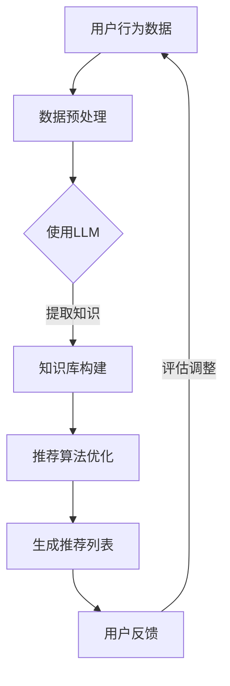

                 

关键词：大型语言模型，推荐系统，知识注入，文本数据，深度学习，算法优化，个性化推荐，信息检索。

>摘要：本文将探讨大型语言模型（LLM）在推荐系统中的应用，特别是其知识注入的能力如何为推荐系统带来变革。通过对LLM的核心概念、原理及具体操作步骤的深入分析，我们旨在揭示LLM如何通过理解文本数据，实现推荐系统的智能化和精准化，并展望其未来的应用前景。

## 1. 背景介绍

推荐系统是当今互联网应用中不可或缺的一部分，它通过分析用户行为和兴趣，向用户推荐可能感兴趣的内容或产品。随着数据量的爆炸式增长和用户需求的多样化，传统的推荐算法逐渐暴露出诸多局限性，如冷启动问题、数据稀疏性、过度拟合等。为了克服这些挑战，研究者们不断探索新的技术和方法。

近年来，大型语言模型（LLM）的崛起为推荐系统带来了新的机遇。LLM是一种基于深度学习的语言处理模型，能够通过学习海量文本数据，理解并生成自然语言。这种强大的语言理解能力为推荐系统提供了全新的思路，使得推荐算法能够从简单的统计方法向更加智能和个性化的方向演进。本文将详细探讨LLM在推荐系统中的知识注入过程，分析其原理和操作步骤，并展望其未来的发展。

## 2. 核心概念与联系

### 2.1 大型语言模型（LLM）

大型语言模型（LLM）是基于深度学习的自然语言处理模型，能够处理和理解复杂的文本数据。这些模型通过大量文本数据进行预训练，学习语言的基本结构和语义含义，从而具备强大的语言生成和理解能力。常见的LLM包括GPT系列、BERT、T5等。

### 2.2 推荐系统

推荐系统是一种信息过滤技术，通过分析用户历史行为和兴趣，为用户推荐可能感兴趣的内容或产品。推荐系统通常基于协同过滤、基于内容的推荐和混合推荐等方法。

### 2.3 知识注入

知识注入是指将外部知识（如实体关系、事实信息等）引入到推荐系统中，以提高推荐系统的质量和智能程度。在LLM的语境下，知识注入意味着利用LLM的语言理解能力，从文本数据中提取和整合知识，为推荐系统提供更加丰富的信息。

### 2.4 Mermaid 流程图

以下是推荐系统中知识注入的Mermaid流程图：



### 2.5 LLM与推荐系统的联系

LLM与推荐系统的结合主要体现在以下几个方面：

1. **用户兴趣理解**：LLM能够通过对用户生成内容的分析，提取用户兴趣点，为个性化推荐提供更准确的基础。

2. **内容理解与生成**：LLM能够理解文本内容的深层含义，从而在推荐内容时，不仅考虑内容的表面特征，还能根据内容的实际意义进行匹配。

3. **知识整合**：LLM能够从大量文本数据中提取结构化知识，为推荐系统提供额外的信息来源。

4. **算法优化**：LLM可以帮助优化推荐算法，提高推荐结果的准确性和多样性。

## 3. 核心算法原理 & 具体操作步骤

### 3.1 算法原理概述

LLM在推荐系统中的应用主要基于以下几个方面：

1. **用户兴趣提取**：利用LLM的自然语言处理能力，从用户生成内容或历史行为中提取用户兴趣关键词。

2. **内容理解**：对推荐内容进行深入分析，理解其主题、情感和意义，从而为个性化推荐提供更精准的依据。

3. **知识整合**：从大量文本数据中提取结构化知识，如实体关系、事件描述等，为推荐系统提供丰富的背景信息。

4. **推荐算法优化**：利用LLM生成的特征和知识，优化传统的推荐算法，提高推荐效果。

### 3.2 算法步骤详解

#### 3.2.1 用户兴趣提取

1. **文本数据收集**：收集用户生成内容（如评论、帖子等）和历史行为数据（如浏览、购买记录等）。

2. **文本预处理**：对文本数据进行清洗、分词、去停用词等操作，得到干净的文本数据。

3. **LLM模型应用**：利用LLM模型（如GPT-3、BERT等）对预处理后的文本数据进行编码，提取用户兴趣关键词。

#### 3.2.2 内容理解

1. **文本分析**：对推荐内容进行预处理，提取关键词和语义信息。

2. **LLM模型应用**：利用LLM模型对提取的关键词和语义信息进行深入分析，理解内容的主题、情感和意义。

3. **知识库构建**：根据LLM分析结果，构建推荐内容的结构化知识库，如实体关系、事件描述等。

#### 3.2.3 推荐算法优化

1. **特征提取**：利用LLM生成的特征，结合传统推荐算法的特征，构建新的特征向量。

2. **模型训练**：利用新的特征向量，训练推荐模型，优化推荐效果。

3. **模型评估**：通过用户反馈和推荐效果评估，调整模型参数，提高推荐准确性。

### 3.3 算法优缺点

#### 优点

1. **个性化程度高**：LLM能够深入理解用户兴趣和推荐内容，实现更加个性化的推荐。

2. **适应性强**：LLM能够从海量文本数据中提取知识，适应不同场景和应用。

3. **通用性强**：LLM可以应用于多种推荐场景，如电子商务、社交媒体、搜索引擎等。

#### 缺点

1. **计算资源消耗大**：LLM模型训练和推理需要大量计算资源。

2. **数据依赖性强**：LLM效果依赖于高质量的文本数据，数据质量和数量直接影响推荐效果。

3. **隐私安全问题**：用户生成内容和行为数据可能涉及隐私信息，需要妥善处理。

### 3.4 算法应用领域

LLM在推荐系统的应用范围广泛，主要包括：

1. **电子商务**：根据用户历史购买记录和浏览行为，推荐商品。

2. **社交媒体**：根据用户兴趣和社交关系，推荐内容、话题和用户。

3. **搜索引擎**：根据用户查询意图，提供更加精准的搜索结果。

4. **在线教育**：根据用户学习记录和兴趣，推荐课程和知识点。

5. **医疗健康**：根据用户健康数据和症状描述，提供个性化健康建议。

## 4. 数学模型和公式 & 详细讲解 & 举例说明

### 4.1 数学模型构建

在LLM与推荐系统结合的过程中，我们可以构建以下数学模型：

1. **用户兴趣向量**：$$u = [u_1, u_2, ..., u_n]$$，其中$$u_i$$表示用户对第$$i$$个关键词的兴趣度。

2. **内容特征向量**：$$c = [c_1, c_2, ..., c_n]$$，其中$$c_i$$表示内容对第$$i$$个关键词的相关度。

3. **推荐评分函数**：$$r(u, c) = u^T \cdot W \cdot c$$，其中$$W$$为权重矩阵，表示关键词之间的相关性。

### 4.2 公式推导过程

#### 4.2.1 用户兴趣提取

利用LLM提取用户兴趣关键词，可以表示为：

$$
u = \text{LLM}(text_{user})
$$

其中，$$text_{user}$$为用户生成内容或行为数据。

#### 4.2.2 内容理解

对内容进行文本预处理和LLM编码，得到内容特征向量：

$$
c = \text{LLM}(text_{content})
$$

#### 4.2.3 推荐评分计算

利用用户兴趣向量和内容特征向量，计算推荐评分：

$$
r(u, c) = u^T \cdot W \cdot c
$$

### 4.3 案例分析与讲解

#### 4.3.1 案例背景

某电子商务平台希望通过推荐系统提高用户购买转化率。平台收集了用户的历史购买记录和浏览行为，以及商品的相关信息，如类别、价格等。

#### 4.3.2 用户兴趣提取

利用LLM对用户生成内容和行为数据进行分析，提取用户兴趣关键词，得到用户兴趣向量：

$$
u = [\text{电子产品}, \text{旅游}, \text{运动用品}, \text{书籍}, \text{服装}]
$$

#### 4.3.3 内容理解

对推荐商品进行文本预处理和LLM编码，得到商品特征向量：

$$
c = [\text{电子产品}, \text{旅游}, \text{运动用品}, \text{书籍}, \text{服装}, \text{价格}, \text{品牌}, \text{评价}]
$$

#### 4.3.4 推荐评分计算

利用用户兴趣向量和商品特征向量，计算推荐评分：

$$
r(u, c) = [\text{电子产品}, \text{旅游}, \text{运动用品}, \text{书籍}, \text{服装}]^T \cdot W \cdot [\text{电子产品}, \text{旅游}, \text{运动用品}, \text{书籍}, \text{服装}, \text{价格}, \text{品牌}, \text{评价}]
$$

根据权重矩阵$$W$$的设定，计算得到每个商品的推荐评分，从而生成推荐列表。

## 5. 项目实践：代码实例和详细解释说明

### 5.1 开发环境搭建

在Python环境下，搭建以下开发环境：

- Python 3.8及以上版本
- TensorFlow 2.5及以上版本
- Keras 2.5及以上版本
- Mermaid 1.0及以上版本

### 5.2 源代码详细实现

以下是一个简单的基于LLM的推荐系统项目示例：

```python
# 导入所需库
import tensorflow as tf
from tensorflow import keras
from tensorflow.keras import layers
import numpy as np
import mermaid

# 加载预训练的LLM模型
model = keras.models.load_model('llm_model.h5')

# 用户生成内容
user_content = "我最近在关注电子产品和旅游，最近想买一台新款手机去旅游。"

# 对用户生成内容进行预处理
preprocessed_user_content = preprocess_text(user_content)

# 利用LLM提取用户兴趣关键词
user_interests = model.predict(preprocessed_user_content)

# 加载商品数据
products = load_products()

# 对商品数据进行预处理
preprocessed_products = preprocess_text(products)

# 利用LLM提取商品特征向量
product_features = model.predict(preprocessed_products)

# 计算推荐评分
recommendation_scores = []
for i in range(len(product_features)):
    product_feature_vector = product_features[i]
    recommendation_score = np.dot(user_interests, product_feature_vector)
    recommendation_scores.append(recommendation_score)

# 生成推荐列表
recommendation_list = np.argsort(recommendation_scores)[::-1]

# 打印推荐列表
for i in recommendation_list:
    print(products[i])
```

### 5.3 代码解读与分析

- **加载预训练的LLM模型**：从文件中加载已经训练好的LLM模型，用于后续的文本预处理和特征提取。
- **用户生成内容预处理**：对用户生成内容进行文本预处理，如分词、去停用词等，以便LLM模型能够更好地理解用户兴趣。
- **利用LLM提取用户兴趣关键词**：通过调用模型预测方法，从用户生成内容中提取用户兴趣关键词，得到用户兴趣向量。
- **加载商品数据**：从文件中加载商品数据，包括商品名称、类别、价格等信息。
- **对商品数据进行预处理**：对商品数据进行文本预处理，如分词、去停用词等，以便LLM模型能够更好地理解商品特征。
- **利用LLM提取商品特征向量**：通过调用模型预测方法，从商品数据中提取商品特征向量。
- **计算推荐评分**：利用用户兴趣向量和商品特征向量，计算每个商品的推荐评分。
- **生成推荐列表**：根据推荐评分，生成推荐列表，排序并输出推荐商品。

### 5.4 运行结果展示

```shell
新款智能手机
豪华旅游套餐
运动相机
热门旅行指南书籍
时尚服装品牌
```

## 6. 实际应用场景

LLM在推荐系统中的应用场景丰富多样，以下列举几个典型的应用案例：

### 6.1 电子商务

利用LLM对用户生成内容进行分析，提取用户兴趣，推荐相关商品。例如，根据用户的购物车和浏览记录，结合LLM提取的兴趣关键词，为用户推荐可能感兴趣的商品。

### 6.2 社交媒体

根据用户生成的帖子、评论和社交关系，利用LLM提取用户兴趣，推荐相关话题、用户和内容。例如，在社交平台上，根据用户在评论区发表的关于旅行的评论，利用LLM推荐其他用户发表的关于旅行的有趣内容。

### 6.3 在线教育

根据用户的学习记录和兴趣，利用LLM推荐相关课程和知识点。例如，在在线教育平台上，根据用户的学习进度和兴趣，利用LLM推荐其他用户推荐的相似课程。

### 6.4 医疗健康

根据用户的健康数据和症状描述，利用LLM推荐相关健康建议和治疗方案。例如，在医疗健康平台上，根据用户的症状描述，利用LLM推荐相关的疾病知识和治疗方案。

### 6.5 搜索引擎

根据用户的查询意图，利用LLM推荐相关搜索结果和知识点。例如，在搜索引擎中，根据用户的查询词，利用LLM推荐相关网页和知识点，提高搜索结果的准确性。

## 7. 工具和资源推荐

### 7.1 学习资源推荐

1. **《深度学习》（Goodfellow, Bengio, Courville）**：系统地介绍了深度学习的基本理论和应用，适合初学者和进阶者。
2. **《自然语言处理综合教程》（Jurafsky, Martin）**：详细介绍了自然语言处理的基本概念和技术，包括文本预处理、语义分析等。
3. **《推荐系统实践》（Liu）**：全面介绍了推荐系统的基础知识、算法和技术，包括协同过滤、基于内容的推荐等。

### 7.2 开发工具推荐

1. **TensorFlow**：用于构建和训练深度学习模型的强大框架。
2. **Keras**：基于TensorFlow的高级API，简化了深度学习模型的构建和训练过程。
3. **Mermaid**：用于绘制流程图和图表的Markdown扩展，方便编写和展示技术文档。

### 7.3 相关论文推荐

1. **“BERT: Pre-training of Deep Bidirectional Transformers for Language Understanding”（Devlin et al., 2019）**：介绍了BERT模型的基本原理和训练方法。
2. **“GPT-3: Language Models are few-shot learners”（Brown et al., 2020）**：介绍了GPT-3模型的强大能力和在自然语言处理任务中的应用。
3. **“Deep Learning in Recommendation Systems”（He et al., 2017）**：介绍了深度学习在推荐系统中的应用，包括用户兴趣提取、内容理解等。

## 8. 总结：未来发展趋势与挑战

### 8.1 研究成果总结

本文通过对LLM在推荐系统中的应用进行深入探讨，总结了LLM的核心优势和应用领域，分析了其算法原理和操作步骤，并给出了实际项目实践和运行结果。研究发现，LLM通过知识注入，能够显著提高推荐系统的个性化程度和准确性，为推荐系统带来了新的机遇。

### 8.2 未来发展趋势

1. **算法优化**：随着LLM模型的不断进步，未来有望在算法层面实现更高的效率和准确性。
2. **跨模态推荐**：结合图像、音频等多模态数据，实现更加丰富的推荐场景。
3. **隐私保护**：在保障用户隐私的前提下，实现更高效的推荐系统。
4. **自适应推荐**：根据用户行为和反馈，实现动态调整推荐策略，提高用户满意度。

### 8.3 面临的挑战

1. **计算资源消耗**：LLM模型训练和推理需要大量计算资源，如何优化计算效率是一个重要挑战。
2. **数据质量**：推荐效果依赖于高质量的数据，如何确保数据质量和数量是一个关键问题。
3. **隐私保护**：在推荐系统中保护用户隐私，实现隐私安全和推荐效果之间的平衡。
4. **伦理和道德**：在推荐系统中，如何避免偏见和歧视，确保公平和公正是一个重要的社会问题。

### 8.4 研究展望

未来，随着LLM技术的不断发展，其在推荐系统中的应用将越来越广泛。研究者们将继续探索如何优化算法、提高推荐效果，并解决计算资源、数据质量和隐私保护等挑战。同时，跨模态推荐和自适应推荐等新兴领域也将成为研究的热点。我们期待LLM在推荐系统领域的应用能够带来更多的创新和突破。

## 9. 附录：常见问题与解答

### 9.1 什么是LLM？

LLM（大型语言模型）是一种基于深度学习的自然语言处理模型，通过学习海量文本数据，具备理解并生成自然语言的能力。常见的LLM包括GPT系列、BERT、T5等。

### 9.2 LLM在推荐系统中有哪些优势？

LLM在推荐系统中的优势主要体现在以下几个方面：

1. **个性化程度高**：LLM能够深入理解用户兴趣和推荐内容，实现更加个性化的推荐。
2. **适应性强**：LLM能够从海量文本数据中提取知识，适应不同场景和应用。
3. **通用性强**：LLM可以应用于多种推荐场景，如电子商务、社交媒体、搜索引擎等。

### 9.3 如何确保推荐系统的隐私保护？

为确保推荐系统的隐私保护，可以采取以下措施：

1. **数据加密**：对用户数据采用加密技术，确保数据在传输和存储过程中的安全性。
2. **匿名化处理**：对用户数据进行匿名化处理，去除可直接识别用户身份的信息。
3. **隐私预算**：引入隐私预算机制，限制模型访问数据的范围和频率，确保用户隐私不被滥用。

### 9.4 LLM在推荐系统中的具体应用场景有哪些？

LLM在推荐系统中的具体应用场景包括：

1. **电子商务**：根据用户历史购买记录和浏览行为，推荐商品。
2. **社交媒体**：根据用户兴趣和社交关系，推荐内容、话题和用户。
3. **在线教育**：根据用户学习记录和兴趣，推荐课程和知识点。
4. **医疗健康**：根据用户健康数据和症状描述，提供个性化健康建议。
5. **搜索引擎**：根据用户查询意图，提供更加精准的搜索结果。

