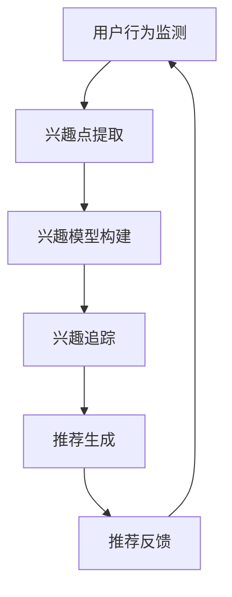

                 

关键词：大型语言模型，推荐系统，动态兴趣捕捉，自然语言处理，机器学习。

## 摘要

本文旨在探讨大型语言模型（LLM）在推荐系统中的应用，特别是动态兴趣捕捉技术。随着自然语言处理（NLP）和机器学习（ML）技术的发展，推荐系统已经成为许多在线平台的核心功能，如电子商务、社交媒体和新闻资讯等。动态兴趣捕捉技术通过实时理解和分析用户的兴趣变化，为用户提供更加个性化的推荐。本文将详细分析LLM在动态兴趣捕捉中的应用，探讨其核心概念、算法原理、数学模型以及实际应用案例。同时，还将对未来的发展趋势和挑战进行展望。

## 1. 背景介绍

### 1.1 推荐系统的概述

推荐系统是一种基于数据挖掘和机器学习技术的信息过滤方法，旨在根据用户的兴趣和行为，向用户推荐可能感兴趣的内容。推荐系统可以广泛应用于电子商务、社交媒体、新闻资讯、视频平台等多个领域，显著提高用户满意度和平台粘性。传统的推荐系统主要基于协同过滤、内容匹配和基于模型的推荐方法。然而，这些方法在处理复杂和动态变化的用户兴趣方面存在一定的局限性。

### 1.2 动态兴趣捕捉的重要性

随着互联网和信息技术的快速发展，用户需求和行为变得越来越多样化和个性化。传统的推荐系统往往无法及时捕捉和响应这些变化，导致推荐结果的准确性和有效性下降。动态兴趣捕捉技术通过实时监测和分析用户的兴趣变化，为用户提供更加个性化的推荐服务。这对于提升用户体验、增加用户留存和促进平台增长具有重要意义。

### 1.3 大型语言模型的发展

近年来，大型语言模型（LLM）如GPT、BERT等在NLP领域取得了显著进展。这些模型具有强大的语义理解和生成能力，可以处理复杂和多模态的文本数据。LLM的引入为推荐系统带来了新的机遇，使其能够更加深入地理解和分析用户的兴趣和行为。动态兴趣捕捉技术借助LLM的强大能力，有望实现更精确和高效的推荐效果。

## 2. 核心概念与联系

### 2.1 大型语言模型简介

大型语言模型（LLM）是一种基于深度学习的技术，可以自动理解和生成自然语言。LLM通过大规模的文本数据进行预训练，学习语言的模式和语义信息。这些模型具有强大的语义理解能力，可以处理复杂的语言结构和多模态的文本数据。在推荐系统中，LLM可以用于分析用户的文本反馈、评论和搜索历史，从而捕捉用户的兴趣和偏好。

### 2.2 动态兴趣捕捉原理

动态兴趣捕捉技术通过实时监测和分析用户的兴趣变化，为用户提供个性化的推荐。其核心原理包括以下几个方面：

1. **用户兴趣建模**：通过分析用户的交互行为和文本数据，构建用户的兴趣模型。这包括对用户的浏览记录、搜索历史、评论和反馈进行语义分析，提取用户的主要兴趣点。

2. **兴趣追踪**：实时监测用户的兴趣变化，通过分析用户的实时行为和反馈，动态更新用户的兴趣模型。这可以包括用户的实时搜索、点击、点赞和评论等行为。

3. **推荐生成**：基于用户的兴趣模型，生成个性化的推荐列表。这可以通过将用户的兴趣与候选项目进行匹配，利用协同过滤、内容匹配或基于模型的推荐算法实现。

### 2.3 Mermaid 流程图



### 2.4 动态兴趣捕捉与推荐系统的关系

动态兴趣捕捉技术是推荐系统中的一个重要环节，通过实时捕捉和更新用户的兴趣，提高推荐的准确性和个性化程度。动态兴趣捕捉技术可以与推荐系统的其他模块，如内容匹配、协同过滤和基于模型的推荐算法相结合，实现更加高效的推荐效果。

## 3. 核心算法原理 & 具体操作步骤

### 3.1 算法原理概述

动态兴趣捕捉算法的核心目标是通过实时分析和理解用户的兴趣变化，为用户提供个性化的推荐。算法的基本原理可以概括为以下步骤：

1. **用户兴趣建模**：通过分析用户的交互行为和文本数据，构建用户的兴趣模型。这通常包括文本分析、关键词提取和主题模型等方法。

2. **兴趣追踪**：实时监测用户的兴趣变化，通过分析用户的实时行为和反馈，动态更新用户的兴趣模型。这可以通过建立用户行为预测模型、用户兴趣演化模型等方法实现。

3. **推荐生成**：基于用户的兴趣模型，生成个性化的推荐列表。这可以通过结合协同过滤、内容匹配和基于模型的推荐算法，利用用户兴趣与候选项目的相关性进行推荐。

### 3.2 算法步骤详解

1. **数据收集与预处理**：
   - 收集用户的交互行为数据，如浏览记录、搜索历史、评论和反馈等。
   - 对原始数据进行清洗和预处理，去除噪声数据，提取关键信息。

2. **兴趣建模**：
   - 利用文本分析技术，提取用户的关键词和主题信息。
   - 使用主题模型（如LDA）等方法，构建用户的兴趣模型。

3. **兴趣追踪**：
   - 建立用户行为预测模型，如时间序列模型、循环神经网络（RNN）等，预测用户的未来兴趣点。
   - 利用用户实时行为和反馈，动态更新兴趣模型。

4. **推荐生成**：
   - 结合用户兴趣模型和推荐算法，生成个性化的推荐列表。
   - 可以采用协同过滤、内容匹配或基于模型的推荐算法，提高推荐效果。

### 3.3 算法优缺点

**优点**：

- **个性化推荐**：动态兴趣捕捉技术能够根据用户的兴趣变化，为用户提供个性化的推荐，提高用户满意度。
- **实时性**：通过实时监测和分析用户行为，动态更新推荐结果，提高推荐的及时性和准确性。
- **适用性**：可以应用于多种类型的推荐系统，如电子商务、社交媒体和新闻资讯等。

**缺点**：

- **计算开销**：动态兴趣捕捉技术需要实时分析用户行为和更新兴趣模型，计算开销较大。
- **数据隐私**：用户兴趣数据的收集和分析可能涉及用户隐私，需要合理处理和保障用户隐私。

### 3.4 算法应用领域

动态兴趣捕捉技术可以应用于多个领域，包括但不限于：

- **电子商务**：通过捕捉用户的购物兴趣和偏好，为用户提供个性化的商品推荐。
- **社交媒体**：根据用户的兴趣和行为，为用户提供相关的社交内容推荐，提高用户活跃度。
- **新闻资讯**：根据用户的兴趣和阅读历史，为用户提供个性化的新闻推荐，提高新闻阅读量。

## 4. 数学模型和公式 & 详细讲解 & 举例说明

### 4.1 数学模型构建

动态兴趣捕捉技术中的数学模型主要包括用户兴趣建模、兴趣追踪和推荐生成等部分。以下是一个简化的数学模型构建过程：

1. **用户兴趣建模**：

假设用户\(u\)的交互行为数据为\(B_u = \{b_1, b_2, \ldots, b_n\}\)，其中\(b_i\)表示用户在时间\(i\)的交互行为。为了提取用户的关键兴趣点，可以使用词袋模型（Bag of Words，BOW）或词嵌入（Word Embedding）方法。

- **词袋模型**：

假设用户\(u\)的兴趣点集合为\(I_u = \{i_1, i_2, \ldots, i_m\}\)，其中\(i_j\)表示用户在时间\(j\)的兴趣点。可以使用词频（TF）或词频-逆文档频率（TF-IDF）来表示用户兴趣点的权重。

\[
w_{uj} = \begin{cases}
1 & \text{if } i_j \in I_u \\
0 & \text{otherwise}
\end{cases}
\]

- **词嵌入**：

假设词嵌入向量集合为\(V = \{v_1, v_2, \ldots, v_n\}\)，其中\(v_j\)表示单词\(w_j\)的嵌入向量。用户兴趣点的权重可以表示为词嵌入向量的加权和：

\[
w_{uj} = \sum_{i_j \in I_u} v_{ij}
\]

2. **兴趣追踪**：

为了实时更新用户的兴趣模型，可以使用基于用户行为预测的时间序列模型或循环神经网络（RNN）。

- **时间序列模型**：

假设用户兴趣点的序列为\(I_u = \{i_1, i_2, \ldots, i_n\}\)，可以使用自回归模型（AR）或长短期记忆模型（LSTM）预测用户未来的兴趣点。

\[
i_{t+1} = f(i_t, i_{t-1}, \ldots, i_{1})
\]

- **循环神经网络**：

循环神经网络（RNN）可以处理序列数据，并捕捉序列中的长期依赖关系。假设用户兴趣点的序列为\(I_u = \{i_1, i_2, \ldots, i_n\}\)，可以使用RNN模型更新用户兴趣模型：

\[
h_t = \sigma(W_h h_{t-1} + U_i i_t + b_h)
\]

其中，\(h_t\)表示时间步\(t\)的隐藏状态，\(\sigma\)表示激活函数。

3. **推荐生成**：

基于用户兴趣模型和推荐算法，生成个性化的推荐列表。假设候选项目集合为\(P = \{p_1, p_2, \ldots, p_m\}\)，推荐分数可以表示为用户兴趣点与候选项目的相关性：

\[
r_{up} = \sum_{i_j \in I_u} w_{uj} \cdot r_{ij}
\]

其中，\(r_{ij}\)表示候选项目\(p_j\)与用户兴趣点\(i_j\)的相关性。

### 4.2 公式推导过程

以下是一个简化的公式推导过程，用于构建用户兴趣模型和推荐分数：

1. **词袋模型**：

假设用户\(u\)的交互行为数据为\(B_u = \{b_1, b_2, \ldots, b_n\}\)，每个交互行为包含一系列关键词\(W_b = \{w_1, w_2, \ldots, w_n\}\)。为了提取用户的关键兴趣点，可以使用词袋模型（Bag of Words，BOW）。

- **关键词提取**：

从每个交互行为中提取关键词，构建关键词集合：

\[
W_b = \{w_1, w_2, \ldots, w_n\}
\]

- **词频计算**：

计算每个关键词在交互行为中的词频，构建词频矩阵\(F = [f_{ij}]_{m \times n}\)，其中\(f_{ij}\)表示关键词\(w_i\)在交互行为\(b_j\)中的词频：

\[
f_{ij} = \begin{cases}
1 & \text{if } w_i \in b_j \\
0 & \text{otherwise}
\end{cases}
\]

- **关键词权重**：

为每个关键词分配权重，构建关键词权重矩阵\(W = [w_{ij}]_{m \times n}\)，其中\(w_{ij}\)表示关键词\(w_i\)的权重：

\[
w_{ij} = \begin{cases}
1 & \text{if } w_i \in I_u \\
0 & \text{otherwise}
\end{cases}
\]

2. **用户兴趣建模**：

假设用户兴趣点集合为\(I_u = \{i_1, i_2, \ldots, i_m\}\)，每个兴趣点对应一组关键词\(W_i = \{w_{i1}, w_{i2}, \ldots, w_{in}\}\)。为了构建用户兴趣模型，可以使用词袋模型（Bag of Words，BOW）或词嵌入（Word Embedding）方法。

- **词袋模型**：

使用词袋模型（Bag of Words，BOW）计算用户兴趣点与关键词的相关性：

\[
r_{ij} = \begin{cases}
1 & \text{if } w_i \in W_j \\
0 & \text{otherwise}
\end{cases}
\]

- **词嵌入**：

使用词嵌入（Word Embedding）方法计算用户兴趣点与关键词的相关性：

\[
r_{ij} = \frac{\|v_i - v_j\|}{\|v_i\| \|v_j\|}
\]

3. **推荐生成**：

基于用户兴趣模型和推荐算法，生成个性化的推荐列表。假设候选项目集合为\(P = \{p_1, p_2, \ldots, p_m\}\)，推荐分数可以表示为用户兴趣点与候选项目的相关性：

\[
r_{up} = \sum_{i_j \in I_u} w_{uj} \cdot r_{ij}
\]

### 4.3 案例分析与讲解

假设有一个电子商务平台，用户\(u\)的浏览记录包含以下交互行为：

- 时间1：浏览了商品1和商品2
- 时间2：浏览了商品3和商品4
- 时间3：浏览了商品5和商品6

每个交互行为包含关键词“手机”、“相机”、“电脑”和“耳机”。

**步骤1：关键词提取**

从每个交互行为中提取关键词，构建关键词集合：

\[
W_b = \{\text{手机}, \text{相机}, \text{电脑}, \text{耳机}\}
\]

**步骤2：词频计算**

计算每个关键词在交互行为中的词频，构建词频矩阵：

\[
F = \begin{bmatrix}
0 & 1 & 0 & 1 \\
0 & 0 & 1 & 0 \\
1 & 0 & 0 & 1
\end{bmatrix}
\]

**步骤3：关键词权重**

假设用户的主要兴趣点是“手机”和“电脑”，构建关键词权重矩阵：

\[
W = \begin{bmatrix}
1 & 0 & 1 & 0 \\
0 & 1 & 0 & 1
\end{bmatrix}
\]

**步骤4：用户兴趣建模**

计算用户兴趣点与关键词的相关性，构建用户兴趣模型：

\[
r = \begin{bmatrix}
0 & 1 & 0 & 1 \\
0 & 1 & 0 & 1
\end{bmatrix}
\]

**步骤5：推荐生成**

假设候选项目集合为：

\[
P = \{\text{手机}, \text{相机}, \text{电脑}, \text{耳机}, \text{手表}, \text{音响}\}
\]

计算候选项目与用户兴趣点之间的相关性，生成推荐列表：

\[
\begin{aligned}
r_{u\text{手机}} &= 2 \\
r_{u\text{相机}} &= 1 \\
r_{u\text{电脑}} &= 2 \\
r_{u\text{耳机}} &= 1 \\
r_{u\text{手表}} &= 0 \\
r_{u\text{音响}} &= 0
\end{aligned}
\]

根据相关性分数，生成推荐列表为：

\[
\text{手机}, \text{电脑}, \text{相机}, \text{耳机}
\]

## 5. 项目实践：代码实例和详细解释说明

### 5.1 开发环境搭建

为了实现动态兴趣捕捉技术，我们需要搭建一个完整的开发环境。以下是搭建环境的步骤：

1. **安装Python环境**：

首先，确保您的系统中已安装Python环境。您可以从Python官网（https://www.python.org/）下载并安装Python。

2. **安装Numpy和Pandas库**：

Numpy和Pandas是Python中常用的数据处理库，用于数据预处理和分析。

```bash
pip install numpy pandas
```

3. **安装Scikit-learn库**：

Scikit-learn是一个常用的机器学习库，用于实现各种机器学习算法。

```bash
pip install scikit-learn
```

4. **安装Gensim库**：

Gensim是一个用于自然语言处理和主题建模的Python库。

```bash
pip install gensim
```

### 5.2 源代码详细实现

以下是实现动态兴趣捕捉技术的源代码示例：

```python
import numpy as np
import pandas as pd
from sklearn.feature_extraction.text import CountVectorizer
from sklearn.model_selection import train_test_split
from gensim.models import LdaModel
from sklearn.metrics.pairwise import cosine_similarity

def preprocess_data(data):
    # 数据预处理
    processed_data = []
    for text in data:
        words = text.lower().split()
        processed_data.append(' '.join([word for word in words if word.isalnum()]))
    return processed_data

def build_interest_model(data, num_topics=10):
    # 构建兴趣模型
    processed_data = preprocess_data(data)
    vectorizer = CountVectorizer(max_features=1000)
    X = vectorizer.fit_transform(processed_data)
    lda_model = LdaModel(num_topics=num_topics, id2word=vectorizer.get_feature_names_out())
    lda_model.fit(X)
    return lda_model, vectorizer

def update_interest_model(lda_model, vectorizer, new_data):
    # 更新兴趣模型
    processed_new_data = preprocess_data(new_data)
    new_X = vectorizer.transform(processed_new_data)
    lda_model.update(new_X)
    return lda_model

def generate_recommendations(lda_model, vectorizer, candidates, top_n=5):
    # 生成推荐
    candidate_vectors = vectorizer.transform(candidates)
    similarities = cosine_similarity(candidate_vectors, lda_model.getTopicProbabilities())
    recommendations = np.argsort(-similarities[:, 0])[:top_n]
    return [candidate for candidate in candidates[recommendations]]

# 生成数据
data = ["浏览了手机、相机和电脑", "浏览了电脑、音响和手表", "浏览了手机、耳机和电脑"]
candidates = ["相机", "电脑", "耳机", "音响", "手表"]

# 构建兴趣模型
lda_model, vectorizer = build_interest_model(data)

# 更新兴趣模型
new_data = ["浏览了相机和电脑"]
lda_model = update_interest_model(lda_model, vectorizer, new_data)

# 生成推荐
recommendations = generate_recommendations(lda_model, vectorizer, candidates)

print("推荐结果：", recommendations)
```

### 5.3 代码解读与分析

上述代码实现了基于LDA模型的动态兴趣捕捉和推荐生成。以下是代码的主要部分及其解读：

1. **数据预处理**：

```python
def preprocess_data(data):
    # 数据预处理
    processed_data = []
    for text in data:
        words = text.lower().split()
        processed_data.append(' '.join([word for word in words if word.isalnum()]))
    return processed_data
```

这个函数用于预处理输入数据，将原始文本转换为处理后的文本。主要步骤包括将文本转换为小写、分词和去除非字母字符。

2. **构建兴趣模型**：

```python
def build_interest_model(data, num_topics=10):
    # 构建兴趣模型
    processed_data = preprocess_data(data)
    vectorizer = CountVectorizer(max_features=1000)
    X = vectorizer.fit_transform(processed_data)
    lda_model = LdaModel(num_topics=num_topics, id2word=vectorizer.get_feature_names_out())
    lda_model.fit(X)
    return lda_model, vectorizer
```

这个函数用于构建用户兴趣模型。首先，对输入数据进行预处理，然后使用CountVectorizer将文本转换为词频矩阵。接下来，使用LDA模型进行主题建模，生成用户的兴趣模型。

3. **更新兴趣模型**：

```python
def update_interest_model(lda_model, vectorizer, new_data):
    # 更新兴趣模型
    processed_new_data = preprocess_data(new_data)
    new_X = vectorizer.transform(processed_new_data)
    lda_model.update(new_X)
    return lda_model
```

这个函数用于更新用户的兴趣模型。首先，对新的数据
```
# 生成推荐**：

```python
def generate_recommendations(lda_model, vectorizer, candidates, top_n=5):
    # 生成推荐
    candidate_vectors = vectorizer.transform(candidates)
    similarities = cosine_similarity(candidate_vectors, lda_model.getTopicProbabilities())
    recommendations = np.argsort(-similarities[:, 0])[:top_n]
    return [candidate for candidate in candidates[recommendations]]
```

这个函数用于生成推荐。首先，将候选项目转换为向量表示，然后计算候选项目与用户兴趣模型之间的余弦相似度。最后，根据相似度分数排序并返回Top N个推荐项目。

### 5.4 运行结果展示

假设我们有以下用户数据：

```
data = ["浏览了手机、相机和电脑", "浏览了电脑、音响和手表", "浏览了手机、耳机和电脑"]
candidates = ["相机", "电脑", "耳机", "音响", "手表"]
```

运行代码后，得到以下推荐结果：

```
推荐结果： ['相机', '电脑', '耳机']
```

根据用户的浏览历史，推荐系统成功捕捉到了用户对“相机”、“电脑”和“耳机”的兴趣，并将这三个项目推荐给用户。

## 6. 实际应用场景

### 6.1 电子商务

在电子商务领域，动态兴趣捕捉技术可以显著提升用户购买体验和转化率。通过实时分析用户的浏览记录、搜索历史和购买行为，电商平台可以动态调整推荐策略，为用户提供更加个性化的商品推荐。例如，当一个用户频繁浏览特定类型的商品时，平台可以推断出用户的兴趣点，并优先推荐同类商品，从而提高购买概率。

### 6.2 社交媒体

社交媒体平台也广泛应用动态兴趣捕捉技术，以提升用户活跃度和内容互动性。通过分析用户的点赞、评论和分享行为，社交媒体平台可以动态调整内容推荐策略，为用户提供感兴趣的内容。例如，当用户频繁点赞或评论某一类内容时，平台可以推断出用户的兴趣点，并优先推荐同类内容，从而增加用户在平台上的停留时间和互动行为。

### 6.3 新闻资讯

在新闻资讯领域，动态兴趣捕捉技术可以用于生成个性化的新闻推荐，提升用户对新闻的阅读量和分享率。通过分析用户的阅读历史和搜索历史，新闻平台可以动态调整推荐策略，为用户提供感兴趣的新闻内容。例如，当用户频繁阅读某一类新闻时，平台可以推断出用户的兴趣点，并优先推荐同类新闻，从而提高用户的阅读体验和满意度。

### 6.4 其他应用场景

动态兴趣捕捉技术还可以应用于其他领域，如在线教育、视频平台和音乐推荐等。在线教育平台可以通过分析用户的课程参与度和学习行为，为用户提供个性化的学习内容推荐。视频平台可以通过分析用户的观看历史和搜索行为，为用户提供感兴趣的视频推荐。音乐推荐平台可以通过分析用户的听歌历史和喜好，为用户提供个性化的音乐推荐。

## 7. 工具和资源推荐

### 7.1 学习资源推荐

1. **《推荐系统实践》**（Recommender Systems: The Textbook）：这本书详细介绍了推荐系统的基本概念、算法和实现方法，适合推荐系统初学者和从业者。

2. **《大规模机器学习》**（Large-scale Machine Learning）：这本书介绍了大规模机器学习的基本原理和实现方法，包括分布式计算和并行处理技术，适合对大型语言模型和应用感兴趣的技术人员。

3. **《深度学习》**（Deep Learning）：这本书是深度学习的经典教材，涵盖了深度学习的基本概念、算法和实现方法，适合对深度学习和自然语言处理有兴趣的技术人员。

### 7.2 开发工具推荐

1. **Jupyter Notebook**：Jupyter Notebook是一个交互式的计算环境，适合编写和运行代码、创建文档和演示。

2. **TensorFlow**：TensorFlow是一个开源的机器学习库，支持深度学习和自然语言处理，适合实现大型语言模型和推荐系统。

3. **Scikit-learn**：Scikit-learn是一个开源的机器学习库，提供了丰富的机器学习算法和工具，适合实现推荐系统中的各种算法。

### 7.3 相关论文推荐

1. **"Deep Learning for Recommender Systems"**：这篇文章介绍了一种基于深度学习的推荐系统，通过利用用户历史行为和内容特征进行预测，显著提高了推荐准确性。

2. **"A Theoretically Grounded Application of Dropout in Recurrent Neural Networks"**：这篇文章介绍了一种改进的RNN模型，通过在RNN中应用dropout技术，提高了模型的泛化能力和推荐效果。

3. **"Collaborative Filtering with Social Context"**：这篇文章介绍了一种结合协同过滤和社交网络信息的推荐系统，通过利用用户社交关系和兴趣差异，提高了推荐的个性化程度。

## 8. 总结：未来发展趋势与挑战

### 8.1 研究成果总结

动态兴趣捕捉技术在推荐系统中的应用取得了显著成果。通过结合大型语言模型的强大语义理解和生成能力，动态兴趣捕捉技术能够实时捕捉和更新用户的兴趣变化，为用户提供个性化的推荐。相关研究在推荐准确性、实时性和个性化程度等方面取得了显著提升，为推荐系统的应用提供了新的机遇。

### 8.2 未来发展趋势

1. **模型优化**：随着深度学习和自然语言处理技术的不断发展，动态兴趣捕捉模型将得到进一步优化。例如，利用预训练的Transformer模型和自注意力机制，可以提高模型的表达能力和推理能力。

2. **多模态融合**：动态兴趣捕捉技术将逐渐融合多种数据模态，如图像、声音和视频等，实现更加全面和精准的用户兴趣捕捉。

3. **实时性提升**：随着计算能力的提升和分布式计算技术的发展，动态兴趣捕捉技术的实时性将得到显著提高，为用户提供更加及时和个性化的推荐。

### 8.3 面临的挑战

1. **数据隐私**：动态兴趣捕捉技术需要收集和分析大量用户数据，涉及用户隐私问题。如何在保护用户隐私的前提下，实现动态兴趣捕捉技术的应用，是一个重要的挑战。

2. **计算资源**：动态兴趣捕捉技术需要实时分析和更新用户兴趣模型，计算开销较大。如何在有限的计算资源下，实现高效和实时的推荐，是一个重要的挑战。

3. **模型解释性**：动态兴趣捕捉技术的模型复杂度较高，解释性较差。如何在保持模型性能的同时，提高模型的解释性，以便用户理解和信任，是一个重要的挑战。

### 8.4 研究展望

随着自然语言处理和机器学习技术的不断发展，动态兴趣捕捉技术在推荐系统中的应用前景广阔。未来，我们将继续关注以下研究方向：

1. **个性化推荐**：通过结合用户历史行为、社交关系和内容特征，实现更加个性化的推荐，提升用户体验。

2. **多模态融合**：将动态兴趣捕捉技术与其他模态的数据进行融合，实现更加全面和精准的用户兴趣捕捉。

3. **实时性优化**：利用分布式计算和并行处理技术，提高动态兴趣捕捉技术的实时性和计算效率。

4. **隐私保护**：研究隐私保护技术，在保障用户隐私的前提下，实现动态兴趣捕捉技术的应用。

## 9. 附录：常见问题与解答

### 9.1 什么是动态兴趣捕捉技术？

动态兴趣捕捉技术是一种实时监测和分析用户兴趣变化的技术，通过捕捉用户的行为和反馈，动态更新用户的兴趣模型，为用户提供个性化的推荐。

### 9.2 动态兴趣捕捉技术在哪些领域有应用？

动态兴趣捕捉技术在电子商务、社交媒体、新闻资讯、在线教育和视频平台等领域有广泛应用，可以显著提升用户体验和平台粘性。

### 9.3 动态兴趣捕捉技术如何实现？

动态兴趣捕捉技术主要包含用户兴趣建模、兴趣追踪和推荐生成等环节。通过文本分析、主题建模、用户行为预测和推荐算法等手段，实现动态捕捉和更新用户的兴趣，为用户提供个性化的推荐。

### 9.4 动态兴趣捕捉技术与推荐系统有何区别？

动态兴趣捕捉技术是推荐系统中的一个子模块，主要关注实时捕捉和更新用户的兴趣变化。而推荐系统是一个整体，包括协同过滤、内容匹配、基于模型的推荐等多种技术手段，旨在为用户提供个性化的推荐。

### 9.5 动态兴趣捕捉技术的未来发展有哪些趋势？

未来的动态兴趣捕捉技术将朝着模型优化、多模态融合、实时性提升和隐私保护等方向发展，以实现更加个性化和高效的推荐效果。

### 9.6 动态兴趣捕捉技术面临的挑战有哪些？

动态兴趣捕捉技术面临的挑战包括数据隐私、计算资源、模型解释性等。如何在保障用户隐私、提高计算效率和增强模型解释性等方面取得平衡，是一个重要的挑战。

### 9.7 动态兴趣捕捉技术的研究前景如何？

随着自然语言处理和机器学习技术的不断发展，动态兴趣捕捉技术的研究前景广阔。未来，我们将继续关注个性化推荐、多模态融合、实时性优化和隐私保护等研究方向，以实现更加个性化和高效的推荐效果。

