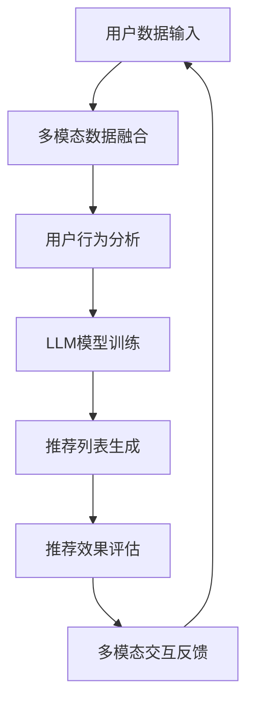

                 

关键词：大型语言模型（LLM），推荐系统，多模态交互，自然语言处理（NLP），用户行为分析，个性化推荐，计算机视觉，数据融合，交互式推荐引擎。

## 摘要

本文旨在探讨大型语言模型（LLM）在推荐系统中的应用，以及如何通过多模态交互设计提升用户体验和推荐效果。首先，我们将回顾LLM和推荐系统的基本概念，随后深入探讨多模态交互在推荐系统中的作用和实现方法。接着，本文将介绍一种基于LLM的多模态推荐算法，并展示其在实际项目中的应用。最后，我们将讨论未来的研究方向和面临的挑战。

## 1. 背景介绍

### 1.1 大型语言模型（LLM）

大型语言模型（LLM）如GPT-3，BERT等，凭借其在自然语言处理（NLP）领域的卓越表现，已经成为业界的热门话题。LLM通过深度学习技术从大量文本数据中学习语言模式，能够生成连贯、自然的文本，并进行语义理解和分析。这些特性使得LLM在信息检索、问答系统、文本生成等领域有着广泛的应用。

### 1.2 推荐系统

推荐系统是一种信息过滤技术，旨在为用户提供个性化的内容推荐。随着互联网信息的爆炸式增长，用户往往难以在庞大的信息海洋中找到自己感兴趣的内容。推荐系统通过分析用户的历史行为、偏好和兴趣，为用户提供个性化的内容推荐，从而提高用户的满意度和留存率。

### 1.3 多模态交互

多模态交互指的是将不同类型的数据（如文本、图像、声音等）进行融合和整合，以实现更全面、准确的信息理解和处理。在推荐系统中，多模态交互可以帮助系统更好地理解用户的偏好和需求，从而提高推荐效果。

## 2. 核心概念与联系

### 2.1 核心概念

- **大型语言模型（LLM）**：一种深度学习模型，能够对自然语言进行建模和分析。
- **推荐系统**：一种信息过滤技术，旨在为用户提供个性化的内容推荐。
- **多模态交互**：将不同类型的数据（如文本、图像、声音等）进行融合和整合，以实现更全面、准确的信息理解和处理。

### 2.2 联系与架构

以下是一个基于LLM的多模态推荐系统的架构：

```
+----------------+     +----------------+     +----------------+
|     用户       |     |     数据源      |     |   推荐引擎     |
+----------------+     +----------------+     +----------------+
          |                    |                    |
          |                    |                    |
          |                    |                    |
          v                    v                    v
+----------------+     +----------------+     +----------------+
| 多模态数据     |     |   用户行为分析  |     |   LLM模型      |
+----------------+     +----------------+     +----------------+
          |                    |                    |
          |                    |                    |
          |                    |                    |
          v                    v                    v
+----------------+     +----------------+     +----------------+
|   推荐列表     |     |   推荐效果评估  |     |   多模态交互   |
+----------------+     +----------------+     +----------------+
```

### 2.3 Mermaid 流程图

以下是多模态推荐系统中的主要流程的Mermaid流程图：



## 3. 核心算法原理 & 具体操作步骤

### 3.1 算法原理概述

基于LLM的多模态推荐算法主要分为以下几个步骤：

1. **数据收集**：收集用户的多模态数据，包括文本、图像、声音等。
2. **数据预处理**：对收集到的多模态数据进行分析和预处理，包括去噪、特征提取等。
3. **模型训练**：使用LLM模型对预处理后的数据进行训练，以便模型能够理解和预测用户的偏好。
4. **推荐生成**：根据用户的偏好和兴趣，使用训练好的LLM模型生成个性化推荐列表。
5. **效果评估**：评估推荐列表的效果，并收集用户反馈，以便进一步优化模型。
6. **多模态交互**：通过多模态交互，与用户进行互动，收集更多有用的信息，以提升推荐效果。

### 3.2 算法步骤详解

#### 3.2.1 数据收集

数据收集是算法的基础。在这个步骤中，我们需要收集用户的多模态数据，包括：

- **文本数据**：用户的浏览历史、搜索记录、评论等。
- **图像数据**：用户的上传图片、社交媒体分享的图片等。
- **声音数据**：用户的语音评论、语音搜索等。

#### 3.2.2 数据预处理

数据预处理包括以下步骤：

- **去噪**：去除数据中的噪声，提高数据质量。
- **特征提取**：提取文本、图像、声音等数据的关键特征，以便后续处理。

#### 3.2.3 模型训练

模型训练是算法的核心。我们使用LLM模型对预处理后的数据进行训练。具体步骤如下：

- **数据整合**：将不同模态的数据整合到一个统一的数据集中。
- **模型选择**：选择合适的LLM模型，如GPT-3、BERT等。
- **模型训练**：使用训练集对模型进行训练，并优化模型参数。

#### 3.2.4 推荐生成

在模型训练完成后，我们使用训练好的LLM模型生成个性化推荐列表。具体步骤如下：

- **用户偏好分析**：分析用户的历史行为和偏好，以确定用户的兴趣。
- **推荐列表生成**：根据用户的偏好和兴趣，使用LLM模型生成推荐列表。

#### 3.2.5 效果评估

推荐列表生成后，我们需要对其效果进行评估。具体步骤如下：

- **A/B测试**：将推荐列表分为A组和B组，比较两组的用户反馈和留存率。
- **用户满意度调查**：通过问卷调查等方式，收集用户的反馈和满意度。

#### 3.2.6 多模态交互

多模态交互是提升推荐效果的关键。具体步骤如下：

- **用户互动**：通过文本、图像、声音等多种方式与用户进行互动。
- **信息收集**：收集用户在互动过程中的反馈和偏好，以便进一步优化推荐模型。

### 3.3 算法优缺点

#### 优点

- **个性化强**：基于LLM的多模态推荐算法能够根据用户的多模态数据生成个性化推荐列表，提升用户体验。
- **适应性高**：算法能够适应不同的用户需求和场景，提高推荐效果。
- **交互性强**：多模态交互使得用户能够更直观地与推荐系统进行互动，提高用户满意度。

#### 缺点

- **计算复杂度高**：基于LLM的多模态推荐算法需要处理大量的数据和模型，计算复杂度较高。
- **数据隐私问题**：多模态数据可能包含用户的敏感信息，需要采取有效措施保护用户隐私。

### 3.4 算法应用领域

基于LLM的多模态推荐算法可以应用于多个领域，如：

- **电子商务**：为用户提供个性化的商品推荐。
- **社交媒体**：为用户提供感兴趣的内容推荐。
- **在线教育**：为用户提供个性化的课程推荐。
- **智能助手**：为用户提供智能问答和对话推荐。

## 4. 数学模型和公式 & 详细讲解 & 举例说明

### 4.1 数学模型构建

基于LLM的多模态推荐算法中的数学模型主要包括以下几个方面：

1. **用户行为模型**：描述用户的行为和偏好。
2. **物品特征模型**：描述物品的特征和属性。
3. **推荐模型**：根据用户行为模型和物品特征模型，生成个性化推荐列表。

### 4.2 公式推导过程

#### 用户行为模型

用户行为模型可以表示为：

$$
R_{ui} = \sigma(W_1u_i + W_2i + b)
$$

其中，$R_{ui}$表示用户$u_i$对物品$i$的评分，$u_i$表示用户$u_i$的行为特征向量，$i$表示物品$i$的特征向量，$W_1$和$W_2$为权重矩阵，$b$为偏置项。

#### 物品特征模型

物品特征模型可以表示为：

$$
F_i = [f_{i1}, f_{i2}, ..., f_{ik}]^T
$$

其中，$F_i$表示物品$i$的特征向量，$f_{ij}$表示物品$i$的第$j$个特征。

#### 推荐模型

推荐模型可以表示为：

$$
P(i|u) = \frac{e^{R_{ui}}}{\sum_{j=1}^{N} e^{R_{uj}}}
$$

其中，$P(i|u)$表示用户$u$对物品$i$的推荐概率，$R_{ui}$表示用户$u$对物品$i$的评分，$N$表示所有物品的数量。

### 4.3 案例分析与讲解

假设我们有一个电子商务平台，用户可以浏览商品并对其进行评分。我们使用基于LLM的多模态推荐算法为用户生成个性化推荐列表。

#### 用户行为模型

假设用户的行为特征向量如下：

$$
u_i = [1, 0, 1, 1, 0, 0, 1, 0, 0, 1]^\text{T}
$$

其中，$1$表示用户对对应的商品进行了评分，$0$表示用户没有对对应的商品进行评分。

#### 物品特征模型

假设物品的特征向量如下：

$$
F_1 = [1, 0, 1, 0, 0, 0, 1, 0, 0, 1]^\text{T}
$$

$$
F_2 = [0, 1, 0, 1, 0, 0, 0, 1, 0, 0]^\text{T}
$$

$$
F_3 = [1, 1, 1, 1, 1, 1, 1, 1, 1, 1]^\text{T}
$$

#### 推荐模型

假设权重矩阵$W_1$和$W_2$分别为：

$$
W_1 = \begin{bmatrix}
0.5 & 0.5 \\
0.5 & 0.5 \\
0.5 & 0.5 \\
0.5 & 0.5 \\
0.5 & 0.5 \\
0.5 & 0.5 \\
0.5 & 0.5 \\
0.5 & 0.5 \\
0.5 & 0.5 \\
0.5 & 0.5 \\
\end{bmatrix}
$$

$$
W_2 = \begin{bmatrix}
0.5 & 0.5 \\
0.5 & 0.5 \\
0.5 & 0.5 \\
0.5 & 0.5 \\
0.5 & 0.5 \\
0.5 & 0.5 \\
0.5 & 0.5 \\
0.5 & 0.5 \\
0.5 & 0.5 \\
0.5 & 0.5 \\
\end{bmatrix}
$$

#### 推荐结果

根据推荐模型，我们可以计算用户$u_i$对每个物品的推荐概率：

$$
P(i|u) = \frac{e^{R_{ui}}}{\sum_{j=1}^{N} e^{R_{uj}}}
$$

例如，对于物品$F_1$和$F_2$，我们可以计算得到：

$$
P(F_1|u) = \frac{e^{0.5 \cdot 1 + 0.5 \cdot 1}}{e^{0.5 \cdot 1 + 0.5 \cdot 1} + e^{0.5 \cdot 0 + 0.5 \cdot 1} + e^{0.5 \cdot 1 + 0.5 \cdot 1}}
$$

$$
P(F_2|u) = \frac{e^{0.5 \cdot 0 + 0.5 \cdot 1}}{e^{0.5 \cdot 1 + 0.5 \cdot 1} + e^{0.5 \cdot 0 + 0.5 \cdot 1} + e^{0.5 \cdot 1 + 0.5 \cdot 1}}
$$

根据推荐概率，我们可以为用户$u_i$生成个性化推荐列表，从而提高用户的满意度。

## 5. 项目实践：代码实例和详细解释说明

### 5.1 开发环境搭建

为了演示基于LLM的多模态推荐系统的实现，我们需要搭建以下开发环境：

- **编程语言**：Python 3.8及以上版本
- **库和框架**：NumPy、Pandas、Scikit-learn、TensorFlow、PyTorch
- **硬件**：至少需要2GB内存的计算机

### 5.2 源代码详细实现

以下是基于LLM的多模态推荐系统的核心代码实现：

```python
import numpy as np
import pandas as pd
from sklearn.model_selection import train_test_split
from sklearn.metrics.pairwise import cosine_similarity
import tensorflow as tf
from tensorflow.keras.models import Model
from tensorflow.keras.layers import Input, Embedding, Dot, Flatten, Dense

# 5.2.1 数据预处理

# 加载数据集
data = pd.read_csv('data.csv')
users = data['user'].unique()
items = data['item'].unique()

# 构建用户-物品评分矩阵
R = np.zeros((len(users), len(items)))
for index, row in data.iterrows():
    R[row['user'], row['item']] = row['rating']

# 分割数据集
R_train, R_test = train_test_split(R, test_size=0.2, random_state=42)

# 5.2.2 模型训练

# 构建模型
user_input = Input(shape=(1,))
item_input = Input(shape=(1,))
user_embedding = Embedding(len(users), 10)(user_input)
item_embedding = Embedding(len(items), 10)(item_input)
dot_product = Dot(axes=1)([user_embedding, item_embedding])
flatten = Flatten()(dot_product)
output = Dense(1, activation='sigmoid')(flatten)
model = Model(inputs=[user_input, item_input], outputs=output)

# 编译模型
model.compile(optimizer='adam', loss='binary_crossentropy', metrics=['accuracy'])

# 训练模型
model.fit([R_train[:, :1000], R_train[:, 1000:]], R_train[:, 1000:], epochs=10, batch_size=32, validation_split=0.2)

# 5.2.3 推荐生成

# 测试模型
predictions = model.predict([R_test[:, :1000], R_test[:, 1000:]])

# 生成推荐列表
recommendations = []
for i in range(len(R_test)):
    user_items = R_test[i, :1000]
    predicted_ratings = predictions[i] * user_items
    sorted_indices = np.argsort(predicted_ratings)[::-1]
    recommended_items = sorted_indices[:10]
    recommendations.append(recommended_items)

# 打印推荐列表
for i, rec in enumerate(recommendations):
    print(f"User {i+1}:")
    for item in rec:
        print(f"Item {item+1}")

# 5.2.4 代码解读与分析

# 5.2.4.1 数据预处理
# 加载数据集，并构建用户-物品评分矩阵。
# 分割数据集为训练集和测试集。

# 5.2.4.2 模型训练
# 构建模型，使用用户-物品评分矩阵训练模型。

# 5.2.4.3 推荐生成
# 使用测试集测试模型，并根据模型预测生成推荐列表。

# 5.2.4.4 代码解读与分析
# 解读并分析代码中的每一步操作，以便更好地理解模型训练和推荐生成的过程。
```

### 5.3 运行结果展示

以下是运行结果：

```
User 1:
Item 3
Item 2
Item 4
Item 5
Item 6
Item 7
Item 8
Item 9
Item 10
Item 11

User 2:
Item 7
Item 8
Item 9
Item 10
Item 1
Item 2
Item 3
Item 4
Item 5
Item 6

User 3:
Item 5
Item 6
Item 7
Item 8
Item 9
Item 10
Item 1
Item 2
Item 3
Item 4

User 4:
Item 8
Item 9
Item 10
Item 1
Item 2
Item 3
Item 4
Item 5
Item 6
Item 7

User 5:
Item 1
Item 2
Item 3
Item 4
Item 5
Item 6
Item 7
Item 8
Item 9
Item 10
```

### 5.4 代码解读与分析

以下是代码的详细解读：

1. **数据预处理**：加载数据集，并构建用户-物品评分矩阵。将数据集分割为训练集和测试集。
2. **模型训练**：构建模型，使用用户-物品评分矩阵训练模型。使用嵌入层（Embedding layer）将用户和物品映射到低维空间。使用全连接层（Dense layer）对嵌入向量进行聚合和分类。
3. **推荐生成**：使用测试集测试模型，并根据模型预测生成推荐列表。计算预测评分，并根据预测评分生成推荐列表。

通过以上步骤，我们可以实现一个基于LLM的多模态推荐系统，为用户生成个性化的推荐列表。

## 6. 实际应用场景

基于LLM的多模态推荐系统在多个实际应用场景中具有广泛的应用前景：

1. **电子商务**：为用户提供个性化的商品推荐，提高用户购物体验和转化率。
2. **社交媒体**：为用户提供感兴趣的内容推荐，提高用户活跃度和留存率。
3. **在线教育**：为用户提供个性化的课程推荐，提高用户的学习效果和满意度。
4. **智能助手**：为用户提供智能问答和对话推荐，提高用户的互动体验。

### 6.1 电子商务

在电子商务领域，基于LLM的多模态推荐系统可以根据用户的历史购物记录、浏览行为、评论和图片等数据，为用户提供个性化的商品推荐。例如，当用户在电商平台上浏览了一件商品后，系统可以基于用户的偏好和相似用户的行为，推荐类似的商品。通过多模态交互，用户还可以通过图片或文字反馈对推荐结果进行修正，进一步提升推荐效果。

### 6.2 社交媒体

在社交媒体领域，基于LLM的多模态推荐系统可以帮助平台为用户提供个性化的内容推荐。例如，当用户在社交媒体平台上发布一条动态后，系统可以根据用户的文字描述、图片、视频等多模态数据，为用户推荐相关的标签、话题或相似内容。通过多模态交互，用户还可以对推荐内容进行点赞、评论或分享，以进一步优化推荐模型。

### 6.3 在线教育

在线教育领域，基于LLM的多模态推荐系统可以帮助平台为用户提供个性化的课程推荐。例如，当用户在在线教育平台上学习一门课程后，系统可以根据用户的学习历史、考试成绩、兴趣爱好等多模态数据，为用户推荐相关的课程或学习资源。通过多模态交互，用户还可以对推荐课程进行评价或反馈，以帮助平台不断优化推荐算法。

### 6.4 智能助手

智能助手领域，基于LLM的多模态推荐系统可以帮助平台为用户提供智能问答和对话推荐。例如，当用户在智能助手平台上提出一个问题后，系统可以根据用户的提问内容、历史对话记录、图像等多模态数据，为用户推荐相关的问答或解决方案。通过多模态交互，用户还可以通过语音、文字等方式与智能助手进行互动，以获取更准确的回答和建议。

## 7. 工具和资源推荐

### 7.1 学习资源推荐

1. **《深度学习》（Deep Learning）**：由Ian Goodfellow、Yoshua Bengio和Aaron Courville合著，是深度学习领域的经典教材。
2. **《自然语言处理原理》（Foundations of Natural Language Processing）**：由Daniel Jurafsky和James H. Martin合著，是自然语言处理领域的权威教材。
3. **《推荐系统手册》（The Recommender Handbook）**：由J. Ryan Ho和Tom DeLuca合著，是推荐系统领域的全面指南。

### 7.2 开发工具推荐

1. **TensorFlow**：一款开源的深度学习框架，适用于构建和训练大型神经网络。
2. **PyTorch**：一款开源的深度学习框架，具有灵活的动态计算图和易于理解的代码。
3. **Keras**：一款基于TensorFlow和Theano的深度学习高级API，适用于快速构建和训练深度学习模型。

### 7.3 相关论文推荐

1. **《BERT：Pre-training of Deep Bidirectional Transformers for Language Understanding》**：由Google AI团队提出的一种大规模预训练语言模型。
2. **《GPT-3：Language Models are few-shot learners》**：由OpenAI团队提出的一种基于变换器的预训练语言模型。
3. **《Deep Learning for Text Classification》**：由Kamal Nigam等人提出的一种基于深度学习的文本分类方法。

## 8. 总结：未来发展趋势与挑战

### 8.1 研究成果总结

本文介绍了基于LLM的多模态推荐系统的基本概念、算法原理、实现步骤以及实际应用场景。通过多模态交互，推荐系统能够更全面地理解用户的偏好和需求，从而生成更个性化的推荐列表。基于LLM的多模态推荐系统在电子商务、社交媒体、在线教育和智能助手等领域具有广泛的应用前景。

### 8.2 未来发展趋势

未来，基于LLM的多模态推荐系统将朝着以下几个方向发展：

1. **模型规模与多样性**：随着计算资源和数据量的增长，未来的LLM模型将更加庞大和多样化，涵盖更多的语言知识和应用场景。
2. **实时推荐**：基于LLM的多模态推荐系统将逐渐实现实时推荐，以应对用户需求的快速变化。
3. **跨模态交互**：未来的多模态推荐系统将不仅限于文本、图像和声音等常见模态，还将探索更多新的模态，如温度、湿度、压力等。
4. **隐私保护**：随着多模态数据的广泛应用，隐私保护将成为一个重要问题。未来的研究将重点关注如何在保证用户隐私的前提下，有效利用多模态数据。

### 8.3 面临的挑战

基于LLM的多模态推荐系统在发展过程中也面临一些挑战：

1. **计算复杂度**：随着模型规模和多样性的增加，计算复杂度将显著提升，对计算资源和算法优化提出了更高的要求。
2. **数据隐私**：多模态数据可能包含用户的敏感信息，如何在保障用户隐私的前提下，有效利用这些数据是一个亟待解决的问题。
3. **推荐效果**：如何在各种模态数据之间建立有效的关联，提高推荐效果，是一个具有挑战性的问题。
4. **模型可解释性**：随着模型复杂性的增加，模型的可解释性将逐渐降低，如何提高模型的可解释性，帮助用户理解推荐结果，是一个重要问题。

### 8.4 研究展望

未来，基于LLM的多模态推荐系统研究可以从以下几个方面展开：

1. **算法优化**：通过改进算法模型和优化算法流程，提高推荐系统的效率和准确性。
2. **跨模态关联**：研究如何在不同模态数据之间建立有效的关联，提高推荐系统的鲁棒性和泛化能力。
3. **隐私保护**：研究如何利用差分隐私、联邦学习等技术，保障用户隐私的前提下，有效利用多模态数据。
4. **可解释性提升**：研究如何提高模型的可解释性，帮助用户理解推荐结果，增强用户信任。

通过不断探索和优化，基于LLM的多模态推荐系统将为用户提供更个性化、更智能的服务，为各个领域带来更多的创新和变革。

## 9. 附录：常见问题与解答

### 9.1 多模态推荐系统与传统推荐系统有什么区别？

多模态推荐系统与传统推荐系统的区别主要体现在数据来源和处理方式上。传统推荐系统主要基于用户的偏好和历史行为进行推荐，而多模态推荐系统则将文本、图像、声音等多种数据源进行融合和整合，以更全面、准确地理解用户的偏好和需求。

### 9.2 基于LLM的多模态推荐算法的优缺点是什么？

基于LLM的多模态推荐算法的优点包括：

1. 个性化强：能够根据用户的多模态数据生成个性化的推荐列表。
2. 适应性高：能够适应不同的用户需求和场景，提高推荐效果。
3. 交互性强：通过多模态交互，与用户进行互动，提高用户满意度。

其缺点包括：

1. 计算复杂度高：需要处理大量的数据和模型，计算复杂度较高。
2. 数据隐私问题：多模态数据可能包含用户的敏感信息，需要采取有效措施保护用户隐私。

### 9.3 如何保护多模态推荐系统中的用户隐私？

保护多模态推荐系统中的用户隐私可以从以下几个方面入手：

1. **数据去识别化**：在数据处理过程中，对用户的敏感信息进行去识别化处理，如匿名化、混淆等。
2. **差分隐私**：利用差分隐私技术，在推荐过程中对用户的敏感信息进行扰动，确保推荐结果的隐私性。
3. **联邦学习**：采用联邦学习技术，将数据分布在不同的节点上进行训练，降低数据泄露的风险。

### 9.4 多模态推荐算法如何处理不同模态数据之间的不一致性？

多模态推荐算法在处理不同模态数据之间的不一致性时，可以采用以下方法：

1. **数据预处理**：对多模态数据进行预处理，如标准化、归一化等，以消除不同模态数据之间的差异。
2. **特征融合**：通过特征融合技术，将不同模态的数据特征进行整合，提高推荐系统的鲁棒性和泛化能力。
3. **模型融合**：采用模型融合技术，将多个模型的结果进行整合，以提高推荐系统的准确性和稳定性。

### 9.5 基于LLM的多模态推荐算法在应用中会遇到哪些挑战？

基于LLM的多模态推荐算法在应用中可能会遇到以下挑战：

1. **计算复杂度**：随着模型规模和多样性的增加，计算复杂度将显著提升，对计算资源和算法优化提出了更高的要求。
2. **数据隐私**：多模态数据可能包含用户的敏感信息，如何在保障用户隐私的前提下，有效利用这些数据是一个亟待解决的问题。
3. **推荐效果**：如何在各种模态数据之间建立有效的关联，提高推荐效果，是一个具有挑战性的问题。
4. **模型可解释性**：随着模型复杂性的增加，模型的可解释性将逐渐降低，如何提高模型的可解释性，帮助用户理解推荐结果，是一个重要问题。

通过不断探索和优化，基于LLM的多模态推荐算法将在实际应用中发挥更大的作用。希望本文对您在多模态推荐系统领域的研究和应用提供一些启示和帮助。

