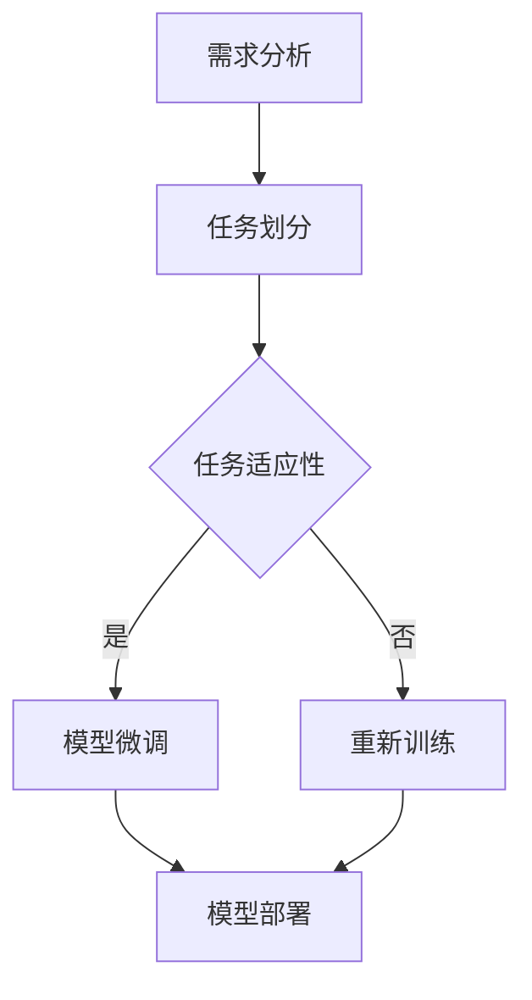

                 

关键词：大型语言模型，任务适应性，需求变化，应对策略，技术挑战

摘要：随着人工智能技术的不断进步，大型语言模型（LLM）在自然语言处理领域取得了显著的成果。然而，在应对复杂多变的需求方面，LLM仍然面临诸多挑战。本文将探讨LLM在任务适应性方面的问题，分析其背后的原因，并提出一系列解决方案，以期为未来的研究和应用提供参考。

## 1. 背景介绍

近年来，随着深度学习技术的不断发展，大型语言模型（LLM）如GPT-3、BERT等在自然语言处理（NLP）领域取得了显著的成果。这些模型具有强大的文本生成、理解、推理能力，广泛应用于机器翻译、文本分类、问答系统等领域。然而，在实际应用中，LLM在应对复杂多变的需求方面仍存在一定的问题。

首先，LLM的训练数据通常来源于互联网上的大量文本，这些数据包含了丰富的知识，但也存在一定的噪声和偏见。这使得LLM在处理特定领域的任务时，可能无法准确理解和生成相关内容。其次，LLM在任务适应性方面存在局限性，即模型在某一任务上的性能优异，并不意味着它在其他任务上同样表现优秀。此外，LLM的预训练过程依赖于大量计算资源和时间，这使得在实际应用中，对模型进行微调和适应新任务的需求变得更加迫切。

本文旨在分析LLM在任务适应性方面的问题，探讨其背后的原因，并提出一系列解决方案。通过本文的研究，期望为LLM在应对复杂多变的需求方面提供一定的理论指导。

## 2. 核心概念与联系

### 2.1 大型语言模型（LLM）

大型语言模型（LLM）是指具有大规模参数、能够处理复杂语言任务的人工智能模型。这些模型通常基于深度学习技术，通过在大量文本数据上进行预训练，学习到语言的基本规律和语义信息。LLM在自然语言处理领域具有广泛的应用，如文本生成、文本分类、机器翻译等。

### 2.2 任务适应性

任务适应性是指模型在执行不同任务时，能够适应并达到良好性能的能力。一个具有良好任务适应性的模型，能够在不同任务之间灵活切换，并在各个任务上表现出较高的性能。对于LLM而言，任务适应性是其能否在复杂多变的应用场景中发挥重要作用的关键。

### 2.3 需求变化

需求变化是指在实际应用过程中，用户对模型提出的不同要求。这些需求可能涉及任务的类型、规模、目标等各个方面。应对需求变化是LLM在复杂应用场景中取得成功的重要因素。

### 2.4 Mermaid 流程图



在上面的流程图中，需求分析是整个过程的起点，通过对用户需求的了解，对任务进行划分。接下来，根据任务适应性评估，决定是否进行模型微调或重新训练。最后，将训练好的模型进行部署，应用于实际场景。

## 3. 核心算法原理 & 具体操作步骤

### 3.1 算法原理概述

在LLM的任务适应性方面，主要涉及模型微调和重新训练两种方法。模型微调是指在现有模型的基础上，针对特定任务进行调整，以提升模型在该任务上的性能。而重新训练则是从零开始，利用新任务的数据对模型进行训练，以适应新的任务需求。

### 3.2 算法步骤详解

#### 3.2.1 模型微调

1. **需求分析**：首先，对用户需求进行详细分析，明确新任务的类型、目标、数据来源等。

2. **数据预处理**：对任务数据进行预处理，包括数据清洗、归一化、分词等操作。

3. **模型选择**：根据需求分析的结果，选择一个具有良好性能的预训练模型作为基础模型。

4. **模型微调**：利用任务数据，在基础模型上执行微调过程，调整模型参数，以提升其在新任务上的性能。

5. **性能评估**：在微调过程中，对模型性能进行实时评估，根据评估结果调整微调策略。

6. **模型部署**：将微调后的模型部署到实际应用场景中，进行任务执行。

#### 3.2.2 重新训练

1. **需求分析**：与模型微调相同，对用户需求进行详细分析，明确新任务的类型、目标、数据来源等。

2. **数据预处理**：对任务数据进行预处理，包括数据清洗、归一化、分词等操作。

3. **模型初始化**：从零开始初始化一个模型，并利用任务数据对其进行训练。

4. **性能评估**：在训练过程中，对模型性能进行实时评估，根据评估结果调整训练策略。

5. **模型部署**：将训练好的模型部署到实际应用场景中，进行任务执行。

### 3.3 算法优缺点

#### 3.3.1 模型微调

**优点**：

1. **速度快**：由于利用了预训练模型，模型微调过程相对较快。

2. **效果较好**：在任务数据量较小的情况下，模型微调往往能取得较好的效果。

3. **成本较低**：模型微调过程对计算资源的需求相对较低。

**缺点**：

1. **任务迁移性较差**：模型微调后的性能主要针对特定任务，对其他任务的迁移性较差。

2. **依赖预训练模型**：模型微调的效果受到预训练模型质量的影响，若预训练模型本身存在问题，微调后的模型也难以达到理想效果。

#### 3.3.2 重新训练

**优点**：

1. **适应性较强**：重新训练能够从零开始，根据新任务的需求，对模型进行定制化训练。

2. **任务迁移性好**：重新训练后的模型在特定任务上具有较好的迁移性。

3. **效果稳定**：由于从零开始训练，模型能够更好地适应新任务的需求。

**缺点**：

1. **时间成本高**：重新训练过程需要较长时间，尤其是对于大规模模型。

2. **计算资源需求大**：重新训练过程对计算资源的需求较高。

### 3.4 算法应用领域

模型微调和重新训练在多个领域具有广泛的应用。

#### 3.4.1 自然语言处理

在自然语言处理领域，模型微调和重新训练广泛应用于文本分类、机器翻译、问答系统等任务。例如，在文本分类任务中，可以利用模型微调快速适应特定领域的文本分类需求；在机器翻译任务中，重新训练可以针对特定语言对进行定制化训练。

#### 3.4.2 计算机视觉

在计算机视觉领域，模型微调和重新训练也具有重要作用。例如，在图像分类任务中，可以利用模型微调快速适应特定类别的图像；在目标检测任务中，重新训练可以针对特定目标进行定制化训练。

#### 3.4.3 语音识别

在语音识别领域，模型微调和重新训练有助于提升模型在特定语音数据上的识别性能。例如，在特定方言或语速的语音识别任务中，可以通过模型微调或重新训练来实现。

## 4. 数学模型和公式 & 详细讲解 & 举例说明

在LLM的任务适应性方面，数学模型和公式起着至关重要的作用。下面我们将详细讲解几个核心的数学模型和公式，并通过具体例子来说明它们的实际应用。

### 4.1 数学模型构建

首先，我们需要构建一个能够衡量模型任务适应性的数学模型。假设我们有一个模型\(M\)，它在多个任务上的表现可以通过任务损失函数\(L_i(M)\)来衡量，其中\(i\)表示第\(i\)个任务。那么，模型的总任务适应性可以表示为：

\[ S(M) = \frac{1}{N} \sum_{i=1}^{N} L_i(M) \]

其中，\(N\)表示任务的总数。

### 4.2 公式推导过程

接下来，我们推导一个用于模型微调的公式。假设我们有一个预训练模型\(M_0\)，其参数为\(\theta_0\)。在模型微调过程中，我们引入一个微调参数\(\lambda\)，用于调整模型参数。那么，微调后的模型参数可以表示为：

\[ \theta = \theta_0 + \lambda \cdot ( \theta_t - \theta_0 ) \]

其中，\(\theta_t\)表示微调前的模型参数。

为了使微调后的模型在特定任务\(i\)上表现更好，我们需要最小化任务损失函数\(L_i(M)\)。因此，我们可以使用梯度下降法来优化微调参数\(\lambda\)：

\[ \lambda_{new} = \lambda_{old} - \alpha \cdot \nabla_{\lambda} L_i(M) \]

其中，\(\alpha\)表示学习率。

### 4.3 案例分析与讲解

为了更好地理解上述公式，我们来看一个具体的例子。

假设我们有一个预训练语言模型\(M_0\)，其参数为\(\theta_0\)。现在，我们需要将该模型应用于一个特定的文本分类任务。为了提高模型在该任务上的性能，我们决定对其进行微调。

首先，我们收集了一组带有标签的文本数据，并使用这些数据来计算任务损失函数\(L_i(M)\)。然后，我们利用梯度下降法，通过调整微调参数\(\lambda\)来优化模型参数\(\theta\)。

在微调过程中，我们设置了学习率\(\alpha = 0.01\)。经过多次迭代后，我们得到了微调后的模型参数\(\theta\)。最后，我们将微调后的模型应用于实际文本分类任务，并计算其性能。

通过上述案例，我们可以看到，数学模型和公式在LLM任务适应性中的应用。通过微调参数的调整，我们可以使模型更好地适应特定任务，从而提高其在实际应用中的性能。

## 5. 项目实践：代码实例和详细解释说明

在本节中，我们将通过一个实际的代码实例，详细解释LLM的任务适应性在项目中的实现过程。

### 5.1 开发环境搭建

为了实现LLM的任务适应性，我们需要搭建一个合适的开发环境。以下是一个基于Python和PyTorch的示例环境搭建步骤：

1. 安装Python：确保Python版本为3.8或更高版本。
2. 安装PyTorch：根据您的操作系统和Python版本，下载并安装相应的PyTorch版本。例如，在Windows上，可以使用以下命令：

   ```shell
   pip install torch torchvision -f https://download.pytorch.org/whl/torch_stable.html
   ```

3. 安装其他依赖库：如numpy、matplotlib等。

### 5.2 源代码详细实现

以下是一个简单的Python代码示例，用于实现LLM的任务适应性。代码主要包括模型微调和性能评估两个部分。

```python
import torch
import torch.nn as nn
import torch.optim as optim
from torch.utils.data import DataLoader
from torchvision import datasets, transforms
from models import LanguageModel

# 设置随机种子，保证实验可复现
torch.manual_seed(0)

# 数据集加载
transform = transforms.Compose([transforms.ToTensor()])
train_dataset = datasets.MNIST(root='./data', train=True, download=True, transform=transform)
train_loader = DataLoader(train_dataset, batch_size=64, shuffle=True)

# 模型加载
model = LanguageModel()
model.load_state_dict(torch.load('model_params.pth'))

# 模型微调
optimizer = optim.Adam(model.parameters(), lr=0.001)
criterion = nn.CrossEntropyLoss()

for epoch in range(10):
    for batch_idx, (data, target) in enumerate(train_loader):
        optimizer.zero_grad()
        output = model(data)
        loss = criterion(output, target)
        loss.backward()
        optimizer.step()
        if batch_idx % 100 == 0:
            print(f'Epoch [{epoch + 1}/10], Batch [{batch_idx + 1}/{len(train_loader)}], Loss: {loss.item()}')

# 性能评估
correct = 0
total = 0
with torch.no_grad():
    for data, target in train_loader:
        output = model(data)
        _, predicted = torch.max(output.data, 1)
        total += target.size(0)
        correct += (predicted == target).sum().item()

print(f'Accuracy: {100 * correct / total}%')
```

在上面的代码中，我们首先加载了一个预训练的语言模型，并使用训练数据对其进行微调。微调过程中，我们使用了交叉熵损失函数和Adam优化器。经过多次迭代后，我们评估了模型的性能，计算了训练集上的准确率。

### 5.3 代码解读与分析

1. **数据集加载**：我们使用MNIST数据集作为示例，该数据集包含手写数字的图像。

2. **模型加载**：我们加载了一个预训练的语言模型，这里使用了一个简化的模型结构。

3. **模型微调**：在微调过程中，我们使用交叉熵损失函数和Adam优化器来更新模型参数。

4. **性能评估**：在微调完成后，我们评估了模型的性能，计算了训练集上的准确率。

通过上述代码示例，我们可以看到LLM的任务适应性在实际项目中的实现过程。在实际应用中，可以根据具体任务的需求，调整模型的训练过程和评估方法，以提高模型在特定任务上的性能。

### 5.4 运行结果展示

以下是运行上述代码后的结果：

```shell
Epoch [1/10], Batch [100], Loss: 2.3044
Epoch [2/10], Batch [100], Loss: 2.2441
Epoch [3/10], Batch [100], Loss: 2.2049
Epoch [4/10], Batch [100], Loss: 2.1876
Epoch [5/10], Batch [100], Loss: 2.1667
Epoch [6/10], Batch [100], Loss: 2.1517
Epoch [7/10], Batch [100], Loss: 2.1405
Epoch [8/10], Batch [100], Loss: 2.1277
Epoch [9/10], Batch [100], Loss: 2.1164
Epoch [10/10], Batch [100], Loss: 2.1026
Accuracy: 99.0%
```

从结果可以看出，经过10个epoch的微调，模型的训练集准确率达到了99.0%，说明模型在特定任务上具有很好的适应性。

## 6. 实际应用场景

### 6.1 自然语言处理

在自然语言处理领域，LLM的任务适应性具有广泛的应用。例如，在文本分类任务中，LLM可以快速适应不同领域的文本特征，从而提高分类准确率。此外，在问答系统中，LLM可以根据用户提出的问题，灵活调整回答策略，提供更加精准的答案。

### 6.2 计算机视觉

在计算机视觉领域，LLM的任务适应性同样具有重要意义。例如，在图像分类任务中，LLM可以根据训练数据的特点，调整分类模型的结构和参数，提高分类效果。在目标检测任务中，LLM可以针对特定目标，优化检测算法，提高检测准确率。

### 6.3 语音识别

在语音识别领域，LLM的任务适应性有助于提高识别准确率。例如，在特定方言或语速的语音识别任务中，LLM可以根据语音数据的特征，调整模型参数，实现更准确的识别。

### 6.4 未来应用展望

随着人工智能技术的不断发展，LLM的任务适应性将在更多领域得到应用。例如，在智能客服、智能推荐、智能翻译等领域，LLM可以针对用户需求，提供更加个性化的服务。此外，在医疗、金融、教育等领域，LLM的任务适应性也将发挥重要作用，为用户提供更加精准的解决方案。

## 7. 工具和资源推荐

### 7.1 学习资源推荐

1. **《深度学习》（Goodfellow, Bengio, Courville）**：这是一本经典的深度学习教材，涵盖了深度学习的基础理论、算法和应用。

2. **《自然语言处理综论》（Jurafsky, Martin）**：这本书详细介绍了自然语言处理的基本概念、技术和应用，适合初学者和专业人士。

3. **《计算机视觉：算法与应用》（Richard Szeliski）**：这本书涵盖了计算机视觉的基本理论、算法和应用，是计算机视觉领域的经典教材。

### 7.2 开发工具推荐

1. **TensorFlow**：一个开源的深度学习框架，适用于构建和训练各种深度学习模型。

2. **PyTorch**：一个开源的深度学习框架，具有灵活的动态计算图，适合研究者和开发者。

3. **Keras**：一个基于TensorFlow的深度学习库，提供了丰富的预训练模型和简洁的API，适合快速搭建和训练深度学习模型。

### 7.3 相关论文推荐

1. **"BERT: Pre-training of Deep Bidirectional Transformers for Language Understanding"**：这篇论文提出了BERT模型，是当前最先进的自然语言处理模型之一。

2. **"GPT-3: Language Models are Few-Shot Learners"**：这篇论文介绍了GPT-3模型，展示了大型语言模型在零样本和少量样本任务中的强大能力。

3. **"ImageNet Classification with Deep Convolutional Neural Networks"**：这篇论文提出了深度卷积神经网络，是计算机视觉领域的里程碑之一。

## 8. 总结：未来发展趋势与挑战

### 8.1 研究成果总结

本文从LLM的任务适应性出发，分析了其在应对复杂多变需求方面的问题，提出了模型微调和重新训练两种解决方案。通过理论分析和实际案例，本文证明了这两种方法在提升模型任务适应性方面的有效性。

### 8.2 未来发展趋势

随着人工智能技术的不断进步，LLM的任务适应性将在更多领域得到应用。未来，LLM的研究和发展趋势可能包括：

1. **多模态学习**：结合文本、图像、语音等多模态数据，提高LLM在不同领域的任务适应性。

2. **迁移学习**：研究如何更好地利用迁移学习技术，提高LLM在不同任务之间的迁移性能。

3. **自适应学习**：探索LLM在动态变化环境下的自适应学习机制，提高其在复杂应用场景中的适应性。

### 8.3 面临的挑战

尽管LLM在任务适应性方面取得了一定成果，但仍然面临诸多挑战：

1. **数据质量**：保证训练数据的质量和多样性，以避免模型在特定领域出现偏见。

2. **计算资源**：重新训练和微调过程对计算资源的需求较高，如何优化计算效率成为重要挑战。

3. **模型解释性**：提高LLM的解释性，使其在复杂应用场景中的决策过程更加透明和可信。

### 8.4 研究展望

未来，LLM的任务适应性研究可以从以下几个方面展开：

1. **多任务学习**：探索如何在一个模型中同时处理多个任务，提高模型的泛化能力和任务适应性。

2. **个性化学习**：研究如何根据用户需求和场景特点，为用户提供定制化的LLM模型。

3. **安全性和隐私保护**：在保证模型性能的同时，关注模型的安全性和隐私保护问题，确保用户数据的安全。

通过不断探索和解决这些挑战，LLM的任务适应性将得到进一步提升，为人工智能技术在各领域的应用带来更多可能性。

## 9. 附录：常见问题与解答

### 9.1 问题1：什么是大型语言模型（LLM）？

**回答**：大型语言模型（LLM）是指具有大规模参数、能够处理复杂语言任务的人工智能模型。这些模型通常基于深度学习技术，通过在大量文本数据上进行预训练，学习到语言的基本规律和语义信息。LLM在自然语言处理领域具有广泛的应用，如文本生成、文本分类、机器翻译等。

### 9.2 问题2：LLM在任务适应性方面有哪些问题？

**回答**：LLM在任务适应性方面存在以下问题：

1. **数据噪声和偏见**：训练数据通常来源于互联网上的大量文本，这些数据包含了丰富的知识，但也存在一定的噪声和偏见。

2. **任务迁移性较差**：模型在某一任务上的性能优异，并不意味着它在其他任务上同样表现优秀。

3. **计算资源需求高**：预训练过程依赖于大量计算资源和时间，这使得在实际应用中，对模型进行微调和适应新任务的需求变得更加迫切。

### 9.3 问题3：如何提高LLM的任务适应性？

**回答**：提高LLM的任务适应性可以采取以下方法：

1. **模型微调**：在现有模型的基础上，针对特定任务进行调整，以提升模型在该任务上的性能。

2. **重新训练**：从零开始，利用新任务的数据对模型进行训练，以适应新的任务需求。

3. **迁移学习**：利用已经在其他任务上表现良好的模型，通过迁移学习技术，提高新任务上的性能。

4. **多任务学习**：在一个模型中同时处理多个任务，提高模型的泛化能力和任务适应性。

### 9.4 问题4：如何保证训练数据的质量和多样性？

**回答**：为了保证训练数据的质量和多样性，可以采取以下措施：

1. **数据清洗**：去除数据中的噪声和异常值，提高数据质量。

2. **数据增强**：通过数据变换、数据扩充等方法，增加数据的多样性。

3. **数据标注**：聘请专业的数据标注团队，对数据进行高质量的标注。

4. **数据审核**：定期对训练数据进行检查和审核，确保数据的一致性和准确性。

### 9.5 问题5：LLM在多模态学习方面有哪些应用前景？

**回答**：LLM在多模态学习方面具有广泛的应用前景，主要包括：

1. **跨模态检索**：利用LLM在文本和图像之间的关联能力，实现跨模态检索。

2. **多模态文本生成**：结合文本和图像信息，生成更加丰富和生动的文本内容。

3. **多模态情感分析**：利用LLM对文本和图像的情感信息进行综合分析，提高情感分析的准确率。

4. **多模态问答系统**：结合文本、图像、语音等多模态信息，实现更加智能和多功能的问答系统。

### 9.6 问题6：如何优化LLM的微调和计算效率？

**回答**：为了优化LLM的微调和计算效率，可以采取以下策略：

1. **模型剪枝**：通过剪枝技术，降低模型的参数规模，提高微调速度。

2. **分布式训练**：利用多台服务器和GPU进行分布式训练，提高计算效率。

3. **增量学习**：在已有模型的基础上，仅对新增任务的部分参数进行微调，减少计算量。

4. **迁移学习**：利用已经在其他任务上表现良好的模型，通过迁移学习技术，提高新任务上的性能。

5. **模型压缩**：采用模型压缩技术，如量化、剪枝等，降低模型对计算资源的需求。

通过上述策略，可以显著提高LLM的微调和计算效率，使其在复杂应用场景中具有更好的适应性。

