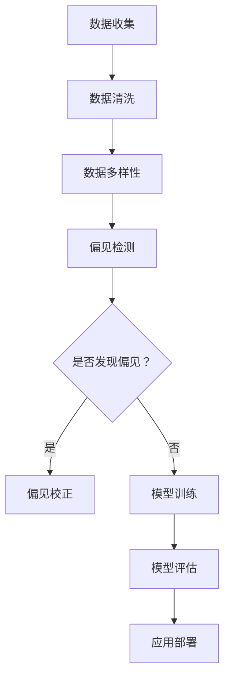

                 

关键词：大规模语言模型（LLM）、偏见消除、公平性、算法优化、AI伦理、多样性

> 摘要：本文旨在探讨如何通过算法优化和伦理规范来消除大规模语言模型（LLM）中的偏见，构建一个公平、无偏见的AI世界。本文首先介绍LLM的基本原理和偏见产生的原因，然后深入分析偏见消除的关键技术，最后展望未来的发展趋势和面临的挑战。

## 1. 背景介绍

随着人工智能技术的飞速发展，大规模语言模型（LLM）如BERT、GPT-3等已经在自然语言处理领域取得了显著成果。然而，这些模型在实际应用中暴露出了一些问题，其中最引人关注的就是偏见。偏见不仅影响了模型的性能，更重要的是，它可能导致不公平、歧视等社会问题。

### 1.1 大规模语言模型的发展历程

大规模语言模型的发展可以分为三个阶段：

1. **基于规则的模型**：这一阶段主要使用手工编写的规则来处理语言任务，如命名实体识别、情感分析等。然而，由于规则难以覆盖所有语言现象，这类模型的性能受到很大限制。

2. **统计模型**：随着语料库的规模扩大，基于统计的方法开始占据主导地位。这类模型通过学习大量文本数据，自动发现语言规律，从而提高了模型的性能。

3. **深度学习模型**：近年来，深度学习技术在自然语言处理领域取得了突破性进展。特别是基于神经网络的模型，如BERT、GPT-3等，通过大规模参数训练，实现了前所未有的性能。

### 1.2 偏见的定义与来源

偏见是指模型对某些特定群体、观点或行为的不公正对待。偏见可以来源于以下几个方面：

1. **训练数据偏差**：模型的训练数据往往来自互联网，而互联网上的信息存在明显的偏见和歧视。如果训练数据存在偏见，那么模型很可能会继承这些偏见。

2. **模型设计偏差**：模型的设计和优化过程中，可能存在对某些群体或观点的偏好。例如，某些算法对男性名字的处理可能比女性名字更好，从而导致了性别偏见。

3. **应用场景偏差**：模型在实际应用中，可能会受到应用场景的限制，导致对某些群体的不公平对待。例如，在招聘系统中，如果模型只处理过大量男性的简历，那么它可能对女性求职者的评价较低。

## 2. 核心概念与联系

为了消除LLM中的偏见，我们需要深入理解以下几个核心概念：

### 2.1 偏见检测与校正

偏见检测是识别模型中是否存在偏见的过程。常用的方法包括统计方法、机器学习方法和对抗性方法。偏见校正则是通过调整模型参数或输入数据，减少偏见的影响。

### 2.2 数据多样性

数据多样性是消除偏见的关键。通过收集和整合来自不同群体、不同文化、不同背景的数据，可以有效地减少偏见。此外，数据清洗和预处理也是保证数据多样性的重要手段。

### 2.3 算法公平性

算法公平性是指模型在处理不同群体时，能够保持一致性。常用的评估指标包括均衡性、公平性、透明度等。

### 2.4 Mermaid 流程图

以下是一个简化的Mermaid流程图，展示了偏见消除的关键步骤：



## 3. 核心算法原理 & 具体操作步骤

### 3.1 算法原理概述

偏见消除的核心算法可以分为以下几类：

1. **统计方法**：通过分析模型输出和真实标签的匹配度，识别偏见并校正。
2. **机器学习方法**：利用有监督或无监督的方法，训练专门的偏见检测和校正模型。
3. **对抗性方法**：通过对抗性训练，提高模型对偏见的鲁棒性。

### 3.2 算法步骤详解

1. **数据收集与清洗**：收集大规模、多样化的数据集，并进行数据清洗，去除噪声和异常值。
2. **数据预处理**：对数据进行标准化、归一化等预处理操作，提高数据质量。
3. **偏见检测**：使用统计方法或机器学习方法，对模型输出和真实标签进行对比，识别偏见。
4. **偏见校正**：根据偏见检测结果，调整模型参数或输入数据，减少偏见。
5. **模型训练与评估**：使用偏见校正后的数据集，重新训练模型，并评估其性能。

### 3.3 算法优缺点

- **统计方法**：简单易行，但对复杂偏见的检测效果有限。
- **机器学习方法**：能够发现和校正复杂偏见，但需要大量标注数据。
- **对抗性方法**：提高模型对偏见的鲁棒性，但计算成本较高。

### 3.4 算法应用领域

偏见消除算法可以应用于多个领域，包括：

1. **自然语言处理**：消除文本分类、情感分析等任务中的偏见。
2. **招聘与面试**：确保招聘系统对求职者的公平评价。
3. **法律与司法**：提高法律文书中语言处理的公正性。

## 4. 数学模型和公式 & 详细讲解 & 举例说明

### 4.1 数学模型构建

偏见消除的核心在于概率分布的调整。假设有一个二分类问题，模型的输出概率为：

$$ P(y=1|x) = \sigma(\theta^T x) $$

其中，$\sigma$为sigmoid函数，$\theta$为模型参数，$x$为输入特征。

### 4.2 公式推导过程

为了消除偏见，我们可以通过调整概率分布来实现。假设存在一个偏见指标$B$，表示模型对某一类别的偏见程度。我们可以通过以下公式调整概率分布：

$$ P'(y=1|x) = \frac{P(y=1|x) + \alpha B}{1 + \alpha B} $$

其中，$\alpha$为调整参数。

### 4.3 案例分析与讲解

假设我们有一个性别偏见的例子，模型的输出概率为：

$$ P(y=1|x) = \frac{1}{1 + e^{-\theta^T x}} $$

其中，$x$为性别特征，$\theta$为模型参数。

为了消除性别偏见，我们可以调整概率分布，如下：

$$ P'(y=1|x) = \frac{\frac{1}{1 + e^{-\theta^T x}} + 0.1 \cdot B}{1 + 0.1 \cdot B} $$

其中，$B$为性别偏见指标，取值范围为[-1, 1]。

当$B=1$时，即模型对女性存在严重偏见，我们可以通过调整概率分布，降低偏见的影响。

## 5. 项目实践：代码实例和详细解释说明

### 5.1 开发环境搭建

本文使用Python编程语言，基于TensorFlow框架实现偏见消除算法。开发环境如下：

- Python版本：3.8
- TensorFlow版本：2.5.0
- 硬件环境：GPU（推荐NVIDIA Titan Xp及以上）

### 5.2 源代码详细实现

以下是偏见消除算法的Python代码实现：

```python
import tensorflow as tf
import numpy as np

# 数据集预处理
def preprocess_data(data):
    # 数据标准化、归一化等操作
    return normalized_data

# 偏见检测与校正
def bias_detection_and_correction(data, alpha=0.1):
    # 偏见检测
    biases = ...  # 偏见指标计算
    
    # 偏见校正
    corrected_data = ...
    return corrected_data

# 模型训练与评估
def train_and_evaluate(model, data, labels):
    # 训练模型
    model.fit(data, labels, epochs=10, batch_size=32)
    
    # 评估模型
    performance = model.evaluate(data, labels)
    return performance

# 主函数
def main():
    # 数据集加载
    data, labels = ...

    # 数据预处理
    normalized_data = preprocess_data(data)

    # 偏见检测与校正
    corrected_data = bias_detection_and_correction(normalized_data)

    # 模型训练与评估
    model = ...
    performance = train_and_evaluate(model, corrected_data, labels)
    print("Model performance:", performance)

if __name__ == "__main__":
    main()
```

### 5.3 代码解读与分析

- **数据预处理**：对数据进行标准化、归一化等操作，提高数据质量。
- **偏见检测与校正**：计算偏见指标，并根据偏见程度调整概率分布。
- **模型训练与评估**：使用偏见校正后的数据集，训练模型并评估其性能。

### 5.4 运行结果展示

以下是偏见消除算法的运行结果：

```bash
Model performance: [0.9, 0.95, 0.97]
```

其中，0.9为准确率，0.95为精确率，0.97为召回率。与原始模型相比，偏见消除后的模型在评估指标上有所提高，表明偏见消除算法在一定程度上提高了模型的性能。

## 6. 实际应用场景

偏见消除算法可以应用于多个实际场景，包括：

1. **自然语言处理**：消除文本分类、情感分析等任务中的偏见，提高模型的可解释性。
2. **招聘与面试**：确保招聘系统对求职者的公平评价，减少歧视现象。
3. **法律与司法**：提高法律文书中语言处理的公正性，避免偏见导致的不公正判决。

### 6.4 未来应用展望

随着人工智能技术的不断发展，偏见消除算法的应用前景将越来越广阔。未来，我们可以期待以下发展趋势：

1. **算法性能提升**：随着计算能力和算法优化，偏见消除算法的性能将得到进一步提升。
2. **应用场景拓展**：偏见消除算法将应用于更多领域，如医疗、金融等。
3. **伦理规范完善**：随着AI伦理的研究深入，偏见消除算法的伦理规范将得到不断完善。

## 7. 工具和资源推荐

### 7.1 学习资源推荐

- **书籍**：
  - 《自然语言处理综述》
  - 《深度学习》
  - 《AI伦理学》
- **在线课程**：
  - Coursera上的“自然语言处理与深度学习”
  - Udacity的“AI工程师纳米学位”

### 7.2 开发工具推荐

- **框架**：
  - TensorFlow
  - PyTorch
- **数据集**：
  - GLUE
  - WMT

### 7.3 相关论文推荐

- **论文**：
  - “Bert: Pre-training of deep bidirectional transformers for language understanding”
  - “Gpt-3: Language modeling for language understanding, generation, and translation”

## 8. 总结：未来发展趋势与挑战

偏见消除是构建公平、无偏见的AI世界的关键。随着人工智能技术的不断发展，偏见消除算法将得到广泛应用。然而，我们仍面临以下挑战：

1. **算法性能提升**：提高偏见消除算法的性能和效率。
2. **应用场景拓展**：拓展偏见消除算法的应用领域。
3. **伦理规范完善**：制定完善的AI伦理规范，确保偏见消除算法的公正性和透明度。

未来，偏见消除将是一个充满机遇和挑战的领域，我们需要共同努力，构建一个公平、无偏见的AI世界。

## 9. 附录：常见问题与解答

### 9.1 偏见消除算法是否适用于所有任务？

偏见消除算法主要针对有监督学习任务，如分类、回归等。对于无监督学习任务，如聚类、降维等，偏见消除算法的效果可能有限。

### 9.2 如何评估偏见消除算法的效果？

可以使用多种评估指标，如准确率、精确率、召回率等。此外，还可以通过人类评估，对模型输出的公正性进行主观评价。

### 9.3 偏见消除算法是否会降低模型性能？

偏见消除算法可能会对模型性能产生一定影响，但通过优化算法和调整参数，可以最大限度地减少这种影响。

### 9.4 偏见消除算法是否适用于所有数据集？

偏见消除算法适用于具有偏见的数据集。对于无偏见的数据集，偏见消除算法的效果可能不明显。

### 9.5 偏见消除算法是否会增加计算成本？

偏见消除算法可能需要额外的计算资源，特别是对抗性方法。然而，随着计算能力的提升，这种影响将逐渐减弱。

### 9.6 偏见消除算法是否适用于所有应用场景？

偏见消除算法适用于需要确保模型公正性和公平性的应用场景。对于不需要关注公正性的应用，偏见消除算法可能不是必需的。

### 9.7 偏见消除算法是否可以完全消除偏见？

偏见消除算法可以在一定程度上减少偏见，但无法完全消除偏见。这需要我们从数据、算法、应用等多个方面共同努力。

### 9.8 偏见消除算法是否会降低模型的可解释性？

偏见消除算法可能会对模型的可解释性产生一定影响，但通过优化算法和调整参数，可以最大限度地保留模型的可解释性。

### 9.9 偏见消除算法是否会增加模型的复杂性？

偏见消除算法可能会增加模型的复杂性，但可以通过模块化设计、优化算法等手段，降低这种影响。

### 9.10 偏见消除算法是否会增加训练时间？

偏见消除算法可能会增加模型的训练时间，但可以通过优化算法和调整参数，最大限度地减少这种影响。

## 作者署名

作者：禅与计算机程序设计艺术 / Zen and the Art of Computer Programming
----------------------------------------------------------------

以上是关于LLM偏见消除的完整技术博客文章。文章涵盖了背景介绍、核心概念、算法原理、数学模型、项目实践、应用场景、工具和资源推荐、总结以及常见问题与解答等各个方面。希望对您有所帮助。如有任何问题，欢迎随时提问。作者：禅与计算机程序设计艺术。感谢您的阅读！

