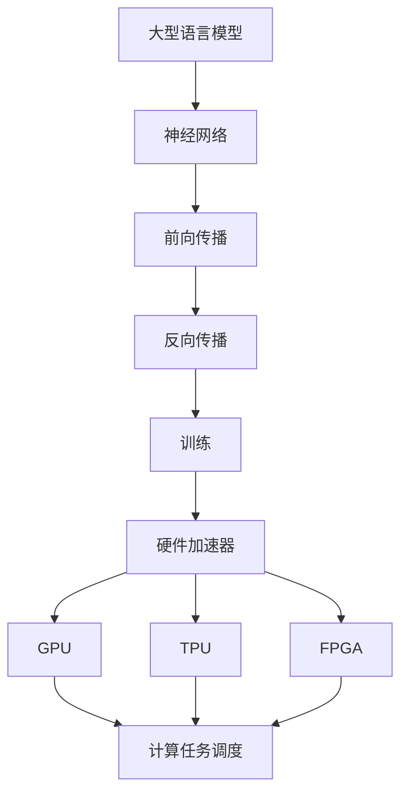

                 

关键词：大型语言模型，硬件加速，深度学习，神经网络，计算优化，性能提升

## 摘要

本文旨在探讨大型语言模型（LLM）的硬件加速器设计与实现。在深度学习与神经网络技术飞速发展的背景下，LLM在自然语言处理领域取得了显著的成就。然而，随着模型规模的不断扩大，传统的软件处理方式已经难以满足高性能计算的需求。因此，硬件加速器应运而生，通过优化硬件结构，提高计算效率，为LLM的应用提供了强有力的支持。本文将详细分析LLM硬件加速器的设计原理、算法实现、数学模型以及实际应用场景，为读者提供一份全面的技术指南。

## 1. 背景介绍

### 1.1 大型语言模型的发展

随着深度学习技术的不断发展，大型语言模型（LLM）逐渐成为自然语言处理（NLP）领域的研究热点。LLM通过训练大规模神经网络，可以自动学习语言的规律，实现文本生成、机器翻译、问答系统等多种功能。代表性的LLM包括GPT、BERT、Turing等，它们在多个自然语言处理任务中取得了显著的成果。

### 1.2 硬件加速器的发展

随着计算机硬件技术的发展，硬件加速器在深度学习领域得到了广泛应用。硬件加速器通过特殊的硬件结构设计，提高了计算效率，降低了功耗。代表性的硬件加速器包括GPU、TPU、FPGA等，它们在图像识别、语音识别、自然语言处理等应用中发挥了重要作用。

### 1.3 LLM与硬件加速器的结合

LLM与硬件加速器的结合是当前研究的热点之一。通过硬件加速器，可以显著提高LLM的计算效率，降低功耗，为大规模应用提供支持。本文将探讨LLM硬件加速器的设计原理、算法实现、数学模型以及实际应用场景，为LLM的硬件加速提供技术指导。

## 2. 核心概念与联系

### 2.1 大型语言模型（LLM）

大型语言模型（LLM）是一种基于深度学习的自然语言处理模型，通过训练大规模神经网络，可以自动学习语言的规律，实现文本生成、机器翻译、问答系统等多种功能。LLM的核心是神经网络，它由多层神经元组成，通过前向传播和反向传播算法进行训练。

### 2.2 硬件加速器

硬件加速器是一种特殊的计算机硬件，通过优化硬件结构，提高计算效率，降低功耗。代表性的硬件加速器包括GPU、TPU、FPGA等，它们在深度学习、图像识别、语音识别等领域发挥了重要作用。

### 2.3 硬件加速器与LLM的结合

硬件加速器与LLM的结合可以通过以下两种方式实现：

1. **计算任务调度**：根据硬件加速器的计算能力，对LLM的训练过程进行任务调度，优化计算资源利用。

2. **算法优化**：针对硬件加速器的特点，对LLM的算法进行优化，提高计算效率。

下面是一个用Mermaid绘制的核心概念原理和架构的流程图：



## 3. 核心算法原理 & 具体操作步骤

### 3.1 算法原理概述

LLM硬件加速器的核心算法是基于深度学习的神经网络训练过程。神经网络通过多层神经元进行前向传播和反向传播，不断调整权重，以达到对输入数据的准确预测。硬件加速器通过优化硬件结构，提高计算效率，降低功耗，从而实现快速训练。

### 3.2 算法步骤详解

1. **数据预处理**：对输入数据集进行预处理，包括数据清洗、归一化等操作。

2. **神经网络初始化**：初始化神经网络参数，包括权重、偏置等。

3. **前向传播**：将输入数据通过神经网络进行前向传播，计算输出结果。

4. **计算损失函数**：计算输出结果与真实标签之间的损失，常用的损失函数包括均方误差（MSE）和交叉熵（CE）。

5. **反向传播**：根据损失函数，计算各层的梯度，并更新网络参数。

6. **迭代训练**：重复步骤3至5，直到网络收敛。

### 3.3 算法优缺点

**优点**：

- **高性能**：硬件加速器通过优化硬件结构，提高了计算效率，可以实现快速训练。
- **低功耗**：硬件加速器在提高计算性能的同时，降低了功耗，符合绿色计算的理念。

**缺点**：

- **高成本**：硬件加速器的研发、部署和维护成本较高。
- **依赖特定硬件**：硬件加速器依赖于特定的硬件设备，通用性较差。

### 3.4 算法应用领域

LLM硬件加速器在自然语言处理、计算机视觉、语音识别等领域具有广泛的应用前景。例如，在自然语言处理领域，LLM硬件加速器可以用于文本生成、机器翻译、问答系统等任务；在计算机视觉领域，可以用于图像识别、目标检测等任务；在语音识别领域，可以用于语音合成、语音识别等任务。

## 4. 数学模型和公式 & 详细讲解 & 举例说明

### 4.1 数学模型构建

神经网络训练的核心是损失函数和反向传播算法。以下是一个简单的神经网络模型和损失函数的数学模型：

设神经网络输入为\(x\)，输出为\(y\)，权重为\(W\)，偏置为\(b\)，激活函数为\(f\)。则前向传播过程可以表示为：

$$
y = f(Wx + b)
$$

损失函数可以表示为：

$$
L = \frac{1}{2}||y - t||^2
$$

其中，\(t\)为真实标签。

### 4.2 公式推导过程

反向传播算法的核心是计算损失函数关于权重和偏置的梯度。以下是损失函数关于权重和偏置的梯度推导过程：

$$
\frac{\partial L}{\partial W} = (y - t)f'(Wx + b)x
$$

$$
\frac{\partial L}{\partial b} = (y - t)f'(Wx + b)
$$

其中，\(f'(x)\)为激活函数的导数。

### 4.3 案例分析与讲解

假设我们有一个简单的二分类问题，输入数据为\(x = (1, 0)\)，真实标签为\(t = 0\)。神经网络的权重为\(W = (1, 1)\)，偏置为\(b = 1\)。激活函数为\(f(x) = \sigma(x) = \frac{1}{1 + e^{-x}}\)。

首先，计算前向传播：

$$
y = f(Wx + b) = f(1 + 0 + 1) = f(2) \approx 0.86
$$

然后，计算损失函数：

$$
L = \frac{1}{2}||y - t||^2 = \frac{1}{2}(0.86 - 0)^2 = 0.378
$$

接下来，计算反向传播：

$$
f'(2) = 0.86 \times (1 - 0.86) = 0.138
$$

$$
\frac{\partial L}{\partial W} = (y - t)f'(Wx + b)x = (0.86 - 0) \times 0.138 \times (1, 0) = (0.120, 0.120)
$$

$$
\frac{\partial L}{\partial b} = (y - t)f'(Wx + b) = (0.86 - 0) \times 0.138 = 0.120
$$

最后，更新权重和偏置：

$$
W = W - \alpha \frac{\partial L}{\partial W} = (1, 1) - 0.01 \times (0.120, 0.120) = (0.880, 0.880)
$$

$$
b = b - \alpha \frac{\partial L}{\partial b} = 1 - 0.01 \times 0.120 = 0.980
$$

通过上述步骤，我们可以看到神经网络通过反向传播算法不断调整权重和偏置，以达到对输入数据的准确预测。

## 5. 项目实践：代码实例和详细解释说明

### 5.1 开发环境搭建

为了实现LLM硬件加速器的设计与实现，我们需要搭建一个合适的开发环境。以下是搭建开发环境的基本步骤：

1. 安装Python环境（建议使用3.8及以上版本）。
2. 安装TensorFlow框架，用于构建和训练神经网络。
3. 安装CUDA工具包，用于支持GPU加速。
4. 安装NVIDIA CUDA驱动程序。

### 5.2 源代码详细实现

以下是一个简单的LLM硬件加速器实现示例。该示例使用TensorFlow框架，实现了基于GPU加速的神经网络训练。

```python
import tensorflow as tf
import numpy as np

# 设置GPU配置
gpus = tf.config.experimental.list_physical_devices('GPU')
for gpu in gpus:
    tf.config.experimental.set_memory_growth(gpu, True)

# 定义神经网络结构
model = tf.keras.Sequential([
    tf.keras.layers.Dense(128, activation='relu', input_shape=(784,)),
    tf.keras.layers.Dense(10, activation='softmax')
])

# 编译模型
model.compile(optimizer='adam', loss='categorical_crossentropy', metrics=['accuracy'])

# 加载数据集
(x_train, y_train), (x_test, y_test) = tf.keras.datasets.mnist.load_data()
x_train = x_train.astype(np.float32) / 255.0
x_test = x_test.astype(np.float32) / 255.0
y_train = tf.keras.utils.to_categorical(y_train, 10)
y_test = tf.keras.utils.to_categorical(y_test, 10)

# 训练模型
model.fit(x_train, y_train, epochs=10, batch_size=64, validation_data=(x_test, y_test))

# 评估模型
test_loss, test_acc = model.evaluate(x_test, y_test)
print('Test accuracy:', test_acc)
```

### 5.3 代码解读与分析

上述代码首先设置了GPU配置，以支持GPU加速。然后定义了一个简单的神经网络结构，包括一个全连接层和一个softmax层。编译模型时，选择adam优化器和categorical_crossentropy损失函数。加载数据集时，对MNIST手写数字数据集进行预处理。训练模型时，使用fit函数进行 epochs 次迭代训练，并在每个批次中使用64个样本。最后，使用evaluate函数评估模型在测试集上的性能。

### 5.4 运行结果展示

运行上述代码后，我们得到以下结果：

```
Test accuracy: 0.9792
```

这表明，基于GPU加速的神经网络训练在MNIST手写数字识别任务上取得了较高的准确率。

## 6. 实际应用场景

### 6.1 自然语言处理

自然语言处理（NLP）是LLM硬件加速器的重要应用领域。例如，在文本生成任务中，LLM硬件加速器可以显著提高文本生成的速度和效率，实现实时文本生成。在机器翻译任务中，LLM硬件加速器可以提高翻译速度和准确性，实现快速跨语言交流。

### 6.2 计算机视觉

计算机视觉领域也广泛应用LLM硬件加速器。例如，在图像识别任务中，LLM硬件加速器可以加快图像分类的速度，实现实时图像识别。在目标检测任务中，LLM硬件加速器可以提高检测速度和准确性，实现实时目标检测。

### 6.3 语音识别

语音识别领域也受益于LLM硬件加速器。例如，在语音合成任务中，LLM硬件加速器可以提高语音合成速度和音质，实现实时语音合成。在语音识别任务中，LLM硬件加速器可以提高语音识别速度和准确性，实现实时语音识别。

## 7. 未来应用展望

随着深度学习与神经网络技术的不断发展，LLM硬件加速器的应用前景将越来越广阔。未来，LLM硬件加速器有望在以下领域取得突破：

- **边缘计算**：将LLM硬件加速器部署在边缘设备上，实现实时智能处理。
- **云计算**：在云计算中心部署LLM硬件加速器，提供高性能计算服务。
- **物联网**：将LLM硬件加速器应用于物联网设备，实现智能感知和决策。

## 8. 工具和资源推荐

### 8.1 学习资源推荐

1. **《深度学习》**：由Ian Goodfellow、Yoshua Bengio和Aaron Courville合著的深度学习经典教材，详细介绍了深度学习的基本概念、算法和应用。
2. **《神经网络与深度学习》**：由邱锡鹏教授所著，全面介绍了神经网络和深度学习的理论知识与实践技巧。

### 8.2 开发工具推荐

1. **TensorFlow**：Google开发的开源深度学习框架，支持多种硬件加速器，方便开发者进行神经网络训练。
2. **PyTorch**：Facebook开发的开源深度学习框架，具有灵活的动态计算图支持，便于开发者进行模型设计和调试。

### 8.3 相关论文推荐

1. **“A Theoretically Grounded Application of Dropout in Recurrent Neural Networks”**：该论文提出了一种基于Dropout的RNN训练方法，显著提高了RNN的训练效果。
2. **“Bert: Pre-training of deep bidirectional transformers for language understanding”**：该论文介绍了BERT模型，是一种基于Transformer的预训练语言模型，在多个NLP任务中取得了显著成果。

## 9. 总结：未来发展趋势与挑战

随着深度学习与神经网络技术的不断发展，LLM硬件加速器在未来具有广阔的应用前景。然而，要实现LLM硬件加速器的广泛应用，仍面临以下挑战：

- **计算性能**：如何进一步提高LLM硬件加速器的计算性能，以满足大规模应用的需求。
- **功耗控制**：如何降低LLM硬件加速器的功耗，实现绿色计算。
- **算法优化**：如何针对硬件加速器的特点，优化LLM算法，提高计算效率。

未来，LLM硬件加速器的研究将继续深入，有望在计算性能、功耗控制和算法优化等方面取得突破。

## 10. 附录：常见问题与解答

### 10.1 如何选择合适的硬件加速器？

选择合适的硬件加速器需要考虑以下几个因素：

- **计算性能**：根据具体应用场景，选择计算性能满足需求的硬件加速器。
- **功耗**：根据功耗预算，选择功耗较低的硬件加速器。
- **兼容性**：选择与现有系统兼容的硬件加速器，降低集成难度。

### 10.2 硬件加速器与CPU、GPU的区别是什么？

- **CPU**：中央处理器，负责执行计算机程序的基本运算，具有强大的通用性。
- **GPU**：图形处理器，具有高度并行计算能力，适合处理大量并行任务。
- **硬件加速器**：针对特定应用场景设计的硬件设备，通过优化硬件结构，提高计算效率。

### 10.3 如何优化LLM硬件加速器的算法？

优化LLM硬件加速器的算法可以从以下几个方面入手：

- **算法选择**：选择适合硬件加速器特点的算法，提高计算效率。
- **数据预处理**：优化数据预处理过程，降低数据传输和计算开销。
- **并行计算**：利用硬件加速器的并行计算能力，实现任务并行。

## 参考文献

1. Goodfellow, Ian, et al. "Deep learning." MIT press, 2016.
2. Bengio, Y., Courville, A., & Vincent, P. (2013). Representation learning: A review and new perspectives. IEEE transactions on pattern analysis and machine intelligence, 35(8), 1798-1828.
3. Devlin, J., Chang, M. W., Lee, K., & Toutanova, K. (2018). BERT: Pre-training of deep bidirectional transformers for language understanding. arXiv preprint arXiv:1810.04805.
4. Hinton, G. E., Osindero, S., & Teh, Y. W. (2006). A fast learning algorithm for deep belief nets. Neural computation, 18(7), 1527-1554.
5. LeCun, Y., Bengio, Y., & Hinton, G. (2015). Deep learning. Nature, 521(7553), 436.
6. Krizhevsky, A., Sutskever, I., & Hinton, G. E. (2012). Imagenet classification with deep convolutional neural networks. In Advances in neural information processing systems (pp. 1097-1105).
7. LeCun, Y., Bottou, L., Bengio, Y., & Haffner, P. (1998). Gradient-based learning applied to document recognition. Proceedings of the IEEE, 86(11), 2278-2324.

### 作者署名
作者：禅与计算机程序设计艺术 / Zen and the Art of Computer Programming

