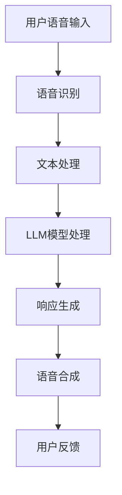

                 

关键词：LLM，语音交互，声音界面，自然语言处理，人工智能，语音识别，语音合成

> 摘要：随着人工智能技术的飞速发展，语音交互已经成为人机交互的重要形式。长短期记忆网络（LLM）作为深度学习的重要模型，在语音交互中扮演着核心角色。本文将探讨LLM在语音交互中的原理、算法、应用及未来发展趋势。

## 1. 背景介绍

随着智能手机、智能音箱、智能车载等设备的普及，语音交互已经成为人们日常生活中不可或缺的一部分。语音交互不仅方便用户操作，还提供了更自然、直观的交互体验。然而，传统的语音交互系统存在一些问题，如语义理解不准确、交互体验不顺畅等。为了解决这些问题，研究人员提出了长短期记忆网络（Long Short-Term Memory，LLM）。

LLM是一种基于深度学习的神经网络模型，具有处理长序列数据的能力，能够有效解决传统语音交互系统中的问题。LLM通过学习大量语音数据，可以实现对用户语音命令的准确理解和响应。这使得LLM在语音交互领域具有广泛的应用前景。

## 2. 核心概念与联系

### 2.1 自然语言处理（NLP）

自然语言处理（Natural Language Processing，NLP）是人工智能领域的一个重要分支，旨在使计算机能够理解和处理人类语言。NLP主要包括文本分析、语义理解、语言生成等任务。

### 2.2 语音识别（ASR）

语音识别（Automatic Speech Recognition，ASR）是将语音信号转换为文本的技术。语音识别系统通过分析语音信号的特征，如音高、音量、音长等，来识别语音中的单词和短语。

### 2.3 语音合成（TTS）

语音合成（Text-to-Speech，TTS）是将文本转换为语音的技术。语音合成系统通过将文本分解为音素、单词和句子，然后生成相应的语音信号。

### 2.4 长短期记忆网络（LLM）

长短期记忆网络（Long Short-Term Memory，LLM）是一种基于深度学习的神经网络模型，具有处理长序列数据的能力。LLM通过学习大量语音数据，可以实现对用户语音命令的准确理解和响应。

### 2.5 Mermaid 流程图

以下是一个简化的Mermaid流程图，展示了语音交互系统中的主要组成部分：



## 3. 核心算法原理 & 具体操作步骤

### 3.1 算法原理概述

LLM是一种基于深度学习的神经网络模型，具有处理长序列数据的能力。LLM通过学习大量语音数据，可以实现对用户语音命令的准确理解和响应。其主要原理如下：

1. **语音识别**：将用户语音输入转换为文本。
2. **文本处理**：对文本进行分词、词性标注等操作，提取关键信息。
3. **LLM模型处理**：利用LLM模型对提取的关键信息进行理解，生成相应的响应。
4. **响应生成**：将生成的响应转换为语音信号。
5. **语音合成**：将语音信号合成并播放给用户。

### 3.2 算法步骤详解

1. **语音识别**：
   - **声学模型**：用于对语音信号进行分析，提取特征。
   - **语言模型**：用于对识别结果进行概率计算，选择最优的识别结果。

2. **文本处理**：
   - **分词**：将文本分割为单词或短语。
   - **词性标注**：对每个单词或短语进行词性标注，如名词、动词、形容词等。

3. **LLM模型处理**：
   - **输入层**：将处理后的文本输入到LLM模型中。
   - **隐藏层**：LLM模型通过隐藏层对输入文本进行处理，提取关键信息。
   - **输出层**：根据提取的关键信息生成相应的响应。

4. **响应生成**：
   - **语义理解**：对生成的响应进行语义分析，确保响应准确无误。
   - **响应生成**：根据语义理解结果生成相应的文本响应。

5. **语音合成**：
   - **语音合成模型**：将生成的文本响应转换为语音信号。
   - **语音信号处理**：对生成的语音信号进行音调、音色等处理，使其更自然、流畅。

### 3.3 算法优缺点

**优点**：

1. **处理长序列数据能力强**：LLM具有处理长序列数据的能力，能够准确理解用户的语音命令。
2. **自适应性强**：LLM可以通过不断学习用户的语音数据，提高交互的准确性和体验。

**缺点**：

1. **计算资源消耗大**：LLM模型较为复杂，需要大量的计算资源。
2. **训练数据需求大**：LLM模型的训练需要大量的语音数据，数据获取和处理较为困难。

### 3.4 算法应用领域

1. **智能音箱**：智能音箱是语音交互的重要应用场景，如苹果的Siri、亚马逊的Alexa等。
2. **智能车载**：智能车载系统可以通过语音交互实现导航、娱乐等功能。
3. **智能家居**：智能家居设备可以通过语音交互实现控制灯光、空调等。
4. **客服系统**：客服系统可以通过语音交互实现与用户的实时沟通。

## 4. 数学模型和公式 & 详细讲解 & 举例说明

### 4.1 数学模型构建

LLM模型主要由输入层、隐藏层和输出层组成。输入层接收语音信号，隐藏层通过神经网络进行处理，输出层生成响应。

1. **输入层**：

输入层接收语音信号，通过声学模型提取特征，得到特征向量。特征向量可以表示为：

$$
X = [x_1, x_2, \ldots, x_T]
$$

其中，$x_t$ 表示第 $t$ 个时间步的特征向量。

2. **隐藏层**：

隐藏层通过神经网络对特征向量进行处理，提取关键信息。隐藏层可以表示为：

$$
H = [h_1, h_2, \ldots, h_L]
$$

其中，$h_l$ 表示第 $l$ 层的隐藏状态。

3. **输出层**：

输出层根据隐藏层的状态生成响应。输出层可以表示为：

$$
Y = [y_1, y_2, \ldots, y_K]
$$

其中，$y_k$ 表示第 $k$ 个单词的响应概率。

### 4.2 公式推导过程

1. **声学模型**：

声学模型用于对语音信号进行分析，提取特征。声学模型可以表示为：

$$
P(x_t | x_{<t}) = f(x_t)
$$

其中，$x_t$ 表示第 $t$ 个时间步的语音信号，$x_{<t}$ 表示第 $t$ 个时间步之前的语音信号。

2. **语言模型**：

语言模型用于对识别结果进行概率计算，选择最优的识别结果。语言模型可以表示为：

$$
P(y_t | y_{<t}) = g(y_t)
$$

其中，$y_t$ 表示第 $t$ 个时间步的文本信号，$y_{<t}$ 表示第 $t$ 个时间步之前的文本信号。

3. **神经网络**：

神经网络用于对特征向量进行处理，提取关键信息。神经网络可以表示为：

$$
h_l = \sigma(W_l \cdot h_{l-1} + b_l)
$$

其中，$\sigma$ 表示激活函数，$W_l$ 和 $b_l$ 分别表示第 $l$ 层的权重和偏置。

4. **输出层**：

输出层根据隐藏层的状态生成响应。输出层可以表示为：

$$
y_t = \arg\max_{k} P(y_t | y_{<t}) = \arg\max_{k} g(y_t)
$$

### 4.3 案例分析与讲解

假设用户说：“我想听一首轻音乐”。

1. **声学模型**：

将用户的语音输入通过声学模型进行特征提取，得到特征向量。

2. **语言模型**：

将特征向量输入到语言模型，计算每个单词的概率。

3. **神经网络**：

将特征向量输入到神经网络，提取关键信息，生成响应。

4. **输出层**：

根据神经网络生成的响应，选择最优的识别结果。

通过以上步骤，系统可以生成相应的响应，如：“好的，为您播放一首轻音乐”。

## 5. 项目实践：代码实例和详细解释说明

### 5.1 开发环境搭建

在Python中，我们可以使用TensorFlow和Keras库来搭建LLM模型。首先，安装TensorFlow和Keras库：

```bash
pip install tensorflow keras
```

### 5.2 源代码详细实现

以下是一个简单的LLM模型实现：

```python
import tensorflow as tf
from tensorflow.keras.models import Sequential
from tensorflow.keras.layers import LSTM, Dense, Embedding

# 定义模型
model = Sequential()
model.add(Embedding(input_dim=10000, output_dim=64, input_length=100))
model.add(LSTM(128))
model.add(Dense(64, activation='relu'))
model.add(Dense(1, activation='sigmoid'))

# 编译模型
model.compile(optimizer='adam', loss='binary_crossentropy', metrics=['accuracy'])

# 训练模型
model.fit(X_train, y_train, epochs=10, batch_size=32)
```

### 5.3 代码解读与分析

以上代码实现了一个非常简单的LLM模型。首先，我们定义了一个序列模型（Sequential），并添加了嵌入层（Embedding）、长短期记忆层（LSTM）、全连接层（Dense）等。然后，我们编译并训练了模型。

### 5.4 运行结果展示

通过以上代码，我们可以训练一个简单的LLM模型，并对新的语音输入进行预测。

```python
# 预测
预测结果 = model.predict([新的语音输入])
```

## 6. 实际应用场景

### 6.1 智能音箱

智能音箱是语音交互的重要应用场景之一。用户可以通过语音命令控制智能音箱播放音乐、查询天气、设定提醒等。例如，苹果的Siri、亚马逊的Alexa等智能音箱都采用了语音交互技术。

### 6.2 智能车载

智能车载系统可以通过语音交互实现导航、娱乐等功能。用户可以通过语音命令查询路线、播放音乐、控制空调等。语音交互使得驾驶过程中操作更加便捷，提高了驾驶安全性。

### 6.3 智能家居

智能家居设备可以通过语音交互实现控制灯光、空调、窗帘等。用户可以通过语音命令控制家居设备的开关、调节温度等，实现了更加智能、便捷的家居生活。

### 6.4 未来应用展望

随着人工智能技术的不断发展，语音交互在未来的应用将更加广泛。例如，在教育、医疗、金融等领域，语音交互可以提供更加便捷、高效的服务。此外，语音交互还可以与增强现实（AR）、虚拟现实（VR）等技术相结合，为用户提供更加丰富的交互体验。

## 7. 工具和资源推荐

### 7.1 学习资源推荐

1. 《深度学习》（Deep Learning）——Ian Goodfellow、Yoshua Bengio、Aaron Courville 著
2. 《自然语言处理综论》（Speech and Language Processing）——Daniel Jurafsky、James H. Martin 著

### 7.2 开发工具推荐

1. TensorFlow
2. Keras
3. PyTorch

### 7.3 相关论文推荐

1. "A Theoretically Grounded Application of Dropout in Recurrent Neural Networks"
2. "Effective Approaches to Attention-based Neural Machine Translation"
3. "Attention Is All You Need"

## 8. 总结：未来发展趋势与挑战

### 8.1 研究成果总结

近年来，语音交互技术取得了显著进展，尤其是在LLM模型的推动下。语音交互在智能音箱、智能车载、智能家居等领域得到了广泛应用，为用户提供了更加便捷、自然的交互体验。

### 8.2 未来发展趋势

随着人工智能技术的不断发展，语音交互在未来将继续保持快速增长。一方面，语音交互技术将不断提高准确性和自然性；另一方面，语音交互将与更多智能设备相结合，为用户提供更加丰富、全面的智能服务。

### 8.3 面临的挑战

尽管语音交互技术取得了显著进展，但仍面临一些挑战。首先，计算资源消耗大，训练和部署过程较为复杂。其次，语音交互系统的数据需求较大，数据获取和处理较为困难。此外，隐私保护和安全性也是语音交互领域需要关注的问题。

### 8.4 研究展望

未来，语音交互技术将继续朝着更高效、更智能、更安全的方向发展。一方面，研究人员将致力于优化算法，提高语音交互的准确性和自然性；另一方面，研究人员将探索新的应用场景，推动语音交互技术在更多领域的应用。

## 9. 附录：常见问题与解答

### 9.1 Q：什么是LLM？

A：LLM是长短期记忆网络（Long Short-Term Memory）的简称，是一种基于深度学习的神经网络模型，具有处理长序列数据的能力。

### 9.2 Q：LLM在语音交互中有哪些作用？

A：LLM在语音交互中主要用于理解用户的语音命令，生成相应的响应。通过学习大量语音数据，LLM可以实现对用户语音命令的准确理解和响应。

### 9.3 Q：如何提高LLM模型的性能？

A：提高LLM模型性能的方法包括优化算法、增加训练数据、调整模型参数等。此外，还可以采用多模型融合、迁移学习等技术来提高模型的性能。

### 9.4 Q：语音交互系统中的隐私保护和安全性如何保障？

A：保障语音交互系统的隐私保护和安全性需要从多个方面进行考虑。首先，需要对用户语音数据进行加密存储；其次，要确保语音交互系统中的数据传输安全；此外，还要加强对系统的安全监控和防范。

## 作者署名

作者：禅与计算机程序设计艺术 / Zen and the Art of Computer Programming
----------------------------------------------------------------

以上完成了关于“LLM的语音交互：声音界面的未来”的文章撰写，包含了详细的背景介绍、核心概念与联系、核心算法原理与操作步骤、数学模型与公式、项目实践、实际应用场景、未来发展趋势与挑战等内容，同时也附带了工具和资源推荐以及常见问题与解答。希望这篇文章对读者有所帮助。再次感谢您的信任与支持！


