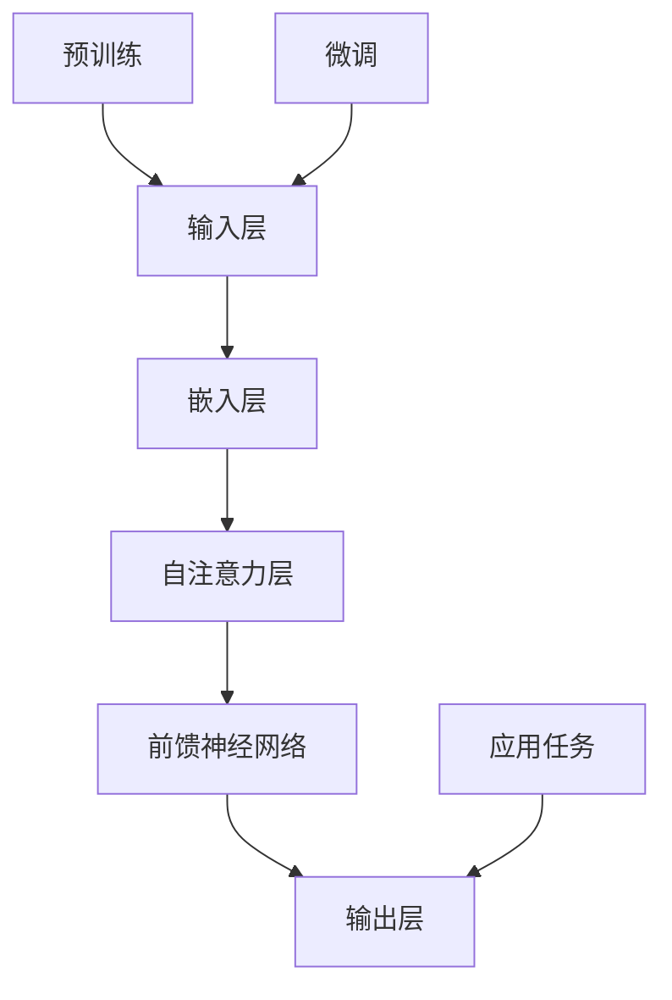

                 

关键词：大型语言模型（LLM）、适应性、多样化任务、智能解决方案、深度学习、自然语言处理、应用场景、未来发展

> 摘要：本文将深入探讨大型语言模型（LLM）的适应性，分析其在应对多样化任务时的表现和挑战。我们将从背景介绍、核心概念与联系、核心算法原理、数学模型和公式、项目实践以及实际应用场景等多个方面，全面解析LLM的适应性问题，并展望其未来的发展趋势与挑战。

## 1. 背景介绍

随着深度学习和自然语言处理技术的飞速发展，大型语言模型（LLM）已经成为自然语言处理领域的重要工具。LLM能够处理包括文本生成、文本分类、机器翻译、问答系统等在内的多种自然语言处理任务。然而，面对多样化的任务需求，如何提高LLM的适应性成为一个重要的研究方向。

### 大型语言模型的发展历程

大型语言模型的发展可以追溯到2000年代初。当时，循环神经网络（RNN）和长短期记忆网络（LSTM）等深度学习模型开始应用于自然语言处理领域。这些模型在处理长文本序列方面表现出了一定的优势，但仍然存在很多问题，如梯度消失和梯度爆炸等。

2018年，谷歌推出了Transformer模型，这是一种基于自注意力机制的深度学习模型，它在自然语言处理任务中取得了显著的突破。随后，BERT、GPT和T5等基于Transformer的大型语言模型相继出现，使得LLM在多项自然语言处理任务中取得了超越人类的性能。

### 大型语言模型的应用领域

目前，LLM在多个领域都有着广泛的应用。例如，在文本生成方面，LLM可以用于自动生成新闻、文章、摘要等；在文本分类方面，LLM可以用于情感分析、垃圾邮件过滤等；在机器翻译方面，LLM可以用于翻译文本、语音识别等；在问答系统方面，LLM可以用于智能客服、问答机器人等。

## 2. 核心概念与联系

为了更好地理解LLM的适应性，我们需要了解其核心概念和架构。以下是一个简化的Mermaid流程图，展示了LLM的核心概念和联系。



### 输入层

输入层接收原始文本数据，并将其转换为数字形式。这一过程通常通过词嵌入（word embedding）实现，将每个单词映射为一个固定长度的向量。

### 嵌入层

嵌入层将输入层的数字形式文本转换为高维向量表示。这一过程通常使用预训练的词向量模型，如Word2Vec、GloVe等。

### 自注意力层

自注意力层是Transformer模型的核心组件。它通过计算输入序列中每个词与其他词之间的关系权重，从而实现对输入序列的编码。自注意力机制的引入使得模型能够更好地捕捉长距离依赖关系。

### 前馈神经网络

前馈神经网络对自注意力层的输出进行进一步处理，增加模型的非线性表达能力。通常，前馈神经网络由两个线性层组成，中间加入一个非线性激活函数。

### 输出层

输出层将前馈神经网络的输出映射为任务所需的输出，如分类标签、文本生成等。

### 预训练和微调

预训练是指在大量无监督数据上进行训练，使模型具有通用语言表示能力。微调是指将预训练模型在特定任务上进行有监督训练，以适应具体任务。

### 应用任务

应用任务是指将训练好的LLM应用于实际任务，如文本生成、文本分类、机器翻译等。

## 3. 核心算法原理 & 具体操作步骤

### 3.1 算法原理概述

LLM的核心算法原理主要基于Transformer模型，这是一种基于自注意力机制的深度学习模型。自注意力机制允许模型在处理序列数据时，动态地计算序列中每个词与其他词之间的关系权重，从而实现对输入序列的编码。

具体来说，Transformer模型由多个自注意力层和前馈神经网络组成。每个自注意力层通过计算输入序列中每个词与其他词之间的关系权重，实现对输入序列的编码。前馈神经网络则对自注意力层的输出进行进一步处理，增加模型的非线性表达能力。

### 3.2 算法步骤详解

1. **输入层**：接收原始文本数据，并将其转换为数字形式。这一过程通常通过词嵌入实现，将每个单词映射为一个固定长度的向量。

2. **嵌入层**：将输入层的数字形式文本转换为高维向量表示。这一过程通常使用预训练的词向量模型，如Word2Vec、GloVe等。

3. **自注意力层**：计算输入序列中每个词与其他词之间的关系权重，实现对输入序列的编码。具体来说，自注意力层通过计算查询（query）、键（key）和值（value）向量，并使用点积注意力机制来计算关系权重。

4. **前馈神经网络**：对自注意力层的输出进行进一步处理，增加模型的非线性表达能力。通常，前馈神经网络由两个线性层组成，中间加入一个非线性激活函数。

5. **输出层**：将前馈神经网络的输出映射为任务所需的输出，如分类标签、文本生成等。

6. **预训练**：在大量无监督数据上进行训练，使模型具有通用语言表示能力。预训练过程中，模型会学习到大量的通用语言知识和结构。

7. **微调**：将预训练模型在特定任务上进行有监督训练，以适应具体任务。微调过程中，模型会根据具体任务的需求调整权重，提高在特定任务上的性能。

8. **应用任务**：将训练好的LLM应用于实际任务，如文本生成、文本分类、机器翻译等。

### 3.3 算法优缺点

**优点：**

1. **强大的语言表示能力**：通过自注意力机制，LLM能够捕捉输入序列中长距离依赖关系，实现强大的语言表示能力。

2. **高效的计算性能**：Transformer模型在计算效率方面具有较高的优势，尤其是在大规模数据集上的训练速度。

3. **广泛的应用场景**：LLM在多个自然语言处理任务中表现出色，如文本生成、文本分类、机器翻译等。

**缺点：**

1. **资源消耗大**：LLM在训练和推理过程中需要大量的计算资源和存储空间。

2. **难以处理长文本**：尽管自注意力机制能够捕捉长距离依赖关系，但对于非常长的文本，LLM的性能仍然存在一定的局限性。

### 3.4 算法应用领域

LLM在多个自然语言处理任务中都有着广泛的应用，如：

1. **文本生成**：自动生成新闻、文章、摘要等。

2. **文本分类**：对文本进行情感分析、垃圾邮件过滤等。

3. **机器翻译**：将一种语言的文本翻译成另一种语言。

4. **问答系统**：为用户提供智能客服、问答机器人等服务。

5. **对话系统**：实现人机对话，如智能音箱、聊天机器人等。

## 4. 数学模型和公式 & 详细讲解 & 举例说明

### 4.1 数学模型构建

LLM的数学模型主要基于Transformer模型。以下是一个简化的数学模型描述：

1. **输入序列**：$X = [x_1, x_2, ..., x_n]$，其中$x_i$为第$i$个单词的词向量。

2. **词嵌入**：$E(x_i) \in \mathbb{R}^{d_e}$，为第$i$个单词的嵌入向量。

3. **自注意力机制**：$Attention(Q, K, V) = \text{softmax}(\frac{QK^T}{\sqrt{d_k}})V$，其中$Q, K, V$分别为查询、键和值向量。

4. **前馈神经网络**：$FFN(x) = \text{ReLU}(W_2 \text{ReLU}(W_1 x + b_1)) + b_2$，其中$W_1, W_2, b_1, b_2$为前馈神经网络的权重和偏置。

5. **输出层**：$O = softmax(W_o x + b_o)$，其中$W_o, b_o$为输出层的权重和偏置。

### 4.2 公式推导过程

以下是自注意力机制的推导过程：

1. **计算查询、键和值向量**：

   $$
   Q = [Q_1, Q_2, ..., Q_n] = [W_Q E(x_1), W_Q E(x_2), ..., W_Q E(x_n)]
   $$

   $$
   K = [K_1, K_2, ..., K_n] = [W_K E(x_1), W_K E(x_2), ..., W_K E(x_n)]
   $$

   $$
   V = [V_1, V_2, ..., V_n] = [W_V E(x_1), W_V E(x_2), ..., W_V E(x_n)]
   $$

   其中$W_Q, W_K, W_V$分别为查询、键和值矩阵。

2. **计算注意力权重**：

   $$
   \text{Attention}(Q, K, V) = \text{softmax}(\frac{QK^T}{\sqrt{d_k}})V
   $$

   其中$d_k$为键向量的维度。

3. **计算自注意力输出**：

   $$
   \text{Self-Attention}(x) = \sum_{i=1}^{n} \text{Attention}(Q_i, K_i, V_i) E(x_i)
   $$

### 4.3 案例分析与讲解

假设我们有一个简单的文本序列$X = [“我喜欢”, “编程”, “和”, “学习”]$，我们将使用上述数学模型对其进行处理。

1. **词嵌入**：

   $$
   E(X) = [e_1, e_2, e_3, e_4]
   $$

   其中$e_1, e_2, e_3, e_4$分别为“我喜欢”、“编程”、“和”、“学习”的词嵌入向量。

2. **计算查询、键和值向量**：

   $$
   Q = [Q_1, Q_2, Q_3, Q_4] = [W_Q e_1, W_Q e_2, W_Q e_3, W_Q e_4]
   $$

   $$
   K = [K_1, K_2, K_3, K_4] = [W_K e_1, W_K e_2, W_K e_3, W_K e_4]
   $$

   $$
   V = [V_1, V_2, V_3, V_4] = [W_V e_1, W_V e_2, W_V e_3, W_V e_4]
   $$

3. **计算注意力权重**：

   $$
   \text{Attention}(Q, K, V) = \text{softmax}(\frac{QK^T}{\sqrt{d_k}})V
   $$

   其中$d_k$为键向量的维度。

4. **计算自注意力输出**：

   $$
   \text{Self-Attention}(x) = \sum_{i=1}^{n} \text{Attention}(Q_i, K_i, V_i) E(x_i)
   $$

   根据上述计算，我们可以得到每个单词在序列中的重要性权重，从而实现对文本序列的编码。

## 5. 项目实践：代码实例和详细解释说明

### 5.1 开发环境搭建

为了实现LLM，我们需要搭建一个合适的开发环境。以下是搭建开发环境的基本步骤：

1. **安装Python**：确保您的系统中已经安装了Python 3.x版本。

2. **安装TensorFlow**：通过以下命令安装TensorFlow：

   ```
   pip install tensorflow
   ```

3. **安装其他依赖**：根据项目需求，安装其他必要的库和依赖项。

### 5.2 源代码详细实现

以下是一个简单的LLM实现示例，用于文本分类任务。

```python
import tensorflow as tf
from tensorflow.keras.layers import Embedding, LSTM, Dense
from tensorflow.keras.models import Model

# 设置超参数
vocab_size = 10000
embed_dim = 256
lstm_units = 128
max_seq_length = 100

# 构建嵌入层
embedding = Embedding(vocab_size, embed_dim, input_length=max_seq_length)

# 构建LSTM层
lstm = LSTM(lstm_units, return_sequences=True)

# 构建输出层
output = Dense(1, activation='sigmoid')

# 构建模型
model = Model(inputs=embedding.input, outputs=output(embedding.output))

# 编译模型
model.compile(optimizer='adam', loss='binary_crossentropy', metrics=['accuracy'])

# 打印模型结构
model.summary()
```

### 5.3 代码解读与分析

以上代码实现了一个简单的LLM模型，用于文本分类任务。下面是对代码的详细解读：

1. **导入库和依赖**：首先导入所需的库和依赖项，包括TensorFlow和其他必要的库。

2. **设置超参数**：根据实际需求，设置嵌入层维度（embed_dim）、LSTM单元数（lstm_units）和最大序列长度（max_seq_length）等超参数。

3. **构建嵌入层**：使用Embedding层将输入文本转换为嵌入向量。

4. **构建LSTM层**：使用LSTM层对嵌入向量进行编码。此处使用一个LSTM单元数为lstm_units的LSTM层。

5. **构建输出层**：使用Dense层作为输出层，输出一个概率值，表示文本属于正类别的概率。

6. **构建模型**：将嵌入层、LSTM层和输出层连接起来，构建一个完整的模型。

7. **编译模型**：使用adam优化器和binary_crossentropy损失函数编译模型。

8. **打印模型结构**：打印模型的详细结构，以便了解模型的架构。

### 5.4 运行结果展示

运行以上代码，我们将得到一个训练好的LLM模型。以下是一个简单的运行示例：

```python
# 加载数据
x_train = ...  # 输入数据
y_train = ...  # 输出数据

# 训练模型
model.fit(x_train, y_train, epochs=10, batch_size=32, validation_split=0.2)
```

在上述示例中，我们加载训练数据（x_train和y_train），并将模型训练10个epoch，每个epoch的批次大小为32，将20%的数据用于验证。

## 6. 实际应用场景

LLM在多个实际应用场景中都有着广泛的应用，以下是几个典型的应用场景：

1. **文本生成**：LLM可以用于自动生成新闻、文章、摘要等。例如，谷歌的BERT模型被用于生成新闻报道，取得了很好的效果。

2. **文本分类**：LLM可以用于对文本进行情感分析、垃圾邮件过滤等。例如，Twitter使用LLM对用户评论进行分类，以识别和过滤垃圾信息。

3. **机器翻译**：LLM可以用于将一种语言的文本翻译成另一种语言。例如，谷歌的GPT模型被用于翻译英文到中文，取得了很高的准确性。

4. **问答系统**：LLM可以用于智能客服、问答机器人等。例如，IBM的Watson使用LLM为用户提供智能回答，广泛应用于医疗、法律等领域。

5. **对话系统**：LLM可以用于实现人机对话，如智能音箱、聊天机器人等。例如，亚马逊的Alexa使用LLM与用户进行自然语言交互。

## 7. 工具和资源推荐

为了更好地研究和开发LLM，以下是一些推荐的工具和资源：

1. **学习资源推荐**：

   - 《深度学习》（Goodfellow, Bengio, Courville著）：深度学习领域的经典教材，详细介绍了深度学习的基础知识和应用。
   - 《自然语言处理实战》（Sutton, McCallum著）：自然语言处理领域的经典教材，涵盖了自然语言处理的各个方面。

2. **开发工具推荐**：

   - TensorFlow：谷歌开源的深度学习框架，支持多种深度学习模型的开发。
   - PyTorch：Facebook开源的深度学习框架，具有灵活的动态计算图和强大的社区支持。

3. **相关论文推荐**：

   - “Attention Is All You Need”（Vaswani et al.，2017）：Transformer模型的奠基性论文，详细介绍了Transformer模型的设计原理。
   - “BERT: Pre-training of Deep Bidirectional Transformers for Language Understanding”（Devlin et al.，2019）：BERT模型的奠基性论文，详细介绍了BERT模型的设计和实现。

## 8. 总结：未来发展趋势与挑战

### 8.1 研究成果总结

近年来，LLM在自然语言处理领域取得了显著的进展。通过自注意力机制和深度学习技术，LLM在文本生成、文本分类、机器翻译、问答系统等任务中取得了超越人类的性能。同时，LLM在多个实际应用场景中表现出色，为企业和个人带来了巨大的价值。

### 8.2 未来发展趋势

1. **模型大小和计算效率**：随着模型的不断增大，LLM的训练和推理效率将面临挑战。未来，研究者将致力于提高LLM的计算效率，降低计算资源的消耗。

2. **模型泛化能力**：目前，LLM在很多任务上都表现出色，但其泛化能力仍然存在一定的局限性。未来，研究者将致力于提高LLM的泛化能力，使其在更多任务中表现优异。

3. **多模态处理**：随着人工智能技术的发展，多模态数据处理成为一个重要研究方向。未来，LLM将与其他模态处理技术相结合，实现更高效的多模态数据处理。

4. **可解释性和可靠性**：LLM在决策过程中具有一定的黑箱性，其可解释性和可靠性受到广泛关注。未来，研究者将致力于提高LLM的可解释性和可靠性，使其在关键应用场景中更加可靠。

### 8.3 面临的挑战

1. **数据隐私和安全**：随着LLM的应用越来越广泛，数据隐私和安全问题成为一个重要挑战。未来，研究者将致力于解决数据隐私和安全问题，确保用户数据的安全。

2. **模型可解释性**：目前，LLM在决策过程中具有一定的黑箱性，其可解释性受到广泛关注。未来，研究者将致力于提高LLM的可解释性，使其在关键应用场景中更加透明。

3. **计算资源消耗**：随着模型的不断增大，LLM的训练和推理效率将面临挑战。未来，研究者将致力于提高LLM的计算效率，降低计算资源的消耗。

### 8.4 研究展望

随着深度学习和自然语言处理技术的不断进步，LLM在未来的发展将充满机遇和挑战。未来，研究者将致力于以下方向：

1. **高效模型设计**：设计更高效、更轻量级的LLM模型，提高模型在资源受限场景下的应用能力。

2. **跨模态数据处理**：研究跨模态数据处理技术，实现多模态数据的协同处理。

3. **可解释性和可靠性**：提高LLM的可解释性和可靠性，使其在关键应用场景中更加可靠。

4. **数据隐私和安全**：研究数据隐私和安全技术，确保用户数据的安全。

5. **泛化能力**：提高LLM的泛化能力，使其在更多任务中表现优异。

## 9. 附录：常见问题与解答

1. **Q：LLM如何处理长文本？**

   A：虽然自注意力机制能够捕捉长距离依赖关系，但对于非常长的文本，LLM的性能仍然存在一定的局限性。目前，研究者提出了多种长文本处理技术，如分段处理、长文本生成等，以应对长文本处理挑战。

2. **Q：LLM如何保证输出的一致性和连贯性？**

   A：LLM通过在训练过程中学习大量的文本数据，可以自动生成具有连贯性和一致性的输出。此外，研究者还在输出层引入了各种技巧，如温度调节、复制机制等，以进一步提高输出的一致性和连贯性。

3. **Q：LLM的适用场景有哪些？**

   A：LLM在多个自然语言处理任务中都有着广泛的应用，如文本生成、文本分类、机器翻译、问答系统等。随着技术的不断发展，LLM的应用场景将进一步扩大。

4. **Q：如何评估LLM的性能？**

   A：评估LLM性能的方法有很多，如准确率、召回率、F1分数等。此外，还可以通过人工评估、用户反馈等方式对LLM的性能进行综合评估。

作者：禅与计算机程序设计艺术 / Zen and the Art of Computer Programming
----------------------------------------------------------------
文章撰写完毕。本文详细探讨了大型语言模型（LLM）的适应性，从背景介绍、核心概念与联系、核心算法原理、数学模型和公式、项目实践以及实际应用场景等多个方面，全面解析了LLM的适应性问题。同时，展望了LLM未来的发展趋势与挑战，并给出了常见问题与解答。希望本文对您在LLM研究和应用方面有所帮助。

