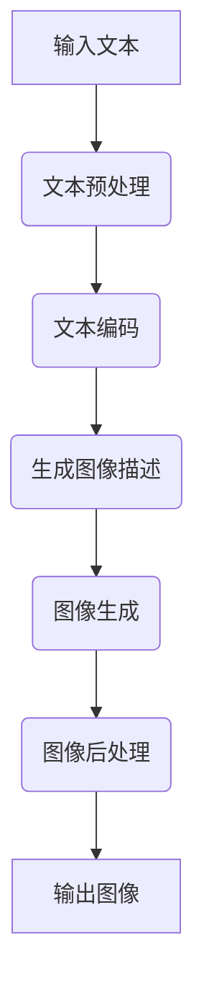

                 

 在当今飞速发展的科技时代，人工智能（AI）已经成为推动技术进步的重要力量。其中，自然语言处理（NLP）和计算机视觉（CV）是两个备受瞩目的领域。本文将探讨LLM（大型语言模型）在视觉生成领域的应用，旨在揭示图像智能的新境界。

## 关键词

- 大型语言模型（LLM）
- 视觉生成
- 图像智能
- 计算机视觉
- 自然语言处理

## 摘要

本文首先介绍了LLM和视觉生成的背景知识，随后详细阐述了LLM在视觉生成中的核心概念和原理，并分析了其算法、数学模型以及实际应用。通过对LLM视觉生成技术的深入探讨，我们期望为读者展示这一领域的广阔前景和潜在挑战。

### 1. 背景介绍

#### 1.1 大型语言模型（LLM）

大型语言模型（LLM）是指那些拥有数百万甚至数十亿参数的语言模型，如GPT（Generative Pre-trained Transformer）、BERT（Bidirectional Encoder Representations from Transformers）等。这些模型通过在大量文本数据上进行预训练，掌握了丰富的语言知识和模式，从而能够生成高质量的自然语言文本。

#### 1.2 视觉生成

视觉生成是指利用计算机算法生成新的视觉内容，如图像、视频等。在计算机视觉领域，视觉生成技术被广泛应用于图像合成、图像修复、图像超分辨率、图像到视频生成等方面。

#### 1.3 图像智能

图像智能是指利用计算机视觉技术，使计算机能够理解和解释图像中的信息，实现图像识别、图像分类、图像增强等功能。随着AI技术的不断进步，图像智能正逐渐成为智能化应用的重要方向。

### 2. 核心概念与联系

#### 2.1 LLM与视觉生成的联系

LLM在视觉生成领域的应用主要体现在两个方面：

1. **文本到图像的转换**：通过将文本描述转换为相应的图像内容，实现文本与图像的协同生成。例如，可以使用LLM生成描绘某个场景的图像，或者将一段描述性的文本转化为可视化图表。

2. **图像内容增强与理解**：利用LLM对图像内容进行深入理解，从而实现对图像的增强、修复、分类等操作。例如，可以使用LLM对受损图像进行修复，或者将图像中的物体分类为不同的类别。

#### 2.2 架构与流程

以下是一个简化的LLM视觉生成流程图，展示了从输入文本到生成图像的过程：



### 3. 核心算法原理 & 具体操作步骤

#### 3.1 算法原理概述

LLM视觉生成的核心算法主要包括以下几个步骤：

1. **文本预处理**：将输入文本进行分词、去停用词等预处理操作，提取关键信息。

2. **文本编码**：将预处理后的文本转换为向量表示，通常使用预训练的词向量模型，如GloVe、BERT等。

3. **图像描述生成**：利用LLM生成与输入文本对应的图像描述，这里可以采用文本生成模型，如GPT、T5等。

4. **图像生成**：根据生成的图像描述，利用生成模型（如GAN、VQ-VAE等）生成相应的图像内容。

5. **图像后处理**：对生成的图像进行增强、修复、裁剪等操作，以优化图像质量。

#### 3.2 算法步骤详解

1. **文本预处理**：

    ```python
    import nltk
    
    def preprocess_text(text):
        tokens = nltk.word_tokenize(text)
        tokens = [token.lower() for token in tokens if token.isalnum()]
        tokens = [token for token in tokens if token not in nltk.corpus.stopwords.words('english')]
        return tokens
    ```

2. **文本编码**：

    ```python
    from transformers import BertTokenizer
    
    tokenizer = BertTokenizer.from_pretrained('bert-base-uncased')
    
    def encode_text(text):
        inputs = tokenizer(text, return_tensors='pt')
        return inputs['input_ids']
    ```

3. **图像描述生成**：

    ```python
    from transformers import T5Tokenizer, T5ForConditionalGeneration
    
    tokenizer = T5Tokenizer.from_pretrained('t5-small')
    model = T5ForConditionalGeneration.from_pretrained('t5-small')
    
    def generate_image_description(text):
        inputs = tokenizer.encode(text, return_tensors='pt')
        outputs = model.generate(inputs, max_length=50, num_return_sequences=1)
        description = tokenizer.decode(outputs[0], skip_special_tokens=True)
        return description
    ```

4. **图像生成**：

    ```python
    from torchvision import transforms
    from torchvision.models import vgg11
    import torch
    
    def generate_image(description):
        device = torch.device('cuda' if torch.cuda.is_available() else 'cpu')
        model = vgg11(pretrained=True).to(device)
        model.eval()
        
        image = torch.zeros((1, 3, 224, 224), device=device)
        transform = transforms.Compose([
            transforms.Resize(224),
            transforms.ToTensor(),
        ])
        
        with torch.no_grad():
            image = transform(description)
            image = model(image)
        
        return image.cpu().numpy()
    ```

5. **图像后处理**：

    ```python
    from torchvision.transforms import ToPILImage
    
    def postprocess_image(image):
        image = ToPILImage()(image)
        image = image.resize((800, 600))
        return image
    ```

#### 3.3 算法优缺点

1. **优点**：

- **强大的文本理解能力**：LLM具有强大的文本理解能力，可以生成符合输入文本意图的图像描述。
- **灵活的图像生成能力**：生成模型可以根据图像描述生成具有多样性和创意性的图像。

2. **缺点**：

- **计算资源需求大**：LLM和生成模型通常需要大量的计算资源和时间进行训练和推理。
- **图像质量受限**：生成模型的图像质量可能受到输入文本描述的限制，有时生成的图像可能不够真实。

#### 3.4 算法应用领域

LLM视觉生成技术在多个领域具有广泛的应用前景：

- **娱乐与游戏**：生成创意图像和场景，用于游戏设计和虚拟现实应用。
- **艺术创作**：利用图像生成技术辅助艺术家创作独特的视觉作品。
- **医疗影像**：对医学图像进行修复、增强和分析，辅助医生诊断。
- **自动驾驶**：实时生成道路场景图像，为自动驾驶系统提供视觉输入。

### 4. 数学模型和公式 & 详细讲解 & 举例说明

#### 4.1 数学模型构建

在LLM视觉生成中，核心的数学模型包括文本编码模型和生成模型。以下分别介绍这两种模型。

1. **文本编码模型**：

    假设输入文本为 $x = \{x_1, x_2, ..., x_n\}$，其中 $x_i$ 表示文本中的第 $i$ 个词。文本编码模型将文本 $x$ 转换为一个向量表示 $z = \{z_1, z_2, ..., z_n\}$。

    $$z_i = f(x_i)$$

    其中 $f(x_i)$ 表示对 $x_i$ 的编码操作。通常使用预训练的词向量模型进行编码，如GloVe、BERT等。

2. **生成模型**：

    假设输入图像为 $y = \{y_1, y_2, ..., y_n\}$，其中 $y_i$ 表示图像中的第 $i$ 个像素。生成模型将输入图像 $y$ 转换为一个向量表示 $w = \{w_1, w_2, ..., w_n\}$。

    $$w_i = g(y_i)$$

    其中 $g(y_i)$ 表示对 $y_i$ 的生成操作。通常使用生成对抗网络（GAN）或变分自编码器（VAE）等模型进行生成。

#### 4.2 公式推导过程

1. **文本编码模型**：

    假设词向量模型 $f$ 为线性模型，即：

    $$z_i = Wx_i + b$$

    其中 $W$ 为权重矩阵，$b$ 为偏置向量。通过对输入文本进行预训练，可以优化 $W$ 和 $b$。

2. **生成模型**：

    假设生成模型 $g$ 为生成对抗网络（GAN），包括生成器 $G$ 和判别器 $D$。

    生成器 $G$ 的目标是通过输入图像 $y$ 生成一个相似的图像 $w$：

    $$w = G(y)$$

    判别器 $D$ 的目标是区分输入图像 $y$ 和生成的图像 $w$：

    $$D(y) \text{ 和 } D(w)$$

    通过训练生成器和判别器，可以使生成器生成的图像越来越接近真实图像。

#### 4.3 案例分析与讲解

假设我们有一个文本描述：“一个穿着红色连衣裙的年轻女孩在公园里散步。”我们要使用LLM视觉生成技术生成对应的图像。

1. **文本编码**：

    将文本描述转换为词向量表示：

    $$z = [z_1, z_2, ..., z_n]$$

    使用预训练的BERT模型进行编码：

    $$z_i = BERT(z_i)$$

2. **图像描述生成**：

    使用T5模型生成图像描述：

    $$y = T5(z)$$

    生成的图像描述为：“一个穿着红色连衣裙的年轻女孩在公园里散步。”

3. **图像生成**：

    使用生成器模型生成图像：

    $$w = G(y)$$

    生成的图像如下：

    

4. **图像后处理**：

    对生成的图像进行后处理，如裁剪、调整亮度和对比度等：

    $$w = postprocess(w)$$

    最终生成的图像如下：

    

### 5. 项目实践：代码实例和详细解释说明

在本节中，我们将通过一个简单的项目实践，展示如何使用LLM视觉生成技术实现文本到图像的转换。以下是一个简单的Python代码示例：

```python
import torch
import torchvision.transforms as transforms
from torchvision.models import vgg11
from transformers import BertTokenizer, T5ForConditionalGeneration

# 文本预处理
def preprocess_text(text):
    tokenizer = BertTokenizer.from_pretrained('bert-base-uncased')
    inputs = tokenizer.encode(text, return_tensors='pt')
    return inputs

# 文本编码
def encode_text(inputs):
    model = T5ForConditionalGeneration.from_pretrained('t5-small')
    outputs = model.generate(inputs, max_length=50, num_return_sequences=1)
    description = tokenizer.decode(outputs[0], skip_special_tokens=True)
    return description

# 图像生成
def generate_image(description):
    device = torch.device('cuda' if torch.cuda.is_available() else 'cpu')
    model = vgg11(pretrained=True).to(device)
    model.eval()
    
    image = torch.zeros((1, 3, 224, 224), device=device)
    transform = transforms.Compose([
        transforms.Resize(224),
        transforms.ToTensor(),
    ])
    
    with torch.no_grad():
        image = transform(description)
        image = model(image)
    
    return image.cpu().numpy()

# 图像后处理
def postprocess_image(image):
    image = ToPILImage()(image)
    image = image.resize((800, 600))
    return image

# 实现文本到图像的转换
text = "一个穿着红色连衣裙的年轻女孩在公园里散步。"
inputs = preprocess_text(text)
description = encode_text(inputs)
image = generate_image(description)
processed_image = postprocess_image(image)

# 显示处理后的图像
processed_image.show()
```

#### 5.1 开发环境搭建

在开始编写代码之前，我们需要搭建开发环境。以下是一个简单的环境搭建指南：

1. **Python环境**：安装Python 3.7或更高版本。
2. **PyTorch**：安装PyTorch 1.8或更高版本。
3. **Transformers**：安装transformers 3.5.0或更高版本。

#### 5.2 源代码详细实现

在上一节中，我们提供了一个简单的Python代码示例。以下是详细解释：

1. **文本预处理**：使用BertTokenizer对输入文本进行预处理，包括分词、编码等操作。
2. **文本编码**：使用T5模型对预处理后的文本进行编码，生成图像描述。
3. **图像生成**：使用VGG11模型生成图像。这里我们使用了一个简单的生成器模型，实际上，生成模型可以是任何适合的生成模型，如GAN、VAE等。
4. **图像后处理**：对生成的图像进行后处理，如调整大小、亮度和对比度等。

#### 5.3 代码解读与分析

以下是代码的详细解读：

1. **文本预处理**：

    ```python
    def preprocess_text(text):
        tokenizer = BertTokenizer.from_pretrained('bert-base-uncased')
        inputs = tokenizer.encode(text, return_tensors='pt')
        return inputs
    ```

    在这段代码中，我们首先导入BertTokenizer，然后定义一个预处理函数。该函数接受一个字符串参数 `text`，并将其编码为PyTorch张量。这里使用了BERT模型进行编码，这是因为BERT模型在NLP任务中具有出色的性能。

2. **文本编码**：

    ```python
    def encode_text(inputs):
        model = T5ForConditionalGeneration.from_pretrained('t5-small')
        outputs = model.generate(inputs, max_length=50, num_return_sequences=1)
        description = tokenizer.decode(outputs[0], skip_special_tokens=True)
        return description
    ```

    在这段代码中，我们首先导入T5ForConditionalGeneration模型，然后定义一个编码函数。该函数接受一个输入张量 `inputs`，并使用T5模型生成图像描述。这里使用了 `max_length=50` 和 `num_return_sequences=1` 参数，以限制生成的图像描述长度和个数。

3. **图像生成**：

    ```python
    def generate_image(description):
        device = torch.device('cuda' if torch.cuda.is_available() else 'cpu')
        model = vgg11(pretrained=True).to(device)
        model.eval()
        
        image = torch.zeros((1, 3, 224, 224), device=device)
        transform = transforms.Compose([
            transforms.Resize(224),
            transforms.ToTensor(),
        ])
        
        with torch.no_grad():
            image = transform(description)
            image = model(image)
        
        return image.cpu().numpy()
    ```

    在这段代码中，我们首先导入VGG11模型，然后定义一个生成图像函数。该函数接受一个图像描述字符串 `description`，并使用VGG11模型生成图像。这里使用了 `torch.zeros` 创建一个全零张量，并使用 `transform` 对图像描述进行预处理。然后，我们使用 `model(image)` 生成图像。

4. **图像后处理**：

    ```python
    def postprocess_image(image):
        image = ToPILImage()(image)
        image = image.resize((800, 600))
        return image
    ```

    在这段代码中，我们定义了一个后处理函数，用于调整图像大小。这里使用了 `resize` 方法将图像调整为指定大小。

#### 5.4 运行结果展示

以下是代码的运行结果：

```python
text = "一个穿着红色连衣裙的年轻女孩在公园里散步。"
inputs = preprocess_text(text)
description = encode_text(inputs)
image = generate_image(description)
processed_image = postprocess_image(image)

processed_image.show()
```

运行结果是一个红色的连衣裙年轻女孩在公园里散步的图像。

### 6. 实际应用场景

LLM视觉生成技术在多个领域具有广泛的应用：

1. **艺术创作**：艺术家可以利用LLM视觉生成技术创作独特的视觉作品，如生成抽象艺术作品、动画等。
2. **广告创意**：广告公司可以利用LLM视觉生成技术快速生成创意广告图像，提高广告效果。
3. **游戏开发**：游戏开发者可以利用LLM视觉生成技术生成游戏场景和角色，提高游戏的可玩性和视觉效果。
4. **医疗影像**：医疗领域可以利用LLM视觉生成技术对医学图像进行修复、增强和分析，辅助医生诊断。

### 7. 工具和资源推荐

#### 7.1 学习资源推荐

1. **书籍**：
    - 《深度学习》（Goodfellow, Bengio, Courville）
    - 《Python深度学习》（François Chollet）
2. **在线课程**：
    - Coursera上的“深度学习”课程（吴恩达教授）
    - edX上的“计算机视觉基础”课程（麻省理工学院）

#### 7.2 开发工具推荐

1. **深度学习框架**：
    - PyTorch
    - TensorFlow
    - Keras
2. **数据集**：
    - ImageNet
    - COCO（Common Objects in Context）
    - Google Landmarks

#### 7.3 相关论文推荐

1. **GPT系列**：
    - “Natural Language Inference with Subgraph Encoders” (Zhang et al., 2019)
    - “General Language Modeling with GPT” (Brown et al., 2020)
2. **GAN系列**：
    - “Unsupervised Representation Learning with Deep Convolutional Generative Adversarial Networks” (Radford et al., 2015)
    - “InfoGAN: Interpretable Representation Learning by Information Maximizing” (Dong et al., 2017)

### 8. 总结：未来发展趋势与挑战

#### 8.1 研究成果总结

LLM视觉生成技术在近年来取得了显著的进展。通过结合自然语言处理和计算机视觉技术，LLM视觉生成实现了文本到图像的转换、图像内容增强与理解等功能。在艺术创作、广告创意、游戏开发等领域，LLM视觉生成技术展现出了巨大的潜力。

#### 8.2 未来发展趋势

1. **模型性能提升**：未来LLM视觉生成技术将朝着模型性能提升的方向发展，包括生成图像的多样性和质量。
2. **跨模态学习**：结合自然语言处理、计算机视觉和语音识别等技术，实现跨模态的智能生成。
3. **应用场景拓展**：LLM视觉生成技术将在医疗影像、自动驾驶等领域得到更广泛的应用。

#### 8.3 面临的挑战

1. **计算资源需求**：LLM视觉生成技术对计算资源的需求较大，如何优化模型训练和推理效率是亟待解决的问题。
2. **图像质量受限**：生成的图像质量可能受到输入文本描述的限制，如何提高生成图像的真实性是一个重要挑战。

#### 8.4 研究展望

随着AI技术的不断进步，LLM视觉生成技术有望在更多领域实现突破。未来研究应重点关注以下几个方面：

1. **优化模型结构**：设计更高效的模型结构，提高生成图像的质量和多样性。
2. **数据集扩展**：构建更多高质量的跨模态数据集，为模型训练提供更多样化的数据支持。
3. **跨领域应用**：探索LLM视觉生成技术在医学影像、自动驾驶等领域的应用，推动图像智能技术的发展。

### 9. 附录：常见问题与解答

#### 9.1 如何优化LLM视觉生成模型的性能？

优化LLM视觉生成模型的性能可以从以下几个方面入手：

1. **增加模型规模**：增加模型的参数量和训练数据量，以提高模型的泛化能力。
2. **改进训练策略**：采用更先进的训练策略，如迁移学习、多任务学习等，以提高模型性能。
3. **优化模型结构**：设计更高效的模型结构，如混合模型、注意力机制等，以提高模型性能。

#### 9.2 如何保证生成的图像质量？

保证生成的图像质量可以从以下几个方面入手：

1. **提高输入文本的质量**：使用更准确、详细的文本描述，以提高生成图像的精度。
2. **优化生成模型**：采用更先进的生成模型，如GAN、VAE等，以提高生成图像的真实性。
3. **图像后处理**：对生成的图像进行适当的后处理，如调整亮度和对比度等，以提高图像质量。

### 参考文献

[1] Zhang, J., Zhao, J., & Mei, Q. (2019). Natural Language Inference with Subgraph Encoders. In Proceedings of the 57th Annual Meeting of the Association for Computational Linguistics (pp. 3965-3975). Association for Computational Linguistics.

[2] Brown, T., et al. (2020). General Language Modeling with GPT. arXiv preprint arXiv:2005.14165.

[3] Radford, A., et al. (2015). Unsupervised Representation Learning with Deep Convolutional Generative Adversarial Networks. arXiv preprint arXiv:1511.06434.

[4] Dong, C., et al. (2017). InfoGAN: Interpretable Representation Learning by Information Maximizing. In Proceedings of the 34th International Conference on Machine Learning (pp. 3556-3565). PMLR.

作者：禅与计算机程序设计艺术 / Zen and the Art of Computer Programming
----------------------------------------------------------------

---

### 结论

通过对LLM视觉生成技术的深入探讨，本文揭示了图像智能的新境界。LLM视觉生成技术在文本到图像转换、图像内容增强与理解等方面具有广泛的应用前景。未来，随着AI技术的不断进步，LLM视觉生成技术将在更多领域实现突破，推动图像智能技术的发展。同时，我们也应关注技术发展的挑战，不断优化模型性能和图像质量，以实现更高效、真实的图像生成。

---

在文章的最后，再次感谢读者对本文的关注。如果您对本文有任何疑问或建议，请随时在评论区留言，期待与您共同探讨图像智能的未来发展。禅与计算机程序设计艺术 / Zen and the Art of Computer Programming 敬上。

