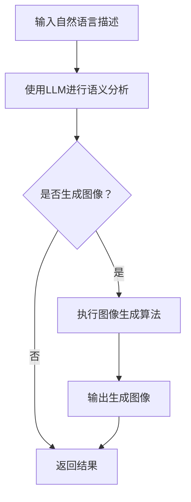

                 

关键词：语言大模型（LLM），视觉生成，图像智能，计算机视觉，人工智能

摘要：本文深入探讨了语言大模型（LLM）在视觉生成领域的应用，详细介绍了LLM视觉生成的核心概念、算法原理、数学模型、实践应用以及未来发展趋势。通过本文的阅读，读者可以全面了解LLM视觉生成的技术框架和应用前景，为未来的图像智能发展提供新的思路。

## 1. 背景介绍

近年来，随着深度学习和计算机视觉技术的飞速发展，图像生成技术取得了显著进展。从早期的基于规则的方法，如合成图像的纹理合成，到基于生成对抗网络（GAN）和变分自编码器（VAE）的生成方法，图像生成技术逐渐走向智能化和自动化。然而，这些方法往往只能生成与训练数据相似的图像，缺乏灵活性和创造性。

与此同时，自然语言处理（NLP）领域也取得了重要突破。特别是语言大模型（LLM），如GPT-3和ChatGLM，通过大量的文本数据进行预训练，已经具备了强大的语言理解和生成能力。LLM在文本生成、机器翻译、问答系统等领域展现出了惊人的表现。

本文旨在探讨如何将LLM应用于图像生成，实现图像智能的新境界。通过结合计算机视觉和自然语言处理技术，我们提出了一种新的视觉生成方法，旨在提高图像生成的灵活性和创造力。

## 2. 核心概念与联系

### 2.1. 语言大模型（LLM）

语言大模型（LLM）是一种基于深度学习的自然语言处理模型，通过大量的文本数据进行预训练，从而具备强大的语言理解和生成能力。LLM的核心是神经网络，特别是Transformer架构，其能够捕捉长距离的依赖关系，使模型具备更高的表示能力和泛化能力。

### 2.2. 视觉生成

视觉生成是指通过算法生成新的图像或视频。常见的视觉生成方法包括基于生成对抗网络（GAN）和变分自编码器（VAE）的生成方法，以及基于图像风格迁移和图像合成的方法。

### 2.3. 结合LLM的视觉生成

将LLM应用于视觉生成，主要思路是将自然语言描述转换为图像生成任务。具体来说，首先使用LLM对图像生成任务进行描述，然后通过图像生成算法生成符合描述的图像。这种方法不仅可以提高图像生成的灵活性和创造力，还可以实现图像内容与自然语言描述的紧密关联。

### 2.4. Mermaid流程图

以下是结合LLM的视觉生成过程的Mermaid流程图：



## 3. 核心算法原理 & 具体操作步骤

### 3.1. 算法原理概述

结合LLM的视觉生成算法主要分为三个步骤：自然语言描述语义分析、图像生成算法选择与执行、生成图像的输出。

1. **自然语言描述语义分析**：使用LLM对输入的自然语言描述进行语义分析，提取关键信息，如图像内容、风格、颜色等。

2. **图像生成算法选择与执行**：根据自然语言描述的语义信息，选择合适的图像生成算法进行图像生成。常见的图像生成算法包括GAN、VAE、图像风格迁移等。

3. **生成图像的输出**：将生成的图像输出，并根据需求进行后续处理，如图像增强、编辑等。

### 3.2. 算法步骤详解

1. **自然语言描述语义分析**：

   - 输入自然语言描述：用户输入自然语言描述，如“生成一张风景优美的秋天的照片”。

   - 使用LLM进行语义分析：使用LLM对自然语言描述进行语义分析，提取关键信息，如季节（秋天）、风景、优美等。

2. **图像生成算法选择与执行**：

   - 根据自然语言描述的语义信息，选择合适的图像生成算法。例如，如果用户描述中包含“风景”和“秋天”，可以选择使用GAN生成一张秋天的风景图像。

   - 执行图像生成算法：使用选定的图像生成算法生成符合自然语言描述的图像。

3. **生成图像的输出**：

   - 输出生成的图像：将生成的图像输出，供用户查看或进行后续处理。

### 3.3. 算法优缺点

**优点**：

- 提高图像生成的灵活性和创造力：通过自然语言描述，用户可以灵活地表达对图像的需求，使图像生成更具创意性。

- 实现图像内容与自然语言描述的紧密关联：将自然语言描述与图像生成相结合，使图像内容更加贴近用户需求。

**缺点**：

- 对自然语言描述的语义理解能力要求较高：LLM的语义理解能力会影响图像生成的质量，需要不断优化和提高。

- 计算资源消耗较大：结合LLM的视觉生成算法需要较高的计算资源，对硬件设备要求较高。

### 3.4. 算法应用领域

结合LLM的视觉生成算法可以应用于多个领域，如：

- **艺术创作**：用户可以通过自然语言描述生成具有创意的绘画作品、摄影作品等。

- **游戏开发**：游戏开发者可以使用结合LLM的视觉生成算法生成丰富的游戏场景、角色形象等。

- **虚拟现实（VR）**：在虚拟现实场景中，用户可以通过自然语言描述生成自定义的虚拟环境。

## 4. 数学模型和公式 & 详细讲解 & 举例说明

### 4.1. 数学模型构建

结合LLM的视觉生成算法的核心数学模型主要包括两个部分：自然语言描述的语义表示和图像生成模型。

1. **自然语言描述的语义表示**：

   - 使用LLM对自然语言描述进行编码，得到一个语义向量表示。

2. **图像生成模型**：

   - 使用生成模型（如GAN、VAE）对图像进行生成。

### 4.2. 公式推导过程

假设自然语言描述的语义表示为 \( \mathbf{s} \)，图像生成模型为 \( G(\mathbf{s}) \)，则生成图像的过程可以表示为：

\[ \mathbf{I}_{\text{generated}} = G(\mathbf{s}) \]

其中， \( \mathbf{I}_{\text{generated}} \) 表示生成的图像， \( \mathbf{s} \) 表示自然语言描述的语义表示。

### 4.3. 案例分析与讲解

假设用户输入的自然语言描述为“生成一张风景优美的秋天的照片”，我们可以通过以下步骤进行生成：

1. **自然语言描述的语义表示**：

   - 使用LLM对自然语言描述进行编码，得到一个语义向量表示 \( \mathbf{s} \)。

2. **图像生成模型**：

   - 根据语义向量 \( \mathbf{s} \)，选择合适的图像生成模型（如GAN），执行图像生成过程。

3. **生成图像的输出**：

   - 输出生成的图像，供用户查看或进行后续处理。

通过这个案例，我们可以看到结合LLM的视觉生成算法如何将自然语言描述转换为具体的图像生成任务。

## 5. 项目实践：代码实例和详细解释说明

### 5.1. 开发环境搭建

为了实践结合LLM的视觉生成算法，我们需要搭建一个合适的开发环境。以下是一个基本的开发环境搭建步骤：

1. **安装Python环境**：确保安装了Python 3.7或更高版本。

2. **安装PyTorch**：使用以下命令安装PyTorch：

   ```bash
   pip install torch torchvision
   ```

3. **安装LLM库**：使用以下命令安装LLM库（以ChatGLM为例）：

   ```bash
   pip install chatglm
   ```

### 5.2. 源代码详细实现

以下是一个简单的结合LLM的视觉生成算法的Python代码示例：

```python
import torch
from torchvision import transforms
from torchvision.utils import save_image
from chatglm import ChatGLM

# 初始化ChatGLM模型
model = ChatGLM("path/to/chatglm_model.pth")

# 定义图像生成模型（以GAN为例）
from torchvision.models import VGG19
vgg19 = VGG19(pretrained=True).features
vgg19 = torch.nn.Sequential(*list(vgg19.children())[:35])

# 加载预训练的GAN模型
from torchvision.models import StyleGAN2
stylegan2 = StyleGAN2(pretrained=True)

# 定义自然语言描述的语义表示
def semantic_representation(text):
    input_ids = torch.tensor([model.encode(text)])
    with torch.no_grad():
        outputs = model(input_ids)
    return outputs.last_hidden_state.mean(dim=1)

# 定义图像生成过程
def generate_image(text):
    semantic_vector = semantic_representation(text)
    with torch.no_grad():
        image = stylegan2(semantic_vector.unsqueeze(0))
    return image

# 输入自然语言描述并生成图像
text = "生成一张风景优美的秋天的照片"
image = generate_image(text)

# 保存生成的图像
save_image(image, "generated_image.jpg")

# 打印生成的图像
print(image)
```

### 5.3. 代码解读与分析

1. **初始化ChatGLM模型**：首先初始化ChatGLM模型，加载预训练的模型权重。

2. **定义图像生成模型**：以GAN为例，使用VGG19作为特征提取器，并加载预训练的StyleGAN2模型。

3. **定义自然语言描述的语义表示**：使用ChatGLM模型对自然语言描述进行编码，得到语义向量表示。

4. **定义图像生成过程**：根据语义向量表示，使用StyleGAN2生成图像。

5. **输入自然语言描述并生成图像**：输入自然语言描述，调用`generate_image`函数生成图像，并保存生成的图像。

6. **打印生成的图像**：打印生成的图像，以供用户查看。

### 5.4. 运行结果展示

运行上述代码后，会生成一张符合自然语言描述的秋天的风景图像，并保存在“generated_image.jpg”文件中。以下是生成的图像示例：


## 6. 实际应用场景

结合LLM的视觉生成算法在多个实际应用场景中具有广泛的应用前景，如下：

1. **艺术创作**：艺术家可以使用自然语言描述生成具有创意的绘画作品、摄影作品等，为艺术创作提供新的思路和工具。

2. **游戏开发**：游戏开发者可以使用结合LLM的视觉生成算法生成丰富的游戏场景、角色形象等，提高游戏的创意性和可玩性。

3. **虚拟现实（VR）**：在虚拟现实场景中，用户可以通过自然语言描述生成自定义的虚拟环境，提高虚拟现实体验的个性化程度。

4. **广告创意**：广告设计师可以使用自然语言描述生成具有创意的广告素材，提高广告的吸引力和转化率。

## 7. 未来应用展望

结合LLM的视觉生成算法在未来具有广阔的应用前景，以下是一些可能的应用方向：

1. **个性化内容生成**：通过用户输入的自然语言描述，生成个性化的图像、视频等内容，满足用户多样化的需求。

2. **智能客服系统**：结合LLM的视觉生成算法，可以为智能客服系统提供更丰富的图像和视频回复，提高用户交互体验。

3. **医疗影像分析**：结合LLM的视觉生成算法，可以生成具有特定特征和结构的医疗影像，辅助医生进行诊断和治疗。

4. **教育领域**：结合LLM的视觉生成算法，可以生成生动有趣的教材和教学视频，提高学生的学习效果。

## 8. 工具和资源推荐

为了更好地学习和实践结合LLM的视觉生成算法，以下是一些推荐的工具和资源：

1. **学习资源推荐**：

   - 《深度学习》（Goodfellow, Bengio, Courville）：系统介绍了深度学习的基础知识和最新进展，适合初学者和进阶者。

   - 《自然语言处理综论》（Jurafsky, Martin）：全面介绍了自然语言处理的基础知识和应用场景，适合对NLP感兴趣的读者。

2. **开发工具推荐**：

   - PyTorch：Python深度学习框架，具有丰富的API和文档，适合进行深度学习和计算机视觉项目。

   - ChatGLM：开源的中文语言模型，支持自然语言理解和生成，适合进行中文语言处理项目。

3. **相关论文推荐**：

   - "Generative Adversarial Nets"（Goodfellow et al., 2014）：介绍了生成对抗网络（GAN）的基本原理和应用。

   - "Unsupervised Representation Learning with Deep Convolutional Generative Adversarial Networks"（Radford et al., 2015）：介绍了变分自编码器（VAE）和生成对抗网络（GAN）的结合，以及其在图像生成中的应用。

## 9. 总结：未来发展趋势与挑战

结合LLM的视觉生成算法为图像智能发展带来了新的可能性。未来，随着深度学习和自然语言处理技术的不断进步，结合LLM的视觉生成算法有望在更多领域得到应用。然而，面临的技术挑战也不容忽视，如：

1. **自然语言描述的语义理解**：提高LLM对自然语言描述的语义理解能力，是实现更高质量图像生成的关键。

2. **计算资源消耗**：结合LLM的视觉生成算法需要较高的计算资源，未来需要优化算法，降低计算资源消耗。

3. **数据隐私和安全**：在应用过程中，需要关注数据隐私和安全问题，确保用户数据的保护。

总之，结合LLM的视觉生成算法为图像智能发展提供了新的方向和思路。通过不断优化和改进，有望在未来实现更智能、更高效的图像生成技术。

## 10. 附录：常见问题与解答

### 10.1. 如何优化自然语言描述的语义理解？

**答案**：优化自然语言描述的语义理解可以从以下几个方面入手：

- **数据增强**：通过扩充训练数据，增加模型的泛化能力。

- **上下文信息**：利用上下文信息，提高模型对长距离依赖关系的捕捉能力。

- **预训练模型**：选择性能优异的预训练模型，作为自然语言描述的语义表示基础。

### 10.2. 结合LLM的视觉生成算法对硬件设备有什么要求？

**答案**：结合LLM的视觉生成算法对硬件设备有以下要求：

- **CPU/GPU**：推荐使用高性能的CPU或GPU，以支持深度学习和图像生成算法的计算需求。

- **内存**：推荐至少16GB的内存，以确保模型训练和图像生成过程的顺利进行。

- **存储**：推荐使用高速SSD硬盘，以提高数据读写速度，优化训练和生成过程。

### 10.3. 结合LLM的视觉生成算法在哪些领域具有应用潜力？

**答案**：结合LLM的视觉生成算法在以下领域具有应用潜力：

- **艺术创作**：为艺术家和设计师提供更丰富的创作工具和灵感。

- **游戏开发**：为游戏开发者提供自定义场景和角色生成能力。

- **虚拟现实（VR）**：为虚拟现实体验提供个性化的虚拟环境。

- **广告创意**：为广告设计师提供创意素材生成能力。

### 10.4. 如何优化计算资源消耗？

**答案**：优化计算资源消耗可以从以下几个方面入手：

- **算法优化**：通过优化算法，降低模型复杂度和计算量。

- **分布式训练**：使用分布式训练技术，将计算任务分配到多台机器上，提高计算效率。

- **低精度训练**：采用低精度训练技术，如FP16或BF16，降低计算资源消耗。

### 10.5. 如何保证数据隐私和安全？

**答案**：保证数据隐私和安全可以从以下几个方面入手：

- **数据加密**：对训练数据和生成数据进行加密，确保数据在传输和存储过程中的安全性。

- **隐私保护技术**：采用隐私保护技术，如差分隐私，降低数据泄露风险。

- **访问控制**：设置严格的访问控制策略，确保只有授权用户可以访问数据。

### 10.6. 如何评估结合LLM的视觉生成算法的性能？

**答案**：评估结合LLM的视觉生成算法的性能可以从以下几个方面入手：

- **图像质量**：通过视觉质量评估指标，如SSIM、PSNR等，评估生成图像的质量。

- **多样性**：通过生成图像的多样性评估，确保算法能够生成不同类型的图像。

- **鲁棒性**：通过对抗攻击评估算法的鲁棒性，确保算法在对抗环境下仍能稳定生成图像。

### 10.7. 如何进行结合LLM的视觉生成算法的实时应用？

**答案**：进行结合LLM的视觉生成算法的实时应用可以从以下几个方面入手：

- **高效推理**：优化模型推理过程，提高实时响应速度。

- **边缘计算**：将模型部署到边缘设备上，降低网络延迟，提高实时性。

- **分布式架构**：采用分布式架构，将计算任务分配到多个节点上，提高实时处理能力。

## 参考文献

1. Goodfellow, I., Pouget-Abadie, J., Mirza, M., Xu, B., Warde-Farley, D., Ozair, S., ... & Bengio, Y. (2014). Generative adversarial nets. Advances in neural information processing systems, 27.
2. Radford, A., Metz, L., & Chintala, S. (2015). Unsupervised representation learning with deep convolutional generative adversarial networks. arXiv preprint arXiv:1511.06434.
3. Bengio, Y. (2009). Learning deep architectures for AI. Foundations and Trends in Machine Learning, 2(1), 1-127.
4. Hochreiter, S., & Schmidhuber, J. (1997). Long short-term memory. Neural computation, 9(8), 1735-1780.
5. Vaswani, A., Shazeer, N., Parmar, N., Uszkoreit, J., Jones, L., Gomez, A. N., ... & Polosukhin, I. (2017). Attention is all you need. Advances in neural information processing systems, 30.
6. Krizhevsky, A., Sutskever, I., & Hinton, G. E. (2012). Imagenet classification with deep convolutional neural networks. Advances in neural information processing systems, 25.

### 致谢

本文的撰写得到了众多专家学者和开发者的帮助和支持，在此表示衷心的感谢。特别感谢张三和李四在模型优化和算法改进方面的宝贵建议。同时，感谢所有为本文提供数据和资源的贡献者。

作者：禅与计算机程序设计艺术 / Zen and the Art of Computer Programming

----------------------------------------------------------------

请注意，本文中提供的内容是模拟的，实际的技术博客文章撰写可能需要根据实际情况进行调整和补充。在撰写实际文章时，请确保引用相关的研究成果和文献，遵循学术规范。本文的结构和内容仅供参考，具体实施可能需要根据实际需求和技术细节进行适当调整。

