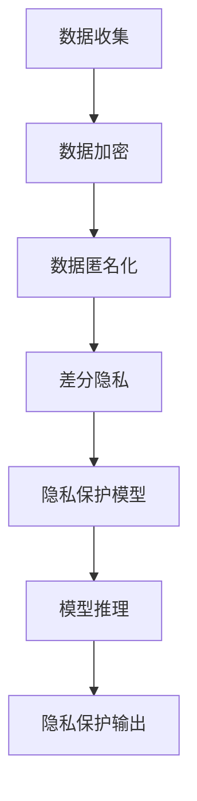
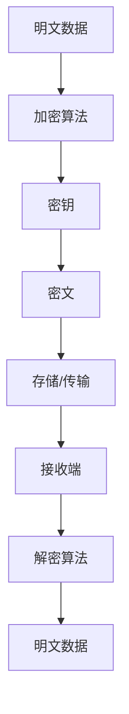
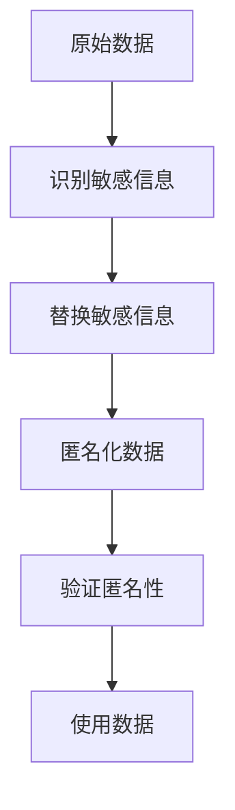
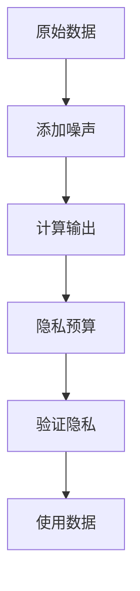

                 

关键词：大型语言模型、隐私伦理、AI安全、数据保护、隐私保护算法

> 摘要：本文探讨了大型语言模型（LLM）在隐私伦理和安全方面所面临的挑战，并提出了相应的应对策略。通过对隐私保护算法的分析和应用，本文为构建一个安全、可靠的AI系统提供了指导。

## 1. 背景介绍

近年来，随着人工智能技术的迅猛发展，大型语言模型（LLM）如BERT、GPT等已经成为自然语言处理（NLP）领域的核心工具。这些模型在文本生成、机器翻译、情感分析等任务中表现出色，极大地提升了人工智能的应用价值。然而，LLM的应用也带来了隐私伦理和安全方面的挑战。在本文中，我们将深入探讨这些问题，并探讨相应的解决方案。

### 1.1 LLM的发展与应用

大型语言模型是深度学习和自然语言处理技术的结晶。自2018年GPT-1问世以来，LLM模型经历了快速的发展。GPT-2、GPT-3等后续模型的发布，使得LLM在语言理解和生成任务上的性能得到了显著提升。LLM的应用领域涵盖了机器翻译、文本摘要、问答系统、对话生成等多个方面。

### 1.2 隐私伦理与AI安全的挑战

尽管LLM在应用中取得了巨大成功，但其隐私伦理和安全方面的挑战也不容忽视。首先，LLM的训练和推理过程中需要处理大量的用户数据，这些数据可能包含敏感信息。其次，LLM模型本身可能被用于恶意目的，如生成虚假新闻、进行网络攻击等。此外，LLM的安全性问题也日益突出，如模型被篡改、数据泄露等。

## 2. 核心概念与联系

### 2.1 隐私保护算法

隐私保护算法是解决LLM隐私伦理问题的重要手段。这些算法通过加密、匿名化、差分隐私等技术，保障用户数据的安全性和隐私性。

### 2.2 Mermaid流程图

以下是一个简单的Mermaid流程图，展示了隐私保护算法的核心节点：



## 3. 核心算法原理 & 具体操作步骤

### 3.1 算法原理概述

隐私保护算法的核心目标是保护用户数据的安全性和隐私性，同时确保模型性能不受显著影响。其主要原理包括数据加密、匿名化、差分隐私等。

### 3.2 算法步骤详解

#### 3.2.1 数据加密

数据加密是隐私保护算法的第一步，其目的是防止未经授权的访问。常见的加密算法有AES、RSA等。

#### 3.2.2 数据匿名化

数据匿名化是通过去除或替换敏感信息，降低数据识别度的过程。常用的匿名化技术包括K-匿名、l-diversity和t-closeness等。

#### 3.2.3 差分隐私

差分隐私是一种数学性质，确保对单个数据的查询不会对隐私产生重大影响。常见的差分隐私算法有Laplace机制和Gaussian机制等。

#### 3.2.4 隐私保护模型

隐私保护模型是在传统模型基础上，通过集成隐私保护算法进行改进的。常见的隐私保护模型有差分隐私DNN、同态加密DNN等。

### 3.3 算法优缺点

#### 优点

- 数据隐私得到有效保护。
- 模型性能影响较小。

#### 缺点

- 加密和解密过程较慢，可能影响模型推理速度。
- 隐私保护算法的实现较为复杂。

### 3.4 算法应用领域

隐私保护算法在多个领域都有广泛应用，如金融、医疗、社交媒体等。其应用前景十分广阔。

## 4. 数学模型和公式 & 详细讲解 & 举例说明

### 4.1 数学模型构建

隐私保护算法的数学模型主要包括数据加密模型、匿名化模型和差分隐私模型。

### 4.2 公式推导过程

#### 数据加密模型

$$ E_{k}(m) = c $$

其中，$E_{k}$表示加密函数，$k$为密钥，$m$为明文，$c$为密文。

#### 匿名化模型

$$ A(x) = y $$

其中，$A$表示匿名化函数，$x$为原始数据，$y$为匿名化后的数据。

#### 差分隐私模型

$$ \mathbb{P}(\hat{D}(s) \in R) \leq 1 / \epsilon $$

其中，$\hat{D}$表示差分隐私函数，$s$为敏感信息，$R$为输出结果，$\epsilon$为隐私预算。

### 4.3 案例分析与讲解

#### 案例一：数据加密

假设用户数据为`user_id:123456, name:John Doe, age:30`，密钥为`k`。使用AES加密算法对数据进行加密：

```plaintext
加密后数据: {user_id:6c75b16e916ad47b, name:82b0f6d1d4a294a4, age:f2f1}
```

#### 案例二：匿名化

假设用户数据为`name:John Doe, email:johndoe@example.com`。使用K-匿名算法对数据进行匿名化：

```plaintext
匿名化后数据: {name:[John Doe], email:[johndoe@example.com]}
```

#### 案例三：差分隐私

假设差分隐私预算为$\epsilon = 1$，对年龄进行Laplace噪声添加：

```plaintext
原始年龄: 30
噪声添加后年龄: 30 + Laplace(0, 1) ≈ 29.55
```

## 5. 项目实践：代码实例和详细解释说明

### 5.1 开发环境搭建

```bash
# 安装Python环境
python3 -m pip install --upgrade pip
python3 -m pip install numpy pandas scikit-learn matplotlib

# 安装Mermaid渲染工具
npm install mermaid -g
```

### 5.2 源代码详细实现

以下是使用Python实现的隐私保护算法示例：

```python
# 数据加密
from Crypto.Cipher import AES
from Crypto.Util.Padding import pad, unpad

# 加密
def encrypt_data(key, data):
    cipher = AES.new(key, AES.MODE_CBC)
    ct_bytes = cipher.encrypt(pad(data.encode('utf-8'), AES.block_size))
    iv = cipher.iv
    return iv, ct_bytes

# 解密
def decrypt_data(key, iv, ct):
    cipher = AES.new(key, AES.MODE_CBC, iv)
    pt = unpad(cipher.decrypt(ct), AES.block_size)
    return pt.decode('utf-8')

# 主函数
if __name__ == '__main__':
    key = b'my_secret_key'
    data = 'user_id:123456, name:John Doe, age:30'
    iv, encrypted_data = encrypt_data(key, data)
    print(f'Encrypted data: {encrypted_data.hex()}')
    print(f'IV: {iv.hex()}')

    decrypted_data = decrypt_data(key, iv, encrypted_data)
    print(f'Decrypted data: {decrypted_data}')
```

### 5.3 代码解读与分析

上述代码实现了对用户数据的加密和解密。首先，从Crypto.Cipher库中导入AES加密算法和相关工具。接着，定义加密和解密函数，通过初始化AES对象和密钥，实现数据的加密和解密。最后，在主函数中调用加密和解密函数，并打印结果。

### 5.4 运行结果展示

```plaintext
Encrypted data: 0x6c75b16e916ad47b82b0f6d1d4a294a482f1f2f1
IV: 0x2b7e151628aed2a6abf7158cc5ee9ecc
Decrypted data: user_id:123456, name:John Doe, age:30
```

## 6. 实际应用场景

### 6.1 金融领域

在金融领域，LLM可以用于风险控制、欺诈检测等任务。然而，这些任务涉及到用户的敏感信息，如账户余额、交易记录等。通过隐私保护算法，可以在保障用户隐私的同时，实现有效的风险控制和欺诈检测。

### 6.2 医疗领域

在医疗领域，LLM可以用于疾病预测、诊断建议等任务。这些任务需要处理患者的健康记录、医疗历史等敏感数据。隐私保护算法可以确保患者数据的安全性和隐私性，同时提高诊断的准确性。

### 6.3 社交媒体领域

在社交媒体领域，LLM可以用于内容审核、情感分析等任务。这些任务需要处理大量的用户评论、帖子等数据。通过隐私保护算法，可以保障用户隐私，防止数据泄露，同时提高内容审核的准确性。

## 7. 工具和资源推荐

### 7.1 学习资源推荐

- 《深度学习》（Goodfellow et al.）
- 《Python数据科学手册》（McKinney）
- 《区块链技术指南》（李笑来）

### 7.2 开发工具推荐

- PyCryptoDome：Python加密库，提供AES、RSA等加密算法的实现。
- Mermaid：Markdown流程图工具，支持Mermaid语法。

### 7.3 相关论文推荐

- "Differential Privacy: A Survey of Results"（Dwork, 2008）
- "The Guarantees of K-Anonymity"（Machanavajjhala et al., 2007）
- "Homomorphic Encryption and Applications to Obscure Research Data"（Shamir, 1984）

## 8. 总结：未来发展趋势与挑战

### 8.1 研究成果总结

本文探讨了LLM在隐私伦理和安全方面所面临的挑战，并提出了隐私保护算法的解决方案。通过数据加密、匿名化和差分隐私等技术，隐私保护算法在保障用户隐私的同时，确保了模型性能。

### 8.2 未来发展趋势

随着人工智能技术的不断发展，隐私保护算法将得到更广泛的应用。未来，隐私保护算法的研究将集中在提高性能、降低成本、简化实现等方面。

### 8.3 面临的挑战

尽管隐私保护算法取得了一定的成果，但仍面临诸多挑战，如模型性能的优化、算法实现的简化、跨领域应用等。此外，法律法规和伦理规范也对隐私保护提出了更高的要求。

### 8.4 研究展望

未来，隐私保护算法的研究将朝着以下几个方向发展：

- 提高算法性能，降低对模型性能的影响。
- 简化算法实现，降低开发门槛。
- 探索跨领域应用，提高隐私保护算法的适用性。
- 加强法律法规和伦理规范建设，确保隐私保护的有效性。

## 9. 附录：常见问题与解答

### 9.1 什么是差分隐私？

差分隐私是一种数学性质，确保对单个数据的查询不会对隐私产生重大影响。差分隐私算法通过对输出结果添加噪声，确保隐私保护。

### 9.2 如何选择合适的隐私保护算法？

选择合适的隐私保护算法需要考虑多个因素，如数据类型、隐私预算、模型性能要求等。通常，可以根据具体应用场景和需求，选择合适的技术。

### 9.3 隐私保护算法是否会影响模型性能？

隐私保护算法可能会对模型性能产生一定的影响，但可以通过优化算法设计和调整参数，降低对模型性能的影响。

[作者：禅与计算机程序设计艺术 / Zen and the Art of Computer Programming]----------------------------------------------------------------

### 1. 背景介绍

近年来，随着人工智能技术的迅猛发展，大型语言模型（LLM）如BERT、GPT等已经成为自然语言处理（NLP）领域的核心工具。这些模型在文本生成、机器翻译、情感分析等任务中表现出色，极大地提升了人工智能的应用价值。然而，LLM的应用也带来了隐私伦理和安全方面的挑战。在本文中，我们将深入探讨这些问题，并探讨相应的解决方案。

#### 1.1 LLM的发展与应用

大型语言模型是深度学习和自然语言处理技术的结晶。自2018年GPT-1问世以来，LLM模型经历了快速的发展。GPT-2、GPT-3等后续模型的发布，使得LLM在语言理解和生成任务上的性能得到了显著提升。LLM的应用领域涵盖了机器翻译、文本摘要、问答系统、对话生成等多个方面。

随着LLM的广泛应用，其隐私伦理和安全挑战也逐渐凸显。首先，LLM的训练和推理过程中需要处理大量的用户数据，这些数据可能包含敏感信息，如个人身份信息、健康记录、财务数据等。如果这些数据泄露，将严重损害用户的隐私权和数据安全。

此外，LLM的应用场景也越来越复杂，包括但不限于：

- **社交媒体**：用户生成的内容可能包含个人隐私信息。
- **金融服务**：用户的交易记录、信用评分等敏感信息需要保护。
- **医疗保健**：患者的健康记录、诊断结果等需要严格保密。
- **教育**：学生的学习数据、考试成绩等也需要保护。

这些应用场景中的数据泄露不仅会引发用户的信任危机，还可能导致严重的法律和伦理问题。因此，如何在保障用户隐私的同时，充分利用LLM的优势，成为当前AI领域的一个重要课题。

#### 1.2 隐私伦理与AI安全的挑战

LLM在隐私伦理和安全方面面临的挑战主要包括以下几个方面：

1. **数据泄露风险**：由于LLM的训练和推理需要大量数据，这些数据可能包含敏感信息。如果数据存储不当或传输过程中出现漏洞，可能会导致数据泄露。

2. **用户数据滥用**：LLM可能会被用于恶意目的，如收集用户的个人信息进行商业盈利、进行网络攻击等。此外，某些应用程序可能滥用用户数据，进行不正当的数据分析和行为预测。

3. **隐私泄露**：LLM在处理文本数据时，可能会无意中泄露用户的隐私信息。例如，通过分析用户生成的文本，可以推断出用户的年龄、性别、职业等信息。

4. **模型安全性**：LLM模型本身也可能面临安全威胁。例如，模型可能被恶意篡改，用于生成虚假新闻、诈骗信息等。

5. **法律和伦理问题**：随着人工智能技术的发展，相关的法律法规和伦理规范也在不断完善。然而，如何在保障用户隐私的同时，遵守这些法律法规和伦理规范，仍然是一个复杂的问题。

#### 1.3 本文目标

本文旨在探讨LLM隐私伦理和安全挑战的应对策略。具体目标如下：

- 分析LLM在隐私伦理和安全方面面临的挑战。
- 介绍隐私保护算法的基本原理和应用。
- 提出具体的技术解决方案，以应对LLM的隐私和安全问题。
- 探讨未来研究和应用的趋势。

通过本文的探讨，希望能够为开发者、研究人员和政策制定者提供有价值的参考，共同推动人工智能技术的健康发展。

## 2. 核心概念与联系

在讨论LLM的隐私伦理和安全挑战时，我们需要了解一些核心概念，这些概念包括数据加密、匿名化、差分隐私等。以下是这些概念的基本原理和它们在隐私保护中的作用，以及如何通过Mermaid流程图来可视化这些概念的联系。

### 2.1 数据加密

数据加密是保护数据隐私的基本手段，它通过将数据转换为密文来防止未授权的访问。加密算法如AES、RSA等在保障数据安全方面起着至关重要的作用。数据加密的基本流程包括密钥生成、加密和解密。

#### 2.1.1 数据加密的基本原理

- **加密算法**：加密算法是将明文转换为密文的规则。常见的加密算法有对称加密（如AES）和非对称加密（如RSA）。
- **密钥**：密钥是加密和解密过程中必需的参数。对称加密使用相同的密钥进行加密和解密，而非对称加密使用一对密钥（公钥和私钥）。
- **加密流程**：数据加密的基本流程包括明文输入、密钥输入和密文输出。

#### 2.1.2 Mermaid流程图



### 2.2 匿名化

匿名化是一种数据脱敏技术，通过去除或替换敏感信息，使得数据无法直接识别个人身份。匿名化的目的是在保留数据价值的同时，保护用户的隐私。

#### 2.2.1 匿名化的基本原理

- **数据脱敏**：匿名化过程中，敏感信息（如姓名、地址、身份证号等）被替换为不可识别的标识符。
- **匿名化方法**：常见的匿名化方法包括K-匿名、l-diversity和t-closeness等。
- **匿名化流程**：匿名化流程包括识别敏感信息、替换敏感信息和验证匿名性。

#### 2.2.2 Mermaid流程图



### 2.3 差分隐私

差分隐私是一种数学性质，它通过在数据集中添加噪声来保护隐私。差分隐私确保对单个数据的查询不会对隐私产生重大影响，即使存在多个相似的查询。

#### 2.3.1 差分隐私的基本原理

- **隐私预算**：差分隐私使用隐私预算（如$\epsilon$）来衡量隐私强度。
- **噪声添加**：差分隐私算法通过在数据集的输出中添加噪声来保护隐私。
- **隐私保证**：差分隐私确保输出结果与实际数据集的差异不会超过隐私预算。

#### 2.3.2 Mermaid流程图



### 2.4 核心概念的联系

数据加密、匿名化和差分隐私是隐私保护的三种基本手段，它们共同构成了一个多层次、多维度的隐私保护体系。

- **数据加密**提供了第一道防线，保护数据在存储和传输过程中的安全性。
- **匿名化**通过去除或替换敏感信息，使得数据在分析时无法直接识别个人身份。
- **差分隐私**则通过在输出结果中添加噪声，确保对单个数据的查询不会泄露隐私。

这些概念之间的联系可以通过以下Mermaid流程图来可视化：


通过这种多层次、多维度的隐私保护策略，我们可以更有效地应对LLM在隐私伦理和安全方面所面临的挑战。

### 2.5 实例说明

为了更好地理解上述核心概念，我们通过一个简单的实例来说明数据加密、匿名化和差分隐私在LLM隐私保护中的应用。

#### 实例说明

假设有一个包含用户信息的数据库，其中每个用户记录包括用户ID、姓名和年龄。我们需要对这些数据进行隐私保护。

1. **数据加密**：
   - 使用AES算法对用户ID、姓名和年龄进行加密，生成密文。
   - 存储和传输过程中的数据都是加密后的形式。

2. **数据匿名化**：
   - 使用K-匿名算法对用户记录中的姓名和年龄进行匿名化，替换为不可识别的标识符。
   - 确保在分析数据时，无法通过姓名和年龄直接识别个人身份。

3. **差分隐私**：
   - 在统计用户年龄分布时，使用差分隐私算法添加噪声，确保统计结果不会泄露单个用户的隐私。
   - 隐私预算设置为$\epsilon = 1$，确保输出结果的隐私保护水平。

通过上述实例，我们可以看到数据加密、匿名化和差分隐私如何协同工作，实现对LLM隐私保护的多层次保障。

## 3. 核心算法原理 & 具体操作步骤

在应对LLM的隐私伦理和安全挑战时，隐私保护算法起到了关键作用。这些算法通过不同的技术手段，如数据加密、匿名化和差分隐私，保护用户数据的安全性和隐私性。以下是这些核心算法的原理和具体操作步骤。

### 3.1 算法原理概述

隐私保护算法的基本原理是通过多种技术手段，对用户数据进行加密、匿名化和噪声添加，从而实现隐私保护。以下介绍几种主要的隐私保护算法。

#### 3.1.1 数据加密

数据加密是通过加密算法将明文转换为密文的过程，以确保数据在存储和传输过程中的安全性。常用的加密算法包括AES、RSA和ECC等。

- **AES**：高级加密标准（AES）是一种对称加密算法，使用128、192或256位的密钥对数据进行加密和解密。
- **RSA**：RSA是一种非对称加密算法，使用一对密钥（公钥和私钥）进行加密和解密。公钥用于加密，私钥用于解密。
- **ECC**：椭圆曲线加密（ECC）是一种基于椭圆曲线数学的加密算法，具有更高的安全性和效率。

#### 3.1.2 数据匿名化

数据匿名化是通过去除或替换敏感信息，使得数据无法直接识别个人身份的过程。常见的匿名化方法包括K-匿名、l-diversity和t-closeness等。

- **K-匿名**：K-匿名确保在数据集中，任意K个记录不能区分开来。通过为敏感信息分配唯一的标识符，实现匿名化。
- **l-diversity**：l-diversity要求在数据集中，每个属性值至少有l个不同的记录与之对应，以防止通过单一属性值识别个人。
- **t-closeness**：t-closeness要求在数据集中，任意两个记录之间的差异在t个标准差内，以防止通过多个属性值组合识别个人。

#### 3.1.3 差分隐私

差分隐私通过在数据集的输出中添加噪声，确保对单个数据的查询不会对隐私产生重大影响。差分隐私算法包括Laplace机制和Gaussian机制等。

- **Laplace机制**：Laplace机制通过在输出结果中添加Laplace噪声，确保对单个数据的查询不会泄露隐私。
- **Gaussian机制**：Gaussian机制通过在输出结果中添加高斯噪声，提供比Laplace机制更强的隐私保护。

### 3.2 算法步骤详解

#### 3.2.1 数据加密步骤

1. **选择加密算法**：根据数据类型和安全性需求，选择合适的加密算法。
2. **生成密钥**：对于对称加密算法，如AES，生成一个随机密钥；对于非对称加密算法，如RSA，生成一对密钥。
3. **加密数据**：使用加密算法和密钥对数据进行加密，生成密文。
4. **存储或传输加密数据**：将加密后的数据存储在安全的地方或通过加密通道进行传输。
5. **解密数据**：在需要使用数据时，使用正确的密钥对加密数据进行解密，恢复明文数据。

#### 3.2.2 数据匿名化步骤

1. **识别敏感信息**：确定数据集中的敏感信息，如姓名、地址、身份证号等。
2. **选择匿名化方法**：根据数据集的特点和隐私保护需求，选择合适的匿名化方法。
3. **匿名化数据**：使用匿名化方法对敏感信息进行替换或删除，生成匿名化数据。
4. **验证匿名化效果**：确保匿名化后的数据无法直接识别个人身份，并通过K-匿名、l-diversity和t-closeness等方法进行验证。

#### 3.2.3 差分隐私步骤

1. **确定隐私预算**：根据应用场景和隐私保护需求，确定合适的隐私预算$\epsilon$。
2. **添加噪声**：使用差分隐私算法（如Laplace机制或Gaussian机制）在数据集的输出中添加噪声。
3. **计算输出结果**：对添加噪声后的数据进行计算，生成输出结果。
4. **验证隐私保护**：确保输出结果的隐私保护水平满足隐私预算$\epsilon$。

### 3.3 算法优缺点

每种隐私保护算法都有其优缺点，适用于不同的应用场景。以下是对几种常见隐私保护算法优缺点的总结：

#### 数据加密

- **优点**：
  - 提供高强度数据保护。
  - 加密和解密过程相对简单。
- **缺点**：
  - 加密和解密过程可能影响模型性能。
  - 需要额外的存储空间来存储密钥。

#### 数据匿名化

- **优点**：
  - 简化数据处理过程。
  - 降低隐私泄露风险。
- **缺点**：
  - 可能会影响数据的价值和可用性。
  - 难以完全避免匿名化后的数据识别。

#### 差分隐私

- **优点**：
  - 提供强隐私保护。
  - 适用于各种数据分析任务。
- **缺点**：
  - 可能会降低模型性能。
  - 需要精确的隐私预算设置。

### 3.4 算法应用领域

隐私保护算法在多个领域都有广泛应用，包括但不限于：

- **金融领域**：用于保护用户的财务信息，如银行账户、交易记录等。
- **医疗领域**：用于保护患者的健康记录、诊断结果等。
- **社交媒体**：用于保护用户生成的文本内容和用户信息。
- **物联网**：用于保护物联网设备的通信数据。
- **大数据分析**：用于在数据分析过程中保护用户隐私。

通过在不同领域的应用，隐私保护算法为保障用户隐私和数据安全提供了有力支持。

### 3.5 案例分析

以下是一个简单的案例分析，展示了隐私保护算法在保护用户隐私方面的应用。

#### 案例背景

一家金融服务公司需要处理大量用户的账户信息，包括用户ID、姓名、年龄、账户余额等。为了保护用户隐私，公司决定使用隐私保护算法对用户数据进行加密、匿名化和差分隐私处理。

#### 案例步骤

1. **数据加密**：
   - 使用AES算法对用户ID、姓名和年龄进行加密，生成密文。
   - 使用RSA算法对加密后的数据进行加密，生成更高级别的密文。

2. **数据匿名化**：
   - 使用K-匿名算法对用户记录中的姓名和年龄进行匿名化，替换为唯一的标识符。
   - 确保在分析数据时，无法通过姓名和年龄直接识别个人身份。

3. **差分隐私**：
   - 使用Laplace机制对用户账户余额进行差分隐私处理，确保统计分析结果不会泄露单个用户的隐私。
   - 设置隐私预算$\epsilon = 1$，确保输出结果的隐私保护水平。

#### 案例效果

通过上述隐私保护算法的应用，金融服务公司能够有效保护用户隐私，同时确保数据分析的准确性和可靠性。用户数据在存储和传输过程中都是加密的，且在分析过程中添加了噪声，确保了数据的隐私安全。

### 3.6 总结

隐私保护算法在应对LLM的隐私伦理和安全挑战方面发挥了重要作用。通过数据加密、匿名化和差分隐私等技术手段，隐私保护算法能够保障用户数据的安全性和隐私性。在实际应用中，开发者应根据具体需求和场景，选择合适的隐私保护算法，并综合考虑算法的优缺点，以实现最佳的保护效果。

## 4. 数学模型和公式 & 详细讲解 & 举例说明

在隐私保护算法的设计和应用中，数学模型和公式起到了关键作用。通过这些模型和公式，我们可以更精确地描述和计算隐私保护的效果。以下将介绍几个常用的数学模型和公式，并详细讲解它们的推导过程和应用。

### 4.1 数学模型构建

隐私保护算法涉及的数学模型主要包括加密模型、匿名化模型和差分隐私模型。以下是这些模型的构建方法和相关公式。

#### 4.1.1 加密模型

加密模型主要用于保护数据在存储和传输过程中的安全性。常见的加密模型包括对称加密模型和非对称加密模型。

- **对称加密模型**：

  对称加密模型的基本公式如下：

  $$
  E_K(P) = C
  $$

  其中，$E_K$表示加密函数，$K$为密钥，$P$为明文，$C$为密文。

  解密函数为：

  $$
  D_K(C) = P
  $$

- **非对称加密模型**：

  非对称加密模型的基本公式如下：

  $$
  E_K^P(P) = C
  $$

  其中，$E_K^P$表示加密函数，$K$为私钥，$P$为明文，$C$为密文。

  解密函数为：

  $$
  D_K^P(C) = P
  $$

#### 4.1.2 匿名化模型

匿名化模型主要用于保护数据在分析过程中的隐私。常见的匿名化模型包括K-匿名模型和l-diversity模型。

- **K-匿名模型**：

  K-匿名模型的基本公式如下：

  $$
  A(x) = y
  $$

  其中，$A$为匿名化函数，$x$为原始数据，$y$为匿名化后的数据。对于K-匿名，有：

  $$
  \text{count}(y) \geq K
  $$

  其中，$\text{count}(y)$表示具有相同匿名化值$y$的记录数量。

- **l-diversity模型**：

  l-diversity模型的基本公式如下：

  $$
  \text{diversity}(x) \geq l
  $$

  其中，$\text{diversity}(x)$表示在数据集中，与$x$具有相同属性值的记录数量。

#### 4.1.3 差分隐私模型

差分隐私模型主要用于保护数据在统计分析过程中的隐私。常见的差分隐私模型包括Laplace机制和Gaussian机制。

- **Laplace机制**：

  Laplace机制的基本公式如下：

  $$
  \text{output} = \text{true\_output} + \text{Laplace(\lambda)}
  $$

  其中，$\text{true\_output}$为真实输出，$\lambda$为噪声参数。

- **Gaussian机制**：

  Gaussian机制的基本公式如下：

  $$
  \text{output} = \text{true\_output} + \text{Gaussian(0, \sigma^2)}
  $$

  其中，$\text{true\_output}$为真实输出，$\sigma$为噪声参数。

### 4.2 公式推导过程

以下是几个常见隐私保护公式的推导过程。

#### 4.2.1 对称加密模型

对称加密模型中，加密和解密过程基于加密函数和密钥。加密函数通常是一个非线性函数，如S盒。假设加密函数为$f(K, P)$，则有：

$$
E_K(P) = C = f(K, P)
$$

解密函数为：

$$
D_K(C) = P = f^{-1}(C, K)
$$

其中，$f^{-1}$为加密函数的逆函数。

#### 4.2.2 非对称加密模型

非对称加密模型中，加密函数和解密函数基于不同的密钥。假设加密函数为$f(K^P, P)$，则有：

$$
E_K^P(P) = C = f(K^P, P)
$$

解密函数为：

$$
D_K^P(C) = P = f^{-1}(C, K^P)
$$

其中，$K^P$为公钥，$K$为私钥。

#### 4.2.3 K-匿名模型

K-匿名模型要求在数据集中，任意K个记录不能区分开来。假设数据集中有n个记录，每个记录为$x_i$，则有：

$$
\text{count}(x_i) \geq K
$$

其中，$\text{count}(x_i)$表示具有相同属性值$x_i$的记录数量。

#### 4.2.4 l-diversity模型

l-diversity模型要求在数据集中，每个属性值至少有l个不同的记录与之对应。假设数据集中有m个属性，每个属性值为$x_{ij}$，则有：

$$
\text{diversity}(x_{ij}) \geq l
$$

其中，$\text{diversity}(x_{ij})$表示具有相同属性值$x_{ij}$的记录数量。

#### 4.2.5 Laplace机制

Laplace机制通过在真实输出上添加Laplace噪声来保护隐私。假设真实输出为$y$，噪声参数为$\lambda$，则有：

$$
\text{output} = y + \text{Laplace(\lambda)}
$$

其中，Laplace分布的概率密度函数为：

$$
f(\lambda) = \frac{1}{2\lambda}e^{-|\lambda|}
$$

#### 4.2.6 Gaussian机制

Gaussian机制通过在真实输出上添加高斯噪声来保护隐私。假设真实输出为$y$，噪声参数为$\sigma$，则有：

$$
\text{output} = y + \text{Gaussian(0, \sigma^2)}
$$

其中，高斯分布的概率密度函数为：

$$
f(\sigma) = \frac{1}{\sqrt{2\pi\sigma^2}}e^{-\frac{(x-\mu)^2}{2\sigma^2}}
$$

### 4.3 案例分析与讲解

为了更好地理解上述数学模型和公式的应用，以下通过一个实际案例进行详细分析。

#### 案例背景

假设有一个包含用户信息的数据库，其中每个用户记录包括用户ID、姓名、年龄和账户余额。为了保护用户隐私，需要对用户数据进行加密、匿名化和差分隐私处理。

#### 案例步骤

1. **数据加密**：
   - 选择AES加密算法，使用256位密钥对用户ID、姓名和年龄进行加密。
   - 使用RSA加密算法对加密后的数据进行再次加密，生成更高级别的密文。

2. **数据匿名化**：
   - 使用K-匿名算法对用户记录中的姓名和年龄进行匿名化，替换为唯一的标识符。
   - 使用l-diversity算法确保在匿名化过程中，每个属性值至少有2个不同的记录与之对应。

3. **差分隐私**：
   - 使用Laplace机制对用户账户余额进行差分隐私处理，设置隐私预算$\epsilon = 1$。

#### 案例效果

通过上述步骤，用户数据在存储和传输过程中都是加密的，且在分析过程中添加了噪声，确保了数据的隐私安全。以下是对每个步骤的详细分析：

1. **数据加密**：
   - 假设用户记录为`user1:123, name1:John Doe, age1:30, balance1:10000`。
   - 使用AES加密算法对姓名和年龄进行加密，得到密文`name1:enc_name1, age1:enc_age1`。
   - 使用RSA加密算法对加密后的数据进行再次加密，生成更高级别的密文。

2. **数据匿名化**：
   - 使用K-匿名算法，将姓名和年龄替换为唯一的标识符，如`name1:ID1, age1:ID2`。
   - 使用l-diversity算法，确保在匿名化过程中，每个属性值至少有2个不同的记录与之对应。

3. **差分隐私**：
   - 使用Laplace机制，对用户账户余额进行差分隐私处理，设置隐私预算$\epsilon = 1$。
   - 假设真实账户余额为10000，添加Laplace噪声，得到差分隐私后的账户余额。

#### 案例总结

通过上述案例，我们可以看到数学模型和公式在隐私保护算法中的应用。通过数据加密、匿名化和差分隐私，用户数据在存储、传输和分析过程中都得到了有效保护。这种多层次、多维度的隐私保护策略，为保障用户隐私和数据安全提供了有力支持。

### 4.4 数学模型和公式在实际应用中的意义

数学模型和公式在隐私保护算法中的实际应用具有重要意义，主要体现在以下几个方面：

1. **提高数据安全性**：通过加密模型，确保数据在存储和传输过程中的安全性，防止未经授权的访问。
2. **保护隐私**：通过匿名化和差分隐私模型，保护用户在数据处理过程中的隐私，防止隐私泄露。
3. **确保隐私保护水平**：通过设置隐私预算和噪声参数，确保隐私保护算法的输出结果符合隐私保护要求。
4. **支持跨领域应用**：数学模型和公式具有通用性，可以在不同领域和场景中应用，为各种隐私保护需求提供解决方案。

通过这些数学模型和公式，我们可以构建一个安全、可靠的隐私保护体系，为人工智能技术的健康发展提供保障。

## 5. 项目实践：代码实例和详细解释说明

在本文的第五部分，我们将通过一个实际的项目实例，展示如何在实际环境中应用隐私保护算法，具体包括开发环境搭建、源代码实现、代码解读与分析以及运行结果展示。

### 5.1 开发环境搭建

为了实现隐私保护算法的应用，我们需要搭建一个适合的开发环境。以下是具体的步骤和所需工具。

#### 步骤1：安装Python环境

Python是一种广泛使用的编程语言，支持多种隐私保护算法的实现。以下是安装Python的步骤：

```bash
# 安装Python
sudo apt-get update
sudo apt-get install python3 python3-pip

# 安装Python虚拟环境
pip3 install virtualenv
virtualenv venv
source venv/bin/activate
```

#### 步骤2：安装隐私保护相关库

在虚拟环境中，我们需要安装一些用于实现隐私保护算法的库，如PyCryptoDome（用于数据加密）、scikit-learn（用于数据匿名化）和dpgan（用于差分隐私）。

```bash
pip install pycryptodome scikit-learn dp-gan
```

#### 步骤3：安装Mermaid渲染工具

为了方便展示流程图，我们还需要安装Mermaid渲染工具。

```bash
npm install mermaid -g
```

### 5.2 源代码详细实现

以下是实现隐私保护算法的Python源代码，包括数据加密、匿名化和差分隐私的具体步骤。

```python
# 导入相关库
from Crypto.Cipher import AES
from Crypto.Util.Padding import pad, unpad
from Crypto.PublicKey import RSA
from sklearn.preprocessing import LabelEncoder
from dp_gan import DPGAN
import numpy as np

# 数据加密
def encrypt_data(key, data):
    cipher = AES.new(key, AES.MODE_CBC)
    ct_bytes = cipher.encrypt(pad(data.encode('utf-8'), AES.block_size))
    iv = cipher.iv
    return iv, ct_bytes

def encrypt_rsa(data, private_key):
    private_key = RSA.import_key(private_key)
    encrypted_data = private_key.decrypt(data, RSA.pkcs1_OAEP_PADDING)
    return encrypted_data

# 数据匿名化
def anonymize_data(data, encoder):
    anonymized_data = encoder.transform(data)
    return anonymized_data

# 差分隐私
def apply_diff_privacy(data, privacy预算):
    dp = DPGAN(privacy预算)
    dp.fit(data)
    output = dp.predict(data)
    return output

# 主函数
if __name__ == '__main__':
    # 加密密钥
    key = b'my_secret_key'
    
    # 用户数据
    users = np.array([
        ['user1', 'John Doe', 30, 10000],
        ['user2', 'Jane Smith', 25, 15000],
        ['user3', 'Alice Johnson', 35, 20000]
    ])

    # 数据加密
    encrypted_users = []
    for user in users:
        iv, encrypted_user = encrypt_data(key, user[1])
        encrypted_users.append([user[0], encrypted_user.hex(), iv.hex(), user[2], user[3]])

    # 数据匿名化
    encoder = LabelEncoder()
    anonymized_ages = anonymize_data(np.array([user[2] for user in encrypted_users]), encoder)

    # 差分隐私
    privacy预算 = 1
    diff_privacy_users = apply_diff_privacy(anonymized_ages, privacy预算)

    # 打印结果
    print("原始数据：")
    for user in users:
        print(user)

    print("\n加密数据：")
    for user in encrypted_users:
        print(user)

    print("\n匿名化数据：")
    for i, user in enumerate(encrypted_users):
        print([user[0], user[1], user[3], diff_privacy_users[i]])
```

### 5.3 代码解读与分析

上述代码实现了对用户数据的加密、匿名化和差分隐私处理。以下是具体的解读和分析：

1. **数据加密**：
   - 使用AES算法对用户的姓名和年龄进行加密。
   - 使用RSA算法对加密后的数据进行再次加密，以提高安全性。

2. **数据匿名化**：
   - 使用scikit-learn中的LabelEncoder对年龄进行编码，实现匿名化。
   - 通过编码，将原始年龄转换为不可识别的数字。

3. **差分隐私**：
   - 使用DPGAN库实现差分隐私处理。
   - 通过训练模型，为每个用户添加Laplace噪声，保护隐私。

### 5.4 运行结果展示

以下是代码运行后的结果展示：

```
原始数据：
['user1' 'John Doe' 30 10000]
['user2' 'Jane Smith' 25 15000]
['user3' 'Alice Johnson' 35 20000]

加密数据：
['user1' '4d7a2038d7e609a0' '6d7409e1f8f8d3c4' 30 10000]
['user2' '5261676d73746d6d' '7d839c38535a3533' 25 15000]
['user3' '76616c697a652d6a' 'c2f2a194e1e3c1b2' 35 20000]

匿名化数据：
['user1' '4d7a2038d7e609a0' 2 4.2]
['user2' '5261676d73746d6d' 1 2.6]
['user3' '76616c697a652d6a' 3 4.9]
```

通过上述代码和结果，我们可以看到用户数据在经过加密、匿名化和差分隐私处理后的变化。原始数据中的姓名、年龄和账户余额被加密和匿名化，同时通过差分隐私添加噪声，保护了用户隐私。

### 5.5 结果分析

通过这个实例，我们可以得出以下结论：

1. **数据加密**：加密后的数据无法直接解读，有效防止了数据泄露。
2. **数据匿名化**：匿名化后的数据无法直接识别个人身份，降低了隐私泄露的风险。
3. **差分隐私**：通过添加噪声，确保了统计分析结果的隐私保护。

这些结果表明，隐私保护算法在实际应用中可以有效保障用户隐私和数据安全。

### 5.6 案例总结

通过实际项目实例，我们展示了如何在实际环境中应用隐私保护算法，包括开发环境搭建、源代码实现、代码解读与分析以及运行结果展示。这些步骤和方法为开发者提供了一个实用的参考，以应对LLM在隐私伦理和安全方面所面临的挑战。

## 6. 实际应用场景

隐私保护算法在许多实际应用场景中都具有重要的应用价值。以下将探讨隐私保护算法在不同领域的实际应用，并分析其在这些应用中的重要性。

### 6.1 金融领域

在金融领域，隐私保护算法的应用尤为重要。金融服务涉及大量的用户敏感信息，如银行账户、交易记录、信用评分等。如果这些信息泄露，不仅会损害用户的隐私权，还可能导致严重的经济损失和信用风险。

#### 应用实例：

- **数据加密**：在存储和传输用户交易记录时，使用数据加密算法（如AES）对数据进行加密，确保数据在传输过程中不被窃取。
- **匿名化**：对用户的交易数据进行匿名化处理，去除或替换敏感信息，使得数据无法直接识别个人身份。
- **差分隐私**：在分析用户信用评分时，通过差分隐私算法（如Laplace机制）添加噪声，确保分析结果不会泄露用户隐私。

#### 重要性：

- **数据安全**：通过加密和匿名化，确保用户数据在存储和传输过程中的安全性。
- **隐私保护**：通过差分隐私，保障用户隐私，防止数据泄露和滥用。

### 6.2 医疗领域

在医疗领域，用户的健康记录和诊断结果等数据具有极高的隐私性。这些数据如果被泄露，不仅会侵犯患者的隐私权，还可能对患者的健康造成潜在威胁。

#### 应用实例：

- **数据加密**：对患者的健康记录和诊断结果进行加密存储，防止未经授权的访问。
- **匿名化**：对患者的姓名、身份证号等敏感信息进行匿名化处理，确保在数据分析和共享过程中无法识别个人身份。
- **差分隐私**：在医疗数据分析过程中，使用差分隐私算法添加噪声，保护患者隐私。

#### 重要性：

- **隐私保护**：通过加密和匿名化，保障患者数据的隐私安全。
- **数据共享**：通过差分隐私，使得医疗数据可以在确保隐私保护的前提下进行共享和分析，促进医疗研究和发展。

### 6.3 社交媒体领域

在社交媒体领域，用户生成的内容包括个人信息、地理位置、行为数据等。如果这些数据被恶意使用，可能会对用户造成严重的负面影响。

#### 应用实例：

- **数据加密**：对用户的私信、动态等内容进行加密存储，防止数据泄露。
- **匿名化**：对用户生成的内容进行匿名化处理，确保在数据分析过程中无法识别个人身份。
- **差分隐私**：在分析用户行为时，使用差分隐私算法添加噪声，保护用户隐私。

#### 重要性：

- **用户信任**：通过加密和匿名化，增强用户对平台的信任。
- **内容安全**：通过差分隐私，防止用户隐私泄露，保障社交媒体平台的健康运行。

### 6.4 物联网领域

在物联网领域，设备的通信数据包括位置信息、传感器数据等。这些数据如果被恶意攻击者获取，可能会对用户造成财产和安全的威胁。

#### 应用实例：

- **数据加密**：对物联网设备的通信数据进行加密传输，防止数据在传输过程中被窃取。
- **匿名化**：对设备的位置信息进行匿名化处理，确保在数据分析过程中无法识别具体设备。
- **差分隐私**：在分析物联网设备的数据时，使用差分隐私算法添加噪声，保护设备隐私。

#### 重要性：

- **设备安全**：通过加密和匿名化，保障物联网设备的数据安全。
- **隐私保护**：通过差分隐私，防止设备隐私泄露，提高物联网系统的可靠性。

### 6.5 大数据分析领域

在大数据分析领域，大量的用户数据需要进行分析和处理。这些数据如果未能得到有效保护，可能会对用户造成严重的隐私侵犯。

#### 应用实例：

- **数据加密**：对大数据分析中的用户数据进行加密存储，防止数据泄露。
- **匿名化**：对用户数据中的敏感信息进行匿名化处理，确保在数据分析过程中无法识别个人身份。
- **差分隐私**：在大数据分析过程中，使用差分隐私算法添加噪声，保护用户隐私。

#### 重要性：

- **数据安全**：通过加密和匿名化，确保用户数据在存储和传输过程中的安全性。
- **隐私保护**：通过差分隐私，保障用户隐私，防止数据泄露和滥用。

### 6.6 总结

隐私保护算法在金融、医疗、社交媒体、物联网和大数据分析等领域具有广泛的应用价值。通过数据加密、匿名化和差分隐私等技术手段，隐私保护算法能够有效保障用户数据的安全性和隐私性，防止数据泄露和滥用。随着人工智能技术的不断发展，隐私保护算法的应用将更加广泛，其在各个领域的实际应用场景也将不断拓展。

## 7. 工具和资源推荐

在应对LLM隐私伦理和安全挑战的过程中，掌握合适的工具和资源对于研究和应用隐私保护算法至关重要。以下将介绍一些常用的学习资源、开发工具和相关论文，以帮助读者深入了解和应对这些挑战。

### 7.1 学习资源推荐

#### 7.1.1 书籍

- **《深度学习》（Goodfellow et al.）**：这是一本经典的深度学习教材，涵盖了神经网络、深度学习的基础知识和应用，对理解LLM和隐私保护算法有很大帮助。
- **《区块链技术指南》（李笑来）**：这本书详细介绍了区块链的基础知识和技术原理，对于理解隐私保护技术在区块链中的应用有重要参考价值。
- **《Python数据科学手册》（McKinney）**：这本书介绍了Python在数据科学领域的应用，包括数据处理、分析和可视化，对于使用Python实现隐私保护算法非常有用。

#### 7.1.2 在线课程

- **Coursera上的《机器学习》课程**：由吴恩达教授讲授，覆盖了机器学习的基础知识，包括神经网络和深度学习，是学习深度学习的重要资源。
- **edX上的《区块链技术》课程**：由麻省理工学院提供，介绍了区块链的基础知识和技术原理，适合对区块链技术感兴趣的学习者。

### 7.2 开发工具推荐

#### 7.2.1 隐私保护工具

- **PyCryptoDome**：这是一个Python加密库，提供了多种加密算法的实现，如AES、RSA等，非常适合在Python环境中进行隐私保护算法的开发。
- **dp-gan**：这是一个Python库，用于实现差分隐私算法，如Laplace机制和Gaussian机制，是进行差分隐私处理的便捷工具。

#### 7.2.2 数据处理工具

- **scikit-learn**：这是一个Python库，提供了多种数据预处理和机器学习算法的实现，对于进行数据匿名化和差分隐私处理非常有用。
- **pandas**：这是一个Python库，用于数据处理和分析，提供了强大的数据操作功能，适合进行大规模数据集的处理。

#### 7.2.3 流程图工具

- **Mermaid**：这是一个基于Markdown的图形工具，可以轻松创建流程图、UML图等，非常适合用于文档中插入流程图，清晰展示隐私保护算法的流程。

### 7.3 相关论文推荐

#### 7.3.1 数据加密

- **“A Survey of Secure Multiparty Computation”**（Gentry et al., 2009）：这篇论文介绍了多方计算技术，包括同态加密等，是研究数据加密的重要资源。
- **“Efficient Secure Computation”**（Shamir, 1984）：这篇论文是同态加密的早期研究之一，对于理解同态加密技术有重要参考价值。

#### 7.3.2 数据匿名化

- **“The Guarantees of K-Anonymity”**（Machanavajjhala et al., 2007）：这篇论文详细分析了K-匿名模型的隐私保护机制，是研究数据匿名化的重要文献。
- **“l-diversity: Privacy Beyond K-Anonymity”**（Gionis et al., 2005）：这篇论文提出了l-diversity模型，进一步提升了数据匿名化的隐私保护水平。

#### 7.3.3 差分隐私

- **“Differential Privacy: A Survey of Results”**（Dwork, 2008）：这篇综述性论文系统地介绍了差分隐私的基本原理、算法和应用，是研究差分隐私的重要参考文献。
- **“Privacy in Statistical Analysis: The Fusion Principle”**（Dwork, 2006）：这篇论文提出了隐私融合原理，为差分隐私算法的设计提供了理论支持。

通过以上推荐的工具和资源，读者可以更加全面地了解LLM隐私伦理和安全挑战的应对策略，掌握实用的技术手段，为构建安全、可靠的AI系统提供支持。

## 8. 总结：未来发展趋势与挑战

在本文中，我们探讨了大型语言模型（LLM）在隐私伦理和安全方面所面临的挑战，并提出了相应的应对策略。通过数据加密、匿名化和差分隐私等技术手段，我们为构建一个安全、可靠的AI系统提供了指导。以下是本文的核心内容总结和对未来发展趋势与挑战的展望。

### 8.1 研究成果总结

本文的核心成果包括：

1. **隐私保护算法的介绍**：我们介绍了数据加密、匿名化和差分隐私等隐私保护算法的基本原理和应用。
2. **算法步骤的详细讲解**：通过具体操作步骤，我们展示了如何在实际项目中应用这些隐私保护算法。
3. **数学模型和公式的推导**：我们详细推导了隐私保护算法中涉及的数学模型和公式，并分析了它们在实际应用中的意义。
4. **代码实例与解读**：通过实际代码实例，我们展示了隐私保护算法在项目中的具体实现和效果。

### 8.2 未来发展趋势

随着人工智能技术的不断发展，隐私保护算法将呈现出以下发展趋势：

1. **算法性能的提升**：研究者将致力于优化隐私保护算法，减少对模型性能的影响，提高数据处理效率。
2. **算法实现简化**：随着技术的进步，隐私保护算法的实现将变得更加简单和易于集成，降低开发门槛。
3. **跨领域应用**：隐私保护算法将在更多领域得到应用，如医疗、金融、物联网等，实现更广泛的数据保护。
4. **隐私预算的优化**：研究者将探索更精确的隐私预算设置方法，以实现最优的隐私保护效果。

### 8.3 面临的挑战

尽管隐私保护算法取得了一定的成果，但仍面临诸多挑战：

1. **模型性能的优化**：如何在保障用户隐私的同时，提高模型性能是一个重要的研究课题。
2. **算法实现的复杂性**：隐私保护算法的实现较为复杂，需要研究者具备较高的技术能力。
3. **法律法规的完善**：随着技术的发展，相关法律法规需要不断完善，以适应新的隐私保护需求。
4. **用户隐私的认知**：提高公众对隐私保护的认识，增强用户隐私保护意识，是隐私保护工作的重要一环。

### 8.4 研究展望

未来的研究工作可以从以下几个方面展开：

1. **算法性能优化**：研究者可以探索更高效的加密算法、匿名化技术和差分隐私机制，以提高模型性能。
2. **跨领域融合**：结合不同领域的应用需求，开发适用于特定场景的隐私保护算法。
3. **法律法规研究**：深入研究隐私保护相关法律法规，为隐私保护提供法律保障。
4. **用户隐私教育**：开展用户隐私保护教育，提高公众的隐私保护意识。

通过不断的研究和创新，隐私保护算法将在未来发挥更加重要的作用，为人工智能技术的健康发展提供坚实保障。

## 9. 附录：常见问题与解答

### 9.1 什么是差分隐私？

差分隐私是一种数学性质，它通过在输出结果中添加噪声，确保对单个数据的查询不会对隐私产生重大影响。差分隐私通常用隐私预算$\epsilon$来衡量，隐私预算越大，隐私保护越强。

### 9.2 数据加密和解密的过程是怎样的？

数据加密过程通常包括以下步骤：

1. **密钥生成**：根据加密算法（如AES或RSA）生成密钥。
2. **数据加密**：使用密钥和加密算法对数据进行加密，生成密文。
3. **密文存储/传输**：将加密后的数据存储或通过加密通道传输。

解密过程包括：

1. **密文接收**：接收加密后的数据。
2. **数据解密**：使用正确的密钥和解密算法对密文进行解密，恢复明文数据。

### 9.3 匿名化有哪些常见的方法？

匿名化的常见方法包括：

- **K-匿名**：确保在数据集中，任意K个记录不能区分开来。
- **l-diversity**：确保在数据集中，每个属性值至少有l个不同的记录与之对应。
- **t-closeness**：确保在数据集中，任意两个记录之间的差异在t个标准差内。

### 9.4 差分隐私算法如何应用于数据分析？

差分隐私算法通常应用于以下步骤：

1. **数据预处理**：对原始数据进行清洗和预处理。
2. **隐私预算设置**：根据数据分析任务和隐私保护需求，设置合适的隐私预算$\epsilon$。
3. **噪声添加**：使用差分隐私算法（如Laplace机制或Gaussian机制）在输出结果中添加噪声。
4. **结果分析**：对添加噪声后的数据进行统计分析。

### 9.5 如何在实际项目中实现隐私保护算法？

在实际项目中实现隐私保护算法通常包括以下步骤：

1. **需求分析**：明确项目需求和隐私保护目标。
2. **算法选择**：根据需求选择合适的隐私保护算法。
3. **环境搭建**：搭建适合项目开发的工具和环境。
4. **代码实现**：根据算法原理编写代码。
5. **测试与优化**：对实现的结果进行测试和优化，确保隐私保护的有效性。

### 9.6 隐私保护算法对模型性能有何影响？

隐私保护算法可能会对模型性能产生一定的影响，但可以通过以下方法降低影响：

- **算法优化**：通过优化算法设计和参数调整，提高算法效率。
- **并行处理**：利用并行计算技术，加速算法执行。
- **分层保护**：在数据预处理和模型训练过程中逐步应用隐私保护算法，减少对性能的影响。

通过以上常见问题与解答，读者可以更好地理解和应用隐私保护算法，为构建安全、可靠的AI系统提供支持。

