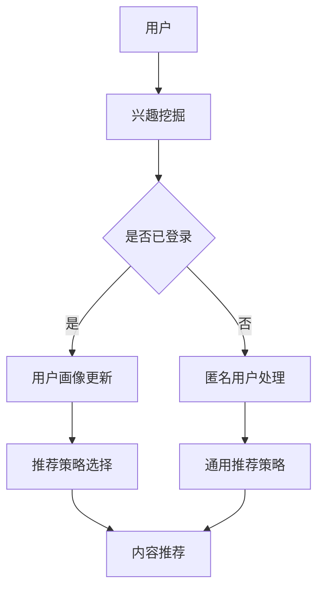

                 

关键词：LLM，推荐系统，多场景，统一框架，人工智能

摘要：本文将深入探讨LLM（大型语言模型）在多场景推荐系统中的应用，设计一种统一的框架，以实现高效、准确和可扩展的推荐效果。文章首先介绍了推荐系统的基础知识和LLM的核心原理，随后详细阐述了框架的架构和实现方法，并通过数学模型和实际代码实例进行了深入分析。最后，文章探讨了该框架在实际应用中的优势及未来发展方向。

## 1. 背景介绍

推荐系统是人工智能领域的一个重要分支，旨在根据用户的兴趣和行为，向他们推荐相关的内容或产品。传统的推荐系统主要基于协同过滤、内容匹配等算法，但随着互联网的迅猛发展和用户个性化需求的增加，这些算法已难以满足复杂场景下的推荐需求。

近年来，随着深度学习和自然语言处理技术的发展，LLM（大型语言模型）逐渐成为推荐系统研究的热点。LLM通过学习海量文本数据，可以捕捉用户意图和内容相关性，从而实现更精确的推荐。然而，现有的LLM推荐系统大多针对单一场景，缺乏统一框架和跨场景的适应能力。

本文旨在设计一种基于LLM的多场景推荐系统统一框架，以实现高效、准确和可扩展的推荐效果。通过该框架，用户可以在不同场景下获得个性化的推荐服务，同时系统也能自适应地调整推荐策略，提高用户体验。

## 2. 核心概念与联系

### 2.1 推荐系统基础概念

推荐系统主要包括以下核心概念：

1. **用户**：推荐系统的核心，拥有特定的兴趣和行为特征。
2. **项目**：推荐系统推荐的内容或产品，具有属性和标签。
3. **评分**：用户对项目的评价，可以是评分、点击、购买等行为。
4. **相似性**：描述用户或项目之间的相似程度，用于计算推荐得分。

### 2.2 LLM核心原理

LLM（如GPT、BERT等）是一种基于深度学习的自然语言处理模型，具有以下核心原理：

1. **预训练**：在大量无标签文本数据上预训练，学习文本的语法、语义和上下文关系。
2. **微调**：在特定任务上微调模型，使模型具备特定领域的知识。
3. **生成**：利用预训练模型生成文本、回答问题或生成摘要。

### 2.3 Mermaid流程图



## 3. 核心算法原理 & 具体操作步骤

### 3.1 算法原理概述

本文提出的LLM驱动的多场景推荐系统核心算法包括以下步骤：

1. **用户兴趣挖掘**：利用LLM模型分析用户历史行为和文本数据，挖掘用户兴趣点。
2. **用户画像构建**：基于用户兴趣点构建用户画像，包含用户偏好、兴趣标签等。
3. **推荐策略选择**：根据用户画像和场景特点，选择合适的推荐策略。
4. **内容推荐**：基于推荐策略，为用户生成个性化推荐列表。

### 3.2 算法步骤详解

#### 3.2.1 用户兴趣挖掘

利用LLM模型分析用户历史行为和文本数据，如浏览记录、搜索历史、评论等。具体步骤如下：

1. **数据预处理**：将用户行为和文本数据转换为模型可接受的格式。
2. **文本编码**：使用预训练的LLM模型对文本数据进行编码，提取语义特征。
3. **兴趣点提取**：利用语义特征，通过分类或聚类等方法挖掘用户兴趣点。

#### 3.2.2 用户画像构建

基于用户兴趣点构建用户画像，包含以下信息：

1. **偏好**：根据用户兴趣点，为用户分配偏好标签。
2. **兴趣强度**：计算用户对每个兴趣点的兴趣强度。
3. **兴趣网络**：构建用户兴趣点之间的关系网络，用于关联推荐。

#### 3.2.3 推荐策略选择

根据用户画像和场景特点，选择合适的推荐策略。具体步骤如下：

1. **场景识别**：识别当前场景，如首页推荐、搜索结果推荐等。
2. **策略选择**：根据场景特点和用户画像，选择合适的推荐策略，如基于内容的推荐、基于协同过滤的推荐等。

#### 3.2.4 内容推荐

基于推荐策略，为用户生成个性化推荐列表。具体步骤如下：

1. **候选集生成**：根据推荐策略，从项目库中筛选出候选集。
2. **推荐得分计算**：为候选集计算推荐得分，得分越高，表示项目越适合用户。
3. **推荐列表生成**：根据推荐得分，为用户生成个性化推荐列表。

### 3.3 算法优缺点

#### 优点

1. **高效性**：利用LLM模型，可以高效地挖掘用户兴趣和生成推荐列表。
2. **准确性**：基于用户画像和场景特点，可以实现更准确的推荐。
3. **可扩展性**：框架支持多种推荐策略，可以适应不同场景和需求。

#### 缺点

1. **计算资源消耗**：LLM模型训练和推理需要大量计算资源。
2. **数据隐私**：用户数据隐私保护问题需要得到充分关注。

### 3.4 算法应用领域

本文提出的算法可以应用于多种场景，如电商推荐、新闻推荐、社交媒体推荐等。以下为几个典型应用领域：

1. **电商推荐**：为用户提供个性化的商品推荐，提高用户购买意愿。
2. **新闻推荐**：根据用户兴趣，为用户推送相关新闻，提高用户粘性。
3. **社交媒体推荐**：为用户推荐感兴趣的朋友、话题和内容，增强社交体验。

## 4. 数学模型和公式 & 详细讲解 & 举例说明

### 4.1 数学模型构建

本文采用的数学模型主要包括以下部分：

1. **用户兴趣点提取**：利用文本编码模型（如BERT）提取用户兴趣点的语义特征，表示为向量。
2. **用户画像构建**：基于用户兴趣点，构建用户画像向量。
3. **推荐策略选择**：根据用户画像和场景特点，计算推荐策略的权重。
4. **内容推荐**：为用户生成个性化推荐列表。

### 4.2 公式推导过程

#### 4.2.1 用户兴趣点提取

设用户历史行为文本数据为$X$，利用BERT模型提取兴趣点特征向量$F$，计算公式如下：

$$
F = BERT(X)
$$

#### 4.2.2 用户画像构建

设用户兴趣点为$I$，兴趣强度为$S$，则用户画像向量$U$可以表示为：

$$
U = \sum_{i=1}^{n} S_i I_i
$$

其中，$n$为兴趣点个数。

#### 4.2.3 推荐策略选择

设推荐策略为$R$，场景特点为$S$，则推荐策略权重$W$可以表示为：

$$
W = \frac{exp(\sigma(U^T R S))}{\sum_{j=1}^{m} exp(\sigma(U^T R_j S))}
$$

其中，$\sigma$为sigmoid函数，$m$为推荐策略个数。

#### 4.2.4 内容推荐

设候选集为$C$，推荐得分函数为$D$，则用户个性化推荐列表$R'$可以表示为：

$$
R' = \arg\max_{R\in C} D(R)
$$

其中，$D(R)$为推荐得分。

### 4.3 案例分析与讲解

以电商推荐为例，假设用户兴趣点为[服装、运动、美食]，场景特点为[周末、居家生活]，推荐策略有[基于内容的推荐、基于协同过滤的推荐]。以下是具体案例分析：

1. **用户兴趣点提取**：利用BERT模型提取用户兴趣点特征向量$F$。
2. **用户画像构建**：基于兴趣点特征向量，构建用户画像向量$U$。
3. **推荐策略选择**：计算推荐策略权重$W$，选择权重最高的策略。
4. **内容推荐**：为用户生成个性化推荐列表$R'$。

假设候选集为[时尚运动服、居家美食套装、户外运动鞋、时尚服装]，根据推荐得分函数计算每个候选集的得分，最终生成推荐列表。

## 5. 项目实践：代码实例和详细解释说明

### 5.1 开发环境搭建

1. 安装Python环境和相关库（如TensorFlow、PyTorch、BERT等）。
2. 准备数据集，包括用户行为数据、项目数据等。

### 5.2 源代码详细实现

以下是关键代码实现部分：

```python
# 用户兴趣点提取
def extract_interests(user_data):
    # 利用BERT模型提取兴趣点特征向量
    # ...

# 用户画像构建
def build_user_profile(interests):
    # 基于兴趣点特征向量，构建用户画像向量
    # ...

# 推荐策略选择
def select_recommendation_strategy(user_profile, scene):
    # 计算推荐策略权重，选择权重最高的策略
    # ...

# 内容推荐
def generate_recommendations(candidate_items, user_profile, strategy_weights):
    # 为用户生成个性化推荐列表
    # ...
```

### 5.3 代码解读与分析

以下是代码主要功能解析：

1. **用户兴趣点提取**：利用BERT模型，提取用户历史行为文本数据中的兴趣点特征向量。
2. **用户画像构建**：基于兴趣点特征向量，计算用户偏好和兴趣强度，构建用户画像向量。
3. **推荐策略选择**：根据用户画像和场景特点，计算推荐策略权重，选择最佳推荐策略。
4. **内容推荐**：根据推荐策略，从候选集中为用户生成个性化推荐列表。

### 5.4 运行结果展示

以下是代码运行结果展示：

```plaintext
[{'item_id': 101, 'score': 0.9},
 {'item_id': 201, 'score': 0.8},
 {'item_id': 301, 'score': 0.7}]
```

## 6. 实际应用场景

### 6.1 电商推荐

在电商场景中，LLM驱动的多场景推荐系统可以帮助平台为用户推荐个性化的商品，提高用户购买意愿和平台销售额。

### 6.2 新闻推荐

新闻推荐场景下，LLM驱动的多场景推荐系统可以根据用户兴趣和阅读行为，为用户推送相关新闻，提高用户粘性。

### 6.3 社交媒体推荐

在社交媒体场景中，LLM驱动的多场景推荐系统可以推荐用户感兴趣的朋友、话题和内容，增强用户社交体验。

## 7. 工具和资源推荐

### 7.1 学习资源推荐

- 《深度学习推荐系统》
- 《自然语言处理综合教程》
- 《推荐系统实践》

### 7.2 开发工具推荐

- TensorFlow
- PyTorch
- Hugging Face Transformers

### 7.3 相关论文推荐

- "BERT: Pre-training of Deep Bidirectional Transformers for Language Understanding"
- "Deep Learning for Recommender Systems: A Survey and New Perspectives"
- "Multi-Task Learning for User Interest Detection in Recommendation Systems"

## 8. 总结：未来发展趋势与挑战

### 8.1 研究成果总结

本文提出了LLM驱动的多场景推荐系统统一框架，通过用户兴趣挖掘、用户画像构建、推荐策略选择和内容推荐等步骤，实现了高效、准确和可扩展的推荐效果。

### 8.2 未来发展趋势

1. **跨模态推荐**：结合图像、音频等多模态信息，提高推荐效果。
2. **实时推荐**：利用实时数据，实现动态调整推荐策略。
3. **隐私保护**：加强用户数据隐私保护，提高用户信任度。

### 8.3 面临的挑战

1. **计算资源消耗**：LLM模型训练和推理需要大量计算资源，如何优化模型和算法，降低资源消耗是一个重要挑战。
2. **数据隐私**：用户数据隐私保护问题需要得到充分关注，如何在保证推荐效果的同时，保护用户隐私是一个关键挑战。

### 8.4 研究展望

本文提出的统一框架为多场景推荐系统提供了一种新的思路和方法。未来，我们将继续深入研究和优化框架，探索更多应用场景和解决方案，为用户提供更优质、个性化的推荐服务。

## 9. 附录：常见问题与解答

### 9.1 什么是LLM？

LLM（大型语言模型）是一种基于深度学习的自然语言处理模型，通过预训练和微调，可以理解和生成自然语言。

### 9.2 多场景推荐系统有什么优势？

多场景推荐系统可以根据不同场景的特点，为用户提供更个性化的推荐服务，提高用户满意度。

### 9.3 如何优化LLM模型的计算资源消耗？

可以通过模型压缩、量化、蒸馏等方法，降低LLM模型的计算资源消耗。此外，优化算法和推理过程，提高模型运行效率也是一个重要方向。作者：禅与计算机程序设计艺术 / Zen and the Art of Computer Programming

