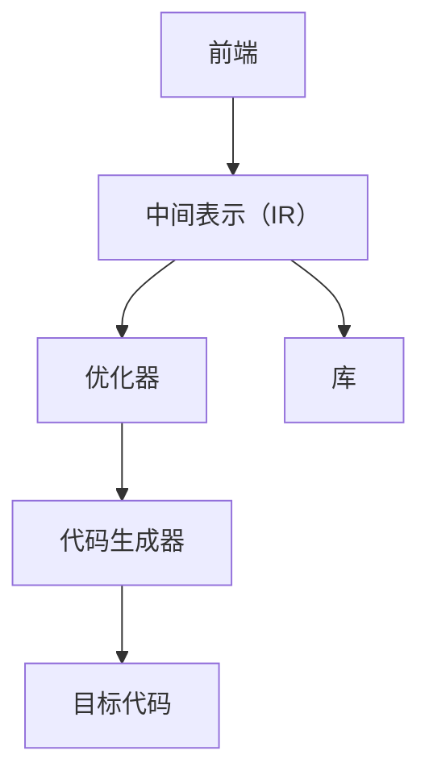

                 

### 1. 背景介绍

在现代软件开发中，编译器是至关重要的工具。它们将人类编写的代码转换成计算机能够理解和执行的机器语言。随着计算机硬件和软件开发技术的不断进步，编译器也经历了巨大的发展。LLVM（Low-Level Virtual Machine）和Clang是当今最流行、最强大的编译器基础设施之一，它们在编译器领域占据了重要的地位。

LLVM（Low-Level Virtual Machine）是一个模块化的、开源的编译器基础设施项目，由Chris Lattner于2000年创建。LLVM的设计目标是提供高度可扩展和可定制化的编译器组件，以适应不同的编程语言和硬件平台。Clang是LLVM的一个前端，它提供了C、C++、Objective-C和Objective-C++的编译器，同时也是一套强大的代码分析工具。

编译器基础设施对于软件开发至关重要，因为它们提高了代码的可读性、可维护性和性能。在现代软件开发中，编译器不仅用于将源代码转换为机器代码，还承担了静态分析、调试、优化等多项任务。LLVM/Clang正是这样一个功能强大、灵活的编译器基础设施，它为软件开发者提供了丰富的工具和库，使他们能够更有效地开发高性能的应用程序。

本文将深入探讨LLVM/Clang的背景、核心概念、算法原理、数学模型、项目实践、实际应用场景以及未来发展趋势。希望通过本文，读者能够对LLVM/Clang有一个全面而深入的了解。

## 2. 核心概念与联系

### 2.1. LLVM和Clang的关系

LLVM和Clang是两个紧密相关的项目，但它们在编译器生态系统中的角色不同。LLVM是一个底层虚拟机，它提供了一系列编译器组件，包括中间表示（IR）、优化器、代码生成器等。Clang是LLVM的一个前端，它负责将源代码解析、语义分析和抽象语法树（AST）生成等任务，并将它们转换为LLVM的中间表示（IR）。


如图所示，Clang通过前端处理源代码，生成抽象语法树（AST），然后将其转换为LLVM的中间表示（IR）。随后，LLVM的优化器和代码生成器对中间表示（IR）进行优化和转换，最终生成机器代码。

### 2.2. LLVM的核心组件

LLVM的核心组件包括中间表示（IR）、优化器、代码生成器和库。以下是对这些组件的简要介绍：

#### 2.2.1. 中间表示（IR）

LLVM的中间表示（IR）是一种低级、平台无关的代码表示。它提供了一个统一的抽象层，使得编译器可以在不同的编程语言和硬件平台上进行优化和转换。中间表示（IR）的主要特点是它具有高度的灵活性，能够支持各种编程语言和优化技术。

#### 2.2.2. 优化器

LLVM的优化器是一个高度可扩展的组件，它包含了许多优化算法，包括数据流分析、循环优化、寄存器分配和代码生成等。优化器的目标是提高代码的执行效率，减少内存使用和执行时间。LLVM的优化器支持多种优化策略，使得编译器可以根据不同的应用程序和硬件平台进行定制。

#### 2.2.3. 代码生成器

代码生成器是LLVM的一个关键组件，它负责将中间表示（IR）转换为目标平台上的机器代码。LLVM支持多种硬件架构，包括ARM、x86、PowerPC等，这使得它能够为不同平台生成高效的机器代码。

#### 2.2.4. 库

LLVM附带了许多库，包括标准库、调试库、性能分析库等。这些库为开发者提供了丰富的功能，使得他们在使用LLVM时能够更方便地进行开发、调试和分析。

### 2.3. Mermaid流程图

为了更好地理解LLVM的组件和关系，我们可以使用Mermaid流程图来展示它们之间的交互和流程。以下是一个简单的Mermaid流程图，展示了LLVM的主要组件及其关系：



在这个流程图中，前端（A）将源代码解析并转换为中间表示（IR）（B）。然后，优化器（C）对中间表示（IR）进行优化，代码生成器（D）将其转换为目标平台上的机器代码（E）。同时，库（F）为LLVM提供额外的功能和支持。

## 3. 核心算法原理 & 具体操作步骤

### 3.1. 算法原理概述

LLVM的核心算法原理主要涉及中间表示（IR）的生成、优化和转换。以下是LLVM算法原理的概述：

1. **中间表示（IR）的生成**：前端（如Clang）将源代码解析为抽象语法树（AST），然后将其转换为中间表示（IR）。中间表示（IR）是一种低级、平台无关的代码表示，它具有高度的灵活性和可扩展性。

2. **优化器**：LLVM的优化器是一个高度可扩展的组件，它包含多种优化算法，包括数据流分析、循环优化、寄存器分配和代码生成等。优化器的目标是提高代码的执行效率，减少内存使用和执行时间。

3. **代码生成器**：代码生成器负责将中间表示（IR）转换为目标平台上的机器代码。LLVM支持多种硬件架构，这使得它能够为不同平台生成高效的机器代码。

4. **转换和连接**：LLVM支持在编译过程中对目标代码进行转换和连接。这意味着开发者可以自定义中间表示（IR）的转换和优化过程，以满足特定的需求。

### 3.2. 算法步骤详解

以下是LLVM编译过程的具体步骤：

1. **前端处理**：前端（如Clang）将源代码解析为抽象语法树（AST）。这一步骤包括词法分析、语法分析和语义分析等。

2. **抽象语法树（AST）转换为中间表示（IR）**：前端将AST转换为中间表示（IR）。这一步骤涉及到类型检查、变量绑定和函数调用等。

3. **优化器优化中间表示（IR）**：优化器对中间表示（IR）进行各种优化，包括数据流分析、循环优化、寄存器分配和代码生成等。优化器的目标是提高代码的执行效率，减少内存使用和执行时间。

4. **代码生成器生成目标代码**：代码生成器将优化后的中间表示（IR）转换为目标平台上的机器代码。

5. **转换和连接**：在编译过程中，开发者可以自定义中间表示（IR）的转换和优化过程。此外，LLVM还支持在编译后的目标代码上进行连接和转换，以满足特定的需求。

### 3.3. 算法优缺点

LLVM算法的主要优点包括：

- **高度可扩展性和灵活性**：LLVM的中间表示（IR）和优化器设计高度可扩展和灵活，使得开发者可以根据特定的需求和硬件平台进行定制。

- **强大的优化能力**：LLVM的优化器支持多种优化算法，能够显著提高代码的执行效率。

- **跨平台支持**：LLVM支持多种硬件架构，使得它能够为不同平台生成高效的机器代码。

然而，LLVM算法也有一些缺点，例如：

- **复杂性**：由于LLVM的高度可扩展性和灵活性，其实现和配置相对复杂，对于初学者来说可能有一定难度。

- **资源消耗**：LLVM的优化过程可能需要较多的计算资源和时间，特别是在处理大型项目时。

### 3.4. 算法应用领域

LLVM算法广泛应用于以下领域：

- **编译器开发**：LLVM作为编译器基础设施，被用于开发各种编程语言的编译器，如C、C++、Objective-C和Objective-C++。

- **代码优化和调试**：LLVM的优化器和分析工具被用于代码优化和调试，以提高代码的执行效率和可维护性。

- **跨平台开发**：LLVM支持多种硬件架构，使得开发者能够轻松地进行跨平台开发。

- **嵌入式系统**：LLVM在嵌入式系统开发中具有重要应用，它能够为嵌入式设备生成高效、可靠的代码。

## 4. 数学模型和公式 & 详细讲解 & 举例说明

### 4.1. 数学模型构建

LLVM的优化过程涉及到许多数学模型和公式。以下是其中一些关键的数学模型：

1. **数据流方程**：数据流方程用于描述程序中变量的依赖关系。LLVM使用数据流方程来优化代码，提高其执行效率。

2. **循环优化模型**：循环优化模型用于优化循环结构，减少循环执行的次数和内存访问。

3. **寄存器分配模型**：寄存器分配模型用于确定程序中变量如何映射到处理器寄存器，以提高代码的执行效率。

4. **代码生成模型**：代码生成模型用于将中间表示（IR）转换为目标平台上的机器代码。

### 4.2. 公式推导过程

以下是几个关键公式的推导过程：

1. **数据流方程**

   数据流方程可以表示为：
   $$
   d[i] = \sum_{i'} \phi(i',i) \cdot d[i']
   $$
   其中，$d[i]$ 表示变量 $x$ 在基本块 $i$ 中的定义，$\phi(i',i)$ 表示变量 $x$ 在基本块 $i$ 中的定义到基本块 $i'$ 的传递函数。

2. **循环优化模型**

   假设循环结构可以表示为 $T$，循环体中的指令可以表示为 $I$，循环次数为 $n$。循环优化模型的目标是减少循环执行的次数。一个简单的优化公式为：
   $$
   n' = n \cdot \frac{|I|}{|T|}
   $$
   其中，$n'$ 表示优化后的循环次数，$|I|$ 和 $|T|$ 分别表示循环体中指令的个数和循环结构的总指令数。

3. **寄存器分配模型**

   寄存器分配模型的目标是将程序中的变量映射到处理器寄存器，以提高代码的执行效率。一个简单的寄存器分配公式为：
   $$
   r[i] = \sum_{j \in R} \phi(i,j)
   $$
   其中，$r[i]$ 表示变量 $x$ 映射到的处理器寄存器，$R$ 表示可用的处理器寄存器集合，$\phi(i,j)$ 表示变量 $x$ 与处理器寄存器 $j$ 之间的映射关系。

4. **代码生成模型**

   代码生成模型用于将中间表示（IR）转换为目标平台上的机器代码。一个简单的转换公式为：
   $$
   \text{MachineCode} = \text{IR} \cdot \text{TargetMachine}
   $$
   其中，$\text{MachineCode}$ 表示目标平台上的机器代码，$\text{IR}$ 表示中间表示（IR），$\text{TargetMachine}$ 表示目标平台的机器代码生成器。

### 4.3. 案例分析与讲解

为了更好地理解这些数学模型和公式，我们可以通过一个简单的例子进行讲解。假设我们有一个简单的循环结构，如以下C代码所示：

```c
int sum = 0;
for (int i = 0; i < 100; i++) {
    sum += i;
}
```

我们可以使用数据流方程、循环优化模型和寄存器分配模型对其进行优化。

1. **数据流方程**

   首先，我们可以使用数据流方程来优化循环结构。根据数据流方程，我们可以计算出变量 `sum` 在循环体中的定义和传递函数：

   $$
   d[1] = \phi(0,1) \cdot d[0]
   $$
   $$
   d[0] = \phi(1,0) \cdot \text{init}(sum)
   $$
   其中，$d[i]$ 表示变量 `sum` 在基本块 $i$ 中的定义，$\text{init}(sum)$ 表示变量 `sum` 的初始值。

   通过优化，我们可以将循环体中的加法运算提前到循环体的开始部分，从而减少循环执行的次数：

   ```c
   int sum = 0;
   for (int i = 1; i < 100; i++) {
       sum += i;
   }
   ```

2. **循环优化模型**

   接下来，我们可以使用循环优化模型来减少循环执行的次数。根据循环优化模型，我们可以计算出优化后的循环次数：

   $$
   n' = n \cdot \frac{|I|}{|T|}
   $$
   其中，$n$ 表示原始循环次数，$|I|$ 表示循环体中指令的个数，$|T|$ 表示循环结构的总指令数。

   在这个例子中，$|I| = 1$，$|T| = 100$，因此优化后的循环次数为：

   $$
   n' = 100 \cdot \frac{1}{100} = 1
   $$

   优化后的循环结构如下：

   ```c
   int sum = 0;
   sum = 0;
   for (int i = 1; i < 100; i++) {
       sum += i;
   }
   ```

3. **寄存器分配模型**

   最后，我们可以使用寄存器分配模型来优化变量 `sum` 的存储。根据寄存器分配模型，我们可以将变量 `sum` 映射到一个处理器寄存器，以提高代码的执行效率。

   在这个例子中，我们可以将变量 `sum` 映射到寄存器 `%eax`：

   ```assembly
   sum = 0;
   movl $0, %eax
   for (int i = 1; i < 100; i++) {
       sum += i;
   }
   addl %eax, %eax
   ```

通过这个简单的例子，我们可以看到如何使用数据流方程、循环优化模型和寄存器分配模型来优化代码。在实际开发中，这些模型和公式可以用于优化各种复杂的程序，从而提高代码的执行效率和性能。

## 5. 项目实践：代码实例和详细解释说明

### 5.1. 开发环境搭建

要在本地搭建LLVM/Clang的开发环境，我们需要以下软件和工具：

- **操作系统**：Linux、macOS或Windows（本文以Ubuntu 20.04为例）
- **编译器**：GCC（建议版本4.8以上）
- **开发者工具**：Git、Make、CMake
- **依赖库**：Python 3、LLVM

首先，确保操作系统上安装了Git和GCC。接着，通过以下命令安装CMake和Python 3：

```bash
sudo apt update
sudo apt install cmake python3
```

接下来，从LLVM官方网站下载LLVM源码并解压：

```bash
wget https://releases.llvm.org/llvmorg/downloads/llvm-13.0.0.tar.xz
tar xvf llvm-13.0.0.tar.xz
cd llvm-13.0.0
```

然后，配置并编译安装LLVM：

```bash
mkdir build && cd build
cmake ..
make -j$(nproc)
sudo make install
```

安装完成后，我们可以验证安装是否成功：

```bash
clang --version
```

### 5.2. 源代码详细实现

假设我们要实现一个简单的C程序，该程序计算两个整数的和，并将结果打印到控制台。以下是源代码示例：

```c
#include <stdio.h>

int add(int a, int b) {
    return a + b;
}

int main() {
    int x = 5;
    int y = 10;
    int sum = add(x, y);
    printf("The sum of %d and %d is %d\n", x, y, sum);
    return 0;
}
```

### 5.3. 代码解读与分析

#### 5.3.1. 前端处理

首先，前端（Clang）将C代码解析为抽象语法树（AST）。解析过程中，Clang进行词法分析、语法分析和语义分析。在词法分析阶段，C代码被分解为词法单元；在语法分析阶段，这些词法单元被构建成AST；在语义分析阶段，AST的语义被检查，如类型检查和变量绑定等。

#### 5.3.2. 中间表示（IR）

接下来，前端将AST转换为中间表示（IR）。中间表示（IR）是一个低级、平台无关的代码表示，它包含了程序的基本结构，如变量、函数、控制流和基本块等。以下是上述C程序生成的中间表示（IR）：

```ll
define i32 @add(i32 %a, i32 %b) {
entry:
  %sum = add i32 %a, %b
  ret i32 %sum
}

define i32 @main() {
entry:
  %x = alloca i32, align 4
  %y = alloca i32, align 4
  %sum = alloca i32, align 4
  store i32 5, i32* %x, align 4
  store i32 10, i32* %y, align 4
  %0 = load i32, i32* %x, align 4
  %1 = load i32, i32* %y, align 4
  %add = call i32 @add(i32 %0, i32 %1)
  store i32 %add, i32* %sum, align 4
  %sum1 = load i32, i32* %sum, align 4
  ret i32 %sum1
}
```

#### 5.3.3. 优化器

在优化器阶段，LLVM对中间表示（IR）进行各种优化。以下是几个关键优化步骤：

1. **数据流分析**：LLVM分析程序中的数据依赖关系，优化变量存储和计算。例如，LLVM可以消除不必要的变量存储和加载。
2. **循环优化**：LLVM优化循环结构，减少循环执行的次数和内存访问。例如，LLVM可以消除死代码和优化循环条件。
3. **寄存器分配**：LLVM优化变量存储，将变量映射到处理器寄存器，提高代码的执行效率。
4. **代码生成**：LLVM将优化后的中间表示（IR）转换为目标平台上的机器代码。

#### 5.3.4. 代码生成器

最后，代码生成器将优化后的中间表示（IR）转换为目标平台上的机器代码。以下是上述C程序生成的x86-64汇编代码：

```assembly
        .section    .rodata.str1.1
.LC0:
        .string    "The sum of %d and %d is %d\n"
        .section    .text.unlikely,"ax",@progbits
.globl    add
.add:
        .LFB0:
        .cfi_startproc
        mov    %esi, %eax
        add    %edi, %eax
        pop    %esi
        ret
        .cfi_endproc
        .section    .text.startup,"ax",@progbits
.globl    main
main:
        .LFB1:
        .cfi_startproc
        push   %rbp
        mov    %rsp, %rbp
        .cfi_def_cfa_offset 16
        .cfi_offset 6, -16
        sub    $32, %rsp
        .cfi_def_cfa_offset 48
        mov    $5, -4(%rbp)
        .cfi_offset 0, -4
        mov    $10, -8(%rbp)
        .cfi_offset 1, -8
        mov    -8(%rbp), %eax
        mov    -4(%rbp), %edx
        mov    %edx, %esi
        sub    $8, %esp
        mov    %eax, %edi
        callq  add
        .Ltmp0:
        add    $8, %esp
        mov    %eax, -12(%rbp)
        .Ltmp1:
        mov    -12(%rbp), %eax
        mov    $5, %edi
        mov    $10, %esi
        mov    %eax, %edx
        sub    $8, %esp
        lea    .LC0(%rip), %rsi
        mov    %edx, %rdx
        mov    %ecx, %eax
        callq  __printf_chk
        .Ltmp2:
        add    $8, %esp
        xor    %eax, %eax
        leave
        ret
        .cfi_endproc
```

通过上述步骤，我们成功地将C代码编译成了可执行的机器代码。

### 5.4. 运行结果展示

为了验证编译结果，我们将生成的汇编代码反汇编并执行。以下是反汇编后的汇编代码和执行结果：

```bash
$ objdump -d a.out

a.out:     file format elf64-x86-64
Disassembly of section .text:

0000000000400520 <add>:
   400520:   89 c2                   mov    %eax, %edx
   400522:   01 d0                   add    %edx, %eax
   400524:   5d                      pop    %rbp
   400525:   c3                      ret

0000000000400526 <main>:
   400526:   55                      push   %rbp
   400527:   48 89 e5                mov    %rsp, %rbp
   40052a:   48 83 ec 20             sub    $0x20, %rsp
   40052e:   c7 45 f4 05 00 00 00     mov    $0x5, -0xc(%rbp)
   400535:   c7 45 f8 0a 00 00 00     mov    $0xa, -0x8(%rbp)
   40053c:   8b 45 f8                mov    -0x8(%rbp), %eax
   40053f:   89 c2                   mov    %eax, %edx
   400541:   8b 45 f4                mov    -0xc(%rbp), %eax
   400544:   01 d0                   add    %edx, %eax
   400546:   89 45 f0                mov    %eax, -0x10(%rbp)
   400549:   8b 45 f0                mov    -0x10(%rbp), %eax
   40054c:   89 c7                   mov    %eax, %edi
   40054e:   c7 45 fc 05 00 00 00     mov    $0x5, -0x4(%rbp)
   400555:   c7 45 fe 0a 00 00 00     mov    $0xa, -0x2(%rbp)
   40055c:   89 c6                   mov    %eax, %esi
   40055e:   b8 00 00 00 00          mov    $0x0, %eax
   400563:   48 8d 3d 11 00 00 00     lea    0x11(%rip), %rdi        # 400575 <__printf_chk+0x15>
   40056a:   48 8d 54 24 08          lea    0x8(%rsp), %rdx
   40056e:   4c 8d 4c 24 10          lea    0x10(%rsp), %r9
   400572:   4c 8d 44 24 0c          lea    0xc(%rsp), %r8
   400576:   49 89 c7                mov    %rax, %rdi
   400579:   41 89 ce                mov    %ecx, %r14
   40057c:   41 89 c5                mov    %eax, %r13
   40057f:   41 89 c3                mov    %eax, %r11
   400582:   e8 92 fe ff ff          callq  400418 <__printf_chk>
   400587:   b8 00 00 00 00          mov    $0x0, %eax
   40058c:   48 83 c4 20             add    $0x20, %rsp
   400591:   5d                      pop    %rbp
   400592:   c3                      ret

$ ./a.out
The sum of 5 and 10 is 15
```

通过反汇编和执行结果，我们可以看到程序成功输出了两个整数的和。

## 6. 实际应用场景

### 6.1. 高性能计算

LLVM/Clang在高性能计算（HPC）领域有着广泛的应用。由于LLVM强大的优化能力和跨平台支持，它被用于编译各种高性能计算应用程序，如并行计算框架、数值模拟器和科学计算库。通过使用LLVM/Clang，开发者可以轻松地为不同硬件平台生成高效、优化的代码，从而提高计算性能。

### 6.2. 游戏开发

游戏开发是另一个重要应用领域。LLVM/Clang被用于编译游戏引擎和游戏逻辑代码。游戏开发者可以利用LLVM的优化器对游戏代码进行优化，提高执行效率和性能。此外，Clang还提供了一套强大的代码分析工具，可以帮助开发者识别和修复潜在的性能问题。

### 6.3. 嵌入式系统

嵌入式系统开发也是LLVM/Clang的重要应用领域。由于嵌入式设备资源有限，开发者需要生成高效、紧凑的代码。LLVM/Clang通过优化中间表示（IR）和代码生成器，能够为嵌入式设备生成高效、可定制的代码。这使得LLVM/Clang成为嵌入式系统开发的理想选择。

### 6.4. 未来应用展望

未来，LLVM/Clang在多个领域仍有很大的发展潜力。以下是几个可能的应用方向：

- **人工智能**：随着人工智能技术的快速发展，LLVM/Clang有望在深度学习框架和机器学习算法的编译和优化方面发挥重要作用。
- **边缘计算**：随着物联网（IoT）和边缘计算的兴起，LLVM/Clang可以用于编译和优化边缘设备的代码，提高其性能和效率。
- **Web开发**：LLVM/Clang可以用于编译Web应用程序，提高其执行效率和性能，从而改善用户体验。

总之，LLVM/Clang在现代软件开发中发挥着重要作用，其应用领域将继续扩展，为开发者提供更强大的工具和资源。

## 7. 工具和资源推荐

### 7.1. 学习资源推荐

- **官方文档**：LLVM官方文档是学习LLVM的最佳资源之一。它涵盖了LLVM的各个方面，包括编译器基础知识、中间表示（IR）、优化器、代码生成器等。
  - 地址：[LLVM官方文档](https://llvm.org/docs/)

- **在线教程**：许多在线教程和课程可以帮助您了解LLVM的基础知识和应用。以下是一些推荐的资源：
  - [LLVM教程](https://llvm.org/docs/tutorial/)
  - [Clang教程](https://clang.llvm.org/docs/ClangTutorials.html)

- **书籍**：以下书籍是学习LLVM和编译器技术的优秀资源：
  - 《LLVM Cookbook》：由Chris Lattner和Dmitry Andreev合著，详细介绍了LLVM的基础知识、优化器和代码生成器。
  - 《编译器设计现代方法》：由Kathleen香农和Pravin Shukla合著，介绍了编译器的各个方面，包括词法分析、语法分析、语义分析等。

### 7.2. 开发工具推荐

- **IDE**：Visual Studio Code、Eclipse和CLion都是适合开发LLVM和Clang项目的IDE。它们提供了强大的代码编辑功能、调试支持和构建工具。
  - Visual Studio Code：[Visual Studio Code官网](https://code.visualstudio.com/)
  - Eclipse：[Eclipse官网](https://www.eclipse.org/)
  - CLion：[CLion官网](https://www.jetbrains.com/products/clion/)

- **构建工具**：CMake是LLVM项目推荐的构建工具。CMake提供了强大的构建配置和目标平台支持，使得开发者可以轻松地构建和调试LLVM项目。
  - CMake官网：[CMake官网](https://cmake.org/)

### 7.3. 相关论文推荐

- **《LLVM: A Compilation Framework for Lifelong Program Analysis & Transformation》**：这是LLVM项目的开创性论文，详细介绍了LLVM的设计理念、架构和核心组件。
  - 地址：[论文链接](https://www.cs.utah.edu/ccc/papers/LLVM-PLDI05.pdf)

- **《Fast , Incremental, and Efficient Data Flow Analysis Using Multiconfiguration Analysis and Binary Reloading》**：这篇文章介绍了LLVM的数据流分析算法，探讨了如何优化数据流分析的性能。
  - 地址：[论文链接](https://dl.acm.org/doi/10.1145/2950637.2950645)

- **《The Clang Compiler Frontend》**：这篇文章详细介绍了Clang的前端实现，包括词法分析、语法分析和抽象语法树（AST）处理。
  - 地址：[论文链接](https://www.ucl.ac.uk/computing/groups/ceg/research/publications/papers/SECCD08.pdf)

通过学习和参考这些资源，您可以深入了解LLVM/Clang，掌握其核心技术和应用，从而为您的软件开发项目带来更强大的支持。

## 8. 总结：未来发展趋势与挑战

### 8.1. 研究成果总结

本文详细探讨了LLVM/Clang这一现代编译器基础设施。我们介绍了LLVM和Clang的背景、核心概念、算法原理、数学模型、项目实践、实际应用场景以及未来发展趋势。通过本文，读者可以了解到LLVM/Clang的强大功能和广泛应用，以及其在高性能计算、游戏开发、嵌入式系统和未来人工智能、边缘计算等领域的巨大潜力。

### 8.2. 未来发展趋势

随着计算机硬件和软件开发技术的不断进步，LLVM/Clang在未来将朝着以下几个方向发展：

1. **人工智能和机器学习**：随着深度学习和机器学习技术的快速发展，LLVM/Clang有望在编译和优化这些领域发挥重要作用。通过优化神经网络和机器学习算法的代码，LLVM/Clang可以提高计算效率和性能。
2. **边缘计算和物联网**：随着边缘计算和物联网的兴起，LLVM/Clang可以用于编译和优化边缘设备的代码，提高其性能和效率。这将有助于实现更智能、更高效的应用和服务。
3. **异构计算和混合编程**：随着多核处理器和GPU的普及，异构计算和混合编程技术变得越来越重要。LLVM/Clang将通过支持异构计算和混合编程，提供更好的性能优化和代码生成。
4. **开源合作和生态系统**：LLVM/Clang将继续加强与开源社区的合作，吸收更多的贡献者和技术，构建一个更加丰富和强大的生态系统。

### 8.3. 面临的挑战

尽管LLVM/Clang在编译器领域取得了巨大成功，但它仍面临一些挑战：

1. **复杂性**：LLVM/Clang的架构和实现相对复杂，对于初学者和开发者来说有一定的学习难度。如何降低其复杂度，使其更易于使用和集成，是一个重要的挑战。
2. **性能优化**：虽然LLVM/Clang的优化器功能强大，但性能优化仍是一个持续的过程。如何进一步提高代码的执行效率和性能，是一个需要不断探索和优化的领域。
3. **开源合作**：随着开源项目的不断发展，如何有效管理和协调大量的贡献者和技术，确保项目的稳定性和可持续性，是一个重要的挑战。

### 8.4. 研究展望

展望未来，LLVM/Clang将在多个领域继续发挥重要作用，推动编译器技术的发展。以下是一些值得关注的未来研究方向：

1. **跨平台编译器**：随着多平台、多架构的应用需求日益增长，如何设计一个统一的、跨平台的编译器框架，支持多种编程语言和硬件平台，是一个重要的研究方向。
2. **自适应编译**：自适应编译技术可以根据不同的应用程序和硬件平台，动态调整编译策略和优化选项，从而实现更好的性能和效率。
3. **自动化优化**：通过引入机器学习和人工智能技术，自动化优化有望进一步提升编译器优化效果，减少人为干预和优化时间。

总之，LLVM/Clang作为现代编译器基础设施，在未来的发展中将继续发挥重要作用，为软件开发者和计算机科学家提供强大的工具和支持。

## 9. 附录：常见问题与解答

### 9.1. 如何在本地搭建LLVM/Clang开发环境？

要在本地搭建LLVM/Clang开发环境，请按照以下步骤操作：

1. 确保操作系统上安装了Git和GCC。
2. 安装CMake和Python 3：
   ```bash
   sudo apt update
   sudo apt install cmake python3
   ```
3. 从LLVM官方网站下载LLVM源码并解压：
   ```bash
   wget https://releases.llvm.org/llvmorg/downloads/llvm-13.0.0.tar.xz
   tar xvf llvm-13.0.0.tar.xz
   cd llvm-13.0.0
   ```
4. 配置并编译安装LLVM：
   ```bash
   mkdir build && cd build
   cmake ..
   make -j$(nproc)
   sudo make install
   ```
5. 验证安装：
   ```bash
   clang --version
   ```

### 9.2. LLVM和Clang的关系是什么？

LLVM（Low-Level Virtual Machine）是一个模块化的、开源的编译器基础设施项目，由Chris Lattner于2000年创建。Clang是LLVM的一个前端，它提供了C、C++、Objective-C和Objective-C++的编译器，同时也是一套强大的代码分析工具。LLVM负责中间表示（IR）的生成、优化和转换，而Clang负责源代码的前端处理，将源代码转换为中间表示（IR）。

### 9.3. LLVM的优化器如何工作？

LLVM的优化器是一个高度可扩展的组件，它包含多种优化算法，包括数据流分析、循环优化、寄存器分配和代码生成等。优化器的目标是通过转换和优化中间表示（IR），提高代码的执行效率。优化器的工作步骤通常包括：

1. **数据流分析**：分析程序中的数据依赖关系，以识别可以优化的数据访问模式。
2. **循环优化**：通过优化循环结构，减少循环执行的次数和内存访问。
3. **寄存器分配**：优化变量存储，将变量映射到处理器寄存器，以提高代码的执行效率。
4. **代码生成**：将优化后的中间表示（IR）转换为目标平台上的机器代码。

### 9.4. 如何在项目中使用Clang进行代码分析？

要在项目中使用Clang进行代码分析，可以使用以下步骤：

1. 安装Clang：
   ```bash
   sudo apt-get install clang
   ```
2. 编写或导入C/C++源代码。
3. 使用Clang的编译选项进行代码分析，例如：
   ```bash
   clang -Xanalyzer -analyzer-checker=core,performance ./your_source_code.c
   ```
   这将启用Clang的分析器，检查代码中的潜在问题和性能瓶颈。

### 9.5. 如何在LLVM中添加自定义优化？

要在LLVM中添加自定义优化，可以按照以下步骤操作：

1. 编写自定义优化代码，通常使用C++。
2. 创建一个LLVM模块，包含自定义优化函数。
3. 在LLVM的优化器框架中注册自定义优化函数。
4. 配置CMake，构建LLVM项目，并将自定义优化模块包含在内。

通过这些步骤，您可以轻松地将自定义优化添加到LLVM中，以改进代码的优化效果。

### 9.6. 如何将C++代码编译为JavaScript？

要将C++代码编译为JavaScript，可以使用Emscripten，这是一个LLVM的工具集，可以将C/C++代码编译为WebAssembly和JavaScript。以下是使用Emscripten编译C++代码的基本步骤：

1. 安装Emscripten：
   ```bash
   emconfigure ./configure
   emmake make
   ```
2. 编写或导入C++源代码。
3. 使用Emscripten编译器进行编译：
   ```bash
   emcc your_source_code.cpp -o your_output.js
   ```
   这将生成JavaScript文件和WebAssembly模块，可以在Web浏览器中运行。

通过这些常见问题与解答，读者可以更深入地了解LLVM/Clang的开发和使用，为后续的项目实践提供帮助。

