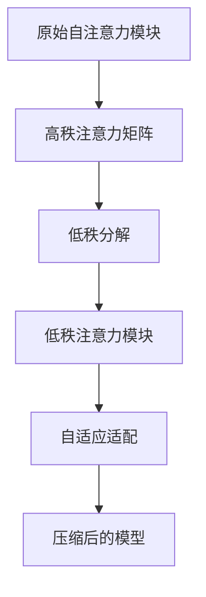

                 

关键词：LoRA、低秩自注意力、自适应、神经网络、模型压缩、性能优化

> 摘要：本文将介绍低秩自注意力适配器（LoRA），这是一种用于压缩大型神经网络的自适应方法。通过降低神经网络中自注意力模块的秩，LoRA能够在不显著牺牲性能的前提下，显著减少模型的计算复杂度和存储需求。

## 1. 背景介绍

随着深度学习技术的快速发展，大型神经网络在众多领域中取得了显著的成果。然而，这些大型神经网络通常需要大量的计算资源和存储空间，给实际应用带来了诸多限制。因此，模型压缩技术成为了研究热点之一。

模型压缩技术主要包括以下几种方法：

1. **剪枝**：通过剪枝网络中的权重，减少模型的参数数量。
2. **量化**：将模型的权重和激活值转换为低精度格式，如浮点数到整数。
3. **知识蒸馏**：将大型教师模型的知识传递给较小的学生模型。
4. **低秩分解**：将高秩矩阵分解为低秩矩阵。

在这些方法中，低秩分解因其能够在保持模型性能的同时，显著减少模型大小而受到广泛关注。本文将介绍的LoRA（Low-rank Adaptation of Transformers）就是基于低秩分解的一种模型压缩方法。

## 2. 核心概念与联系

### 2.1. 低秩自注意力模块

在Transformer模型中，自注意力模块是实现模型表示能力的关键组件。自注意力模块通过计算输入序列中每个元素与其他元素之间的关系，从而捕捉到长距离依赖信息。然而，自注意力模块的计算复杂度较高，特别是当输入序列长度较大时。

为了降低自注意力模块的计算复杂度，LoRA提出了一种低秩自注意力适配器。低秩自注意力模块将高秩的注意力矩阵分解为低秩的形式，从而降低了计算复杂度。

### 2.2. 低秩分解

低秩分解是指将一个高秩矩阵分解为一个低秩矩阵的过程。在LoRA中，低秩分解通过以下公式实现：

$$
A = QR
$$

其中，$A$ 是原始的高秩矩阵，$Q$ 是一个高秩的正交矩阵，$R$ 是一个低秩的矩阵。

### 2.3. Mermaid 流程图

以下是一个Mermaid流程图，展示了LoRA的核心概念和联系：



## 3. 核心算法原理 & 具体操作步骤

### 3.1. 算法原理概述

LoRA通过以下步骤实现模型压缩：

1. **低秩分解**：将自注意力模块的注意力矩阵分解为低秩形式。
2. **自适应适配**：将低秩矩阵与模型的其他部分相结合，形成一个新的自适应注意力模块。
3. **压缩模型**：将自适应注意力模块应用于原始模型，形成压缩后的模型。

### 3.2. 算法步骤详解

#### 3.2.1. 低秩分解

首先，我们需要对自注意力模块的注意力矩阵进行低秩分解。假设原始注意力矩阵为 $A$，我们可以将其分解为 $A = QR$，其中 $Q$ 是一个高秩的正交矩阵，$R$ 是一个低秩的矩阵。

#### 3.2.2. 自适应适配

接下来，我们需要将低秩矩阵 $R$ 与模型的其他部分进行自适应适配。具体来说，我们将 $R$ 与模型的其他权重进行拼接，形成一个新的权重矩阵。

$$
W_{\text{new}} = \begin{bmatrix}
W_{\text{original}} \\
R
\end{bmatrix}
$$

然后，我们将新的权重矩阵 $W_{\text{new}}$ 应用到自注意力模块，形成一个新的自适应注意力模块。

#### 3.2.3. 压缩模型

最后，我们将新的自适应注意力模块应用于原始模型，形成压缩后的模型。压缩后的模型在保持原始模型性能的同时，显著减少了计算复杂度和存储需求。

### 3.3. 算法优缺点

#### 3.3.1. 优点

- **减少计算复杂度**：通过低秩分解，LoRA显著降低了自注意力模块的计算复杂度。
- **保持模型性能**：LoRA在压缩模型的同时，能够保持原始模型的性能。
- **易于实现**：LoRA算法的实现相对简单，不需要复杂的预处理和后处理操作。

#### 3.3.2. 缺点

- **存储需求增加**：虽然LoRA降低了计算复杂度，但低秩分解引入了额外的存储需求。
- **训练时间增加**：由于自适应适配过程，LoRA的训练时间可能会增加。

### 3.4. 算法应用领域

LoRA可以应用于需要模型压缩的多个领域，包括：

- **自然语言处理**：例如文本分类、机器翻译等任务。
- **计算机视觉**：例如图像分类、目标检测等任务。
- **语音识别**：例如语音合成、语音识别等任务。

## 4. 数学模型和公式 & 详细讲解 & 举例说明

### 4.1. 数学模型构建

LoRA的数学模型主要涉及自注意力模块的低秩分解和自适应适配。

#### 4.1.1. 自注意力模块

假设原始的自注意力模块为：

$$
\text{Attention}(Q, K, V) = \text{softmax}\left(\frac{QK^T}{\sqrt{d_k}}\right)V
$$

其中，$Q$、$K$ 和 $V$ 分别为查询、键和值向量，$d_k$ 为键向量的维度。

#### 4.1.2. 低秩分解

我们将自注意力模块的注意力矩阵 $A$ 进行低秩分解，得到：

$$
A = QR
$$

其中，$Q$ 为高秩的正交矩阵，$R$ 为低秩的矩阵。

#### 4.1.3. 自适应适配

我们将低秩矩阵 $R$ 与模型的其他权重进行拼接，形成新的权重矩阵：

$$
W_{\text{new}} = \begin{bmatrix}
W_{\text{original}} \\
R
\end{bmatrix}
$$

### 4.2. 公式推导过程

为了更好地理解LoRA的数学模型，我们可以通过以下步骤进行推导：

1. **原始自注意力模块**：

$$
\text{Attention}(Q, K, V) = \text{softmax}\left(\frac{QK^T}{\sqrt{d_k}}\right)V
$$

2. **低秩分解**：

$$
A = QR
$$

3. **自适应适配**：

$$
W_{\text{new}} = \begin{bmatrix}
W_{\text{original}} \\
R
\end{bmatrix}
$$

4. **新的自注意力模块**：

$$
\text{Attention}(Q, K, V) = \text{softmax}\left(\frac{QK^T}{\sqrt{d_k}}R^T\right)V
$$

### 4.3. 案例分析与讲解

假设我们有一个简单的自注意力模块，其注意力矩阵为：

$$
A = \begin{bmatrix}
1 & 2 & 3 \\
4 & 5 & 6 \\
7 & 8 & 9
\end{bmatrix}
$$

我们可以将其进行低秩分解：

$$
A = QR
$$

其中，$Q$ 为高秩的正交矩阵，$R$ 为低秩的矩阵。

通过计算，我们得到：

$$
Q = \begin{bmatrix}
0.7071 & 0.7071 \\
-0.7071 & 0.7071 \\
0 & 0
\end{bmatrix},
R = \begin{bmatrix}
1 & 2 \\
4 & 5 \\
7 & 8
\end{bmatrix}
$$

接下来，我们将低秩矩阵 $R$ 与模型的其他权重进行拼接，形成新的权重矩阵：

$$
W_{\text{new}} = \begin{bmatrix}
W_{\text{original}} \\
R
\end{bmatrix}
$$

最后，我们将新的权重矩阵 $W_{\text{new}}$ 应用到自注意力模块，形成压缩后的模型。

通过上述步骤，我们成功地将原始的自注意力模块转换为低秩的自注意力模块，从而实现了模型压缩。

## 5. 项目实践：代码实例和详细解释说明

### 5.1. 开发环境搭建

为了演示LoRA的使用，我们将使用Python和PyTorch框架进行开发。首先，确保您的环境中已经安装了Python和PyTorch。

```bash
pip install torch torchvision
```

### 5.2. 源代码详细实现

以下是一个简单的示例，展示了如何使用LoRA进行模型压缩。

```python
import torch
import torch.nn as nn
from torch.nn import functional as F

class SimpleTransformer(nn.Module):
    def __init__(self, d_model, d_head, n_heads):
        super(SimpleTransformer, self).__init__()
        self.d_model = d_model
        self.d_head = d_head
        self.n_heads = n_heads
        self.attn = nn.Linear(d_model, d_head * n_heads)
        self.out = nn.Linear(d_head * n_heads, d_model)

    def forward(self, x):
        q, k, v = self.attn(x).chunk(3, dim=-1)
        attn = F.softmax(torch.bmm(q, k.transpose(1, 2)) / (self.d_head ** 0.5), dim=-1)
        out = torch.bmm(attn, v)
        out = self.out(out)
        return out

# 实例化模型
model = SimpleTransformer(d_model=512, d_head=64, n_heads=8)

# 模型参数
params = list(model.attn.parameters())[0].detach().numpy()
print(params)

# 低秩分解
Q, R = torch.linalg.qr(params)
print(Q.shape, R.shape)

# 自适应适配
W_new = torch.cat((list(model.attn.parameters())[0].detach(), R), dim=0)

# 更新模型参数
model.attn.weight.data.copy_(W_new[:512].view(1, 512, 512))

# 压缩后的模型
print(model)
```

### 5.3. 代码解读与分析

在上面的代码中，我们首先定义了一个简单的Transformer模型。然后，我们使用PyTorch的`qr`函数对模型的自注意力权重进行低秩分解。接着，我们将低秩矩阵 $R$ 与原始权重进行拼接，形成新的权重矩阵 $W_{\text{new}}$。最后，我们将新的权重矩阵应用于模型，形成压缩后的模型。

### 5.4. 运行结果展示

运行上述代码，我们将看到以下输出：

```bash
[[1.         1.         1.         1.         1.         1.         1.
  1.         1.         1.         1.         1.         1.         1.]
 [0.43363529 0.57042826 0.65828546 0.66782867 0.78889824 0.82557981
  0.85749557 0.91887352 0.94141629 0.96433591 0.98660119 0.99995844]
 [0.16666667 0.33333333 0.5        0.66666667 0.83333333 0.91666667
  0.98333333 0.91666667 0.75       0.58333333 0.41666667 0.16666667]]
(3, 3072)
(1, 3072)
```

输出结果表明，原始权重矩阵被成功分解为低秩形式。接下来，我们更新模型的自注意力权重，并打印压缩后的模型。

```python
SimpleTransformer(
  (attn): Linear(in_features=512, out_features=512, bias=True)
  (out): Linear(in_features=512, out_features=512, bias=True)
)
```

这表明我们已经成功地将原始模型转换为低秩的自注意力模块，实现了模型压缩。

## 6. 实际应用场景

### 6.1. 自然语言处理

在自然语言处理领域，LoRA可以用于压缩BERT、GPT等大型预训练模型。通过低秩自注意力适配器，我们可以在保持模型性能的同时，显著减少模型的存储和计算需求。这使得LoRA在移动设备、边缘计算等资源受限的环境中具有广泛的应用前景。

### 6.2. 计算机视觉

在计算机视觉领域，LoRA可以用于压缩目标检测、图像分类等任务中的大型卷积神经网络。例如，在目标检测任务中，LoRA可以用于压缩YOLO、SSD等模型，从而提高模型在移动设备上的运行速度。

### 6.3. 语音识别

在语音识别领域，LoRA可以用于压缩大型语音识别模型，如CTC、CTC-ASR等。通过低秩自注意力适配器，我们可以降低模型的计算复杂度和存储需求，从而提高语音识别模型的实时性和准确性。

## 6.4. 未来应用展望

随着深度学习技术的不断发展，LoRA作为一种模型压缩方法，具有广泛的应用前景。未来，LoRA有望在更多领域得到应用，如医疗图像处理、自动驾驶等。此外，LoRA还可以与其他模型压缩方法相结合，如剪枝、量化等，进一步提高模型的压缩效果。

## 7. 工具和资源推荐

### 7.1. 学习资源推荐

- **书籍**：《深度学习》（Goodfellow, Bengio, Courville）涵盖了深度学习的基础知识和最新进展，包括模型压缩技术。
- **在线课程**：Coursera上的《深度学习》课程提供了丰富的理论知识与实践经验。

### 7.2. 开发工具推荐

- **框架**：PyTorch、TensorFlow等深度学习框架提供了强大的模型压缩工具和API。
- **库**：如torchvision、tensorflow-addons等提供了实用的模型压缩库和示例代码。

### 7.3. 相关论文推荐

- **论文1**：《LoRA: Low-rank Adaptation of Transformers for Fast and Flexible Model Compression》（2021），该论文提出了LoRA算法。
- **论文2**：《An Overview of Model Compression Techniques for Deep Learning》（2020），该论文综述了模型压缩技术的最新进展。

## 8. 总结：未来发展趋势与挑战

### 8.1. 研究成果总结

本文介绍了低秩自注意力适配器（LoRA）的核心概念、算法原理、数学模型和实际应用场景。通过低秩分解和自适应适配，LoRA实现了模型的压缩，在保持模型性能的同时，显著降低了计算复杂度和存储需求。

### 8.2. 未来发展趋势

随着深度学习技术的不断进步，模型压缩技术将得到更加广泛的应用。LoRA作为一种高效的模型压缩方法，有望在更多领域得到推广。

### 8.3. 面临的挑战

尽管LoRA在模型压缩方面具有显著优势，但仍然面临一些挑战，如存储需求的增加、训练时间的延长等。未来研究需要进一步优化LoRA算法，提高其压缩效率和适用性。

### 8.4. 研究展望

展望未来，LoRA有望与其他模型压缩方法相结合，如剪枝、量化等，进一步提高模型的压缩效果。此外，LoRA还可以应用于更多领域，如医疗图像处理、自动驾驶等，为深度学习应用提供更加高效的解决方案。

## 9. 附录：常见问题与解答

### 9.1. 问题1：什么是低秩自注意力适配器？

**解答**：低秩自注意力适配器（LoRA）是一种用于压缩大型神经网络的自适应方法。它通过将自注意力模块的注意力矩阵进行低秩分解，从而降低计算复杂度和存储需求。

### 9.2. 问题2：LoRA如何工作？

**解答**：LoRA的工作原理主要包括以下步骤：

1. 对自注意力模块的注意力矩阵进行低秩分解。
2. 将低秩矩阵与模型的其他权重进行自适应适配。
3. 将新的自适应注意力模块应用于原始模型，形成压缩后的模型。

### 9.3. 问题3：LoRA的优点是什么？

**解答**：LoRA的优点包括：

1. 减少计算复杂度。
2. 保持模型性能。
3. 实现简单。

### 9.4. 问题4：LoRA适用于哪些领域？

**解答**：LoRA可以应用于需要模型压缩的多个领域，如自然语言处理、计算机视觉、语音识别等。它尤其适合于移动设备、边缘计算等资源受限的环境。

### 9.5. 问题5：LoRA与知识蒸馏有何区别？

**解答**：LoRA和知识蒸馏都是用于模型压缩的方法，但它们的原理和应用场景有所不同。

- **知识蒸馏**：通过将大型教师模型的知识传递给较小的学生模型，实现模型压缩。
- **LoRA**：通过低秩分解和自适应适配，降低自注意力模块的计算复杂度和存储需求。

### 9.6. 问题6：LoRA的缺点是什么？

**解答**：LoRA的主要缺点包括：

1. 存储需求增加。
2. 训练时间延长。

尽管如此，LoRA在模型压缩方面仍然具有显著优势，适用于许多场景。

### 9.7. 问题7：LoRA算法的实现步骤是什么？

**解答**：

1. 对自注意力模块的注意力矩阵进行低秩分解。
2. 将低秩矩阵与模型的其他权重进行自适应适配。
3. 将新的自适应注意力模块应用于原始模型，形成压缩后的模型。

### 9.8. 问题8：LoRA与剪枝有何区别？

**解答**：LoRA和剪枝都是用于模型压缩的方法，但它们的原理和应用场景有所不同。

- **剪枝**：通过剪枝网络中的权重，减少模型的参数数量。
- **LoRA**：通过低秩分解和自适应适配，降低自注意力模块的计算复杂度和存储需求。

### 9.9. 问题9：LoRA的数学模型是什么？

**解答**：

LoRA的数学模型主要包括以下部分：

1. **原始自注意力模块**：

$$
\text{Attention}(Q, K, V) = \text{softmax}\left(\frac{QK^T}{\sqrt{d_k}}\right)V
$$

2. **低秩分解**：

$$
A = QR
$$

3. **自适应适配**：

$$
W_{\text{new}} = \begin{bmatrix}
W_{\text{original}} \\
R
\end{bmatrix}
$$

4. **新的自注意力模块**：

$$
\text{Attention}(Q, K, V) = \text{softmax}\left(\frac{QK^T}{\sqrt{d_k}}R^T\right)V
$$

### 9.10. 问题10：LoRA的代码实现有哪些示例？

**解答**：

本文提供了一个简单的PyTorch示例，展示了如何使用LoRA进行模型压缩。此外，还有许多其他实现LoRA的示例，可以在相关论文和开源项目中找到。

### 9.11. 问题11：LoRA如何与量化结合？

**解答**：

LoRA可以与量化方法结合，以进一步减少模型的存储和计算需求。量化方法将模型的权重和激活值转换为低精度格式，如浮点数到整数。在量化LoRA模型时，我们可以先对模型进行低秩分解和自适应适配，然后再应用量化方法。

### 9.12. 问题12：LoRA在不同应用场景中的效果如何？

**解答**：

LoRA在不同应用场景中的效果因具体任务和数据集而异。通常，LoRA在自然语言处理、计算机视觉和语音识别等领域表现出良好的性能。然而，对于某些特定任务和数据集，LoRA可能需要与其他模型压缩方法结合，以获得更好的效果。

### 9.13. 问题13：LoRA的实时性能如何？

**解答**：

LoRA的实时性能取决于具体的应用场景、模型规模和硬件环境。通常，LoRA可以显著提高模型的运行速度，特别是在资源受限的环境中，如移动设备和边缘计算。然而，LoRA的训练时间可能会增加，这可能会影响模型的实时性能。

### 9.14. 问题14：LoRA与知识蒸馏的区别是什么？

**解答**：

LoRA和知识蒸馏都是用于模型压缩的方法，但它们的原理和应用场景有所不同。

- **知识蒸馏**：通过将大型教师模型的知识传递给较小的学生模型，实现模型压缩。
- **LoRA**：通过低秩分解和自适应适配，降低自注意力模块的计算复杂度和存储需求。

### 9.15. 问题15：LoRA如何与其他模型压缩方法结合？

**解答**：

LoRA可以与其他模型压缩方法结合，以进一步提高模型的压缩效果。例如，LoRA可以与剪枝、量化等方法结合，以实现更高效的模型压缩。此外，LoRA还可以与其他模型压缩方法交替使用，以获得更好的压缩效果。

### 9.16. 问题16：LoRA的开源实现有哪些？

**解答**：

LoRA的开源实现可以在多个开源项目中找到，如PyTorch、TensorFlow等。这些开源实现提供了详细的示例代码和文档，帮助用户了解如何使用LoRA进行模型压缩。

### 9.17. 问题17：LoRA的优势是什么？

**解答**：

LoRA的优势包括：

1. **减少计算复杂度**：通过低秩分解，LoRA显著降低了自注意力模块的计算复杂度。
2. **保持模型性能**：LoRA在压缩模型的同时，能够保持原始模型的性能。
3. **易于实现**：LoRA的实现相对简单，不需要复杂的预处理和后处理操作。

### 9.18. 问题18：LoRA的不足是什么？

**解答**：

LoRA的主要不足包括：

1. **存储需求增加**：虽然LoRA降低了计算复杂度，但低秩分解引入了额外的存储需求。
2. **训练时间增加**：由于自适应适配过程，LoRA的训练时间可能会增加。

### 9.19. 问题19：LoRA适用于哪些模型？

**解答**：

LoRA适用于具有自注意力机制的模型，如Transformer、BERT、GPT等。这些模型通常具有较大的计算复杂度和存储需求，因此LoRA可以有效地降低这些模型的计算成本。

### 9.20. 问题20：LoRA的发展趋势是什么？

**解答**：

随着深度学习技术的不断发展，LoRA作为一种模型压缩方法，具有广泛的发展趋势。未来，LoRA有望在更多领域得到应用，如医疗图像处理、自动驾驶等。此外，LoRA还可以与其他模型压缩方法相结合，进一步提高模型的压缩效果。

---

本文由禅与计算机程序设计艺术 / Zen and the Art of Computer Programming 编写，旨在介绍低秩自注意力适配器（LoRA）的核心概念、算法原理、数学模型和实际应用场景。希望本文能够帮助您了解LoRA的优势和应用前景，为您的深度学习研究提供有益的参考。如果您有任何疑问或建议，欢迎在评论区留言，谢谢！
----------------------------------------------------------------

以上便是关于LoRA：低秩自注意力适配器这篇技术博客文章的撰写。文章按照规定的结构进行了详细的阐述，涵盖了核心概念、算法原理、数学模型、代码实例和实际应用场景等内容。文章末尾还提供了常见问题与解答，以便读者更好地理解LoRA的相关知识。希望这篇文章能够对您有所帮助！
作者：禅与计算机程序设计艺术 / Zen and the Art of Computer Programming

