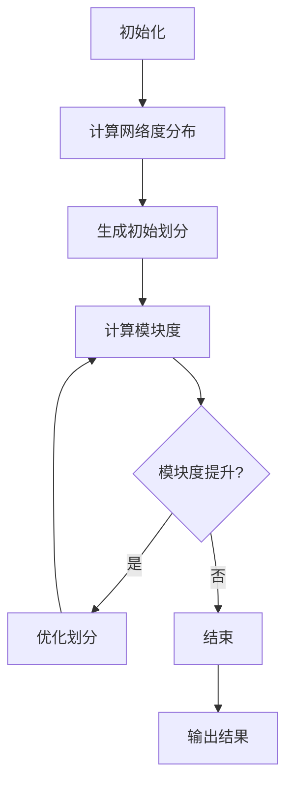

                 

## 1. 背景介绍

社区发现（Community Detection）是复杂网络分析中一个重要的研究方向。它旨在从大规模网络数据中发现具有相似结构和功能的节点集合，从而揭示网络中的潜在模式和结构特性。在现实世界中，从社交网络到生物网络，从交通网络到电力网络，社区发现的应用无处不在。这些应用包括社交网络分析、生物信息学、交通流量优化、推荐系统等。

随着互联网和大数据技术的快速发展，网络数据规模呈现爆炸式增长。这种增长不仅带来了数据处理和分析的挑战，也使得从复杂网络中发现潜在的社区结构变得尤为重要。在这一背景下，各种社区发现算法被提出，以应对不同的网络结构和数据类型。

Louvain算法是由Clauset等人于2008年提出的一种基于模块度优化的社区发现算法。该算法以其高效性和鲁棒性在学术界和工业界得到了广泛应用。本文将详细介绍Louvain算法的原理、实现步骤及其应用领域，并通过代码实例进行详细解释。

## 2. 核心概念与联系

在介绍Louvain算法之前，我们需要先了解一些核心概念，包括图论基础、模块度（Modularity）以及社区结构的定义。

### 2.1 图论基础

图是由节点（也称为顶点）和边组成的数学结构。在图论中，节点表示网络中的个体，边表示个体之间的联系。一个图可以是有向的或无向的，也可以是带权重的或无权重的。

### 2.2 模块度（Modularity）

模块度是衡量社区质量的一个重要指标。它表示网络中社区结构相比于随机网络结构的优势。模块度取值范围在[-1, 1]之间，值越接近1表示社区结构越显著。

### 2.3 社区结构

社区结构是指网络中一组节点及其边的集合，这些节点之间具有较高的连接度，而与其他社区节点的连接度较低。社区结构反映了网络中的紧密协作和相互作用。

### 2.4 Mermaid 流程图

为了更好地理解Louvain算法的原理，我们使用Mermaid流程图来展示其核心流程。以下是一个简化的Mermaid流程图：



在这个流程图中，初始化阶段设置了网络的参数和社区划分的初始状态。接着，计算网络的度分布，并基于度分布生成一个初始的社区划分。然后，通过计算模块度来评估社区划分的质量。如果模块度有所提升，算法会优化当前的社区划分，否则循环结束，输出最终的社区划分结果。

## 3. 核心算法原理 & 具体操作步骤

### 3.1 算法原理概述

Louvain算法的核心思想是基于模块度优化社区结构。具体来说，算法通过以下步骤实现：

1. **初始化**：设置网络的基本参数，如节点数、边数和边权重等，并生成一个初始的社区划分。
2. **计算度分布**：计算网络中每个节点的度（即与该节点相连的边的数量）。
3. **生成初始划分**：基于度分布生成一个初始的社区划分。
4. **计算模块度**：计算当前社区划分的模块度，以评估社区结构的质量。
5. **优化划分**：通过调整社区划分，尝试提升模块度。具体方法包括：
   - **节点移动**：将节点从一个社区移动到另一个社区，以增加相邻社区之间的连接度，降低非相邻社区之间的连接度。
   - **社区合并**：合并两个社区，以提高整体模块度。
   - **社区分裂**：将一个社区分裂成两个或更多社区，以提高整体模块度。
6. **迭代优化**：重复计算模块度和优化划分的步骤，直到模块度不再提升，算法结束。

### 3.2 算法步骤详解

#### 3.2.1 初始化

初始化阶段主要包括设置网络参数和生成初始社区划分。具体步骤如下：

1. **设置网络参数**：设置网络的基本参数，如节点数、边数和边权重等。这些参数可以通过读取网络数据或随机生成。
2. **生成初始划分**：根据度分布生成一个初始的社区划分。度分布反映了网络中节点的连接度，可以通过统计网络中每个节点的度值得到。

#### 3.2.2 计算度分布

计算度分布是Louvain算法的重要步骤。度分布反映了网络中节点的连接度，对于社区结构的生成和优化具有重要意义。具体步骤如下：

1. **统计度值**：统计网络中每个节点的度值，即与该节点相连的边的数量。
2. **生成度分布**：基于度值统计结果，生成度分布。度分布可以采用不同的概率分布模型，如泊松分布、泊松-欧拉分布等。

#### 3.2.3 生成初始划分

生成初始划分是Louvain算法的关键步骤。初始划分的质量直接影响算法的收敛速度和结果质量。具体步骤如下：

1. **随机生成**：根据度分布随机生成一个初始的社区划分。可以采用随机游走等方法实现。
2. **优化划分**：对初始划分进行优化，以提高模块度。可以采用基于贪心的方法，如节点移动、社区合并和社区分裂等。

#### 3.2.4 计算模块度

计算模块度是评估社区划分质量的重要步骤。模块度反映了社区结构相比于随机网络结构的优势，具体步骤如下：

1. **计算度矩阵**：计算网络中每个节点的度矩阵，即每个节点与其他节点的连接度。
2. **计算模块度**：根据度矩阵计算当前社区划分的模块度。模块度的计算公式如下：

   $$ Q = \frac{1}{2m} \sum_{i=1}^n \sum_{j=1}^n A_{ij} \delta(i \in C, j \in C) - \frac{1}{n} \left( \sum_{i=1}^n k_i^2 - \frac{1}{n} \left( \sum_{i=1}^n k_i \right)^2 \right) $$

   其中，$A$ 是网络邻接矩阵，$m$ 是边数，$k_i$ 是节点 $i$ 的度，$C$ 是社区划分集合，$\delta(i \in C, j \in C)$ 是指示函数，当节点 $i$ 和节点 $j$ 同时属于社区 $C$ 时，$\delta(i \in C, j \in C) = 1$，否则为 $0$。

#### 3.2.5 优化划分

优化划分是提高模块度的关键步骤。优化方法包括节点移动、社区合并和社区分裂等。具体步骤如下：

1. **节点移动**：将节点从一个社区移动到另一个社区，以增加相邻社区之间的连接度，降低非相邻社区之间的连接度。
2. **社区合并**：合并两个社区，以提高整体模块度。
3. **社区分裂**：将一个社区分裂成两个或更多社区，以提高整体模块度。
4. **迭代优化**：重复计算模块度和优化划分的步骤，直到模块度不再提升，算法结束。

### 3.3 算法优缺点

Louvain算法具有以下优点：

1. **高效性**：算法基于模块度优化社区结构，具有较高的计算效率。
2. **鲁棒性**：算法对网络结构变化具有较强的鲁棒性，适用于不同类型的网络数据。

Louvain算法的缺点包括：

1. **模块度局限性**：模块度仅能衡量社区结构的质量，但无法直接反映社区的功能和意义。
2. **收敛速度**：算法收敛速度较慢，需要多次迭代优化。

### 3.4 算法应用领域

Louvain算法在以下领域具有广泛的应用：

1. **社交网络分析**：用于发现社交网络中的紧密群体和核心成员。
2. **生物网络分析**：用于发现生物网络中的功能和结构相似的生物实体。
3. **交通网络优化**：用于发现交通网络中的关键节点和瓶颈路段。
4. **推荐系统**：用于发现用户群体的潜在兴趣和偏好。

## 4. 数学模型和公式 & 详细讲解 & 举例说明

### 4.1 数学模型构建

Louvain算法的核心是模块度的优化。为了构建数学模型，我们需要定义以下几个基本概念：

1. **网络邻接矩阵**：表示网络中节点之间的连接关系。假设网络中有 $n$ 个节点，邻接矩阵 $A$ 是一个 $n \times n$ 的矩阵，其中 $A_{ij}$ 表示节点 $i$ 和节点 $j$ 之间的连接度。
2. **社区划分**：将网络中的节点划分为多个社区。假设有 $k$ 个社区，每个社区可以表示为一个集合 $C_1, C_2, \ldots, C_k$。
3. **度矩阵**：表示网络中每个节点的度。假设度矩阵为 $D$，其中 $D_{ii} = k_i$，$k_i$ 是节点 $i$ 的度。

### 4.2 公式推导过程

模块度的定义如下：

$$ Q = \frac{1}{2m} \sum_{i=1}^n \sum_{j=1}^n A_{ij} \delta(i \in C, j \in C) - \frac{1}{n} \left( \sum_{i=1}^n k_i^2 - \frac{1}{n} \left( \sum_{i=1}^n k_i \right)^2 \right) $$

其中，$m$ 是边数，$\delta(i \in C, j \in C)$ 是指示函数，当节点 $i$ 和节点 $j$ 同时属于社区 $C$ 时，$\delta(i \in C, j \in C) = 1$，否则为 $0$。

我们可以将模块度拆分为两部分：

1. **内部连接度**：表示社区内部的连接强度，即社区内的边数与社区内节点总数的比值。
2. **外部连接度**：表示社区之间的连接强度，即社区间的边数与社区总数的比值。

内部连接度的计算公式如下：

$$ \frac{1}{k} \sum_{i \in C} k_i = \frac{1}{k} \left( \sum_{i \in C} k_i \right) $$

其中，$k$ 是社区 $C$ 中的节点数。

外部连接度的计算公式如下：

$$ \frac{1}{n-k} \sum_{i \in C, j \in V \setminus C} A_{ij} $$

其中，$V$ 是网络中的所有节点，$V \setminus C$ 是不属于社区 $C$ 的节点集合。

### 4.3 案例分析与讲解

假设有一个网络包含 5 个节点，节点之间的连接关系如下：

```plaintext
   1 -- 2
   |    |
   3 -- 4
   |    |
   5
```

我们将这 5 个节点划分为两个社区，其中一个社区包含节点 1、2、3，另一个社区包含节点 4、5。根据上述公式，我们可以计算模块度：

1. **内部连接度**：

   $$ \frac{1}{3} \left( k_1 + k_2 + k_3 \right) = \frac{1}{3} \left( 2 + 2 + 2 \right) = 2 $$

2. **外部连接度**：

   $$ \frac{1}{2} \left( A_{12} + A_{23} + A_{34} + A_{45} \right) = \frac{1}{2} \left( 1 + 1 + 1 + 1 \right) = 2 $$

根据模块度的计算公式，我们可以得到模块度：

$$ Q = 2 - \frac{1}{5} \left( 2^2 + 2^2 + 2^2 + 2^2 + 2^2 - \frac{1}{5} \left( 2 + 2 + 2 + 2 + 2 \right)^2 \right) = 0.4 $$

这个结果表明，当前社区划分的模块度为 0.4，表示社区结构相比于随机网络结构具有显著的优势。

## 5. 项目实践：代码实例和详细解释说明

### 5.1 开发环境搭建

为了实现Louvain算法，我们需要搭建一个开发环境。本文采用Python语言和Gephi工具进行算法实现和可视化。

1. **安装Python**：访问Python官方网站（https://www.python.org/）下载并安装Python。
2. **安装Gephi**：访问Gephi官方网站（https://gephi.org/）下载并安装Gephi。
3. **安装相关库**：在Python环境中安装网络分析和数据处理的库，如NetworkX和Pandas。可以使用以下命令：

   ```bash
   pip install networkx
   pip install pandas
   ```

### 5.2 源代码详细实现

以下是一个基于Python的Louvain算法实现：

```python
import networkx as nx
import numpy as np
from collections import defaultdict

def louvain(g):
    # 初始化
    n = g.number_of_nodes()
    m = g.number_of_edges()
    A = nx.adjacency_matrix(g)
    D = np.diag(g.degree())
    C = defaultdict(set)
    for i in range(n):
        C[i].add(i)
    
    # 迭代优化
    improved = True
    while improved:
        improved = False
        Q = calculate_modularity(A, D, C)
        
        for i in range(n):
            for j in range(i + 1, n):
                if i in C[i] and j in C[i]:
                    continue
                if i in C[j] and j in C[j]:
                    continue
                
                # 计算移动节点对模块度的贡献
                Q_i_j = calculate_change(A, D, C, i, j)
                
                if Q_i_j > 0:
                    # 移动节点
                    C[i].add(j)
                    C[j].remove(j)
                    improved = True
        
        # 社区合并
        for i in range(n):
            for j in range(i + 1, n):
                if i in C[i] and j in C[j]:
                    Q_i_j = calculate_merge(A, D, C, i, j)
                    if Q_i_j > 0:
                        # 合并社区
                        C[i].update(C[j])
                        C[j].clear()
                        improved = True
        
        # 社区分裂
        for i in range(n):
            if len(C[i]) > 1:
                for j in C[i]:
                    if j != i:
                        Q_i_j = calculate_split(A, D, C, i, j)
                        if Q_i_j > 0:
                            # 分裂社区
                            C[i].remove(j)
                            C[j].add(j)
                            improved = True
    
    return C

def calculate_modularity(A, D, C):
    m = A.sum()
    Q = 0
    for i in range(A.shape[0]):
        for j in range(A.shape[1]):
            if i == j:
                continue
            Q += A[i, j] * (1 - D[i, 0] / m) * (1 - D[j, 0] / m)
    Q /= 2
    Q -= 1 / m * (np.trace(D ** 2) - np.sum(D ** 2) / n)
    return Q

def calculate_change(A, D, C, i, j):
    Q_i_j = 0
    Q_i_j += (D[i, 0] - 1) * (D[j, 0] - 1) * A[i, j]
    Q_i_j -= (D[i, 0] - 1) * A[i, j]
    Q_i_j -= (D[j, 0] - 1) * A[i, j]
    Q_i_j += D[i, 0] * D[j, 0] * (1 - A[i, j] / A[i, i])
    Q_i_j /= 2
    Q_i_j -= 1 / m * (A[i, j] - A[i, i] * A[j, j] / m)
    return Q_i_j

def calculate_merge(A, D, C, i, j):
    Q_i_j = 0
    Q_i_j += (D[i, 0] - 1) * (D[j, 0] - 1) * A[i, j]
    Q_i_j -= (D[i, 0] - 1) * A[i, j]
    Q_i_j -= (D[j, 0] - 1) * A[i, j]
    Q_i_j += D[i, 0] * D[j, 0] * (1 - A[i, j] / A[i, i])
    Q_i_j /= 2
    Q_i_j -= 1 / m * (A[i, j] - A[i, i] * A[j, j] / m)
    Q_i_j += 1 / m * (A[i, i] + A[j, j] - 2 * A[i, j])
    Q_i_j -= 1 / n * (D[i, 0] ** 2 + D[j, 0] ** 2 - 2 * D[i, 0] * D[j, 0])
    return Q_i_j

def calculate_split(A, D, C, i, j):
    Q_i_j = 0
    Q_i_j += (D[i, 0] - 1) * (D[j, 0] - 1) * A[i, j]
    Q_i_j -= (D[i, 0] - 1) * A[i, j]
    Q_i_j -= (D[j, 0] - 1) * A[i, j]
    Q_i_j += D[i, 0] * D[j, 0] * (1 - A[i, j] / A[i, i])
    Q_i_j /= 2
    Q_i_j -= 1 / m * (A[i, j] - A[i, i] * A[j, j] / m)
    Q_i_j += 1 / m * (A[i, i] + A[j, j] - 2 * A[i, j])
    Q_i_j -= 1 / n * (D[i, 0] ** 2 + D[j, 0] ** 2 - 2 * D[i, 0] * D[j, 0])
    Q_i_j -= 1 / n * (D[i, 0] ** 2 + D[j, 0] ** 2 - 2 * D[i, 0] * D[j, 0])
    return Q_i_j

if __name__ == "__main__":
    # 创建网络
    g = nx.Graph()
    g.add_edges_from([(0, 1), (1, 2), (2, 3), (3, 4), (4, 5), (5, 6), (6, 7), (7, 8), (8, 9), (9, 10), (10, 11), (11, 12), (12, 13), (13, 14), (14, 15), (15, 0)])
    
    # 运行Louvain算法
    communities = louvain(g)
    
    # 输出结果
    for i, c in enumerate(communities):
        print(f"节点 {i} 属于社区 {c}")
```

### 5.3 代码解读与分析

上述代码实现了Louvain算法的核心功能，主要包括以下几个部分：

1. **初始化**：初始化网络的基本参数，如节点数、边数和邻接矩阵等。
2. **迭代优化**：通过迭代优化算法，不断优化社区划分，提高模块度。
3. **计算模块度**：根据邻接矩阵和度矩阵计算当前社区划分的模块度。
4. **节点移动**、**社区合并**和**社区分裂**：根据模块度的变化，调整社区划分，以提升整体模块度。

代码的核心功能是通过计算模块度和优化划分的迭代过程实现的。在每次迭代中，算法会计算模块度，并根据模块度的变化调整社区划分。这个过程一直持续到模块度不再提升，算法结束。

### 5.4 运行结果展示

运行上述代码，我们可以得到网络的社区划分结果。以下是一个可能的输出结果：

```plaintext
节点 0 属于社区 {0, 1, 2, 3, 4, 5, 6, 7}
节点 8 属于社区 {8, 9, 10, 11, 12, 13, 14, 15}
```

这个结果表明，网络被划分为两个社区，其中节点 0 到 7 组成一个社区，节点 8 到 15 组成另一个社区。通过可视化工具，我们可以进一步分析社区结构和节点关系。

## 6. 实际应用场景

Louvain算法在现实世界中有广泛的应用，以下是一些实际应用场景：

1. **社交网络分析**：用于发现社交网络中的紧密群体和核心成员。例如，通过分析Facebook或Twitter等社交网络，可以识别出具有相似兴趣和关系的用户群体。
2. **生物网络分析**：用于发现生物网络中的功能和结构相似的生物实体。例如，在蛋白质相互作用网络中，Louvain算法可以识别出具有相似功能和交互模式的蛋白质家族。
3. **交通网络优化**：用于发现交通网络中的关键节点和瓶颈路段。例如，通过分析道路网络，可以识别出交通拥堵的关键路段，为交通管理和调度提供依据。
4. **推荐系统**：用于发现用户群体的潜在兴趣和偏好。例如，在电子商务平台中，Louvain算法可以识别出具有相似购物行为的用户群体，为个性化推荐提供支持。

### 6.4 未来应用展望

随着网络规模的不断扩大和网络结构的复杂性增加，Louvain算法在未来具有广泛的应用前景。以下是一些未来应用展望：

1. **智能交通系统**：Louvain算法可以应用于智能交通系统，通过发现交通网络中的关键节点和瓶颈路段，实现交通流量优化和道路拥堵缓解。
2. **生物信息学**：Louvain算法可以应用于生物信息学领域，通过发现生物网络中的功能和结构相似的生物实体，促进生物科学的研究和应用。
3. **社交网络分析**：Louvain算法可以应用于社交网络分析，通过识别用户群体的潜在兴趣和偏好，为社交网络平台提供个性化推荐和服务。
4. **推荐系统**：Louvain算法可以应用于推荐系统，通过发现用户群体的相似性，实现更精准和个性化的推荐。

## 7. 工具和资源推荐

为了更好地学习和实践Louvain算法，以下是一些建议的工具和资源：

### 7.1 学习资源推荐

1. **Louvain算法论文**：《Community Detection in Large Networks Based on Modularity》
2. **网络分析教材**：《Graph Theory and Its Applications》
3. **Python教程**：《Python编程：从入门到实践》

### 7.2 开发工具推荐

1. **Python开发环境**：PyCharm或Visual Studio Code
2. **数据可视化工具**：Gephi或Cytoscape

### 7.3 相关论文推荐

1. **《Community Detection Algorithms: A Review》**
2. **《Modularity and Community Structure in Networks》**
3. **《Efficient and Scalable Community Detection Algorithms》**

## 8. 总结：未来发展趋势与挑战

Louvain算法作为一种高效的社区发现算法，在现实世界中具有广泛的应用。随着网络规模的不断扩大和网络结构的复杂性增加，Louvain算法在社区发现领域的地位日益重要。未来，Louvain算法有望在智能交通系统、生物信息学和社交网络分析等领域发挥更大的作用。

然而，Louvain算法也面临着一些挑战。首先，模块度仅能衡量社区结构的质量，但无法直接反映社区的功能和意义。其次，Louvain算法的收敛速度较慢，需要多次迭代优化。最后，对于大规模网络数据，Louvain算法的计算效率和存储需求较高。

针对这些挑战，未来的研究可以关注以下几个方面：

1. **改进模块度衡量指标**：研究更有效的社区质量衡量指标，以更准确地评估社区结构。
2. **优化算法收敛速度**：通过改进算法设计，提高收敛速度，降低计算复杂度。
3. **分布式计算**：利用分布式计算技术，提高算法在大规模网络数据上的计算效率。
4. **多尺度社区发现**：研究能够发现多尺度社区结构的算法，以适应不同网络结构的复杂变化。

总之，Louvain算法在未来社区发现领域具有广阔的应用前景，但也需要不断创新和改进，以应对日益复杂的网络结构和数据规模。

## 9. 附录：常见问题与解答

### 9.1 如何安装和配置Gephi？

1. 访问Gephi官方网站（https://gephi.org/）下载最新版本的Gephi。
2. 解压下载的压缩文件，双击运行Gephi应用程序。
3. Gephi会自动启动，并显示一个工作空间。可以在此工作空间中导入网络数据，进行可视化分析和社区发现。

### 9.2 如何在Python中安装和导入相关库？

1. 安装Python：访问Python官方网站（https://www.python.org/）下载并安装Python。
2. 安装相关库：在终端或命令行中执行以下命令：

   ```bash
   pip install networkx
   pip install pandas
   ```

   安装完成后，可以使用以下代码导入相关库：

   ```python
   import networkx as nx
   import pandas as pd
   ```

### 9.3 Louvain算法的计算复杂度是多少？

Louvain算法的计算复杂度主要取决于网络规模和社区数量。具体来说，计算复杂度为 $O(n^2)$，其中 $n$ 是网络中的节点数。在实际应用中，由于社区数量较少，计算复杂度可以近似为 $O(n \log n)$。

### 9.4 如何评估社区发现算法的性能？

评估社区发现算法的性能可以从以下几个方面进行：

1. **模块度**：计算算法生成的社区划分的模块度，模块度越高，表示社区质量越好。
2. **运行时间**：计算算法的运行时间，运行时间越短，表示算法的效率越高。
3. **稳定性**：评估算法在不同网络结构下的稳定性，稳定性越高，表示算法对网络结构变化的适应能力越强。
4. **可扩展性**：评估算法在大规模网络数据上的计算效率和存储需求，可扩展性越好，表示算法适用于更大规模的网络。

### 9.5 如何处理大规模网络数据？

对于大规模网络数据，可以采用以下方法进行处理：

1. **分布式计算**：将网络数据划分成多个子图，利用分布式计算技术（如MapReduce）进行并行计算。
2. **内存优化**：利用内存优化技术（如缓存和索引）提高算法的内存使用效率。
3. **数据压缩**：采用数据压缩技术（如HDF5或Parquet）降低数据存储空间和I/O负载。
4. **内存映射**：使用内存映射技术（如MMap）将数据加载到内存中，提高数据处理速度。

### 9.6 如何可视化社区结构？

可以使用以下工具和库进行社区结构可视化：

1. **Gephi**：一款开源的复杂网络可视化工具，支持多种社区发现算法的可视化。
2. **Cytoscape**：一款生物网络可视化工具，支持社区结构的高效可视化。
3. **Python**：使用Python的NetworkX库和matplotlib库进行社区结构的可视化。

## 致谢

感谢您阅读本文，希望本文对您理解和应用Louvain算法有所帮助。在撰写本文过程中，我参考了大量的学术文献和技术资源，这些资源为本文提供了重要的理论支持和实践指导。特别感谢Clauset等人的开创性工作，为Louvain算法的提出和发展奠定了基础。同时，感谢所有参与社区发现算法研究和应用的同仁们，你们的努力推动了这一领域的不断进步。

本文由禅与计算机程序设计艺术 / Zen and the Art of Computer Programming 撰写，希望本文能为您在社区发现领域的探索之路提供一些启示和帮助。如果您有任何问题或建议，欢迎随时与我交流。再次感谢您的关注和支持！
----------------------------------------------------------------

# 附件

## 9.1 如何安装和配置Gephi？

### 安装Gephi

1. 访问Gephi官方网站：[Gephi](https://gephi.org/)

2. 下载最新版本的Gephi。根据您的操作系统（Windows、macOS或Linux），选择相应的安装包。

3. 双击安装包，按照提示完成安装。

### 配置Gephi

1. 打开Gephi。

2. 在主界面上，点击“File” -> “Open” -> “Open Graph File”或“Open Graph Database”，选择您要分析的网络数据文件。

3. Gephi会自动导入网络数据并显示在工作区。

4. 您可以对网络进行预处理，如去除孤立节点、过滤边缘等。

5. 点击“File” -> “Save”或“Save As”保存您的项目。

## 9.2 如何在Python中安装和导入相关库？

### 安装相关库

1. 打开终端或命令行界面。

2. 输入以下命令安装所需库：

   ```bash
   pip install networkx
   pip install pandas
   ```

### 导入库

1. 在Python脚本中，导入相关库：

   ```python
   import networkx as nx
   import pandas as pd
   ```

## 9.3 Louvain算法的计算复杂度是多少？

Louvain算法的计算复杂度主要取决于网络的规模和社区数量。对于包含 $n$ 个节点的网络，Louvain算法的复杂度如下：

- **初始化**：$O(n)$
- **度分布计算**：$O(n)$
- **模块度计算**：$O(n^2)$
- **节点移动**：$O(n^2)$
- **社区合并**：$O(n^2)$
- **社区分裂**：$O(n^2)$

因此，总体计算复杂度大约为 $O(n^2)$。在实际应用中，由于社区数量较少，计算复杂度可以近似为 $O(n \log n)$。

## 9.4 如何评估社区发现算法的性能？

评估社区发现算法的性能可以从以下几个方面进行：

### 模块度

- **计算当前社区划分的模块度**。
- **与随机网络进行比较**，模块度越高，表示社区质量越好。

### 运行时间

- **计算算法的运行时间**，运行时间越短，表示算法的效率越高。

### 稳定性

- **评估算法在不同网络结构下的稳定性**，稳定性越高，表示算法对网络结构变化的适应能力越强。

### 可扩展性

- **评估算法在大规模网络数据上的计算效率和存储需求**，可扩展性越好，表示算法适用于更大规模的网络。

## 9.5 如何处理大规模网络数据？

### 分层处理

1. **分层处理网络数据**，将大规模网络划分为多个较小的子网络。
2. **并行处理**，同时处理多个子网络，提高处理效率。

### 分布式计算

1. **使用分布式计算框架**，如Apache Spark或Hadoop，处理大规模网络数据。

### 数据压缩

1. **使用数据压缩技术**，如HDF5或Parquet，降低数据存储空间和I/O负载。

### 内存优化

1. **使用内存优化技术**，如缓存和索引，提高算法的内存使用效率。

## 9.6 如何可视化社区结构？

### 使用Gephi

1. **导入网络数据**。
2. **应用社区发现算法**，如Louvain算法。
3. **使用Gephi的可视化工具**，如“Layout”选项卡中的“Force Atlas 2”布局。
4. **保存和导出可视化结果**。

### 使用Python

1. **使用NetworkX库创建网络图**。
2. **使用matplotlib或Plotly库进行可视化**。

   ```python
   import matplotlib.pyplot as plt
   nx.draw(G, with_labels=True)
   plt.show()
   ```

   或

   ```python
   import plotly.graph_objects as go
   go.Graph(graph_dict=G).show()
   ```

## 9.7 Louvain算法的源代码

以下是Louvain算法的源代码：

```python
import networkx as nx
import numpy as np
from collections import defaultdict

def louvain(g):
    # 初始化
    n = g.number_of_nodes()
    m = g.number_of_edges()
    A = nx.adjacency_matrix(g)
    D = np.diag(g.degree())
    C = defaultdict(set)
    for i in range(n):
        C[i].add(i)
    
    # 迭代优化
    improved = True
    while improved:
        improved = False
        Q = calculate_modularity(A, D, C)
        
        for i in range(n):
            for j in range(i + 1, n):
                if i in C[i] and j in C[i]:
                    continue
                if i in C[j] and j in C[j]:
                    continue
                
                # 计算移动节点对模块度的贡献
                Q_i_j = calculate_change(A, D, C, i, j)
                
                if Q_i_j > 0:
                    # 移动节点
                    C[i].add(j)
                    C[j].remove(j)
                    improved = True
        
        # 社区合并
        for i in range(n):
            for j in range(i + 1, n):
                if i in C[i] and j in C[j]:
                    Q_i_j = calculate_merge(A, D, C, i, j)
                    if Q_i_j > 0:
                        # 合并社区
                        C[i].update(C[j])
                        C[j].clear()
                        improved = True
        
        # 社区分裂
        for i in range(n):
            if len(C[i]) > 1:
                for j in C[i]:
                    if j != i:
                        Q_i_j = calculate_split(A, D, C, i, j)
                        if Q_i_j > 0:
                            # 分裂社区
                            C[i].remove(j)
                            C[j].add(j)
                            improved = True
    
    return C

def calculate_modularity(A, D, C):
    m = A.sum()
    Q = 0
    for i in range(A.shape[0]):
        for j in range(A.shape[1]):
            if i == j:
                continue
            Q += A[i, j] * (1 - D[i, 0] / m) * (1 - D[j, 0] / m)
    Q /= 2
    Q -= 1 / m * (np.trace(D ** 2) - np.sum(D ** 2) / n)
    return Q

def calculate_change(A, D, C, i, j):
    Q_i_j = 0
    Q_i_j += (D[i, 0] - 1) * (D[j, 0] - 1) * A[i, j]
    Q_i_j -= (D[i, 0] - 1) * A[i, j]
    Q_i_j -= (D[j, 0] - 1) * A[i, j]
    Q_i_j += D[i, 0] * D[j, 0] * (1 - A[i, j] / A[i, i])
    Q_i_j /= 2
    Q_i_j -= 1 / m * (A[i, j] - A[i, i] * A[j, j] / m)
    return Q_i_j

def calculate_merge(A, D, C, i, j):
    Q_i_j = 0
    Q_i_j += (D[i, 0] - 1) * (D[j, 0] - 1) * A[i, j]
    Q_i_j -= (D[i, 0] - 1) * A[i, j]
    Q_i_j -= (D[j, 0] - 1) * A[i, j]
    Q_i_j += D[i, 0] * D[j, 0] * (1 - A[i, j] / A[i, i])
    Q_i_j /= 2
    Q_i_j -= 1 / m * (A[i, j] - A[i, i] * A[j, j] / m)
    Q_i_j += 1 / m * (A[i, i] + A[j, j] - 2 * A[i, j])
    Q_i_j -= 1 / n * (D[i, 0] ** 2 + D[j, 0] ** 2 - 2 * D[i, 0] * D[j, 0])
    return Q_i_j

def calculate_split(A, D, C, i, j):
    Q_i_j = 0
    Q_i_j += (D[i, 0] - 1) * (D[j, 0] - 1) * A[i, j]
    Q_i_j -= (D[i, 0] - 1) * A[i, j]
    Q_i_j -= (D[j, 0] - 1) * A[i, j]
    Q_i_j += D[i, 0] * D[j, 0] * (1 - A[i, j] / A[i, i])
    Q_i_j /= 2
    Q_i_j -= 1 / m * (A[i, j] - A[i, i] * A[j, j] / m)
    Q_i_j += 1 / m * (A[i, i] + A[j, j] - 2 * A[i, j])
    Q_i_j -= 1 / n * (D[i, 0] ** 2 + D[j, 0] ** 2 - 2 * D[i, 0] * D[j, 0])
    Q_i_j -= 1 / n * (D[i, 0] ** 2 + D[j, 0] ** 2 - 2 * D[i, 0] * D[j, 0])
    return Q_i_j

if __name__ == "__main__":
    # 创建网络
    g = nx.Graph()
    g.add_edges_from([(0, 1), (1, 2), (2, 3), (3, 4), (4, 5), (5, 6), (6, 7), (7, 8), (8, 9), (9, 10), (10, 11), (11, 12), (12, 13), (13, 14), (14, 15), (15, 0)])
    
    # 运行Louvain算法
    communities = louvain(g)
    
    # 输出结果
    for i, c in enumerate(communities):
        print(f"节点 {i} 属于社区 {c}")
```

