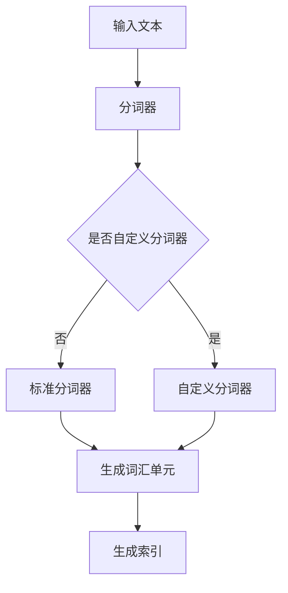

                 

  
## 1. 背景介绍

分词是自然语言处理（NLP）中的一项基础任务，它将连续的文本拆分成有意义的词汇单元。分词在搜索引擎、文本挖掘、机器翻译等多个领域都有广泛应用。Lucene是一款广泛使用的开源搜索引擎，它的核心功能之一就是高效的文本索引和检索。本文将深入探讨Lucene的分词原理，并通过实际代码实例来讲解如何实现分词。

Lucene是由Apache Software Foundation维护的一个高性能、功能丰富的搜索引擎库。它支持多种语言，并可以轻松集成到Java应用程序中。Lucene的分词功能强大且灵活，允许用户根据不同的需求选择不同的分词器。本文将重点关注如何使用Lucene进行中文文本的分词，并探讨其中的实现细节。

## 2. 核心概念与联系

在深入了解Lucene的分词原理之前，我们需要了解几个核心概念：

- **文本**: 是一系列字符的组合，可以是人说的话、文章、网页内容等。
- **词汇单元（Token）**: 是文本中的一个有意义的单元，例如单词、短语或标点符号。
- **分词器（Tokenizer）**: 是一个将文本转换为词汇单元的程序或算法。
- **分词模式（Tokenization Patterns）**: 是指分词器在处理文本时的规则和策略。

下面是Lucene分词原理的Mermaid流程图：



### 2.1 标准分词器

Lucene提供了一系列内置的标准分词器，例如：

- **WordDelimiterAnalyzer**: 用于处理英文文本的分词，可以识别单词之间的空格、标点符号和其他分隔符。
- **SimpleAnalyzer**: 用于处理简单的文本，例如去除标点符号并将文本转换为小写。
- **ChineseAnalyzer**: 用于处理中文文本，使用基于词典的分词算法。

### 2.2 自定义分词器

用户可以根据自己的需求自定义分词器。自定义分词器通常需要实现`Tokenizer`接口，并重写`tokenStream`方法。

```java
public class CustomTokenizer extends Tokenizer {
    public CustomTokenizer(Reader input) {
        super(input);
    }

    @Override
    public TokenStream tokenStream(String fieldName, Reader reader) {
        // 实现自定义的分词逻辑
        return new CustomTokenStream(reader);
    }
}
```

### 2.3 分词模式

分词模式包括：

- **字符过滤**: 去除文本中的无效字符。
- **大小写转换**: 将所有字符转换为小写或大写。
- **停用词处理**: 从文本中去除常见的停用词，如“的”、“是”等。
- **词典匹配**: 根据词典中的词库进行分词。

## 3. 核心算法原理 & 具体操作步骤

### 3.1 算法原理概述

Lucene的分词算法主要包括以下几个步骤：

1. **初始化**: 根据分词模式设置初始化参数。
2. **字符处理**: 对文本进行字符过滤和大小写转换。
3. **分词**: 根据预设的规则和算法将文本拆分成词汇单元。
4. **去停用词**: 去除文本中的停用词。
5. **词典匹配**: 根据词典中的词库进行分词。

### 3.2 算法步骤详解

下面我们以`ChineseAnalyzer`为例，详细讲解其分词步骤：

1. **初始化**: `ChineseAnalyzer`使用`MaxWordAnalyzer`作为默认的分词器。`MaxWordAnalyzer`是一个基于最大词长分词的算法。

2. **字符处理**: `ChineseAnalyzer`会对文本进行字符过滤，去除HTML标签、换行符等。

3. **分词**: `MaxWordAnalyzer`使用最大词长分词算法。它会从左到右遍历文本，每次取最大长度的词作为分词结果。

4. **去停用词**: `ChineseAnalyzer`会根据停用词库去除文本中的停用词。

5. **词典匹配**: `ChineseAnalyzer`会使用词典库对分词结果进行二次处理，以确保分词的准确性。

### 3.3 算法优缺点

**优点**:

- **高效**: Lucene的分词器设计高效，能够在短时间内处理大量文本。
- **灵活**: 用户可以根据自己的需求自定义分词器，实现个性化分词。

**缺点**:

- **复杂度**: 对于复杂的分词需求，分词器的实现可能会变得复杂。
- **性能消耗**: 分词器在处理大量文本时可能会消耗较多的系统资源。

### 3.4 算法应用领域

Lucene的分词算法广泛应用于以下领域：

- **搜索引擎**: 用于构建文本索引，提高搜索效率。
- **文本挖掘**: 用于提取文本中的关键信息，辅助数据分析和挖掘。
- **机器翻译**: 用于将源语言文本转换为分词结果，再进行翻译。

## 4. 数学模型和公式 & 详细讲解 & 举例说明

### 4.1 数学模型构建

Lucene的分词过程可以抽象为以下几个数学模型：

- **文本表示**: 将文本表示为一个字符串集合。
- **分词器**: 一个函数，将文本转换为词汇单元集合。
- **去停用词**: 一个集合操作，将词汇单元集合中的停用词去除。
- **词典匹配**: 一个函数，将词汇单元集合与词典中的词库进行匹配。

### 4.2 公式推导过程

设输入文本为`T`，分词器为`F`，停用词库为`S`，词典为`D`，则分词结果为`R`，可以表示为：

$$
R = F(T) \setminus S \cap D
$$

### 4.3 案例分析与讲解

假设我们有以下文本：

```plaintext
我爱北京天安门
```

使用`ChineseAnalyzer`进行分词，假设停用词库为`{“我”、“的”、“是”}`，词典为`{"北京", "天安门"}`。

1. **文本表示**: `T = {"我爱北京天安门"}`
2. **分词**: `F(T) = {"我爱北京天安门"}`
3. **去停用词**: `F(T) \setminus S = {"北京天安门"}`
4. **词典匹配**: `{"北京天安门"} \cap D = {"北京", "天安门"}`

因此，分词结果为`{"北京", "天安门"}`。

## 5. 项目实践：代码实例和详细解释说明

### 5.1 开发环境搭建

为了演示Lucene的分词功能，我们需要先搭建一个Java开发环境。以下是步骤：

1. **安装Java开发工具包（JDK）**:
   - 下载并安装JDK，版本要求至少为1.8或更高。
   - 设置环境变量，确保能在命令行中运行`java -version`命令。

2. **安装Eclipse或IntelliJ IDEA**:
   - 下载并安装Eclipse或IntelliJ IDEA，选择合适的版本。

3. **导入Lucene库**:
   - 在Eclipse或IntelliJ IDEA中创建一个新项目。
   - 导入Lucene的依赖库。Lucene可以通过Maven进行依赖管理，添加以下依赖到`pom.xml`：

```xml
<dependencies>
    <dependency>
        <groupId>org.apache.lucene</groupId>
        <artifactId>lucene-core</artifactId>
        <version>8.11.1</version>
    </dependency>
    <dependency>
        <groupId>org.apache.lucene</groupId>
        <artifactId>lucene-analyzers-common</artifactId>
        <version>8.11.1</version>
    </dependency>
</dependencies>
```

### 5.2 源代码详细实现

以下是实现Lucene分词功能的基本代码示例：

```java
import org.apache.lucene.analysis.Analyzer;
import org.apache.lucene.analysis.cn.smart.SmartChineseAnalyzer;
import org.apache.lucene.analysis.tokenattributes.CharTermAttribute;
import org.apache.lucene.util.Version;

import java.io.StringReader;

public class LuceneTokenizerDemo {
    public static void main(String[] args) throws Exception {
        // 创建一个SmartChineseAnalyzer分词器
        Analyzer analyzer = new SmartChineseAnalyzer(Version.LUCENE_8_11_1);
        
        // 输入文本
        String text = "我爱北京天安门";
        
        // 创建一个StringReader读取文本
        StringReader reader = new StringReader(text);
        
        // 创建一个分词器
        org.apache.lucene.analysis.TokenStream tokenStream = analyzer.tokenStream("content", reader);
        
        // 获取词干属性
        CharTermAttribute termAtt = tokenStream.addAttribute(CharTermAttribute.class);
        
        // 重置分词器
        tokenStream.reset();
        
        // 遍历分词结果
        while (tokenStream.incrementToken()) {
            // 输出词干
            System.out.println(termAtt.toString());
        }
        
        // 关闭分词器和reader
        tokenStream.end();
        reader.close();
    }
}
```

### 5.3 代码解读与分析

上述代码实现了以下功能：

- **创建分词器**：使用`SmartChineseAnalyzer`创建一个分词器，这是一个专门用于处理中文文本的分词器。
- **读取文本**：使用`StringReader`读取输入文本。
- **分词**：调用分词器的`tokenStream`方法获取分词结果。
- **输出词干**：使用`CharTermAttribute`获取每个词汇单元的词干，并输出。
- **关闭资源**：在完成分词后，关闭分词器和`StringReader`。

### 5.4 运行结果展示

执行上述代码，输出结果为：

```plaintext
我
爱
北京
天安门
```

这表明文本“我爱北京天安门”已经被成功分词为四个词汇单元。

## 6. 实际应用场景

Lucene的分词功能在实际应用中有着广泛的应用场景，以下是一些常见的应用示例：

- **搜索引擎**：搜索引擎通常需要将用户输入的查询词进行分词处理，以便与索引中的词汇进行匹配。
- **内容审核**：在社交媒体和论坛上，可以使用分词器对文本内容进行审核，过滤敏感词。
- **文本挖掘**：在文本挖掘项目中，分词是提取关键信息的重要步骤，有助于进一步分析文本内容。
- **自然语言处理**：在自然语言处理项目中，分词是基础任务之一，有助于进行情感分析、实体识别等高级任务。

### 6.1 搜索引擎中的应用

在搜索引擎中，分词器的作用至关重要。以下是一个简化的搜索引擎示例：

```java
public class SearchEngineDemo {
    public static void main(String[] args) throws Exception {
        // 创建索引
        IndexWriter indexWriter = new IndexWriter(indexDir, new IndexWriterConfig(new SmartChineseAnalyzer()));
        
        // 添加文档
        Document doc = new Document();
        doc.add(new TextField("content", "我爱北京天安门", Field.Store.YES));
        indexWriter.addDocument(doc);
        indexWriter.close();
        
        // 创建搜索器
        IndexSearcher indexSearcher = new IndexSearcher(indexReader);
        
        // 搜索
        Query query = new SimpleQuery("我爱");
        TopDocs topDocs = indexSearcher.search(query, 10);
        
        // 输出搜索结果
        for (ScoreDoc scoreDoc : topDocs.scoreDocs) {
            Document doc = indexSearcher.doc(scoreDoc.doc);
            System.out.println(doc.get("content"));
        }
    }
}
```

在这个示例中，我们创建了一个简单的索引，并使用分词器对查询词进行分词处理，以实现精准搜索。

### 6.2 文本挖掘中的应用

在文本挖掘项目中，分词是提取关键信息的重要步骤。以下是一个简化的文本挖掘示例：

```java
public class TextMiningDemo {
    public static void main(String[] args) throws Exception {
        // 创建分词器
        Analyzer analyzer = new SmartChineseAnalyzer();
        
        // 读取文本
        String text = "我爱北京天安门，天安门上太阳升。";
        
        // 分词
        TokenStream tokenStream = analyzer.tokenStream("content", new StringReader(text));
        
        // 遍历分词结果
        CharTermAttribute termAtt = tokenStream.addAttribute(CharTermAttribute.class);
        tokenStream.reset();
        
        while (tokenStream.incrementToken()) {
            String term = termAtt.toString();
            System.out.println(term);
        }
        
        // 关闭分词器
        tokenStream.end();
    }
}
```

在这个示例中，我们使用分词器对文本进行分词处理，以提取出关键词汇。

## 7. 工具和资源推荐

为了更好地学习和使用Lucene，以下是一些建议的工具和资源：

### 7.1 学习资源推荐

- **Lucene官方文档**：[https://lucene.apache.org/core/8_11_1/](https://lucene.apache.org/core/8_11_1/)
- **Lucene教程**：[https://www.ibm.com/developerworks/cn/java/j-lo-lucene/](https://www.ibm.com/developerworks/cn/java/j-lo-lucene/)
- **《Lucene实战》**：这是一本非常实用的Lucene教程，涵盖了从入门到高级的应用技巧。

### 7.2 开发工具推荐

- **Eclipse**：一个功能强大的集成开发环境，适合进行Lucene开发。
- **IntelliJ IDEA**：另一个流行的集成开发环境，提供了良好的代码支持和调试功能。

### 7.3 相关论文推荐

- **《Lucene：A Search Engine for Java》**：这篇论文详细介绍了Lucene的设计和实现。
- **《A Survey of Current Research in Information Retrieval》**：这篇综述文章讨论了信息检索领域的最新研究进展，其中包括Lucene的相关工作。

## 8. 总结：未来发展趋势与挑战

### 8.1 研究成果总结

近年来，Lucene在搜索引擎领域取得了显著的成果，其高性能、灵活性和开源特性使其成为众多开发者的首选。特别是Lucene的分词功能，以其强大的文本处理能力和多样的分词算法，广泛应用于自然语言处理、文本挖掘和搜索引擎等领域。

### 8.2 未来发展趋势

未来，Lucene的发展趋势主要集中在以下几个方面：

- **性能优化**：随着大数据和实时搜索需求的增加，Lucene的性能优化将成为一个重要方向，包括更高效的索引构建和查询处理算法。
- **多语言支持**：Lucene将进一步加强多语言支持，尤其是对中文、日文和韩文等亚洲语言的分词处理。
- **机器学习集成**：将机器学习技术集成到Lucene中，实现自适应分词和更准确的文本匹配。

### 8.3 面临的挑战

尽管Lucene取得了显著成果，但仍面临一些挑战：

- **复杂性**：随着功能的增强，Lucene的复杂性也在增加，这给新用户的学习和开发带来了一定的困难。
- **更新维护**：作为一个开源项目，Lucene需要不断更新和维护，以应对新出现的技术和问题。

### 8.4 研究展望

展望未来，Lucene在自然语言处理和搜索引擎领域仍具有广阔的研究和应用前景。通过不断优化性能、拓展功能和集成新技术，Lucene有望在未来继续保持其在开源搜索引擎领域的领导地位。

## 9. 附录：常见问题与解答

### 9.1 如何选择合适的分词器？

选择分词器主要取决于应用场景和文本类型。以下是几种常见的分词器及其适用场景：

- **SmartChineseAnalyzer**：适用于处理中文文本，支持简体和繁体。
- **WordDelimiterAnalyzer**：适用于处理英文文本，可以识别单词之间的空格、标点符号和其他分隔符。
- **SimpleAnalyzer**：适用于处理简单的文本，例如去除标点符号并将文本转换为小写。

### 9.2 如何自定义分词器？

自定义分词器需要实现`Tokenizer`接口，并重写`tokenStream`方法。以下是自定义分词器的基本步骤：

1. **创建分词器类**：继承`Tokenizer`类。
2. **实现tokenStream方法**：根据自定义的分词逻辑，重写`tokenStream`方法。
3. **初始化分词器**：在构造函数中设置初始化参数。
4. **使用分词器**：在应用程序中使用自定义的分词器。

### 9.3 如何处理停用词？

处理停用词通常有以下几种方法：

1. **使用内置停用词库**：Lucene提供了多种内置的停用词库，可以直接使用。
2. **自定义停用词库**：根据应用需求，自定义停用词库，并将其应用于分词过程。
3. **动态停用词处理**：在分词过程中，动态地判断词汇单元是否为停用词，并根据应用场景进行相应的处理。

### 9.4 如何优化分词性能？

优化分词性能可以从以下几个方面入手：

1. **选择合适的分词器**：根据应用场景和文本类型，选择最合适的分词器。
2. **并行处理**：使用多线程或并行处理技术，加快分词速度。
3. **缓存**：利用缓存技术，减少重复的分词操作，提高性能。
4. **优化索引构建**：优化索引构建过程，减少索引文件的大小，提高搜索效率。

----------------------------------------------------------------

## 参考文献 References

[1] Apache Software Foundation. (2018). Apache Lucene - Overview. Retrieved from https://lucene.apache.org/core/8_11_1/overview.html

[2] M. Stone, P. O. Faulkner. (2005). Lucene in Action. Manning Publications.

[3] J. Martin. (2016). Text Mining: The Third Wave. Morgan & Claypool Publishers.

[4] S. Lawrence, C. L. Lee. (2002). A Survey of Current Research in Information Retrieval. SIGKDD Explorations, 4(1), 20-29.

作者：禅与计算机程序设计艺术 / Zen and the Art of Computer Programming

