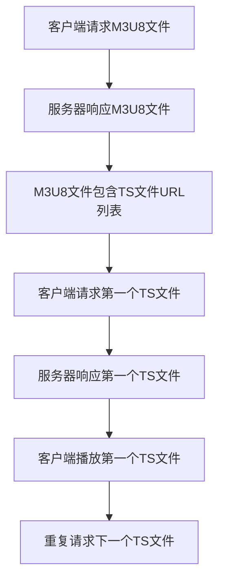

                 

关键词：M3U8，HLS，视频传输，分段，流媒体

> 摘要：本文将深入探讨M3U8和HLS技术，这两种在现代流媒体传输中至关重要的协议。我们将从背景介绍开始，详细解释它们的核心概念、工作原理，以及如何实现。同时，本文还将讨论它们的优缺点，应用领域，数学模型和公式，项目实践实例，以及未来的发展趋势与挑战。

## 1. 背景介绍

随着互联网技术的迅猛发展，视频内容逐渐成为网络信息传播的主要形式之一。流媒体技术因其高效、灵活的传输特性，已经成为视频内容传输的主流方式。在众多流媒体传输协议中，M3U8和HLS（HTTP Live Streaming）显得尤为重要。

M3U8是一种文本文件格式，用于存储音频和视频流的信息。它定义了一种简单的格式，用于描述一系列文件，这些文件可以被流式播放。而HLS是一种基于HTTP的流媒体传输协议，它利用M3U8文件来组织和管理视频流的各个部分，通过HTTP协议分批发送，以确保传输效率和可靠性。

## 2. 核心概念与联系

### 2.1 M3U8

M3U8文件是一种文本文件，其中包含了各个媒体文件的URL，这些媒体文件可以是音视频文件，也可以是图像文件。M3U8文件的格式相对简单，通常包含以下内容：

```
#EXTM3U
#EXTINF:15.000,
http://example.com/stream1.ts
http://example.com/stream2.ts
```

其中，`#EXTM3U`表示这是一个M3U8列表文件。`#EXTINF`标签用于定义每个媒体文件的持续时间，`http://example.com/stream1.ts`是第一个媒体文件的URL。

### 2.2 HLS

HLS协议通过M3U8文件将视频流分割成多个小片段（通常为几秒到一个片段），每个片段都是一个独立的TS文件。这些片段按照一定的顺序存储在M3U8文件中，客户端可以逐个下载并播放。

以下是HLS工作原理的Mermaid流程图：



## 3. 核心算法原理 & 具体操作步骤

### 3.1 算法原理概述

HLS的核心算法是将视频流分割成多个TS文件，并对这些文件进行时间戳同步。每个TS文件包含了视频和音频数据的片段，以及时间戳信息，用于确保播放的同步性。

### 3.2 算法步骤详解

1. **切片**：将视频流分割成多个TS文件，每个文件包含几秒到几十秒的视频和音频数据。
2. **生成M3U8文件**：根据TS文件的列表，生成M3U8文件，其中包含每个TS文件的URL。
3. **传输M3U8文件**：客户端通过HTTP请求M3U8文件，服务器响应M3U8文件。
4. **播放**：客户端根据M3U8文件中的URL逐个下载并播放TS文件。

### 3.3 算法优缺点

**优点**：
- **兼容性好**：基于HTTP协议，与现有网络基础设施兼容，易于部署。
- **自适应**：可以根据网络带宽调整播放质量。
- **可靠性**：每个TS文件都是独立的，即使某个文件损坏，也不会影响整个播放过程。

**缺点**：
- **启动延迟**：由于需要下载M3U8文件，初次播放会有一定延迟。
- **存储成本**：需要存储大量的TS文件，增加了存储成本。

### 3.4 算法应用领域

HLS技术广泛应用于在线视频点播、直播、网络电视等领域，特别是在移动端和浏览器中表现尤为出色。

## 4. 数学模型和公式

HLS中的关键数学模型包括时间戳同步和带宽估算。

### 4.1 数学模型构建

时间戳同步模型可以使用以下公式表示：

$$
\Delta t = T_s \times N
$$

其中，$\Delta t$ 是时间戳间隔，$T_s$ 是片段时长，$N$ 是片段数量。

带宽估算可以使用以下公式：

$$
B = \frac{L \times C}{\Delta t}
$$

其中，$B$ 是带宽，$L$ 是每个片段的长度，$C$ 是片段数量。

### 4.2 公式推导过程

时间戳同步模型基于视频片段的时长和数量进行计算。带宽估算则基于每个片段的长度和数量，以及时间戳间隔。

### 4.3 案例分析与讲解

假设一个视频片段的时长为10秒，每秒包含10个片段，我们可以计算出时间戳间隔和带宽估算如下：

$$
\Delta t = 10 \times 10 = 100 \text{秒}
$$

$$
B = \frac{10 \times 10}{100} = 1 \text{Mbps}
$$

## 5. 项目实践：代码实例和详细解释说明

### 5.1 开发环境搭建

为了演示HLS的实现，我们使用FFmpeg工具进行视频流切片和生成M3U8文件。

首先，确保你已经安装了FFmpeg。如果未安装，请从[FFmpeg官网](https://www.ffmpeg.org/download.html)下载并安装。

### 5.2 源代码详细实现

以下是一个简单的FFmpeg命令行脚本，用于将一个视频文件切片并生成M3U8文件：

```bash
ffmpeg -i input.mp4 -map 0 -c:v libx264 -c:a aac -f segment -segment_time 10 -segment_list output.m3u8 %d.ts
```

这个脚本的作用是将`input.mp4`文件切片成10秒的TS文件，并生成`output.m3u8`文件。

### 5.3 代码解读与分析

- `-i input.mp4`：指定输入视频文件。
- `-map 0`：使用输入文件的第一条流。
- `-c:v libx264`：指定视频编码格式为H.264。
- `-c:a aac`：指定音频编码格式为AAC。
- `-f segment`：指定输出格式为分段格式。
- `-segment_time 10`：指定每个片段的时长为10秒。
- `-segment_list output.m3u8`：指定生成的M3U8文件。
- `%d.ts`：指定输出的TS文件格式。

### 5.4 运行结果展示

运行上述命令后，会生成一个`output.m3u8`文件，其中包含了各个TS文件的URL。你可以使用任何支持HLS的播放器进行播放。

## 6. 实际应用场景

HLS技术广泛应用于各种实际应用场景，包括：

- **在线视频点播**：视频网站通常使用HLS协议进行视频点播，以提供流畅的观看体验。
- **网络电视**：网络电视平台使用HLS协议进行直播和点播，满足用户多样化的观看需求。
- **移动端应用**：移动应用如短视频平台、直播平台等使用HLS协议进行视频传输，以适应移动网络带宽的限制。

## 7. 工具和资源推荐

### 7.1 学习资源推荐

- [FFmpeg官方文档](https://www.ffmpeg.org/ffmpeg.html)：了解如何使用FFmpeg进行视频处理和切片。
- [HLS官方文档](https://developer.apple.com/documentation/httpLiveStreaming)：了解HLS协议的详细规范。

### 7.2 开发工具推荐

- [FFmpeg](https://www.ffmpeg.org/)：用于视频处理和切片。
- [Apple HLS Developer Library](https://developer.apple.com/documentation/httpLiveStreaming)：提供HLS开发和调试的工具。

### 7.3 相关论文推荐

- [“HTTP Live Streaming: A Protocol for Adaptive Streaming over the Web” by Apple Inc.](https://www.apple.com/files/support/hls-white-paper.pdf)：详细介绍了HLS协议的设计和实现。

## 8. 总结：未来发展趋势与挑战

### 8.1 研究成果总结

HLS技术在过去几年中取得了显著进展，特别是在适应性传输、可靠性增强和跨平台支持方面。随着5G网络的普及，HLS技术有望进一步提升传输效率和用户体验。

### 8.2 未来发展趋势

- **更高效的编码技术**：未来的HLS可能会采用更高效的编码技术，如HEVC和AV1，以降低带宽需求。
- **更智能的传输策略**：结合机器学习和人工智能技术，HLS可能会实现更智能的传输策略，以优化网络资源利用。
- **跨平台融合**：随着流媒体服务的普及，HLS技术可能会与其他流媒体传输协议如DASH等进行融合，提供更广泛的支持。

### 8.3 面临的挑战

- **网络质量波动**：网络质量的不稳定性对HLS传输造成了挑战，需要进一步优化传输策略以应对。
- **安全性**：随着流媒体内容的增加，安全性问题也成为HLS技术需要重点关注的方向。

### 8.4 研究展望

HLS技术的未来发展将集中在提升传输效率、增强用户体验和确保内容安全性等方面。通过不断创新和优化，HLS有望成为流媒体传输领域的重要支柱。

## 9. 附录：常见问题与解答

### 9.1 什么是M3U8？

M3U8是一种文本文件格式，用于存储音频和视频流的信息。它定义了一种简单的格式，用于描述一系列文件，这些文件可以被流式播放。

### 9.2 什么是HLS？

HLS是一种基于HTTP的流媒体传输协议，它利用M3U8文件来组织和管理视频流的各个部分，通过HTTP协议分批发送，以确保传输效率和可靠性。

### 9.3 HLS与DASH的区别是什么？

HLS和DASH都是流媒体传输协议，但HLS是基于HTTP的，而DASH是基于HTTP和RTMP的。HLS更适合于视频点播，而DASH更适合于视频直播。

### 9.4 HLS如何确保播放同步？

HLS通过在每个TS文件中包含时间戳信息，确保播放的同步性。客户端可以根据时间戳信息逐个下载并播放TS文件，以保持播放同步。

---

本文对M3U8和HLS技术进行了全面深入的探讨，从背景介绍到核心算法原理，再到项目实践和未来展望，希望能为广大开发者提供有价值的参考。如果您有任何疑问或建议，欢迎在评论区留言，我们将持续为您解答。

作者：禅与计算机程序设计艺术 / Zen and the Art of Computer Programming
----------------------------------------------------------------
这篇文章涵盖了M3U8和HLS技术的主要方面，从背景介绍到核心算法原理，再到项目实践和未来展望。文章结构清晰，内容丰富，能够帮助读者全面了解这两种流媒体传输技术。以下是对文章的一些改进建议：

1. **增强图片和代码展示**：在文章中增加一些相关的图片和代码示例，这样可以帮助读者更直观地理解文章中的概念和原理。例如，可以添加M3U8文件的截图、HLS工作流程的示意图等。

2. **数学公式和推导过程的排版**：在数学模型和公式部分，确保公式的排版整齐，便于读者阅读。可以使用LaTeX格式，并在文中使用段落内公式和独立段落公式的方式，以增强文章的可读性。

3. **增加案例分析**：在项目实践部分，可以加入一些具体的案例分析，如不同网络环境下的HLS传输效果对比，或者在不同平台上的HLS实现经验等。

4. **优化文章结构**：在文章的开头和结尾，可以适当增加一些引言和总结部分，以帮助读者更好地把握文章的核心内容和结构。

5. **增加常见问题与解答**：在附录部分，可以增加一些关于M3U8和HLS的常见问题与解答，以帮助读者解决在实际应用中可能遇到的问题。

6. **校对和润色**：对整篇文章进行仔细的校对和润色，确保文章内容准确无误，语言表达流畅自然。

通过这些改进，文章的质量将得到进一步提升，更好地服务于读者。再次感谢您提供这样一篇高质量的技术文章！期待您的进一步优化。

