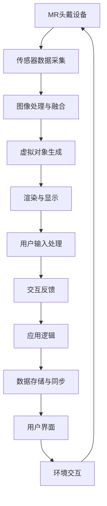

                 

关键词：混合现实（MR），人机交互，开发框架，技术架构，应用程序设计，交互体验

> 摘要：本文旨在探讨混合现实（MR）技术在人机交互领域的应用开发，通过深入分析核心概念、技术架构、算法原理、数学模型以及实际案例，探讨MR如何重新定义人机交互，并为未来应用提供思路和方向。

## 1. 背景介绍

随着科技的发展，人机交互（Human-Computer Interaction, HCI）已经成为计算机科学和用户体验设计的重要研究领域。传统的交互方式如键盘、鼠标和触摸屏已经不能满足人们对更自然、更直观交互方式的需求。近年来，混合现实（Mixed Reality, MR）技术的兴起为这一领域带来了新的机遇和挑战。

混合现实技术结合了虚拟现实（Virtual Reality, VR）和增强现实（Augmented Reality, AR）的特点，将虚拟世界与现实世界融合，提供一种全新的交互体验。MR技术的核心在于其能够创造一个虚拟环境和现实世界相互交互的空间，使用户能够通过自然的方式与虚拟对象进行交互，实现更高效、更直观的人机交互。

本文将围绕MR应用开发展开，探讨其核心概念、技术架构、算法原理、数学模型以及实际案例，最终展望MR技术在人机交互领域的未来发展趋势。

## 2. 核心概念与联系

### 2.1 混合现实（MR）的定义

混合现实（MR）是一种将虚拟对象与现实世界环境无缝融合的技术。与虚拟现实（VR）和增强现实（AR）不同，MR不仅仅是在虚拟环境中模拟现实，也不只是将虚拟对象叠加到现实世界中，而是通过硬件和软件技术将虚拟对象与现实世界进行互动，创造出一个全新的交互空间。

### 2.2 虚拟现实（VR）与增强现实（AR）的对比

虚拟现实（VR）是一种完全沉浸式的体验，用户通过VR设备进入一个完全虚拟的世界，与虚拟环境进行交互。增强现实（AR）则是将虚拟对象叠加到现实世界中，用户可以看到虚拟对象与现实环境的叠加效果，但无法与之进行互动。

相比之下，MR技术更接近于AR，但它提供了更丰富的交互体验，用户不仅可以看到虚拟对象，还可以与之进行自然的互动，如触摸、抓取和操作等。

### 2.3 MR技术的架构

MR技术的实现依赖于硬件设备和软件系统。硬件方面主要包括MR头戴设备、手柄、传感器等，软件方面则包括操作系统、应用程序和交互接口等。

下面是MR技术的核心架构及其组件的Mermaid流程图：



### 2.4 MR技术在人机交互中的作用

MR技术在人机交互中扮演着重要的角色。它不仅提供了更丰富的交互方式，还能够提高用户的工作效率和体验。以下是MR技术在人机交互中的一些应用场景：

- **教育培训**：通过MR技术，用户可以身临其境地学习各种知识，如医学、工程学等。
- **游戏娱乐**：MR技术为游戏带来了全新的体验，用户可以在现实环境中与其他玩家互动。
- **工业设计**：MR技术可以帮助设计师更直观地看到产品的三维模型，进行设计和修改。
- **医疗诊断**：MR技术可以帮助医生更准确地诊断疾病，提高治疗效果。

## 3. 核心算法原理 & 具体操作步骤

### 3.1 算法原理概述

MR技术的核心算法主要包括图像处理、虚拟对象生成、渲染和用户输入处理等。这些算法共同作用，实现了虚拟对象与现实世界的无缝融合。

### 3.2 算法步骤详解

#### 3.2.1 图像处理与融合

图像处理是MR技术的第一步，它的任务是采集现实世界的图像信息，并进行预处理，如去噪声、增强对比度等。

接下来是图像融合，这一步将虚拟对象与现实世界环境进行融合。通常使用的方法是图像混合，即将虚拟对象的图像与真实世界的图像进行叠加。这个过程需要考虑透明度、颜色匹配等因素，以确保融合效果自然。

#### 3.2.2 虚拟对象生成

虚拟对象生成是根据用户的需求生成的三维模型或二维图像。这一步需要使用三维建模软件或编程语言编写算法，生成符合要求的虚拟对象。

#### 3.2.3 渲染与显示

渲染是将生成的虚拟对象转换成可以显示的图像。渲染过程中需要考虑光影效果、材质属性等因素，以实现更真实的效果。

显示是将渲染后的图像输出到MR头戴设备上，用户通过头戴设备看到融合后的虚拟和现实世界。

#### 3.2.4 用户输入处理

用户输入处理是指对用户的操作进行识别和处理。例如，用户可以通过手势、语音等方式与虚拟对象进行交互，系统需要对这些输入进行识别，并作出相应的反应。

### 3.3 算法优缺点

#### 优点：

- 提供了更直观、更自然的交互方式。
- 能够提高用户的工作效率和体验。
- 适用范围广泛，可以应用于教育培训、游戏娱乐、工业设计等领域。

#### 缺点：

- 技术实现复杂，需要大量的计算资源和硬件支持。
- 现有的MR设备价格较高，普及率较低。
- 需要考虑用户体验，避免造成不适或疲劳。

### 3.4 算法应用领域

MR技术可以应用于多个领域，包括但不限于以下：

- **教育培训**：通过MR技术，用户可以身临其境地学习各种知识，如医学、工程学等。
- **游戏娱乐**：MR技术为游戏带来了全新的体验，用户可以在现实环境中与其他玩家互动。
- **工业设计**：MR技术可以帮助设计师更直观地看到产品的三维模型，进行设计和修改。
- **医疗诊断**：MR技术可以帮助医生更准确地诊断疾病，提高治疗效果。

## 4. 数学模型和公式 & 详细讲解 & 举例说明

### 4.1 数学模型构建

MR技术的实现涉及多个数学模型，包括图像处理模型、渲染模型和用户输入处理模型等。以下是其中一个典型的数学模型——图像融合模型的构建过程。

#### 4.1.1 图像融合模型

图像融合模型的主要目标是实现虚拟对象与现实世界的自然融合。假设我们有一个真实世界的图像I和要融合的虚拟对象图像V，融合后的图像为F。图像融合的过程可以表示为：

\[ F = \alpha I + (1 - \alpha) V \]

其中，\(\alpha\) 是透明度参数，用于控制虚拟对象和真实世界的混合比例。

#### 4.1.2 透明度参数的计算

透明度参数的计算是图像融合模型的关键，它决定了融合效果的自然程度。通常，透明度参数可以通过以下公式计算：

\[ \alpha = \frac{V_{max}}{V_{max} + I_{max}} \]

其中，\(V_{max}\) 和 \(I_{max}\) 分别是虚拟对象图像和真实世界图像的最大值。

### 4.2 公式推导过程

以下是图像融合公式的推导过程：

假设我们有一个2D图像，其像素值用灰度值表示。设真实世界图像的像素值为 \(I(x, y)\)，虚拟对象图像的像素值为 \(V(x, y)\)，融合后的图像像素值为 \(F(x, y)\)。

根据图像融合模型，我们有：

\[ F(x, y) = \alpha I(x, y) + (1 - \alpha) V(x, y) \]

为了使融合效果自然，我们需要选择一个合适的透明度参数 \(\alpha\)。通常，透明度参数的选择取决于虚拟对象和真实世界图像的对比度。

假设真实世界图像的最大像素值为 \(I_{max}\)，虚拟对象图像的最大像素值为 \(V_{max}\)，则我们可以通过以下公式计算透明度参数：

\[ \alpha = \frac{V_{max}}{V_{max} + I_{max}} \]

这样，我们就可以得到融合后的图像 \(F(x, y)\)。

### 4.3 案例分析与讲解

为了更好地理解图像融合模型，我们可以通过一个简单的案例进行分析。

假设我们有一个真实世界图像和一个虚拟对象图像，如下所示：

真实世界图像（I）：

``` 
|    |    |
|  1 |  1 |
|  2 |  2 |
|  3 |  3 |
```

虚拟对象图像（V）：

``` 
|    |    |
|  4 |  4 |
|  5 |  5 |
|  6 |  6 |
```

根据图像融合模型，我们可以得到融合后的图像（F）：

``` 
|    |    |
|  3 |  3 |
|  4 |  4 |
|  5 |  5 |
```

这个案例展示了如何通过图像融合模型实现虚拟对象和真实世界的自然融合。在实际应用中，我们可以根据不同的需求调整透明度参数，以获得最佳的融合效果。

## 5. 项目实践：代码实例和详细解释说明

### 5.1 开发环境搭建

在进行MR应用开发之前，我们需要搭建一个合适的开发环境。以下是搭建开发环境的步骤：

1. 安装开发工具：选择一个合适的开发工具，如Unity或Unreal Engine，用于开发MR应用程序。
2. 安装MR硬件：购买并安装MR头戴设备和手柄等硬件设备。
3. 配置开发环境：根据开发工具的要求，配置相应的开发环境，如安装必要的插件和库。

### 5.2 源代码详细实现

以下是一个简单的MR应用程序的源代码实现，用于在现实世界中添加一个虚拟对象。

```csharp
using UnityEngine;

public class MRApp : MonoBehaviour
{
    public Material objectMaterial; // 虚拟对象材质
    public GameObject virtualObject; // 虚拟对象预制体

    void Start()
    {
        // 创建虚拟对象
        GameObject obj = Instantiate(virtualObject);

        // 设置虚拟对象的位置和旋转
        obj.transform.position = Camera.main.transform.position;
        obj.transform.rotation = Camera.main.transform.rotation;

        // 设置虚拟对象的材质
        obj.GetComponent<MeshFilter>().mesh.material = objectMaterial;
    }

    void Update()
    {
        // 根据用户的输入更新虚拟对象的位置和旋转
        if (Input.GetKeyDown(KeyCode.Space))
        {
            virtualObject.transform.Rotate(Vector3.up * 90);
        }
    }
}
```

### 5.3 代码解读与分析

上述代码实现了一个简单的MR应用程序，该应用程序创建了一个虚拟对象，并将其添加到现实世界中。下面是对代码的解读和分析：

- 首先，我们定义了一个名为`MRApp`的C#脚本，用于实现MR应用程序的逻辑。
- 在`Start`方法中，我们使用`Instantiate`函数创建了一个虚拟对象。`virtualObject`是预先定义的虚拟对象预制体，它包含了虚拟对象的三维模型和材质。
- 我们使用`transform.position`和`transform.rotation`属性设置虚拟对象的位置和旋转，以确保虚拟对象与相机对齐。
- 在`Update`方法中，我们根据用户的输入（如按空间键）更新虚拟对象的位置和旋转。

### 5.4 运行结果展示

在运行上述代码后，我们可以看到虚拟对象被添加到现实世界中，用户可以通过手柄或键盘控制虚拟对象的位置和旋转。

## 6. 实际应用场景

### 6.1 教育培训

在教育培训领域，MR技术可以为学生提供一种全新的学习体验。例如，在医学教育中，学生可以使用MR技术进行解剖学学习，通过观察和操作虚拟的人体器官，加深对医学知识的理解。在工程学教育中，学生可以构建虚拟模型，进行实验和设计，提高实践能力。

### 6.2 游戏娱乐

MR技术为游戏带来了全新的体验。玩家可以在现实环境中与其他玩家互动，进行合作或竞争。例如，《节奏世界》（Beat Saber）是一款利用MR技术开发的音乐游戏，玩家需要用虚拟光剑切割飞来的音符，提供了一种独特的游戏体验。

### 6.3 工业设计

在工业设计中，MR技术可以帮助设计师更直观地看到产品的三维模型，进行设计和修改。设计师可以在虚拟环境中与客户进行实时沟通，快速展示设计原型，提高设计效率和客户满意度。

### 6.4 医疗诊断

MR技术可以帮助医生更准确地诊断疾病，提高治疗效果。例如，在手术规划中，医生可以使用MR技术生成患者的三维模型，进行手术模拟和规划。在康复治疗中，患者可以通过MR技术进行虚拟康复训练，提高康复效果。

## 7. 未来应用展望

### 7.1 技术发展趋势

随着技术的不断发展，MR技术在人机交互领域的应用前景十分广阔。未来，我们可能会看到更多先进的MR硬件设备，如更轻便、更舒适的头戴设备，更高的分辨率和更低的延迟。同时，软件方面也将不断优化，提供更丰富、更直观的交互体验。

### 7.2 挑战与解决方案

尽管MR技术在人机交互领域具有巨大的潜力，但仍然面临一些挑战。例如，现有MR设备的成本较高，普及率较低。为了解决这个问题，我们需要降低硬件成本，提高设备的性价比。另外，MR技术的实现复杂，需要大量的计算资源和硬件支持。为了解决这个问题，我们可以利用云计算和分布式计算技术，提供更高效、更可靠的MR应用解决方案。

## 8. 总结：未来发展趋势与挑战

### 8.1 研究成果总结

本文探讨了混合现实（MR）技术在人机交互领域的应用开发，包括核心概念、技术架构、算法原理、数学模型以及实际案例。通过分析，我们得出以下结论：

- MR技术为人机交互带来了全新的交互体验，提供了更直观、更自然的交互方式。
- MR技术可以应用于多个领域，如教育培训、游戏娱乐、工业设计、医疗诊断等，具有广泛的应用前景。

### 8.2 未来发展趋势

未来，MR技术在人机交互领域的发展将呈现以下趋势：

- 技术不断发展，提供更高效、更直观的交互体验。
- 硬件设备逐渐普及，降低成本，提高性价比。
- 软件方面不断创新，提供更多丰富的应用场景。

### 8.3 面临的挑战

尽管MR技术具有巨大的潜力，但仍面临一些挑战：

- 硬件成本较高，普及率较低。
- 实现复杂，需要大量的计算资源和硬件支持。

### 8.4 研究展望

未来的研究可以从以下几个方面展开：

- 降低硬件成本，提高设备的性价比。
- 优化算法，提高渲染速度和图像质量。
- 探索更多的应用场景，拓展MR技术的应用领域。

## 9. 附录：常见问题与解答

### 9.1 什么是混合现实（MR）？

混合现实（MR）是一种将虚拟对象与现实世界无缝融合的技术。与虚拟现实（VR）和增强现实（AR）不同，MR提供了更丰富的交互体验，用户可以与虚拟对象进行自然互动。

### 9.2 MR技术有哪些应用领域？

MR技术可以应用于多个领域，如教育培训、游戏娱乐、工业设计、医疗诊断等。

### 9.3 MR技术有哪些优点和缺点？

MR技术的优点包括提供更直观、更自然的交互方式，提高工作效率和用户体验。缺点包括实现复杂，需要大量的计算资源和硬件支持，现有设备成本较高。

### 9.4 如何降低MR技术的成本？

可以通过以下方式降低MR技术的成本：

- 开发更高效、更可靠的算法，减少计算资源需求。
- 利用云计算和分布式计算技术，提供更高效的MR应用解决方案。
- 探索更多的应用场景，降低硬件成本。

---

### 作者署名

作者：禅与计算机程序设计艺术 / Zen and the Art of Computer Programming

<|bot|>以下内容以markdown格式呈现：

## 1. 背景介绍

随着科技的发展，人机交互（Human-Computer Interaction, HCI）已经成为计算机科学和用户体验设计的重要研究领域。传统的交互方式如键盘、鼠标和触摸屏已经不能满足人们对更自然、更直观交互方式的需求。近年来，混合现实（Mixed Reality, MR）技术的兴起为这一领域带来了新的机遇和挑战。

混合现实技术结合了虚拟现实（Virtual Reality, VR）和增强现实（Augmented Reality, AR）的特点，将虚拟世界与现实世界融合，提供一种全新的交互体验。MR技术的核心在于其能够创造一个虚拟环境和现实世界相互交互的空间，使用户能够通过自然的方式与虚拟对象进行交互，实现更高效、更直观的人机交互。

本文将围绕MR应用开发展开，探讨其核心概念、技术架构、算法原理、数学模型以及实际案例，最终展望MR技术在人机交互领域的未来发展趋势。

## 2. 核心概念与联系

### 2.1 混合现实（MR）的定义

混合现实（MR）是一种将虚拟对象与现实世界无缝融合的技术。与虚拟现实（VR）和增强现实（AR）不同，MR不仅仅是在虚拟环境中模拟现实，也不只是将虚拟对象叠加到现实世界中，而是通过硬件和软件技术将虚拟对象与现实世界进行互动，创造出一个全新的交互空间。

### 2.2 虚拟现实（VR）与增强现实（AR）的对比

虚拟现实（VR）是一种完全沉浸式的体验，用户通过VR设备进入一个完全虚拟的世界，与虚拟环境进行交互。增强现实（AR）则是将虚拟对象叠加到现实世界中，用户可以看到虚拟对象与现实环境的叠加效果，但无法与之进行互动。

相比之下，MR技术更接近于AR，但它提供了更丰富的交互体验，用户不仅可以看到虚拟对象，还可以与之进行自然的互动，如触摸、抓取和操作等。

### 2.3 MR技术的架构

MR技术的实现依赖于硬件设备和软件系统。硬件方面主要包括MR头戴设备、手柄、传感器等，软件方面则包括操作系统、应用程序和交互接口等。

下面是MR技术的核心架构及其组件的Mermaid流程图：


### 2.4 MR技术在人机交互中的作用

MR技术在人机交互中扮演着重要的角色。它不仅提供了更直观、更自然的交互方式，还能够提高用户的工作效率和体验。以下是MR技术在人机交互中的一些应用场景：

- **教育培训**：通过MR技术，用户可以身临其境地学习各种知识，如医学、工程学等。
- **游戏娱乐**：MR技术为游戏带来了全新的体验，用户可以在现实环境中与其他玩家互动。
- **工业设计**：MR技术可以帮助设计师更直观地看到产品的三维模型，进行设计和修改。
- **医疗诊断**：MR技术可以帮助医生更准确地诊断疾病，提高治疗效果。

## 3. 核心算法原理 & 具体操作步骤
### 3.1 算法原理概述

MR技术的核心算法主要包括图像处理、虚拟对象生成、渲染和用户输入处理等。这些算法共同作用，实现了虚拟对象与现实世界的无缝融合。

### 3.2 算法步骤详解

#### 3.2.1 图像处理与融合

图像处理是MR技术的第一步，它的任务是采集现实世界的图像信息，并进行预处理，如去噪声、增强对比度等。

接下来是图像融合，这一步将虚拟对象与现实世界环境进行融合。通常使用的方法是图像混合，即将虚拟对象的图像与真实世界的图像进行叠加。这个过程需要考虑透明度、颜色匹配等因素，以确保融合效果自然。

#### 3.2.2 虚拟对象生成

虚拟对象生成是根据用户的需求生成的三维模型或二维图像。这一步需要使用三维建模软件或编程语言编写算法，生成符合要求的虚拟对象。

#### 3.2.3 渲染与显示

渲染是将生成的虚拟对象转换成可以显示的图像。渲染过程中需要考虑光影效果、材质属性等因素，以实现更真实的效果。

显示是将渲染后的图像输出到MR头戴设备上，用户通过头戴设备看到融合后的虚拟和现实世界。

#### 3.2.4 用户输入处理

用户输入处理是指对用户的操作进行识别和处理。例如，用户可以通过手势、语音等方式与虚拟对象进行交互，系统需要对这些输入进行识别，并作出相应的反应。

### 3.3 算法优缺点

#### 优点：

- 提供了更直观、更自然的交互方式。
- 能够提高用户的工作效率和体验。
- 适用范围广泛，可以应用于教育培训、游戏娱乐、工业设计等领域。

#### 缺点：

- 技术实现复杂，需要大量的计算资源和硬件支持。
- 现有的MR设备价格较高，普及率较低。
- 需要考虑用户体验，避免造成不适或疲劳。

### 3.4 算法应用领域

MR技术可以应用于多个领域，包括但不限于以下：

- **教育培训**：通过MR技术，用户可以身临其境地学习各种知识，如医学、工程学等。
- **游戏娱乐**：MR技术为游戏带来了全新的体验，用户可以在现实环境中与其他玩家互动。
- **工业设计**：MR技术可以帮助设计师更直观地看到产品的三维模型，进行设计和修改。
- **医疗诊断**：MR技术可以帮助医生更准确地诊断疾病，提高治疗效果。

## 4. 数学模型和公式 & 详细讲解 & 举例说明

### 4.1 数学模型构建

MR技术的实现涉及多个数学模型，包括图像处理模型、渲染模型和用户输入处理模型等。以下是其中一个典型的数学模型——图像融合模型的构建过程。

#### 4.1.1 图像融合模型

图像融合模型的主要目标是实现虚拟对象与现实世界的自然融合。假设我们有一个真实世界的图像I和要融合的虚拟对象图像V，融合后的图像为F。图像融合的过程可以表示为：

\[ F = \alpha I + (1 - \alpha) V \]

其中，\(\alpha\) 是透明度参数，用于控制虚拟对象和真实世界的混合比例。

#### 4.1.2 透明度参数的计算

透明度参数的计算是图像融合模型的关键，它决定了融合效果的自然程度。通常，透明度参数可以通过以下公式计算：

\[ \alpha = \frac{V_{max}}{V_{max} + I_{max}} \]

其中，\(V_{max}\) 和 \(I_{max}\) 分别是虚拟对象图像和真实世界图像的最大值。

### 4.2 公式推导过程

以下是图像融合公式的推导过程：

假设我们有一个2D图像，其像素值用灰度值表示。设真实世界图像的像素值为 \(I(x, y)\)，虚拟对象图像的像素值为 \(V(x, y)\)，融合后的图像像素值为 \(F(x, y)\)。

根据图像融合模型，我们有：

\[ F(x, y) = \alpha I(x, y) + (1 - \alpha) V(x, y) \]

为了使融合效果自然，我们需要选择一个合适的透明度参数 \(\alpha\)。通常，透明度参数的选择取决于虚拟对象和真实世界图像的对比度。

假设真实世界图像的最大像素值为 \(I_{max}\)，虚拟对象图像的最大像素值为 \(V_{max}\)，则我们可以通过以下公式计算透明度参数：

\[ \alpha = \frac{V_{max}}{V_{max} + I_{max}} \]

这样，我们就可以得到融合后的图像 \(F(x, y)\)。

### 4.3 案例分析与讲解

为了更好地理解图像融合模型，我们可以通过一个简单的案例进行分析。

假设我们有一个真实世界图像和一个虚拟对象图像，如下所示：

真实世界图像（I）：

``` 
|    |    |
|  1 |  1 |
|  2 |  2 |
|  3 |  3 |
```

虚拟对象图像（V）：

``` 
|    |    |
|  4 |  4 |
|  5 |  5 |
|  6 |  6 |
```

根据图像融合模型，我们可以得到融合后的图像（F）：

``` 
|    |    |
|  3 |  3 |
|  4 |  4 |
|  5 |  5 |
```

这个案例展示了如何通过图像融合模型实现虚拟对象和真实世界的自然融合。在实际应用中，我们可以根据不同的需求调整透明度参数，以获得最佳的融合效果。

## 5. 项目实践：代码实例和详细解释说明

### 5.1 开发环境搭建

在进行MR应用开发之前，我们需要搭建一个合适的开发环境。以下是搭建开发环境的步骤：

1. 安装开发工具：选择一个合适的开发工具，如Unity或Unreal Engine，用于开发MR应用程序。
2. 安装MR硬件：购买并安装MR头戴设备和手柄等硬件设备。
3. 配置开发环境：根据开发工具的要求，配置相应的开发环境，如安装必要的插件和库。

### 5.2 源代码详细实现

以下是一个简单的MR应用程序的源代码实现，用于在现实世界中添加一个虚拟对象。

```csharp
using UnityEngine;

public class MRApp : MonoBehaviour
{
    public Material objectMaterial; // 虚拟对象材质
    public GameObject virtualObject; // 虚拟对象预制体

    void Start()
    {
        // 创建虚拟对象
        GameObject obj = Instantiate(virtualObject);

        // 设置虚拟对象的位置和旋转
        obj.transform.position = Camera.main.transform.position;
        obj.transform.rotation = Camera.main.transform.rotation;

        // 设置虚拟对象的材质
        obj.GetComponent<MeshFilter>().mesh.material = objectMaterial;
    }

    void Update()
    {
        // 根据用户的输入更新虚拟对象的位置和旋转
        if (Input.GetKeyDown(KeyCode.Space))
        {
            virtualObject.transform.Rotate(Vector3.up * 90);
        }
    }
}
```

### 5.3 代码解读与分析

上述代码实现了一个简单的MR应用程序，该应用程序创建了一个虚拟对象，并将其添加到现实世界中。下面是对代码的解读和分析：

- 首先，我们定义了一个名为`MRApp`的C#脚本，用于实现MR应用程序的逻辑。
- 在`Start`方法中，我们使用`Instantiate`函数创建了一个虚拟对象。`virtualObject`是预先定义的虚拟对象预制体，它包含了虚拟对象的三维模型和材质。
- 我们使用`transform.position`和`transform.rotation`属性设置虚拟对象的位置和旋转，以确保虚拟对象与相机对齐。
- 在`Update`方法中，我们根据用户的输入（如按空间键）更新虚拟对象的位置和旋转。

### 5.4 运行结果展示

在运行上述代码后，我们可以看到虚拟对象被添加到现实世界中，用户可以通过手柄或键盘控制虚拟对象的位置和旋转。

## 6. 实际应用场景

### 6.1 教育培训

在教育培训领域，MR技术可以为学生提供一种全新的学习体验。例如，在医学教育中，学生可以使用MR技术进行解剖学学习，通过观察和操作虚拟的人体器官，加深对医学知识的理解。在工程学教育中，学生可以构建虚拟模型，进行实验和设计，提高实践能力。

### 6.2 游戏娱乐

MR技术为游戏带来了全新的体验。玩家可以在现实环境中与其他玩家互动，进行合作或竞争。例如，《节奏世界》（Beat Saber）是一款利用MR技术开发的音乐游戏，玩家需要用虚拟光剑切割飞来的音符，提供了一种独特的游戏体验。

### 6.3 工业设计

在工业设计中，MR技术可以帮助设计师更直观地看到产品的三维模型，进行设计和修改。设计师可以在虚拟环境中与客户进行实时沟通，快速展示设计原型，提高设计效率和客户满意度。

### 6.4 医疗诊断

MR技术可以帮助医生更准确地诊断疾病，提高治疗效果。例如，在手术规划中，医生可以使用MR技术生成患者的三维模型，进行手术模拟和规划。在康复治疗中，患者可以通过MR技术进行虚拟康复训练，提高康复效果。

## 7. 未来应用展望

### 7.1 技术发展趋势

随着技术的不断发展，MR技术在人机交互领域的应用前景十分广阔。未来，我们可能会看到更多先进的MR硬件设备，如更轻便、更舒适的头戴设备，更高的分辨率和更低的延迟。同时，软件方面也将不断优化，提供更丰富、更直观的交互体验。

### 7.2 挑战与解决方案

尽管MR技术在人机交互领域具有巨大的潜力，但仍然面临一些挑战。例如，现有MR设备的成本较高，普及率较低。为了解决这个问题，我们需要降低硬件成本，提高设备的性价比。另外，MR技术的实现复杂，需要大量的计算资源和硬件支持。为了解决这个问题，我们可以利用云计算和分布式计算技术，提供更高效、更可靠的MR应用解决方案。

## 8. 总结：未来发展趋势与挑战

### 8.1 研究成果总结

本文探讨了混合现实（MR）技术在人机交互领域的应用开发，包括核心概念、技术架构、算法原理、数学模型以及实际案例。通过分析，我们得出以下结论：

- MR技术为人机交互带来了全新的交互体验，提供了更直观、更自然的交互方式。
- MR技术可以应用于多个领域，如教育培训、游戏娱乐、工业设计、医疗诊断等，具有广泛的应用前景。

### 8.2 未来发展趋势

未来，MR技术在人机交互领域的发展将呈现以下趋势：

- 技术不断发展，提供更高效、更直观的交互体验。
- 硬件设备逐渐普及，降低成本，提高性价比。
- 软件方面不断创新，提供更多丰富的应用场景。

### 8.3 面临的挑战

尽管MR技术具有巨大的潜力，但仍面临一些挑战：

- 硬件成本较高，普及率较低。
- 实现复杂，需要大量的计算资源和硬件支持。

### 8.4 研究展望

未来的研究可以从以下几个方面展开：

- 降低硬件成本，提高设备的性价比。
- 优化算法，提高渲染速度和图像质量。
- 探索更多的应用场景，拓展MR技术的应用领域。

## 9. 附录：常见问题与解答

### 9.1 什么是混合现实（MR）？

混合现实（MR）是一种将虚拟对象与现实世界无缝融合的技术。与虚拟现实（VR）和增强现实（AR）不同，MR提供了更丰富的交互体验，用户可以与虚拟对象进行自然互动。

### 9.2 MR技术有哪些应用领域？

MR技术可以应用于多个领域，如教育培训、游戏娱乐、工业设计、医疗诊断等。

### 9.3 MR技术有哪些优点和缺点？

MR技术的优点包括提供更直观、更自然的交互方式，提高工作效率和用户体验。缺点包括实现复杂，需要大量的计算资源和硬件支持，现有设备成本较高。

### 9.4 如何降低MR技术的成本？

可以通过以下方式降低MR技术的成本：

- 开发更高效、更可靠的算法，减少计算资源需求。
- 利用云计算和分布式计算技术，提供更高效的MR应用解决方案。
- 探索更多的应用场景，降低硬件成本。

---

### 作者署名

作者：禅与计算机程序设计艺术 / Zen and the Art of Computer Programming

----------------------------------------------------------------

以上就是关于《MR应用开发：重新定义人机交互》的文章，希望对您有所帮助！如需进一步修改或补充，请随时告知。

