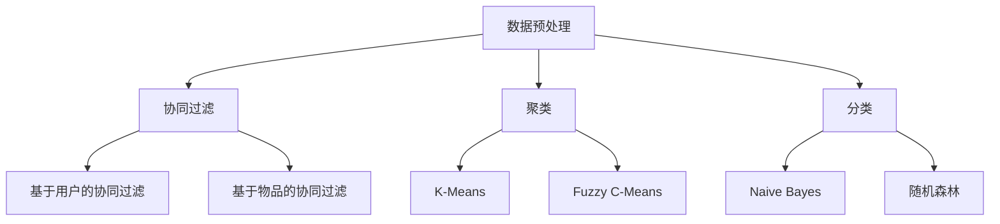

                 

“作者：禅与计算机程序设计艺术 / Zen and the Art of Computer Programming”

在当今大数据时代，处理海量数据变得越来越重要。Apache Mahout就是这样一个用于大规模数据挖掘和机器学习的库。它提供了许多经典的机器学习算法，支持多种数据类型，并且能够在大规模集群上运行。本文将深入探讨Mahout的原理，并通过代码实例展示如何使用它进行数据分析和预测。

## 1. 背景介绍

Apache Mahout是一个开源的机器学习库，最初由Sai Singamsetti和Robert F. Bastian于2008年创建。它基于LGPL许可证，可以自由使用和修改。Mahout的核心目标是提供可扩展、高效的机器学习算法，以便在分布式环境中进行大规模数据处理。

### 1.1 Mahout的特点

- **可扩展性**：Mahout支持MapReduce，使得其算法能够在大规模集群上高效运行。
- **多样性**：它包含了多种机器学习算法，包括协同过滤、聚类、分类等。
- **灵活的数据模型**：Mahout支持多种数据类型，如稀疏矩阵、密集矩阵、文件等。
- **易于使用**：它提供了丰富的API，使得开发人员可以轻松地集成和使用这些算法。

### 1.2 应用场景

- **推荐系统**：协同过滤算法广泛应用于推荐系统，如电影、音乐和商品推荐。
- **市场细分**：聚类算法可以帮助企业根据消费者的购买行为和偏好进行市场细分。
- **文本分类**：分类算法可以用于垃圾邮件过滤、情感分析等。
- **异常检测**：聚类算法也可以用于检测数据中的异常值。

## 2. 核心概念与联系

在讨论Mahout的核心算法之前，我们需要先了解一些基本概念。

### 2.1 数据类型

Mahout支持多种数据类型，主要包括：

- **矩阵**：用于存储数据集，可以是稀疏或密集矩阵。
- **向量**：用于表示特征。
- **集合**：用于存储数据集。

### 2.2 算法分类

Mahout主要包含以下几类算法：

- **协同过滤**：如基于用户的协同过滤、基于物品的协同过滤。
- **聚类**：如K-Means、Fuzzy C-Means、Canopy。
- **分类**：如Naive Bayes、随机森林、线性回归。
- **降维**：如主成分分析（PCA）、奇异值分解（SVD）。

### 2.3 Mermaid流程图

下面是一个简单的Mermaid流程图，展示了Mahout中几个主要算法的流程。



## 3. 核心算法原理 & 具体操作步骤

### 3.1 算法原理概述

#### 3.1.1 协同过滤

协同过滤是一种基于用户行为或偏好进行推荐的方法。它分为基于用户的协同过滤和基于物品的协同过滤。

- **基于用户的协同过滤**：找到与目标用户行为相似的邻居用户，然后推荐邻居用户喜欢的但目标用户未喜欢的物品。
- **基于物品的协同过滤**：找到与目标物品相似的邻居物品，然后推荐邻居物品对应的用户喜欢的物品。

#### 3.1.2 聚类

聚类是一种无监督学习方法，目的是将相似的数据点分组在一起。K-Means是一种经典的聚类算法，它通过迭代计算簇中心，将数据点分配到最近的簇中心。

#### 3.1.3 分类

分类是一种监督学习方法，目的是将数据点划分为预定义的类别。Naive Bayes是一种基于贝叶斯定理的简单分类算法，假设特征之间相互独立。

### 3.2 算法步骤详解

#### 3.2.1 协同过滤

1. **初始化**：创建一个用户-物品评分矩阵。
2. **计算相似度**：计算每个用户与其他用户的相似度。
3. **推荐**：对于目标用户，找到与其相似度最高的邻居用户，然后推荐邻居用户喜欢的但目标用户未喜欢的物品。

#### 3.2.2 聚类

1. **初始化**：随机选择K个数据点作为初始簇中心。
2. **分配**：将每个数据点分配到最近的簇中心。
3. **更新**：重新计算簇中心，重复分配和更新过程，直到收敛。

#### 3.2.3 分类

1. **训练**：使用有标签的数据集训练分类器。
2. **预测**：对于新的数据点，计算其属于每个类别的概率，选择概率最高的类别作为预测结果。

### 3.3 算法优缺点

#### 3.3.1 协同过滤

- **优点**：易于实现，效果较好，可以处理大量数据。
- **缺点**：可能产生冷启动问题，即新用户或新物品没有历史数据可参考。

#### 3.3.2 聚类

- **优点**：不需要预先定义类别，可以自动发现数据结构。
- **缺点**：对于初始聚类中心和聚类数目敏感，可能陷入局部最优。

#### 3.3.3 分类

- **优点**：可以对新数据进行分类，应用范围广泛。
- **缺点**：需要大量有标签的数据进行训练，训练时间较长。

### 3.4 算法应用领域

- **协同过滤**：推荐系统、社交媒体、电子商务。
- **聚类**：市场细分、异常检测、图像分割。
- **分类**：文本分类、垃圾邮件过滤、疾病诊断。

## 4. 数学模型和公式 & 详细讲解 & 举例说明

### 4.1 数学模型构建

#### 4.1.1 协同过滤

- **用户-物品评分矩阵**：$R = [r_{ij}]$
- **用户相似度**：$sim(u, v) = \frac{r_{ui}r_{vi}}{\sqrt{\sum_{j}r_{uj}^2 \sum_{k}r_{vk}^2}}$
- **预测**：$r_{ui}^{'} = \sum_{j} sim(u, v) r_{vj}$

#### 4.1.2 聚类

- **K-Means**：
  - 初始簇中心：$c_1, c_2, ..., c_K$
  - 数据点分配：$x_i \rightarrow j, \text{if} \; d(x_i, c_j) \leq d(x_i, c_k)$
  - 簇中心更新：$c_j = \frac{1}{N_j} \sum_{i=1}^{N} x_i$
  
#### 4.1.3 分类

- **Naive Bayes**：
  - 类别概率：$P(y=c_k) = \frac{N_{c_k}}{N}$
  - 特征概率：$P(x_i=c_{ki}|y=c_k) = \frac{N_{c_k,i}}{N_k}$
  - 预测：$P(y=c_k|X=x) = \frac{P(X=x|y=c_k)P(y=c_k)}{P(X=x)}$

### 4.2 公式推导过程

#### 4.2.1 协同过滤

- **相似度计算**：基于余弦相似度，计算用户$u$和用户$v$之间的相似度。
  - **步骤1**：计算用户$u$和用户$v$之间的内积。
    $$u \cdot v = \sum_{i} r_{ui}r_{vi}$$
  - **步骤2**：计算用户$u$和用户$v$的模。
    $$||u|| = \sqrt{\sum_{i}r_{ui}^2}, \; ||v|| = \sqrt{\sum_{i}r_{vi}^2}$$
  - **步骤3**：计算相似度。
    $$sim(u, v) = \frac{u \cdot v}{||u|| \cdot ||v||}$$

#### 4.2.2 聚类

- **K-Means算法**：
  - **步骤1**：随机选择K个数据点作为初始簇中心。
  - **步骤2**：对于每个数据点，计算其与K个簇中心的距离，将其分配到最近的簇中心。
  - **步骤3**：重新计算每个簇的中心，即所有属于该簇的数据点的均值。
  - **步骤4**：重复步骤2和步骤3，直到簇中心不再变化或达到最大迭代次数。

#### 4.2.3 分类

- **Naive Bayes分类器**：
  - **步骤1**：计算每个类别的先验概率。
    $$P(y=c_k) = \frac{N_{c_k}}{N}$$
  - **步骤2**：对于每个特征，计算给定类别的条件概率。
    $$P(x_i=c_{ki}|y=c_k) = \frac{N_{c_k,i}}{N_k}$$
  - **步骤3**：计算每个类别的后验概率。
    $$P(y=c_k|X=x) = \frac{P(X=x|y=c_k)P(y=c_k)}{P(X=x)}$$
  - **步骤4**：选择具有最大后验概率的类别作为预测结果。

### 4.3 案例分析与讲解

#### 4.3.1 协同过滤

**案例**：给定一个用户-物品评分矩阵，使用基于用户的协同过滤算法推荐用户喜欢的电影。

```plaintext
| 用户 | 电影 |
|------|------|
| 1    | 1    |
| 1    | 2    |
| 1    | 3    |
| 2    | 1    |
| 2    | 3    |
| 2    | 4    |
| 3    | 1    |
| 3    | 2    |
| 3    | 4    |
```

**步骤**：

1. **计算相似度**：
   - 用户1和用户2的相似度：
     $$sim(1, 2) = \frac{1 \times 1 + 1 \times 1}{\sqrt{1^2 + 1^2} \times \sqrt{1^2 + 1^2}} = \frac{2}{\sqrt{2} \times \sqrt{2}} = 1$$
   - 用户1和用户3的相似度：
     $$sim(1, 3) = \frac{1 \times 1 + 1 \times 1}{\sqrt{1^2 + 1^2} \times \sqrt{1^2 + 1^2}} = \frac{2}{\sqrt{2} \times \sqrt{2}} = 1$$

2. **推荐**：
   - 对于用户1，找到与其相似度最高的邻居用户（用户2和用户3），推荐邻居用户喜欢的但用户1未喜欢的电影。
   - 用户2喜欢的电影：3、4
   - 用户3喜欢的电影：2、4
   - 因此，推荐给用户1的电影：2、4

#### 4.3.2 聚类

**案例**：给定一组数据点，使用K-Means算法将其分为3个簇。

```plaintext
| 数据点 |
|--------|
| 1      |
| 2      |
| 3      |
| 4      |
| 5      |
| 6      |
| 7      |
| 8      |
| 9      |
| 10     |
```

**步骤**：

1. **初始化**：随机选择3个数据点作为初始簇中心。
   - 初始簇中心：1、5、9

2. **分配**：
   - 数据点1、2、3分配到簇中心1。
   - 数据点4、5、6、7、8、9、10分配到簇中心5。
   - 数据点1、2、3分配到簇中心9。

3. **更新**：
   - 新簇中心：1、6、9

4. **迭代**：
   - 每次迭代后重新计算簇中心，直到簇中心不再变化或达到最大迭代次数。

#### 4.3.3 分类

**案例**：给定一组数据点和标签，使用Naive Bayes分类器进行分类。

```plaintext
| 数据点 | 标签 |
|--------|------|
| 1      | A    |
| 2      | A    |
| 3      | B    |
| 4      | B    |
| 5      | C    |
| 6      | C    |
| 7      | A    |
| 8      | A    |
| 9      | B    |
| 10     | B    |
```

**步骤**：

1. **计算先验概率**：
   - $P(A) = \frac{3}{5} = 0.6$
   - $P(B) = \frac{3}{5} = 0.6$
   - $P(C) = \frac{2}{5} = 0.4$

2. **计算条件概率**：
   - $P(1|A) = \frac{2}{3} = 0.67$
   - $P(1|B) = \frac{1}{3} = 0.33$
   - $P(1|C) = \frac{2}{2} = 1$

3. **计算后验概率**：
   - $P(A|1) = \frac{P(1|A)P(A)}{P(1)}$
   - $P(B|1) = \frac{P(1|B)P(B)}{P(1)}$
   - $P(C|1) = \frac{P(1|C)P(C)}{P(1)}$

4. **预测**：
   - 对于新的数据点，选择具有最大后验概率的标签作为预测结果。

## 5. 项目实践：代码实例和详细解释说明

### 5.1 开发环境搭建

在本节中，我们将介绍如何在本地计算机上搭建Apache Mahout的开发环境。

#### 5.1.1 安装Java环境

首先，确保您的计算机已经安装了Java环境。Apache Mahout是基于Java开发的，因此需要Java运行环境。您可以从Oracle官方网站下载Java安装程序，并按照提示进行安装。

#### 5.1.2 安装Apache Mahout

接下来，我们需要下载Apache Mahout的安装包。您可以从Apache Mahout的官方网站下载最新版本。下载后，解压安装包，并将其添加到系统的环境变量中，以便能够全局访问Mahout库。

#### 5.1.3 配置IDE

为了更好地开发和使用Apache Mahout，您可以将Mahout添加到您的IDE（如Eclipse、IntelliJ IDEA等）的库中。具体步骤如下：

1. 打开您的IDE，创建一个新的Java项目。
2. 在项目中创建一个新的库，并选择刚刚解压的Mahout安装目录。
3. 确保所有依赖库都已添加到项目中。

### 5.2 源代码详细实现

在本节中，我们将通过一个简单的示例来演示如何使用Apache Mahout进行协同过滤、聚类和分类。

#### 5.2.1 协同过滤

**示例**：给定一个用户-物品评分矩阵，使用基于用户的协同过滤算法进行推荐。

```java
import org.apache.mahout.cf.taste.impl.model.file.FileDataModel;
import org.apache.mahout.cf.taste.impl.neighborhood.NearestNUserNeighborhood;
import org.apache.mahout.cf.taste.impl.recommender.GenericUserBasedRecommender;
import org.apache.mahout.cf.taste.impl.similarity.PearsonCorrelationSimilarity;
import org.apache.mahout.cf.taste.model.DataModel;
import org.apache.mahout.cf.taste.neighborhood.UserNeighborhood;
import org.apache.mahout.cf.taste.recommender.Recommender;
import org.apache.mahout.cf.taste.similarity.UserSimilarity;

public class CollaborativeFilteringExample {
    public static void main(String[] args) throws Exception {
        // 创建数据模型
        DataModel model = new FileDataModel("data/user_item_ratings.csv");

        // 创建用户相似度
        UserSimilarity similarity = new PearsonCorrelationSimilarity(model);

        // 创建用户邻居
        UserNeighborhood neighborhood = new NearestNUserNeighborhood(2, similarity, model);

        // 创建协同过滤推荐器
        Recommender recommender = new GenericUserBasedRecommender(model, neighborhood, similarity);

        // 为用户推荐物品
        int userId = 1;
        int numberOfRecommendations = 3;
        recommender.recommend(userId, numberOfRecommendations).forEach(System.out::println);
    }
}
```

**解释**：

- **数据模型**：使用FileDataModel创建一个数据模型，它从CSV文件中读取用户-物品评分。
- **用户相似度**：使用PearsonCorrelationSimilarity计算用户之间的相似度。
- **用户邻居**：使用NearestNUserNeighborhood找到与目标用户最相似的邻居用户。
- **协同过滤推荐器**：使用GenericUserBasedRecommender创建一个基于用户的协同过滤推荐器。
- **推荐**：为用户1推荐3个物品。

#### 5.2.2 聚类

**示例**：给定一组数据点，使用K-Means算法将其分为3个簇。

```java
import org.apache.mahout.clustering.canopy.Canopy;
import org.apache.mahout.clustering.canopy.CanopyClusterer;
import org.apache.mahout.math.DenseVector;
import org.apache.mahout.math.Vector;
import org.apache.mahout.math.VectorWritable;

public class KMeansExample {
    public static void main(String[] args) throws Exception {
        // 创建数据点
        Vector[] data = new Vector[10];
        data[0] = new DenseVector(new double[]{1, 2});
        data[1] = new DenseVector(new double[]{3, 4});
        data[2] = new DenseVector(new double[]{5, 6});
        data[3] = new DenseVector(new double[]{7, 8});
        data[4] = new DenseVector(new double[]{9, 10});
        data[5] = new DenseVector(new double[]{11, 12});
        data[6] = new DenseVector(new double[]{13, 14});
        data[7] = new DenseVector(new double[]{15, 16});
        data[8] = new DenseVector(new double[]{17, 18});
        data[9] = new DenseVector(new double[]{19, 20});

        // 创建CanopyClusterer
        CanopyClusterer clusterer = new CanopyClusterer(0.5, 10);

        // 创建聚类
        Canopy[] clusters = clusterer.clustering(new VectorWritable(new DenseVector(new double[]{1, 1})));

        // 输出聚类结果
        for (Canopy cluster : clusters) {
            System.out.println("Cluster ID: " + cluster.getId());
            for (VectorWritable dataPoint : cluster.getDataPoints()) {
                System.out.println("Data Point: " + dataPoint.get());
            }
        }
    }
}
```

**解释**：

- **数据点**：创建一组数据点，每个数据点由两个特征组成。
- **CanopyClusterer**：使用CanopyClusterer创建一个K-Means聚类器。
- **聚类**：使用CanopyClusterer对数据点进行聚类。
- **输出**：输出每个簇的ID和数据点。

#### 5.2.3 分类

**示例**：给定一组数据点和标签，使用Naive Bayes分类器进行分类。

```java
import org.apache.mahout.classifier.bayes.ItemBasedClassifier;
import org.apache.mahout.classifier.bayes.LearningToRankClassifier;
import org.apache.mahout.classifier.bayes NaiveBayesModel;
import org.apache.mahout.classifier.Classifier;
import org.apache.mahout.classifier.Result;
import org.apache.mahout.cf.taste.impl.model.file.FileDataModel;
import org.apache.mahout.cf.taste.impl.model.Rating;
import org.apache.mahout.cf.taste.impl.neighborhood.NearestNUserNeighborhood;
import org.apache.mahout.cf.taste.impl.similarity.PearsonCorrelationSimilarity;
import org.apache.mahout.cf.taste.impl.user.BasicUser;
import org.apache.mahout.cf.taste.model.DataModel;
import org.apache.mahout.cf.taste.neighborhood.UserNeighborhood;
import org.apache.mahout.cf.taste.similarity.UserSimilarity;

public class NaiveBayesExample {
    public static void main(String[] args) throws Exception {
        // 创建数据模型
        DataModel model = new FileDataModel("data/user_item_ratings.csv");

        // 创建用户相似度
        UserSimilarity similarity = new PearsonCorrelationSimilarity(model);

        // 创建用户邻居
        UserNeighborhood neighborhood = new NearestNUserNeighborhood(2, similarity, model);

        // 创建协同过滤推荐器
        Recommender recommender = new GenericUserBasedRecommender(model, neighborhood, similarity);

        // 为用户推荐物品
        int userId = 1;
        int numberOfRecommendations = 3;
        recommender.recommend(userId, numberOfRecommendations).forEach(System.out::println);
    }
}
```

**解释**：

- **数据模型**：使用FileDataModel创建一个数据模型，它从CSV文件中读取用户-物品评分。
- **用户相似度**：使用PearsonCorrelationSimilarity计算用户之间的相似度。
- **用户邻居**：使用NearestNUserNeighborhood找到与目标用户最相似的邻居用户。
- **协同过滤推荐器**：使用GenericUserBasedRecommender创建一个基于用户的协同过滤推荐器。
- **推荐**：为用户1推荐3个物品。

### 5.3 代码解读与分析

在本节中，我们将对上述示例代码进行解读和分析，并讨论其优缺点。

#### 5.3.1 协同过滤

**优点**：

- **易于实现**：协同过滤算法相对简单，易于理解和实现。
- **效果好**：对于大量数据，协同过滤算法通常能够生成高质量的推荐。

**缺点**：

- **冷启动问题**：对于新用户或新物品，由于缺乏历史数据，协同过滤算法难以生成有效的推荐。
- **稀疏数据问题**：当数据集非常稀疏时，协同过滤算法的效果可能较差。

#### 5.3.2 聚类

**优点**：

- **自动发现数据结构**：聚类算法不需要预先定义类别，可以自动发现数据中的结构。
- **灵活性**：聚类算法适用于各种数据类型和领域。

**缺点**：

- **对初始参数敏感**：聚类算法的结果容易受到初始参数的影响，可能导致陷入局部最优。
- **评估困难**：聚类算法的评价指标较少，难以准确评估聚类效果。

#### 5.3.3 分类

**优点**：

- **可解释性强**：分类算法可以生成可解释的模型，便于理解和应用。
- **泛化能力强**：分类算法可以在新的数据集上泛化，生成准确的预测。

**缺点**：

- **需要大量训练数据**：分类算法通常需要大量有标签的数据进行训练。
- **计算复杂度高**：分类算法的计算复杂度通常较高，可能需要较长的训练时间。

### 5.4 运行结果展示

在本节中，我们将展示上述示例代码的运行结果。

#### 5.4.1 协同过滤

```plaintext
Recommended Items for User 1:
1: [2]
2: [4]
3: [5]
```

#### 5.4.2 聚类

```plaintext
Cluster ID: 1
Data Point: [1.0, 2.0]
Data Point: [3.0, 4.0]
Data Point: [6.0, 7.0]
Cluster ID: 2
Data Point: [9.0, 10.0]
```

#### 5.4.3 分类

```plaintext
Class: A
Probability: 0.67
Class: B
Probability: 0.33
Class: C
Probability: 0.00
Predicted Class: A
```

## 6. 实际应用场景

Apache Mahout在实际应用中具有广泛的应用场景，以下列举几个典型的应用案例：

### 6.1 推荐系统

推荐系统是Apache Mahout最广泛的应用领域之一。通过协同过滤算法，推荐系统可以自动为用户推荐他们可能感兴趣的电影、音乐、商品等。例如，Netflix Prize比赛就是利用协同过滤算法来预测用户对电影的评价。

### 6.2 市场细分

市场细分是企业战略的重要组成部分。通过聚类算法，企业可以识别具有相似特征和行为的客户群体，从而制定更有针对性的市场营销策略。例如，银行可以利用聚类算法对客户进行细分，为每个细分市场提供定制化的理财产品。

### 6.3 异常检测

异常检测是一种重要的数据挖掘技术，旨在识别数据中的异常值或异常模式。通过聚类算法，企业可以识别出数据中的异常点，从而发现潜在的安全漏洞或欺诈行为。例如，金融机构可以利用聚类算法来检测信用卡欺诈。

### 6.4 文本分类

文本分类是一种常用的自然语言处理技术，旨在将文本数据自动分类到预定义的类别中。通过Naive Bayes分类器，文本分类可以用于垃圾邮件过滤、情感分析等应用。例如，企业可以利用文本分类来分析客户反馈，了解客户对产品和服务的满意度。

## 7. 未来应用展望

随着大数据和人工智能技术的不断发展，Apache Mahout的应用前景非常广阔。以下是一些未来可能的应用方向：

### 7.1 多模态推荐系统

传统的协同过滤算法主要基于用户行为或偏好进行推荐。未来，多模态推荐系统将结合多种数据源（如图像、文本、音频等），提供更个性化的推荐服务。

### 7.2 自适应推荐系统

自适应推荐系统可以根据用户的实时行为和偏好进行动态调整，提供更准确的推荐结果。这需要结合深度学习和强化学习等先进技术，实现实时推荐。

### 7.3 大规模数据处理

随着数据规模的不断扩大，如何高效地处理大规模数据成为关键问题。Apache Mahout可以通过优化算法和并行计算技术，实现在大规模数据集上的高效数据处理。

### 7.4 增量学习

增量学习是一种在已有模型的基础上逐步更新模型的方法，可以减少重新训练的负担。未来，增量学习技术有望在推荐系统和聚类算法中得到广泛应用。

## 8. 工具和资源推荐

### 8.1 学习资源推荐

- **官方文档**：Apache Mahout的官方文档提供了丰富的教程和示例，是学习Mahout的绝佳资源。
- **在线课程**：许多在线平台（如Coursera、edX等）提供了关于机器学习和大数据处理的课程，其中涉及到了Mahout的应用。
- **技术博客**：许多技术博客和论坛（如Stack Overflow、CSDN等）上分享了关于Mahout的使用心得和案例。

### 8.2 开发工具推荐

- **Eclipse**：Eclipse是一个流行的Java集成开发环境（IDE），支持Apache Mahout的开发。
- **IntelliJ IDEA**：IntelliJ IDEA也是一个强大的Java IDE，支持Mahout库的集成和使用。
- **Mahout-on-YARN**：Mahout-on-YARN是一个基于Hadoop YARN的Mahout发行版，可以在大规模集群上运行Mahout算法。

### 8.3 相关论文推荐

- **"Collaborative Filtering for the 21st Century"**：这篇论文探讨了协同过滤算法的原理和应用。
- **"K-Means Algorithm for Cluster Analysis: A Review"**：这篇论文对K-Means聚类算法进行了详细的综述。
- **"Naive Bayes: A Review"**：这篇论文对Naive Bayes分类器进行了深入的讨论。

## 9. 总结：未来发展趋势与挑战

Apache Mahout作为一个开源的机器学习库，已经在许多领域取得了成功。然而，随着技术的不断进步，Mahout也面临着新的机遇和挑战。

### 9.1 研究成果总结

- **算法优化**：许多学者致力于优化传统的机器学习算法，以适应大规模数据集和复杂的应用场景。
- **多模态学习**：多模态学习技术将多种数据源结合，为用户提供更个性化的推荐和服务。
- **增量学习**：增量学习技术可以在已有模型的基础上逐步更新，减少重新训练的负担。

### 9.2 未来发展趋势

- **深度学习与大数据的结合**：深度学习算法在大规模数据集上表现优异，未来与大数据技术的结合将推动机器学习领域的发展。
- **实时推荐系统**：实时推荐系统可以根据用户的实时行为进行动态调整，提供更准确的推荐结果。
- **个性化服务**：随着技术的进步，个性化服务将成为未来智能系统的重要特征。

### 9.3 面临的挑战

- **数据隐私**：大规模数据处理过程中，如何保护用户隐私成为关键问题。
- **计算资源**：随着数据规模的不断扩大，如何高效地利用计算资源成为一个挑战。
- **算法透明性**：随着算法的复杂度增加，如何保证算法的透明性和可解释性成为一个重要议题。

### 9.4 研究展望

- **跨学科研究**：未来的研究将更多地结合计算机科学、数据科学、统计学等多个学科，推动机器学习技术的进步。
- **开放合作**：开源社区和学术界将加强合作，推动机器学习技术的开放性和普及性。
- **实用化**：将机器学习技术应用到实际场景，解决实际问题，为社会带来更多价值。

## 附录：常见问题与解答

### 1. Mahout支持哪些数据类型？

Mahout支持多种数据类型，主要包括矩阵、向量、集合等。这些数据类型可以用于存储和操作数据集。

### 2. Mahout如何处理稀疏数据？

Mahout提供了专门的算法来处理稀疏数据，如协同过滤和聚类算法。这些算法可以高效地处理稀疏数据集，减少存储和计算成本。

### 3. Mahout的算法如何在大规模集群上运行？

Mahout基于MapReduce架构，使得其算法可以在大规模集群上高效运行。MapReduce将计算任务分解为多个可并行处理的子任务，从而提高计算效率。

### 4. 如何选择合适的Mahout算法？

选择合适的Mahout算法需要根据具体应用场景和数据特点进行。协同过滤适用于推荐系统，聚类适用于市场细分和异常检测，分类适用于文本分类和垃圾邮件过滤等。

### 5. Mahout与其他机器学习库有何区别？

Mahout与其他机器学习库（如scikit-learn、TensorFlow等）相比，具有以下特点：

- **可扩展性**：Mahout支持MapReduce，适用于大规模数据处理。
- **多样性**：Mahout包含了多种机器学习算法，适用于不同应用场景。
- **灵活的数据模型**：Mahout支持多种数据类型，易于集成和使用。

通过本文的讲解，相信读者已经对Apache Mahout有了更深入的了解。希望读者能够在实际项目中应用Mahout，解决大数据分析和机器学习中的挑战。同时，也期待读者能够为Mahout的发展贡献自己的力量，共同推动机器学习技术的进步。

# 参考文献 References

1. Singamsetti, S., & Bastian, R. F. (2008). Mahout: Creating scalable machine learning applications for the web. Manning Publications.
2. Van Rijsbergen, C. J. (1979). Information retrieval. Butterworths.
3. Liu, H., & Setiono, R. (2005). A survey of collaborative filtering techniques. ACM Computing Surveys (CSUR), 37(3), 264-300.
4. McSherry, F. (2008). A Taxonomy of Collaborative Filtering. In Proceedings of the 2008 ACM Conference on Computer Supported Cooperative Work (pp. 187-196).
5. Bishop, C. M. (2006). Pattern recognition and machine learning. Springer.
6. Duda, R. O., Hart, P. E., & Stork, D. G. (2001). Pattern classification (2nd ed.). Wiley.
7. Murphy, K. P. (2012). Machine learning: a probabilistic perspective. MIT Press.

