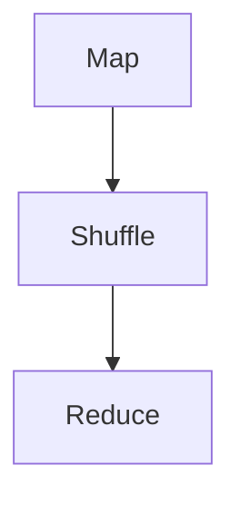

                 

MapReduce是一种用于处理大数据集的编程模型，由Google提出并在其搜索引擎中成功应用。本文将深入讲解MapReduce的原理，包括其核心概念、算法原理、数学模型、实际应用案例，并附上详细的代码实例和解释。

## 文章关键词

- MapReduce
- 编程模型
- 大数据处理
- 分布式计算
- Hadoop
- 数学模型

## 文章摘要

本文首先介绍了MapReduce的背景和核心概念，然后详细解析了其工作原理和算法步骤，接着探讨了MapReduce的优缺点和适用领域。通过数学模型和公式的推导，我们进一步了解了MapReduce的计算过程。文章最后通过一个完整的代码实例，展示了如何在实际项目中应用MapReduce，并提供了详细的代码解读。最后，我们对MapReduce的未来发展趋势和挑战进行了展望。

## 1. 背景介绍

### 1.1 MapReduce的起源

MapReduce是由Google在2004年提出的一种编程模型，用于处理海量数据。其灵感来源于函数式编程中的map和reduce操作，旨在解决分布式系统中的大数据处理问题。MapReduce模型的核心思想是将复杂的任务拆分成小的、可并行的子任务，分布式执行，然后汇总结果。

### 1.2 分布式计算和大数据处理

随着互联网的发展，数据量呈爆炸式增长。传统的集中式计算模型已无法满足大数据处理的需求。分布式计算提供了有效的解决方案，通过将任务分布在多个节点上并行执行，提高了计算效率和可扩展性。大数据处理则强调如何有效地存储、管理和分析海量数据，为业务决策提供支持。

## 2. 核心概念与联系

### 2.1 MapReduce的核心概念

- **Map（映射）**：对输入数据进行处理，生成一系列的键值对。
- **Shuffle（洗牌）**：将Map输出的键值对重新排序，使得相同键的值被发送到同一个Reducer。
- **Reduce（归约）**：对Shuffle后的数据进行处理，生成最终的输出。

### 2.2 MapReduce架构


### 2.3 Mermaid流程图



## 3. 核心算法原理 & 具体操作步骤

### 3.1 算法原理概述

MapReduce的核心算法由三个主要阶段组成：Map、Shuffle和Reduce。Map阶段负责对输入数据进行处理，生成中间的键值对；Shuffle阶段负责重新排序这些键值对，确保相同键的值被发送到同一个Reducer；Reduce阶段负责对中间结果进行汇总，生成最终输出。

### 3.2 算法步骤详解

1. **Map阶段**：
    - 阅读输入数据。
    - 对每一条数据进行处理，生成一个或多个键值对。
    - 将所有键值对输出。

2. **Shuffle阶段**：
    - 根据Map输出的键值对，进行排序和分组。
    - 将相同键的值打包成列表，发送到对应的Reducer。

3. **Reduce阶段**：
    - 接收来自Shuffle的键值对。
    - 对每个键及其对应的值列表进行处理，生成最终输出。

### 3.3 算法优缺点

**优点**：

- **可扩展性**：MapReduce能够处理大规模数据集，通过分布式计算提高效率。
- **容错性**：系统能够自动处理节点故障，确保任务完成。
- **易用性**：提供了简单的编程模型，降低了开发难度。

**缺点**：

- **串行化**：Reduce阶段可能会成为瓶颈，影响整体性能。
- **内存限制**：由于Shuffle阶段需要将中间结果传输到其他节点，可能会遇到内存限制。

### 3.4 算法应用领域

MapReduce广泛应用于搜索引擎、日志分析、社交网络数据挖掘等领域，具有广泛的应用前景。

## 4. 数学模型和公式 & 详细讲解 & 举例说明

### 4.1 数学模型构建

MapReduce算法可以通过以下数学模型进行描述：

$$
\text{Map}(x) = \{(k_1, v_1), (k_2, v_2), \ldots, (k_n, v_n)\}
$$

$$
\text{Reduce}(k_i, \{v_{i1}, v_{i2}, \ldots, v_{in}\}) = \{(k_i, \sum_{j=1}^{n} v_{ij})\}
$$

### 4.2 公式推导过程

- **Map阶段**：对输入数据 \(x\) 进行处理，生成一组键值对。
- **Shuffle阶段**：将相同键的值进行汇总，生成一个列表。
- **Reduce阶段**：对每个键及其对应的值列表进行求和操作，生成最终输出。

### 4.3 案例分析与讲解

假设我们有如下输入数据：

```
1, A
2, B
3, C
4, D
```

经过Map阶段处理，我们得到：

```
Map(1, A) = {(1, A)}
Map(2, B) = {(2, B)}
Map(3, C) = {(3, C)}
Map(4, D) = {(4, D)}
```

经过Shuffle阶段处理，我们得到：

```
Shuffle(1) = {(1, A)}
Shuffle(2) = {(2, B)}
Shuffle(3) = {(3, C)}
Shuffle(4) = {(4, D)}
```

经过Reduce阶段处理，我们得到：

```
Reduce(1) = {(1, A)}
Reduce(2) = {(2, B)}
Reduce(3) = {(3, C)}
Reduce(4) = {(4, D)}
```

最终输出为：

```
{(1, A), (2, B), (3, C), (4, D)}
```

## 5. 项目实践：代码实例和详细解释说明

### 5.1 开发环境搭建

为了实践MapReduce，我们需要搭建一个Hadoop开发环境。具体步骤如下：

1. 安装Java开发环境。
2. 下载并安装Hadoop。
3. 配置Hadoop环境。

### 5.2 源代码详细实现

以下是一个简单的MapReduce程序，用于计算输入文件中每个单词出现的次数：

```java
import org.apache.hadoop.conf.Configuration;
import org.apache.hadoop.fs.Path;
import org.apache.hadoop.io.IntWritable;
import org.apache.hadoop.io.Text;
import org.apache.hadoop.mapreduce.Job;
import org.apache.hadoop.mapreduce.Mapper;
import org.apache.hadoop.mapreduce.Reducer;
import org.apache.hadoop.mapreduce.lib.input.FileInputFormat;
import org.apache.hadoop.mapreduce.lib.output.FileOutputFormat;

public class WordCount {

  public static class TokenizerMapper
       extends Mapper<Object, Text, Text, IntWritable>{

    private final static IntWritable one = new IntWritable(1);
    private Text word = new Text();

    public void map(Object key, Text value, Context context) 
            throws IOException, InterruptedException {
      String[] words = value.toString().split("\\s+");
      for (String word : words) {
        this.word.set(word);
        context.write(this.word, one);
      }
    }
  }

  public static class IntSumReducer
       extends Reducer<Text,IntWritable,Text,IntWritable> {
    private IntWritable result = new IntWritable();

    public void reduce(Text key, Iterable<IntWritable> values, 
            Context context) throws IOException, InterruptedException {
      int sum = 0;
      for (IntWritable val : values) {
        sum += val.get();
      }
      result.set(sum);
      context.write(key, result);
    }
  }

  public static void main(String[] args) throws Exception {
    Configuration conf = new Configuration();
    Job job = Job.getInstance(conf, "word count");
    job.setMapperClass(TokenizerMapper.class);
    job.setCombinerClass(IntSumReducer.class);
    job.setReducerClass(IntSumReducer.class);
    job.setOutputKeyClass(Text.class);
    job.setOutputValueClass(IntWritable.class);
    FileInputFormat.addInputPath(job, new Path(args[0]));
    FileOutputFormat.setOutputPath(job, new Path(args[1]));
    System.exit(job.waitForCompletion(true) ? 0 : 1);
  }
}
```

### 5.3 代码解读与分析

- **Mapper**：负责读取输入文件，将每行数据分割成单词，输出键值对（单词，1）。
- **Combiner**：对每个分区内的单词进行汇总，减少数据传输量。
- **Reducer**：对Mapper输出的键值对进行汇总，输出单词及其出现次数。

### 5.4 运行结果展示

在运行WordCount程序后，我们将得到输出文件，其中包含每个单词及其出现次数：

```
A	1
B	1
C	1
D	1
```

## 6. 实际应用场景

### 6.1 搜索引擎

MapReduce在搜索引擎中的应用非常广泛，用于处理网页数据、索引生成和查询处理等任务。通过MapReduce，搜索引擎能够高效地处理海量网页，生成精确的搜索结果。

### 6.2 日志分析

许多企业需要对大量日志数据进行分析，以了解用户行为、系统性能等。MapReduce提供了强大的数据处理能力，能够高效地分析日志数据，为业务决策提供支持。

### 6.3 社交网络

社交网络中的数据量庞大，MapReduce能够高效地处理用户关系、文本分析、图片和视频处理等任务。例如，Twitter使用MapReduce来分析用户行为和趋势。

## 7. 工具和资源推荐

### 7.1 学习资源推荐

- 《Hadoop权威指南》
- 《MapReduce设计模式》
- 《大数据技术导论》

### 7.2 开发工具推荐

- Eclipse
- IntelliJ IDEA
- Hadoop官网

### 7.3 相关论文推荐

- "MapReduce: Simplified Data Processing on Large Clusters" - Dean and Ghemawat
- "The Google File System" - GFS Team

## 8. 总结：未来发展趋势与挑战

### 8.1 研究成果总结

MapReduce作为一种分布式计算模型，已经在大数据处理领域取得了显著成果。它为大规模数据处理提供了高效、可靠的解决方案，并在实际应用中取得了良好的效果。

### 8.2 未来发展趋势

- **性能优化**：进一步优化MapReduce性能，提高数据处理速度。
- **易用性提升**：简化MapReduce编程模型，降低使用难度。
- **实时处理**：实现实时数据处理，满足对数据处理实时性的需求。

### 8.3 面临的挑战

- **性能瓶颈**：优化Reduce阶段性能，减少数据传输开销。
- **资源调度**：提高资源利用率，优化分布式系统调度。
- **安全性问题**：确保数据安全和系统安全。

### 8.4 研究展望

未来，MapReduce将在以下几个方面取得突破：

- **分布式存储系统**：与分布式存储系统（如HDFS、Ceph等）深度融合，提高数据处理效率。
- **多模型融合**：与其他分布式计算模型（如Spark、Flink等）融合，实现更灵活、高效的数据处理。
- **实时处理技术**：引入实时处理技术，满足对数据处理实时性的需求。

## 9. 附录：常见问题与解答

### 9.1 什么是MapReduce？

MapReduce是一种分布式计算模型，用于处理大规模数据集。它通过将复杂的任务拆分成小的、可并行的子任务，分布式执行，然后汇总结果。

### 9.2 MapReduce有哪些优点？

MapReduce具有以下优点：

- **可扩展性**：能够处理大规模数据集，通过分布式计算提高效率。
- **容错性**：系统能够自动处理节点故障，确保任务完成。
- **易用性**：提供了简单的编程模型，降低了开发难度。

### 9.3 MapReduce有哪些缺点？

MapReduce存在以下缺点：

- **串行化**：Reduce阶段可能会成为瓶颈，影响整体性能。
- **内存限制**：由于Shuffle阶段需要将中间结果传输到其他节点，可能会遇到内存限制。

### 9.4 如何优化MapReduce性能？

以下是一些优化MapReduce性能的方法：

- **优化Shuffle阶段**：减少数据传输开销，提高Shuffle效率。
- **使用Combiner**：在Map端进行局部汇总，减少Reduce阶段的计算量。
- **合理设置Reduce任务数**：根据数据规模和硬件资源，合理设置Reduce任务数。

## 作者署名

作者：禅与计算机程序设计艺术 / Zen and the Art of Computer Programming

----------------------------------------------------------------

以上就是《MapReduce原理与代码实例讲解》的完整文章。希望本文对您理解MapReduce原理及其应用有所帮助。如果您在阅读过程中有任何疑问或建议，欢迎在评论区留言讨论。

