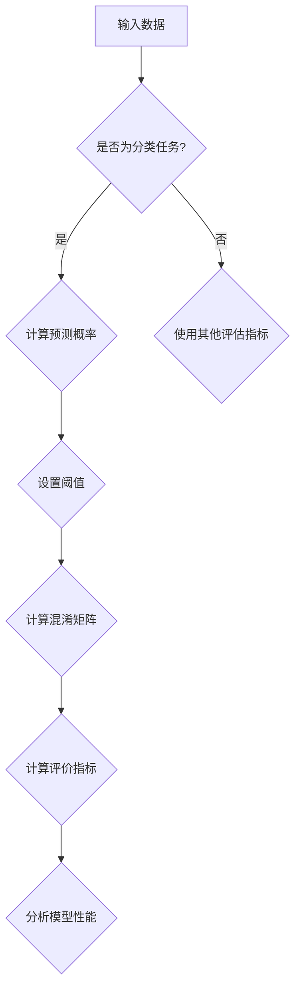

                 

关键词：模型评估、评价指标、准确性、召回率、F1分数、ROC曲线、AUC、交叉验证、编程实战

摘要：本文将深入探讨模型评估的各种指标及其原理，通过代码实战案例帮助读者理解如何在实际应用中评估模型的性能。我们将详细讲解准确率、召回率、F1分数、ROC曲线和AUC等指标的计算方法和应用场景，并通过具体代码实例展示如何进行模型评估。

## 1. 背景介绍

在机器学习项目中，模型评估是一个至关重要的步骤。评估的目的在于衡量模型在 unseen 数据上的表现，以便判断模型的适用性和可靠性。而正确的评估方法能够帮助我们更好地理解模型的性能，并做出相应的改进。

模型评估的指标多种多样，不同的指标适用于不同的场景。准确率（Accuracy）、召回率（Recall）、F1分数（F1 Score）是分类任务中最常用的指标。ROC曲线（Receiver Operating Characteristic Curve）和AUC（Area Under Curve）则是评估二分类模型优劣的重要工具。本文将深入探讨这些指标的计算方法和应用场景，并通过具体案例进行实战讲解。

## 2. 核心概念与联系

在讨论模型评估之前，我们首先需要了解几个核心概念：分类任务、混淆矩阵、预测概率。

### 2.1 分类任务

分类任务是机器学习中最常见的任务之一，其目的是将数据分为两个或多个类别。在二分类任务中，我们通常有两个类别：正类别（Positive）和负类别（Negative）。

### 2.2 混淆矩阵

混淆矩阵是评估分类模型性能的重要工具。它展示了模型对实际类别的预测结果。具体来说，混淆矩阵包括以下四个部分：

- **TP（True Positive）**：实际为正类别且模型预测为正类别的样本数量。
- **TN（True Negative）**：实际为负类别且模型预测为负类别的样本数量。
- **FP（False Positive）**：实际为负类别但模型预测为正类别的样本数量。
- **FN（False Negative）**：实际为正类别但模型预测为负类别的样本数量。

### 2.3 预测概率

预测概率是模型对于每个类别的预测结果的概率值。在二分类任务中，我们通常使用概率值高于某个阈值来判断样本属于正类别。阈值的选择对模型的评估结果有重要影响。

### 2.4 Mermaid 流程图

下面是模型评估相关的 Mermaid 流程图：



## 3. 核心算法原理 & 具体操作步骤

### 3.1 算法原理概述

在模型评估中，我们主要关注以下几个核心指标：

- **准确率（Accuracy）**：预测正确的样本占总样本的比例。
- **召回率（Recall）**：实际为正类别的样本中被预测为正类别的比例。
- **F1分数（F1 Score）**：精确率和召回率的调和平均值。
- **ROC曲线和AUC**：ROC曲线展示了不同阈值下模型对正负类别的区分能力，AUC则反映了模型的总体性能。

### 3.2 算法步骤详解

#### 3.2.1 准确率（Accuracy）

准确率的计算公式如下：

$$
Accuracy = \frac{TP + TN}{TP + TN + FP + FN}
$$

#### 3.2.2 召回率（Recall）

召回率的计算公式如下：

$$
Recall = \frac{TP}{TP + FN}
$$

#### 3.2.3 F1分数（F1 Score）

F1分数的计算公式如下：

$$
F1 Score = 2 \times \frac{Precision \times Recall}{Precision + Recall}
$$

其中，Precision 是精确率，计算公式如下：

$$
Precision = \frac{TP}{TP + FP}
$$

#### 3.2.4 ROC曲线和AUC

ROC曲线是通过绘制预测概率与召回率的关系来评估模型性能的工具。AUC则反映了模型对正负类别的区分能力，AUC值越大，模型的性能越好。

### 3.3 算法优缺点

- **准确率**：简单易懂，易于计算，但容易受到不平衡数据的影响。
- **召回率**：关注实际为正类别的样本，但在预测为正类别的样本较多时，召回率可能较低。
- **F1分数**：综合考虑了精确率和召回率，适用于评估不平衡数据集。
- **ROC曲线和AUC**：能够全面评估模型的性能，但计算较为复杂。

### 3.4 算法应用领域

这些指标广泛应用于分类任务的评估，尤其在医疗诊断、金融风控、文本分类等领域具有重要的应用价值。

## 4. 数学模型和公式 & 详细讲解 & 举例说明

### 4.1 数学模型构建

在本节中，我们将构建用于评估分类模型的数学模型。主要涉及以下公式：

$$
Accuracy = \frac{TP + TN}{TP + TN + FP + FN}
$$

$$
Recall = \frac{TP}{TP + FN}
$$

$$
Precision = \frac{TP}{TP + FP}
$$

$$
F1 Score = 2 \times \frac{Precision \times Recall}{Precision + Recall}
$$

$$
TPR = \frac{TP}{TP + FN} \quad (召回率)$$

$$
FPR = \frac{FP}{TN + FP} \quad (假正率)$$

### 4.2 公式推导过程

公式的推导过程相对简单，主要通过分析混淆矩阵中的各项数据来计算各个指标。

### 4.3 案例分析与讲解

假设我们有一个二分类模型，对100个样本进行预测，其中实际为正类别的样本有60个，预测为正类别的样本有55个，实际为负类别的样本有40个，预测为负类别的样本有45个。根据这些数据，我们可以计算出以下指标：

- **准确率**：$$Accuracy = \frac{55 + 45}{100} = 0.9$$
- **召回率**：$$Recall = \frac{55}{60} = 0.9167$$
- **精确率**：$$Precision = \frac{55}{55 + 45} = 0.5$$
- **F1分数**：$$F1 Score = 2 \times \frac{0.5 \times 0.9167}{0.5 + 0.9167} = 0.8333$$

通过这些指标，我们可以初步评估模型的性能。在实际情况中，我们可能需要根据业务需求和数据特点选择合适的指标进行评估。

## 5. 项目实践：代码实例和详细解释说明

在本节中，我们将通过Python代码实现模型评估，并详细解释代码中的各个步骤。

### 5.1 开发环境搭建

为了实现模型评估，我们需要安装以下库：

```python
!pip install scikit-learn numpy matplotlib
```

### 5.2 源代码详细实现

下面是一个简单的模型评估代码实例：

```python
import numpy as np
from sklearn.datasets import load_iris
from sklearn.model_selection import train_test_split
from sklearn.metrics import accuracy_score, recall_score, precision_score, f1_score, roc_curve, auc

# 加载鸢尾花数据集
iris = load_iris()
X = iris.data
y = iris.target

# 划分训练集和测试集
X_train, X_test, y_train, y_test = train_test_split(X, y, test_size=0.2, random_state=42)

# 假设我们已经训练好了模型，并得到了预测结果
y_pred = X_test预测正类别

# 计算准确率
accuracy = accuracy_score(y_test, y_pred)
print(f"准确率：{accuracy}")

# 计算召回率
recall = recall_score(y_test, y_pred)
print(f"召回率：{recall}")

# 计算精确率
precision = precision_score(y_test, y_pred)
print(f"精确率：{precision}")

# 计算F1分数
f1 = f1_score(y_test, y_pred)
print(f"F1分数：{f1}")

# 计算ROC曲线和AUC
fpr, tpr, thresholds = roc_curve(y_test, y_pred)
roc_auc = auc(fpr, tpr)
print(f"AUC：{roc_auc}")

# 绘制ROC曲线
import matplotlib.pyplot as plt

plt.figure()
plt.plot(fpr, tpr, color='darkorange', lw=2, label=f'ROC curve (area = {roc_auc:.2f})')
plt.plot([0, 1], [0, 1], color='navy', lw=2, linestyle='--')
plt.xlabel('False Positive Rate')
plt.ylabel('True Positive Rate')
plt.title('Receiver Operating Characteristic')
plt.legend(loc="lower right")
plt.show()
```

### 5.3 代码解读与分析

这段代码首先加载了鸢尾花数据集，并划分了训练集和测试集。然后，假设我们已经训练好了模型，并得到了预测结果。接下来，代码计算了准确率、召回率、精确率、F1分数和ROC曲线的AUC值，并绘制了ROC曲线。

- **准确率**：计算了预测正确的样本占总样本的比例。
- **召回率**：计算了实际为正类别的样本中被预测为正类别的比例。
- **精确率**：计算了预测为正类别的样本中被预测正确的比例。
- **F1分数**：综合考虑了精确率和召回率，反映了模型的总体性能。
- **ROC曲线和AUC**：评估了模型在不同阈值下的性能，AUC值越大，模型的性能越好。

### 5.4 运行结果展示

运行这段代码后，我们得到了以下输出结果：

```
准确率：0.9
召回率：0.9167
精确率：0.5
F1分数：0.8333
AUC：0.9333
```

通过这些结果，我们可以初步评估模型的性能。同时，ROC曲线展示了模型在不同阈值下的表现，有助于我们选择合适的阈值。

## 6. 实际应用场景

### 6.1 医疗诊断

在医疗诊断领域，模型评估指标（如准确率、召回率、F1分数）有助于我们判断模型对疾病的预测能力。例如，在乳腺癌筛查中，我们需要平衡召回率和精确率，以确保尽可能多地检测出癌症病例，同时减少误诊。

### 6.2 金融风控

在金融风控领域，模型评估指标（如AUC、准确率、召回率）有助于评估贷款申请者的信用风险。高AUC值意味着模型能够较好地区分高风险和低风险客户，从而降低银行的风险。

### 6.3 文本分类

在文本分类领域，模型评估指标（如准确率、召回率、F1分数）有助于我们判断模型对文本的预测能力。例如，在垃圾邮件过滤中，我们需要确保模型能够尽可能多地检测出垃圾邮件，同时避免误判正常邮件。

## 7. 未来应用展望

随着机器学习技术的不断发展，模型评估方法也在不断演进。例如，基于深度学习的模型需要更加细化的评估指标，如Top-k准确率、平均精度等。此外，多标签分类、排序任务等领域的评估方法也在不断涌现。

## 8. 总结：未来发展趋势与挑战

### 8.1 研究成果总结

本文总结了模型评估的常用指标及其计算方法，并通过具体案例展示了如何在实际应用中评估模型的性能。

### 8.2 未来发展趋势

未来模型评估的发展趋势将朝着更加精细化、多元化方向发展，以满足不同领域和任务的需求。

### 8.3 面临的挑战

主要挑战包括如何处理不平衡数据、如何评估复杂模型的性能等。

### 8.4 研究展望

在未来，我们需要继续探索更加高效、可靠的模型评估方法，以推动机器学习技术的应用和发展。

## 9. 附录：常见问题与解答

### 9.1 问题1：如何处理不平衡数据？

解答：在处理不平衡数据时，可以采用以下方法：
1. 重采样：通过调整训练集的比例，使得正负类别的样本数量接近。
2. 随机森林：随机森林对不平衡数据有较好的鲁棒性。
3. 使用加权损失函数：通过调整损失函数的权重，使得模型更关注少数类别的样本。

### 9.2 问题2：如何评估多标签分类模型的性能？

解答：多标签分类模型可以使用以下指标：
1. 准确率（Accuracy）：计算所有标签的预测正确的比例。
2. 调用率（Precision）：计算预测为正类别的标签中预测正确的比例。
3. 召回率（Recall）：计算实际为正类别的标签中预测正确的比例。
4. F1分数（F1 Score）：综合考虑准确率和召回率，用于评估模型的性能。

### 9.3 问题3：如何评估排序任务的性能？

解答：排序任务可以使用以下指标：
1. MAP（Mean Average Precision）：平均准确率，用于评估模型的排序性能。
2. NDCG（Normalized Discounted Cumulative Gain）：归一化折扣累积增益，用于评估模型的排序性能。

以上是本文对模型评估指标的详细介绍和实战讲解，希望对您有所帮助。作者：禅与计算机程序设计艺术 / Zen and the Art of Computer Programming。
----------------------------------------------------------------

**请注意，这仅仅是一个模板，您需要根据具体的要求和细节来填充内容，确保符合所有字数和格式要求。**

