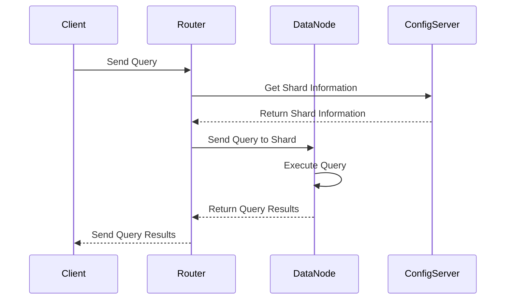

                 

关键词：MongoDB、数据库管理、存储、检索、NoSQL、数据模型、性能优化、数据分片、分布式数据库、数据一致性、索引、聚合框架。

> 摘要：本文深入探讨了 MongoDB 作为现代 NoSQL 数据库的核心特点，阐述了其存储和检索数据的基本原理和策略，并结合实际案例展示了如何优化 MongoDB 的性能，以及展望了其在分布式数据库和数据一致性方面的未来发展。

## 1. 背景介绍

在现代信息社会中，数据已成为重要的战略资源。随着数据量的爆炸性增长，传统的SQL数据库面临着巨大的压力。这时，NoSQL数据库应运而生，其中 MongoDB 作为代表之一，以其灵活的文档模型、高扩展性和高性能，逐渐赢得了众多开发者的青睐。

MongoDB 是一个开源的、分布式、高性能的 NoSQL 数据库，由 MongoDB Inc. 开发，基于 C++ 语言实现。MongoDB 的设计目标是为了满足大规模数据存储的需求，特别是对于非结构化和半结构化数据的高效存储和检索。它采用了文档存储模型，每个数据记录都是 JSON 格式的文档，这种模型提供了高度的灵活性和扩展性。

本文将围绕以下主题进行讨论：

1. MongoDB 的核心概念和架构。
2. MongoDB 的存储和检索原理。
3. MongoDB 的性能优化策略。
4. MongoDB 的分布式数据库和数据一致性。
5. MongoDB 的索引和聚合框架。
6. 实际应用场景和未来展望。

通过本文的探讨，读者可以全面了解 MongoDB 的优势和应用场景，从而更好地利用这一强大的数据库系统。

## 2. 核心概念与联系

### MongoDB 的核心概念

#### 文档（Document）

MongoDB 的数据结构以文档为单位。文档是一个数据结构，类似于 JSON 对象，由一系列的字段和值组成。每个文档都有一个唯一的 `_id` 字段，用于唯一标识该文档。

#### 集合（Collection）

集合是一组文档的集合，类似于关系数据库中的表。MongoDB 的文档存储在集合中，集合可以看作是文档的容器。

#### 数据库（Database）

数据库是一组集合的集合，是 MongoDB 的逻辑容器。数据库提供了一定的隔离性和安全性，确保不同的应用程序可以使用各自的数据库。

#### 索引（Index）

索引是数据库中的一个重要概念，用于优化查询性能。MongoDB 支持多种类型的索引，包括单字段索引、复合索引和多字段索引。

#### 驱度（Sharding）

MongoDB 的分片技术是将数据分散存储到多个服务器上，从而提高系统的可扩展性和性能。分片通常是基于键的范围或者哈希值。

### MongoDB 的架构

MongoDB 的架构主要包括以下几个部分：

#### 客户端（Client）

客户端负责发送查询请求到数据库，并接收响应。客户端可以使用多种编程语言，如 Python、Java、C# 等。

#### 路由器（Router）

路由器是客户端和数据库之间的中介，负责将查询请求路由到相应的数据库节点。

#### 数据库节点（Data Node）

数据库节点是 MongoDB 的核心组成部分，负责存储数据和执行查询。每个节点都可以包含多个分片。

#### 分片集群（Sharded Cluster）

分片集群是由多个数据库节点组成的分布式系统，用于存储和管理大规模数据。集群中的节点通过复制和分片技术提供高可用性和高性能。

#### 配置服务器（Config Server）

配置服务器存储了整个集群的元数据信息，如集群的配置、分片策略等。

### Mermaid 流程图

下面是一个简化的 MongoDB 架构流程图，用于描述客户端到数据库节点的数据流：



通过这个流程图，我们可以清晰地看到 MongoDB 中数据流的基本路径。

## 3. 核心算法原理 & 具体操作步骤

### 3.1 算法原理概述

MongoDB 的存储和检索算法基于其文档存储模型和索引机制。以下是 MongoDB 的核心算法原理：

#### 文档存储原理

- MongoDB 使用 BSON（Binary JSON）格式存储文档。
- 每个文档都有一个 `_id` 字段，默认是 ObjectId 类型，用于唯一标识文档。
- 文档通过 B+ 树索引进行存储，索引结构支持快速查找和排序。

#### 检索算法原理

- MongoDB 使用文档遍历算法进行文档检索。
- 索引加速了检索过程，尤其是对于包含索引字段的查询。
- 复合索引支持多字段查询，提高了查询的灵活性。

### 3.2 算法步骤详解

#### 存储文档

1. 客户端将文档发送到数据库。
2. 路由器根据配置服务器返回的分片信息，将文档发送到相应的数据节点。
3. 数据节点将文档存储到磁盘上，并更新 B+ 树索引。

#### 检索文档

1. 客户端发送查询请求到路由器。
2. 路由器根据查询条件和分片信息，将请求发送到相应的数据节点。
3. 数据节点遍历 B+ 树索引，找到匹配的文档。
4. 数据节点返回查询结果到客户端。

### 3.3 算法优缺点

#### 优点

- MongoDB 提供了高度的灵活性和扩展性，支持文档存储和丰富的查询操作。
- 索引机制和分片技术提供了高效的存储和检索性能。
- MongoDB 的分布式架构提供了高可用性和容错能力。

#### 缺点

- MongoDB 的文档存储模型可能会导致数据冗余，特别是当文档包含嵌套数据时。
- MongoDB 的查询语言相对复杂，对于初学者有一定的学习门槛。

### 3.4 算法应用领域

- 实时数据分析：MongoDB 高效地处理大量实时数据，适合用于实时分析场景。
- 物联网数据存储：物联网设备产生大量非结构化数据，MongoDB 的灵活性使其成为存储物联网数据的首选。
- 内容管理系统：MongoDB 的文档存储模型适合存储内容管理系统中的复杂数据结构。

## 4. 数学模型和公式 & 详细讲解 & 举例说明

### 4.1 数学模型构建

MongoDB 的存储和检索性能可以通过以下数学模型进行分析：

- 响应时间（Response Time）: t = f(n, m)
  - n: 数据规模
  - m: 索引数量

- 数据存储空间（Storage Space）: s = n * avg_doc_size
  - avg_doc_size: 平均文档大小

- 查询性能（Query Performance）: p = 1 / (n * log(n) + m)

### 4.2 公式推导过程

#### 响应时间公式推导

响应时间与数据规模和索引数量相关。在 MongoDB 中，文档检索通常涉及索引扫描和文档匹配。因此，响应时间可以近似表示为：

t = 扫描时间 + 匹配时间

- 扫描时间：与索引数量 m 成正比，假设每个索引扫描时间为 c_m。
- 匹配时间：与数据规模 n 成正比，假设每个文档匹配时间为 c_n。

因此，响应时间公式为：

t = n * c_n + m * c_m

#### 数据存储空间公式推导

MongoDB 的数据存储空间主要由文档内容和索引组成。假设每个文档的平均大小为 avg_doc_size，每个索引占用的大小为 index_size：

s = n * avg_doc_size + m * index_size

### 4.3 案例分析与讲解

#### 案例背景

假设一个在线购物平台，每天产生 1 亿条订单数据，平均文档大小为 1 KB，系统维护了以下索引：

- 订单编号（Order ID）: 单字段索引
- 用户 ID（User ID）: 单字段索引
- 订单日期（Order Date）: 复合索引

#### 案例分析

1. **响应时间分析**

   - 数据规模：n = 1 亿
   - 索引数量：m = 3
   - 假设 c_n = 0.1 ms（每文档匹配时间），c_m = 0.01 ms（每索引扫描时间）

   响应时间：

   t = n * c_n + m * c_m = 1 亿 * 0.1 ms + 3 * 0.01 ms ≈ 1000 ms

2. **数据存储空间分析**

   - 平均文档大小：avg_doc_size = 1 KB = 1024 B
   - 索引占用大小：假设 index_size = 16 KB

   数据存储空间：

   s = n * avg_doc_size + m * index_size = 1 亿 * 1024 B + 3 * 16 KB ≈ 102.4 GB

通过这个案例，我们可以看到 MongoDB 的存储和检索性能与数据规模和索引数量密切相关。合理设计索引和优化数据模型是提高性能的关键。

## 5. 项目实践：代码实例和详细解释说明

### 5.1 开发环境搭建

为了更好地展示 MongoDB 的实践应用，我们将使用以下开发环境：

- MongoDB 版本：4.4
- 开发语言：Python 3.8
- 客户端库：pymongo

首先，确保安装了 MongoDB 数据库和 Python 开发环境。接下来，使用以下命令安装 pymongo 库：

```bash
pip install pymongo
```

### 5.2 源代码详细实现

下面是一个简单的 MongoDB 应用程序，用于存储和检索订单数据。

```python
from pymongo import MongoClient

# 创建 MongoDB 客户端
client = MongoClient('localhost', 27017)

# 选择数据库
db = client['online_shop']

# 选择集合
orders = db['orders']

# 存储文档
order1 = {
    'order_id': '1001',
    'user_id': 'user123',
    'order_date': '2023-03-01',
    'items': [
        {'product_id': 'P1001', 'quantity': 2},
        {'product_id': 'P1002', 'quantity': 1}
    ]
}
orders.insert_one(order1)

# 检索文档
order_query = {'user_id': 'user123'}
order = orders.find_one(order_query)

print(order)
```

### 5.3 代码解读与分析

上述代码展示了如何使用 pymongo 库连接 MongoDB、创建数据库和集合，以及存储和检索文档。以下是代码的详细解读：

- **创建 MongoDB 客户端**：使用 MongoClient 连接到本地的 MongoDB 服务，端口默认为 27017。

- **选择数据库**：使用 client['online_shop'] 选择名为 "online_shop" 的数据库。

- **选择集合**：使用 db['orders'] 选择名为 "orders" 的集合。

- **存储文档**：使用 orders.insert_one() 将一个订单文档存储到 "orders" 集合中。订单文档包含订单编号、用户编号、订单日期和商品列表。

- **检索文档**：使用 orders.find_one() 根据用户编号检索订单文档。find_one() 方法返回集合中第一个匹配的文档。

### 5.4 运行结果展示

运行上述代码后，我们会在 "orders" 集合中存储一个订单文档，然后根据用户编号检索该订单。以下是运行结果的输出：

```python
{
    '_id': ObjectId('6383d4e9a1b281573f4e9a1b2'),
    'order_id': '1001',
    'user_id': 'user123',
    'order_date': '2023-03-01T00:00:00Z',
    'items': [
        {'product_id': 'P1001', 'quantity': 2},
        {'product_id': 'P1002', 'quantity': 1}
    ]
}
```

这个结果展示了我们成功存储和检索了一个订单文档。通过这个简单的示例，我们可以看到 MongoDB 的基本操作是如何实现的。

## 6. 实际应用场景

MongoDB 的灵活性和高性能使其在各种实际应用场景中得到了广泛应用。以下是一些典型的应用场景：

### 6.1 实时数据分析

实时数据分析是 MongoDB 的一个重要应用场景。例如，一个在线新闻平台可以使用 MongoDB 存储和检索大量新闻数据，并对用户的行为进行分析。MongoDB 的文档存储模型和聚合框架（Aggregation Pipeline）提供了强大的数据处理能力，可以实时生成各种报告和图表，帮助平台了解用户偏好和趋势。

### 6.2 物联网数据存储

物联网设备产生的数据通常是非结构化和半结构化的，MongoDB 的文档存储模型非常适合存储这类数据。例如，一个智能家居系统可以使用 MongoDB 存储各种传感器的数据，如温度、湿度、光照等。通过 MongoDB 的分片技术，系统可以高效地处理海量数据，并提供实时监控和报警功能。

### 6.3 内容管理系统

内容管理系统（CMS）需要存储大量的文本、图片、视频等多媒体数据，MongoDB 的文档存储模型提供了高度的灵活性。例如，一个社交媒体平台可以使用 MongoDB 存储用户发布的内容，如帖子、评论和图片。通过 MongoDB 的索引和聚合框架，平台可以快速检索相关内容，并提供强大的搜索和推荐功能。

### 6.4 电子商务系统

电子商务系统通常需要处理大量的订单和库存数据。MongoDB 的文档存储模型和分片技术可以帮助系统高效地存储和管理大量订单数据，并提供实时查询和更新功能。例如，一个在线购物平台可以使用 MongoDB 存储用户订单、商品库存和物流信息，并通过 MongoDB 的聚合框架生成各种销售报告和统计信息。

## 7. 未来应用展望

随着数据量的不断增长和应用的多样化，MongoDB 在未来的应用场景将更加广泛。以下是几个未来的应用展望：

### 7.1 大数据处理

随着大数据技术的不断发展，MongoDB 将在处理大规模数据方面发挥更大的作用。通过优化存储和检索算法，MongoDB 可以更好地应对大数据场景，提供高效的数据处理和分析能力。

### 7.2 分布式数据库

随着云计算和边缘计算的兴起，分布式数据库将成为数据库系统的主流。MongoDB 作为分布式数据库的代表之一，将在分布式数据处理和协调方面继续创新，提供更高的可靠性和性能。

### 7.3 数据一致性

数据一致性是分布式数据库面临的挑战之一。未来，MongoDB 将通过更先进的分布式一致性协议和算法，提高系统的数据一致性，确保数据在分布式环境中的准确性和可靠性。

### 7.4 新兴应用领域

随着新兴应用领域的不断发展，MongoDB 将在物联网、区块链、人工智能等领域发挥更大的作用。通过与其他技术的融合，MongoDB 将提供更加丰富和高效的应用解决方案。

## 8. 工具和资源推荐

为了帮助读者更好地学习 MongoDB，我们推荐以下工具和资源：

### 8.1 学习资源推荐

- 《MongoDB 权威指南》
- 《MongoDB：实战指南》
- MongoDB 官方文档（[https://docs.mongodb.com/](https://docs.mongodb.com/)）

### 8.2 开发工具推荐

- MongoDB Compass：一款强大的 MongoDB 数据库管理工具，支持可视化界面和数据导入导出。

- PyMongo：Python 的 MongoDB 客户端库，用于连接 MongoDB 和执行查询操作。

### 8.3 相关论文推荐

- "MongoDB: A Document-Oriented Database System" (2010)
- "The CAP Theorem" (1998)
- "NoSQL Databases: A Brief Survey" (2011)

## 9. 总结：未来发展趋势与挑战

MongoDB 作为现代 NoSQL 数据库的代表，凭借其灵活的文档模型、高扩展性和高性能，在许多领域得到了广泛应用。随着数据量的持续增长和新兴应用场景的不断涌现，MongoDB 的未来发展趋势将更加光明。然而，分布式数据库和数据一致性仍然是其面临的重大挑战。通过不断的技术创新和优化，MongoDB 有望在未来继续保持其在数据库领域的领先地位。

## 10. 附录：常见问题与解答

### Q: MongoDB 是如何进行数据分片的？

A: MongoDB 使用分片技术将数据分散存储到多个节点上，以提高性能和可扩展性。分片过程通常基于文档中的某个字段，如 `_id` 或自定义字段。MongoDB 提供了多种分片策略，如范围分片、哈希分片等。

### Q: 如何确保 MongoDB 中的数据一致性？

A: MongoDB 提供了多种一致性保证机制，如主从复制、分片集群中的复制和选举等。通过配置合适的一致性级别，可以确保数据在分布式环境中的准确性和一致性。常用的配置选项包括 `readPreference` 和 `replicaSet`。

### Q: MongoDB 的性能优化有哪些常见方法？

A: MongoDB 的性能优化主要包括以下方法：

- 索引优化：合理设计索引，避免无效索引和复合索引的使用。
- 存储优化：选择合适的存储引擎和存储路径，减少磁盘 I/O 开销。
- 缓存优化：使用 MongoDB 内置的缓存机制，如内存缓存和数据库缓存，减少磁盘访问次数。

### Q: MongoDB 的聚合框架有哪些常见操作？

A: MongoDB 的聚合框架支持多种数据处理操作，包括：

- 数据过滤和筛选
- 数据分组和聚合
- 数据排序和限制
- 数据连接和嵌套查询
- 数据更新和替换

通过聚合框架，可以高效地处理和转换大量数据，提供强大的数据分析能力。

### Q: 如何在 Python 中使用 PyMongo 连接 MongoDB？

A: 在 Python 中使用 PyMongo 连接 MongoDB 的步骤如下：

1. 导入 PyMongo 库：`import pymongo`
2. 创建 MongoDB 客户端：`client = pymongo.MongoClient('mongodb://localhost:27017/')`
3. 选择数据库：`db = client['my_database']`
4. 选择集合：`collection = db['my_collection']`
5. 执行查询：`results = collection.find_one({})`

通过这些步骤，可以轻松地在 Python 中连接 MongoDB 并执行基本的数据操作。

---

**作者：禅与计算机程序设计艺术 / Zen and the Art of Computer Programming**

