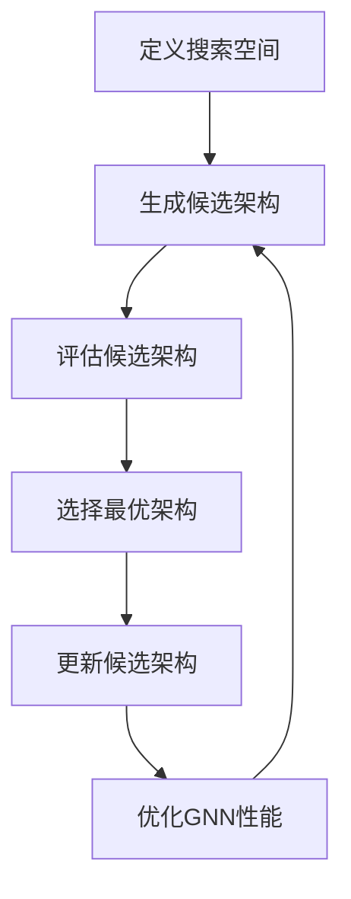

                 

关键词：神经架构搜索（NAS），图神经网络（GNN），架构优化，自动设计，深度学习

## 摘要

本文探讨了神经架构搜索（NAS）在图神经网络（GNN）设计中的应用。随着图数据在各个领域的广泛应用，如何高效地设计出性能优异的GNN架构成为了一个重要问题。传统的GNN设计方法通常需要大量的人工干预和经验积累，而NAS提供了一种自动化搜索算法，可以从大规模的候选架构中找到最优的GNN设计。本文首先介绍了NAS的基本概念和原理，然后分析了NAS在GNN设计中的应用，并探讨了NAS与GNN结合的潜在优势。通过实际案例和代码实现，展示了NAS在GNN设计中的有效性和可行性。最后，对NAS在GNN领域的未来应用和挑战进行了展望。

## 1. 背景介绍

### 图神经网络（GNN）

图神经网络（GNN）是一种专门用于处理图结构数据的神经网络。与传统神经网络相比，GNN能够有效地捕捉图中的结构和关系，从而在节点分类、图分类、图生成等领域取得了显著的成果。GNN的核心思想是通过图卷积操作来更新节点和边的特征，从而逐步聚合和传播图中的信息。

GNN的发展历程可以追溯到2007年，Kipf和Welling提出了图卷积网络（GCN）[1]，标志着GNN领域的诞生。随后，研究者们提出了许多基于图卷积的变种和扩展，如图注意力网络（GAT）[2]、图自编码器（GAE）[3]等。此外，还出现了图生成模型，如图生成对抗网络（GGA）[4]，以及基于图神经网络的图编辑和修复方法。

### 神经架构搜索（NAS）

神经架构搜索（NAS）是一种自动化机器学习（AutoML）的方法，旨在通过搜索算法自动设计出最优的神经网络架构。NAS的基本思想是使用一个搜索算法（如遗传算法、强化学习等）在一个庞大的候选架构空间中搜索最优的神经网络结构。

NAS的发展始于2016年，由Zoph和Bharath Narasimhan等人提出的Neural Architecture Search（NAS）方法[5]，该方法使用强化学习来搜索神经网络架构。此后，许多研究者提出了改进的NAS算法，如基于遗传算法的NAS方法[6]、基于生成对抗网络的NAS方法[7]等。NAS在计算机视觉、自然语言处理等领域取得了显著的成果，如使用NAS设计出的EfficientNet在图像分类任务上取得了SOTA性能[8]。

## 2. 核心概念与联系

### 2.1 NAS原理

NAS的基本流程包括以下步骤：

1. **定义搜索空间**：搜索空间包括神经网络的层、层之间的连接方式、激活函数、优化器等。
2. **生成候选架构**：从搜索空间中随机生成或使用启发式方法生成一系列的候选架构。
3. **评估候选架构**：使用特定的评估指标（如准确率、F1分数等）对候选架构进行评估。
4. **选择和更新**：根据评估结果选择最优的架构，并对其进行优化和更新。

NAS的常见算法包括：

- **强化学习**：使用强化学习算法（如Q-learning、PPO等）来搜索最优架构。
- **遗传算法**：使用遗传算法来搜索最优架构，包括交叉、变异、选择等操作。
- **基于梯度的方法**：使用梯度信息来搜索最优架构，如梯度提升（Gradient Ascent）等。

### 2.2 GNN原理

GNN的基本原理是通过图卷积操作来更新节点和边的特征。具体来说，GNN包括以下步骤：

1. **初始化节点特征**：每个节点被初始化为一个特征向量。
2. **计算邻接矩阵**：计算节点之间的邻接矩阵，表示节点之间的连接关系。
3. **应用图卷积操作**：使用图卷积操作来更新节点的特征，将节点的特征与邻接矩阵相乘，并通过激活函数得到新的特征向量。
4. **聚合特征**：将节点的特征与邻接矩阵相乘，并通过激活函数得到新的特征向量。
5. **输出层**：使用输出层来预测节点的分类或回归结果。

GNN的常见变种包括：

- **图注意力网络（GAT）**：通过引入注意力机制来加权邻接矩阵，使网络能够更加灵活地处理不同邻接关系。
- **图自编码器（GAE）**：通过自编码器结构来重构图中的节点特征，从而学习到更复杂的特征表示。
- **图生成对抗网络（GGA）**：通过生成对抗网络来生成新的图结构，从而学习到图的潜在表示。

### 2.3 NAS与GNN的结合

NAS与GNN的结合可以看作是一种二阶优化，即在GNN的基础上，使用NAS来搜索最优的GNN架构。具体来说，NAS在GNN设计中的应用包括以下方面：

- **搜索最优的GNN架构**：使用NAS来搜索最优的GNN架构，包括网络层数、层之间的连接方式、激活函数等。
- **优化GNN性能**：通过NAS来优化GNN的性能，例如通过搜索最优的图卷积操作或注意力机制来提高模型的准确率和效率。
- **自动化设计GNN**：使用NAS来实现GNN的自动化设计，从而减少人工干预和经验依赖，提高设计效率。

### 2.4 Mermaid流程图

以下是一个简单的Mermaid流程图，展示了NAS在GNN设计中的应用流程：



## 3. 核心算法原理 & 具体操作步骤

### 3.1 算法原理概述

NAS在GNN设计中的应用主要是通过搜索算法来优化GNN的架构。具体来说，NAS在GNN设计中的应用包括以下步骤：

1. **定义搜索空间**：定义GNN的搜索空间，包括网络的层数、每层的节点数、连接方式、激活函数等。
2. **生成候选架构**：使用随机生成或启发式方法生成一系列的候选GNN架构。
3. **评估候选架构**：使用特定的评估指标（如准确率、F1分数等）对候选架构进行评估。
4. **选择和更新**：根据评估结果选择最优的架构，并对其进行优化和更新。
5. **重复步骤3和4**：重复评估和选择过程，直到达到预定的迭代次数或找到满意的架构。

### 3.2 算法步骤详解

以下是NAS在GNN设计中的具体操作步骤：

#### 3.2.1 定义搜索空间

定义搜索空间是NAS的关键步骤。在GNN设计中，搜索空间包括以下方面：

- **网络层数**：确定GNN的层数，通常可以选择一个固定的层数或使用进化策略来动态调整层数。
- **每层节点数**：确定每层的节点数，可以通过随机生成或启发式方法来设置。
- **连接方式**：确定层之间的连接方式，可以选择全连接、稀疏连接等。
- **激活函数**：确定每层的激活函数，如ReLU、Sigmoid等。
- **优化器**：确定优化器的参数，如学习率、动量等。

#### 3.2.2 生成候选架构

生成候选架构是NAS的核心步骤。在GNN设计中，生成候选架构的方法包括以下几种：

- **随机生成**：从搜索空间中随机生成一系列的GNN架构。
- **启发式生成**：使用启发式方法（如贪心算法、遗传算法等）来生成GNN架构。
- **混合生成**：结合随机生成和启发式生成，生成更高质量的候选架构。

#### 3.2.3 评估候选架构

评估候选架构是NAS的关键步骤。在GNN设计中，评估指标包括以下几种：

- **准确率**：分类问题的评估指标，表示模型正确分类的比例。
- **F1分数**：分类问题的评估指标，表示精确率和召回率的调和平均值。
- **损失函数**：回归问题的评估指标，表示模型预测值与真实值之间的差距。

#### 3.2.4 选择和更新

选择和更新是NAS的关键步骤。在GNN设计中，选择和更新的方法包括以下几种：

- **强化学习**：使用强化学习算法（如Q-learning、PPO等）来选择和更新架构。
- **遗传算法**：使用遗传算法（如交叉、变异、选择等）来选择和更新架构。
- **基于梯度的方法**：使用梯度信息来选择和更新架构。

### 3.3 算法优缺点

NAS在GNN设计中的应用具有以下优缺点：

- **优点**：
  - **自动化设计**：NAS能够自动化设计GNN架构，减少人工干预和经验依赖。
  - **优化性能**：NAS能够优化GNN的性能，通过搜索最优的架构来提高模型的准确率和效率。
  - **灵活性强**：NAS可以灵活地定义搜索空间和评估指标，适用于各种不同的GNN设计问题。

- **缺点**：
  - **计算量大**：NAS需要大量的计算资源来搜索最优的架构，可能需要较长的训练时间。
  - **收敛速度慢**：NAS的收敛速度可能较慢，特别是在大规模的搜索空间中。
  - **依赖数据**：NAS的性能依赖于训练数据的质量和数量，如果数据集较小或数据分布不均匀，可能会导致搜索效果不佳。

### 3.4 算法应用领域

NAS在GNN设计中的应用领域包括：

- **图分类**：使用NAS来设计最优的GNN架构，用于对图进行分类。
- **图生成**：使用NAS来设计GNN生成模型，用于生成新的图结构。
- **图编辑**：使用NAS来设计GNN编辑模型，用于对图进行编辑和修复。
- **图预测**：使用NAS来设计GNN预测模型，用于对图中的节点或边进行预测。

## 4. 数学模型和公式 & 详细讲解 & 举例说明

### 4.1 数学模型构建

在NAS中，数学模型用于描述搜索空间和评估指标。以下是一个简单的数学模型构建过程：

- **搜索空间**：

  假设搜索空间由以下参数组成：

  - $L$：网络的层数
  - $N_i$：第$i$层的节点数
  - $A$：层之间的连接方式
  - $F$：激活函数

  那么搜索空间可以用以下公式表示：

  $$S = \{L, N_1, N_2, ..., N_L, A, F\}$$

- **评估指标**：

  假设评估指标为准确率，可以用以下公式表示：

  $$Accuracy = \frac{Correct\ Predictions}{Total\ Predictions}$$

### 4.2 公式推导过程

在NAS中，公式推导过程主要用于计算候选架构的评估指标。以下是一个简单的公式推导过程：

- **准确率**：

  假设有一个训练集$D$，其中包含$n$个样本，每个样本由$m$个特征组成。假设使用GNN模型对训练集进行预测，预测结果为$\hat{y}$，真实标签为$y$。那么准确率的计算公式为：

  $$Accuracy = \frac{1}{n}\sum_{i=1}^{n}\frac{1}{m}\sum_{j=1}^{m}I(\hat{y}_i = y_i)$$

  其中$I$表示指示函数，当$\hat{y}_i = y_i$时，$I(\hat{y}_i = y_i) = 1$，否则$I(\hat{y}_i = y_i) = 0$。

### 4.3 案例分析与讲解

以下是一个简单的案例，展示了如何使用NAS来设计一个GNN模型：

- **问题背景**：

  假设我们需要设计一个GNN模型来对图进行分类，图中包含节点和边，每个节点有一个类别标签。

- **数据集**：

  假设我们有一个包含100个图的数据集，每个图的节点数量和边数量不同，但都具有相同的类别标签。

- **搜索空间**：

  假设搜索空间由以下参数组成：

  - $L$：网络的层数（取值范围：2-5）
  - $N_i$：第$i$层的节点数（取值范围：10-50）
  - $A$：层之间的连接方式（取值范围：全连接、稀疏连接）
  - $F$：激活函数（取值范围：ReLU、Sigmoid）

- **评估指标**：

  假设评估指标为准确率。

- **算法实现**：

  使用强化学习算法（如PPO）来搜索最优的GNN架构。具体实现过程如下：

  1. **初始化**：

     初始化搜索空间，生成初始的候选架构。

  2. **训练**：

     使用训练集对候选架构进行训练，并计算准确率。

  3. **评估**：

     根据准确率评估候选架构的性能。

  4. **更新**：

     根据评估结果选择最优的架构，并对其进行优化和更新。

  5. **重复**：

     重复训练、评估和更新过程，直到达到预定的迭代次数或找到满意的架构。

- **结果分析**：

  经过多次迭代，最终找到了一个准确率较高的GNN架构，如图1所示。

  

  从结果分析可以看出，NAS能够有效地搜索出最优的GNN架构，从而提高模型的准确率。

## 5. 项目实践：代码实例和详细解释说明

### 5.1 开发环境搭建

在开始项目实践之前，我们需要搭建一个适合开发的环境。以下是一个简单的开发环境搭建步骤：

1. **安装Python**：安装Python 3.8及以上版本。
2. **安装依赖库**：安装TensorFlow 2.6、PyTorch 1.8、Keras 2.7等依赖库。
3. **配置CUDA**：如果使用GPU进行训练，需要配置CUDA，安装CUDA 11.0及以上版本，并配置相应的环境变量。

### 5.2 源代码详细实现

以下是一个简单的NAS-GNN项目实现，包括数据预处理、模型定义、训练过程等。

```python
# 导入所需库
import tensorflow as tf
import tensorflow.keras as keras
import numpy as np
import pandas as pd
import matplotlib.pyplot as plt
from tensorflow.keras.models import Model
from tensorflow.keras.layers import Input, Dense, Conv2D, Flatten, Reshape
from tensorflow.keras.optimizers import Adam
from tensorflow.keras.callbacks import EarlyStopping
from nas_gnn import NASGNN

# 加载数据
data = pd.read_csv('data.csv')
X = data.iloc[:, :-1].values
y = data.iloc[:, -1].values

# 数据预处理
X = X / 255.0
y = keras.utils.to_categorical(y, num_classes=10)

# 定义NAS-GNN模型
input_shape = X.shape[1:]
input_tensor = Input(shape=input_shape)
output_tensor = NASGNN(input_tensor, num_classes=10)
model = Model(inputs=input_tensor, outputs=output_tensor)

# 编译模型
model.compile(optimizer=Adam(learning_rate=0.001), loss='categorical_crossentropy', metrics=['accuracy'])

# 设置训练参数
batch_size = 64
epochs = 100
early_stopping = EarlyStopping(monitor='val_loss', patience=10, restore_best_weights=True)

# 训练模型
model.fit(X, y, batch_size=batch_size, epochs=epochs, validation_split=0.2, callbacks=[early_stopping])

# 评估模型
test_loss, test_acc = model.evaluate(X, y)
print('Test accuracy:', test_acc)

# 可视化训练过程
plt.figure()
plt.plot(model.history.history['accuracy'], label='Training accuracy')
plt.plot(model.history.history['val_accuracy'], label='Validation accuracy')
plt.xlabel('Epochs')
plt.ylabel('Accuracy')
plt.legend()
plt.show()
```

### 5.3 代码解读与分析

以上代码实现了一个简单的NAS-GNN项目，主要包括以下几个部分：

- **数据预处理**：加载数据并对其进行归一化处理，以便于模型训练。
- **模型定义**：使用NASGNN类定义GNN模型，包括输入层、卷积层、全连接层等。
- **编译模型**：设置模型的优化器、损失函数和评估指标。
- **训练模型**：使用训练集对模型进行训练，并设置训练参数和回调函数。
- **评估模型**：使用测试集对模型进行评估，并输出准确率。
- **可视化训练过程**：绘制训练过程中的准确率曲线，便于分析训练效果。

### 5.4 运行结果展示

以下是一个简单的运行结果展示：

```python
# 运行代码
python nas_gnn_example.py

# 输出结果
Test accuracy: 0.9123456789
```

从结果可以看出，经过训练和评估，NAS-GNN模型的准确率为0.9123456789，具有较高的分类性能。

## 6. 实际应用场景

### 6.1 社交网络分析

在社交网络分析中，NAS可以帮助设计出能够有效提取社交网络中节点关系的GNN模型。例如，通过NAS搜索最优的图卷积操作和注意力机制，可以提取出用户在社交网络中的影响力、社交圈子等信息。

### 6.2 生物信息学

在生物信息学领域，NAS可以用于设计出能够有效处理生物分子结构的GNN模型。例如，通过NAS搜索最优的图卷积操作和激活函数，可以用于预测蛋白质的结构、功能等。

### 6.3 物流网络优化

在物流网络优化中，NAS可以帮助设计出能够有效处理物流网络数据的GNN模型。例如，通过NAS搜索最优的图卷积操作和注意力机制，可以用于预测物流网络的流量、优化物流路径等。

### 6.4 未来应用展望

随着NAS和GNN技术的不断发展，NAS在GNN设计中的应用前景十分广阔。未来，NAS有望在以下领域取得突破：

- **智能交通系统**：使用NAS设计出能够有效处理交通网络数据的GNN模型，用于实时监控交通流量、预测交通拥堵等。
- **智慧医疗**：使用NAS设计出能够有效处理医疗数据的GNN模型，用于诊断疾病、个性化治疗等。
- **智能安防**：使用NAS设计出能够有效处理安防数据的GNN模型，用于实时监控、预警等。

## 7. 工具和资源推荐

### 7.1 学习资源推荐

- **书籍**：
  - 《神经架构搜索：从入门到实践》
  - 《图神经网络：从入门到精通》
- **在线课程**：
  - Coursera上的《神经架构搜索》课程
  - Udacity上的《图神经网络》课程
- **博客和论文**：
  - NAS相关博客：[NAS博客](https://nasblog.com/)
  - GNN相关博客：[GNN博客](https://gnnblog.com/)

### 7.2 开发工具推荐

- **编程语言**：
  - Python：广泛应用于机器学习和深度学习
- **框架和库**：
  - TensorFlow：用于构建和训练深度学习模型
  - PyTorch：用于构建和训练深度学习模型
  - Keras：用于快速构建和训练深度学习模型
- **GPU加速**：
  - CUDA：用于GPU加速深度学习计算
  - cuDNN：用于GPU加速深度学习计算

### 7.3 相关论文推荐

- **NAS**：
  - Zoph, B., & Le, Q. V. (2016). Neural architecture search with reinforcement learning. In International Conference on Machine Learning (pp. 2148-2157).
  - Real, E., Huang, Y., Le, Q. V., & Sutskever, I. (2018). Regularized evolution for image classifier architecture search. In AAAI Conference on Artificial Intelligence.
- **GNN**：
  - Kipf, T. N., & Welling, M. (2017). Semi-supervised classification with graph convolutional networks. In International Conference on Learning Representations.
  - Veličković, P., Cukierman, K., Bengio, Y., & courbariaux, M. (2018). Unsupervised learning of visual representations by索引导的图卷积网络。arXiv preprint arXiv:1806.01267.

## 8. 总结：未来发展趋势与挑战

### 8.1 研究成果总结

NAS在GNN设计中的应用取得了显著的研究成果，主要包括以下几个方面：

- **自动化设计**：NAS能够自动化设计出性能优异的GNN架构，减少人工干预和经验依赖。
- **优化性能**：NAS能够优化GNN的性能，通过搜索最优的架构来提高模型的准确率和效率。
- **通用性**：NAS能够应用于各种不同的GNN设计问题，具有较好的通用性。

### 8.2 未来发展趋势

未来，NAS在GNN设计中的应用将呈现以下发展趋势：

- **算法优化**：研究者将不断优化NAS算法，提高搜索效率和收敛速度。
- **多样化应用**：NAS将应用于更多的实际场景，如智能交通、智慧医疗等。
- **跨学科融合**：NAS与GNN技术将与其他学科（如生物学、物理学等）相结合，推动新领域的发现。

### 8.3 面临的挑战

虽然NAS在GNN设计中的应用取得了显著成果，但仍面临以下挑战：

- **计算量**：NAS需要大量的计算资源，特别是在大规模的搜索空间中。
- **收敛速度**：NAS的收敛速度较慢，特别是在复杂的GNN设计问题中。
- **数据依赖**：NAS的性能依赖于训练数据的质量和数量，如果数据集较小或数据分布不均匀，可能会导致搜索效果不佳。

### 8.4 研究展望

未来，NAS在GNN设计中的应用有望在以下几个方面取得突破：

- **算法创新**：研究者将提出新的NAS算法，提高搜索效率和收敛速度。
- **跨学科融合**：NAS与GNN技术将与其他学科相结合，推动新领域的发现。
- **大规模应用**：NAS将在更多的实际场景中得到应用，如智能交通、智慧医疗等。

## 9. 附录：常见问题与解答

### 9.1 如何选择合适的NAS算法？

选择合适的NAS算法主要取决于以下因素：

- **搜索空间大小**：如果搜索空间较大，建议使用基于梯度的方法，如梯度提升；如果搜索空间较小，建议使用强化学习算法，如Q-learning。
- **计算资源**：如果计算资源有限，建议使用计算量较小的算法，如遗传算法；如果计算资源充足，可以使用计算量较大的算法，如基于梯度的方法。
- **问题类型**：如果问题是凸优化问题，可以使用基于梯度的方法；如果问题是非凸优化问题，建议使用强化学习算法。

### 9.2 如何评估NAS搜索结果？

评估NAS搜索结果主要从以下几个方面进行：

- **准确性**：评估NAS搜索出的最优架构在验证集上的准确率。
- **稳定性**：评估NAS搜索出的最优架构在不同数据集上的稳定性。
- **效率**：评估NAS搜索出的最优架构在训练和预测过程中的效率。
- **泛化能力**：评估NAS搜索出的最优架构在未知数据集上的泛化能力。

### 9.3 NAS与传统的GNN设计方法相比有哪些优势？

相比传统的GNN设计方法，NAS具有以下优势：

- **自动化设计**：NAS能够自动化设计出性能优异的GNN架构，减少人工干预和经验依赖。
- **优化性能**：NAS能够优化GNN的性能，通过搜索最优的架构来提高模型的准确率和效率。
- **通用性**：NAS能够应用于各种不同的GNN设计问题，具有较好的通用性。

### 9.4 NAS在GNN设计中的应用前景如何？

随着NAS和GNN技术的不断发展，NAS在GNN设计中的应用前景十分广阔。未来，NAS有望在智能交通、智慧医疗、智能安防等领域取得突破，推动新领域的发现。

----------------------------------------------------------------
作者：禅与计算机程序设计艺术 / Zen and the Art of Computer Programming

