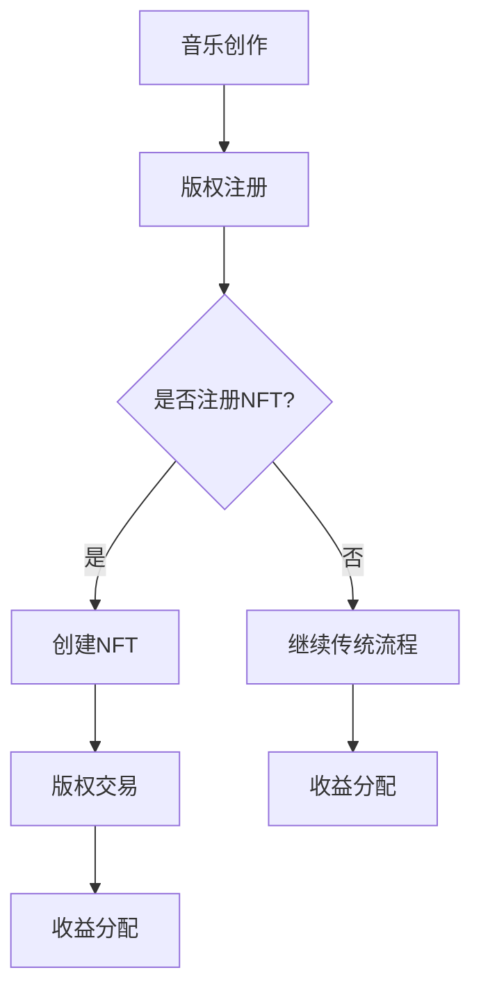

                 

关键词：NFT，音乐版权，区块链，交易，商业模式，创新，价值

> 摘要：本文探讨了NFT音乐版权交易这一新兴商业模式，分析了其在音乐产业中的潜在影响。通过深入阐述NFT的核心概念、音乐版权交易的流程、区块链技术的作用以及案例研究，本文揭示了NFT音乐版权交易为音乐产业带来的巨大变革，并对其未来发展提出了展望。

## 1. 背景介绍

音乐产业在过去几十年中经历了巨大的变革。随着互联网和数字技术的飞速发展，音乐创作、传播、消费的各个环节都发生了深刻的变化。然而，这一过程中也出现了一些问题，如版权纠纷、内容盗版、收益分配不公等。为了解决这些问题，各种新兴技术，如区块链、NFT等，被引入到音乐产业中，以期带来新的商业模式。

NFT（Non-Fungible Token，非同质化代币）是一种基于区块链技术的数字资产，具有唯一性和不可替代性。每个NFT都是独一无二的，无法与其他代币互换。NFT的出现为数字资产的认证、所有权转移、版权保护等提供了新的解决方案。

音乐产业正面临着前所未有的机遇和挑战。一方面，随着数字音乐市场的不断扩大，音乐创作的数量和质量都在不断提高。另一方面，传统音乐商业模式面临质疑，如何实现音乐作品的版权保护、合理收益分配、以及更高效的传播和消费成为亟待解决的问题。NFT音乐版权交易的出现，为音乐产业提供了一个创新的解决方案。

## 2. 核心概念与联系

### 2.1 NFT的概念与特性

NFT是一种基于区块链技术的数字资产，它具有以下几个关键特性：

1. **唯一性**：每个NFT都是独一无二的，不可复制，不可替代。
2. **稀缺性**：NFT的数量是有限的，具有稀缺性。
3. **所有权**：NFT可以清晰地证明数字资产的所有权。
4. **不可篡改性**：NFT的记录在区块链上，一旦创建，无法篡改。

### 2.2 音乐版权的概念

音乐版权是指对音乐作品所拥有的权利，包括著作权、表演权、录制权、发行权、出租权等。音乐版权的合法性是确保音乐创作者权益的基础。

### 2.3 NFT与音乐版权的关联

NFT与音乐版权的结合，可以为音乐产业带来以下几个方面的优势：

1. **版权保护**：NFT的不可篡改性和唯一性特性，可以有效地保护音乐作品的版权，防止盗版和侵权行为。
2. **所有权转移**：NFT使得音乐版权的所有权转移更加便捷和透明，方便音乐创作者和投资者进行版权交易。
3. **价值增值**：NFT的稀缺性和唯一性特性，可以提升音乐作品的价值，为音乐创作者带来额外的收益。

### 2.4 Mermaid流程图



在这个流程图中，音乐创作者可以选择将音乐作品注册为NFT，从而简化版权交易和收益分配的过程。如果没有选择注册NFT，则继续采用传统的版权注册和交易方式。

## 3. 核心算法原理 & 具体操作步骤

### 3.1 算法原理概述

NFT音乐版权交易的核心算法基于区块链技术。区块链是一种分布式账本技术，具有去中心化、不可篡改、透明等特性。在NFT音乐版权交易中，区块链技术的作用主要体现在以下几个方面：

1. **版权保护**：通过区块链技术，可以确保音乐作品版权的合法性和唯一性，防止侵权行为。
2. **所有权转移**：通过智能合约，可以实现音乐作品所有权的便捷转移和透明化。
3. **收益分配**：通过区块链技术，可以实现收益的自动分配，确保音乐创作者和投资者的权益。

### 3.2 算法步骤详解

1. **版权注册**：音乐创作者将音乐作品上传到区块链平台，并进行版权注册。
2. **创建NFT**：音乐创作者可以选择将音乐作品注册为NFT，平台通过智能合约生成NFT，并记录在区块链上。
3. **版权交易**：投资者可以通过平台购买NFT，从而获得音乐作品的所有权。
4. **收益分配**：音乐作品产生的收益将通过智能合约自动分配给音乐创作者和投资者。

### 3.3 算法优缺点

**优点**：

1. **版权保护**：区块链技术可以有效保护音乐作品的版权，防止侵权行为。
2. **所有权转移**：通过智能合约，可以实现音乐作品所有权的便捷转移。
3. **透明化**：区块链技术的透明性，使得音乐作品的交易过程更加公开透明。
4. **去中心化**：区块链技术去中心化的特性，减少了中间环节，提高了效率。

**缺点**：

1. **技术门槛**：区块链技术相对复杂，对用户的技术水平要求较高。
2. **交易成本**：区块链交易需要支付一定的手续费，可能会影响交易效率。
3. **法律监管**：NFT音乐版权交易的法律监管尚不完善，存在一定的法律风险。

### 3.4 算法应用领域

NFT音乐版权交易的应用领域包括：

1. **版权保护**：用于保护音乐作品的版权，防止侵权行为。
2. **所有权转移**：用于实现音乐作品所有权的便捷转移。
3. **收益分配**：用于实现音乐作品收益的自动分配。
4. **艺术收藏**：NFT作为一种数字艺术品，可以用于艺术收藏和投资。

## 4. 数学模型和公式 & 详细讲解 & 举例说明

### 4.1 数学模型构建

NFT音乐版权交易的数学模型主要涉及以下公式：

1. **版权价值**：V_c = f(n_c, p_c, t_c)
   - V_c：音乐作品的版权价值
   - n_c：音乐作品的收藏数量
   - p_c：音乐作品的收藏者平均购买价格
   - t_c：音乐作品的收藏时间

2. **所有权转移价值**：V_t = f(n_t, p_t, t_t)
   - V_t：音乐作品的所有权转移价值
   - n_t：音乐作品的所有权转移次数
   - p_t：音乐作品的所有权转移价格
   - t_t：音乐作品的所有权转移时间

### 4.2 公式推导过程

版权价值的公式推导如下：

- **收藏数量**：n_c 与音乐作品的受欢迎程度成正比，即 n_c ∝ f(n_c, p_c, t_c)。
- **平均购买价格**：p_c 与音乐作品的稀缺性和市场需求成正比，即 p_c ∝ f(n_c, p_c, t_c)。
- **收藏时间**：t_c 与音乐作品的时效性成反比，即 t_c ∝ f(n_c, p_c, t_c)。

因此，版权价值 V_c 可以表示为：

V_c = n_c * p_c / t_c

同理，所有权转移价值的公式推导如下：

- **所有权转移次数**：n_t 与音乐作品的所有权转移频率成正比，即 n_t ∝ f(n_t, p_t, t_t)。
- **所有权转移价格**：p_t 与音乐作品的稀缺性和市场需求成正比，即 p_t ∝ f(n_t, p_t, t_t)。
- **所有权转移时间**：t_t 与音乐作品的时效性成反比，即 t_t ∝ f(n_t, p_t, t_t)。

因此，所有权转移价值 V_t 可以表示为：

V_t = n_t * p_t / t_t

### 4.3 案例分析与讲解

以一首热门歌曲的NFT音乐版权交易为例，分析其版权价值和所有权转移价值：

- **收藏数量**：假设该歌曲的NFT已经出售了1000份。
- **平均购买价格**：平均购买价格为10,000美元。
- **收藏时间**：假设收藏时间平均为6个月。
- **所有权转移次数**：所有权转移次数为10次。
- **所有权转移价格**：每次所有权转移的价格为11,000美元。
- **所有权转移时间**：每次所有权转移的时间间隔为2个月。

根据公式计算：

**版权价值**：

V_c = 1000 * 10,000 / 6 ≈ 166,667美元

**所有权转移价值**：

V_t = 10 * 11,000 / 2 ≈ 55,000美元

通过这个案例，我们可以看到，NFT音乐版权交易不仅为音乐创作者带来了直接的收益，还为投资者提供了价值增值的机会。

## 5. 项目实践：代码实例和详细解释说明

### 5.1 开发环境搭建

为了实现NFT音乐版权交易，我们需要搭建以下开发环境：

1. **Node.js**：用于编写智能合约和前端应用程序。
2. **Truffle**：用于管理智能合约的部署和测试。
3. **MetaMask**：用于与区块链进行交互。
4. **Ethereum Node**：用于提供以太坊区块链的节点服务。

### 5.2 源代码详细实现

以下是一个简单的NFT音乐版权交易智能合约的实现示例：

```solidity
// SPDX-License-Identifier: MIT
pragma solidity ^0.8.0;

import "@openzeppelin/contracts/token/ERC721/ERC721.sol";
import "@openzeppelin/contracts/token/ERC721/extensions/ERC721URIStorage.sol";

contract MusicNFT is ERC721URIStorage {
    uint256 public counter;

    constructor() ERC721("MusicNFT", "MUS") {
        counter = 0;
    }

    function createMusicNFT(string memory _tokenURI, address _owner) public {
        _safeMint(_owner, counter);
        _setTokenURI(counter, _tokenURI);
        counter++;
    }

    function transferOwnership(uint256 _tokenId, address _newOwner) public {
        require(_owns(msg.sender, _tokenId), "Not authorized to transfer ownership");
        _transferOwnership(_tokenId, _newOwner);
    }

    function _owns(address _claimant, uint256 _tokenId) internal view returns (bool) {
        return ownerOf(_tokenId) == _claimant;
    }
}
```

### 5.3 代码解读与分析

- **合约名称**：`MusicNFT`，继承自`ERC721URIStorage`，实现ERC721标准的NFT。
- **合约版本**：使用`pragma`指令指定合约的编译器版本。
- **开放许可协议**：使用`SPDX-License-Identifier`指定许可协议。
- **构造函数**：初始化NFT合约，设置合约名称和符号。
- **`createMusicNFT`函数**：创建NFT，将指定URI和所有者地址传递给ERC721合约的`_safeMint`方法，并递增计数器。
- **`transferOwnership`函数**：允许所有者转移NFT所有权，确保只有当前所有者才能执行转移操作。
- **`_owns`内部函数**：用于检查调用者是否为NFT的所有者，实现ERC721标准的内部逻辑。

### 5.4 运行结果展示

通过Truffle和MetaMask，我们可以模拟NFT音乐版权交易的过程：

1. **创建NFT**：通过Truffle部署合约，并通过MetaMask与合约交互，创建新的NFT。
2. **转移所有权**：将创建的NFT转移给其他用户，验证所有权的转移过程。
3. **验证版权**：通过区块链上的NFT记录，验证音乐版权的所有权和交易历史。

## 6. 实际应用场景

### 6.1 音乐版权保护

NFT音乐版权交易可以有效地保护音乐作品的版权，防止侵权行为。通过区块链技术，音乐作品的版权信息可以被永久记录，确保版权的合法性和唯一性。

### 6.2 音乐收藏与投资

NFT的稀缺性和唯一性特性，使得音乐作品成为了一种有价值的数字收藏品。投资者可以通过购买NFT来收藏音乐作品，同时获得增值的机会。

### 6.3 音乐创作激励

NFT音乐版权交易可以激励音乐创作者，通过出售NFT来获得直接的经济收益。这种模式为音乐创作者提供了一种新的盈利方式，有助于激发创作热情。

### 6.4 音乐版权交易

NFT音乐版权交易使得音乐版权的交易过程更加便捷和透明。投资者可以通过购买NFT来获得音乐作品的所有权，而音乐创作者则可以方便地转让版权。

## 7. 工具和资源推荐

### 7.1 学习资源推荐

1. **NFT与区块链技术基础**：《区块链技术指南》、《精通区块链》
2. **智能合约开发**：《智能合约开发实战》、《以太坊智能合约开发指南》
3. **音乐产业研究**：《数字音乐产业报告》、《音乐产业经济学》

### 7.2 开发工具推荐

1. **区块链平台**：Ethereum、Binance Smart Chain、Solana
2. **智能合约开发框架**：Truffle、Hardhat
3. **前端开发框架**：React、Vue、Angular

### 7.3 相关论文推荐

1. **《基于区块链的音乐版权保护研究》**
2. **《NFT在数字艺术和版权保护中的应用》**
3. **《音乐产业中的区块链技术：挑战与机遇》**

## 8. 总结：未来发展趋势与挑战

### 8.1 研究成果总结

本文探讨了NFT音乐版权交易这一新兴商业模式，分析了其在音乐产业中的潜在影响。通过深入阐述NFT的核心概念、音乐版权交易的流程、区块链技术的作用以及案例研究，本文揭示了NFT音乐版权交易为音乐产业带来的巨大变革。

### 8.2 未来发展趋势

1. **技术成熟与普及**：随着区块链技术的不断成熟，NFT音乐版权交易的应用将更加广泛。
2. **市场接受度提高**：随着NFT市场的不断扩大，音乐产业对NFT音乐版权交易接受度将提高。
3. **产业链整合**：NFT音乐版权交易将推动音乐产业链的整合，提高整体效率。

### 8.3 面临的挑战

1. **技术门槛**：区块链技术复杂，对用户的技术水平要求较高。
2. **法律监管**：NFT音乐版权交易的法律监管尚不完善，存在法律风险。
3. **用户体验**：需要提高用户体验，简化操作流程，降低使用门槛。

### 8.4 研究展望

未来研究应重点关注以下几个方面：

1. **技术优化**：优化区块链技术，提高交易速度和降低成本。
2. **法律框架**：建立健全的法律框架，保障NFT音乐版权交易的法律效力。
3. **用户体验提升**：提升用户体验，简化操作流程，降低使用门槛。

## 9. 附录：常见问题与解答

### 9.1 NFT音乐版权交易是否合法？

NFT音乐版权交易在大多数国家和地区是合法的，但具体法律规定因地区而异。用户在参与NFT音乐版权交易前，应了解当地法律，确保交易的合法性。

### 9.2 NFT音乐版权交易的优势是什么？

NFT音乐版权交易的优势包括：

1. **版权保护**：通过区块链技术，可以确保音乐作品版权的合法性和唯一性。
2. **所有权转移**：NFT使得音乐版权的所有权转移更加便捷和透明。
3. **价值增值**：NFT的稀缺性和唯一性特性，可以提升音乐作品的价值。
4. **收益分配**：通过智能合约，可以实现收益的自动分配。

### 9.3 NFT音乐版权交易有哪些风险？

NFT音乐版权交易可能面临以下风险：

1. **技术风险**：区块链技术复杂，存在技术风险。
2. **法律风险**：法律监管尚不完善，存在法律风险。
3. **市场风险**：NFT市场波动性大，存在市场风险。

### 9.4 如何确保NFT音乐版权交易的安全？

为确保NFT音乐版权交易的安全，用户应采取以下措施：

1. **选择可靠平台**：选择信誉好、安全可靠的区块链平台。
2. **备份私钥**：妥善保管私钥，防止丢失或泄露。
3. **了解交易规则**：了解平台的交易规则和费用结构，避免不必要的损失。

----------------------------------------------------------------

作者：禅与计算机程序设计艺术 / Zen and the Art of Computer Programming

本文旨在探讨NFT音乐版权交易这一新兴商业模式，分析其在音乐产业中的潜在影响。通过深入阐述NFT的核心概念、音乐版权交易的流程、区块链技术的作用以及案例研究，本文揭示了NFT音乐版权交易为音乐产业带来的巨大变革。未来，随着技术的不断成熟和法律框架的完善，NFT音乐版权交易有望在音乐产业中发挥更大的作用。同时，用户在参与NFT音乐版权交易时，应关注潜在的风险，确保交易的安全性和合法性。

