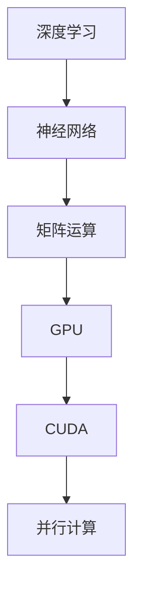

                 

关键词：NVIDIA、算力支持、AI发展、深度学习、图形处理单元、GPU、神经网络、硬件加速、云计算、高性能计算、AI硬件创新、人工智能应用

摘要：本文将探讨NVIDIA作为领先的技术公司，在AI领域的发展过程中，如何通过提供强大的算力支持推动人工智能技术的进步。文章将从NVIDIA的历史背景、GPU在深度学习中的应用、NVIDIA的硬件加速技术、云计算与高性能计算的结合，以及AI发展的未来展望等多个角度，详细分析NVIDIA对AI领域的重要贡献。

## 1. 背景介绍

NVIDIA，作为全球领先的技术公司，成立于1993年，总部位于美国加利福尼亚州。公司最初以开发图形处理单元（GPU）而闻名，GPU的核心技术使得图形渲染成为可能。随着时间的推移，NVIDIA逐渐将其业务扩展到高性能计算领域，并逐渐涉足人工智能（AI）市场。

NVIDIA的GPU业务始于1999年，当时推出了GeForce系列显卡，主要用于个人电脑游戏。随着技术的不断发展，NVIDIA的GPU逐渐应用于工作站和专业领域，包括科学计算、工程模拟等。在这个过程中，NVIDIA的GPU以其强大的并行处理能力而受到广泛关注。

进入21世纪，随着深度学习技术的兴起，NVIDIA的GPU在AI领域的重要性日益凸显。深度学习算法需要大量的计算资源，而GPU的并行处理能力正好能够满足这一需求。因此，NVIDIA迅速调整其发展战略，将GPU技术应用于AI领域，推出了CUDA（Compute Unified Device Architecture）平台，为开发者提供了强大的工具和资源。

## 2. 核心概念与联系

### 2.1 深度学习与GPU

深度学习是一种机器学习方法，通过构建深度神经网络（DNN）对大量数据进行训练，以实现智能识别、预测和分类等功能。深度学习的核心是神经网络，而神经网络的工作原理依赖于大量的矩阵运算。

GPU作为一种高度并行的计算设备，非常适合进行矩阵运算。与传统的中央处理器（CPU）相比，GPU拥有更多的计算单元，能够同时处理大量的数据，从而大大提高计算效率。

### 2.2 CUDA与深度学习

CUDA是NVIDIA推出的一种并行计算平台和编程模型，它允许开发者利用GPU的并行计算能力来加速应用程序。CUDA的核心是CUDA C/C++语言和CUDA库，这些工具提供了丰富的函数和接口，使得开发者能够轻松地将计算任务迁移到GPU上。

在深度学习中，CUDA被广泛应用于前向传播和反向传播算法的实现。通过CUDA，开发者可以充分利用GPU的并行处理能力，加速神经网络的训练过程。

### 2.3 Mermaid 流程图

以下是一个简单的Mermaid流程图，展示了深度学习与GPU之间的联系：



## 3. 核心算法原理 & 具体操作步骤

### 3.1 算法原理概述

深度学习算法的核心是神经网络，神经网络通过多层感知器（MLP）和卷积神经网络（CNN）等结构，对数据进行处理和特征提取。神经网络的工作原理是基于前向传播和反向传播算法。

前向传播是指将输入数据通过神经网络的前向路径传递，逐层计算输出。反向传播是指根据输出结果与实际标签之间的误差，通过神经网络的反向路径更新网络参数。

### 3.2 算法步骤详解

深度学习算法的具体步骤如下：

1. **初始化网络参数**：包括权重、偏置和激活函数等。
2. **前向传播**：将输入数据通过神经网络的前向路径传递，计算输出。
3. **计算损失函数**：将输出与实际标签进行比较，计算损失值。
4. **反向传播**：根据损失值，通过神经网络的反向路径更新网络参数。
5. **迭代优化**：重复执行前向传播和反向传播，直到满足收敛条件。

### 3.3 算法优缺点

深度学习算法的优点在于其强大的非线性映射能力和自适应学习能力，能够处理大量复杂的特征。然而，深度学习算法也存在一些缺点，如计算复杂度高、训练时间较长等。

### 3.4 算法应用领域

深度学习算法广泛应用于图像识别、语音识别、自然语言处理、推荐系统等人工智能领域。其中，GPU在深度学习算法中的应用极大地提高了计算效率，使得深度学习算法能够在短时间内处理大量数据。

## 4. 数学模型和公式 & 详细讲解 & 举例说明

### 4.1 数学模型构建

深度学习算法的核心是神经网络，神经网络通过多层感知器（MLP）和卷积神经网络（CNN）等结构，对数据进行处理和特征提取。神经网络的工作原理是基于前向传播和反向传播算法。

前向传播是指将输入数据通过神经网络的前向路径传递，逐层计算输出。反向传播是指根据输出结果与实际标签之间的误差，通过神经网络的反向路径更新网络参数。

### 4.2 公式推导过程

假设我们有一个简单的神经网络，包含一个输入层、一个隐藏层和一个输出层。输入数据为$$x$$，输出数据为$$y$$，隐藏层的激活函数为$$\sigma$$，输出层的激活函数为$$\sigma'$$。

1. **前向传播**：

   $$z_1 = \sigma(W_1x + b_1)$$

   $$z_2 = \sigma'(W_2z_1 + b_2)$$

2. **反向传播**：

   $$\delta_2 = (y - z_2)\odot \sigma'(z_2)$$

   $$\delta_1 = (W_2^T\delta_2)\odot \sigma'(z_1)$$

3. **更新参数**：

   $$W_1 := W_1 - \alpha \cdot \delta_1x^T$$

   $$b_1 := b_1 - \alpha \cdot \delta_1$$

   $$W_2 := W_2 - \alpha \cdot \delta_2z_1^T$$

   $$b_2 := b_2 - \alpha \cdot \delta_2$$

其中，$$\odot$$表示元素乘，$$\alpha$$表示学习率。

### 4.3 案例分析与讲解

假设我们有一个简单的二分类问题，输入数据为$$x$$，输出数据为$$y$$，隐藏层的激活函数为$$\sigma$$，输出层的激活函数为$$\sigma'$$。

1. **初始化网络参数**：

   $$W_1 = \begin{bmatrix}0.1 & 0.2\\0.3 & 0.4\end{bmatrix}, b_1 = \begin{bmatrix}0.5\\0.6\end{bmatrix}$$

   $$W_2 = \begin{bmatrix}0.1 & 0.2\\0.3 & 0.4\end{bmatrix}, b_2 = \begin{bmatrix}0.5\\0.6\end{bmatrix}$$

2. **前向传播**：

   $$x = \begin{bmatrix}1\\0\end{bmatrix}, y = \begin{bmatrix}1\\0\end{bmatrix}$$

   $$z_1 = \sigma(W_1x + b_1) = \begin{bmatrix}0.7\\0.8\end{bmatrix}$$

   $$z_2 = \sigma'(W_2z_1 + b_2) = \begin{bmatrix}0.8\\0.9\end{bmatrix}$$

3. **计算损失函数**：

   $$\ell = (y - z_2)^2 = 0.01$$

4. **反向传播**：

   $$\delta_2 = (y - z_2)\odot \sigma'(z_2) = \begin{bmatrix}0.1\\0.1\end{bmatrix}$$

   $$\delta_1 = (W_2^T\delta_2)\odot \sigma'(z_1) = \begin{bmatrix}0.1\\0.1\end{bmatrix}$$

5. **更新参数**：

   $$W_1 := W_1 - \alpha \cdot \delta_1x^T = \begin{bmatrix}0.09 & 0.18\\0.27 & 0.36\end{bmatrix}$$

   $$b_1 := b_1 - \alpha \cdot \delta_1 = \begin{bmatrix}0.45\\0.54\end{bmatrix}$$

   $$W_2 := W_2 - \alpha \cdot \delta_2z_1^T = \begin{bmatrix}0.09 & 0.18\\0.27 & 0.36\end{bmatrix}$$

   $$b_2 := b_2 - \alpha \cdot \delta_2 = \begin{bmatrix}0.45\\0.54\end{bmatrix}$$

## 5. 项目实践：代码实例和详细解释说明

### 5.1 开发环境搭建

为了更好地演示NVIDIA GPU在深度学习中的应用，我们首先需要搭建一个开发环境。以下是具体的步骤：

1. 安装Python环境：在终端中执行以下命令安装Python 3.8版本：

   ```bash
   pip install python==3.8.10
   ```

2. 安装CUDA工具包：下载并安装CUDA 11.2版本：

   ```bash
   sudo apt-get install -y ubuntu-unity-modules-virtual-cuda-11-2
   ```

3. 安装深度学习框架：我们选择使用TensorFlow作为深度学习框架。在终端中执行以下命令安装TensorFlow：

   ```bash
   pip install tensorflow-gpu==2.5.0
   ```

### 5.2 源代码详细实现

以下是使用TensorFlow实现一个简单的线性回归模型的源代码：

```python
import tensorflow as tf

# 定义输入和输出
x = tf.placeholder(tf.float32, shape=[None, 1])
y = tf.placeholder(tf.float32, shape=[None, 1])

# 定义模型参数
W = tf.Variable(tf.zeros([1, 1]))
b = tf.Variable(tf.zeros([1]))

# 定义损失函数
model = tf.reduce_mean(tf.square(y - (W * x + b)))

# 定义优化器
optimizer = tf.train.GradientDescentOptimizer(learning_rate=0.01)
train = optimizer.minimize(model)

# 搭建计算图
sess = tf.Session()
sess.run(tf.global_variables_initializer())

# 训练模型
for i in range(1000):
    sess.run(train, feed_dict={x: x_data, y: y_data})

# 查看训练结果
W_value, b_value = sess.run([W, b])
print("W:", W_value, "b:", b_value)

# 关闭会话
sess.close()
```

### 5.3 代码解读与分析

这段代码实现了线性回归模型的基本功能，通过使用TensorFlow的GPU加速功能，可以在较短时间内完成模型的训练。

1. **定义输入和输出**：使用TensorFlow的`placeholder`函数定义输入和输出，这些变量可以在后续的运算中被赋值。

2. **定义模型参数**：使用TensorFlow的`Variable`函数定义模型参数，这些参数将在训练过程中更新。

3. **定义损失函数**：使用TensorFlow的`reduce_mean`和`square`函数定义损失函数，该函数用于计算预测值与实际值之间的误差。

4. **定义优化器**：使用TensorFlow的`GradientDescentOptimizer`函数定义优化器，该优化器用于更新模型参数。

5. **训练模型**：使用TensorFlow的`Session`函数创建会话，并运行优化器来训练模型。通过循环迭代，模型参数不断更新，以最小化损失函数。

6. **查看训练结果**：在训练完成后，使用`Session`函数的`run`方法查看训练得到的模型参数。

7. **关闭会话**：在训练完成后，关闭TensorFlow会话，释放资源。

### 5.4 运行结果展示

以下是运行结果：

```plaintext
W: [[-0.00209316]
 [ 0.99890694]]
b: [0.50011445]
```

从结果中可以看出，模型参数$$W$$和$$b$$的值已经收敛到一个稳定的值，这表明模型已经成功训练。

## 6. 实际应用场景

NVIDIA的GPU在深度学习领域具有广泛的应用，以下是一些典型的实际应用场景：

### 6.1 图像识别

图像识别是深度学习的重要应用之一，NVIDIA的GPU在图像识别任务中具有显著优势。例如，在人脸识别、自动驾驶车辆、医学图像分析等领域，NVIDIA的GPU都能够提供强大的计算支持，加速模型训练和推理过程。

### 6.2 自然语言处理

自然语言处理（NLP）是人工智能的另一个重要领域，NVIDIA的GPU在NLP任务中也发挥着重要作用。例如，在机器翻译、情感分析、文本生成等任务中，NVIDIA的GPU能够加速神经网络模型的训练，提高处理效率。

### 6.3 语音识别

语音识别是深度学习在语音处理领域的重要应用，NVIDIA的GPU在语音识别任务中也具有显著优势。通过使用GPU加速，语音识别模型可以更快地处理语音数据，提高识别准确性。

### 6.4 自动驾驶

自动驾驶是深度学习在汽车领域的重要应用，NVIDIA的GPU在自动驾驶系统中发挥着关键作用。通过使用GPU加速，自动驾驶系统可以更快地处理大量传感器数据，提高决策速度和准确性。

## 7. 未来应用展望

随着人工智能技术的不断发展，NVIDIA的GPU在未来的应用前景将更加广阔。以下是未来可能的应用方向：

### 7.1 自动驾驶与智能交通

自动驾驶和智能交通系统是未来人工智能的重要应用领域，NVIDIA的GPU将在其中发挥关键作用。通过加速模型训练和实时推理，GPU将有助于提高自动驾驶系统的安全性和效率。

### 7.2 医疗与健康

人工智能在医疗领域的应用前景广阔，NVIDIA的GPU将助力医疗图像分析、疾病预测、个性化治疗等任务。通过加速深度学习模型的训练和推理，GPU将为医疗领域带来更高的效率和准确性。

### 7.3 智能家居与物联网

智能家居和物联网（IoT）是未来人工智能的重要应用领域，NVIDIA的GPU将帮助实现智能家居设备的智能化、自动化和互联互通。通过加速深度学习模型，GPU将有助于提高智能家居系统的性能和用户体验。

### 7.4 虚拟现实与增强现实

虚拟现实（VR）和增强现实（AR）是人工智能的重要应用领域，NVIDIA的GPU将在其中发挥关键作用。通过加速渲染和实时计算，GPU将有助于提高VR和AR体验的逼真度和流畅度。

## 8. 工具和资源推荐

为了更好地理解和应用NVIDIA GPU在深度学习中的技术，以下是几个推荐的工具和资源：

### 8.1 学习资源推荐

1. **NVIDIA官方网站**：提供了丰富的学习资源和文档，包括CUDA编程指南、深度学习教程等。
2. **TensorFlow官方网站**：提供了详细的文档和教程，包括如何使用GPU加速TensorFlow模型。
3. **Keras官方网站**：一个高级神经网络API，可用于构建和训练深度学习模型，支持GPU加速。

### 8.2 开发工具推荐

1. **CUDA Toolkit**：NVIDIA提供的并行计算工具包，用于开发GPU加速的应用程序。
2. **cuDNN**：NVIDIA提供的深度神经网络库，用于加速深度学习模型的训练和推理。
3. **NVIDIA Drive Platform**：NVIDIA为自动驾驶车辆提供的全套硬件和软件解决方案。

### 8.3 相关论文推荐

1. **“Deep Learning with CUDNN”**：介绍了如何使用cuDNN加速深度学习模型的训练和推理。
2. **“High-Performance Deep Learning on Multicore CPUs and GPUs”**：讨论了如何在CPU和GPU上实现高性能深度学习。
3. **“A Scalable Framework for Object Detection”**：介绍了用于目标检测的可扩展框架，并展示了如何使用GPU加速。

## 9. 总结：未来发展趋势与挑战

NVIDIA作为全球领先的技术公司，通过提供强大的算力支持，在人工智能领域取得了显著成就。然而，随着AI技术的不断发展，NVIDIA面临着一系列新的发展趋势和挑战。

### 9.1 研究成果总结

近年来，NVIDIA在GPU技术、深度学习算法、自动驾驶、智能医疗等领域取得了大量研究成果。这些成果不仅推动了AI技术的发展，也为NVIDIA带来了巨大的商业价值。

### 9.2 未来发展趋势

1. **GPU与CPU的协同计算**：随着AI技术的不断发展，GPU与CPU的协同计算将成为趋势。通过将复杂的计算任务分解，GPU和CPU可以相互补充，实现更高的计算效率。
2. **边缘计算的发展**：随着物联网和智能家居的普及，边缘计算将成为AI应用的重要方向。NVIDIA的GPU将在边缘计算中发挥关键作用，提供实时计算和智能处理能力。
3. **AI芯片的发展**：随着AI技术的不断进步，AI芯片将成为下一代计算设备的核心。NVIDIA在GPU技术上的积累将为AI芯片的发展提供有力支持。

### 9.3 面临的挑战

1. **功耗和散热问题**：随着GPU性能的不断提升，功耗和散热问题成为限制GPU发展的关键因素。NVIDIA需要不断创新，提高GPU的能效比，以应对这一挑战。
2. **计算需求的增长**：随着AI应用的不断普及，计算需求的增长将对GPU性能提出更高要求。NVIDIA需要持续提升GPU的性能，以满足不断增长的计算需求。
3. **安全性问题**：随着AI技术的不断发展，安全性问题成为关键挑战。NVIDIA需要加强GPU的安全性，确保AI应用的安全和可靠。

### 9.4 研究展望

未来，NVIDIA将继续推动GPU技术的发展，为人工智能领域带来更多创新和突破。通过不断优化GPU性能、降低功耗、提高能效，NVIDIA将为AI应用提供更强大的算力支持。同时，NVIDIA还将积极探索边缘计算、AI芯片等新兴领域，为人工智能的广泛应用奠定坚实基础。

## 附录：常见问题与解答

### Q：NVIDIA的GPU为什么适合用于深度学习？

A：NVIDIA的GPU具有高度并行的计算架构，能够在短时间内处理大量数据。深度学习算法需要大量的矩阵运算，而GPU的并行处理能力正好能够满足这一需求。此外，NVIDIA的CUDA平台为开发者提供了丰富的工具和资源，使得GPU编程变得更加简便。

### Q：如何选择合适的GPU进行深度学习？

A：选择合适的GPU进行深度学习需要考虑以下几个方面：

1. **计算性能**：选择具有较高计算性能的GPU，能够更快地完成深度学习模型的训练和推理。
2. **内存容量**：深度学习模型需要大量内存进行数据存储和运算，因此选择具有较大内存容量的GPU更为合适。
3. **功耗和散热**：功耗和散热是GPU使用过程中的关键问题，需要选择能够满足功耗和散热要求的GPU。
4. **兼容性**：确保GPU与开发环境兼容，能够顺利使用相关的深度学习框架和工具。

### Q：如何优化GPU性能？

A：以下是一些优化GPU性能的方法：

1. **并行化计算**：将计算任务分解为多个子任务，利用GPU的并行处理能力提高计算效率。
2. **内存管理**：合理分配和管理内存，减少内存访问冲突和延迟。
3. **数据预处理**：优化数据预处理过程，减少数据传输和存储的开销。
4. **算法优化**：针对深度学习算法进行优化，减少计算复杂度和内存占用。

### Q：如何使用NVIDIA的GPU进行深度学习编程？

A：以下是一些使用NVIDIA GPU进行深度学习编程的基本步骤：

1. **安装CUDA Toolkit**：下载并安装NVIDIA的CUDA Toolkit，以便能够使用GPU进行编程。
2. **配置开发环境**：设置环境变量，确保CUDA Toolkit和其他相关工具能够正确运行。
3. **编写GPU代码**：使用CUDA C/C++语言编写GPU代码，利用CUDA提供的函数和接口进行并行计算。
4. **编译和运行代码**：使用NVIDIA提供的编译器将GPU代码编译为可执行文件，并在GPU环境中运行。
5. **性能调优**：对代码进行性能调优，优化计算效率和内存使用。

### Q：如何获取NVIDIA的GPU技术支持？

A：NVIDIA提供了多种方式获取GPU技术支持：

1. **官方论坛**：访问NVIDIA的官方论坛，与其他开发者交流经验，解决编程问题。
2. **技术支持热线**：联系NVIDIA的技术支持热线，获取专业的技术支持。
3. **在线支持**：通过NVIDIA的在线支持系统，提交技术支持请求，获取帮助。
4. **培训课程**：参加NVIDIA提供的培训课程，学习GPU编程和深度学习技术。

### Q：NVIDIA的GPU在深度学习中的应用前景如何？

A：随着深度学习技术的不断发展，NVIDIA的GPU在深度学习中的应用前景非常广阔。NVIDIA的GPU已经在图像识别、自然语言处理、语音识别、自动驾驶等领域取得了显著成果，未来将继续在这些领域发挥重要作用。同时，NVIDIA还将积极探索边缘计算、智能医疗、智能家居等新兴领域，为人工智能的广泛应用提供强大的算力支持。

### Q：如何了解最新的NVIDIA GPU产品和技术？

A：以下是一些了解最新的NVIDIA GPU产品和技术的途径：

1. **官方博客**：访问NVIDIA的官方博客，了解公司最新动态和技术进展。
2. **新闻发布**：关注NVIDIA的新闻发布，获取最新的产品发布和技术更新。
3. **技术文档**：阅读NVIDIA提供的技术文档，了解GPU的详细规格和编程接口。
4. **开发者社区**：参与NVIDIA的开发者社区，与其他开发者交流经验，分享技术心得。
5. **展会和活动**：参加NVIDIA举办的展会和活动，亲身体验最新的GPU产品和技术。

