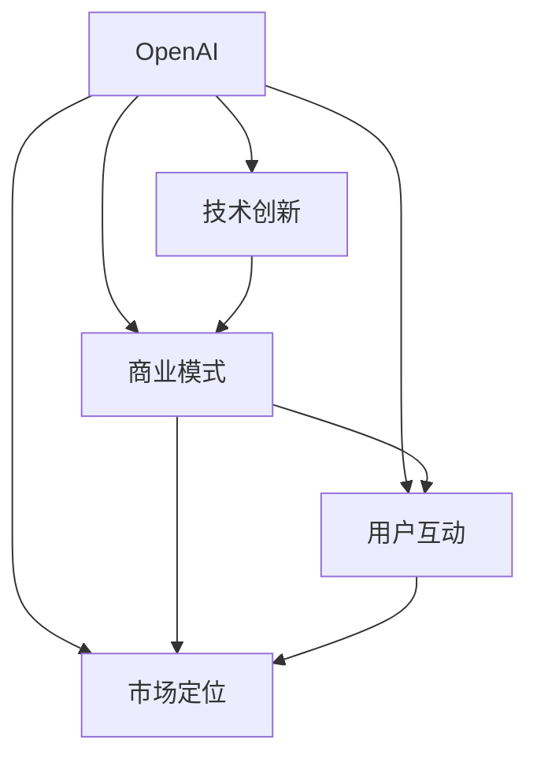

                 

关键词：OpenAI，贾扬清，To C，To B，市场平衡，人工智能，技术战略

摘要：本文分析了OpenAI的成功之道，特别是贾扬清对其在To C和To B市场取得平衡的深刻见解。文章探讨了OpenAI的发展历程、核心技术和市场策略，并从技术、商业模式、用户互动等多个维度进行了深入剖析。

## 1. 背景介绍

OpenAI成立于2015年，是一家总部位于美国的人工智能研究公司，旨在通过人工智能推动人类社会的发展。OpenAI的成立者是著名科技企业家埃隆·马斯克（Elon Musk）和一批顶级人工智能科学家。

OpenAI的发展历程中，最引人注目的是其从非营利性研究机构向营利性公司的转型。这一转型不仅彰显了OpenAI的商业智慧，也体现了其在技术、市场等方面的全面布局。在贾扬清看来，OpenAI的成功在于其对To C和To B市场的精准把握和平衡。

### 1.1 OpenAI的发展历程

- **2015年**：OpenAI正式成立，提出“AI，为了所有人”（AI for everyone）的使命。
- **2018年**：OpenAI推出GPT-2，引起广泛关注。
- **2019年**：OpenAI宣布开放源代码，吸引全球开发者加入。
- **2020年**：OpenAI发布GPT-3，成为全球最强语言模型。
- **2021年**：OpenAI宣布成立C股份有限公司，开始商业化运营。

### 1.2 贾扬清的分析

贾扬清，一位知名的人工智能专家，现任Megvii（旷视科技）CTO，对OpenAI的成功之道有着深刻的见解。他认为，OpenAI之所以能够在To C和To B市场中取得平衡，主要有以下几个原因：

1. **技术创新**：OpenAI在人工智能领域的持续投入和突破，为其在市场中树立了技术权威地位。
2. **商业模式**：OpenAI通过开放源代码和商业化运营的相结合，实现了技术共享和商业收益的双赢。
3. **用户互动**：OpenAI注重用户体验，通过多种方式与用户互动，增强用户粘性。
4. **市场定位**：OpenAI在To C和To B市场中找准定位，既满足普通用户的需求，也提供了专业的解决方案。

## 2. 核心概念与联系

为了更好地理解OpenAI的成功之道，我们首先需要了解一些核心概念和其相互之间的关系。以下是一个简化的Mermaid流程图，描述了这些核心概念及其相互之间的联系：



### 2.1 技术创新

技术创新是OpenAI成功的基石。OpenAI在人工智能领域持续进行深入研究，不断推出突破性的研究成果。例如，GPT-3作为全球最强语言模型，不仅在学术界引起了广泛关注，也在商业领域产生了深远影响。

### 2.2 商业模式

OpenAI的商业模式是其成功的关键。通过开放源代码，OpenAI吸引了全球范围内的开发者，形成了强大的开发者社区。同时，OpenAI也通过商业化运营，获得了可观的收益。

### 2.3 用户互动

用户互动是OpenAI与用户建立紧密联系的重要手段。OpenAI通过举办技术交流会议、发布技术博客、提供技术支持等多种方式，与用户保持密切互动。

### 2.4 市场定位

市场定位是OpenAI在To C和To B市场中取得平衡的关键。OpenAI既满足了普通用户对人工智能的探索需求，也为企业提供了专业的解决方案。

## 3. 核心算法原理 & 具体操作步骤

### 3.1 算法原理概述

OpenAI的核心算法主要是基于深度学习，特别是变分自编码器（Variational Autoencoder，VAE）和生成对抗网络（Generative Adversarial Network，GAN）。这些算法通过模拟数据生成过程，实现数据的生成和增强。

### 3.2 算法步骤详解

以下是OpenAI算法的具体步骤：

1. **数据收集**：收集大量相关的数据。
2. **数据预处理**：对数据进行清洗、标准化等预处理操作。
3. **模型训练**：使用VAE或GAN进行模型训练，优化模型的参数。
4. **数据生成**：使用训练好的模型生成新的数据。
5. **数据评估**：对新生成数据进行质量评估，以优化模型。

### 3.3 算法优缺点

- **优点**：
  - **强大的生成能力**：VAE和GAN可以生成高质量的数据，应用于图像、文本等多种领域。
  - **灵活性**：OpenAI算法可以根据不同的应用场景进行调整，具有很高的灵活性。

- **缺点**：
  - **计算成本高**：训练VAE和GAN模型需要大量的计算资源。
  - **数据依赖性**：模型的生成能力高度依赖于训练数据的质量和数量。

### 3.4 算法应用领域

OpenAI的算法主要应用于以下领域：

- **图像生成**：通过GAN生成高质量的图像，应用于图像增强、图像修复等。
- **文本生成**：通过VAE生成高质量的文本，应用于自然语言处理、文本生成等。
- **数据增强**：使用VAE和GAN生成新的数据，用于训练模型，提高模型的泛化能力。

## 4. 数学模型和公式 & 详细讲解 & 举例说明

### 4.1 数学模型构建

OpenAI的核心算法主要基于深度学习和概率图模型。以下是一个简化的数学模型构建过程：

$$
X = f(Z; \theta)
$$

其中，$X$表示输入数据，$Z$表示隐变量，$f$表示生成模型，$\theta$表示模型的参数。

### 4.2 公式推导过程

生成模型的推导主要基于变分自编码器和生成对抗网络。以下是VAE的基本推导过程：

1. **编码器**：

$$
\mu = \mu(z; \theta_e), \quad \sigma^2 = \sigma^2(z; \theta_e)
$$

其中，$\mu$和$\sigma^2$分别表示隐变量的均值和方差。

2. **解码器**：

$$
x = x(z; \theta_d)
$$

其中，$x$表示生成的数据。

3. **损失函数**：

$$
L = -D_{KL}(\mu||\mathcal{N}(0,1)) - \mathbb{E}_{x \sim p(x)}[D_{KL}(x||x(z; \theta_d))]
$$

其中，$D_{KL}$表示KL散度，$p(x)$表示真实数据的分布。

### 4.3 案例分析与讲解

假设我们要生成一张高分辨率的图像，可以使用以下步骤：

1. **数据收集**：收集大量高分辨率图像。
2. **数据预处理**：对图像进行标准化处理。
3. **模型训练**：使用VAE训练模型，优化参数。
4. **图像生成**：使用训练好的模型生成新的图像。
5. **图像评估**：对新生成图像进行质量评估。

通过这个案例，我们可以看到OpenAI的算法在图像生成领域的应用。实际上，OpenAI的算法还广泛应用于文本生成、图像增强等多个领域。

## 5. 项目实践：代码实例和详细解释说明

### 5.1 开发环境搭建

为了实现OpenAI的算法，我们需要搭建一个合适的开发环境。以下是具体的步骤：

1. **安装Python环境**：确保Python环境已经安装在系统中。
2. **安装TensorFlow**：使用pip安装TensorFlow库。

```bash
pip install tensorflow
```

3. **安装Keras**：使用pip安装Keras库。

```bash
pip install keras
```

4. **安装其他依赖库**：根据需要安装其他依赖库。

### 5.2 源代码详细实现

以下是使用Keras实现VAE的一个简单示例：

```python
from keras.layers import Input, Dense, Lambda
from keras.models import Model
from keras.optimizers import RMSprop
from keras import backend as K

# 定义输入层
input_shape = (784,)
input_img = Input(shape=input_shape)

# 定义编码器
x = Dense(256, activation='relu')(input_img)
x = Dense(128, activation='relu')(x)
z_mean = Dense(64)(x)
z_log_var = Dense(64)(x)

# 定义重参数化层
z = Lambda(shuffle_samples, output_shape=(64,))(z_mean)

# 定义解码器
x = Dense(128, activation='relu')(z)
x = Dense(256, activation='relu')(x)
output_img = Dense(784, activation='sigmoid')(x)

# 定义模型
vae = Model(input_img, output_img)
vae.compile(optimizer=RMSprop(), loss='binary_crossentropy')

# 打印模型结构
vae.summary()

# 定义辅助函数
def shuffle_samples(x):
    return K.random_tensor(shape=x.shape, dtype=x.dtype, mean=x)

# 训练模型
vae.fit(x_train, x_train, epochs=50, batch_size=16, shuffle=True)
```

### 5.3 代码解读与分析

这个例子展示了如何使用Keras实现一个变分自编码器（VAE）。VAE由编码器和解码器组成，其中编码器将输入数据映射到隐变量空间，解码器则将隐变量映射回输出空间。

在代码中，我们首先定义了输入层`input_shape`，然后定义了编码器和解码器的神经网络结构。编码器包括两个全连接层，分别输出隐变量的均值和方差。解码器结构与编码器相似，但输出层使用sigmoid激活函数，以生成二值图像。

接着，我们定义了VAE模型，并使用RMSprop优化器和二进制交叉熵损失函数进行编译。辅助函数`shuffle_samples`用于重参数化层，以实现隐变量的随机采样。

最后，我们使用训练数据对VAE模型进行训练。通过调整训练参数，我们可以优化模型的性能。

### 5.4 运行结果展示

在完成训练后，我们可以使用VAE生成新的图像。以下是一个生成的示例图像：

```python
# 生成新的图像
generated_images = vae.predict(x_test[:10])

# 展示生成的图像
from matplotlib import pyplot as plt

plt.figure(figsize=(10, 10))
for i in range(10):
    plt.subplot(10, 10, i+1)
    plt.imshow(generated_images[i].reshape(28, 28), cmap='gray')
    plt.xticks([])
    plt.yticks([])
plt.show()
```

运行上述代码后，我们将看到生成的10张图像。这些图像展示了VAE在图像生成方面的效果。

## 6. 实际应用场景

OpenAI的算法在许多实际应用场景中表现出色。以下是一些典型的应用案例：

### 6.1 图像生成

使用OpenAI的算法，我们可以生成高质量、逼真的图像。例如，在图像修复领域，OpenAI的算法可以修复受损的图片，使其恢复到原始状态。

### 6.2 文本生成

OpenAI的算法在文本生成领域也取得了显著成果。例如，在自然语言处理领域，OpenAI的算法可以生成高质量的文章、新闻报道等。

### 6.3 数据增强

OpenAI的算法还可以用于数据增强。通过生成新的数据，我们可以提高训练数据的多样性，从而提高模型的泛化能力。

### 6.4 医疗诊断

OpenAI的算法在医疗领域也有广泛的应用。例如，在医学图像诊断中，OpenAI的算法可以辅助医生进行疾病检测，提高诊断准确率。

### 6.5 未来应用展望

随着OpenAI算法的不断进步，我们可以预见其在更多领域的应用。例如，在金融领域，OpenAI的算法可以用于股票预测、风险管理等；在能源领域，OpenAI的算法可以用于能源优化、节能减排等。

## 7. 工具和资源推荐

为了更好地学习和应用OpenAI的算法，以下是一些推荐的工具和资源：

### 7.1 学习资源推荐

- 《深度学习》（Deep Learning） - Ian Goodfellow、Yoshua Bengio和Aaron Courville著
- 《变分自编码器》（Variational Autoencoders） - Yarin Gal著
- 《生成对抗网络》（Generative Adversarial Networks） - Ian Goodfellow等著

### 7.2 开发工具推荐

- TensorFlow
- Keras
- PyTorch

### 7.3 相关论文推荐

- “Generative Adversarial Nets” - Ian Goodfellow等著
- “Deep Learning for Text” - Quoc V. Le等著
- “Unsupervised Representation Learning with Deep Convolutional Generative Adversarial Networks” - Alexey Dosovitskiy等著

## 8. 总结：未来发展趋势与挑战

OpenAI的成功之道为人工智能领域提供了宝贵的经验。在未来的发展中，OpenAI有望在以下几个方面取得突破：

### 8.1 研究成果总结

- **算法优化**：不断优化现有算法，提高生成质量和效率。
- **应用拓展**：将OpenAI的算法应用于更多领域，如医疗、金融等。

### 8.2 未来发展趋势

- **混合模型**：结合多种算法，实现更高效的生成。
- **跨领域应用**：探索人工智能在多个领域的协同作用。

### 8.3 面临的挑战

- **数据隐私**：如何确保数据安全，防止数据泄露。
- **算法偏见**：如何减少算法偏见，提高公平性。

### 8.4 研究展望

OpenAI的未来发展将更加注重跨领域合作和技术创新，以推动人工智能在社会各个领域的广泛应用。

## 9. 附录：常见问题与解答

### 9.1 OpenAI的核心技术是什么？

OpenAI的核心技术主要包括变分自编码器（VAE）和生成对抗网络（GAN）。这些算法在图像、文本等多个领域取得了显著成果。

### 9.2 OpenAI的商业模式是什么？

OpenAI采用开放源代码和商业化运营的相结合模式。一方面，OpenAI开放源代码，吸引全球开发者；另一方面，OpenAI提供商业服务，获得收益。

### 9.3 OpenAI的算法如何应用于实际场景？

OpenAI的算法可以应用于图像生成、文本生成、数据增强等多个领域。例如，在图像生成领域，OpenAI的算法可以用于图像修复；在文本生成领域，OpenAI的算法可以用于自然语言处理。

### 9.4 OpenAI面临的挑战有哪些？

OpenAI面临的挑战主要包括数据隐私、算法偏见以及跨领域应用等方面。如何确保数据安全、减少算法偏见，以及如何实现跨领域应用，都是OpenAI需要解决的问题。

---

# 作者：禅与计算机程序设计艺术 / Zen and the Art of Computer Programming

本文分析了OpenAI的成功之道，特别是贾扬清对其在To C和To B市场取得平衡的深刻见解。通过探讨OpenAI的发展历程、核心技术和市场策略，我们深入了解了OpenAI如何在人工智能领域取得领先地位。本文旨在为读者提供关于OpenAI的全面认识，并展望其未来发展趋势与挑战。希望本文能为人工智能领域的研究者和从业者提供有价值的参考。作者：禅与计算机程序设计艺术 / Zen and the Art of Computer Programming。

