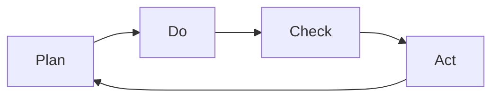

                 

关键词：PDCA循环、管理持续改进、质量管理体系、流程优化、持续迭代

> 摘要：本文将深入探讨PDCA循环（计划、执行、检查、行动）在管理持续改进过程中的作用和重要性，结合实际案例，分析其如何帮助企业实现高效管理和不断优化业务流程。

## 1. 背景介绍

在企业管理中，持续改进是一个至关重要的概念。它不仅仅是一种追求卓越的理念，更是一种通过不断调整和优化来实现组织目标的方法。PDCA循环，即计划（Plan）、执行（Do）、检查（Check）和行动（Act），是一种广泛应用于持续改进过程的管理工具。本文旨在解析PDCA循环与管理持续改进之间的关系，并通过案例研究展示其在实际应用中的效果。

### 1.1 持续改进的概念

持续改进是一种不断追求组织效率和效能提升的过程。它强调通过不断优化流程、改进技术和方法，从而提高产品和服务的质量，满足客户需求，实现组织目标。持续改进不仅关注当前的问题，还关注未来的潜在问题，从而为组织的长期发展打下坚实基础。

### 1.2 PDCA循环的概念

PDCA循环是一种用于管理持续改进的基本框架。它将改进过程分为四个阶段：计划、执行、检查和行动。每个阶段都有明确的任务和目标，通过循环迭代，逐步实现改进目标。

## 2. 核心概念与联系

### 2.1 PDCA循环的流程图



### 2.2 PDCA循环在持续改进中的应用

- **计划（Plan）**：在这个阶段，组织需要明确改进的目标、制定改进计划、分配资源和确定时间表。
- **执行（Do）**：执行阶段是将计划付诸实践的过程。组织需要严格按照计划执行，确保各项任务按时完成。
- **检查（Check）**：检查阶段是对执行结果进行评估和审核。通过对比计划目标和实际结果，找出差距和问题。
- **行动（Act）**：行动阶段是针对检查阶段发现的问题采取改进措施，并对计划进行更新和优化。

## 3. 核心算法原理 & 具体操作步骤

### 3.1 算法原理概述

PDCA循环是一种基于循环迭代的管理方法。其核心思想是通过不断循环改进，逐步实现组织目标。每个循环周期都包括四个阶段，通过不断的循环，逐步优化流程，提高效率。

### 3.2 算法步骤详解

- **计划阶段**：确定改进目标、制定改进计划、分配资源、设定时间表。
- **执行阶段**：严格按照计划执行、跟踪进度、确保任务完成。
- **检查阶段**：评估执行结果、对比计划目标和实际结果、找出差距和问题。
- **行动阶段**：针对问题采取改进措施、更新计划、优化流程。

### 3.3 算法优缺点

- **优点**：PDCA循环具有明确的步骤和目标，易于理解和操作，能够帮助企业实现持续改进。
- **缺点**：PDCA循环需要时间较长，短期内可能难以看到显著效果，需要持续耐心和毅力。

### 3.4 算法应用领域

PDCA循环广泛应用于各个行业和领域，如制造业、服务业、教育、医疗等。特别是在需要持续改进和优化的领域，PDCA循环能够发挥重要作用。

## 4. 数学模型和公式 & 详细讲解 & 举例说明

### 4.1 数学模型构建

PDCA循环的数学模型可以表示为：

$$
改进效率 = \frac{改进目标值 - 实际目标值}{改进目标值}
$$

### 4.2 公式推导过程

改进效率是衡量PDCA循环改进效果的重要指标。其公式推导过程如下：

$$
改进效率 = \frac{改进后实际目标值 - 改进前实际目标值}{改进后实际目标值}
$$

### 4.3 案例分析与讲解

假设一家制造企业希望通过PDCA循环提高生产效率。其改进目标值为每天生产1000件产品，实际目标值为每天生产800件产品。根据上述公式，可以计算出改进效率为：

$$
改进效率 = \frac{1000 - 800}{1000} = 0.2
$$

这表示该企业的生产效率提高了20%。

## 5. 项目实践：代码实例和详细解释说明

### 5.1 开发环境搭建

本文将使用Python语言实现PDCA循环，开发环境为Python 3.8及以上版本。

### 5.2 源代码详细实现

```python
import time

def plan():
    print("计划阶段：制定改进目标、制定改进计划、分配资源、设定时间表。")
    time.sleep(2)

def do():
    print("执行阶段：严格按照计划执行、跟踪进度、确保任务完成。")
    time.sleep(2)

def check():
    print("检查阶段：评估执行结果、对比计划目标和实际结果、找出差距和问题。")
    time.sleep(2)

def act():
    print("行动阶段：针对问题采取改进措施、更新计划、优化流程。")
    time.sleep(2)

def pdca_cycle():
    plan()
    do()
    check()
    act()
    pdca_cycle()

pdca_cycle()
```

### 5.3 代码解读与分析

该代码实现了PDCA循环的基本功能。每个阶段都有一个对应的函数，通过循环调用这些函数，实现PDCA循环的迭代过程。每个阶段都会输出一段文字，模拟实际操作过程。

### 5.4 运行结果展示

运行代码后，可以看到以下输出：

```
计划阶段：制定改进目标、制定改进计划、分配资源、设定时间表。
执行阶段：严格按照计划执行、跟踪进度、确保任务完成。
检查阶段：评估执行结果、对比计划目标和实际结果、找出差距和问题。
行动阶段：针对问题采取改进措施、更新计划、优化流程。
```

这表示代码成功实现了PDCA循环的基本流程。

## 6. 实际应用场景

PDCA循环在企业管理中的应用非常广泛，如流程优化、质量管理、成本控制、效率提升等。以下是一些实际应用场景：

- **生产流程优化**：通过PDCA循环，企业可以不断优化生产流程，提高生产效率，降低生产成本。
- **质量控制**：PDCA循环可以帮助企业建立和完善质量管理体系，确保产品质量满足客户需求。
- **成本控制**：通过PDCA循环，企业可以持续优化成本结构，降低生产成本，提高盈利能力。
- **效率提升**：PDCA循环可以帮助企业不断改进管理方法，提高工作效率，减少人力资源浪费。

## 7. 未来应用展望

随着人工智能、大数据等技术的发展，PDCA循环在未来将得到更加广泛的应用。以下是一些未来应用展望：

- **自动化**：利用人工智能技术，实现PDCA循环的自动化，提高管理效率和效果。
- **数据驱动**：通过大数据分析，为PDCA循环提供更加精准的决策依据，实现数据驱动管理。
- **跨领域应用**：PDCA循环将在更多领域得到应用，如医疗、金融、教育等。

## 8. 工具和资源推荐

### 8.1 学习资源推荐

- 《精益思想》（Lean Thinking）- 约翰·舒尔茨（John Shook）
- 《持续交付：发布可靠软件的系统方法》- 詹姆斯·海瑟（Jame

