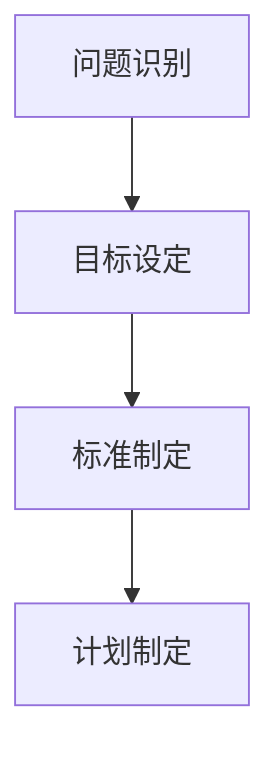
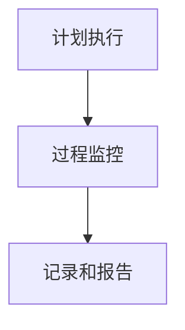
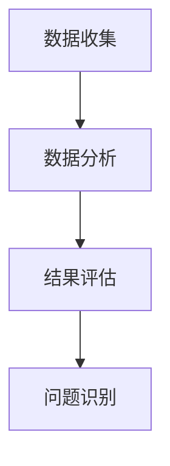
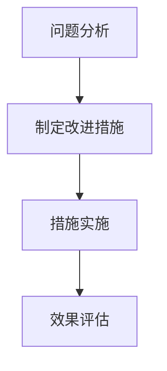

                 

关键词：PDCA循环、质量管理、持续改进、六西格玛、精益管理

## 摘要

本文旨在探讨PDCA循环在质量管理中的应用，通过对PDCA循环的背景介绍、核心概念阐述、具体操作步骤解析、数学模型与公式讲解、项目实践以及未来展望等方面，全面揭示PDCA循环在质量管理中的巨大潜力和实际价值。通过本文的研究，读者可以深入了解PDCA循环的基本原理和操作方法，掌握其在质量管理中的具体应用，为提升产品质量、优化管理流程提供有力的理论支持和实践指导。

## 1. 背景介绍

PDCA循环，即计划（Plan）、执行（Do）、检查（Check）和行动（Act）循环，最早由美国质量管理专家爱德华·戴明提出，并在日本得到广泛应用和推广。PDCA循环是质量管理中的核心方法论，它为组织提供了一种系统化的方法来管理和改进工作流程，确保持续满足客户需求和期望。

质量管理是企业管理的重要组成部分，它关系到企业的核心竞争力、品牌形象和市场地位。传统的质量管理主要依赖于质量检验和控制，而现代质量管理则强调预防性控制和持续改进。PDCA循环正是实现这一目标的重要工具，它通过计划、执行、检查和行动的不断循环，推动组织不断改进，实现质量管理的持续优化。

在信息技术快速发展的今天，质量管理的方法和技术也在不断创新。PDCA循环作为一种经典的质量管理方法，不仅适用于传统的制造业和服务业，也在软件工程、IT服务管理等领域得到广泛应用。通过本文的研究，我们将深入探讨PDCA循环在质量管理中的具体应用，为相关领域的实践提供参考和指导。

### 1.1 PDCA循环的发展历程

PDCA循环的发展历程可以追溯到20世纪中叶，当时美国质量管理专家爱德华·戴明（W. Edwards Deming）提出了这一系统化的管理方法。戴明认为，质量管理不仅仅是检查和纠正问题，更重要的是通过系统的规划和执行来预防问题的发生。他在《质量、生产率和成本》一书中详细阐述了PDCA循环的理论和实践方法，对质量管理产生了深远的影响。

PDCA循环在日本的广泛应用可以追溯到20世纪50年代，当时日本正处于经济高速增长的阶段。日本质量管理专家石川馨（Shigeo Shingo）将PDCA循环与日本传统文化相结合，提出了一系列具体的实践方法，如因果图（鱼骨图）、控制图等，使得PDCA循环在日本企业中得到广泛应用，并取得了显著成效。

随着全球化和信息技术的发展，PDCA循环的应用范围逐渐扩大。在20世纪80年代，随着六西格玛管理法的兴起，PDCA循环成为六西格玛管理方法的重要组成部分。六西格玛强调通过数据分析和统计方法来驱动质量管理，而PDCA循环则为这一过程提供了系统化的框架和方法。

进入21世纪，随着精益管理的普及，PDCA循环在制造业和服务业中得到更广泛的应用。精益管理强调通过消除浪费和优化流程来提升效率和质量，而PDCA循环则为这一目标提供了有效的工具和方法。

### 1.2 质量管理的重要性

质量管理是企业管理的重要组成部分，它关系到企业的核心竞争力、品牌形象和市场地位。以下是质量管理的重要性的详细阐述：

1. **提升客户满意度**：高质量的产品和服务是满足客户需求和期望的基础。通过有效的质量管理，企业可以确保产品和服务的一致性和可靠性，从而提高客户满意度和忠诚度。

2. **降低成本**：质量管理有助于识别和消除生产过程中的浪费和缺陷，从而降低成本。通过预防性控制和持续改进，企业可以减少返工、报废和客户投诉等额外成本，提高生产效率。

3. **增强竞争力**：在激烈的市场竞争中，高质量的产品和服务是企业脱颖而出的关键。通过实施有效的质量管理，企业可以提升产品质量和市场竞争力，赢得更多的市场份额。

4. **提升品牌形象**：高质量的产品和服务是品牌形象的重要组成部分。通过实施严格的质量管理，企业可以树立良好的品牌形象，赢得消费者的信任和好评。

5. **持续改进**：质量管理强调持续改进，通过PDCA循环等管理方法，企业可以不断优化产品和服务，提升自身竞争力。

总之，质量管理是现代企业成功的关键因素之一。通过实施有效的质量管理，企业不仅可以提升产品质量和市场竞争力，还可以降低成本、提高客户满意度，从而实现可持续发展。

### 1.3 PDCA循环的基本概念

PDCA循环是质量管理中的核心方法论，它由四个基本步骤组成：计划（Plan）、执行（Do）、检查（Check）和行动（Act）。以下是每个步骤的详细解释：

1. **计划（Plan）**：计划阶段是PDCA循环的起点，主要包括确定质量目标、制定质量标准和规划实施步骤。在这个阶段，企业需要分析现有的问题和机会，制定具体的目标和计划，以确保后续的执行和检查有明确的基准。

2. **执行（Do）**：执行阶段是将计划付诸行动的过程。这个阶段要求企业严格按照计划执行，确保所有步骤和措施得到有效实施。通过实际操作，企业可以验证计划的有效性，并及时发现和解决问题。

3. **检查（Check）**：检查阶段是对执行结果进行评估和审核的过程。在这个阶段，企业需要收集和分析数据，评估执行的效果和效率，确定是否达到预期的质量目标。如果发现差距，需要及时进行调整和改进。

4. **行动（Act）**：行动阶段是总结经验教训、制定改进措施并实施的过程。在这个阶段，企业需要根据检查结果，分析问题的根本原因，制定具体的改进措施，并确保这些措施得到有效实施。通过行动阶段，企业可以不断完善和优化质量管理流程，实现持续改进。

### 1.4 PDCA循环的四个阶段的关系

PDCA循环的四个阶段相互联系、相互支撑，形成一个闭环系统。具体来说：

1. **计划（Plan）** 为执行（Do）、检查（Check）和行动（Act）提供了目标和基准，是PDCA循环的起点。
2. **执行（Do）** 是计划的具体实施过程，通过实际操作验证计划的可行性和有效性。
3. **检查（Check）** 对执行结果进行评估和审核，确保达到预期的质量目标，并发现潜在的问题和不足。
4. **行动（Act）** 是对检查结果的反馈和改进，通过总结经验教训和制定改进措施，不断完善质量管理流程。

通过PDCA循环的不断迭代，企业可以实现质量管理水平的持续提升，从而满足客户需求和期望，提升市场竞争力和品牌形象。

## 2. 核心概念与联系

在深入探讨PDCA循环在质量管理中的应用之前，我们需要了解一些核心概念和它们之间的联系。以下是PDCA循环在质量管理中的核心概念及其之间的相互关系：

### 2.1 质量管理的基本概念

质量管理是指通过规划、执行、检查和改进等一系列活动，确保产品和服务达到预期的质量水平。质量管理的基本概念包括质量计划、质量控制、质量保证和质量改进。

1. **质量计划**：制定质量管理目标和策略，确定所需资源和活动。
2. **质量控制**：通过监控和调整过程，确保产品和服务满足既定质量标准。
3. **质量保证**：通过系统化的管理和过程控制，确保产品和服务的质量符合客户需求。
4. **质量改进**：通过持续改进和优化，不断提升产品和服务的质量。

### 2.2 PDCA循环的基本概念

PDCA循环是质量管理中的一种系统化方法，包括计划（Plan）、执行（Do）、检查（Check）和行动（Act）四个阶段。每个阶段都有特定的任务和目标，共同构成一个闭环系统。

1. **计划（Plan）**：确定质量目标、制定质量标准和计划实施步骤。
2. **执行（Do）**：按照计划执行，确保所有步骤和措施得到有效实施。
3. **检查（Check）**：对执行结果进行评估和审核，确定是否达到预期的质量目标。
4. **行动（Act）**：根据检查结果，制定改进措施并实施，以持续优化质量管理流程。

### 2.3 质量管理和PDCA循环的关系

质量管理和PDCA循环是相互关联的，质量管理为PDCA循环提供了目标和框架，而PDCA循环则为质量管理提供了具体的实施方法和工具。

1. **质量管理促进PDCA循环的执行**：质量管理确保PDCA循环中每个阶段的目标明确、标准统一，为执行提供指导和保障。
2. **PDCA循环推动质量管理的持续改进**：通过PDCA循环的不断迭代，质量管理可以不断发现和解决问题，实现持续改进。

### 2.4 PDCA循环与其他质量管理方法的关系

PDCA循环与其他质量管理方法，如六西格玛管理法、精益管理、ISO9001质量管理体系等，具有密切的联系和互补性。

1. **六西格玛管理法**：六西格玛强调通过数据分析和统计方法来驱动质量管理，而PDCA循环为这一过程提供了系统化的框架和方法。
2. **精益管理**：精益管理强调通过消除浪费和优化流程来提升效率和质量，PDCA循环则为这一目标提供了有效的工具和方法。
3. **ISO9001质量管理体系**：ISO9001质量管理体系为PDCA循环的实施提供了标准和指导，而PDCA循环则为ISO9001的持续改进提供了实践基础。

### 2.5 Mermaid 流程图

为了更好地理解PDCA循环在质量管理中的应用，我们使用Mermaid流程图来展示PDCA循环的四个阶段以及它们之间的相互关系。

```mermaid
graph TB
A[计划(Plan)] --> B[执行(Do)]
B --> C[检查(Check)]
C --> D[行动(Act)]
D --> A
```

在上面的流程图中，每个阶段都通过箭头与其他阶段相连，形成一个闭环系统。这个流程图清晰地展示了PDCA循环的运行机制和各阶段之间的相互关系。

通过上述核心概念和Mermaid流程图的介绍，我们可以更深入地理解PDCA循环在质量管理中的重要作用，为后续的具体操作步骤和案例讲解打下坚实基础。

### 2.6 PDCA循环的核心算法原理

PDCA循环的核心算法原理在于其系统化的四个阶段：计划（Plan）、执行（Do）、检查（Check）和行动（Act）。以下是对每个阶段的具体算法原理和操作步骤的详细解释：

#### 2.6.1 计划（Plan）阶段

计划阶段是PDCA循环的起点，主要任务是确定质量目标、制定质量标准和制定实施计划。这个阶段的算法原理主要包括以下几个步骤：

1. **问题识别**：通过数据分析、客户反馈和内部审核等方式，识别当前存在的质量问题或改进机会。
2. **目标设定**：根据问题识别的结果，设定具体、可量化的质量目标。
3. **标准制定**：制定衡量质量目标是否实现的标准和指标。
4. **计划制定**：制定实现质量目标的详细计划和步骤，包括时间表、责任人、资源和预算等。

算法原理示意图：



#### 2.6.2 执行（Do）阶段

执行阶段是将计划付诸行动的过程，关键在于确保所有步骤和措施得到有效实施。这个阶段的算法原理主要包括以下几个步骤：

1. **计划执行**：按照计划中的步骤和措施，组织实施和操作。
2. **过程监控**：实时监控执行过程，确保每个步骤都在规定的时间和标准下进行。
3. **记录和报告**：记录执行过程中的关键数据和结果，定期生成报告。

算法原理示意图：



#### 2.6.3 检查（Check）阶段

检查阶段是对执行结果进行评估和审核的过程，关键在于确定是否达到预期的质量目标。这个阶段的算法原理主要包括以下几个步骤：

1. **数据收集**：收集执行过程中的各类数据，包括过程数据、结果数据和客户反馈等。
2. **数据分析**：对收集到的数据进行分析，评估执行效果和效率。
3. **结果评估**：根据设定的标准和指标，评估是否达到质量目标。
4. **问题识别**：分析未达到预期目标的原因，识别潜在的问题和改进点。

算法原理示意图：



#### 2.6.4 行动（Act）阶段

行动阶段是对检查结果进行反馈和改进的过程，关键在于制定并实施改进措施。这个阶段的算法原理主要包括以下几个步骤：

1. **问题分析**：对检查阶段识别的问题进行深入分析，确定根本原因。
2. **制定改进措施**：根据问题分析的结果，制定具体的改进措施和方案。
3. **措施实施**：按照改进措施，组织实施和操作。
4. **效果评估**：对改进措施的实施效果进行评估，确保问题得到有效解决。

算法原理示意图：



通过上述四个阶段的算法原理，PDCA循环实现了质量管理中的持续改进。每个阶段都有明确的任务和目标，相互关联、相互支撑，形成一个闭环系统。通过PDCA循环的不断迭代，企业可以不断优化质量管理流程，提升产品和服务质量，满足客户需求和期望。

### 2.7 PDCA循环的操作步骤详解

PDCA循环是一种系统化的质量管理方法，通过计划（Plan）、执行（Do）、检查（Check）和行动（Act）四个阶段的不断迭代，帮助企业实现质量管理的持续改进。以下是PDCA循环的具体操作步骤详解：

#### 2.7.1 计划（Plan）阶段

1. **问题识别**：首先，通过数据分析、客户反馈、内部审核等方式，识别当前存在的质量问题或改进机会。这一步是PDCA循环的起点，明确需要解决的问题或需要改进的领域。

2. **目标设定**：根据问题识别的结果，设定具体、可量化的质量目标。目标应当明确、具体，以便于后续的执行和检查。

3. **标准制定**：制定衡量质量目标是否实现的标准和指标。这些标准和指标应当与目标紧密相关，能够反映实际质量水平。

4. **计划制定**：制定实现质量目标的详细计划和步骤。包括时间表、责任人、资源和预算等，确保每个步骤都有明确的目标和执行计划。

5. **资源分配**：根据计划需求，合理分配所需的资源，包括人力、物力、财力等，确保计划的顺利实施。

#### 2.7.2 执行（Do）阶段

1. **计划执行**：按照计划中的步骤和措施，组织实施和操作。确保每个步骤都在规定的时间和标准下进行。

2. **过程监控**：在执行过程中，实时监控关键指标和过程，确保各项操作符合预定标准和要求。及时发现和解决问题，确保计划的顺利进行。

3. **记录和报告**：记录执行过程中的关键数据和结果，定期生成报告。这些数据和报告将用于后续的检查阶段，评估执行效果和效率。

#### 2.7.3 检查（Check）阶段

1. **数据收集**：收集执行过程中的各类数据，包括过程数据、结果数据和客户反馈等。确保数据的准确性和完整性。

2. **数据分析**：对收集到的数据进行分析，评估执行效果和效率。通过数据对比和分析，确定是否达到预期的质量目标。

3. **结果评估**：根据设定的标准和指标，评估实际执行结果是否达到质量目标。分析存在的问题和差距，识别潜在的问题和改进点。

4. **反馈**：将评估结果反馈给相关人员，包括计划执行过程中的负责人、相关部门等，确保他们了解当前的质量状况。

#### 2.7.4 行动（Act）阶段

1. **问题分析**：对检查阶段识别的问题进行深入分析，确定根本原因。通过数据分析和因果图（鱼骨图）等方法，找出问题的根本原因。

2. **制定改进措施**：根据问题分析的结果，制定具体的改进措施和方案。这些措施应当能够解决已识别的问题，并预防类似问题的再次发生。

3. **措施实施**：按照改进措施，组织实施和操作。确保每个步骤都得到有效执行，确保改进措施能够真正解决问题。

4. **效果评估**：对改进措施的实施效果进行评估，确保问题得到有效解决。通过数据分析和结果评估，验证改进措施的有效性。

5. **记录和总结**：记录改进措施的实施过程和效果，总结经验教训。为下一次PDCA循环提供参考和借鉴。

通过上述具体的操作步骤，PDCA循环帮助企业实现质量管理的持续改进。每个阶段都有明确的任务和目标，相互关联、相互支撑，形成一个闭环系统。通过PDCA循环的不断迭代，企业可以不断优化质量管理流程，提升产品和服务质量，满足客户需求和期望。

### 2.8 PDCA循环的优缺点

PDCA循环作为一种系统化的质量管理方法，具有明显的优点和一定的局限性。以下是对PDCA循环优缺点的详细分析：

#### 2.8.1 PDCA循环的优点

1. **系统化**：PDCA循环提供了一个明确的系统框架，包括计划、执行、检查和行动四个阶段，使质量管理过程具有清晰的结构和步骤，便于操作和管理。

2. **灵活性**：PDCA循环强调灵活性和适应性，可以根据实际情况随时调整和优化计划，确保质量管理过程的连续性和有效性。

3. **持续改进**：PDCA循环通过不断循环和迭代，推动质量管理水平的持续提升。每个循环都为下一次循环提供了经验和教训，有助于不断完善质量管理流程。

4. **易于实施**：PDCA循环的概念和操作步骤简单易懂，适用于各种规模和组织类型。企业可以快速理解和应用PDCA循环，实现质量管理的提升。

5. **数据驱动**：PDCA循环强调数据的收集和分析，通过数据驱动决策，确保质量管理决策的准确性和科学性。

#### 2.8.2 PDCA循环的缺点

1. **周期性**：PDCA循环的周期性可能导致某些改进措施的实施时间过长，影响问题的及时解决。在某些快速变化的环境中，PDCA循环的周期性可能不足以应对紧急情况。

2. **数据依赖性**：PDCA循环依赖于数据的收集和分析，如果数据不准确或不完整，可能导致错误的决策和改进措施。数据的质量直接影响PDCA循环的有效性。

3. **人员依赖性**：PDCA循环的实施效果很大程度上依赖于执行人员的素质和能力。如果人员素质不高或缺乏责任心，PDCA循环可能无法达到预期的效果。

4. **资源限制**：PDCA循环可能需要大量的时间和资源来实施，特别是在大规模组织或复杂项目中。资源限制可能导致PDCA循环的执行受到影响。

5. **短期效果不明显**：在某些情况下，PDCA循环的改进效果可能需要较长时间才能显现，这可能会影响企业高层和管理者的信心和持续改进的动力。

#### 2.8.3 PDCA循环在不同行业中的应用

PDCA循环在不同行业中具有广泛的应用，其效果因行业特点而异。以下是对PDCA循环在不同行业中应用的简要分析：

1. **制造业**：PDCA循环在制造业中应用广泛，通过计划、执行、检查和行动的循环，实现生产过程的持续改进和质量提升。制造业对生产过程控制和产品一致性有严格要求，PDCA循环能够有效地满足这些需求。

2. **服务业**：在服务业中，PDCA循环也得到广泛应用，特别是在客户服务和流程优化方面。通过PDCA循环，企业可以不断改进服务质量，提升客户满意度和忠诚度。

3. **IT行业**：在IT行业，PDCA循环被广泛应用于软件开发、项目管理和技术支持等方面。通过PDCA循环，IT企业可以确保软件质量和项目进度，提高客户满意度。

4. **医疗行业**：在医疗行业中，PDCA循环被用于医疗流程优化、医疗服务质量和患者安全等方面。通过PDCA循环，医疗机构可以不断改进医疗服务，提升患者满意度。

5. **教育行业**：在教育行业中，PDCA循环被用于课程设计、教学质量控制和学生满意度提升等方面。通过PDCA循环，教育机构可以不断优化教学流程，提高教学质量。

总的来说，PDCA循环作为一种系统化的质量管理方法，具有广泛的适用性和显著的成效。尽管存在一定的局限性，通过合理的应用和优化，PDCA循环可以在不同行业中发挥重要的作用，帮助企业实现质量管理的持续改进。

### 2.9 PDCA循环在不同领域中的应用案例

PDCA循环作为一种系统化的质量管理方法，在各个领域都得到了广泛应用。以下是PDCA循环在不同领域中的应用案例，通过具体实例展示PDCA循环在实际操作中的效果和意义：

#### 2.9.1 制造业

在制造业中，PDCA循环被广泛应用于生产流程的优化和质量控制。例如，某汽车制造企业通过实施PDCA循环，对其生产线的焊接过程进行改进。具体步骤如下：

1. **计划（Plan）**：识别焊接过程中的质量问题，如焊接缝的不均匀、裂纹等。设定目标：减少焊接缺陷，提高焊接质量。

2. **执行（Do）**：按照计划，调整焊接设备的参数，增加焊接过程中的监控和检测。

3. **检查（Check）**：通过检测和分析焊接质量数据，评估改进措施的效果。发现焊接缺陷明显减少。

4. **行动（Act）**：总结经验，制定标准化操作流程，确保焊接过程的一致性和稳定性。通过持续改进，焊接质量得到显著提升。

#### 2.9.2 服务业

在服务业中，PDCA循环被广泛应用于客户服务流程的优化和客户满意度提升。例如，某航空公司通过实施PDCA循环，对其客户投诉处理流程进行改进。具体步骤如下：

1. **计划（Plan）**：分析客户投诉的主要原因，如航班延误、服务质量等。设定目标：减少客户投诉，提高客户满意度。

2. **执行（Do）**：制定投诉处理流程，增加客户服务人员的培训，提高投诉处理的效率。

3. **检查（Check）**：通过客户反馈和投诉处理数据，评估改进措施的效果。发现客户投诉率明显下降。

4. **行动（Act）**：总结经验，优化投诉处理流程，持续提高客户服务质量和满意度。通过持续改进，客户满意度显著提升。

#### 2.9.3 IT行业

在IT行业中，PDCA循环被广泛应用于软件开发和项目管理。例如，某IT公司通过实施PDCA循环，对其软件开发的测试过程进行改进。具体步骤如下：

1. **计划（Plan）**：识别软件测试中的问题，如测试覆盖率不足、测试效率低等。设定目标：提高测试覆盖率，提高测试效率。

2. **执行（Do）**：调整测试策略，增加自动化测试的投入，优化测试资源的配置。

3. **检查（Check）**：通过测试数据和分析，评估改进措施的效果。发现测试覆盖率显著提高，测试效率明显提升。

4. **行动（Act）**：总结经验，制定标准化测试流程，确保测试过程的高效和准确。通过持续改进，软件质量得到显著提升。

#### 2.9.4 医疗行业

在医疗行业中，PDCA循环被广泛应用于医疗流程优化和患者安全。例如，某医院通过实施PDCA循环，对其手术室管理流程进行改进。具体步骤如下：

1. **计划（Plan）**：分析手术室管理中存在的问题，如设备故障频发、手术准备时间过长等。设定目标：降低设备故障率，缩短手术准备时间。

2. **执行（Do）**：增加设备维护频率，优化手术室布局，提高手术室管理人员的培训。

3. **检查（Check）**：通过手术室管理数据和分析，评估改进措施的效果。发现设备故障率明显下降，手术准备时间显著缩短。

4. **行动（Act）**：总结经验，制定标准化手术室管理流程，确保手术室管理的规范和高效。通过持续改进，手术室管理水平得到显著提升。

#### 2.9.5 教育行业

在教育行业中，PDCA循环被广泛应用于教学流程优化和教学质量提升。例如，某学校通过实施PDCA循环，对其教学质量监控过程进行改进。具体步骤如下：

1. **计划（Plan）**：分析教学质量监控中的问题，如学生反馈不及时、教学质量评估不准确等。设定目标：提高教学质量监控的及时性和准确性。

2. **执行（Do）**：制定教学质量监控流程，增加学生反馈渠道，优化教学质量评估方法。

3. **检查（Check）**：通过学生反馈和教学质量评估数据，评估改进措施的效果。发现教学质量监控及时性和准确性明显提升。

4. **行动（Act）**：总结经验，制定标准化教学质量监控流程，确保教学质量监控的有效性和持续性。通过持续改进，教学质量得到显著提升。

通过上述案例，可以看出PDCA循环在不同领域中具有广泛的适用性和显著的效果。通过PDCA循环的持续迭代和改进，企业、机构和组织可以不断提升质量管理水平，实现质量目标，提升客户满意度和市场竞争力。

### 2.10 PDCA循环在项目管理中的应用

在项目管理中，PDCA循环被广泛应用，通过其四个阶段（计划、执行、检查、行动）的迭代，确保项目在既定时间内、按照既定质量和预算顺利完成。以下是PDCA循环在项目管理中应用的详细步骤和实例。

#### 2.10.1 计划阶段

在项目管理中，计划阶段至关重要，它为项目的成功奠定基础。以下是计划阶段的详细步骤：

1. **项目定义**：明确项目的目标、范围、背景和可行性。通过需求分析、利益相关者访谈和市场调研，确保项目目标符合组织战略和客户需求。

2. **项目规划**：制定项目的详细计划，包括时间表、任务分配、资源需求、预算等。制定风险管理计划，识别潜在风险并制定应对策略。

3. **目标设定**：设定具体、可衡量的项目目标，如项目进度、成本、质量、范围等。确保目标与项目计划一致。

4. **标准制定**：确定衡量项目进展和成功的关键绩效指标（KPIs），如进度完成率、成本偏差、质量合格率等。

5. **计划制定**：编写项目计划文档，包括项目范围说明书、项目管理计划、工作分解结构（WBS）、甘特图等，确保团队成员对项目有清晰的理解。

#### 2.10.2 执行阶段

执行阶段是项目计划的具体实施过程，以下是如何有效执行计划的步骤：

1. **任务分配**：根据项目计划，将任务分配给团队成员，明确每个人的职责和角色。确保每个团队成员了解自己的任务和期望。

2. **资源管理**：确保项目所需的资源（人力、物资、设备等）得到合理配置和利用。监控资源消耗，及时调整资源分配，避免资源浪费。

3. **过程监控**：建立项目监控机制，定期检查项目进度、质量和风险。通过项目会议、进度报告和项目管理工具，确保项目按计划进行。

4. **沟通协调**：保持项目团队内部和与利益相关者的有效沟通，确保信息的及时传递和问题解决。通过日常沟通、项目报告和反馈会议，确保项目团队能够协调一致地工作。

#### 2.10.3 检查阶段

在检查阶段，通过数据分析和绩效评估，确保项目达到预期目标。以下是检查阶段的详细步骤：

1. **数据收集**：收集项目执行过程中的各类数据，如进度数据、成本数据、质量数据等。确保数据的准确性和完整性。

2. **绩效评估**：通过关键绩效指标（KPIs）评估项目进度、成本和质量。分析项目实际进展与计划之间的差异，识别潜在问题和改进点。

3. **质量检查**：根据项目质量标准，对交付成果进行质量检查，确保项目交付物符合预期质量要求。通过质量审核、测试和用户验收等手段，确保项目质量。

4. **问题识别**：分析项目执行中的问题，如进度延误、成本超支、质量问题等。通过问题识别和分类，确定问题的根本原因。

#### 2.10.4 行动阶段

在行动阶段，根据检查结果，制定并实施改进措施，确保项目持续改进。以下是行动阶段的详细步骤：

1. **问题分析**：对检查阶段识别的问题进行深入分析，找出问题的根本原因。使用因果图、鱼骨图等工具，分析问题的成因。

2. **制定改进措施**：根据问题分析的结果，制定具体的改进措施，如调整项目计划、优化任务分配、加强过程监控等。确保改进措施能够解决已识别的问题。

3. **措施实施**：按照改进措施，调整项目计划，重新分配资源，加强过程监控，确保改进措施得到有效实施。

4. **效果评估**：对改进措施的实施效果进行评估，确保问题得到有效解决。通过数据分析和绩效评估，验证改进措施的有效性。

5. **总结和记录**：总结改进措施的实施过程和效果，记录经验教训。为下一次项目提供参考，确保项目管理水平的持续提升。

通过PDCA循环在项目管理中的应用，项目团队可以持续监控和优化项目进展，确保项目目标的实现，提高项目成功率。以下是一个实际项目中的应用实例：

假设某IT公司在开发一款新软件，通过PDCA循环进行项目管理。具体步骤如下：

1. **计划阶段**：明确软件需求，制定详细的开发计划，包括时间表、任务分配、资源需求等。设定关键绩效指标（如进度完成率、成本偏差、质量合格率）。

2. **执行阶段**：按照计划进行软件开发，确保团队成员了解任务和职责。通过项目会议和进度报告，监控项目进展。

3. **检查阶段**：定期收集项目数据，如进度、成本和质量数据。通过绩效评估，发现进度延误、成本超支、质量不符合要求等问题。

4. **行动阶段**：针对发现的问题，制定改进措施，如调整开发计划、优化任务分配、加强质量测试等。通过数据分析和效果评估，验证改进措施的有效性。

通过PDCA循环的不断迭代，该项目在保证质量和进度的同时，成功交付了符合客户需求的软件产品。通过这一实例，我们可以看到PDCA循环在项目管理中的实际应用效果。

### 2.11 PDCA循环在软件开发中的具体应用

在软件开发中，PDCA循环作为一种有效的质量管理工具，可以帮助开发团队不断优化开发流程，提高软件质量。以下是PDCA循环在软件开发中的具体应用步骤和实例：

#### 2.11.1 计划（Plan）阶段

1. **需求分析**：在项目启动阶段，与客户和利益相关者进行沟通，详细了解软件功能需求、性能需求、用户体验需求等。将需求转化为具体的项目任务和里程碑。

2. **制定开发计划**：根据需求分析的结果，制定软件开发计划，包括项目的范围、时间表、资源需求、关键绩效指标（KPIs）等。确保计划的可操作性和可实现性。

3. **风险管理**：识别项目可能面临的风险，如技术风险、需求变更风险、资源不足风险等，制定相应的风险应对策略。

4. **质量标准制定**：制定软件质量标准，包括代码质量、测试覆盖率、性能指标等，确保软件交付时满足预期的质量要求。

5. **资源分配**：根据项目计划，合理分配开发资源，包括人力资源、技术支持、硬件设备等，确保项目的顺利推进。

#### 2.11.2 执行（Do）阶段

1. **编码与实现**：按照开发计划，进行软件编码和实现。确保代码的模块化、可维护性和可扩展性。

2. **测试**：在开发过程中，定期进行单元测试、集成测试和系统测试，确保软件功能正确、性能稳定。

3. **文档编写**：编写详细的开发文档，包括设计文档、用户手册、测试报告等，确保后续维护和升级的可操作性。

4. **团队协作**：通过日常会议、任务追踪工具等，确保团队成员之间的沟通和协作，提高开发效率。

#### 2.11.3 检查（Check）阶段

1. **质量评估**：根据设定的质量标准，对软件进行质量评估，包括代码审查、测试结果分析、用户体验测试等。

2. **进度监控**：通过项目进度报告、任务完成情况等，监控项目进展，确保项目按计划进行。

3. **问题识别**：分析质量评估和进度监控中发现的问题，如功能缺陷、性能问题、进度延误等。

4. **客户反馈**：收集客户对软件的反馈，了解软件的实际使用情况，识别潜在问题和改进点。

#### 2.11.4 行动（Act）阶段

1. **问题分析**：对检查阶段识别的问题进行深入分析，找出问题的根本原因。可以使用因果图、鱼骨图等工具，帮助分析问题。

2. **制定改进措施**：根据问题分析的结果，制定具体的改进措施，如优化开发流程、加强测试、调整资源分配等。

3. **措施实施**：按照改进措施，调整开发计划和资源分配，确保措施得到有效实施。

4. **效果评估**：对改进措施的实施效果进行评估，确保问题得到有效解决。通过数据分析和客户反馈，验证改进措施的有效性。

#### 2.11.5 实例分析

以某公司的软件项目为例，通过PDCA循环进行质量管理：

1. **计划阶段**：在项目启动阶段，与客户进行了详细的需求分析，制定了包括时间表、任务分配、质量标准等在内的详细开发计划。

2. **执行阶段**：开发团队按照计划进行编码和测试，同时进行团队协作，确保项目进度。

3. **检查阶段**：在项目中期，通过质量评估和进度监控，发现了一些功能缺陷和性能问题。同时，客户反馈了一些使用上的困难。

4. **行动阶段**：针对发现的问题，开发团队进行了深入分析，制定了改进措施，如优化代码、增加测试覆盖率、调整开发流程等。通过实施这些改进措施，项目的质量得到了显著提升。

通过以上步骤，该软件项目最终顺利交付，客户满意度较高。这个实例展示了PDCA循环在软件开发中的具体应用，通过持续的计划、执行、检查和行动，实现了软件质量的持续提升。

### 2.12 PDCA循环在IT服务管理中的应用

在IT服务管理中，PDCA循环被广泛应用于服务流程的优化和服务质量的提升。通过PDCA循环，IT服务团队能够持续监控和改进服务管理流程，确保提供高质量、高可靠性的IT服务。以下是PDCA循环在IT服务管理中的应用步骤和实际案例：

#### 2.12.1 计划（Plan）阶段

1. **服务需求分析**：首先，与客户和利益相关者进行沟通，了解他们的服务需求、期望和痛点。通过需求分析，明确IT服务的目标和范围。

2. **服务设计**：根据需求分析结果，设计服务架构和服务流程。制定详细的服务策略和操作手册，确保服务的可操作性和规范性。

3. **资源规划**：评估服务所需的人力、技术、硬件资源，制定资源分配计划，确保资源充足且合理利用。

4. **质量标准制定**：根据服务目标和客户需求，制定服务质量标准，包括响应时间、解决率、用户满意度等关键绩效指标（KPIs）。

5. **风险评估**：识别潜在的服务风险，如技术故障、资源短缺、外部威胁等，制定相应的风险应对策略。

#### 2.12.2 执行（Do）阶段

1. **服务实施**：按照服务设计，组织实施和提供IT服务。确保服务流程的规范性，严格按照操作手册执行。

2. **过程监控**：建立监控机制，实时监控服务运行状态，包括系统性能、用户反馈等。确保服务的稳定性和可靠性。

3. **资源管理**：合理分配和利用服务过程中所需的资源，确保资源的高效利用和服务质量。

4. **客户沟通**：定期与客户进行沟通，了解他们的使用体验和需求变化，及时响应客户反馈，优化服务。

#### 2.12.3 检查（Check）阶段

1. **服务质量评估**：通过关键绩效指标（KPIs）评估服务质量，包括响应时间、解决率、用户满意度等。分析服务过程中出现的问题和不足。

2. **问题识别**：通过数据分析、用户反馈和内部审核等方式，识别服务流程中的问题，如流程不顺畅、资源分配不合理等。

3. **服务效果评估**：评估服务实施效果，包括是否达到既定的服务目标和质量标准。通过用户满意度调查、服务绩效报告等，了解服务的实际效果。

4. **合规性检查**：确保IT服务符合相关的法规、标准和内部政策要求，如信息安全法规、服务等级协议（SLA）等。

#### 2.12.4 行动（Act）阶段

1. **问题分析**：对检查阶段识别的问题进行深入分析，找出问题的根本原因。使用因果图、鱼骨图等工具，帮助分析问题。

2. **制定改进措施**：根据问题分析的结果，制定具体的改进措施，如优化服务流程、加强员工培训、增加资源投入等。

3. **措施实施**：按照改进措施，调整服务流程、资源分配和操作规范，确保改进措施得到有效实施。

4. **效果评估**：对改进措施的实施效果进行评估，确保问题得到有效解决。通过数据分析和用户反馈，验证改进措施的有效性。

5. **总结与记录**：总结改进措施的实施过程和效果，记录经验教训。为下一次服务改进提供参考，持续提升IT服务质量。

#### 2.12.5 实际案例

以某公司的IT支持服务为例，说明PDCA循环在IT服务管理中的应用：

1. **计划阶段**：与客户沟通，明确了IT支持服务的需求，如快速响应、高效解决、用户满意度等。制定了详细的服务策略和操作手册，设立了服务质量标准和目标。

2. **执行阶段**：按照服务策略，组织实施和提供IT支持服务。建立了服务监控机制，实时跟踪服务状态和用户反馈。

3. **检查阶段**：通过服务质量评估，发现了一些问题，如响应时间较长、部分问题解决率较低等。通过用户满意度调查，了解到客户对服务的一些改进需求。

4. **行动阶段**：针对发现的问题，制定了改进措施，如增加服务人员的培训、优化问题解决流程、增加资源投入等。通过实施这些改进措施，IT支持服务的响应时间和解决率显著提升，用户满意度显著提高。

通过PDCA循环的持续应用，该公司成功提升了IT服务质量，增强了客户满意度和市场竞争力。这个案例展示了PDCA循环在IT服务管理中的实际应用效果。

### 2.13 PDCA循环在六西格玛管理中的应用

六西格玛管理是一种旨在通过数据驱动的改进方法，减少过程变异，提高质量和效率的管理方法。PDCA循环在六西格玛管理中扮演了核心角色，通过四个阶段的迭代，实现持续改进。以下是PDCA循环在六西格玛管理中的应用步骤和实例：

#### 2.13.1 计划（Plan）阶段

1. **定义问题**：确定需要改进的具体问题，并明确问题的范围和影响。通过数据分析和用户反馈，识别关键问题点。

2. **设定目标**：根据定义的问题，设定具体、可量化的改进目标。目标应当包括质量、效率、成本等方面的改进。

3. **制定策略**：制定实现目标的策略和方法，包括过程优化、资源分配、时间规划等。确定需要采取的改进措施和工具。

4. **风险分析**：识别改进过程中的潜在风险，制定风险应对策略，确保改进措施的有效性和安全性。

5. **计划实施**：制定详细的计划，包括具体步骤、时间表、责任人、资源需求等。确保计划的可操作性和可实现性。

#### 2.13.2 执行（Do）阶段

1. **实施改进**：按照计划，实施改进措施。确保每个步骤都得到有效执行，严格按照标准和流程操作。

2. **过程监控**：建立监控机制，实时跟踪改进过程中的关键指标和数据。确保过程的可控性和稳定性。

3. **资源管理**：确保所需的资源和人员得到合理配置和利用，避免资源浪费和瓶颈问题。

4. **团队协作**：保持团队成员之间的有效沟通和协作，确保改进措施的实施顺利。

#### 2.13.3 检查（Check）阶段

1. **数据收集**：收集改进过程中产生的数据，包括过程数据、绩效数据、用户反馈等。确保数据的准确性和完整性。

2. **效果评估**：通过数据分析，评估改进措施的效果。分析改进后的过程绩效，确定是否达到预期的改进目标。

3. **问题识别**：识别改进过程中出现的问题和不足，如过程变异、效率低下等。通过数据分析和因果图等工具，找出问题的根本原因。

4. **用户反馈**：收集用户对改进措施的感受和反馈，了解用户对改进效果的评价和期望。

#### 2.13.4 行动（Act）阶段

1. **问题分析**：对检查阶段识别的问题进行深入分析，找出问题的根本原因。使用因果图、鱼骨图等工具，帮助分析问题。

2. **制定改进措施**：根据问题分析的结果，制定具体的改进措施。这些措施应当能够解决已识别的问题，并预防类似问题的再次发生。

3. **措施实施**：按照改进措施，调整改进计划和资源分配，确保改进措施得到有效实施。

4. **效果评估**：对改进措施的实施效果进行评估，确保问题得到有效解决。通过数据分析和用户反馈，验证改进措施的有效性。

5. **总结和记录**：总结改进措施的实施过程和效果，记录经验教训。为下一次改进提供参考，确保持续改进的持续进行。

#### 2.13.5 实际案例

以某制造企业通过六西格玛管理改进生产流程为例，说明PDCA循环在六西格玛管理中的应用：

1. **计划阶段**：企业识别了生产线上设备故障频发的问题，制定了减少设备故障的目标。通过数据分析和流程图，确定了改进策略，包括定期维护、优化操作流程等。

2. **执行阶段**：按照改进计划，实施设备定期维护和操作流程优化。确保每个步骤得到有效执行，建立监控机制，实时跟踪改进过程。

3. **检查阶段**：收集设备故障数据和生产绩效数据，评估改进措施的效果。发现设备故障率显著降低，生产效率提高。

4. **行动阶段**：对检查阶段发现的问题进行深入分析，如操作不规范、维护不到位等。制定改进措施，如加强员工培训、优化维护流程等，确保改进措施的有效性。

通过PDCA循环的不断迭代，该企业成功减少了设备故障，提高了生产效率和产品质量。这个案例展示了PDCA循环在六西格玛管理中的实际应用效果。

### 2.14 PDCA循环在精益管理中的应用

精益管理是一种旨在通过消除浪费、优化流程来提高效率和质量的经营管理方法。PDCA循环在精益管理中扮演了关键角色，通过其系统化的四个阶段，推动精益管理的持续改进。以下是PDCA循环在精益管理中的应用步骤和实例：

#### 2.14.1 计划（Plan）阶段

1. **问题识别**：通过数据分析和现场观察，识别生产流程中的浪费点和瓶颈。常见的浪费包括等待时间、库存过多、加工过剩等。

2. **目标设定**：根据问题识别的结果，设定具体、可量化的改进目标。目标应包括减少浪费、提高效率、降低成本等方面。

3. **策略制定**：制定实现改进目标的策略和方法。常用的精益工具包括5S、价值流图、看板系统等。确定需要采取的具体措施和工具。

4. **资源规划**：评估实现改进目标所需的资源，包括人力、物资、设备等，制定资源分配计划，确保资源的合理利用。

5. **风险评估**：识别改进过程中可能面临的风险，如操作不规范、资源短缺等，制定相应的风险应对策略。

#### 2.14.2 执行（Do）阶段

1. **改进实施**：按照制定的策略，实施改进措施。确保每个步骤都得到有效执行，严格按照标准和流程操作。

2. **过程监控**：建立监控机制，实时跟踪改进过程中的关键指标和数据。确保过程的可控性和稳定性。

3. **资源管理**：确保所需的资源和人员得到合理配置和利用，避免资源浪费和瓶颈问题。

4. **员工培训**：对员工进行精益管理的培训，提高他们的意识和能力，确保改进措施得到有效执行。

5. **团队协作**：保持团队成员之间的有效沟通和协作，确保改进措施的实施顺利。

#### 2.14.3 检查（Check）阶段

1. **数据收集**：收集改进过程中产生的数据，包括过程数据、绩效数据、用户反馈等。确保数据的准确性和完整性。

2. **效果评估**：通过数据分析，评估改进措施的效果。分析改进后的过程绩效，确定是否达到预期的改进目标。

3. **问题识别**：识别改进过程中出现的问题和不足，如过程变异、效率低下等。通过数据分析和因果图等工具，找出问题的根本原因。

4. **用户反馈**：收集用户对改进措施的感受和反馈，了解用户对改进效果的评价和期望。

5. **合规性检查**：确保改进措施符合相关的法规、标准和内部政策要求，如环保法规、安全标准等。

#### 2.14.4 行动（Act）阶段

1. **问题分析**：对检查阶段识别的问题进行深入分析，找出问题的根本原因。使用因果图、鱼骨图等工具，帮助分析问题。

2. **制定改进措施**：根据问题分析的结果，制定具体的改进措施。这些措施应当能够解决已识别的问题，并预防类似问题的再次发生。

3. **措施实施**：按照改进措施，调整改进计划和资源分配，确保改进措施得到有效实施。

4. **效果评估**：对改进措施的实施效果进行评估，确保问题得到有效解决。通过数据分析和用户反馈，验证改进措施的有效性。

5. **总结与记录**：总结改进措施的实施过程和效果，记录经验教训。为下一次改进提供参考，确保持续改进的持续进行。

#### 2.14.5 实际案例

以某制造企业通过精益管理优化生产流程为例，说明PDCA循环在精益管理中的应用：

1. **计划阶段**：企业通过数据分析，识别了生产线上的瓶颈和浪费点，如等待时间过长、库存过多等。制定了减少浪费、提高效率的目标，并制定了具体的改进策略。

2. **执行阶段**：按照改进策略，实施操作流程优化和设备更新。通过5S活动整理工作环境，减少库存，实施看板系统，提高生产过程的透明度和可控性。

3. **检查阶段**：收集改进过程中的数据，评估改进措施的效果。发现生产效率显著提高，库存水平降低，产品合格率提高。

4. **行动阶段**：对检查阶段发现的问题进行深入分析，如设备维护不足、员工操作不规范等。制定改进措施，如加强设备维护、开展员工培训等，确保改进措施的有效性。

通过PDCA循环的不断迭代，该企业成功优化了生产流程，减少了浪费，提高了效率和产品质量。这个案例展示了PDCA循环在精益管理中的实际应用效果。

### 2.15 PDCA循环在ISO9001质量管理体系中的应用

ISO9001质量管理体系是一种国际标准，用于确保组织能够提供满足客户需求和期望的产品和服务。PDCA循环在ISO9001质量管理体系中起着关键作用，通过其系统化的四个阶段，帮助组织实现质量管理的持续改进。以下是PDCA循环在ISO9001质量管理体系中的应用步骤和实例：

#### 2.15.1 计划（Plan）阶段

1. **质量方针和目标**：根据组织的战略目标和客户需求，制定质量方针和目标。这些目标和方针应具有可操作性，并与组织的整体战略一致。

2. **质量规划**：制定具体的质量规划，包括确定所需的过程、资源、活动和控制措施。制定质量手册、程序文件和作业指导书等文档，确保各项活动有据可依。

3. **风险管理**：识别与质量相关的潜在风险，并制定相应的风险管理计划。确保组织能够应对可能影响质量的各种风险。

4. **资源分配**：评估实现质量目标所需的资源，包括人力资源、物资资源、设备资源等，并制定资源分配计划。

#### 2.15.2 执行（Do）阶段

1. **实施质量计划**：按照质量计划，实施各项质量活动，包括生产、服务提供、过程控制等。

2. **过程控制**：确保每个过程都按照预定标准进行，通过控制措施确保产品质量的稳定性和一致性。

3. **员工培训**：对员工进行必要的培训，确保他们具备执行质量计划所需的知识和技能。

4. **沟通与协作**：保持组织内部和与外部利益相关者之间的有效沟通和协作，确保质量信息的畅通。

#### 2.15.3 检查（Check）阶段

1. **内部审核**：定期进行内部审核，检查质量管理体系的有效性和符合性。审核范围应覆盖所有相关过程和活动。

2. **数据分析**：收集和分析过程绩效数据，评估质量管理体系的运行效果，识别存在的问题和改进机会。

3. **客户反馈**：收集和分析客户反馈，了解客户对产品和服务的满意度和需求变化。

4. **合规性检查**：确保组织的活动和记录符合ISO9001标准和相关法规的要求。

#### 2.15.4 行动（Act）阶段

1. **问题识别**：通过对检查阶段识别的问题进行分析，找出问题的根本原因。

2. **制定改进措施**：根据问题分析的结果，制定具体的改进措施，确保能够解决已识别的问题。

3. **措施实施**：按照改进措施，调整质量管理体系和过程控制，确保改进措施得到有效实施。

4. **效果评估**：对改进措施的实施效果进行评估，确保问题得到有效解决。通过数据分析和用户反馈，验证改进措施的有效性。

5. **总结与记录**：总结改进措施的实施过程和效果，记录经验教训，为下一次循环提供参考。

#### 2.15.5 实际案例

以某电子产品制造企业通过ISO9001质量管理体系提升产品质量为例，说明PDCA循环在其中的应用：

1. **计划阶段**：企业根据市场需求和客户反馈，制定了质量方针和目标，如提高产品合格率、减少投诉等。同时，制定了详细的质量规划，明确了所需的过程、资源和控制措施。

2. **执行阶段**：按照质量规划，实施生产过程控制，包括原材料检验、生产过程监控、成品检验等。同时，对员工进行质量意识和技术培训，确保生产过程的规范性和一致性。

3. **检查阶段**：定期进行内部审核，检查质量管理体系的有效性和符合性。通过数据分析，发现生产过程中存在的一些问题，如某些工序的合格率较低等。同时，收集和分析客户反馈，了解客户对产品质量的满意度和改进需求。

4. **行动阶段**：对检查阶段发现的问题进行深入分析，找出问题的根本原因，如工艺参数设置不当、员工操作不规范等。制定改进措施，如调整工艺参数、加强员工培训等，确保改进措施的有效性。

通过PDCA循环的不断迭代，该企业成功提高了产品合格率，减少了客户投诉，提升了产品质量和客户满意度。这个案例展示了PDCA循环在ISO9001质量管理体系中的实际应用效果。

### 2.16 PDCA循环在跨部门协作中的应用

在组织内部，不同部门之间往往需要进行紧密的协作，以确保项目顺利进行和目标的实现。PDCA循环作为一种系统化的方法，可以帮助跨部门协作实现持续改进，提高协作效率和质量。以下是PDCA循环在跨部门协作中的应用步骤和实例：

#### 2.16.1 计划（Plan）阶段

1. **需求分析**：首先，跨部门团队需要对协作项目进行需求分析，明确各方的需求、期望和目标。这包括项目范围、时间表、资源需求、质量标准等。

2. **目标设定**：根据需求分析的结果，设定具体的协作目标。这些目标应当是具体、可量化的，并且要得到所有参与部门的认可。

3. **策略制定**：制定实现协作目标的策略和计划。包括任务分配、责任划分、资源调配、时间规划等。确保每个部门都能明确自己的任务和职责。

4. **风险管理**：识别跨部门协作过程中可能面临的风险，如沟通障碍、资源不足、进度延误等，并制定相应的风险应对策略。

5. **沟通机制建立**：建立跨部门沟通机制，确保信息在各部门之间的畅通传递。这可以包括定期会议、电子邮件、即时通讯工具等。

#### 2.16.2 执行（Do）阶段

1. **任务执行**：按照协作计划和任务分配，各部门开始执行各自的任务。确保每个部门都按照预定的时间表和质量标准进行工作。

2. **过程监控**：建立监控机制，实时跟踪协作项目的进展情况。通过项目进度报告、关键绩效指标（KPIs）等手段，确保项目按计划进行。

3. **资源管理**：确保各部门之间的资源得到合理配置和有效利用。协调各部门的资源和进度，避免资源浪费和瓶颈问题。

4. **沟通与协作**：保持跨部门之间的有效沟通和协作，通过定期会议、任务追踪工具等，确保团队成员之间的信息共享和问题解决。

#### 2.16.3 检查（Check）阶段

1. **绩效评估**：通过关键绩效指标（KPIs）评估协作项目的执行效果。分析各部门的任务完成情况、质量水平和协作效率。

2. **问题识别**：通过数据分析和绩效评估，识别协作过程中存在的问题和不足。这些问题可能包括进度延误、沟通不畅、资源分配不合理等。

3. **用户反馈**：收集最终用户或利益相关者的反馈，了解协作项目的实际效果和用户满意度。这可以帮助识别潜在的问题和改进点。

4. **合规性检查**：确保协作项目的所有活动和记录符合组织的内部政策和相关法规要求。

#### 2.16.4 行动（Act）阶段

1. **问题分析**：对检查阶段识别的问题进行深入分析，找出问题的根本原因。可以使用因果图、鱼骨图等工具，帮助分析问题。

2. **制定改进措施**：根据问题分析的结果，制定具体的改进措施。这些措施应当能够解决已识别的问题，并预防类似问题的再次发生。

3. **措施实施**：按照改进措施，调整协作计划和资源分配，确保改进措施得到有效实施。

4. **效果评估**：对改进措施的实施效果进行评估，确保问题得到有效解决。通过数据分析和用户反馈，验证改进措施的有效性。

5. **总结与记录**：总结改进措施的实施过程和效果，记录经验教训。为下一次跨部门协作提供参考，确保协作效率和质量持续提升。

#### 2.16.5 实际案例

以某大型企业的市场推广项目为例，说明PDCA循环在跨部门协作中的应用：

1. **计划阶段**：市场部门、销售部门、IT部门和财务部门共同制定了市场推广项目的需求分析，明确了项目目标、时间表、资源需求等。同时，制定了详细的协作计划和任务分配，确保每个部门都明确自己的职责。

2. **执行阶段**：各部门按照协作计划，分别执行各自的任务。市场部门负责推广策略的制定，销售部门负责客户拓展和销售跟进，IT部门负责技术支持，财务部门负责预算管理和财务审核。

3. **检查阶段**：通过项目进度报告和关键绩效指标（KPIs），评估各部门的任务完成情况和协作效果。发现一些问题，如销售部门的客户拓展进度较慢，IT部门的技术支持响应时间较长等。

4. **行动阶段**：对检查阶段发现的问题进行深入分析，找出问题的根本原因，如销售部门的客户拓展策略需要调整，IT部门的技术支持人员需要增加等。制定相应的改进措施，调整协作计划和资源分配，确保改进措施的有效性。

通过PDCA循环的不断迭代，该企业的市场推广项目取得了显著成效，各部门之间的协作效率和质量得到了显著提升。这个案例展示了PDCA循环在跨部门协作中的实际应用效果。

### 2.17 PDCA循环在供应链管理中的应用

供应链管理是企业运营的核心环节，涉及到多个环节和部门的协作。PDCA循环作为一种系统化的方法，可以帮助企业在供应链管理中实现持续改进，提高供应链的效率和可靠性。以下是PDCA循环在供应链管理中的应用步骤和实例：

#### 2.17.1 计划（Plan）阶段

1. **需求分析**：首先，供应链管理团队需要分析市场需求和客户需求，确定所需的原材料、产品和服务。这包括预测销售量、采购需求、物流需求等。

2. **策略制定**：根据需求分析的结果，制定供应链管理策略。这包括确定采购策略、库存管理策略、物流策略等。确保供应链的各个环节都能高效运作。

3. **资源配置**：评估实现供应链管理策略所需的资源，包括人力资源、物资资源、技术资源等，并制定资源分配计划。

4. **风险管理**：识别供应链管理过程中可能面临的风险，如供应短缺、物流延误、库存过剩等，并制定相应的风险应对策略。

5. **计划执行**：制定详细的执行计划，包括时间表、任务分配、关键节点等，确保供应链管理策略能够得到有效实施。

#### 2.17.2 执行（Do）阶段

1. **采购与供应**：按照采购策略，实施原材料和物资的采购。确保采购过程的及时性和成本效益。

2. **库存管理**：根据库存管理策略，对库存进行有效监控和管理。确保库存水平既不过高也不过低，避免库存过剩或供应短缺。

3. **物流与配送**：按照物流策略，实施产品的运输和配送。确保物流过程的准时性和可靠性。

4. **过程控制**：建立供应链管理的监控机制，实时跟踪供应链的各个环节，确保各个环节都能按计划进行。

5. **员工培训**：对供应链管理的相关人员进行培训，提高他们的技能和意识，确保供应链管理策略的有效执行。

#### 2.17.3 检查（Check）阶段

1. **绩效评估**：通过关键绩效指标（KPIs），评估供应链管理的执行效果。这些指标可以包括采购成本、库存周转率、物流准时率等。

2. **问题识别**：通过绩效评估，识别供应链管理过程中存在的问题和不足。这些问题可能包括采购延误、库存积压、物流效率低下等。

3. **用户反馈**：收集最终用户或供应商的反馈，了解他们对供应链管理服务的满意度和需求。这可以帮助识别潜在的问题和改进点。

4. **合规性检查**：确保供应链管理的过程和记录符合相关法规、标准和内部政策要求。

#### 2.17.4 行动（Act）阶段

1. **问题分析**：对检查阶段识别的问题进行深入分析，找出问题的根本原因。可以使用因果图、鱼骨图等工具，帮助分析问题。

2. **制定改进措施**：根据问题分析的结果，制定具体的改进措施。这些措施应当能够解决已识别的问题，并预防类似问题的再次发生。

3. **措施实施**：按照改进措施，调整供应链管理的策略和流程，确保改进措施得到有效实施。

4. **效果评估**：对改进措施的实施效果进行评估，确保问题得到有效解决。通过数据分析和用户反馈，验证改进措施的有效性。

5. **总结与记录**：总结改进措施的实施过程和效果，记录经验教训。为下一次供应链管理提供参考，确保供应链管理水平的持续提升。

#### 2.17.5 实际案例

以某电子产品制造企业供应链管理为例，说明PDCA循环在其中的应用：

1. **计划阶段**：企业通过市场需求预测，制定了采购策略和库存管理策略。明确了所需的资源，并制定了详细的执行计划。

2. **执行阶段**：按照采购策略，实施原材料的采购，并按照库存管理策略，对库存进行监控和管理。同时，按照物流策略，确保产品的及时运输和配送。

3. **检查阶段**：通过绩效评估，发现一些问题，如采购延误导致生产线停工、库存积压导致资金占用等。收集了供应商和客户的反馈，了解到他们对供应链管理的满意度。

4. **行动阶段**：对检查阶段发现的问题进行深入分析，找出问题的根本原因，如供应商响应不及时、库存管理不善等。制定了相应的改进措施，如优化采购流程、加强库存管理、改进物流策略等。

通过PDCA循环的不断迭代，该企业的供应链管理水平得到了显著提升，采购及时率、库存周转率和物流准时率等关键绩效指标都有了明显改善。这个案例展示了PDCA循环在供应链管理中的实际应用效果。

### 2.18 PDCA循环在环境管理中的应用

在现代社会，环境保护已成为企业社会责任的重要组成部分。PDCA循环作为一种系统化的方法，可以帮助企业实现环境管理的持续改进，减少环境风险，提升环境保护水平。以下是PDCA循环在环境管理中的应用步骤和实例：

#### 2.18.1 计划（Plan）阶段

1. **环境评估**：首先，对企业现有的环境状况进行评估，识别现有的环境问题和潜在的环境风险。这可以通过环境审计、污染源调查等方式实现。

2. **目标设定**：根据环境评估的结果，设定具体、可量化的环境保护目标。这些目标可以是减少污染排放、提高资源利用率、保护生物多样性等。

3. **策略制定**：制定实现环境保护目标的策略和计划。包括污染源控制措施、节能减排措施、环保设备投资等。

4. **资源规划**：评估实现环境保护策略所需的资源，包括资金、技术、人力资源等，并制定资源分配计划。

5. **培训与沟通**：对员工进行环境保护培训，提高他们的环保意识和技能。同时，与相关利益相关者（如政府部门、社区居民）进行沟通，确保环境保护计划的顺利实施。

#### 2.18.2 执行（Do）阶段

1. **措施实施**：按照环境保护策略和计划，实施各项环境保护措施。这可以包括安装环保设备、优化生产工艺、加强污染源控制等。

2. **过程监控**：建立环境监控机制，实时跟踪环境保护措施的实施情况。通过数据监测、现场巡查等方式，确保环境保护措施得到有效执行。

3. **资源管理**：确保环境保护措施所需的资源得到合理配置和有效利用，避免资源浪费和瓶颈问题。

4. **员工参与**：鼓励员工积极参与环境保护活动，通过团队协作、环保知识竞赛等方式，提高员工的环保意识和行动力。

#### 2.18.3 检查（Check）阶段

1. **效果评估**：通过关键绩效指标（KPIs），评估环境保护措施的实施效果。这些指标可以包括污染排放量、资源利用率、能源消耗等。

2. **问题识别**：通过效果评估，识别环境保护措施中的问题和不足。这些问题可能包括污染排放未达标、资源利用率低、设备故障等。

3. **用户反馈**：收集员工、社区居民和政府部门等利益相关者的反馈，了解他们对环境保护工作的满意度和需求。这可以帮助识别潜在的问题和改进点。

4. **合规性检查**：确保环境保护措施和过程符合相关的环保法规、标准和内部政策要求。

#### 2.18.4 行动（Act）阶段

1. **问题分析**：对检查阶段识别的问题进行深入分析，找出问题的根本原因。可以使用因果图、鱼骨图等工具，帮助分析问题。

2. **制定改进措施**：根据问题分析的结果，制定具体的改进措施。这些措施应当能够解决已识别的问题，并预防类似问题的再次发生。

3. **措施实施**：按照改进措施，调整环境保护策略和资源分配，确保改进措施得到有效实施。

4. **效果评估**：对改进措施的实施效果进行评估，确保问题得到有效解决。通过数据分析和用户反馈，验证改进措施的有效性。

5. **总结与记录**：总结改进措施的实施过程和效果，记录经验教训。为下一次环境管理提供参考，确保环境保护水平的持续提升。

#### 2.18.5 实际案例

以某化工企业环境管理为例，说明PDCA循环在其中的应用：

1. **计划阶段**：企业通过环境审计，识别了废水、废气和固废处理中的问题，如废水排放未达标、废气排放浓度高等。制定了减少污染排放、提高资源利用率的环保目标，并制定了具体的环保策略。

2. **执行阶段**：按照环保策略，安装了废水处理设备和废气净化设备，优化了生产工艺，减少了污染物的排放。同时，建立了环境监控机制，实时跟踪环保措施的实施情况。

3. **检查阶段**：通过效果评估，发现废水排放仍然未完全达标，废气排放浓度较高。收集了员工和社区居民的反馈，了解到他们对环保工作的满意度较低。

4. **行动阶段**：对检查阶段发现的问题进行深入分析，找出问题的根本原因，如废水处理设备效率较低、废气排放标准不严格等。制定了相应的改进措施，如升级废水处理设备、优化废气排放标准等。

通过PDCA循环的不断迭代，该企业的环境保护水平得到了显著提升，废水排放和废气排放达到了环保标准，员工的环保意识也得到了提高。这个案例展示了PDCA循环在环境管理中的实际应用效果。

### 2.19 PDCA循环在其他领域的应用

除了质量管理、项目管理、软件开发、IT服务管理、六西格玛管理、精益管理、ISO9001质量管理体系、跨部门协作、供应链管理和环境管理等领域，PDCA循环还在其他多个领域得到了广泛应用，以下简要介绍其在这些领域的应用情况：

#### 2.19.1 教育领域

在教育和培训领域，PDCA循环被广泛应用于课程设计、教学方法和学生评估的优化。通过计划阶段，教育机构可以设定明确的教学目标和标准。执行阶段，教师按照计划进行教学活动。检查阶段，通过学生反馈和评估数据，教师可以评估教学效果，识别不足。行动阶段，教师根据反馈和评估结果，调整教学方法和策略，不断优化教学过程。

#### 2.19.2 医疗保健

在医疗保健领域，PDCA循环被用于医疗服务流程的优化、患者安全和医疗质量的提升。医院可以通过计划阶段制定医疗服务流程和标准。执行阶段，按照计划提供医疗服务。检查阶段，通过患者满意度调查和医疗数据监测，评估医疗服务质量。行动阶段，医院根据评估结果，改进服务流程和提升医疗质量。

#### 2.19.3 营销和销售

在营销和销售领域，PDCA循环被用于市场推广策略的制定和优化。通过计划阶段，企业可以设定市场推广目标和策略。执行阶段，实施市场推广活动。检查阶段，通过市场反馈和销售数据，评估市场推广效果。行动阶段，根据评估结果，调整市场推广策略，优化营销组合。

#### 2.19.4 人力资源管理

在人力资源管理领域，PDCA循环被用于员工招聘、培训和绩效管理的优化。通过计划阶段，企业可以设定人力资源目标和标准。执行阶段，实施招聘和培训活动。检查阶段，通过员工反馈和绩效数据，评估招聘和培训效果。行动阶段，根据评估结果，改进招聘流程和培训计划，提升员工绩效。

#### 2.19.5 安全管理

在安全管理领域，PDCA循环被用于安全生产流程的优化和安全事故的预防。通过计划阶段，企业可以制定安全生产目标和标准。执行阶段，按照计划进行安全生产。检查阶段，通过安全检查和事故统计，评估安全生产效果。行动阶段，根据评估结果，改进安全生产流程和措施，预防安全事故的发生。

通过上述应用领域的介绍，我们可以看到PDCA循环作为一种系统化的管理方法，具有广泛的适用性。在不同领域，PDCA循环都通过其四个阶段的迭代，推动管理水平的提升和持续改进，实现组织的目标和愿景。

### 2.20 PDCA循环与相关质量管理方法的对比

在质量管理领域，PDCA循环与六西格玛管理法、精益管理、ISO9001质量管理体系等方法具有密切的联系和互补性。以下是PDCA循环与这些方法的对比，分析它们的异同点和适用场景。

#### 2.20.1 PDCA循环与六西格玛管理法的对比

1. **共同点**：
   - **系统化**：PDCA循环和六西格玛管理法都是系统化的质量管理方法，强调通过数据和统计方法来驱动质量管理。
   - **持续改进**：两者都强调持续改进，通过不断循环和迭代，实现质量管理水平的持续提升。
   - **数据驱动**：两者都依赖于数据的收集和分析，通过数据驱动决策，确保质量管理决策的准确性和科学性。

2. **异同点**：
   - **重点不同**：PDCA循环更侧重于整体质量管理的框架和流程，而六西格玛管理法则更侧重于通过数据分析和统计方法，减少过程变异，提高质量和效率。
   - **深度不同**：PDCA循环适用于各种规模和组织类型，而六西格玛管理法则通常在需要高度精确和质量控制要求较高的领域（如制造业、金融服务等）应用。

3. **适用场景**：
   - **PDCA循环**：适用于所有需要进行质量管理改进的领域，特别是需要系统化管理和流程优化的组织。
   - **六西格玛管理法**：适用于需要高度精确和质量控制要求较高的领域，如制造业、金融服务、医疗行业等。

#### 2.20.2 PDCA循环与精益管理的对比

1. **共同点**：
   - **系统化**：PDCA循环和精益管理都是系统化的管理方法，强调通过持续改进和优化，消除浪费，提高效率。
   - **数据驱动**：两者都依赖于数据的收集和分析，通过数据驱动决策，确保管理决策的准确性和科学性。

2. **异同点**：
   - **重点不同**：PDCA循环更侧重于质量管理框架和流程，而精益管理更侧重于通过消除浪费和优化流程来提高效率。
   - **工具和方法**：精益管理采用了一系列特定的工具和方法，如5S、价值流图、看板系统等，而PDCA循环则提供了更通用的框架和步骤。

3. **适用场景**：
   - **PDCA循环**：适用于所有需要进行质量管理改进的领域，特别是需要系统化管理和流程优化的组织。
   - **精益管理**：适用于需要通过消除浪费和优化流程来提高效率的领域，如制造业、物流、服务业等。

#### 2.20.3 PDCA循环与ISO9001质量管理体系对比

1. **共同点**：
   - **标准化**：PDCA循环和ISO9001质量管理体系都强调标准化管理，确保过程和结果的可控性和一致性。
   - **持续改进**：两者都强调持续改进，通过不断循环和迭代，实现质量管理水平的持续提升。

2. **异同点**：
   - **实施范围**：ISO9001质量管理体系是一种国际标准，适用于全球范围内的组织，而PDCA循环则是一种更通用的管理方法，适用于各种规模和组织类型。
   - **内容深度**：ISO9001质量管理体系详细规定了质量管理的各个方面，包括过程控制、资源管理、绩效评估等，而PDCA循环则提供了一个更简化的质量管理框架。

3. **适用场景**：
   - **PDCA循环**：适用于所有需要进行质量管理改进的领域，特别是那些不需要严格按照ISO9001标准要求实施的组织。
   - **ISO9001质量管理体系**：适用于需要严格按照国际标准进行质量管理，并希望在国际市场上建立品牌信誉的组织。

通过上述对比，我们可以看到PDCA循环与六西格玛管理法、精益管理、ISO9001质量管理体系等方法在质量管理中具有不同的侧重点和适用场景。PDCA循环作为一种系统化的管理方法，适用于各种规模和组织类型，特别是在需要持续改进和流程优化的领域，具有广泛的应用价值。

### 2.21 PDCA循环在不同组织中的应用策略

PDCA循环作为一种系统化的质量管理方法，适用于各种规模和组织类型。然而，不同类型的组织在应用PDCA循环时需要采取不同的策略，以适应其特定的业务需求和运营环境。以下是PDCA循环在不同组织中的应用策略：

#### 2.21.1 大型企业

大型企业通常具有复杂的组织结构和多样化的业务流程，因此在应用PDCA循环时需要采取以下策略：

1. **顶层设计**：大型企业需要在高层管理者的支持下，制定全局性的PDCA循环策略，明确各个部门和业务单元的职责和目标。

2. **分阶段实施**：大型企业可以将整个组织划分为多个业务模块或区域，分别实施PDCA循环。每个模块或区域可以独立运行，同时保持与整体战略的一致性。

3. **标准化流程**：为了确保PDCA循环的顺利实施，大型企业需要建立一系列标准化流程和操作手册，确保各部门和业务单元在执行PDCA循环时有据可依。

4. **数据共享与整合**：大型企业需要建立高效的数据共享和整合机制，确保各部门和业务单元能够实时获取和共享相关数据，提高PDCA循环的透明度和效率。

#### 2.21.2 中小型企业

中小型企业通常资源有限，因此在应用PDCA循环时需要采取以下策略：

1. **重点突破**：中小型企业应根据自身资源和业务重点，选择关键业务流程或部门进行PDCA循环的试点和推广，以逐步积累经验和优化流程。

2. **简化流程**：中小型企业应简化PDCA循环的步骤和流程，减少不必要的复杂性和资源消耗，确保PDCA循环的实施效率和可操作性。

3. **全员参与**：中小型企业需要鼓励员工积极参与PDCA循环的各个环节，提高员工的参与度和责任感，通过全员参与实现质量管理水平的提升。

4. **灵活调整**：中小型企业应保持PDCA循环的灵活性和适应性，根据业务需求和市场变化，及时调整PDCA循环的策略和实施方法。

#### 2.21.3 创新型企业

对于创新型企业和高科技企业，PDCA循环的应用需要考虑以下策略：

1. **研发导向**：创新型企业的核心业务是研发和创新，因此PDCA循环的应用应侧重于研发流程的优化，如需求分析、产品设计、测试验证等。

2. **快速迭代**：创新型企业和高科技企业通常采用快速迭代的方法进行产品开发和市场推广，因此PDCA循环应支持快速迭代和持续改进。

3. **数据驱动**：创新型企业和高科技企业应充分利用大数据和人工智能技术，通过数据分析和挖掘，支持PDCA循环中的决策和改进。

4. **开放合作**：创新型企业和高科技企业应开放合作，通过与供应商、客户、科研机构等建立合作关系，共同推进PDCA循环的实施和改进。

#### 2.21.4 非营利组织

对于非营利组织，如慈善机构、教育机构、公益组织等，PDCA循环的应用需要考虑以下策略：

1. **项目导向**：非营利组织的运营通常以项目为基础，因此PDCA循环的应用应围绕具体项目进行，确保项目目标的实现和资源的高效利用。

2. **社会责任**：非营利组织应将社会责任融入PDCA循环中，确保项目和社会效益的平衡，实现可持续发展。

3. **透明度**：非营利组织需要提高项目管理透明度，通过PDCA循环，公开项目进展和财务状况，增强公众信任。

4. **持续改进**：非营利组织应通过PDCA循环，不断优化项目管理和服务流程，提升组织运营效率和公众满意度。

通过上述策略，不同类型的组织可以根据自身特点和需求，灵活应用PDCA循环，实现质量管理水平的持续提升和组织的可持续发展。

### 2.22 PDCA循环在未来质量管理中的应用前景

随着技术的不断进步和市场竞争的日益激烈，质量管理方法也在不断创新和发展。PDCA循环作为一种经典的质量管理方法，在未来质量管理中将继续发挥重要作用，并呈现以下几个应用前景：

#### 2.22.1 与新技术的融合

1. **大数据和人工智能**：大数据和人工智能技术的发展为质量管理提供了新的工具和方法。未来，PDCA循环可以与大数据分析和人工智能技术相结合，通过实时数据分析和智能决策，实现更高效的质量管理。例如，通过大数据分析，可以提前预测质量问题的发生，通过人工智能技术，可以自动识别和分类质量问题，提供个性化的改进建议。

2. **区块链技术**：区块链技术的透明性和不可篡改性可以增强质量管理的可信度。未来，PDCA循环可以通过区块链技术，实现质量数据的全程追溯和共享，提高质量管理的信息透明度和数据准确性。

3. **物联网（IoT）**：物联网技术的应用可以实时监控生产过程和设备状态，通过PDCA循环，实现生产过程的精细化管理。例如，通过IoT设备，可以实时监测设备的工作状态和运行数据，及时发现和解决潜在问题，确保生产过程的高效和质量。

#### 2.22.2 持续改进与敏捷管理

1. **敏捷管理**：随着市场变化速度的加快，敏捷管理方法在企业管理中越来越受欢迎。未来，PDCA循环可以与敏捷管理方法相结合，通过快速迭代和持续改进，实现质量管理水平的不断提升。敏捷管理强调快速响应变化，PDCA循环则提供了一套系统化的方法和流程，两者结合可以更好地应对市场变化，提高产品质量和市场竞争力。

2. **持续改进文化**：未来，PDCA循环将更加注重培养组织的持续改进文化。通过持续的培训和教育，提高员工的质量意识和改进能力，形成全员参与的质量管理氛围，实现质量管理水平的整体提升。

#### 2.22.3 国际化与多文化管理

随着全球化和国际竞争的加剧，质量管理方法也需要适应多文化和多地区的环境。未来，PDCA循环将更加注重国际化应用，通过结合不同国家和地区的质量管理标准和文化特点，实现全球范围内的质量管理协同。例如，通过制定全球统一的质量管理标准，推广PDCA循环的应用，提高跨国企业的质量管理水平和全球竞争力。

#### 2.22.4 与其他质量管理方法的融合

1. **六西格玛管理法**：未来，PDCA循环可以与六西格玛管理法相结合，通过六西格玛的数据驱动和统计分析方法，提高PDCA循环的质量改进效果。六西格玛强调通过数据分析和统计工具，识别和解决质量问题的根本原因，与PDCA循环的系统化方法和流程相结合，可以进一步提升质量管理水平。

2. **精益管理**：未来，PDCA循环可以与精益管理方法相结合，通过消除浪费和优化流程，实现更高效的质量管理。精益管理强调通过消除生产过程中的浪费，提高生产效率和产品质量，与PDCA循环的系统化方法和持续改进理念相契合。

通过上述前景展望，我们可以看到PDCA循环在未来的质量管理中将继续发挥重要作用，并与其他新技术、管理方法相结合，实现质量管理的持续改进和创新发展。这不仅有助于提高企业的质量管理水平，还可以增强企业的市场竞争力和可持续发展能力。

### 2.23 PDCA循环在质量管理中面临的挑战和解决方案

尽管PDCA循环在质量管理中具有显著的优势，但在实际应用过程中，依然面临一些挑战和问题。以下是PDCA循环在质量管理中面临的主要挑战以及相应的解决方案：

#### 2.23.1 持续改进的难度

**挑战**：持续改进是一个长期而复杂的过程，需要持续的时间和资源投入。在面临市场竞争和短期业绩压力时，企业可能会倾向于追求短期效益，忽视持续改进。

**解决方案**：建立持续改进的文化和机制，通过内部培训和教育，提高员工的质量意识和改进能力。同时，制定明确的目标和里程碑，确保持续改进目标的实现。利用项目管理工具和流程，确保改进计划的执行和监督。

#### 2.23.2 数据收集和分析的困难

**挑战**：数据收集和分析是PDCA循环的重要组成部分，但实际操作中，数据可能不够完整、准确，或数据来源不一致，影响分析和决策的准确性。

**解决方案**：建立统一的数据管理平台，确保数据的准确性和一致性。通过引入大数据分析和人工智能技术，提高数据分析的效率和准确性。定期对数据收集和分析过程进行审核和优化，确保数据的质量和可靠性。

#### 2.23.3 领导支持不足

**挑战**：PDCA循环的实施需要高层的支持和管理者的积极参与。但在某些企业，领导层可能缺乏对质量管理的认识，或者对持续改进的重视程度不足，导致PDCA循环难以有效实施。

**解决方案**：通过高层培训和宣讲，提高领导层对质量管理重要性的认识。建立质量委员会或质量管理团队，确保领导层能够积极参与质量管理的决策和执行。制定明确的质量目标和绩效考核指标，与企业的战略目标相结合，激励管理层积极参与质量管理。

#### 2.23.4 跨部门协作困难

**挑战**：PDCA循环需要跨部门协作，但在实际操作中，不同部门之间可能存在沟通障碍和利益冲突，影响PDCA循环的实施效果。

**解决方案**：建立跨部门的沟通和协作机制，通过定期会议、任务追踪工具等，确保信息在各部门之间的畅通传递。制定统一的PDCA循环实施计划和流程，明确各部门的职责和任务。通过激励机制，鼓励各部门积极参与PDCA循环，共同实现质量管理目标。

#### 2.23.5 改进措施的落实

**挑战**：在PDCA循环的“行动”阶段，改进措施的落实可能存在困难。一些改进措施可能由于缺乏资源和时间，或者实施难度大，而未能有效执行。

**解决方案**：在制定改进措施时，要充分考虑实施的可行性和资源需求。通过优先级排序，确保关键和重要的改进措施得到优先实施。建立监督和评估机制，确保改进措施得到有效执行。通过持续反馈和改进，逐步完善和优化改进措施。

通过上述解决方案，PDCA循环在质量管理中面临的挑战可以得到有效应对，从而确保其持续改进效果，提升企业的质量管理水平。

### 2.24 PDCA循环在质量管理中的研究成果总结

PDCA循环作为质量管理中的经典方法，经过数十年的发展和实践，已经积累了丰富的理论成果和应用经验。以下是PDCA循环在质量管理中的研究成果总结：

#### 2.24.1 核心原理的深化

PDCA循环的核心原理，即计划、执行、检查和行动，已经被广泛接受和应用。许多学者和实践者深入研究了这些阶段的相互作用和优化方法。研究表明，PDCA循环通过系统的循环和迭代，可以有效地促进质量管理水平的提升。具体而言，计划阶段的目标设定和标准制定为后续的执行和检查提供了明确的方向和基准，执行阶段的实际操作验证了计划的可行性和效果，检查阶段的反馈和问题识别为行动阶段的改进提供了依据，而行动阶段的总结和改进措施则保证了质量管理过程的持续优化。

#### 2.24.2 数据驱动的质量管理

随着大数据和人工智能技术的快速发展，PDCA循环在数据驱动方面的研究得到了显著提升。研究指出，通过数据收集、分析和可视化，可以显著提高PDCA循环的决策科学性和执行力。例如，通过实时数据监控和预测分析，可以及时发现潜在的质量问题并采取预防措施，从而减少质量事故的发生。此外，数据驱动的PDCA循环还可以通过机器学习算法，自动识别和分类质量问题，提供个性化的改进建议，进一步优化质量管理流程。

#### 2.24.3 系统化与标准化

PDCA循环的系统化和标准化特点得到了广泛关注和研究。许多企业和组织通过建立标准化的PDCA循环模板和操作手册，实现了质量管理流程的一致性和可操作性。研究显示，标准化的PDCA循环模板可以帮助企业迅速识别和解决问题，提高质量管理效率。同时，标准化的流程还可以促进跨部门协作，确保信息在各部门之间的有效传递和共享。

#### 2.24.4 与其他管理方法的结合

PDCA循环与其他质量管理方法，如六西格玛管理法、精益管理、ISO9001质量管理体系等的结合研究取得了显著成果。研究表明，PDCA循环可以与这些方法相互补充，形成更全面、更有效的质量管理体系。例如，六西格玛管理法的统计分析工具和PDCA循环的系统化方法相结合，可以显著提升质量管理的效果。类似地，PDCA循环与精益管理中的消除浪费和优化流程理念相结合，可以进一步推动企业的质量改进。

#### 2.24.5 国际化与多文化管理

随着全球化的发展，PDCA循环在国际化与多文化管理中的应用也得到了深入研究。研究发现，PDCA循环通过结合不同国家和地区的质量管理标准和文化特点，可以更好地适应全球化的管理需求。例如，通过制定全球统一的质量管理标准，推广PDCA循环的应用，可以提升跨国企业的质量管理水平，增强企业的全球竞争力。

#### 2.24.6 教育和培训

PDCA循环在教育领域的应用研究也取得了显著成果。研究表明，通过PDCA循环的培训和教育，可以提高员工的质量意识和改进能力，培养持续改进的文化氛围。许多企业和组织通过内部培训、工作坊和案例分享等方式，推广PDCA循环的应用，提高了员工的质量管理水平。

通过上述研究成果的总结，我们可以看到PDCA循环在质量管理中的理论深度和实际应用效果。这些研究不仅为PDCA循环的推广和应用提供了有力的支持，也为未来的质量管理方法创新提供了重要启示。

### 2.25 PDCA循环在未来质量管理中的发展趋势

随着全球化和信息技术的发展，质量管理领域也在不断演变和创新。PDCA循环作为一种经典的系统化质量管理方法，在未来质量管理中将面临新的发展趋势和挑战。以下是PDCA循环在未来质量管理中的发展趋势：

#### 2.25.1 与新技术的深度融合

未来，PDCA循环将与大数据、人工智能、区块链和物联网等新技术深度融合，通过这些先进技术的支持，实现更加高效和智能的质量管理。例如，通过大数据分析和机器学习算法，可以实时监控和预测质量问题的发生，提供个性化的改进建议。区块链技术的应用将增强质量数据的透明度和可信度，确保数据在整个供应链中的可追溯性。物联网技术的应用可以实现对生产过程的实时监控和智能控制，提高生产过程的精细化管理水平。

#### 2.25.2 系统化和标准化的提升

随着质量管理体系的不断发展和完善，PDCA循环在未来将进一步实现系统化和标准化。通过建立更加完善的标准和规范，PDCA循环可以更好地适应不同行业和组织的质量管理需求。标准化的PDCA循环模板和操作手册将帮助企业快速识别和解决问题，提高质量管理效率。此外，随着国际化合作的加深，PDCA循环将推广到更多国家和地区，实现全球范围内的质量管理协同。

#### 2.25.3 持续改进文化的培养

未来，持续改进文化将在质量管理中发挥更加重要的作用。通过PDCA循环的持续应用和推广，企业将更加注重培养员工的创新精神和改进意识。通过内部培训、案例分享和工作坊等方式，企业可以不断强化员工的持续改进能力，形成全员参与的质量管理氛围。持续改进文化的培养将有助于企业实现质量管理水平的持续提升。

#### 2.25.4 与敏捷管理和敏捷组织的结合

随着市场环境的快速变化，敏捷管理和敏捷组织将在未来质量管理中占据重要地位。PDCA循环与敏捷管理的结合，将实现快速响应市场变化和持续改进的目标。通过PDCA循环的灵活应用，敏捷组织可以更快速地调整和优化质量管理流程，提高市场竞争力。

#### 2.25.5 多文化和跨部门协作的优化

随着全球化和国际化的发展，质量管理将面临更加复杂的跨文化协作问题。PDCA循环将在多文化和跨部门协作中发挥重要作用。通过建立统一的质量管理标准和跨部门的沟通机制，PDCA循环可以促进跨文化协作和跨部门协同，提高整体质量管理水平。

#### 2.25.6 国际标准化和法规合规

未来，质量管理将面临更多的国际标准化和法规合规要求。PDCA循环将需要与各种国际标准和法规相结合，确保质量管理的合规性。例如，ISO9001、ISO/IEC 27001、ISO/IEC 17025等国际标准将在PDCA循环中发挥重要作用，帮助企业满足国际市场的质量要求。

总之，PDCA循环在未来质量管理中将面临新的发展趋势和挑战。通过与新技术的深度融合、系统化和标准化提升、持续改进文化的培养、与敏捷管理和敏捷组织的结合、多文化和跨部门协作的优化以及国际标准化和法规合规，PDCA循环将继续在质量管理中发挥重要作用，推动企业实现质量管理水平的持续提升。

### 2.26 PDCA循环在质量管理中面临的挑战及未来研究展望

尽管PDCA循环在质量管理中已经取得显著成效，但在实际应用过程中，仍面临一些挑战和问题。以下是PDCA循环在质量管理中面临的主要挑战及未来研究展望：

#### 2.26.1 持续改进的挑战

**挑战**：持续改进是一个长期而复杂的过程，需要持续的时间和资源投入。企业在面对市场竞争和短期业绩压力时，可能倾向于追求短期效益，忽视持续改进。

**研究展望**：未来研究应探索如何通过激励机制、文化培养和领导支持，提高企业对持续改进的重视程度。研究可以关注如何利用新技术，如大数据和人工智能，自动化和智能化持续改进流程，减少人力和时间成本。

#### 2.26.2 数据收集和分析的困难

**挑战**：数据收集和分析是PDCA循环的重要组成部分，但实际操作中，数据可能不够完整、准确，或数据来源不一致，影响分析和决策的准确性。

**研究展望**：未来研究应聚焦于数据管理和分析技术的改进。利用大数据技术和人工智能，提高数据分析的效率和准确性。同时，研究如何建立统一的数据标准，确保数据的一致性和完整性。

#### 2.26.3 领导支持不足

**挑战**：PDCA循环的实施需要高层的支持和管理者的积极参与。但在某些企业，领导层可能缺乏对质量管理的认识，或者对持续改进的重视程度不足，导致PDCA循环难以有效实施。

**研究展望**：未来研究应关注如何提高领导层对质量管理重要性的认识。通过案例分析、培训和教育，提高管理者对PDCA循环的理解和应用能力。研究可以探索如何将质量管理与企业的战略目标相结合，提高领导层参与的积极性。

#### 2.26.4 跨部门协作困难

**挑战**：PDCA循环需要跨部门协作，但在实际操作中，不同部门之间可能存在沟通障碍和利益冲突，影响PDCA循环的实施效果。

**研究展望**：未来研究应探索如何建立高效的跨部门沟通和协作机制。研究可以关注如何通过项目管理工具、沟通平台和激励机制，促进跨部门的协作和协同。同时，研究如何建立跨部门的共同目标，增强协作的积极性和效果。

#### 2.26.5 改进措施的落实

**挑战**：在PDCA循环的“行动”阶段，改进措施的落实可能存在困难。一些改进措施可能由于缺乏资源和时间，或者实施难度大，而未能有效执行。

**研究展望**：未来研究应关注如何确保改进措施的有效落实。研究可以探索如何通过优先级排序、资源调配和监控机制，确保关键和重要的改进措施得到优先实施。同时，研究如何通过持续反馈和改进，逐步完善和优化改进措施。

#### 2.26.6 国际化和多文化管理

**挑战**：随着全球化和国际化的发展，质量管理将面临更加复杂的跨文化协作问题。PDCA循环在不同文化背景下的应用效果可能有所不同，需要针对不同文化特点进行适当调整。

**研究展望**：未来研究应关注如何适应不同国家和地区的质量管理需求，推广PDCA循环的国际化应用。研究可以探索如何结合不同文化背景，制定适合当地的质量管理策略和流程。同时，研究如何通过跨文化培训和沟通，提高跨文化协作的效率和质量。

通过上述挑战和研究展望，我们可以看到PDCA循环在未来质量管理中的发展潜力和应用前景。未来研究应聚焦于解决当前面临的挑战，通过技术创新、文化融合和机制优化，推动PDCA循环在质量管理中的持续发展。

### 2.27 附录：常见问题与解答

在应用PDCA循环进行质量管理的过程中，许多相关人员可能会遇到一些常见问题。以下列出一些常见问题，并提供相应的解答，以帮助读者更好地理解和应用PDCA循环。

#### 2.27.1 问题1：如何确保PDCA循环的持续改进？

**解答**：确保PDCA循环的持续改进，首先需要建立持续改进的文化和机制。企业可以通过以下方法：

- **明确目标和标准**：设定具体、可量化的质量目标和改进标准，确保每个循环都有明确的方向和基准。
- **全员参与**：鼓励员工积极参与改进活动，提高他们的质量意识和改进能力。
- **数据驱动**：利用数据分析和监测工具，实时跟踪和评估改进效果，确保改进措施的有效性。
- **反馈机制**：建立有效的反馈和评估机制，及时收集和分析改进过程中的问题和反馈，不断优化改进策略。

#### 2.27.2 问题2：如何解决PDCA循环中的数据收集和分析问题？

**解答**：解决PDCA循环中的数据收集和分析问题，可以采取以下措施：

- **建立统一的数据管理平台**：确保数据的准确性和一致性，减少数据重复和错误。
- **利用新技术**：引入大数据分析和人工智能技术，提高数据分析的效率和准确性。
- **数据标准化**：制定统一的数据标准和格式，确保数据在不同系统和部门之间的兼容性和可操作性。
- **定期审核**：定期对数据收集和分析过程进行审核，确保数据的质量和可靠性。

#### 2.27.3 问题3：如何确保PDCA循环中的领导支持？

**解答**：确保PDCA循环中的领导支持，可以采取以下策略：

- **高层培训**：通过培训和教育，提高领导层对质量管理重要性的认识，增强他们对PDCA循环的理解和支持。
- **明确责任**：明确各级领导和员工在PDCA循环中的职责和角色，确保领导层能够积极参与和指导改进活动。
- **绩效挂钩**：将PDCA循环的改进效果与领导层的绩效考核挂钩，激励他们关注和推动质量管理。
- **沟通机制**：建立有效的沟通机制，确保领导层能够及时了解PDCA循环的进展和问题，提供必要的支持和指导。

#### 2.27.4 问题4：如何处理PDCA循环中的跨部门协作问题？

**解答**：处理PDCA循环中的跨部门协作问题，可以采取以下措施：

- **建立协作机制**：制定跨部门的协作计划和流程，明确各部门的职责和任务，确保协作的高效和有序。
- **沟通平台**：利用沟通平台和工具，加强部门之间的信息传递和沟通，确保信息畅通。
- **共同目标**：设定跨部门的共同目标和绩效指标，增强部门之间的协作动力和凝聚力。
- **激励机制**：通过奖励和表彰，激励跨部门团队的合作精神和积极性。

#### 2.27.5 问题5：如何确保PDCA循环中改进措施的有效落实？

**解答**：确保PDCA循环中改进措施的有效落实，可以采取以下策略：

- **优先排序**：对改进措施进行优先级排序，确保关键和重要的改进措施得到优先实施。
- **资源调配**：合理调配资源和人员，确保改进措施的实施不受资源限制。
- **监督和反馈**：建立监督和反馈机制，确保改进措施得到有效执行，及时发现和解决问题。
- **效果评估**：对改进措施的实施效果进行评估，确保问题得到有效解决，持续优化改进措施。

通过上述解答，我们希望能够帮助读者更好地理解和应用PDCA循环，解决实际操作中遇到的问题，实现质量管理的持续改进。

