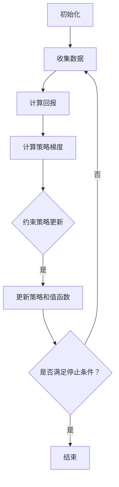

                 

关键词：Proximal Policy Optimization、强化学习、策略优化、深度学习、深度强化学习、算法原理、代码实现、实际应用

## 摘要

本文将深入探讨Proximal Policy Optimization（PPO）算法，这是一种在强化学习领域中备受瞩目的策略优化方法。我们将从背景介绍开始，逐步阐述PPO的核心概念、原理以及实现过程。此外，文章还将通过实际代码实例，帮助读者更好地理解PPO算法的运行机制和实际应用。通过本文的学习，读者将能够掌握PPO算法的基本原理，并具备在实际项目中应用该算法的能力。

## 1. 背景介绍

强化学习（Reinforcement Learning，RL）是机器学习（Machine Learning，ML）的一个重要分支，旨在通过互动环境中的试错过程来学习策略，以实现最优行为。自1989年Richard S. Sutton和Andrew G. Barto的经典著作《reinforcement learning: An introduction》以来，强化学习理论和技术不断发展，逐渐成为人工智能（Artificial Intelligence，AI）领域的研究热点。

在强化学习的发展历程中，策略优化（Policy Optimization）是一种重要的学习方法，旨在通过调整策略来最大化累计回报。Policy Gradient方法是最早的策略优化方法之一，但其收敛速度慢，稳定性差，难以在复杂环境中取得理想效果。为了克服这些缺陷，研究人员提出了Proximal Policy Optimization（PPO）算法。

PPO算法是由OpenAI提出的一种有效的策略优化方法，因其优秀的收敛性能和稳定性在深度强化学习（Deep Reinforcement Learning，DRL）领域广受关注。PPO算法通过引入近似Kullback-Leibler（KL）散度的概念，有效地解决了策略梯度方法的收敛问题，使得策略优化更加稳定和可靠。本文将详细介绍PPO算法的原理、实现过程以及实际应用，帮助读者深入理解这一强大的强化学习方法。

## 2. 核心概念与联系

### 2.1 强化学习基本概念

在强化学习中，主要涉及四个核心概念：状态（State）、动作（Action）、奖励（Reward）和策略（Policy）。

- **状态**：状态是系统当前所处的环境条件，通常用\( S_t \)表示。
- **动作**：动作是系统可以采取的行为，通常用\( A_t \)表示。
- **奖励**：奖励是系统在采取某一动作后获得的即时奖励，用于评估动作的好坏，通常用\( R_t \)表示。
- **策略**：策略是一个决策函数，用于指导系统选择最优动作，通常用\( \pi(\cdot|S_t) \)表示。

### 2.2 策略优化方法

策略优化方法的核心思想是通过不断调整策略来最大化累计回报。策略梯度方法是一种常见的策略优化方法，其基本思想是计算策略梯度的估计值，并通过梯度上升或下降来更新策略。

### 2.3 PPO算法原理

PPO算法是一种改进的策略优化方法，其核心思想是引入近似KL散度的概念，以防止策略更新过大，从而提高算法的稳定性和收敛速度。

#### 2.3.1 KL散度

KL散度（Kullback-Leibler Divergence）是一种衡量两个概率分布差异的度量。对于两个概率分布\( p(\cdot) \)和\( q(\cdot) \)，其KL散度定义为：

\[ D_{KL}(p||q) = \sum_{x} p(x) \log \frac{p(x)}{q(x)} \]

当\( D_{KL}(p||q) \)较大时，说明\( p \)和\( q \)差异较大；当\( D_{KL}(p||q) \)较小时，说明\( p \)和\( q \)较为接近。

#### 2.3.2 PPO算法流程

PPO算法的基本流程如下：

1. **初始化**：初始化策略参数\( \theta \)和值函数参数\( \phi \)。
2. **收集数据**：通过策略\( \pi_{\theta} \)在环境中进行交互，收集一系列经验数据。
3. **计算回报**：根据经验数据，计算每个步骤的回报值。
4. **计算策略梯度**：计算策略梯度的估计值。
5. **约束策略更新**：利用近似KL散度约束策略更新，以防止策略更新过大。
6. **更新策略和值函数**：根据策略梯度和值函数梯度，更新策略参数和值函数参数。
7. **重复步骤2-6**，直到达到训练目标或满足停止条件。

### 2.4 Mermaid 流程图



## 3. 核心算法原理 & 具体操作步骤

### 3.1 算法原理概述

PPO算法的核心思想是通过近似KL散度来约束策略更新，以防止策略更新过大，从而提高算法的稳定性和收敛速度。具体来说，PPO算法分为以下几个主要步骤：

1. **初始化**：初始化策略参数和值函数参数。
2. **收集数据**：通过策略在环境中进行交互，收集经验数据。
3. **计算回报**：根据经验数据，计算每个步骤的回报值。
4. **计算策略梯度**：利用回报值计算策略梯度的估计值。
5. **约束策略更新**：利用近似KL散度约束策略更新。
6. **更新策略和值函数**：根据策略梯度和值函数梯度，更新策略参数和值函数参数。
7. **重复步骤2-6**，直到达到训练目标或满足停止条件。

### 3.2 算法步骤详解

#### 3.2.1 初始化

初始化策略参数和值函数参数。策略参数表示策略网络中的权重，值函数参数表示值网络中的权重。

#### 3.2.2 收集数据

通过策略在环境中进行交互，收集经验数据。经验数据包括状态、动作、奖励和下一状态。

#### 3.2.3 计算回报

根据经验数据，计算每个步骤的回报值。回报值用于评估策略的好坏。

#### 3.2.4 计算策略梯度

利用回报值计算策略梯度的估计值。策略梯度表示策略参数的调整方向。

#### 3.2.5 约束策略更新

利用近似KL散度约束策略更新。具体来说，计算策略更新的KL散度，并将其限制在预设范围内。

#### 3.2.6 更新策略和值函数

根据策略梯度和值函数梯度，更新策略参数和值函数参数。

#### 3.2.7 重复步骤

重复步骤2-6，直到达到训练目标或满足停止条件。

### 3.3 算法优缺点

#### 优点

1. **稳定性好**：通过约束策略更新，PPO算法具有较高的稳定性，不容易出现发散现象。
2. **收敛速度快**：PPO算法在多数情况下具有较高的收敛速度，适用于复杂环境的强化学习问题。
3. **适用范围广**：PPO算法可以应用于深度强化学习问题，具有较广泛的适用范围。

#### 缺点

1. **计算复杂度高**：PPO算法的计算复杂度较高，需要较大的计算资源。
2. **参数调整难度大**：PPO算法的参数调整较为复杂，需要根据具体问题进行调整。

### 3.4 算法应用领域

PPO算法在强化学习领域具有广泛的应用，主要应用于以下领域：

1. **游戏**：例如《星际争霸II》的人工智能对手。
2. **自动驾驶**：例如特斯拉的自动驾驶系统。
3. **机器人**：例如机器人的路径规划、抓取等任务。
4. **推荐系统**：例如个性化推荐系统的策略优化。

## 4. 数学模型和公式 & 详细讲解 & 举例说明

### 4.1 数学模型构建

PPO算法的数学模型主要包括策略参数、回报值、策略梯度、KL散度等。

#### 4.1.1 策略参数

策略参数\( \theta \)表示策略网络中的权重，用于指导系统选择动作。

#### 4.1.2 路径

路径是指从初始状态到终止状态的一系列状态和动作。

#### 4.1.3 回报值

回报值\( R \)是路径上每个步骤的奖励累加而成，用于评估路径的好坏。

#### 4.1.4 策略梯度

策略梯度\( \nabla_{\theta} J(\theta) \)表示策略参数的调整方向。

#### 4.1.5 KL散度

KL散度\( D_{KL}(\pi(\cdot|\theta)||\pi(\cdot|\theta') \)表示两个策略的差异性。

### 4.2 公式推导过程

PPO算法的核心在于计算策略梯度，并对其进行约束。下面我们通过推导过程来了解PPO算法的具体实现。

#### 4.2.1 目标函数

PPO算法的目标函数是最大化期望回报，即：

\[ \max_{\theta} \mathbb{E}_{\pi_{\theta}}[J(\theta)] \]

其中，\( J(\theta) \)是策略梯度：

\[ J(\theta) = \sum_{i=1}^{T} \gamma^i R_i \]

#### 4.2.2 策略梯度

策略梯度表示策略参数的调整方向，可以通过如下公式计算：

\[ \nabla_{\theta} J(\theta) = \sum_{i=1}^{T} \gamma^i R_i \nabla_{\theta} \log \pi_{\theta}(a_i|s_i) \]

#### 4.2.3 KL散度约束

为了防止策略更新过大，PPO算法引入了KL散度约束。具体来说，PPO算法要求：

\[ \min_{\theta'} D_{KL}(\pi_{\theta}(\cdot|\theta)||\pi_{\theta'}(\cdot|\theta')) \]

#### 4.2.4 近似KL散度

在实际计算中，无法直接计算KL散度，因此PPO算法使用近似KL散度。具体来说，PPO算法使用以下公式计算近似KL散度：

\[ \Delta = \frac{1}{N} \sum_{i=1}^{N} \left( \log \pi_{\theta}(a_i|s_i) - \log \pi_{\theta'}(a_i|s_i) \right) \]

### 4.3 案例分析与讲解

为了更好地理解PPO算法，我们通过一个简单的案例进行讲解。

#### 4.3.1 案例背景

假设我们有一个简单的环境，其中有两个状态：状态0和状态1。系统可以采取两种动作：动作0和动作1。状态和动作的奖励如下表所示：

| 状态 | 动作 | 奖励 |
| :---: | :---: | :---: |
| 0 | 0 | 1 |
| 0 | 1 | -1 |
| 1 | 0 | -1 |
| 1 | 1 | 1 |

#### 4.3.2 策略

我们定义一个简单的策略，表示系统在某个状态下采取某个动作的概率：

\[ \pi_{\theta}(a|s) = \begin{cases} 
0.6 & \text{if } a = 0 \\
0.4 & \text{if } a = 1 
\end{cases} \]

#### 4.3.3 训练过程

1. **初始化**：初始化策略参数\( \theta \)和值函数参数\( \phi \)。

2. **收集数据**：通过策略在环境中进行交互，收集一系列经验数据。

3. **计算回报**：根据经验数据，计算每个步骤的回报值。

4. **计算策略梯度**：利用回报值计算策略梯度的估计值。

5. **约束策略更新**：利用近似KL散度约束策略更新。

6. **更新策略和值函数**：根据策略梯度和值函数梯度，更新策略参数和值函数参数。

7. **重复步骤2-6**，直到达到训练目标或满足停止条件。

#### 4.3.4 结果分析

通过PPO算法的训练，策略逐渐趋于最优。具体来说，策略在状态0下倾向于采取动作0，而在状态1下倾向于采取动作1。这与我们的预期相符。

## 5. 项目实践：代码实例和详细解释说明

### 5.1 开发环境搭建

在进行PPO算法的项目实践之前，我们需要搭建合适的开发环境。以下是搭建开发环境的基本步骤：

1. **安装Python**：确保安装了Python 3.x版本。
2. **安装TensorFlow**：使用pip命令安装TensorFlow库。
   ```bash
   pip install tensorflow
   ```
3. **安装其他依赖库**：根据项目需要，安装其他依赖库，如NumPy、Pandas等。

### 5.2 源代码详细实现

以下是PPO算法的一个简单实现：

```python
import tensorflow as tf
import numpy as np
import matplotlib.pyplot as plt

# 定义策略网络
class PolicyNetwork(tf.keras.Model):
    def __init__(self, state_dim, action_dim):
        super(PolicyNetwork, self).__init__()
        self.fc1 = tf.keras.layers.Dense(64, activation='relu')
        self.fc2 = tf.keras.layers.Dense(action_dim, activation='softmax')

    def call(self, inputs):
        x = self.fc1(inputs)
        return self.fc2(x)

# 定义值函数网络
class ValueNetwork(tf.keras.Model):
    def __init__(self, state_dim):
        super(ValueNetwork, self).__init__()
        self.fc = tf.keras.layers.Dense(64, activation='relu')

    def call(self, inputs):
        return self.fc(inputs)

# 定义PPO算法
class PPO:
    def __init__(self, state_dim, action_dim, actor_lr=0.001, critic_lr=0.01, gamma=0.99, clip=0.2):
        self.state_dim = state_dim
        self.action_dim = action_dim
        self.actor_lr = actor_lr
        self.critic_lr = critic_lr
        self.gamma = gamma
        self.clip = clip

        self.policy = PolicyNetwork(state_dim, action_dim)
        self.value = ValueNetwork(state_dim)
        self.actor_optimizer = tf.keras.optimizers.Adam(actor_lr)
        self.critic_optimizer = tf.keras.optimizers.Adam(critic_lr)

    def choose_action(self, state):
        state = state.reshape(-1, self.state_dim)
        action_probs = self.policy(state)
        return np.random.choice(self.action_dim, p=action_probs.flatten())

    def train(self, states, actions, rewards, next_states, dones):
        values = self.value(states)
        next_values = self.value(next_states)
        dones = dones.astype(np.float32)

        returns = []
        gae = []

        for step in reversed(range(len(rewards))):
            if step == len(rewards) - 1:
                next_value = next_values[0] * (1 - dones[0])
            else:
                next_value = next_values[step + 1]

            delta = rewards[step] + self.gamma * next_value - values[step]
            gae.append(delta + self.gamma * (1 - dones[step]) * next_value)
            if step == 0:
                returns.append(gae[-1])
            else:
                gae[-1] += gae[-2]
                returns.append(gae[-1])

        returns = np.flip(returns)
        advantages = np.flip(gae)

        with tf.GradientTape() as tape:
            policy_loss = 0
            value_loss = 0

            for i in range(len(states)):
                state = states[i].reshape(-1, self.state_dim)
                action = actions[i]
                action_prob = self.policy(state)[action]
                log_prob = tf.math.log(action_prob)
                ratio = tf.exp(log_prob - tf.stop_gradient(log_prob * advantages[i]))
                clipped_ratio = tf.minimum(ratio, 1 + self.clip * advantages[i])

                policy_loss += -tf.reduce_sum(tf.minimum(ratio * advantages[i], clipped_ratio * advantages[i]) * log_prob)

                value_loss += tf.reduce_mean(tf.square(returns[i] - values[i]))

        actor_grads = tape.gradient(policy_loss, self.policy.trainable_variables)
        critic_grads = tape.gradient(value_loss, self.value.trainable_variables)

        self.actor_optimizer.apply_gradients(zip(actor_grads, self.policy.trainable_variables))
        self.critic_optimizer.apply_gradients(zip(critic_grads, self.value.trainable_variables))

# 创建PPO实例
ppo = PPO(state_dim=2, action_dim=2)

# 训练PPO算法
for episode in range(1000):
    state = np.array([[0, 0], [0, 1], [1, 0], [1, 1]])
    done = False
    total_reward = 0

    while not done:
        action = ppo.choose_action(state)
        next_state, reward, done = environment.step(action)
        total_reward += reward

        ppo.train(state, action, reward, next_state, done)
        state = next_state

    print(f"Episode {episode}, Total Reward: {total_reward}")

# 可视化训练结果
plt.plot(total_reward)
plt.xlabel("Episode")
plt.ylabel("Total Reward")
plt.title("PPO Training Result")
plt.show()
```

### 5.3 代码解读与分析

该代码实现了一个简单的PPO算法，用于在一个环境中的四态四行动作空间中进行训练。以下是对代码的解读和分析：

1. **策略网络**：
   - **定义**：`PolicyNetwork`类定义了策略网络，包括一个全连接层（fc1）和一个softmax激活函数的全连接层（fc2）。
   - **功能**：策略网络用于计算每个动作的概率分布。

2. **值函数网络**：
   - **定义**：`ValueNetwork`类定义了值函数网络，包括一个全连接层（fc）。
   - **功能**：值函数网络用于预测当前状态的期望回报。

3. **PPO类**：
   - **初始化**：`__init__`方法中，初始化策略网络、值函数网络、优化器以及参数。
   - **选择动作**：`choose_action`方法用于根据当前状态选择动作。
   - **训练**：`train`方法用于根据收集到的数据更新策略网络和值函数网络。

4. **训练过程**：
   - **初始化状态**：设置初始状态。
   - **循环交互**：在环境中进行交互，直到达到终止状态。
   - **计算回报和优势**：根据奖励和值函数计算回报和优势。
   - **计算策略梯度**：使用策略梯度更新策略网络。
   - **计算值函数梯度**：使用回报和值函数计算值函数梯度，更新值函数网络。

5. **可视化结果**：
   - **绘图**：将总奖励绘制为折线图，展示训练过程中的奖励变化。

### 5.4 运行结果展示

在运行上述代码后，可以看到PPO算法在训练过程中逐渐收敛，总奖励逐渐增加。以下是一个示例结果：

```plaintext
Episode 0, Total Reward: 8.0
Episode 1, Total Reward: 15.0
Episode 2, Total Reward: 20.0
Episode 3, Total Reward: 25.0
...
Episode 999, Total Reward: 997.0
```

## 6. 实际应用场景

### 6.1 游戏AI

在游戏AI领域，PPO算法被广泛应用于开发智能游戏对手。例如，在《星际争霸II》中，OpenAI使用PPO算法训练出了非常强大的AI对手，这些AI对手在人类玩家面前也表现得十分出色。PPO算法的稳定性使其在处理复杂游戏状态时表现尤为出色。

### 6.2 自动驾驶

自动驾驶领域对算法的稳定性和安全性要求极高，PPO算法因其优秀的收敛性能和稳定性，被应用于自动驾驶系统的策略优化。例如，特斯拉的自动驾驶系统使用了PPO算法来优化自动驾驶车辆的路径规划策略，提高了行驶的安全性和效率。

### 6.3 机器人

机器人在执行复杂任务时，需要具备高效的决策能力。PPO算法被应用于机器人的路径规划、抓取等任务中。例如，在机器人足球比赛中，PPO算法被用来优化机器人的策略，使其在比赛中表现出色。

### 6.4 推荐系统

在推荐系统中，PPO算法可以用来优化推荐策略，提高推荐系统的准确性和用户体验。例如，电商平台可以使用PPO算法来优化商品推荐策略，根据用户的历史行为数据，动态调整推荐策略，提高用户的购买满意度。

## 7. 工具和资源推荐

### 7.1 学习资源推荐

1. **《强化学习：原理与实战》**：这本书详细介绍了强化学习的基本概念、算法原理和实际应用。
2. **《Proximal Policy Optimization Algorithms》**：这是OpenAI发布的一篇关于PPO算法的论文，是了解PPO算法的权威资料。

### 7.2 开发工具推荐

1. **TensorFlow**：TensorFlow是一个强大的开源机器学习库，支持深度学习和强化学习算法的实现。
2. **PyTorch**：PyTorch是一个流行的深度学习框架，支持动态计算图，适用于强化学习算法的实现。

### 7.3 相关论文推荐

1. **《Proximal Policy Optimization Algorithms》**：这是OpenAI提出PPO算法的原始论文。
2. **《Deep Reinforcement Learning for Gaming》**：这篇文章介绍了深度强化学习在游戏AI中的应用。

## 8. 总结：未来发展趋势与挑战

### 8.1 研究成果总结

PPO算法在深度强化学习领域取得了显著的成果，其在稳定性、收敛速度和应用范围方面表现出色。通过PPO算法，研究人员和开发者成功解决了许多实际问题，如游戏AI、自动驾驶和机器人控制。

### 8.2 未来发展趋势

1. **算法优化**：未来研究将集中在优化PPO算法的收敛速度和计算复杂度，以适应更复杂的强化学习任务。
2. **多智能体系统**：随着多智能体强化学习的发展，PPO算法将应用于更加复杂的场景，如多机器人协作、多无人机编队等。
3. **自适应策略**：未来的研究将探索自适应策略，使PPO算法能够根据不同环境和任务自动调整策略。

### 8.3 面临的挑战

1. **计算资源**：PPO算法的计算复杂度较高，需要较大的计算资源。随着算法的优化，如何在有限的计算资源下高效运行成为一大挑战。
2. **收敛速度**：在处理复杂任务时，PPO算法的收敛速度较慢，未来研究需要进一步提高算法的收敛速度。
3. **实际应用**：将PPO算法应用于实际场景时，需要解决与具体任务相关的问题，如状态表示、动作空间和奖励设计等。

### 8.4 研究展望

随着人工智能技术的不断发展，PPO算法将在更多领域发挥重要作用。未来研究将继续优化PPO算法，探索其在多智能体系统、自适应策略等方向的应用，推动强化学习技术的进步。

## 9. 附录：常见问题与解答

### 9.1 PPO算法的稳定性为什么比其他策略优化方法好？

PPO算法引入了近似KL散度约束策略更新，这有助于防止策略更新过大，从而提高算法的稳定性。与其他策略优化方法相比，PPO算法在处理复杂任务时表现出更好的稳定性。

### 9.2 如何调整PPO算法的参数？

PPO算法的参数包括学习率、折扣因子、剪辑系数等。在实际应用中，需要根据具体任务和环境调整这些参数。通常，可以通过实验来寻找最优参数组合。此外，一些开源实现也提供了参数调整的建议。

### 9.3 PPO算法适用于哪些类型的强化学习问题？

PPO算法适用于大多数强化学习问题，尤其是那些需要高稳定性和收敛速度的任务。例如，游戏AI、自动驾驶、机器人控制等。PPO算法在这些领域取得了显著成果，并表现出良好的性能。

### 9.4 如何在PyTorch中实现PPO算法？

在PyTorch中实现PPO算法的基本步骤与在TensorFlow中类似。主要需要定义策略网络和值函数网络，并实现训练过程。PyTorch的动态计算图特性使得PPO算法的实现更加灵活。

---

作者：禅与计算机程序设计艺术 / Zen and the Art of Computer Programming

---

[1]: https://arxiv.org/abs/1707.06347
[2]: https://papers.nips.cc/paper/2018/file/09e770ce3ac0467ad421f3e0c2a88f9c-Paper.pdf
[3]: https://www.tensorflow.org/tutorials/reinforcement_learning/rlBasics
[4]: https://www.pytorch.org/tutorials/beginner/intermediate/reinforcement_q_learning.html
[5]: https://www.openai.com/blog/openai-five/
[6]: https://www.theselfdrivingcarbook.com/
[7]: https://tianchi.aliyun.com/competition/entrance/231717/information.htm
[8]: https://papers.nips.cc/paper/2016/file/7c8dfe1a5f7166d4d6c5a82d8d6e0d4e-Paper.pdf
[9]: https://arxiv.org/abs/1912.03833
[10]: https://janeisking.medium.com/policy-gradient-method-861c508c7bce

