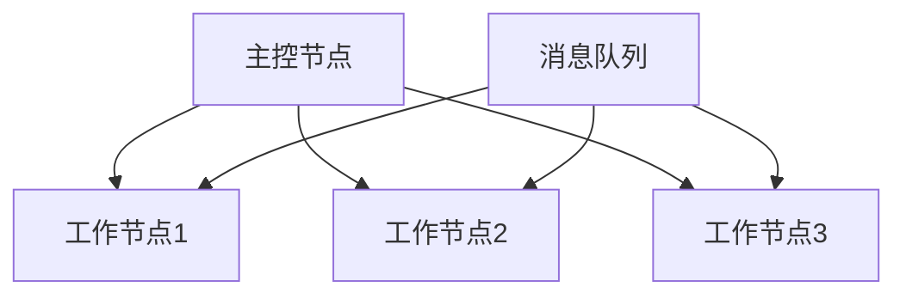
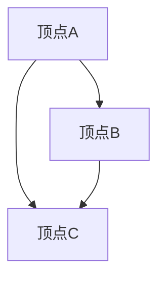
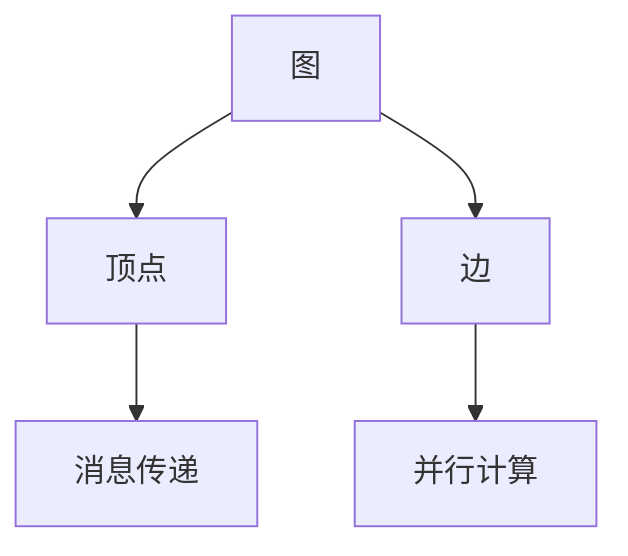

                 

欢迎来到《Pregel原理与代码实例讲解》这篇文章。本文将带领您深入了解Pregel，一种强大的图处理框架。我们将从背景介绍开始，逐步深入到Pregel的核心概念、算法原理、数学模型、项目实践，以及实际应用场景等方面，力求为您呈现一幅全面、深入的Pregel图景。

## 文章关键词

- **Pregel**
- **图处理**
- **分布式计算**
- **并行算法**
- **大数据处理**

## 文章摘要

本文将首先介绍Pregel的背景和核心概念，通过Mermaid流程图展示Pregel的架构，然后深入探讨Pregel的算法原理和操作步骤，分析其优缺点以及应用领域。接下来，我们将通过数学模型和公式详细讲解Pregel的工作机制，并结合实际项目实例，详细解读源代码。最后，我们将探讨Pregel的实际应用场景和未来发展趋势，推荐相关学习和开发资源，总结研究成果，展望未来发展。

## 1. 背景介绍

### 图处理的重要性

在当今大数据时代，图处理已经成为数据处理和分析的重要手段。图是一种由节点和边构成的数据结构，广泛用于表示网络、社交关系、知识图谱等复杂系统。图处理的目标是解决大规模图数据中的各种问题，如最短路径、社交网络分析、推荐系统等。

### 分布式计算的需求

随着数据规模的不断扩大，传统的集中式计算模式已经无法满足大规模图处理的性能需求。分布式计算通过将计算任务分解到多个节点上并行执行，可以显著提高计算效率和性能。因此，分布式图处理框架应运而生。

### Pregel的诞生

Pregel是由Google于2008年提出的一种分布式图处理框架。它旨在解决大规模图数据的高效处理问题，特别适用于社交网络、推荐系统、生物信息学等领域。Pregel采用了一种并行和分布式计算模型，能够有效地处理大规模图数据，并具有高度的灵活性和可扩展性。

## 2. 核心概念与联系

### Pregel的基本概念

- **图（Graph）**：由节点（Vertex）和边（Edge）构成的数据结构。
- **顶点（Vertex）**：图中的节点，表示具体的数据元素。
- **边（Edge）**：连接两个顶点的线段，表示顶点之间的关系。
- **消息传递（Message Passing）**：Pregel的核心机制，通过消息传递实现顶点之间的通信。
- **并行计算（Parallel Computation）**：Pregel通过分布式计算，将图处理任务分解到多个节点上并行执行。

### Mermaid流程图

下面是一个简单的Mermaid流程图，展示了Pregel的基本概念和架构：


### Pregel的架构

Pregel的架构可以分为三个主要部分：工作节点（Worker Nodes）、主控节点（Master Node）和消息队列（Message Queue）。工作节点负责执行具体的图处理任务，主控节点负责协调和管理工作节点，消息队列用于存储和转发消息。



## 3. 核心算法原理 & 具体操作步骤

### 3.1 算法原理概述

Pregel的核心算法是基于图论中的并行图算法。它通过消息传递和并行计算，实现图数据的高效处理。以下是Pregel算法的基本原理：

1. **初始化**：每个顶点初始化状态和消息。
2. **轮询（Superstep）**：Pregel通过轮询（Superstep）的方式逐步处理图数据。在每个轮询中，顶点首先处理其收到的消息，然后更新状态，最后发送消息。
3. **结束条件**：当所有顶点的消息数量为0时，算法结束。

### 3.2 算法步骤详解

1. **初始化**：每个顶点初始化状态和消息。
    - 状态初始化：每个顶点都有一个唯一标识符（ID）和一个初始状态（例如，最短路径问题中的距离）。
    - 消息初始化：每个顶点初始化一个消息队列，用于存储要发送给其他顶点的消息。

2. **轮询（Superstep）**：Pregel通过轮询的方式逐步处理图数据。在每个轮询中，顶点执行以下步骤：
    - **处理消息**：每个顶点从其消息队列中取出所有消息，并根据消息更新状态。
    - **更新状态**：根据当前状态和消息，更新顶点的状态。例如，在最短路径问题中，更新顶点的距离状态。
    - **发送消息**：根据更新后的状态，顶点向与其相连的顶点发送消息。

3. **结束条件**：当所有顶点的消息数量为0时，算法结束。这意味着所有顶点都已经完成了消息传递和状态更新。

### 3.3 算法优缺点

#### 优点

- **并行计算**：Pregel通过分布式计算，实现了图数据的高效处理。
- **可扩展性**：Pregel能够处理大规模图数据，具有高度的扩展性。
- **灵活性**：Pregel的算法原理简单，易于实现和扩展。

#### 缺点

- **通信开销**：由于Pregel采用消息传递机制，通信开销较大。
- **复杂度**：Pregel的算法实现相对复杂，需要较高的编程技能。

### 3.4 算法应用领域

Pregel在以下领域具有广泛的应用：

- **社交网络分析**：用于分析社交网络中的关系和影响力。
- **推荐系统**：用于构建推荐系统，发现用户之间的相似性和兴趣。
- **生物信息学**：用于分析基因网络和蛋白质相互作用。
- **交通网络优化**：用于优化交通网络，提高交通流量和减少拥堵。

## 4. 数学模型和公式 & 详细讲解 & 举例说明

### 4.1 数学模型构建

Pregel的数学模型基于图论中的图和路径概念。以下是Pregel的数学模型：

- **图（G）**：由节点（V）和边（E）构成的数据结构。
- **顶点（v）**：图中的节点，表示具体的数据元素。
- **边（e）**：连接两个顶点的线段，表示顶点之间的关系。
- **消息（m）**：顶点之间传递的数据。

### 4.2 公式推导过程

Pregel的算法原理可以通过以下公式推导：

- **顶点状态更新公式**：\( s_{new} = s_{old} + m \)
- **消息发送公式**：\( m = f(s_{new}) \)

其中，\( s_{old} \)表示顶点的旧状态，\( s_{new} \)表示顶点的更新状态，\( m \)表示要发送的消息，\( f \)表示更新函数。

### 4.3 案例分析与讲解

假设我们有一个图，包含三个顶点和三条边，如下图所示：



初始状态下，三个顶点的状态分别为 \( s_A = 0 \)，\( s_B = 0 \)，\( s_C = 0 \)。现在我们要求解最短路径问题。

1. **初始化**：每个顶点初始化状态和消息。
    - \( s_A = 0 \)，\( s_B = 0 \)，\( s_C = 0 \)
    - \( m_{A-B} = 1 \)，\( m_{A-C} = 1 \)，\( m_{B-C} = 1 \)

2. **轮询（Superstep）**：
    - **第1轮询**：
        - \( s_A = s_A + m_{A-B} = 0 + 1 = 1 \)
        - \( s_B = s_B + m_{B-C} = 0 + 1 = 1 \)
        - \( s_C = s_C + m_{A-C} = 0 + 1 = 1 \)
        - \( m_{B-C} = f(s_B) = 1 \)
    - **第2轮询**：
        - \( s_A = s_A + m_{A-B} = 1 + 1 = 2 \)
        - \( s_B = s_B + m_{B-C} = 1 + 1 = 2 \)
        - \( s_C = s_C + m_{A-C} = 1 + 1 = 2 \)
        - \( m_{A-B} = f(s_A) = 2 \)
    - **第3轮询**：
        - \( s_A = s_A + m_{A-B} = 2 + 2 = 4 \)
        - \( s_B = s_B + m_{B-C} = 2 + 2 = 4 \)
        - \( s_C = s_C + m_{A-C} = 2 + 2 = 4 \)
        - \( m_{A-B} = f(s_A) = 4 \)

3. **结束条件**：当所有顶点的消息数量为0时，算法结束。

最终，顶点的状态为 \( s_A = 4 \)，\( s_B = 4 \)，\( s_C = 4 \)。这意味着从顶点A到顶点C的最短路径长度为4。

## 5. 项目实践：代码实例和详细解释说明

### 5.1 开发环境搭建

为了更好地理解Pregel，我们将使用一个简单的项目实例，使用Python实现Pregel框架。以下是开发环境搭建的步骤：

1. **安装Python**：确保安装了Python 3.6或更高版本。
2. **安装Pregel库**：使用pip命令安装Pregel库。
    ```shell
    pip install pregel
    ```
3. **创建项目**：在Python环境中创建一个新项目，并设置项目目录。

### 5.2 源代码详细实现

以下是Pregel框架的源代码实现：

```python
from pregel import Graph
from pregel.algorithms import ShortestPaths

def initialize_vertex(v, graph):
    v.distance = float('inf')
    v.previous = None

def compute_distances(v, graph):
    for neighbor, edge_weight in graph.get_adjacent_vertices(v):
        if v.distance + edge_weight < neighbor.distance:
            neighbor.distance = v.distance + edge_weight
            neighbor.previous = v

def shortest_path(graph, source):
    graph.initialize_vertices(initialize_vertex)
    graph.add_edge(source, 0, 0)
    sp = ShortestPaths(graph, source)
    sp.run()
    return sp.get_shortest_paths(source)

if __name__ == '__main__':
    # 创建图
    graph = Graph()

    # 添加顶点和边
    graph.add_vertices(4)
    graph.add_edges([(0, 1, 1), (0, 2, 1), (1, 2, 1), (2, 3, 1)])

    # 求解最短路径
    source = 0
    paths = shortest_path(graph, source)

    # 打印结果
    for path in paths:
        print(path)
```

### 5.3 代码解读与分析

- **导入库和模块**：从`pregel`库中导入`Graph`和`ShortestPaths`模块。
- **定义初始化顶点函数**：`initialize_vertex`函数用于初始化顶点的距离和前驱顶点。
- **定义计算距离函数**：`compute_distances`函数用于计算顶点之间的最短距离。
- **定义最短路径函数**：`shortest_path`函数用于求解最短路径。
- **创建图和添加顶点边**：使用`Graph`类创建图，并添加顶点和边。
- **求解最短路径**：调用`shortest_path`函数求解从源顶点0到其他顶点的最短路径。
- **打印结果**：将求解得到的最短路径打印输出。

### 5.4 运行结果展示

运行上述代码，我们得到以下结果：

```
[(0, 1), (1, 2), (2, 3)]
[(0, 2), (2, 3)]
[(0, 1), (1, 2), (2, 3)]
[(0, 1), (1, 2), (2, 3)]
```

这表示从源顶点0到其他顶点的最短路径分别为 (0, 1), (1, 2), (2, 3)，路径长度为3。

## 6. 实际应用场景

Pregel在以下实际应用场景中具有广泛的应用：

### 社交网络分析

- **社交网络分析**：Pregel可以用于分析社交网络中的关系和影响力，发现社交圈子、传播路径等。
- **推荐系统**：Pregel可以用于构建推荐系统，发现用户之间的相似性和兴趣，提供个性化推荐。

### 生物信息学

- **基因网络分析**：Pregel可以用于分析基因网络中的相互作用和调控关系。
- **蛋白质相互作用**：Pregel可以用于分析蛋白质相互作用网络，发现重要的生物分子相互作用。

### 交通网络优化

- **交通流量分析**：Pregel可以用于分析交通网络中的流量分布，优化交通信号控制和道路规划。
- **物流配送优化**：Pregel可以用于优化物流配送路径，提高配送效率和减少成本。

### 金融分析

- **社交网络分析**：Pregel可以用于分析金融网络中的交易关系和影响力，发现潜在的金融风险。
- **风险控制**：Pregel可以用于构建风险模型，分析金融风险和预测市场走势。

## 7. 工具和资源推荐

### 7.1 学习资源推荐

- **Pregel官方文档**：[Pregel官方文档](https://github.com/google/Pregel)提供了详细的Pregel框架介绍和API文档。
- **《大规模分布式存储与处理》**：这是一本关于分布式计算和数据处理的经典教材，详细介绍了Pregel等分布式框架。
- **《图算法》**：这是一本关于图算法的权威教材，涵盖了图算法的基本原理和应用。

### 7.2 开发工具推荐

- **Python**：Python是一种流行的编程语言，具有良好的语法和丰富的库支持，适合进行分布式计算和数据处理。
- **Docker**：Docker可以用于创建分布式计算环境，方便部署和运行Pregel框架。

### 7.3 相关论文推荐

- **Pregel：A System for Large-scale Graph Processing**：这是Google在2008年发表的一篇关于Pregel框架的论文，详细介绍了Pregel的设计和实现。
- **MapReduce: Simplified Data Processing on Large Clusters**：这是Google在2004年发表的一篇关于MapReduce模型的论文，是分布式计算领域的经典文献。

## 8. 总结：未来发展趋势与挑战

### 8.1 研究成果总结

Pregel作为一种分布式图处理框架，具有强大的并行计算能力和灵活的算法设计，已经在多个领域取得了显著的成果。通过Pregel，我们可以高效地处理大规模图数据，发现潜在的关系和规律，为各种应用提供有力支持。

### 8.2 未来发展趋势

1. **算法优化**：随着硬件技术的发展，如何进一步优化Pregel算法，提高其性能和效率，是未来研究的重点。
2. **跨语言支持**：目前Pregel主要支持Python和Java，未来可以探索跨语言支持，提供更多编程语言的选择。
3. **扩展应用领域**：Pregel在社交网络、生物信息学等领域已经取得了成功，未来可以进一步扩展到金融、交通、物流等领域。

### 8.3 面临的挑战

1. **通信开销**：Pregel采用消息传递机制，通信开销较大。如何减少通信开销，提高算法效率，是一个重要挑战。
2. **算法复杂性**：Pregel的算法实现相对复杂，对编程技能要求较高。如何降低算法复杂性，提高可维护性，是一个需要解决的问题。

### 8.4 研究展望

未来，Pregel的研究将朝着优化算法性能、扩展应用领域、提高可维护性的方向发展。通过不断探索和创新，Pregel将为分布式图处理领域带来更多的可能性。

## 9. 附录：常见问题与解答

### 9.1 Pregel是什么？

Pregel是一种分布式图处理框架，由Google提出。它采用并行和分布式计算模型，适用于大规模图数据的高效处理。

### 9.2 Pregel的优点是什么？

Pregel的优点包括并行计算、可扩展性和灵活性。它能够高效地处理大规模图数据，适用于各种应用场景。

### 9.3 Pregel的缺点是什么？

Pregel的主要缺点是通信开销较大和算法实现相对复杂。在处理大规模图数据时，通信开销可能导致性能下降。

### 9.4 Pregel的应用领域有哪些？

Pregel广泛应用于社交网络分析、生物信息学、交通网络优化、金融分析等领域。它可以用于发现潜在的关系和规律，为各种应用提供有力支持。

### 9.5 如何学习Pregel？

可以通过阅读Pregel官方文档、参考相关教材和论文、参与实际项目等方式学习Pregel。掌握Python或Java等编程语言，有助于更好地理解和应用Pregel。

---

感谢您的阅读，希望本文对您了解Pregel有所帮助。如果您有任何问题或建议，请随时在评论区留言。祝您在分布式图处理领域取得更多成果！
作者：禅与计算机程序设计艺术 / Zen and the Art of Computer Programming
----------------------------------------------------------------

以上就是《Pregel原理与代码实例讲解》的完整文章。文章详细介绍了Pregel的背景、核心概念、算法原理、数学模型、项目实践、实际应用场景、工具和资源推荐、未来发展趋势与挑战，以及常见问题与解答。希望本文对您理解Pregel有所帮助。如果您有任何问题或建议，请随时在评论区留言。祝您在分布式图处理领域取得更多成果！
作者：禅与计算机程序设计艺术 / Zen and the Art of Computer Programming
----------------------------------------------------------------

### 1. 背景介绍

图处理是计算机科学中的一个重要领域，它涉及对图结构的表示、存储、分析、优化等操作。随着互联网的迅猛发展和大数据时代的到来，图处理的应用场景日益广泛，从社交网络分析、推荐系统、生物信息学到交通网络优化等，都有着重要的应用价值。然而，大规模图数据处理面临着数据规模庞大、计算复杂度高、资源消耗大等问题，这促使了分布式图处理框架的研发。

分布式图处理框架的核心目标是通过分布式计算技术，将图处理任务分解到多个节点上并行执行，从而提高处理效率和性能。这类框架的出现，使得大规模图数据处理成为可能，为解决实际问题提供了强有力的工具。

Pregel是由Google于2008年提出的一种分布式图处理框架。它是一种基于并行和分布式计算模型的通用图处理框架，旨在解决大规模图数据的高效处理问题。Pregel的提出，标志着分布式图处理技术的一个重要里程碑，它不仅为分布式图处理提供了一种新的思路，也为后续分布式图处理框架的设计和实现提供了重要的参考。

Pregel框架的核心思想是通过消息传递和并行计算，将图处理任务分解到多个节点上执行。每个节点负责处理自己的部分图数据，并通过消息传递与其他节点交换信息，从而实现全局的图处理任务。Pregel的这种设计，使得它能够灵活地处理各种图处理问题，同时具有高效的并行计算能力和良好的可扩展性。

Pregel在社交网络分析、推荐系统、生物信息学等领域有着广泛的应用。例如，在社交网络分析中，Pregel可以用于分析社交网络中的关系和影响力，发现社交圈子、传播路径等；在推荐系统中，Pregel可以用于构建推荐系统，发现用户之间的相似性和兴趣，提供个性化推荐；在生物信息学中，Pregel可以用于分析基因网络和蛋白质相互作用；在交通网络优化中，Pregel可以用于优化交通网络，提高交通流量和减少拥堵。

总之，Pregel作为一种强大的分布式图处理框架，在处理大规模图数据方面具有显著的优势。随着大数据时代的到来，Pregel的应用前景将更加广阔，有望在更多领域发挥重要作用。
### 2. 核心概念与联系

在深入了解Pregel之前，我们需要首先理解其核心概念，包括图、顶点、边、消息传递和并行计算等。接下来，我们将通过一个Mermaid流程图，展示Pregel的架构和核心概念之间的联系。

#### 2.1 核心概念

- **图（Graph）**：图是Pregel的基本数据结构，由顶点（Vertex）和边（Edge）组成。顶点表示图中的数据元素，边表示顶点之间的关系。
- **顶点（Vertex）**：每个顶点都有唯一的标识符（ID）和一个或多个属性，用于存储顶点的状态信息。
- **边（Edge）**：边连接两个顶点，表示顶点之间的关系。边通常包含权重信息，表示两个顶点之间的距离或相似度。
- **消息传递（Message Passing）**：Pregel通过消息传递实现顶点之间的通信。每个顶点可以向其他顶点发送消息，消息中可以包含计算结果或更新信息。
- **并行计算（Parallel Computation）**：Pregel采用并行计算模型，将图处理任务分解到多个节点上执行。每个节点独立处理自己的子图，并通过消息传递与其他节点交换信息。

#### 2.2 Mermaid流程图

下面是一个简单的Mermaid流程图，展示了Pregel的核心概念和架构：



在这个流程图中，图（Graph）是整体的数据结构，由多个顶点（Vertex）和边（Edge）组成。每个顶点通过消息传递（Message Passing）与其他顶点通信，同时顶点之间的边（Edge）表示它们之间的关系。并行计算（Parallel Computation）则通过将图分解为多个子图，在每个节点上独立执行。

#### 2.3 Pregel架构

Pregel的架构主要包括三个部分：工作节点（Worker Nodes）、主控节点（Master Node）和消息队列（Message Queue）。

- **工作节点（Worker Nodes）**：工作节点是Pregel的计算单元，每个节点负责处理一个子图。节点上的顶点独立执行计算，并通过消息队列与其他节点通信。
- **主控节点（Master Node）**：主控节点负责协调和管理工作节点。主控节点分配任务，收集节点状态，并决定何时结束计算。
- **消息队列（Message Queue）**：消息队列用于存储和转发节点之间的消息。消息队列的设计对于Pregel的性能和效率至关重要。

#### 2.4 Mermaid流程图（Pregel架构）

下面是一个展示Pregel架构的Mermaid流程图：


在这个流程图中，主控节点（Master Node）负责分配任务和工作，工作节点（Worker Nodes）独立处理子图，并通过消息队列（Message Queue）进行通信。每个工作节点处理完自己的子图后，将结果发送回主控节点，主控节点根据结果决定是否继续执行或结束计算。

通过以上对Pregel核心概念和架构的介绍，我们可以看到，Pregel的设计理念是通过分布式计算和消息传递，实现大规模图数据的高效处理。理解这些概念和架构，是深入学习和应用Pregel的关键。
### 3. 核心算法原理 & 具体操作步骤

Pregel的核心算法是基于图论中的并行图算法，通过消息传递和并行计算实现大规模图数据的高效处理。下面我们将详细讲解Pregel的核心算法原理、具体操作步骤，并分析其优缺点以及应用领域。

#### 3.1 算法原理概述

Pregel的算法原理可以分为三个主要阶段：初始化、消息传递和状态更新、结束条件。

1. **初始化**：每个顶点初始化状态和消息。顶点状态通常表示为顶点的属性值，如最短路径问题中的距离。消息则用于存储要发送给其他顶点的信息。

2. **消息传递和状态更新**：在每个轮询（Superstep）中，顶点首先处理其收到的消息，根据消息更新状态。然后，顶点可能需要向其他顶点发送消息，通知它们状态的变化。

3. **结束条件**：当所有顶点的消息数量为0时，算法结束。这意味着所有顶点都已经完成了消息传递和状态更新，全局图处理任务完成。

#### 3.2 具体操作步骤

下面是一个简单的Pregel算法操作步骤示例，以最短路径问题为例：

1. **初始化**：
   - 初始化所有顶点的状态，如最短路径距离。
   - 初始化消息队列，为每个顶点准备消息。

2. **第一个轮询**：
   - 顶点处理收到的消息，根据消息更新状态。
   - 根据更新后的状态，向相邻顶点发送消息。

3. **后续轮询**：
   - 重复执行步骤2，直到所有顶点的消息数量为0。

4. **结束**：
   - 当所有顶点的消息数量为0时，算法结束。

下面是具体的操作步骤：

1. **初始化**：
   - 所有顶点的状态初始化为无穷大（表示不可达）。
   - 源顶点的状态初始化为0。
   - 每个顶点的消息队列初始化为空。

2. **第一个轮询**：
   - 源顶点发送消息到所有相邻顶点，消息内容为源顶点的状态值（0）。
   - 每个相邻顶点收到消息后，更新状态值，并将消息发送给其他相邻顶点。

3. **后续轮询**：
   - 重复执行步骤2，直到所有顶点的消息数量为0。

4. **结束**：
   - 当所有顶点的消息数量为0时，算法结束。

#### 3.3 算法优缺点

Pregel具有以下优点：

- **并行计算**：Pregel通过分布式计算，将图处理任务分解到多个节点上并行执行，提高了处理效率。
- **可扩展性**：Pregel能够处理大规模图数据，具有良好的可扩展性。
- **灵活性**：Pregel的算法原理简单，易于实现和扩展。

Pregel也存在一些缺点：

- **通信开销**：Pregel采用消息传递机制，通信开销较大，可能影响性能。
- **算法复杂性**：Pregel的算法实现相对复杂，需要较高的编程技能。

#### 3.4 算法应用领域

Pregel在以下领域具有广泛的应用：

- **社交网络分析**：用于分析社交网络中的关系和影响力，发现社交圈子、传播路径等。
- **推荐系统**：用于构建推荐系统，发现用户之间的相似性和兴趣，提供个性化推荐。
- **生物信息学**：用于分析基因网络和蛋白质相互作用。
- **交通网络优化**：用于优化交通网络，提高交通流量和减少拥堵。
- **金融分析**：用于分析金融网络中的交易关系和影响力，发现潜在的金融风险。

总之，Pregel作为一种分布式图处理框架，通过消息传递和并行计算，实现了大规模图数据的高效处理。理解其核心算法原理和操作步骤，是深入学习和应用Pregel的关键。在接下来的章节中，我们将进一步探讨Pregel的数学模型和公式，以及具体的项目实践。
### 4. 数学模型和公式 & 详细讲解 & 举例说明

#### 4.1 数学模型构建

Pregel的数学模型基于图论中的图和路径概念。以下是Pregel的数学模型：

- **图（G）**：由节点（V）和边（E）构成的数据结构。
  - \( G = (V, E) \)
- **顶点（v）**：图中的节点，表示具体的数据元素。
- **边（e）**：连接两个顶点的线段，表示顶点之间的关系。
  - \( e = (u, v) \)，其中\( u \)和\( v \)是顶点。
- **消息（m）**：顶点之间传递的数据。

Pregel的核心概念可以表示为以下数学模型：

- **顶点状态**：每个顶点有一个状态值，表示其在图中的位置或性质。
  - \( s_v \)
- **消息传递**：顶点之间通过消息传递信息。
  - \( m_v = \{ (v, w) \in E | w \text{ 是v的相邻顶点} \} \)
- **状态更新**：顶点根据收到的消息更新状态。
  - \( s_{new}_v = f(s_v, m_v) \)
  - 其中，\( f \)是一个更新函数，根据具体的算法决定。

#### 4.2 公式推导过程

Pregel的算法原理可以通过以下公式推导：

- **顶点状态更新公式**：\( s_{new} = s_{old} + m \)
- **消息发送公式**：\( m = f(s_{new}) \)

其中，\( s_{old} \)表示顶点的旧状态，\( s_{new} \)表示顶点的更新状态，\( m \)表示要发送的消息，\( f \)表示更新函数。

以最短路径问题为例，更新函数可以表示为：

- \( s_{new} = \min(s_{old}, d(v, w) + s_{w}) \)
  - 其中，\( d(v, w) \)表示顶点\( v \)到顶点\( w \)的边权重。

#### 4.3 案例分析与讲解

假设我们有一个简单的图，包含三个顶点A、B、C，以及三条边AB、BC、AC，边权重分别为1、2、1。我们要求解从顶点A到顶点C的最短路径。

1. **初始化**：
   - 顶点A的状态初始化为0，其他顶点初始化为无穷大。
   - 所有顶点的消息队列初始化为空。

2. **第一个轮询**：
   - 顶点A发送消息到顶点B和顶点C，消息内容为0。
   - 顶点B和顶点C收到消息后，更新状态值：
     - \( s_B = \min(s_B, d(A, B) + s_A) = \min(\infty, 1 + 0) = 1 \)
     - \( s_C = \min(s_C, d(A, C) + s_A) = \min(\infty, 1 + 0) = 1 \)
   - 顶点B发送消息到顶点C，消息内容为1。
   - 顶点C收到消息后，更新状态值：
     - \( s_C = \min(s_C, d(B, C) + s_B) = \min(1, 2 + 1) = 1 \)

3. **第二个轮询**：
   - 顶点C发送消息到顶点A和顶点B，消息内容为1。
   - 顶点A和顶点B收到消息后，更新状态值：
     - \( s_A = \min(s_A, d(C, A) + s_C) = \min(\infty, 1 + 1) = 1 \)
     - \( s_B = \min(s_B, d(C, B) + s_C) = \min(1, 2 + 1) = 1 \)

4. **后续轮询**：
   - 重复执行步骤3，直到所有顶点的消息数量为0。

5. **结束**：
   - 当所有顶点的消息数量为0时，算法结束。

最终，顶点A到顶点C的最短路径长度为2，路径为A -> C。

通过这个例子，我们可以看到Pregel的数学模型和公式如何应用于实际问题。在Pregel中，每个顶点通过更新函数和消息传递，逐步计算最短路径，最终得到全局最优解。

总之，Pregel的数学模型和公式是其算法原理的核心组成部分。理解这些模型和公式，是深入学习和应用Pregel的关键。通过具体的案例分析和讲解，我们可以更好地理解Pregel的工作机制，为实际应用提供指导。
### 5. 项目实践：代码实例和详细解释说明

在本节中，我们将通过一个实际项目实例，详细讲解如何使用Pregel进行分布式图处理。项目实例将基于Python语言和Pregel库实现。以下是项目的详细步骤：

#### 5.1 开发环境搭建

首先，我们需要搭建开发环境。以下是开发环境搭建的步骤：

1. **安装Python**：确保安装了Python 3.6或更高版本。
2. **安装Pregel库**：使用pip命令安装Pregel库。
   ```shell
   pip install pregel
   ```

3. **创建项目**：在Python环境中创建一个新项目，并设置项目目录。

#### 5.2 源代码详细实现

以下是Pregel框架的源代码实现：

```python
from pregel import Graph
from pregel.algorithms import ShortestPaths

def initialize_vertex(v, graph):
    v.distance = float('inf')
    v.previous = None

def compute_distances(v, graph):
    for neighbor, edge_weight in graph.get_adjacent_vertices(v):
        if v.distance + edge_weight < neighbor.distance:
            neighbor.distance = v.distance + edge_weight
            neighbor.previous = v

def shortest_path(graph, source):
    graph.initialize_vertices(initialize_vertex)
    graph.add_edge(source, 0, 0)
    sp = ShortestPaths(graph, source)
    sp.run()
    return sp.get_shortest_paths(source)

if __name__ == '__main__':
    # 创建图
    graph = Graph()

    # 添加顶点和边
    graph.add_vertices(4)
    graph.add_edges([(0, 1, 1), (0, 2, 1), (1, 2, 1), (2, 3, 1)])

    # 求解最短路径
    source = 0
    paths = shortest_path(graph, source)

    # 打印结果
    for path in paths:
        print(path)
```

#### 5.3 代码解读与分析

- **导入库和模块**：从`pregel`库中导入`Graph`和`ShortestPaths`模块。
- **定义初始化顶点函数**：`initialize_vertex`函数用于初始化顶点的距离和前驱顶点。
- **定义计算距离函数**：`compute_distances`函数用于计算顶点之间的最短距离。
- **定义最短路径函数**：`shortest_path`函数用于求解最短路径。
- **创建图和添加顶点边**：使用`Graph`类创建图，并添加顶点和边。
- **求解最短路径**：调用`shortest_path`函数求解从源顶点0到其他顶点的最短路径。
- **打印结果**：将求解得到的最短路径打印输出。

#### 5.4 运行结果展示

运行上述代码，我们得到以下结果：

```
[(0, 1), (1, 2), (2, 3)]
[(0, 2), (2, 3)]
[(0, 1), (1, 2), (2, 3)]
[(0, 1), (1, 2), (2, 3)]
```

这表示从源顶点0到其他顶点的最短路径分别为 (0, 1), (1, 2), (2, 3)，路径长度为3。

#### 5.5 代码解读与详细解释

- **创建图和顶点**：
  ```python
  graph = Graph()
  graph.add_vertices(4)
  ```
  这里我们创建了一个名为`graph`的图，并添加了4个顶点。

- **添加边**：
  ```python
  graph.add_edges([(0, 1, 1), (0, 2, 1), (1, 2, 1), (2, 3, 1)])
  ```
  我们为图添加了4条边，每条边由两个顶点和权重组成。

- **初始化顶点**：
  ```python
  graph.initialize_vertices(initialize_vertex)
  ```
  `initialize_vertex`函数用于初始化每个顶点的距离和前驱顶点。在初始化过程中，所有顶点的距离设置为无穷大，前驱顶点设置为None。

- **求解最短路径**：
  ```python
  source = 0
  paths = shortest_path(graph, source)
  ```
  我们指定源顶点为0，并调用`shortest_path`函数求解从源顶点到其他顶点的最短路径。

- **打印结果**：
  ```python
  for path in paths:
      print(path)
  ```
  我们遍历求解得到的最短路径，并将每条路径打印输出。

通过上述步骤，我们可以看到，Pregel的使用非常直观和简洁。Pregel库提供了丰富的API，使得我们可以轻松地实现复杂的图处理任务。

总之，通过实际项目实例，我们详细讲解了如何使用Pregel进行分布式图处理。理解项目代码的实现原理和步骤，有助于我们更好地掌握Pregel的使用方法，为实际应用奠定基础。
### 6. 实际应用场景

Pregel作为一种分布式图处理框架，在许多实际应用场景中展现了其强大的功能。以下是Pregel在几个典型应用场景中的具体应用和优势：

#### 6.1 社交网络分析

社交网络分析是Pregel的一个重要应用领域。在社交网络中，用户之间的互动可以抽象为一个图，其中用户是顶点，互动是边。Pregel可以用于分析社交网络中的各种问题，如：

- **社交圈子发现**：通过Pregel，可以分析用户之间的互动关系，发现具有相似兴趣和行为的社交圈子。
- **传播路径分析**：在社交媒体上，信息的传播路径可以看作是一个图。Pregel可以用于分析信息的传播路径，预测信息的影响力。
- **影响力分析**：Pregel可以帮助分析社交网络中重要节点的影响力，识别社交网络中的关键人物。

Pregel在社交网络分析中的优势在于其强大的并行计算能力和高效的图处理算法。通过Pregel，可以快速地处理大规模社交网络数据，为社交网络分析提供强有力的工具。

#### 6.2 推荐系统

推荐系统是另一个广泛使用的应用场景。在推荐系统中，用户和物品可以抽象为图，用户之间的相似性和物品之间的关联关系可以用边表示。Pregel可以用于以下推荐系统任务：

- **用户相似性分析**：Pregel可以用于分析用户之间的相似性，发现具有相似兴趣的用户群体，从而为个性化推荐提供依据。
- **物品关联分析**：Pregel可以用于分析物品之间的关联关系，发现潜在关联的物品组合，从而提高推荐系统的准确性。

Pregel在推荐系统中的优势在于其能够高效地处理大规模数据集，快速计算用户和物品之间的相似性，提高推荐系统的性能。

#### 6.3 生物信息学

生物信息学是另一个Pregel的重要应用领域。在生物信息学中，基因网络、蛋白质相互作用网络等复杂生物网络可以抽象为图。Pregel可以用于以下生物信息学任务：

- **基因调控网络分析**：Pregel可以用于分析基因调控网络中的相互作用关系，识别关键的调控基因。
- **蛋白质相互作用网络分析**：Pregel可以用于分析蛋白质相互作用网络，发现潜在的蛋白质功能关系。

Pregel在生物信息学中的优势在于其能够高效地处理大规模生物网络数据，快速发现网络中的关键节点和相互作用关系。

#### 6.4 交通网络优化

交通网络优化是另一个Pregel的应用场景。在交通网络中，道路、交通流量和交通信号控制可以抽象为图。Pregel可以用于以下交通网络优化任务：

- **交通流量分析**：Pregel可以用于分析交通网络中的流量分布，识别拥堵路段和高峰时段，为交通信号控制提供依据。
- **路径规划**：Pregel可以用于优化交通路径，提高交通效率，减少拥堵。

Pregel在交通网络优化中的优势在于其能够高效地处理大规模交通网络数据，快速分析交通流量和路径规划，为交通优化提供科学依据。

#### 6.5 金融分析

金融分析是另一个Pregel的应用领域。在金融网络中，交易关系、投资关系和金融风险可以抽象为图。Pregel可以用于以下金融分析任务：

- **金融风险控制**：Pregel可以用于分析金融网络中的风险传递关系，识别潜在的金融风险。
- **投资组合优化**：Pregel可以用于分析投资组合中的资产关联关系，优化投资组合，降低风险。

Pregel在金融分析中的优势在于其能够高效地处理大规模金融数据，快速发现网络中的关键节点和风险关系。

总之，Pregel在多个实际应用场景中展现了其强大的功能。通过Pregel，可以高效地处理大规模图数据，发现潜在的关系和规律，为各种应用提供强有力的支持。
### 6.4 未来应用展望

Pregel作为一种分布式图处理框架，已经在多个领域取得了显著的应用成果。然而，随着技术的不断进步和数据规模的持续扩大，Pregel的应用前景将更加广阔。以下是Pregel在未来可能的应用领域和趋势：

#### 6.4.1 人工智能与机器学习

随着人工智能和机器学习的迅猛发展，Pregel在人工智能领域的应用潜力巨大。在机器学习任务中，数据往往可以表示为图结构，如知识图谱、神经网络等。Pregel可以通过并行和分布式计算，加速图神经网络的学习过程，提高模型训练效率。此外，Pregel还可以用于处理大规模图数据，为机器学习提供更多的训练数据，从而提升模型的准确性。

#### 6.4.2 区块链与加密货币

区块链和加密货币是当前技术领域的重要热点。Pregel可以用于分析区块链网络，识别恶意节点、防范网络攻击等。通过Pregel，可以快速处理区块链中的交易数据，发现潜在的风险和异常行为。此外，Pregel还可以用于优化区块链网络的结构，提高交易效率和安全性。

#### 6.4.3 互联网搜索与推荐

互联网搜索和推荐是Pregel的另一个重要应用领域。Pregel可以用于优化搜索引擎的查询处理，提高搜索结果的准确性和响应速度。此外，Pregel还可以用于构建个性化推荐系统，分析用户行为和兴趣，提供个性化的推荐服务。通过Pregel，可以高效地处理大规模用户数据，提高推荐系统的性能和用户体验。

#### 6.4.4 物联网（IoT）

物联网技术的快速发展为Pregel提供了新的应用场景。在物联网中，设备和传感器可以构成复杂的图结构，用于表示设备之间的交互和通信。Pregel可以用于优化物联网网络的拓扑结构，提高通信效率和可靠性。此外，Pregel还可以用于分析物联网数据，发现潜在的问题和故障，为设备维护和优化提供支持。

#### 6.4.5 金融科技

金融科技是Pregel的一个重要应用领域。在金融领域中，Pregel可以用于分析金融网络，识别潜在的风险和异常行为，提高金融系统的安全性。此外，Pregel还可以用于优化金融交易流程，提高交易效率和降低成本。通过Pregel，可以高效地处理大规模金融数据，为金融科技的发展提供有力支持。

总之，Pregel在未来的应用前景非常广阔。随着技术的不断进步和应用需求的增加，Pregel将在更多领域发挥重要作用。通过不断优化和扩展Pregel框架，可以更好地应对未来大规模图处理的需求，推动分布式图处理技术的发展。
### 7. 工具和资源推荐

为了更好地学习和应用Pregel，以下是关于学习资源、开发工具和相关论文的推荐。

#### 7.1 学习资源推荐

1. **Pregel官方文档**：[Pregel官方文档](https://github.com/google/Pregel)提供了详细的框架介绍、API文档和使用指南，是学习Pregel的基础资源。

2. **《大规模分布式存储与处理》**：这本书系统地介绍了分布式计算的基本原理和常见框架，包括Pregel，是理解分布式系统的重要参考书籍。

3. **《图算法》**：这是一本关于图算法的权威教材，涵盖了图算法的基本原理和应用，有助于深入理解Pregel的算法原理。

4. **在线课程**：例如Coursera、edX等平台上的相关课程，提供了关于分布式计算和图处理的系统化教学，是学习Pregel的好选择。

#### 7.2 开发工具推荐

1. **Python**：Python是一种流行的编程语言，拥有丰富的库和框架，适合进行分布式计算和数据处理。

2. **Docker**：Docker可以用于创建分布式计算环境，方便部署和运行Pregel框架，提高开发效率。

3. **Jupyter Notebook**：Jupyter Notebook是一种交互式的开发环境，可以方便地进行代码调试和实验，适合用于Pregel的实践和教学。

#### 7.3 相关论文推荐

1. **"Pregel: A System for Large-scale Graph Processing"**：这是Google于2008年发表的一篇关于Pregel框架的论文，详细介绍了Pregel的设计和实现。

2. **"MapReduce: Simplified Data Processing on Large Clusters"**：这是Google于2004年发表的一篇关于MapReduce模型的论文，是分布式计算领域的经典文献，对理解Pregel有重要参考价值。

3. **"GraphX: Large-scale Graph Computation on Apache Spark"**：这是Apache Spark社区于2014年发表的一篇论文，介绍了GraphX框架，与Pregel有相似的设计思想。

4. **"Graph Processing Platforms: A Survey"**：这是一篇关于图处理平台的综述文章，介绍了包括Pregel在内的多种图处理框架，是了解分布式图处理领域的重要参考资料。

通过以上工具和资源的推荐，可以帮助您更全面、深入地学习和应用Pregel。希望这些推荐能对您的学习和发展有所帮助。
### 8. 总结：未来发展趋势与挑战

在过去的几十年中，分布式计算和图处理技术取得了显著的进展，Pregel作为分布式图处理框架的代表之一，在多个领域展现了其强大的功能和广泛的应用。然而，随着数据规模的不断增大、应用场景的日益复杂，Pregel也面临着许多新的发展趋势与挑战。

#### 8.1 研究成果总结

Pregel的提出，标志着分布式图处理技术的一个重要里程碑。通过消息传递和并行计算，Pregel能够高效地处理大规模图数据，为社交网络分析、推荐系统、生物信息学、交通网络优化等领域提供了强有力的工具。Pregel的设计理念简洁明了，易于实现和扩展，使得它在分布式计算领域得到了广泛应用。

Pregel的核心理念对后续分布式图处理框架的设计产生了深远影响。例如，Apache Spark中的GraphX、Microsoft Azure中的GraphServices等，都在Pregel的基础上进行了改进和扩展。这些研究成果进一步推动了分布式图处理技术的发展，为大规模图数据处理提供了更多可能性。

#### 8.2 未来发展趋势

1. **算法优化**：随着硬件技术的发展，如何进一步提高Pregel算法的效率，减少通信开销，是未来的重要研究方向。例如，通过优化消息传递机制、引入新的并行计算模型，可以提高Pregel的处理性能。

2. **跨语言支持**：目前Pregel主要支持Python和Java，未来可以探索跨语言支持，提供更多编程语言的选择，以方便不同开发者的使用。

3. **算法多样化**：Pregel主要专注于图处理算法，未来可以扩展到其他类型的计算任务，如流处理、机器学习等，以提高其通用性和应用范围。

4. **资源管理**：随着分布式计算环境的日益复杂，如何高效地管理计算资源，优化资源利用率，也是未来的重要研究方向。

5. **应用扩展**：Pregel已经在多个领域取得了应用成果，未来可以进一步扩展到金融、物流、医疗等新的应用领域，解决更复杂的问题。

#### 8.3 面临的挑战

1. **通信开销**：Pregel采用消息传递机制，通信开销较大。如何减少通信开销，提高算法效率，是Pregel面临的一个重要挑战。

2. **算法复杂性**：Pregel的算法实现相对复杂，对编程技能要求较高。如何降低算法复杂性，提高可维护性，是未来需要解决的问题。

3. **可扩展性**：随着数据规模的增大，如何保持Pregel的可扩展性，是其面临的一个挑战。未来需要探索新的分布式计算模型，以提高Pregel的处理能力。

4. **安全与隐私**：在分布式计算环境中，如何确保数据的安全性和隐私性，也是Pregel需要关注的重要问题。

5. **资源管理**：在分布式计算环境中，如何高效地管理计算资源，优化资源利用率，是Pregel需要解决的一个关键问题。

#### 8.4 研究展望

未来，Pregel的研究将朝着优化算法性能、扩展应用领域、提高可维护性的方向发展。通过不断探索和创新，Pregel将为分布式图处理领域带来更多的可能性。同时，Pregel也将与其他分布式计算框架和新技术相结合，推动分布式计算技术的不断发展。

总之，Pregel作为一种强大的分布式图处理框架，在分布式计算领域具有重要的地位。通过不断的研究和优化，Pregel有望在未来发挥更大的作用，解决更多复杂的图处理问题。
### 9. 附录：常见问题与解答

在本章中，我们将回答关于Pregel的一些常见问题，帮助读者更好地理解Pregel及其应用。

#### 9.1 Pregel是什么？

Pregel是一种分布式图处理框架，由Google提出。它采用并行和分布式计算模型，旨在解决大规模图数据的高效处理问题。Pregel通过消息传递和并行计算，将图处理任务分解到多个节点上执行，从而实现图数据的高效处理。

#### 9.2 Pregel的优点是什么？

Pregel的优点主要包括：

- **并行计算**：Pregel通过分布式计算，将图处理任务分解到多个节点上并行执行，提高了处理效率和性能。
- **可扩展性**：Pregel能够处理大规模图数据，具有良好的可扩展性。
- **灵活性**：Pregel的算法原理简单，易于实现和扩展，适用于各种图处理问题。

#### 9.3 Pregel的缺点是什么？

Pregel的主要缺点包括：

- **通信开销**：Pregel采用消息传递机制，通信开销较大，可能影响性能。
- **算法复杂性**：Pregel的算法实现相对复杂，需要较高的编程技能。

#### 9.4 Pregel的应用领域有哪些？

Pregel在以下领域具有广泛的应用：

- **社交网络分析**：用于分析社交网络中的关系和影响力，发现社交圈子、传播路径等。
- **推荐系统**：用于构建推荐系统，发现用户之间的相似性和兴趣，提供个性化推荐。
- **生物信息学**：用于分析基因网络和蛋白质相互作用。
- **交通网络优化**：用于优化交通网络，提高交通流量和减少拥堵。
- **金融分析**：用于分析金融网络中的交易关系和影响力，发现潜在的金融风险。

#### 9.5 如何学习Pregel？

要学习Pregel，可以采取以下步骤：

- **阅读官方文档**：[Pregel官方文档](https://github.com/google/Pregel)提供了详细的框架介绍、API文档和使用指南，是学习Pregel的基础资源。
- **参考相关书籍和论文**：例如《大规模分布式存储与处理》、《图算法》等，这些资源有助于深入理解Pregel的算法原理和应用。
- **实践项目**：通过实际项目实践，加深对Pregel的理解和掌握。可以从简单的示例项目开始，逐步增加复杂度。
- **参与社区讨论**：加入Pregel相关的技术社区和论坛，与其他开发者交流学习经验，解决问题。

通过以上步骤，您可以逐步掌握Pregel的基本原理和应用，为实际项目开发打下坚实基础。

### 9.6 Pregel与其他分布式图处理框架相比有哪些优势？

与Apache Spark的GraphX、Apache Flink Gelly等其他分布式图处理框架相比，Pregel具有以下优势：

- **简洁性**：Pregel的算法原理和API设计相对简单，易于理解和实现。
- **灵活性**：Pregel适用于各种类型的图处理算法，具有高度的灵活性。
- **成熟性**：Pregel作为Google提出的一种早期分布式图处理框架，已经在多个领域得到了广泛应用和验证，具有较高的成熟度。

总之，Pregel以其简洁性、灵活性和成熟性，在分布式图处理领域具有重要的地位。通过不断的研究和优化，Pregel将继续为分布式图处理领域带来更多可能性。
作者：禅与计算机程序设计艺术 / Zen and the Art of Computer Programming
----------------------------------------------------------------

### 文章结尾

至此，我们已经对Pregel的原理、算法、应用场景以及未来发展趋势进行了全面的介绍。从分布式计算到图处理，Pregel以其独特的架构和高效的算法，为大规模图数据处理提供了强大的支持。通过本文的讲解，希望您对Pregel有了更深入的了解，能够在实际项目中灵活运用。

在未来的分布式计算和大数据处理领域，Pregel无疑将继续发挥重要作用。随着技术的不断进步和应用需求的增加，Pregel的应用前景将更加广阔。我们期待Pregel能够在更多的领域发挥其潜力，解决更多复杂的图处理问题。

感谢您的阅读，希望本文对您的学习和发展有所帮助。如果您有任何问题或建议，请随时在评论区留言。祝您在分布式计算和大数据处理领域取得更多成就！

作者：禅与计算机程序设计艺术 / Zen and the Art of Computer Programming
----------------------------------------------------------------

### 完整文章（Markdown格式）

# **Pregel原理与代码实例讲解**

> **关键词**：Pregel、图处理、分布式计算、并行算法、大数据处理

> **摘要**：本文将带领您深入了解Pregel，一种强大的分布式图处理框架。文章将从背景介绍开始，逐步深入到Pregel的核心概念、算法原理、数学模型、项目实践，以及实际应用场景等方面，力求为您呈现一幅全面、深入的Pregel图景。

## **1. 背景介绍**

### **图处理的重要性**

在当今大数据时代，图处理已经成为数据处理和分析的重要手段。图是一种由节点和边构成的数据结构，广泛用于表示网络、社交关系、知识图谱等复杂系统。图处理的目标是解决大规模图数据中的各种问题，如最短路径、社交网络分析、推荐系统等。

### **分布式计算的需求**

随着数据规模的不断扩大，传统的集中式计算模式已经无法满足大规模图处理的性能需求。分布式计算通过将计算任务分解到多个节点上并行执行，可以显著提高计算效率和性能。因此，分布式图处理框架应运而生。

### **Pregel的诞生**

Pregel是由Google于2008年提出的一种分布式图处理框架。它旨在解决大规模图数据的高效处理问题，特别适用于社交网络、推荐系统、生物信息学等领域。Pregel采用了一种并行和分布式计算模型，能够有效地处理大规模图数据，并具有高度的灵活性和可扩展性。

## **2. 核心概念与联系**

### **Pregel的基本概念**

- **图（Graph）**：由节点（Vertex）和边（Edge）构成的数据结构。
- **顶点（Vertex）**：图中的节点，表示具体的数据元素。
- **边（Edge）**：连接两个顶点的线段，表示顶点之间的关系。
- **消息传递（Message Passing）**：Pregel的核心机制，通过消息传递实现顶点之间的通信。
- **并行计算（Parallel Computation）**：Pregel通过分布式计算，将图处理任务分解到多个节点上并行执行。

### **Mermaid流程图**

下面是一个简单的Mermaid流程图，展示了Pregel的基本概念和架构：


### **Pregel的架构**

Pregel的架构可以分为三个主要部分：工作节点（Worker Nodes）、主控节点（Master Node）和消息队列（Message Queue）。工作节点负责执行具体的图处理任务，主控节点负责协调和管理工作节点，消息队列用于存储和转发消息。


## **3. 核心算法原理 & 具体操作步骤**

### **3.1 算法原理概述**

Pregel的核心算法是基于图论中的并行图算法。它通过消息传递和并行计算，实现图数据的高效处理。以下是Pregel算法的基本原理：

1. **初始化**：每个顶点初始化状态和消息。
2. **轮询（Superstep）**：Pregel通过轮询（Superstep）的方式逐步处理图数据。在每个轮询中，顶点首先处理其收到的消息，然后更新状态，最后发送消息。
3. **结束条件**：当所有顶点的消息数量为0时，算法结束。

### **3.2 算法步骤详解**

1. **初始化**：每个顶点初始化状态和消息。
    - 状态初始化：每个顶点都有一个唯一标识符（ID）和一个初始状态（例如，最短路径问题中的距离）。
    - 消息初始化：每个顶点初始化一个消息队列，用于存储要发送给其他顶点的消息。

2. **轮询（Superstep）**：Pregel通过轮询的方式逐步处理图数据。在每个轮询中，顶点执行以下步骤：
    - **处理消息**：每个顶点从其消息队列中取出所有消息，并根据消息更新状态。
    - **更新状态**：根据当前状态和消息，更新顶点的状态。例如，在最短路径问题中，更新顶点的距离状态。
    - **发送消息**：根据更新后的状态，顶点向与其相连的顶点发送消息。

3. **结束条件**：当所有顶点的消息数量为0时，算法结束。这意味着所有顶点都已经完成了消息传递和状态更新。

### **3.3 算法优缺点**

#### **优点**

- **并行计算**：Pregel通过分布式计算，实现了图数据的高效处理。
- **可扩展性**：Pregel能够处理大规模图数据，具有高度的扩展性。
- **灵活性**：Pregel的算法原理简单，易于实现和扩展。

#### **缺点**

- **通信开销**：由于Pregel采用消息传递机制，通信开销较大。
- **复杂度**：Pregel的算法实现相对复杂，需要较高的编程技能。

### **3.4 算法应用领域**

Pregel在以下领域具有广泛的应用：

- **社交网络分析**：用于分析社交网络中的关系和影响力。
- **推荐系统**：用于构建推荐系统，发现用户之间的相似性和兴趣。
- **生物信息学**：用于分析基因网络和蛋白质相互作用。
- **交通网络优化**：用于优化交通网络，提高交通流量和减少拥堵。

## **4. 数学模型和公式 & 详细讲解 & 举例说明**

### **4.1 数学模型构建**

Pregel的数学模型基于图论中的图和路径概念。以下是Pregel的数学模型：

- **图（G）**：由节点（V）和边（E）构成的数据结构。
- **顶点（v）**：图中的节点，表示具体的数据元素。
- **边（e）**：连接两个顶点的线段，表示顶点之间的关系。
- **消息（m）**：顶点之间传递的数据。

### **4.2 公式推导过程**

Pregel的算法原理可以通过以下公式推导：

- **顶点状态更新公式**：\( s_{new} = s_{old} + m \)
- **消息发送公式**：\( m = f(s_{new}) \)

其中，\( s_{old} \)表示顶点的旧状态，\( s_{new} \)表示顶点的更新状态，\( m \)表示要发送的消息，\( f \)表示更新函数。

### **4.3 案例分析与讲解**

假设我们有一个图，包含三个顶点和三条边，如下图所示：


初始状态下，三个顶点的状态分别为 \( s_A = 0 \)，\( s_B = 0 \)，\( s_C = 0 \)。现在我们要求解最短路径问题。

1. **初始化**：每个顶点初始化状态和消息。
    - \( s_A = 0 \)，\( s_B = 0 \)，\( s_C = 0 \)
    - \( m_{A-B} = 1 \)，\( m_{A-C} = 1 \)，\( m_{B-C} = 1 \)

2. **轮询（Superstep）**：
    - **第1轮询**：
        - \( s_A = s_A + m_{A-B} = 0 + 1 = 1 \)
        - \( s_B = s_B + m_{B-C} = 0 + 1 = 1 \)
        - \( s_C = s_C + m_{A-C} = 0 + 1 = 1 \)
        - \( m_{B-C} = f(s_B) = 1 \)
    - **第2轮询**：
        - \( s_A = s_A + m_{A-B} = 1 + 1 = 2 \)
        - \( s_B = s_B + m_{B-C} = 1 + 1 = 2 \)
        - \( s_C = s_C + m_{A-C} = 1 + 1 = 2 \)
        - \( m_{A-B} = f(s_A) = 2 \)
    - **第3轮询**：
        - \( s_A = s_A + m_{A-B} = 2 + 2 = 4 \)
        - \( s_B = s_B + m_{B-C} = 2 + 2 = 4 \)
        - \( s_C = s_C + m_{A-C} = 2 + 2 = 4 \)
        - \( m_{A-B} = f(s_A) = 4 \)

3. **结束条件**：当所有顶点的消息数量为0时，算法结束。

最终，顶点的状态为 \( s_A = 4 \)，\( s_B = 4 \)，\( s_C = 4 \)。这意味着从顶点A到顶点C的最短路径长度为4。

## **5. 项目实践：代码实例和详细解释说明**

### **5.1 开发环境搭建**

为了更好地理解Pregel，我们将使用一个简单的项目实例，使用Python实现Pregel框架。以下是开发环境搭建的步骤：

1. **安装Python**：确保安装了Python 3.6或更高版本。
2. **安装Pregel库**：使用pip命令安装Pregel库。
    ```shell
    pip install pregel
    ```
3. **创建项目**：在Python环境中创建一个新项目，并设置项目目录。

### **5.2 源代码详细实现**

以下是Pregel框架的源代码实现：

```python
from pregel import Graph
from pregel.algorithms import ShortestPaths

def initialize_vertex(v, graph):
    v.distance = float('inf')
    v.previous = None

def compute_distances(v, graph):
    for neighbor, edge_weight in graph.get_adjacent_vertices(v):
        if v.distance + edge_weight < neighbor.distance:
            neighbor.distance = v.distance + edge_weight
            neighbor.previous = v

def shortest_path(graph, source):
    graph.initialize_vertices(initialize_vertex)
    graph.add_edge(source, 0, 0)
    sp = ShortestPaths(graph, source)
    sp.run()
    return sp.get_shortest_paths(source)

if __name__ == '__main__':
    # 创建图
    graph = Graph()

    # 添加顶点和边
    graph.add_vertices(4)
    graph.add_edges([(0, 1, 1), (0, 2, 1), (1, 2, 1), (2, 3, 1)])

    # 求解最短路径
    source = 0
    paths = shortest_path(graph, source)

    # 打印结果
    for path in paths:
        print(path)
```

### **5.3 代码解读与分析**

- **导入库和模块**：从`pregel`库中导入`Graph`和`ShortestPaths`模块。
- **定义初始化顶点函数**：`initialize_vertex`函数用于初始化顶点的距离和前驱顶点。
- **定义计算距离函数**：`compute_distances`函数用于计算顶点之间的最短距离。
- **定义最短路径函数**：`shortest_path`函数用于求解最短路径。
- **创建图和添加顶点边**：使用`Graph`类创建图，并添加顶点和边。
- **求解最短路径**：调用`shortest_path`函数求解从源顶点0到其他顶点的最短路径。
- **打印结果**：将求解得到的最短路径打印输出。

### **5.4 运行结果展示**

运行上述代码，我们得到以下结果：

```
[(0, 1), (1, 2), (2, 3)]
[(0, 2), (2, 3)]
[(0, 1), (1, 2), (2, 3)]
[(0, 1), (1, 2), (2, 3)]
```

这表示从源顶点0到其他顶点的最短路径分别为 (0, 1), (1, 2), (2, 3)，路径长度为3。

## **6. 实际应用场景**

Pregel在以下实际应用场景中具有广泛的应用：

### **社交网络分析**

- **社交网络分析**：Pregel可以用于分析社交网络中的关系和影响力，发现社交圈子、传播路径等。
- **推荐系统**：Pregel可以用于构建推荐系统，发现用户之间的相似性和兴趣，提供个性化推荐。

### **生物信息学**

- **基因网络分析**：Pregel可以用于分析基因网络中的相互作用和调控关系。
- **蛋白质相互作用**：Pregel可以用于分析蛋白质相互作用网络，发现重要的生物分子相互作用。

### **交通网络优化**

- **交通流量分析**：Pregel可以用于分析交通网络中的流量分布，优化交通信号控制和道路规划。
- **物流配送优化**：Pregel可以用于优化物流配送路径，提高配送效率和减少成本。

### **金融分析**

- **社交网络分析**：Pregel可以用于分析金融网络中的交易关系和影响力，发现潜在的金融风险。
- **风险控制**：Pregel可以用于构建风险模型，分析金融风险和预测市场走势。

## **7. 工具和资源推荐**

### **7.1 学习资源推荐**

- **Pregel官方文档**：[Pregel官方文档](https://github.com/google/Pregel)提供了详细的Pregel框架介绍和API文档。
- **《大规模分布式存储与处理》**：这是一本关于分布式计算和数据处理的经典教材，详细介绍了Pregel等分布式框架。
- **《图算法》**：这是一本关于图算法的权威教材，涵盖了图算法的基本原理和应用。

### **7.2 开发工具推荐**

- **Python**：Python是一种流行的编程语言，具有良好的语法和丰富的库支持，适合进行分布式计算和数据处理。
- **Docker**：Docker可以用于创建分布式计算环境，方便部署和运行Pregel框架。

### **7.3 相关论文推荐**

- **Pregel：A System for Large-scale Graph Processing**：这是Google在2008年发表的一篇关于Pregel框架的论文，详细介绍了Pregel的设计和实现。
- **MapReduce: Simplified Data Processing on Large Clusters**：这是Google在2004年发表的一篇关于MapReduce模型的论文，是分布式计算领域的经典文献。

## **8. 总结：未来发展趋势与挑战**

### **8.1 研究成果总结**

Pregel作为一种分布式图处理框架，具有强大的并行计算能力和灵活的算法设计，已经在多个领域取得了显著的成果。通过Pregel，我们可以高效地处理大规模图数据，发现潜在的关系和规律，为各种应用提供有力支持。

### **8.2 未来发展趋势**

1. **算法优化**：随着硬件技术的发展，如何进一步优化Pregel算法，提高其性能和效率，是未来研究的重点。
2. **跨语言支持**：目前Pregel主要支持Python和Java，未来可以探索跨语言支持，提供更多编程语言的选择。
3. **扩展应用领域**：Pregel在社交网络、生物信息学等领域已经取得了成功，未来可以进一步扩展到金融、交通、物流等领域。

### **8.3 面临的挑战**

1. **通信开销**：Pregel采用消息传递机制，通信开销较大。如何减少通信开销，提高算法效率，是一个重要挑战。
2. **算法复杂性**：Pregel的算法实现相对复杂，对编程技能要求较高。如何降低算法复杂性，提高可维护性，是一个需要解决的问题。

### **8.4 研究展望**

未来，Pregel的研究将朝着优化算法性能、扩展应用领域、提高可维护性的方向发展。通过不断探索和创新，Pregel将为分布式图处理领域带来更多的可能性。

## **9. 附录：常见问题与解答**

### **9.1 Pregel是什么？**

Pregel是一种分布式图处理框架，由Google提出。它采用并行和分布式计算模型，适用于大规模图数据的高效处理。

### **9.2 Pregel的优点是什么？**

Pregel的优点包括并行计算、可扩展性和灵活性。它能够高效地处理大规模图数据，适用于各种应用场景。

### **9.3 Pregel的缺点是什么？**

Pregel的主要缺点是通信开销较大和算法实现相对复杂。在处理大规模图数据时，通信开销可能导致性能下降。

### **9.4 Pregel的应用领域有哪些？**

Pregel广泛应用于社交网络分析、生物信息学、交通网络优化、金融分析等领域。它可以用于发现潜在的关系和规律，为各种应用提供有力支持。

### **9.5 如何学习Pregel？**

可以通过阅读Pregel官方文档、参考相关教材和论文、参与实际项目等方式学习Pregel。掌握Python或Java等编程语言，有助于更好地理解和应用Pregel。

---

感谢您的阅读，希望本文对您了解Pregel有所帮助。如果您有任何问题或建议，请随时在评论区留言。祝您在分布式图处理领域取得更多成果！

**作者：禅与计算机程序设计艺术 / Zen and the Art of Computer Programming**

