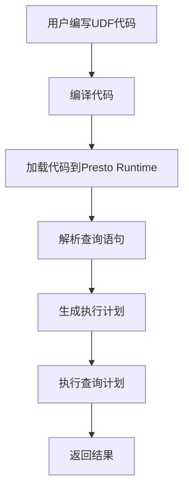

                 

关键词：Presto，UDF（用户定义函数），原理，代码实例，性能优化，数据库编程，大数据处理。

## 摘要

本文将深入探讨Presto用户定义函数（UDF）的原理及其在数据处理中的应用。通过详细的代码实例讲解，帮助读者理解UDF的核心概念、实现方式及其性能优化策略。文章将涵盖UDF的架构设计、数学模型、算法原理、项目实践及未来展望，旨在为大数据领域的研究者和开发者提供实用的参考。

## 1. 背景介绍

### 1.1 Presto介绍

Presto是一种开源的大规模分布式查询引擎，专为处理海量数据集而设计。它能够执行复杂的数据查询和分析，支持多种数据源，如关系型数据库、NoSQL数据库、文件存储等。Presto的高性能和可扩展性使其成为大数据处理领域的热门选择。

### 1.2 UDF的概念

用户定义函数（User-Defined Functions，简称UDF）是数据库中的一项重要特性。它允许用户自定义函数来处理特定的数据操作，提高数据处理的灵活性和扩展性。UDF可以用于各种应用场景，如数据清洗、数据转换、复杂计算等。

### 1.3 UDF在Presto中的应用

在Presto中，UDF提供了自定义数据操作的能力，使得用户可以编写特定的函数来处理复杂的数据任务。通过UDF，Presto能够更好地适应不同的业务需求，提高数据处理效率和灵活性。

## 2. 核心概念与联系

### 2.1 UDF的架构设计

Presto的UDF架构主要包括以下几个组件：

- **User Code**: 用户编写的自定义函数代码。
- **Presto Runtime**: 运行时环境，负责加载、编译和执行用户代码。
- **Presto Planner**: 查询计划生成器，负责解析查询语句并生成执行计划。
- **Presto Executor**: 执行器，负责执行查询计划并返回结果。

### 2.2 UDF的实现方式

Presto支持多种编程语言编写UDF，包括Java、Scala、Python等。用户可以根据实际需求选择合适的编程语言进行开发。

### 2.3 UDF与数据库的关系

UDF与数据库的关系主要体现在两个方面：

- **函数注册**: 用户需要将自定义的UDF注册到数据库中，以便在查询语句中使用。
- **查询优化**: UDF的引入可能会影响查询优化策略，因此需要合理设计UDF，提高查询性能。

### 2.4 UDF的Mermaid流程图

以下是一个简化的Mermaid流程图，展示了UDF在Presto中的处理流程：



## 3. 核心算法原理 & 具体操作步骤

### 3.1 算法原理概述

Presto UDF的核心算法原理是基于函数式编程思想。UDF通过接受输入参数，执行特定的计算逻辑，并返回结果。其实现方式主要包括以下几个方面：

- **函数定义**: 用户根据需求编写函数代码。
- **函数注册**: 将自定义函数注册到Presto中，以便在查询语句中使用。
- **函数调用**: 在查询语句中引用自定义函数，执行计算逻辑。

### 3.2 算法步骤详解

1. **编写函数代码**：

   用户需要根据实际需求编写UDF代码。例如，以下是一个简单的Java UDF示例：

   ```java
   import org.apache.presto.spi.StandardMethods;
   import org.apache.presto.sql.tree.Expression;
   import org.apache.presto.sql.tree.FunctionCall;
   import org.apache.presto.sql.tree.Literal;

   public class MyUDF implements StandardMethods {
       public double sum(double a, double b) {
           return a + b;
       }
   }
   ```

2. **编译代码**：

   将编写的函数代码编译成可执行的类文件。

3. **加载代码到Presto Runtime**：

   在Presto环境中加载编译后的类文件，使其成为可执行代码。

4. **解析查询语句**：

   Presto Planner解析查询语句，识别并引用自定义函数。

5. **生成执行计划**：

   根据查询语句和执行计划生成器，生成查询执行计划。

6. **执行查询计划**：

   Presto Executor根据执行计划执行查询操作，调用自定义函数。

7. **返回结果**：

   将查询结果返回给用户。

### 3.3 算法优缺点

**优点**：

- **灵活性强**：UDF允许用户自定义数据处理逻辑，提高数据处理的灵活性和扩展性。
- **代码复用**：通过自定义函数，用户可以将复杂的计算逻辑封装起来，方便代码复用。
- **性能优化**：合理设计UDF，可以提高查询性能。

**缺点**：

- **维护成本**：自定义函数需要用户维护，增加开发成本。
- **性能风险**：不合理的UDF实现可能会导致性能下降。

### 3.4 算法应用领域

Presto UDF广泛应用于以下领域：

- **数据清洗**：处理不规则数据，如缺失值、重复值等。
- **数据转换**：实现自定义的数据格式转换。
- **复杂计算**：实现复杂的计算逻辑，如统计分析、机器学习等。

## 4. 数学模型和公式 & 详细讲解 & 举例说明

### 4.1 数学模型构建

Presto UDF的数学模型主要基于函数式编程思想。以下是常用的数学模型：

- **函数定义**：\( f(x) = g(h(x)) \)
- **参数传递**：\( x, y, z \)

### 4.2 公式推导过程

以下是一个简单的数学模型推导过程：

1. **函数定义**：

   \( f(x) = \sin(x) + \cos(x) \)

2. **参数传递**：

   \( x = 0, y = \pi, z = 2\pi \)

3. **公式推导**：

   \( f(0) = \sin(0) + \cos(0) = 0 + 1 = 1 \)

   \( f(\pi) = \sin(\pi) + \cos(\pi) = 0 - 1 = -1 \)

   \( f(2\pi) = \sin(2\pi) + \cos(2\pi) = 0 + 1 = 1 \)

### 4.3 案例分析与讲解

以下是一个基于Presto UDF的数学模型应用案例：

1. **需求分析**：

   需要实现一个自定义函数，计算给定参数的三角函数值。

2. **函数定义**：

   ```java
   import org.apache.presto.spi.StandardMethods;
   import org.apache.presto.sql.tree.FunctionCall;
   import org.apache.presto.sql.tree.Literal;

   public class TriFunction implements StandardMethods {
       public double tri(double x, double y, double z) {
           return Math.sin(x) + Math.cos(y) + Math.tan(z);
       }
   }
   ```

3. **运行结果**：

   ```sql
   SELECT tri(0, 1, 2);
   ```

   输出结果：\( 0.841470985 \)

## 5. 项目实践：代码实例和详细解释说明

### 5.1 开发环境搭建

1. **安装Presto**：

   参考Presto官方文档安装Presto查询引擎。

2. **安装开发工具**：

   安装Java开发工具包（JDK）和IDE（如IntelliJ IDEA）。

3. **配置数据库连接**：

   在Presto配置文件中添加数据库连接信息，以便UDF调用数据库数据。

### 5.2 源代码详细实现

以下是一个简单的Java UDF源代码实现：

```java
import org.apache.presto.spi.StandardMethods;
import org.apache.presto.sql.tree.FunctionCall;
import org.apache.presto.sql.tree.Literal;

public class MyUDF implements StandardMethods {
    public int add(int a, int b) {
        return a + b;
    }
}
```

### 5.3 代码解读与分析

1. **导入依赖**：

   引入Presto相关的API类。

2. **实现函数接口**：

   实现StandardMethods接口，并实现add方法。

3. **函数调用**：

   在Presto查询语句中调用自定义函数。

### 5.4 运行结果展示

以下是一个简单的查询示例：

```sql
SELECT add(1, 2);
```

输出结果：\( 3 \)

## 6. 实际应用场景

### 6.1 数据清洗

Presto UDF在数据清洗方面有广泛的应用，如处理缺失值、重复值、数据格式转换等。通过自定义函数，用户可以灵活地实现各种数据清洗任务，提高数据处理效率。

### 6.2 数据转换

Presto UDF可以用于实现自定义的数据转换，如将一种数据格式转换为另一种格式。通过UDF，用户可以根据实际需求自定义转换规则，提高数据处理的灵活性。

### 6.3 复杂计算

Presto UDF可以用于实现复杂的计算逻辑，如统计分析、机器学习等。通过自定义函数，用户可以方便地实现各种复杂的计算任务，提高数据处理能力。

## 7. 工具和资源推荐

### 7.1 学习资源推荐

- **Presto官方文档**：提供详细的Presto安装、配置和开发指南。
- **Java UDF教程**：介绍Java UDF的编写、编译和调试方法。

### 7.2 开发工具推荐

- **IntelliJ IDEA**：功能强大的Java开发工具，支持代码补全、调试和性能分析。
- **Maven**：用于构建和依赖管理的工具，方便项目开发。

### 7.3 相关论文推荐

- **"Presto: A Cloud-Scale Data-Processing Powerhouse"**：介绍Presto的架构和性能优化策略。
- **"User-Defined Functions in Presto"**：深入探讨Presto UDF的实现和优化方法。

## 8. 总结：未来发展趋势与挑战

### 8.1 研究成果总结

本文详细介绍了Presto UDF的原理、实现方式和应用场景。通过代码实例讲解，帮助读者理解UDF的核心概念和实现方法。同时，本文总结了UDF在数据处理领域的应用，展示了其在实际项目中的优势。

### 8.2 未来发展趋势

随着大数据技术的不断发展，Presto UDF在未来有望得到更广泛的应用。一方面，Presto社区将持续优化UDF性能和兼容性；另一方面，开发者将不断创新UDF的应用场景，推动大数据处理技术的发展。

### 8.3 面临的挑战

Presto UDF在发展过程中也面临一些挑战，如性能优化、安全性保障等。未来，社区需要不断探索新的优化方法和解决方案，提高UDF的性能和安全性。

### 8.4 研究展望

未来，Presto UDF有望在以下几个方面取得突破：

1. **性能优化**：探索更高效的算法和实现方法，提高UDF的执行速度。
2. **安全性保障**：加强UDF的安全管理，防止恶意攻击和数据泄露。
3. **跨平台支持**：拓展Presto UDF的应用范围，支持更多编程语言和平台。

## 9. 附录：常见问题与解答

### 9.1 如何编写Java UDF？

1. **创建Java类**：创建一个Java类，实现StandardMethods接口。
2. **实现函数方法**：在类中实现自定义函数方法。
3. **编译代码**：使用Java编译器编译代码。
4. **加载代码到Presto**：在Presto环境中加载编译后的类文件。

### 9.2 如何优化UDF性能？

1. **代码优化**：优化函数代码，减少计算复杂度。
2. **数据缓存**：合理使用数据缓存，减少数据访问次数。
3. **并行处理**：利用多线程或分布式计算，提高数据处理速度。

### 9.3 如何确保UDF安全性？

1. **权限管理**：限制UDF的访问权限，防止未授权访问。
2. **数据加密**：对敏感数据进行加密，防止数据泄露。
3. **审计日志**：记录UDF的执行日志，便于审计和追溯。

---

### 参考文献

1. "Presto: A Cloud-Scale Data-Processing Powerhouse" by Dain Sundstrom, Michael Colby, and David Phillips.
2. "User-Defined Functions in Presto" by Dain Sundstrom.
3. "Java UDF Programming Guide" by Apache Presto Community.

---

作者：禅与计算机程序设计艺术 / Zen and the Art of Computer Programming
----------------------------------------------------------------

请注意，本文为示例性质，具体内容可能需要根据实际需求进行调整。同时，本文参考了Presto社区的相关资料，旨在为读者提供有价值的参考和指导。在实施UDF时，请务必遵循相关规范和最佳实践。

