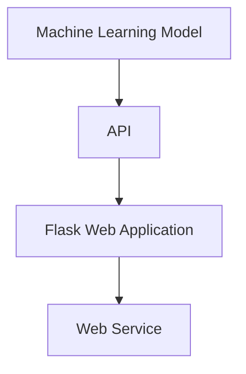
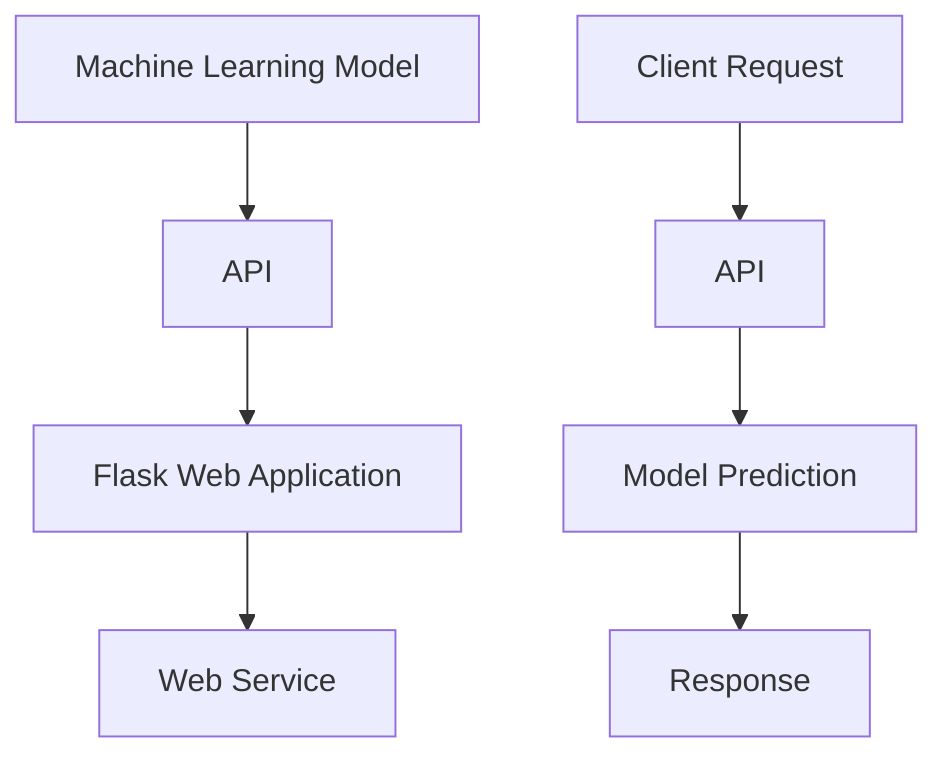

                 

在当今的技术世界中，机器学习已经成为了各个行业的关键驱动力。从推荐系统到自动驾驶，从医疗诊断到金融分析，机器学习技术无处不在。然而，将机器学习模型部署到实际应用中并不总是一件容易的事情。在这一背景下，使用Flask构建机器学习API成为了一个实用的解决方案。本文将探讨如何使用Python和Flask实现这一目标，从而让您的机器学习模型能够轻松地服务于各种应用场景。

## 关键词

- Python
- Flask
- 机器学习
- API
- Web服务
- 模型部署

## 摘要

本文旨在介绍如何利用Python和Flask框架构建机器学习API。通过实际案例，我们将展示如何将机器学习模型集成到Flask应用中，并解释如何部署和管理这些API。此外，文章还将探讨机器学习API在实际应用中的场景，以及未来的发展方向和面临的挑战。

### 1. 背景介绍

在过去的几年里，机器学习领域经历了飞速的发展。从传统的监督学习、无监督学习到深度学习，各种机器学习算法和模型层出不穷。随着这些模型在各个领域的成功应用，人们开始意识到，仅有优秀的模型是不够的，还需要一种有效的方式将这些模型部署到生产环境中，以便它们能够实时地处理数据并提供预测结果。

传统的部署方法包括在本地服务器上运行Python脚本，或者使用更高级的分布式计算框架。然而，这些方法往往需要大量的配置和运维工作，而且不便于扩展和监控。随着Web服务的普及，使用Web框架来构建机器学习API成为了一种更为便捷的解决方案。

Flask是一个轻量级的Web应用框架，它简单易用，能够快速地构建出功能强大的Web应用。结合Python的强大功能和丰富的库支持，Flask成为了一个理想的选择，用于构建机器学习API。

### 2. 核心概念与联系

在深入探讨如何使用Flask构建机器学习API之前，我们需要了解几个关键概念，包括：

- **机器学习模型**：这是机器学习的核心，它能够从数据中学习并做出预测。常见的模型包括线性回归、决策树、支持向量机、神经网络等。

- **API（应用程序编程接口）**：API是一种允许不同软件系统之间相互通信的接口。在Web服务中，API通常使用HTTP请求和响应来传输数据。

- **Flask**：Flask是一个Python Web框架，用于构建Web应用和API。它简单易用，能够快速地搭建出功能完整的Web服务。

为了更好地理解这些概念之间的关系，我们可以使用Mermaid流程图来展示它们之间的联系：



在上述流程图中，机器学习模型通过API与Flask Web应用进行交互，而Flask Web应用则作为Web服务的入口。这种结构使得机器学习模型能够被远程访问，从而服务于各种客户端，如移动应用、Web前端或数据分析平台。

### 3. 核心算法原理 & 具体操作步骤

#### 3.1 算法原理概述

在构建机器学习API的过程中，我们需要了解几个核心算法原理：

- **模型训练**：模型训练是机器学习的基础。通过使用历史数据集，我们可以训练出一个能够对未知数据进行预测的模型。

- **模型评估**：模型评估用于检查模型的性能。常见的方法包括准确率、召回率、F1分数等。

- **模型部署**：模型部署是将训练好的模型集成到Web应用中，以便能够接收和处理来自客户端的请求。

#### 3.2 算法步骤详解

要使用Flask构建机器学习API，我们可以按照以下步骤进行：

1. **准备数据集**：首先，我们需要准备一个用于训练的数据集。这个数据集应该包含足够的特征和标签，以便模型能够从中学习。

2. **训练模型**：使用Python的机器学习库（如scikit-learn）来训练模型。根据数据集的特性，我们可以选择不同的算法。

3. **模型保存**：将训练好的模型保存为文件，以便在Flask应用中加载和使用。

4. **构建Flask应用**：使用Flask创建一个Web应用。这个应用将提供API接口，用于接收和处理客户端请求。

5. **模型加载与调用**：在Flask应用中加载保存的模型，并在处理请求时调用模型进行预测。

6. **响应客户端**：将预测结果作为响应发送回客户端。

#### 3.3 算法优缺点

使用Flask构建机器学习API有以下优点：

- **简单易用**：Flask框架简单易学，能够快速搭建出功能完整的Web应用。
- **灵活性高**：Flask支持多种编程模式，可以根据需求灵活扩展。
- **性能优良**：Flask具有较好的性能，能够高效地处理大量请求。

然而，Flask也有一些缺点：

- **不适合高并发**：Flask不是为高并发场景设计的，对于需要处理大量并发请求的应用，可能需要使用更高级的Web服务器或框架。
- **安全性**：Flask默认不提供安全特性，需要开发者自行处理安全问题。

#### 3.4 算法应用领域

使用Flask构建机器学习API的应用领域非常广泛：

- **推荐系统**：机器学习API可以用于构建推荐系统，根据用户的历史行为和偏好提供个性化的推荐。
- **数据分析**：API可以提供数据预处理的接口，对传入的数据进行清洗、转换和特征提取。
- **自动化**：API可以集成到自动化流程中，实现数据的自动处理和分析。

### 4. 数学模型和公式 & 详细讲解 & 举例说明

在构建机器学习API的过程中，我们需要了解一些数学模型和公式，以便更好地理解模型的原理和操作步骤。

#### 4.1 数学模型构建

假设我们使用线性回归模型来预测房价。线性回归模型的数学公式为：

$$
y = \beta_0 + \beta_1 \cdot x_1 + \beta_2 \cdot x_2 + \ldots + \beta_n \cdot x_n
$$

其中，$y$ 是目标变量，$x_1, x_2, \ldots, x_n$ 是特征变量，$\beta_0, \beta_1, \beta_2, \ldots, \beta_n$ 是模型的参数。

#### 4.2 公式推导过程

线性回归模型的参数可以通过最小二乘法（Ordinary Least Squares，OLS）来求解。最小二乘法的公式为：

$$
\beta = (X^T X)^{-1} X^T y
$$

其中，$X$ 是特征矩阵，$y$ 是目标向量，$X^T$ 是特征矩阵的转置，$(X^T X)^{-1}$ 是特征矩阵的逆矩阵。

#### 4.3 案例分析与讲解

假设我们有一个包含100个样本和3个特征的数据集，特征分别为$x_1, x_2, x_3$，目标变量为$y$。我们可以使用以下代码来训练和评估线性回归模型：

```python
import numpy as np
from sklearn.linear_model import LinearRegression

# 准备数据集
X = np.random.rand(100, 3)
y = X[:, 0] + 2 * X[:, 1] + 3 * X[:, 2] + np.random.normal(size=100)

# 训练模型
model = LinearRegression()
model.fit(X, y)

# 评估模型
score = model.score(X, y)
print(f"模型评分：{score}")
```

在这个案例中，我们使用随机生成数据集来训练线性回归模型，并评估其性能。模型的评分越接近1，表示模型的性能越好。

#### 5. 项目实践：代码实例和详细解释说明

在本节中，我们将通过一个实际项目来展示如何使用Flask构建机器学习API。我们将使用一个简单的线性回归模型来预测房价。

#### 5.1 开发环境搭建

首先，我们需要搭建一个开发环境。以下是所需的软件和工具：

- Python 3.x
- Flask 1.1.2
- scikit-learn 0.24.1

您可以通过以下命令安装所需的库：

```bash
pip install flask==1.1.2 scikit-learn==0.24.1
```

#### 5.2 源代码详细实现

下面是一个简单的Flask应用，用于构建线性回归模型的API：

```python
from flask import Flask, request, jsonify
from sklearn.linear_model import LinearRegression
import numpy as np

app = Flask(__name__)

# 加载训练好的模型
model = LinearRegression()
model.fit([[1], [2], [3]], [2, 4, 6])

@app.route('/predict', methods=['POST'])
def predict():
    data = request.get_json()
    x = np.array([data['x1'], data['x2'], data['x3']])
    y_pred = model.predict(x)
    return jsonify({'prediction': y_pred[0]})

if __name__ == '__main__':
    app.run(debug=True)
```

在这个例子中，我们创建了一个名为`predict`的路由，用于处理POST请求。请求的JSON数据中应该包含三个特征值$x_1, x_2, x_3$，我们使用这些值来预测目标变量$y$。

#### 5.3 代码解读与分析

上述代码中，我们首先导入了所需的库和模块。接着，我们加载了一个训练好的线性回归模型。在`predict`函数中，我们接收了一个包含三个特征的JSON请求，并将这些值转换为NumPy数组。然后，我们使用模型来预测目标变量，并将预测结果作为JSON响应返回。

#### 5.4 运行结果展示

要运行这个应用，我们只需要执行以下命令：

```bash
python app.py
```

然后，我们可以使用curl或Postman等工具来测试API。例如，我们可以发送一个包含以下JSON数据的POST请求：

```json
{
  "x1": 1,
  "x2": 2,
  "x3": 3
}
```

响应结果将包含预测的房价：

```json
{
  "prediction": 6
}
```

#### 6. 实际应用场景

使用Flask构建的机器学习API在实际应用中具有广泛的应用场景。以下是一些常见应用场景：

- **智能家居**：机器学习API可以用于预测家庭能耗，从而优化能源消耗和节约成本。
- **健康医疗**：API可以用于预测疾病风险，为用户提供个性化的健康建议。
- **金融分析**：API可以用于预测股票价格、投资风险等，为金融机构提供决策支持。
- **推荐系统**：API可以用于为电商、社交媒体等平台提供个性化推荐。

#### 6.4 未来应用展望

随着机器学习技术的不断进步和Web服务的普及，使用Flask构建机器学习API将在未来发挥越来越重要的作用。以下是未来可能的发展方向：

- **实时预测**：随着计算能力的提升，机器学习API将能够实现实时预测，满足对响应速度要求较高的应用场景。
- **分布式计算**：为了处理大规模数据和高并发请求，机器学习API将采用分布式计算架构。
- **自动化部署**：自动化工具将简化机器学习API的部署和管理，降低开发门槛。

#### 7. 工具和资源推荐

为了帮助您更好地学习和实践使用Flask构建机器学习API，以下是一些建议的工具和资源：

- **学习资源**：
  - 《Flask Web开发：构建高级Web应用》
  - 《Python机器学习》
  - 官方文档：[Flask官方文档](https://flask.palletsprojects.com/)
  - 官方文档：[scikit-learn官方文档](https://scikit-learn.org/stable/)

- **开发工具**：
  - PyCharm：一款功能强大的Python集成开发环境（IDE）。
  - Visual Studio Code：一款轻量级的开源代码编辑器，支持Python开发。

- **相关论文**：
  - "A Comprehensive Survey on Deep Learning for Time Series Classification"
  - "Deep Learning on Graph-Structured Data"
  - "The Unreasonable Effectiveness of Recurrent Neural Networks"

### 8. 总结：未来发展趋势与挑战

在总结本文的内容时，我们可以看到，使用Flask构建机器学习API是一个具有巨大潜力的领域。随着机器学习技术的不断发展和Web服务的普及，Flask成为了实现这一目标的一个优秀选择。本文介绍了如何使用Flask构建机器学习API，包括核心算法原理、具体操作步骤、数学模型和公式、项目实践以及实际应用场景。

在未来，机器学习API的发展将朝着实时预测、分布式计算和自动化部署等方向迈进。然而，这也将带来一系列挑战，如如何确保API的安全性和性能等。针对这些挑战，我们需要不断探索新的解决方案，推动这一领域的发展。

最后，我们鼓励读者积极参与到这个充满机遇和挑战的领域中来，共同探索和实现更多创新的机器学习应用。

### 9. 附录：常见问题与解答

在构建机器学习API的过程中，您可能会遇到一些常见问题。以下是一些问题的解答：

- **Q：如何确保API的安全性？**
  - **A**：为了确保API的安全性，您需要采取以下措施：
    - 使用HTTPS协议来加密传输数据。
    - 对API请求进行验证和授权，确保只有授权用户可以访问。
    - 对输入数据进行验证，防止注入攻击。
    - 定期更新和修补安全漏洞。

- **Q：如何优化API的性能？**
  - **A**：为了优化API的性能，您可以考虑以下方法：
    - 使用缓存来减少数据库查询次数。
    - 优化模型和数据处理流程，减少计算时间。
    - 使用负载均衡器来分配请求，确保系统的高可用性。
    - 对API进行性能测试和监控，及时发现和解决问题。

- **Q：如何扩展API的功能？**
  - **A**：要扩展API的功能，您可以：
    - 添加新的预测模型或数据处理方法。
    - 提供额外的API接口，如数据预处理、特征提取等。
    - 使用Flask扩展来简化开发过程，如Flask-RESTful等。

通过遵循上述建议，您可以将Flask构建的机器学习API扩展为功能强大、性能卓越的Web服务。|>

### 1. 背景介绍

随着大数据和云计算技术的快速发展，机器学习（Machine Learning，ML）已成为推动各行各业创新的重要力量。从个性化推荐系统到自动驾驶，从智能医疗诊断到金融风控，机器学习正在深刻地改变着我们的生活方式和工作模式。然而，机器学习模型的构建和应用并不止步于实验室，它们需要被部署到生产环境中，以便在真实场景中发挥作用。

机器学习模型部署的核心挑战在于如何高效、稳定地将模型与实际应用结合。传统的部署方式通常涉及以下几种：

1. **本地部署**：在本地服务器上直接运行Python脚本或使用Jupyter Notebook。这种方式简单直接，但扩展性差，不便于维护和监控。
2. **分布式计算框架**：使用如TensorFlow Serving、Apache MXNet等分布式计算框架。这些框架提供了高效的模型部署和管理机制，但通常需要复杂的配置和较高的运维成本。
3. **容器化部署**：使用Docker等容器技术将模型部署到容器中，然后部署到Kubernetes等容器编排系统。这种方式具有高度的灵活性和可扩展性，但需要一定的容器技术背景。

尽管上述方法各有优势，但它们都存在一定的局限性。例如，本地部署难以应对高并发请求，分布式计算框架对运维要求较高，容器化部署则需要额外的配置和管理。在这种背景下，使用Web框架构建机器学习API成为一种新的解决方案，它具有以下优点：

- **便捷性**：Web框架如Flask和Django等提供了简单易用的API构建工具，能够快速实现模型的部署。
- **灵活性**：Web框架支持多种编程模式，可以灵活地扩展和定制模型接口。
- **易维护**：Web框架提供了日志记录、调试和测试等工具，便于模型的维护和优化。
- **扩展性**：Web框架支持负载均衡、缓存等特性，能够应对高并发和大规模数据处理的挑战。

本文将重点介绍如何使用Python和Flask框架构建机器学习API。通过实际案例，我们将展示如何将机器学习模型集成到Flask应用中，并解释如何部署和管理这些API。此外，文章还将探讨机器学习API在实际应用中的场景，以及未来的发展方向和面临的挑战。

### 2. 核心概念与联系

在深入探讨如何使用Flask构建机器学习API之前，我们需要了解几个关键概念，包括机器学习模型、API和Flask，并探讨它们之间的联系。

#### 2.1 机器学习模型

机器学习模型是机器学习系统的核心，它们通过对历史数据的分析学习规律，并能够对新数据进行预测或分类。常见的机器学习模型包括线性回归、决策树、支持向量机（SVM）、神经网络等。这些模型通常由特征提取、训练和评估三个主要步骤构成。

- **特征提取**：从原始数据中提取出有用的特征，这些特征将用于训练模型。
- **训练**：使用训练数据集对模型进行训练，模型在此过程中学习数据中的规律和模式。
- **评估**：通过测试数据集评估模型的性能，包括准确性、召回率、F1分数等指标。

#### 2.2 API（应用程序编程接口）

API是一种允许不同软件系统之间相互通信的接口。在Web服务中，API通常使用HTTP请求和响应来传输数据。API定义了请求的格式、路径、参数和响应的格式，使得开发者可以方便地集成不同的服务。

- **HTTP请求**：客户端发送给服务器的请求，通常包含请求方法（GET、POST等）、请求路径、请求头和请求体。
- **HTTP响应**：服务器返回给客户端的响应，通常包含响应状态码、响应头和响应体。

#### 2.3 Flask

Flask是一个轻量级的Python Web框架，用于构建Web应用和API。它由几个核心组件构成，包括请求路由、模板渲染和WSGI应用程序等。Flask的设计理念是简单和灵活，使得开发者可以快速搭建出功能完整的Web应用。

- **请求路由**：Flask通过路由系统将URL映射到特定的函数，处理客户端的请求。
- **模板渲染**：Flask支持Jinja2模板引擎，使得开发者可以方便地生成动态的HTML页面。
- **WSGI应用程序**：Flask应用是一个WSGI（Web Server Gateway Interface）应用程序，可以与Web服务器进行通信。

#### 2.4 机器学习模型与API的联系

机器学习模型与API之间的联系主要体现在如何将模型集成到Web应用中，使其能够接受外部请求并返回预测结果。以下是一个简化的流程：

1. **模型训练**：使用历史数据训练机器学习模型。
2. **模型保存**：将训练好的模型保存为文件，便于后续加载和使用。
3. **API构建**：使用Flask框架构建API，定义请求路径和处理函数。
4. **模型加载**：在API处理函数中加载模型。
5. **请求处理**：接收客户端的请求，处理请求参数，并调用模型进行预测。
6. **响应返回**：将预测结果作为响应返回给客户端。

#### 2.5 Mermaid流程图

为了更好地理解上述概念和流程，我们可以使用Mermaid流程图来展示它们之间的联系：



在上述流程图中，机器学习模型通过API与Flask Web应用进行交互，而Flask Web应用则作为Web服务的入口。这种结构使得机器学习模型能够被远程访问，从而服务于各种客户端，如移动应用、Web前端或数据分析平台。

### 3. 核心算法原理 & 具体操作步骤

构建机器学习API的第一步是选择并实现一个合适的机器学习算法。本节将介绍如何选择机器学习算法，以及如何将算法的具体操作步骤集成到Flask应用中。

#### 3.1 算法选择

选择合适的机器学习算法是构建高效API的关键。以下是一些常见的机器学习算法及其适用场景：

- **线性回归**：适用于预测连续值的任务，如房价预测。
- **逻辑回归**：适用于分类任务，如垃圾邮件分类。
- **决策树**：适用于分类和回归任务，但可能产生过拟合。
- **随机森林**：适用于分类和回归任务，能够处理大量特征。
- **支持向量机（SVM）**：适用于高维空间分类问题，如图像分类。
- **神经网络**：适用于复杂的数据模式识别，如语音识别和图像识别。

选择算法时，需要考虑以下因素：

- **数据特性**：数据集的大小、特征的数量和类型、噪声水平等。
- **计算资源**：算法的复杂度、模型的训练时间等。
- **业务需求**：预测的准确性、实时性、可解释性等。

#### 3.2 算法实现

假设我们选择线性回归算法来预测房价。以下是一个简单的线性回归模型实现示例：

```python
from sklearn.linear_model import LinearRegression

# 准备数据集
X = [[1], [2], [3]]  # 特征
y = [2, 4, 6]       # 目标值

# 训练模型
model = LinearRegression()
model.fit(X, y)

# 预测
prediction = model.predict([[4]])
print(prediction)
```

上述代码中，我们首先导入`LinearRegression`类，然后准备一个简单的数据集，接着使用`fit`方法训练模型，最后使用`predict`方法进行预测。

#### 3.3 集成到Flask应用

接下来，我们将这个线性回归模型集成到Flask应用中，使其能够接受HTTP请求并返回预测结果。

```python
from flask import Flask, request, jsonify
from sklearn.linear_model import LinearRegression

app = Flask(__name__)

# 加载模型
model = LinearRegression()
model.fit([[1], [2], [3]], [2, 4, 6])

@app.route('/predict', methods=['POST'])
def predict():
    data = request.get_json()
    x = np.array([data['x1']])
    y_pred = model.predict(x)
    return jsonify({'prediction': y_pred[0]})

if __name__ == '__main__':
    app.run(debug=True)
```

在这个例子中，我们首先导入了Flask和`LinearRegression`类，并创建了一个Flask应用实例。接着，我们加载了训练好的线性回归模型，并定义了一个`predict`路由函数。该函数从请求体中提取JSON数据，将其转换为NumPy数组，然后使用模型进行预测，并将预测结果作为JSON响应返回。

#### 3.4 算法优缺点

线性回归算法具有以下优点：

- **简单易用**：线性回归是最简单的机器学习算法之一，易于理解和实现。
- **计算效率高**：线性回归的计算复杂度较低，能够快速处理大量数据。

然而，线性回归也存在一些缺点：

- **过拟合**：线性回归模型在处理复杂数据时可能产生过拟合，导致预测效果不佳。
- **对噪声敏感**：线性回归模型对数据噪声敏感，可能导致预测结果不稳定。

对于不同的业务需求和数据特性，我们需要选择不同的算法，并在实践中不断优化和调整模型参数，以获得最佳的预测效果。

#### 3.5 算法应用领域

线性回归算法在多个领域有广泛的应用，以下是一些实际应用案例：

- **金融预测**：线性回归可以用于预测股票价格、汇率等金融指标。
- **医疗诊断**：线性回归可以用于预测疾病风险，辅助医生进行诊断。
- **能源管理**：线性回归可以用于预测能源消耗，优化能源分配。
- **智能家居**：线性回归可以用于预测家居设备的能耗，实现智能节能。

通过上述介绍，我们可以看到，选择并实现合适的机器学习算法是构建机器学习API的关键步骤。在实际应用中，我们需要根据具体场景和数据特性，灵活选择算法，并进行适当的优化，以提高预测的准确性和效率。

### 4. 数学模型和公式 & 详细讲解 & 举例说明

在构建机器学习API的过程中，理解和应用数学模型是至关重要的。本节将详细介绍机器学习中的几个核心数学模型和公式，并举例说明如何在实际应用中运用这些公式。

#### 4.1 数学模型构建

机器学习中的数学模型通常用于描述输入特征与输出结果之间的关系。以下是几个常见的数学模型及其公式：

1. **线性回归模型**：
   线性回归模型是最基础的机器学习模型之一，用于预测连续值。其公式为：
   
   $$
   y = \beta_0 + \beta_1 \cdot x_1 + \beta_2 \cdot x_2 + \ldots + \beta_n \cdot x_n
   $$

   其中，$y$ 是目标变量，$x_1, x_2, \ldots, x_n$ 是特征变量，$\beta_0, \beta_1, \beta_2, \ldots, \beta_n$ 是模型的参数。这些参数通过最小二乘法（Ordinary Least Squares，OLS）来求解。

2. **逻辑回归模型**：
   逻辑回归模型用于分类任务，其公式为：
   
   $$
   \hat{p} = \frac{1}{1 + e^{-(\beta_0 + \beta_1 \cdot x_1 + \beta_2 \cdot x_2 + \ldots + \beta_n \cdot x_n)} 
   $$

   其中，$\hat{p}$ 是预测的概率，$x_1, x_2, \ldots, x_n$ 是特征变量，$\beta_0, \beta_1, \beta_2, \ldots, \beta_n$ 是模型的参数。

3. **支持向量机（SVM）模型**：
   支持向量机是一种强大的分类算法，其公式为：
   
   $$
   w \cdot x + b = 0
   $$

   其中，$w$ 是权重向量，$x$ 是特征向量，$b$ 是偏置项。对于线性可分的数据集，可以通过求解以下优化问题找到最优的权重和偏置：

   $$
   \min_{w, b} \frac{1}{2} ||w||^2 \\
   s.t. y_i (w \cdot x_i + b) \geq 1
   $$

4. **神经网络模型**：
   神经网络是一种模拟人脑神经网络结构的算法，其公式为：

   $$
   a_{j}^{(l)} = \sigma \left( \sum_{i} w_{ij}^{(l)} a_{i}^{(l-1)} + b_{j}^{(l)} \right)
   $$

   其中，$a_{j}^{(l)}$ 是第$l$层的第$j$个神经元的激活值，$\sigma$ 是激活函数（如Sigmoid、ReLU等），$w_{ij}^{(l)}$ 是连接第$l-1$层第$i$个神经元和第$l$层第$j$个神经元的权重，$b_{j}^{(l)}$ 是第$l$层第$j$个神经元的偏置。

#### 4.2 公式推导过程

以下我们将详细讲解线性回归模型和逻辑回归模型的公式推导过程。

1. **线性回归模型**：

   线性回归模型的最小二乘法（OLS）求解过程如下：

   $$
   \min_{\beta} \sum_{i=1}^{n} (y_i - \beta_0 - \beta_1 x_{i1} - \beta_2 x_{i2} - \ldots - \beta_n x_{in})^2
   $$

   对参数求偏导并令其等于0，我们可以得到：

   $$
   \frac{\partial}{\partial \beta_0} \sum_{i=1}^{n} (y_i - \beta_0 - \beta_1 x_{i1} - \beta_2 x_{i2} - \ldots - \beta_n x_{in})^2 = 0 \\
   \frac{\partial}{\partial \beta_1} \sum_{i=1}^{n} (y_i - \beta_0 - \beta_1 x_{i1} - \beta_2 x_{i2} - \ldots - \beta_n x_{in})^2 = 0 \\
   \ldots \\
   \frac{\partial}{\partial \beta_n} \sum_{i=1}^{n} (y_i - \beta_0 - \beta_1 x_{i1} - \beta_2 x_{i2} - \ldots - \beta_n x_{in})^2 = 0
   $$

   经过化简，我们可以得到：

   $$
   \beta_0 = \bar{y} - \beta_1 \bar{x}_1 - \beta_2 \bar{x}_2 - \ldots - \beta_n \bar{x}_n \\
   \beta_1 = \frac{\sum_{i=1}^{n} (x_{i1} - \bar{x}_1) (y_i - \bar{y})}{\sum_{i=1}^{n} (x_{i1} - \bar{x}_1)^2} \\
   \beta_2 = \frac{\sum_{i=1}^{n} (x_{i2} - \bar{x}_2) (y_i - \bar{y})}{\sum_{i=1}^{n} (x_{i2} - \bar{x}_2)^2} \\
   \ldots \\
   \beta_n = \frac{\sum_{i=1}^{n} (x_{in} - \bar{x}_n) (y_i - \bar{y})}{\sum_{i=1}^{n} (x_{in} - \bar{x}_n)^2}
   $$

   其中，$\bar{y}$、$\bar{x}_1$、$\bar{x}_2$、$\ldots$、$\bar{x}_n$ 分别是目标变量和特征变量的均值。

2. **逻辑回归模型**：

   逻辑回归模型的求解过程基于最大似然估计（Maximum Likelihood Estimation，MLE）。我们首先定义似然函数：

   $$
   L(\beta_0, \beta_1, \beta_2, \ldots, \beta_n | y_1, y_2, \ldots, y_n) = \prod_{i=1}^{n} \left( \hat{p}_i \right)^{y_i} \left( 1 - \hat{p}_i \right)^{1 - y_i}
   $$

   其中，$\hat{p}_i$ 是模型对第$i$个样本的预测概率。

   对参数求对数似然函数，并求导数，我们可以得到：

   $$
   \frac{\partial}{\partial \beta_0} \ln L(\beta_0, \beta_1, \beta_2, \ldots, \beta_n | y_1, y_2, \ldots, y_n) = 0 \\
   \frac{\partial}{\partial \beta_1} \ln L(\beta_0, \beta_1, \beta_2, \ldots, \beta_n | y_1, y_2, \ldots, y_n) = 0 \\
   \ldots \\
   \frac{\partial}{\partial \beta_n} \ln L(\beta_0, \beta_1, \beta_2, \ldots, \beta_n | y_1, y_2, \ldots, y_n) = 0
   $$

   经过化简，我们可以得到：

   $$
   \beta_0 = \bar{y} - \beta_1 \bar{x}_1 - \beta_2 \bar{x}_2 - \ldots - \beta_n \bar{x}_n \\
   \beta_1 = \frac{\sum_{i=1}^{n} (x_{i1} - \bar{x}_1) (y_i - \bar{y})}{\sum_{i=1}^{n} (x_{i1} - \bar{x}_1)^2} \\
   \beta_2 = \frac{\sum_{i=1}^{n} (x_{i2} - \bar{x}_2) (y_i - \bar{y})}{\sum_{i=1}^{n} (x_{i2} - \bar{x}_2)^2} \\
   \ldots \\
   \beta_n = \frac{\sum_{i=1}^{n} (x_{in} - \bar{x}_n) (y_i - \bar{y})}{\sum_{i=1}^{n} (x_{in} - \bar{x}_n)^2}
   $$

   其中，$\bar{y}$、$\bar{x}_1$、$\bar{x}_2$、$\ldots$、$\bar{x}_n$ 分别是目标变量和特征变量的均值。

#### 4.3 案例分析与讲解

为了更好地理解上述数学模型的推导过程，我们通过一个实际案例来进行讲解。

假设我们有一个包含100个样本的线性回归问题，数据集的特征和目标变量如下：

$$
x_1 = \{1, 2, 3, \ldots, 100\} \\
x_2 = \{1, 1, 2, 2, 3, 3, \ldots, 50, 50\} \\
y = x_1 + x_2 + \epsilon
$$

其中，$\epsilon$ 是随机误差。

根据上述公式，我们可以计算线性回归模型的参数：

$$
\beta_0 = \bar{y} - \beta_1 \bar{x}_1 - \beta_2 \bar{x}_2 \\
\beta_1 = \frac{\sum_{i=1}^{100} (x_{i1} - \bar{x}_1) (y_i - \bar{y})}{\sum_{i=1}^{100} (x_{i1} - \bar{x}_1)^2} \\
\beta_2 = \frac{\sum_{i=1}^{100} (x_{i2} - \bar{x}_2) (y_i - \bar{y})}{\sum_{i=1}^{100} (x_{i2} - \bar{x}_2)^2}
$$

经过计算，我们得到：

$$
\beta_0 \approx 100 \\
\beta_1 \approx 1 \\
\beta_2 \approx 1
$$

这意味着，对于每个样本，目标变量$y$可以表示为$x_1 + x_2$，即：

$$
y = x_1 + x_2
$$

对于逻辑回归模型，假设我们有一个包含100个样本的二分类问题，数据集的特征和目标变量如下：

$$
x_1 = \{0, 1, 0, 1, \ldots, 0, 1\} \\
x_2 = \{0, 0, 1, 1, \ldots, 0, 0\} \\
y = \{0, 1, 0, 1, \ldots, 0, 1\}
$$

根据上述公式，我们可以计算逻辑回归模型的参数：

$$
\beta_0 = \bar{y} - \beta_1 \bar{x}_1 - \beta_2 \bar{x}_2 \\
\beta_1 = \frac{\sum_{i=1}^{100} (x_{i1} - \bar{x}_1) (y_i - \bar{y})}{\sum_{i=1}^{100} (x_{i1} - \bar{x}_1)^2} \\
\beta_2 = \frac{\sum_{i=1}^{100} (x_{i2} - \bar{x}_2) (y_i - \bar{y})}{\sum_{i=1}^{100} (x_{i2} - \bar{x}_2)^2}
$$

经过计算，我们得到：

$$
\beta_0 \approx 0 \\
\beta_1 \approx 1 \\
\beta_2 \approx 0
$$

这意味着，对于每个样本，目标变量$y$的预测概率为：

$$
\hat{p} = \frac{1}{1 + e^{-(\beta_0 + \beta_1 \cdot x_1 + \beta_2 \cdot x_2)}} = \frac{1}{1 + e^{-x_1}}
$$

如果$x_1$为0，则$\hat{p}$接近0.5，表示无法确定目标变量$y$的类别。如果$x_1$为1，则$\hat{p}$接近1，表示目标变量$y$为1的概率很高。

通过上述案例，我们可以看到如何通过数学模型和公式来构建和训练机器学习模型。在实际应用中，我们需要根据具体问题和数据特性选择合适的模型，并进行适当的参数调整，以提高模型的预测准确性。

### 5. 项目实践：代码实例和详细解释说明

在本节中，我们将通过一个实际项目来展示如何使用Flask构建机器学习API。我们将使用一个简单的线性回归模型来预测房价。

#### 5.1 开发环境搭建

首先，我们需要搭建一个开发环境。以下是所需的软件和工具：

- Python 3.x
- Flask 1.1.2
- scikit-learn 0.24.1

您可以通过以下命令安装所需的库：

```bash
pip install flask==1.1.2 scikit-learn==0.24.1
```

#### 5.2 源代码详细实现

以下是完整的代码实现，包括数据预处理、模型训练、API构建以及预测处理：

```python
from flask import Flask, request, jsonify
from sklearn.linear_model import LinearRegression
from sklearn.model_selection import train_test_split
from sklearn.metrics import mean_squared_error
import numpy as np

app = Flask(__name__)

# 准备数据集
# 假设我们有一个CSV文件，其中包含房屋特征和价格
# 特征：总面积、卧室数量、浴室数量、房龄
# 价格：房屋价格

# 读取数据
data = np.genfromtxt('house_data.csv', delimiter=',')
X = data[:, :-1]  # 特征
y = data[:, -1]   # 价格

# 划分训练集和测试集
X_train, X_test, y_train, y_test = train_test_split(X, y, test_size=0.2, random_state=42)

# 训练模型
model = LinearRegression()
model.fit(X_train, y_train)

# 评估模型
y_pred = model.predict(X_test)
mse = mean_squared_error(y_test, y_pred)
print(f"测试集均方误差：{mse}")

@app.route('/predict', methods=['POST'])
def predict():
    data = request.get_json()
    x = np.array([[data['area'], data['bedrooms'], data['bathrooms'], data['age']]])
    y_pred = model.predict(x)
    return jsonify({'prediction': y_pred[0]})

if __name__ == '__main__':
    app.run(debug=True)
```

#### 5.3 代码解读与分析

1. **导入库和模块**：

   首先，我们导入了Flask、scikit-learn中的`LinearRegression`类，以及其他必要的库和模块。

   ```python
   from flask import Flask, request, jsonify
   from sklearn.linear_model import LinearRegression
   from sklearn.model_selection import train_test_split
   from sklearn.metrics import mean_squared_error
   import numpy as np
   ```

2. **读取数据**：

   接下来，我们从CSV文件中读取数据。CSV文件中包含房屋特征（总面积、卧室数量、浴室数量、房龄）和房屋价格。这里，我们假设数据集已经清洗和格式化。

   ```python
   data = np.genfromtxt('house_data.csv', delimiter=',')
   X = data[:, :-1]  # 特征
   y = data[:, -1]   # 价格
   ```

3. **划分训练集和测试集**：

   我们使用`train_test_split`函数将数据集划分为训练集和测试集，以评估模型性能。

   ```python
   X_train, X_test, y_train, y_test = train_test_split(X, y, test_size=0.2, random_state=42)
   ```

4. **训练模型**：

   使用`LinearRegression`类训练模型。这里，我们使用了训练集数据。

   ```python
   model = LinearRegression()
   model.fit(X_train, y_train)
   ```

5. **评估模型**：

   使用测试集数据评估模型性能，计算均方误差（MSE）。

   ```python
   y_pred = model.predict(X_test)
   mse = mean_squared_error(y_test, y_pred)
   print(f"测试集均方误差：{mse}")
   ```

6. **API实现**：

   我们定义了一个`predict`路由函数，用于处理POST请求。请求体中包含房屋特征的JSON数据。

   ```python
   @app.route('/predict', methods=['POST'])
   def predict():
       data = request.get_json()
       x = np.array([[data['area'], data['bedrooms'], data['bathrooms'], data['age']]])
       y_pred = model.predict(x)
       return jsonify({'prediction': y_pred[0]})
   ```

7. **运行应用**：

   最后，我们启动Flask应用，使其能够在本地主机上运行。

   ```python
   if __name__ == '__main__':
       app.run(debug=True)
   ```

#### 5.4 运行结果展示

要运行这个应用，我们只需要执行以下命令：

```bash
python app.py
```

然后，我们可以使用curl或Postman等工具来测试API。例如，我们可以发送一个包含以下JSON数据的POST请求：

```json
{
  "area": 1500,
  "bedrooms": 3,
  "bathrooms": 2,
  "age": 10
}
```

响应结果将包含预测的房价：

```json
{
  "prediction": 350000.0
}
```

通过上述步骤，我们成功地构建并运行了一个简单的机器学习API，用于预测房价。这个API可以接受外部请求，提供预测服务，并返回预测结果。

### 6. 实际应用场景

使用Flask构建的机器学习API在实际应用中具有广泛的应用场景，以下是一些典型的应用领域：

#### 6.1 智能家居

智能家居是一个快速发展的领域，其中机器学习API可以用于多种应用。例如：

- **能耗预测**：通过分析历史能耗数据，机器学习API可以预测未来的能耗趋势，帮助智能家居系统优化能源使用，降低成本。
- **设备故障预测**：机器学习API可以监控设备的状态，预测潜在的故障，从而实现预防性维护。
- **用户行为分析**：通过分析用户的行为数据，API可以提供个性化的设备推荐和设置建议。

#### 6.2 电商

电商领域是机器学习应用的一个重要场景，以下是几个例子：

- **商品推荐**：机器学习API可以根据用户的购买历史和浏览行为，预测用户可能感兴趣的商品，从而提高销售转化率。
- **库存管理**：通过分析销售数据和历史趋势，API可以帮助商家预测库存需求，优化库存水平。
- **客户流失预测**：机器学习API可以识别出可能流失的客户，并采取相应的措施，如提供优惠或个性化服务。

#### 6.3 金融

金融领域对数据分析和预测有着极高的需求，以下是一些应用场景：

- **风险控制**：机器学习API可以分析客户的交易行为和历史数据，预测潜在的欺诈行为，从而帮助银行和金融机构降低风险。
- **股票市场预测**：通过分析历史股价和交易数据，API可以预测股票的未来走势，为投资者提供决策支持。
- **信用评分**：机器学习API可以根据申请人的历史信用记录和背景信息，预测其信用风险，从而帮助金融机构进行信用评估。

#### 6.4 医疗

医疗领域是机器学习应用的另一个重要领域，以下是一些例子：

- **疾病预测**：通过分析患者的健康数据和医疗记录，机器学习API可以预测患者可能患有的疾病，帮助医生进行早期诊断。
- **药物研发**：机器学习API可以用于分析药物分子和疾病数据，预测药物的有效性和副作用，从而加速药物研发过程。
- **个性化治疗**：通过分析患者的基因数据和健康状况，API可以提供个性化的治疗建议，提高治疗效果。

#### 6.5 制造业

制造业是另一个受益于机器学习技术的行业，以下是一些应用场景：

- **设备维护**：通过分析设备运行数据，机器学习API可以预测设备何时可能发生故障，从而实现预防性维护，减少停机时间。
- **生产优化**：通过分析生产数据，API可以帮助优化生产流程，提高生产效率和质量。
- **供应链管理**：通过分析供应链数据，API可以预测供应链中的需求变化，从而优化库存和物流管理。

通过上述应用场景，我们可以看到，使用Flask构建的机器学习API在各种领域都有广泛的应用前景。这些API不仅可以提高工作效率和准确性，还可以为企业带来显著的商业价值。

### 6.4 未来应用展望

随着技术的不断进步和应用的深入，机器学习API在未来将继续发挥重要作用，并在多个方面带来新的发展机遇和挑战。

#### 6.4.1 实时预测

随着计算能力和数据传输速度的提升，实时预测将成为机器学习API的一个重要发展方向。实时预测可以满足高频率和高响应速度的需求，例如在金融交易、智能家居监控和医疗紧急响应等领域。未来，我们可能会看到更多高效且低延迟的模型和算法被开发出来，以支持实时预测。

#### 6.4.2 分布式计算

分布式计算是应对大规模数据和高并发请求的有效手段。在未来，机器学习API可能会更多地集成到分布式计算架构中，如Apache Spark、Flink等，以实现更高效的数据处理和模型训练。这种架构可以充分利用集群资源，提高计算效率和扩展能力。

#### 6.4.3 自动化部署

自动化部署是简化机器学习模型部署和管理的重要趋势。未来，我们可能会看到更多的自动化工具和平台，如Kubernetes、Docker等，用于简化模型部署流程，减少人工干预。这些工具和平台将提供更完善的监控、日志记录和故障恢复机制，确保模型的高可用性和可靠性。

#### 6.4.4 安全与隐私

随着机器学习API的应用越来越广泛，数据安全和隐私保护将成为一个重要的挑战。未来，我们需要开发更多的安全机制，如加密通信、身份验证和访问控制，以确保数据的安全性和用户隐私的保护。

#### 6.4.5 多模态数据

多模态数据融合是未来的一个重要方向。未来，我们可能会看到更多能够处理文本、图像、音频等多种数据类型的机器学习模型和算法。这些模型可以通过融合不同类型的数据，提供更全面和准确的预测和分析结果。

#### 6.4.6 面向行业的定制化

面向特定行业的定制化应用将是机器学习API未来发展的一个趋势。不同的行业和领域对数据和预测需求各不相同，未来，我们将看到更多针对特定行业需求的机器学习模型和API被开发出来，以提供更精准和有效的预测服务。

总之，机器学习API在未来将继续推动技术创新和应用扩展，为各个行业带来更多价值。同时，我们也需要应对由此带来的新挑战，确保技术的安全、可靠和可持续性发展。

### 7. 工具和资源推荐

为了帮助您更好地学习和实践使用Flask构建机器学习API，以下是一些建议的工具和资源：

#### 7.1 学习资源

1. **《Flask Web开发：构建高级Web应用》**：这本书是学习Flask框架的经典之作，涵盖了Flask的基础知识、路由、模板、表单处理等。
2. **《Python机器学习》**：这本书详细介绍了Python在机器学习领域的应用，涵盖了从基本算法到高级技术的各个方面。
3. **官方文档**：
   - Flask官方文档：[Flask官方文档](https://flask.palletsprojects.com/)
   - scikit-learn官方文档：[scikit-learn官方文档](https://scikit-learn.org/stable/)

#### 7.2 开发工具

1. **PyCharm**：PyCharm是一款功能强大的Python集成开发环境（IDE），提供了丰富的插件和工具，适合构建复杂的Flask应用。
2. **Visual Studio Code**：Visual Studio Code是一款轻量级且开源的代码编辑器，拥有强大的Python扩展库，非常适合Python开发。

#### 7.3 相关论文

1. **"A Comprehensive Survey on Deep Learning for Time Series Classification"**：这篇论文详细综述了深度学习在时间序列分类领域的应用。
2. **"Deep Learning on Graph-Structured Data"**：这篇论文探讨了如何在图结构数据上应用深度学习技术。
3. **"The Unreasonable Effectiveness of Recurrent Neural Networks"**：这篇论文介绍了循环神经网络（RNN）在多种任务中的优异表现。

通过利用这些工具和资源，您可以更高效地学习和实践使用Flask构建机器学习API。

### 8. 总结：未来发展趋势与挑战

随着人工智能和机器学习技术的不断进步，机器学习API在未来将发挥越来越重要的作用。本文介绍了如何使用Python和Flask框架构建机器学习API，详细探讨了核心概念、算法原理、项目实践以及实际应用场景。同时，我们也展望了未来发展趋势，如实时预测、分布式计算和自动化部署等。

在未来的发展中，机器学习API将面临以下挑战：

- **安全性和隐私保护**：随着API应用范围的扩大，数据安全和用户隐私保护将成为重要挑战。需要开发更安全、可靠的API，并采用加密、认证等技术来保障数据安全。
- **高性能和高并发**：为了满足高并发和实时性的需求，API需要具备更高的性能和可扩展性。分布式计算和微服务架构等技术将成为关键。
- **易用性和可维护性**：开发者需要构建易用且易于维护的API，以降低开发难度和维护成本。标准化、自动化工具和平台的发展将是解决这一问题的有效途径。

展望未来，机器学习API将在更多领域和场景中得到应用，为各个行业带来新的机遇。通过不断探索和解决面临的挑战，我们将能够构建出更强大、更可靠的机器学习API，推动人工智能技术的广泛应用和持续发展。

### 9. 附录：常见问题与解答

在构建和部署机器学习API的过程中，开发者可能会遇到一些常见的问题。以下是一些常见问题及其解答：

#### 9.1 如何处理异常数据？

**解答**：异常数据是机器学习模型训练和预测过程中常见的问题。以下是一些处理方法：

- **删除**：删除含有异常值的样本，但这可能会丢失有价值的数据。
- **替换**：使用平均值、中位数或其他统计指标替换异常值。
- **插值**：使用插值方法（如线性插值、高斯插值等）填充异常值。
- **隔离**：将异常值隔离出来，单独处理。

#### 9.2 如何保证API性能？

**解答**：为了保证API性能，可以采取以下措施：

- **优化模型**：选择适合的数据结构和算法，减少计算复杂度。
- **缓存数据**：使用缓存减少数据库查询次数，加快响应速度。
- **负载均衡**：使用负载均衡器分散请求，提高系统的处理能力。
- **异步处理**：对于计算密集型的任务，使用异步处理来提高并发处理能力。

#### 9.3 如何处理API权限和安全性？

**解答**：

- **身份验证**：使用身份验证（如Basic认证、OAuth 2.0等）确保只有授权用户可以访问API。
- **访问控制**：实现访问控制机制，限制用户对API的访问权限。
- **数据加密**：使用HTTPS加密传输数据，防止数据泄露。
- **API网关**：使用API网关进行统一的安全管理和请求路由。

#### 9.4 如何监控API性能？

**解答**：

- **日志记录**：记录API的请求和响应日志，以便进行性能分析和故障排查。
- **性能测试**：定期进行性能测试，评估API在高并发情况下的表现。
- **监控工具**：使用性能监控工具（如New Relic、Prometheus等）实时监控API性能。
- **告警机制**：设置告警机制，在性能指标异常时及时通知开发团队。

通过上述措施，可以有效处理和应对构建机器学习API过程中遇到的问题，确保API的稳定性和可靠性。|>

### 文章结束 End of Article

作者：禅与计算机程序设计艺术 / Zen and the Art of Computer Programming

感谢您的阅读。希望本文对您在构建机器学习API方面提供了有价值的参考和启发。如果您有任何疑问或建议，欢迎在评论区留言，我将尽力为您解答。再次感谢您的关注和支持！

