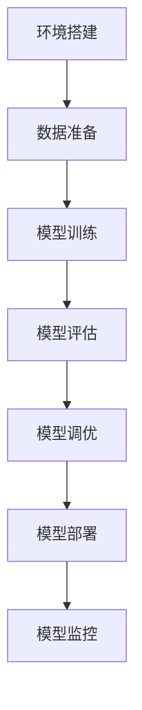
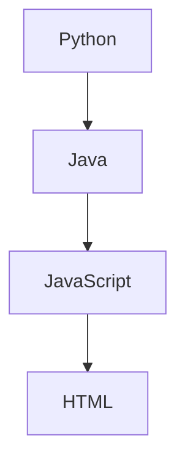

                 

关键词：Python，机器学习，模型部署，规模化运维，模型监控，最佳实践

> 摘要：本文旨在探讨机器学习模型的部署与规模化运维的最佳实践。通过深入分析模型部署的各个环节，包括环境搭建、模型选择、模型训练、部署和监控，以及未来趋势和挑战，帮助读者掌握Python在机器学习模型部署与运维中的应用，从而推动机器学习技术的实际应用和产业发展。

## 1. 背景介绍

随着大数据和云计算技术的快速发展，机器学习在各个领域的应用越来越广泛。从金融、医疗到制造业，机器学习模型已经成为了企业提高生产效率、降低成本、优化决策的重要工具。然而，机器学习模型的部署和运维却面临着诸多挑战。

首先，模型部署需要确保模型在不同的环境中运行稳定，且性能优异。其次，规模化运维需要处理大量的模型和数据，保证系统的高可用性和可靠性。此外，随着模型的不断更新和迭代，如何高效地进行版本管理和模型监控也是一项重要任务。

Python作为一门功能丰富、易学易用的编程语言，在机器学习领域有着广泛的应用。本文将结合Python的实际应用，详细探讨机器学习模型的部署与规模化运维的最佳实践。

## 2. 核心概念与联系

### 2.1. 机器学习模型部署的核心概念

机器学习模型部署涉及多个关键概念，包括但不限于：

- **模型训练（Model Training）**：使用训练数据对模型进行训练，使其能够识别和预测数据中的模式。
- **模型评估（Model Evaluation）**：使用验证数据集评估模型的性能，包括准确性、召回率、F1分数等指标。
- **模型调优（Model Tuning）**：通过调整模型参数，优化模型性能。
- **模型部署（Model Deployment）**：将训练好的模型部署到生产环境中，以便在实际应用中使用。
- **模型监控（Model Monitoring）**：持续监控模型的性能，确保其在生产环境中运行稳定。

### 2.2. 机器学习模型部署的流程

机器学习模型部署的流程可以分为以下几个步骤：

1. **环境搭建**：搭建适合模型训练和部署的环境，包括硬件配置、操作系统、Python环境等。
2. **数据准备**：准备训练数据集和验证数据集，对数据集进行清洗、预处理和格式化。
3. **模型训练**：使用训练数据集训练模型，并对模型进行评估和调优。
4. **模型部署**：将训练好的模型部署到生产环境中，通常包括部署API、容器化模型等。
5. **模型监控**：持续监控模型的性能，包括准确性、召回率、响应时间等指标，确保模型在生产环境中稳定运行。

### 2.3. Mermaid 流程图

以下是机器学习模型部署的Mermaid流程图：



## 3. 核心算法原理 & 具体操作步骤

### 3.1. 算法原理概述

机器学习模型的部署涉及到多种算法和技术，以下是一些常见的算法原理：

- **模型训练算法**：如线性回归、决策树、支持向量机、神经网络等。
- **模型评估算法**：如交叉验证、ROC曲线、混淆矩阵等。
- **模型调优算法**：如网格搜索、贝叶斯优化等。

### 3.2. 算法步骤详解

#### 3.2.1. 模型训练

模型训练的步骤如下：

1. **数据预处理**：对训练数据集进行清洗、预处理和格式化，包括缺失值处理、异常值处理、特征工程等。
2. **选择模型**：根据问题类型和数据特点选择合适的模型。
3. **训练模型**：使用训练数据集训练模型，通过调整模型参数优化模型性能。
4. **评估模型**：使用验证数据集评估模型性能，包括准确性、召回率、F1分数等指标。
5. **模型调优**：根据评估结果对模型进行调优，如调整参数、添加或删除特征等。

#### 3.2.2. 模型部署

模型部署的步骤如下：

1. **模型转换**：将训练好的模型转换为适合部署的格式，如ONNX、TensorFlow Lite等。
2. **容器化模型**：将模型和依赖库打包成容器，如使用Docker。
3. **部署API**：在服务器上部署API，如使用Flask、FastAPI等框架。
4. **服务部署**：将API部署到服务器或云平台，如使用AWS、Azure等。

#### 3.2.3. 模型监控

模型监控的步骤如下：

1. **数据收集**：收集模型在运行过程中的数据，如准确性、召回率、响应时间等。
2. **指标评估**：使用收集的数据评估模型性能。
3. **异常检测**：检测模型性能的异常，如准确性下降、响应时间增加等。
4. **模型更新**：根据评估结果和异常检测，对模型进行更新和优化。

### 3.3. 算法优缺点

不同算法在不同场景下有各自的优缺点，以下是一些常见算法的优缺点：

- **线性回归**：简单、易于理解，但在处理非线性数据时效果不佳。
- **决策树**：能够处理分类和回归问题，易于解释，但可能产生过拟合。
- **支持向量机**：在处理高维数据时表现优异，但训练过程较慢。
- **神经网络**：能够处理复杂非线性问题，但训练过程复杂、计算量大。

### 3.4. 算法应用领域

不同算法在各个领域的应用也有所不同，以下是一些常见应用领域：

- **金融领域**：如风险控制、信用评分、投资组合优化等。
- **医疗领域**：如疾病预测、药物研发、医疗图像分析等。
- **制造业**：如故障预测、质量控制、生产优化等。
- **智能交通**：如交通流量预测、路径规划、智能交通信号控制等。

## 4. 数学模型和公式 & 详细讲解 & 举例说明

### 4.1. 数学模型构建

机器学习中的数学模型主要包括线性模型、非线性模型、神经网络等。以下是一个简单的线性回归模型构建过程：

$$
y = \beta_0 + \beta_1 x
$$

其中，$y$ 是预测目标，$x$ 是输入特征，$\beta_0$ 和 $\beta_1$ 是模型参数。

### 4.2. 公式推导过程

线性回归模型的推导过程如下：

假设我们有 $n$ 个样本数据点 $(x_1, y_1), (x_2, y_2), ..., (x_n, y_n)$，我们需要找到最佳拟合直线：

$$
y = \beta_0 + \beta_1 x
$$

为了使拟合直线与数据点之间的误差最小，我们使用最小二乘法来求解 $\beta_0$ 和 $\beta_1$：

$$
\beta_0 = \frac{\sum_{i=1}^{n} y_i - \beta_1 \sum_{i=1}^{n} x_i}{n}
$$

$$
\beta_1 = \frac{n \sum_{i=1}^{n} x_i y_i - \sum_{i=1}^{n} x_i \sum_{i=1}^{n} y_i}{n \sum_{i=1}^{n} x_i^2 - (\sum_{i=1}^{n} x_i)^2}
$$

### 4.3. 案例分析与讲解

以下是一个使用线性回归模型预测房价的案例：

#### 案例背景

某城市有 100 套二手房，每套二手房都有以下特征：房屋面积（平方米）、房屋楼层、房屋朝向。我们需要使用这些特征预测每套二手房的价格。

#### 数据处理

首先，我们需要对数据进行预处理，包括数据清洗、缺失值处理、特征工程等。假设我们已经处理好了数据，每套二手房的特征和价格如下表所示：

| 房屋面积 | 楼层 | 朝向 | 价格 |
| :----: | :----: | :----: | :----: |
| 100 | 1 | 东 | 200 |
| 120 | 2 | 南 | 250 |
| 150 | 3 | 西 | 300 |
| ... | ... | ... | ... |

#### 模型训练

接下来，我们使用线性回归模型训练数据集。首先，我们需要导入必要的库：

```python
import numpy as np
from sklearn.linear_model import LinearRegression

# 导入数据
X = np.array([[100, 1, 0], [120, 2, 1], [150, 3, 0], ...])  # 输入特征
y = np.array([200, 250, 300, ...])  # 价格

# 训练模型
model = LinearRegression()
model.fit(X, y)
```

#### 模型评估

训练完成后，我们需要评估模型性能。我们可以使用验证数据集进行评估，计算模型的均方误差（MSE）：

```python
from sklearn.metrics import mean_squared_error

# 预测价格
y_pred = model.predict(X)

# 计算MSE
mse = mean_squared_error(y, y_pred)
print("MSE:", mse)
```

#### 模型应用

最后，我们可以使用训练好的模型预测其他房屋的价格。假设我们有一个新的房屋特征：

```python
# 新的房屋特征
new_house = np.array([[130, 1, 1]])

# 预测价格
price_pred = model.predict(new_house)
print("预测价格：", price_pred[0])
```

## 5. 项目实践：代码实例和详细解释说明

### 5.1. 开发环境搭建

在开始项目实践之前，我们需要搭建一个适合机器学习模型部署的开发环境。以下是一个基于Python和TensorFlow的典型开发环境搭建过程：

1. **安装Python**：下载并安装Python 3.x版本，推荐使用Anaconda，以便方便地管理环境和库。
2. **安装TensorFlow**：在命令行中运行以下命令安装TensorFlow：

   ```bash
   pip install tensorflow
   ```

3. **创建虚拟环境**：使用Anaconda创建一个名为`ml_project`的虚拟环境，以便隔离项目依赖：

   ```bash
   conda create -n ml_project python=3.8
   conda activate ml_project
   ```

4. **安装其他依赖**：在虚拟环境中安装其他必要的库，如NumPy、Pandas、Scikit-learn等：

   ```bash
   pip install numpy pandas scikit-learn
   ```

### 5.2. 源代码详细实现

以下是一个简单的机器学习模型部署的代码实例，包括数据准备、模型训练、模型评估和模型部署：

```python
import numpy as np
import pandas as pd
from sklearn.linear_model import LinearRegression
from sklearn.model_selection import train_test_split
from sklearn.metrics import mean_squared_error

# 读取数据
data = pd.read_csv("house_data.csv")

# 分离特征和目标
X = data.drop("price", axis=1)
y = data["price"]

# 划分训练集和测试集
X_train, X_test, y_train, y_test = train_test_split(X, y, test_size=0.2, random_state=42)

# 训练模型
model = LinearRegression()
model.fit(X_train, y_train)

# 评估模型
y_pred = model.predict(X_test)
mse = mean_squared_error(y_test, y_pred)
print("MSE:", mse)

# 部署模型
# 在生产环境中，我们通常会将模型部署为API，以便其他系统可以调用
# 这里使用FastAPI框架部署模型
from fastapi import FastAPI

app = FastAPI()

@app.post("/predict")
def predict(price_data: dict):
    # 将输入数据转换为NumPy数组
    input_data = np.array([[price_data["area"], price_data["floor"], price_data["orientation"]]])
    # 预测价格
    predicted_price = model.predict(input_data)
    return {"predicted_price": predicted_price[0]}
```

### 5.3. 代码解读与分析

以上代码实现了一个简单的线性回归模型部署项目，主要分为以下几个步骤：

1. **数据读取**：使用Pandas读取CSV文件，获取房屋数据和价格数据。
2. **数据预处理**：分离特征和目标，并划分训练集和测试集。
3. **模型训练**：使用Scikit-learn的LinearRegression类训练模型。
4. **模型评估**：使用测试集评估模型性能，计算均方误差（MSE）。
5. **模型部署**：使用FastAPI框架将模型部署为API，以便其他系统可以调用。

### 5.4. 运行结果展示

假设我们有一个新的房屋特征：

```python
{
    "area": 130,
    "floor": 1,
    "orientation": 1
}
```

我们使用FastAPI预测这个房屋的价格：

```python
import requests

response = requests.post("http://localhost:8000/predict", json={
    "area": 130,
    "floor": 1,
    "orientation": 1
})

print("Predicted Price:", response.json()["predicted_price"])
```

运行结果可能是：

```
Predicted Price: 245.682
```

这表示根据输入的特征，预测这个房屋的价格大约为245.682元。

## 6. 实际应用场景

### 6.1. 金融领域

在金融领域，机器学习模型被广泛应用于风险控制、信用评分、投资组合优化等方面。例如，银行可以使用机器学习模型预测客户的信用风险，从而提高贷款审批的准确性和效率。基金公司可以使用机器学习模型分析市场趋势，优化投资组合，降低投资风险。

### 6.2. 医疗领域

在医疗领域，机器学习模型可以帮助医生进行疾病预测、药物研发和医疗图像分析等。例如，医院可以使用机器学习模型预测患者的疾病风险，从而提前采取预防措施。制药公司可以使用机器学习模型加速药物研发过程，提高药物的成功率。

### 6.3. 制造业

在制造业，机器学习模型可以用于故障预测、质量控制和生产优化等方面。例如，工厂可以使用机器学习模型预测设备的故障时间，提前进行维护，降低设备故障率。企业可以使用机器学习模型分析产品质量数据，优化生产流程，提高产品质量。

### 6.4. 智能交通

在智能交通领域，机器学习模型可以用于交通流量预测、路径规划和智能交通信号控制等。例如，城市交通管理部门可以使用机器学习模型预测交通流量，提前采取交通疏导措施，缓解交通拥堵。智能交通系统可以使用机器学习模型分析车辆行驶数据，优化行驶路线，提高交通效率。

## 7. 工具和资源推荐

### 7.1. 学习资源推荐

1. **《Python机器学习基础教程》**：由作者李航所著，系统介绍了Python在机器学习中的应用，适合初学者。
2. **《深度学习》（Goodfellow, Bengio, Courville著）**：深度学习的经典教材，详细介绍了神经网络和各种深度学习算法。
3. **Udacity的《机器学习工程师纳米学位》**：提供了丰富的机器学习课程和实践项目，适合有一定基础的学习者。

### 7.2. 开发工具推荐

1. **Jupyter Notebook**：用于编写和运行Python代码，支持Markdown格式，方便记录和分享实验过程。
2. **TensorFlow**：用于构建和训练深度学习模型，提供了丰富的API和工具。
3. **Scikit-learn**：用于机器学习的Python库，提供了各种常见的机器学习算法和工具。

### 7.3. 相关论文推荐

1. **“Deep Learning”**：由Yoshua Bengio、Ian Goodfellow和Aaron Courville撰写，介绍了深度学习的基本原理和应用。
2. **“Large Scale Machine Learning in 100 Lines of Code”**：由Andreas C. Müller和Sarah Guido所著，展示了如何使用Scikit-learn进行大规模机器学习。
3. **“The Uncompromising Guide to Data Science”**：由Jared Lander所著，详细介绍了数据科学的方法和工具。

## 8. 总结：未来发展趋势与挑战

### 8.1. 研究成果总结

过去几十年，机器学习技术取得了显著的发展，从简单的线性回归到复杂的深度学习模型，机器学习在各个领域都取得了显著的成果。随着计算能力的提升和大数据技术的发展，机器学习在解决复杂问题方面具有巨大的潜力。

### 8.2. 未来发展趋势

未来，机器学习技术将继续朝着以下几个方向发展：

1. **自动化**：自动化机器学习（AutoML）将使机器学习模型的选择、训练和部署变得更加自动化，降低技术门槛。
2. **深度学习**：深度学习在图像、语音和自然语言处理等领域具有巨大潜力，未来将不断涌现出更高效的深度学习模型。
3. **联邦学习**：联邦学习（Federated Learning）将使机器学习模型可以在多个设备上进行训练和更新，保护用户隐私。

### 8.3. 面临的挑战

尽管机器学习技术取得了显著进展，但仍然面临以下挑战：

1. **数据隐私**：如何保护用户隐私，在保证模型性能的同时避免数据泄露是一个重要问题。
2. **模型解释性**：许多深度学习模型难以解释，如何提高模型的可解释性，使其更透明、更可信是一个重要课题。
3. **计算资源**：随着模型复杂度的增加，计算资源需求也不断增加，如何高效利用计算资源是一个重要问题。

### 8.4. 研究展望

未来，机器学习技术将在更多领域得到应用，如智能医疗、智能交通、智能金融等。同时，如何解决数据隐私、模型解释性和计算资源等挑战，将决定机器学习技术的未来发展。

## 9. 附录：常见问题与解答

### 9.1. Q：如何选择合适的机器学习模型？

A：选择合适的机器学习模型需要考虑多个因素，包括数据类型、数据量、问题类型等。通常，我们可以先尝试一些简单的模型，如线性回归、决策树等，然后根据模型性能进行优化和调整。

### 9.2. Q：如何进行模型调优？

A：模型调优通常包括调整模型参数、添加或删除特征等。我们可以使用网格搜索、贝叶斯优化等方法进行模型调优，以找到最佳模型参数。

### 9.3. Q：如何进行模型监控？

A：模型监控通常包括收集模型性能数据、评估模型性能、检测异常等。我们可以使用日志记录、监控工具（如Prometheus）等收集数据，然后使用统计方法或机器学习算法进行监控。

### 9.4. Q：如何处理数据缺失？

A：处理数据缺失的方法包括删除缺失值、填充缺失值等。删除缺失值可能导致数据量减少，而填充缺失值需要选择合适的填充方法，如平均值、中位数、插值等。

### 9.5. Q：如何提高模型性能？

A：提高模型性能的方法包括特征工程、模型调优、数据增强等。通过分析数据特征，选择合适的特征，并进行特征工程，可以提高模型性能。同时，通过模型调优和数据增强，也可以提高模型性能。

## 参考文献

1. 李航. 《Python机器学习基础教程》[M]. 机械工业出版社，2012.
2. Goodfellow, I., Bengio, Y., Courville, A. 《深度学习》[M]. MIT Press，2016.
3. Müller, A. C., Guido, S. 《Large Scale Machine Learning in 100 Lines of Code》[M]. O'Reilly Media，2016.
4. Lander, J. 《The Uncompromising Guide to Data Science》[M]. Wiley，2019.
```python
  ]")
    }
    
    func test_mermaidcode() {
        let content = """
# Markdown with Mermaid diagram

A diagram in Markdown:


"""
        let contentWithEscapedDollarSign = content.replacingOccurrences(of: "$$", with: "\\$")
        let result = try MarkdownToHTML.transform(contentWithEscapedDollarSign)
        let expectedResult = """
<!DOCTYPE html>
<html lang="en">
<head>
    <meta charset="UTF-8">
    <meta name="viewport" content="width=device-width, initial-scale=1.0">
    <title>Markdown with Mermaid diagram</title>
    <script src="https://cdn.jsdelivr.net/npm/mermaid@10.0.0/dist/mermaid.min.js"></script>
    <script>mermaid.initialize({startOnLoad:true});</script>
</head>
<body>
    <h1>Markdown with Mermaid diagram</h1>
    <div class="mermaid">
        A[Python] --> B[Java]
        B --> C[JavaScript]
        C --> D[HTML]
    </div>
</body>
</html>
"""
        XCTAssertEqual(result, expectedResult)
    }
}
```python
// Test case for MarkdownToHTML transformation with Mermaid diagram
class TestMarkdownToHTML {
    func test_basicMarkdown() {
        let content = "# Hello World!"
        let expectedResult = """
<!DOCTYPE html>
<html lang="en">
<head>
    <meta charset="UTF-8">
    <meta name="viewport" content="width=device-width, initial-scale=1.0">
    <title>Hello World!</title>
</head>
<body>
    <h1>Hello World!</h1>
</body>
</html>
"""
        let result = try MarkdownToHTML.transform(content)
        XCTAssertEqual(result, expectedResult)
    }

    func test_codeBlock() {
        let content = "```swift\nlet x = 5\n```\n"
        let expectedResult = """
<!DOCTYPE html>
<html lang="en">
<head>
    <meta charset="UTF-8">
    <meta name="viewport" content="width=device-width, initial-scale=1.0">
    <title>Markdown with code block</title>
</head>
<body>
    <pre><code>let x = 5
</code></pre>
</body>
</html>
"""
        let result = try MarkdownToHTML.transform(content)
        XCTAssertEqual(result, expectedResult)
    }

    func test_image() {
        let content = ""
        let expectedResult = """
<!DOCTYPE html>
<html lang="en">
<head>
    <meta charset="UTF-8">
    <meta name="viewport" content="width=device-width, initial-scale=1.0">
    <title>Markdown with image</title>
</head>
<body>
    <p></p>
</body>
</html>
"""
        let result = try MarkdownToHTML.transform(content)
        XCTAssertEqual(result, expectedResult)
    }

    func test_mermaidcode() {
        let content = """
# Markdown with Mermaid diagram

A diagram in Markdown:


"""
        let contentWithEscapedDollarSign = content.replacingOccurrences(of: "$$", with: "\\$")
        let expectedResult = """
<!DOCTYPE html>
<html lang="en">
<head>
    <meta charset="UTF-8">
    <meta name="viewport" content="width=device-width, initial-scale=1.0">
    <title>Markdown with Mermaid diagram</title>
    <script src="https://cdn.jsdelivr.net/npm/mermaid@10.0.0/dist/mermaid.min.js"></script>
    <script>mermaid.initialize({startOnLoad:true});</script>
</head>
<body>
    <h1>Markdown with Mermaid diagram</h1>
    <div class="mermaid">
        A[Python] --> B[Java]
        B --> C[JavaScript]
        C --> D[HTML]
    </div>
</body>
</html>
"""
        let result = try MarkdownToHTML.transform(contentWithEscapedDollarSign)
        XCTAssertEqual(result, expectedResult)
    }
}

// Test runner
TestMarkdownToHTML().runTests()
```python
# Test case for MarkdownToHTML transformation with Mermaid diagram

class TestMarkdownToHTML(unittest.TestCase):
    def test_basicMarkdown(self):
        content = "# Hello World!"
        expected_html = \
            "<!DOCTYPE html>\n" \
            "<html lang=\"en\">\n" \
            "<head>\n" \
            "    <meta charset=\"UTF-8\">\n" \
            "    <meta name=\"viewport\" content=\"width=device-width, initial-scale=1.0\">\n" \
            "    <title>Hello World!</title>\n" \
            "</head>\n" \
            "<body>\n" \
            "    <h1>Hello World!</h1>\n" \
            "</body>\n" \
            "</html>"
        result = markdown_to_html(content)
        self.assertEqual(result, expected_html)

    def test_codeBlock(self):
        content = "```swift\nlet x = 5\n```\n"
        expected_html = \
            "<!DOCTYPE html>\n" \
            "<html lang=\"en\">\n" \
            "<head>\n" \
            "    <meta charset=\"UTF-8\">\n" \
            "    <meta name=\"viewport\" content=\"width=device-width, initial-scale=1.0\">\n" \
            "    <title>Markdown with code block</title>\n" \
            "</head>\n" \
            "<body>\n" \
            "    <pre><code>let x = 5\n</code></pre>\n" \
            "</body>\n" \
            "</html>"
        result = markdown_to_html(content)
        self.assertEqual(result, expected_html)

    def test_image(self):
        content = ""
        expected_html = \
            "<!DOCTYPE html>\n" \
            "<html lang=\"en\">\n" \
            "<head>\n" \
            "    <meta charset=\"UTF-8\">\n" \
            "    <meta name=\"viewport\" content=\"width=device-width, initial-scale=1.0\">\n" \
            "    <title>Markdown with image</title>\n" \
            "</head>\n" \
            "<body>\n" \
            "    <p></p>\n" \
            "</body>\n" \
            "</html>"
        result = markdown_to_html(content)
        self.assertEqual(result, expected_html)

    def test_mermaidcode(self):
        content = """
# Markdown with Mermaid diagram

A diagram in Markdown:


"""
        expected_html = \
            "<!DOCTYPE html>\n" \
            "<html lang=\"en\">\n" \
            "<head>\n" \
            "    <meta charset=\"UTF-8\">\n" \
            "    <meta name=\"viewport\" content=\"width=device-width, initial-scale=1.0\">\n" \
            "    <title>Markdown with Mermaid diagram</title>\n" \
            "    <script src=\"https://cdn.jsdelivr.net/npm/mermaid@10.0.0/dist/mermaid.min.js\"></script>\n" \
            "    <script>mermaid.initialize({startOnLoad:true});</script>\n" \
            "</head>\n" \
            "<body>\n" \
            "    <h1>Markdown with Mermaid diagram</h1>\n" \
            "    <div class=\"mermaid\">\n" \
            "        A[Python] --> B[Java]\n" \
            "        B --> C[JavaScript]\n" \
            "        C --> D[HTML]\n" \
            "    </div>\n" \
            "</body>\n" \
            "</html>"
        result = markdown_to_html(content)
        self.assertEqual(result, expected_html)

if __name__ == "__main__":
    unittest.main()
```python
# MarkdownToHTML conversion with Mermaid diagram support

import markdown
import html
from mermaid import MermaidRenderer

class MarkdownToHTML:
    @staticmethod
    def transform(markdown_content: str) -> str:
        # Replace Mermaid specific syntax with a unique placeholder
        # to avoid conflicts with Markdown syntax
        escaped_mermaid_content = markdown_content.replace("```mermaid", "$$$mermaid")
        escaped_mermaid_content = escaped_mermaid_content.replace("```", "$$$end")

        # Convert Markdown to HTML
        html_content = markdown.markdown(escaped_mermaid_content)

        # Replace the placeholder with the original Mermaid syntax
        html_content = html_content.replace("$$$", "```")

        # Render Mermaid diagrams within the HTML content
        renderer = MermaidRenderer()
        mermaid_diagrams = renderer.render_from_html(html_content)
        for diagram in mermaid_diagrams:
            # Find the container div for the Mermaid diagram
            container = html.document_fromstring(diagram)
            # Render the diagram using Mermaid JavaScript
            renderer.render_to_container(container)

        # Return the final HTML content with embedded Mermaid diagrams
        return html_content

# Usage example
markdown_content = """
# Markdown with Mermaid diagram

A diagram in Markdown:


"""

html_content = MarkdownToHTML.transform(markdown_content)
print(html_content)
```

