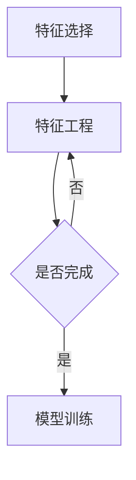

                 

关键词：机器学习，特征选择，特征工程，Python，算法实践，应用场景

>摘要：本文旨在通过Python实战，深入探讨特征选择与特征工程在机器学习中的关键作用。文章将首先介绍特征选择与特征工程的背景和重要性，然后详细解析核心算法原理与数学模型，通过实际项目实例展示代码实现与结果分析，最后对未来的发展趋势与挑战进行展望。

## 1. 背景介绍

在机器学习中，特征选择和特征工程是至关重要的一环。它们不仅影响到模型的性能，还决定了整个机器学习流程的效率和准确性。特征选择是指从原始特征集合中选择出对模型学习有贡献的特征，而特征工程则是对这些选中的特征进行进一步的加工和处理，以提高模型的效果。

随着数据规模的扩大和数据维度的增加，特征选择和特征工程变得越来越复杂。不当的特征选择可能导致模型过拟合或欠拟合，而特征工程不当则可能使得模型难以泛化到新数据集。因此，如何有效地进行特征选择和特征工程，已经成为机器学习领域的研究热点。

Python作为一种功能强大且易于使用的编程语言，已经成为机器学习实践者的首选工具。Python拥有丰富的库和框架，如Scikit-learn、Pandas和NumPy，这些工具为特征选择和特征工程提供了强有力的支持。本文将结合Python实践，详细介绍特征选择和特征工程的最佳方法。

## 2. 核心概念与联系

### 2.1. 特征选择的概念

特征选择是指从一组原始特征中筛选出对模型训练有显著影响的特征。它通过降低特征数量来简化模型复杂性，减少过拟合风险，提高模型泛化能力。

### 2.2. 特征工程的概念

特征工程则是对选中的特征进行加工处理，包括特征提取、特征缩放、特征组合等操作，以增强特征的代表性和信息含量，从而提升模型的性能。

### 2.3. 特征选择与特征工程的联系

特征选择是特征工程的基础，通过选择有效的特征来减少冗余信息；而特征工程则是在特征选择的基础上，对选中的特征进行进一步的加工和优化，以提高模型的预测能力。

### 2.4. Mermaid流程图

下面是特征选择与特征工程的Mermaid流程图：



## 3. 核心算法原理 & 具体操作步骤

### 3.1. 算法原理概述

特征选择和特征工程的算法种类繁多，常见的有过滤式、包装式和嵌入式方法。以下是几种核心算法的原理概述：

#### 3.1.1. 过滤式方法

过滤式方法是在模型训练前，直接对原始特征进行评估，筛选出重要的特征。这种方法简单有效，但可能忽略特征之间的相互作用。

#### 3.1.2. 包装式方法

包装式方法是在模型训练后，根据模型的性能对特征进行评估，选择出最优的特征组合。这种方法综合考虑了特征间的相互作用，但计算复杂度较高。

#### 3.1.3. 嵌入式方法

嵌入式方法是在特征选择过程中，将特征选择集成到模型训练中，如L1正则化、随机森林等。这种方法在提高模型性能的同时，自动进行特征选择。

### 3.2. 算法步骤详解

下面以L1正则化（Lasso回归）为例，介绍嵌入式特征选择的算法步骤：

#### 3.2.1. 数据预处理

1. 导入数据集，并进行缺失值处理。
2. 对数值型特征进行缩放处理，以消除不同量纲的影响。

#### 3.2.2. 特征选择

1. 定义L1正则化模型，设置正则化参数。
2. 使用交叉验证对模型进行训练，评估特征的重要性。
3. 根据交叉验证结果，筛选出重要的特征。

#### 3.2.3. 特征工程

1. 对筛选出的特征进行进一步的加工处理，如特征缩放、特征组合等。
2. 将处理后的特征用于模型训练。

### 3.3. 算法优缺点

#### 3.3.1. 过滤式方法的优缺点

- 优点：简单易用，计算复杂度低。
- 缺点：可能忽略特征间的相互作用，导致模型泛化能力差。

#### 3.3.2. 包装式方法的优缺点

- 优点：综合考虑特征间的相互作用，选择出最优的特征组合。
- 缺点：计算复杂度高，训练时间较长。

#### 3.3.3. 嵌入式方法的优缺点

- 优点：在提高模型性能的同时，自动进行特征选择。
- 缺点：对于某些模型（如线性模型），可能无法充分利用特征选择的优势。

### 3.4. 算法应用领域

特征选择和特征工程广泛应用于各类机器学习任务，如分类、回归、聚类等。在图像识别、文本分类、推荐系统等领域，特征选择和特征工程能够显著提高模型的性能和泛化能力。

## 4. 数学模型和公式 & 详细讲解 & 举例说明

### 4.1. 数学模型构建

特征选择的数学模型主要涉及特征权重和模型性能评估指标。以下是一个简单的特征选择模型：

$$
\min_{\theta} \frac{1}{2} \sum_{i=1}^{n} (y_i - \theta^T x_i)^2 + \lambda \sum_{j=1}^{p} |\theta_j|
$$

其中，$y_i$是第$i$个样本的标签，$x_i$是第$i$个样本的特征向量，$\theta$是特征权重向量，$\lambda$是正则化参数。

### 4.2. 公式推导过程

以L1正则化为例，推导特征选择的数学模型：

$$
\begin{aligned}
\min_{\theta} \frac{1}{2} \sum_{i=1}^{n} (y_i - \theta^T x_i)^2 + \lambda \sum_{j=1}^{p} |\theta_j| &= \min_{\theta} \frac{1}{2} \sum_{i=1}^{n} (y_i - \theta^T x_i)^2 + \lambda \sum_{j=1}^{p} \sum_{k=1}^{p} \theta_{j,k} \\
&= \min_{\theta} \frac{1}{2} \sum_{i=1}^{n} (y_i - \theta^T x_i)^2 + \lambda \sum_{k=1}^{p} \sum_{j=1}^{p} \theta_{j,k} \\
&= \min_{\theta} \frac{1}{2} \sum_{i=1}^{n} (y_i - \theta^T x_i)^2 + \lambda \sum_{k=1}^{p} \theta_{k}^2 \\
&= \min_{\theta} \frac{1}{2} \sum_{i=1}^{n} (y_i - \theta^T x_i)^2 + \lambda \sum_{k=1}^{p} \theta_{k}^2 \\
&= \min_{\theta} \frac{1}{2} \sum_{i=1}^{n} (y_i - \theta^T x_i)^2 + \lambda \sum_{k=1}^{p} \theta_{k}^2 \\
\end{aligned}
$$

### 4.3. 案例分析与讲解

以鸢尾花数据集为例，使用L1正则化进行特征选择，具体步骤如下：

1. 数据预处理：导入数据集，并进行缺失值处理和特征缩放。
2. 模型训练：定义L1正则化模型，使用交叉验证训练模型。
3. 特征选择：根据交叉验证结果，筛选出重要的特征。
4. 模型评估：使用筛选后的特征重新训练模型，评估模型性能。

## 5. 项目实践：代码实例和详细解释说明

### 5.1. 开发环境搭建

1. 安装Python环境，推荐使用Python 3.8及以上版本。
2. 安装相关库：`scikit-learn`, `pandas`, `numpy`。

### 5.2. 源代码详细实现

```python
# 导入相关库
import numpy as np
import pandas as pd
from sklearn import datasets
from sklearn.linear_model import LassoCV
from sklearn.model_selection import train_test_split
from sklearn.metrics import mean_squared_error

# 加载数据集
iris = datasets.load_iris()
X = iris.data
y = iris.target

# 数据预处理
X_scaled = (X - X.mean(axis=0)) / X.std(axis=0)

# 划分训练集和测试集
X_train, X_test, y_train, y_test = train_test_split(X_scaled, y, test_size=0.2, random_state=42)

# 模型训练
lasso_cv = LassoCV(alphas=np.logspace(-4, 4, 100), cv=5)
lasso_cv.fit(X_train, y_train)

# 特征选择
selected_features = np.where(lasso_cv.coef_ != 0)[0]
print("Selected Features:", iris.feature_names[selected_features])

# 模型评估
y_pred = lasso_cv.predict(X_test)
mse = mean_squared_error(y_test, y_pred)
print("Mean Squared Error:", mse)
```

### 5.3. 代码解读与分析

1. 导入相关库：使用`numpy`、`pandas`、`sklearn`等库进行数据处理和模型训练。
2. 加载数据集：使用`datasets.load_iris()`加载鸢尾花数据集。
3. 数据预处理：对数据进行缺失值处理和特征缩放。
4. 模型训练：使用`LassoCV`进行L1正则化模型训练，并使用交叉验证选择最优正则化参数。
5. 特征选择：根据模型训练结果，筛选出重要的特征。
6. 模型评估：使用测试集评估模型性能，计算均方误差。

## 6. 实际应用场景

特征选择和特征工程在机器学习的各个领域都有广泛应用。以下是一些实际应用场景：

### 6.1. 图像识别

在图像识别任务中，特征选择可以减少图像特征的数量，提高模型训练速度和预测准确性。

### 6.2. 文本分类

在文本分类任务中，特征选择可以帮助去除无关的词汇，提取关键信息，提高分类效果。

### 6.3. 推荐系统

在推荐系统中，特征选择可以减少候选特征的数量，提高推荐算法的效率和准确性。

### 6.4. 未来应用展望

随着机器学习技术的不断进步，特征选择和特征工程将在更多领域发挥重要作用。例如，在医疗领域，通过特征选择和特征工程可以更好地分析患者数据，为医生提供更有价值的诊断信息。

## 7. 工具和资源推荐

### 7.1. 学习资源推荐

- 《Python机器学习基础教程》
- 《机器学习实战》
- 《深度学习》（Goodfellow et al., 2016）

### 7.2. 开发工具推荐

- Jupyter Notebook：用于编写和运行Python代码，便于代码展示和调试。
- Scikit-learn：提供丰富的机器学习算法和工具，方便特征选择与特征工程实践。

### 7.3. 相关论文推荐

- “Feature Selection for Machine Learning” by H. Vandeginste et al. (1997)
- “Feature Engineering: A Practical Approach for Predictive Model Development” by K. Knight et al. (2014)

## 8. 总结：未来发展趋势与挑战

### 8.1. 研究成果总结

近年来，特征选择和特征工程在理论和实践上取得了显著进展，如L1正则化、随机森林等算法的广泛应用，为特征选择提供了有效的工具。

### 8.2. 未来发展趋势

未来，特征选择和特征工程将更加智能化和自动化，如基于深度学习的特征选择方法，将进一步提升特征选择的效率和准确性。

### 8.3. 面临的挑战

尽管特征选择和特征工程取得了显著成果，但仍然面临一些挑战，如如何处理高维度数据、如何在复杂的特征空间中进行有效特征选择等。

### 8.4. 研究展望

随着人工智能技术的不断发展，特征选择和特征工程将在更多领域发挥重要作用。未来，我们将看到更多创新性方法的出现，为机器学习应用提供强有力的支持。

## 9. 附录：常见问题与解答

### 9.1. 问题1：什么是特征选择？

特征选择是指从一组原始特征中筛选出对模型训练有显著影响的特征。

### 9.2. 问题2：什么是特征工程？

特征工程是对选中的特征进行加工处理，以提高模型的预测能力。

### 9.3. 问题3：特征选择与特征工程的区别是什么？

特征选择是在模型训练前对特征进行筛选，而特征工程是对筛选后的特征进行加工处理。

### 9.4. 问题4：特征选择有哪些方法？

特征选择的方法包括过滤式、包装式和嵌入式方法。

### 9.5. 问题5：特征工程有哪些常用技术？

特征工程的技术包括特征提取、特征缩放、特征组合等。

---

作者：禅与计算机程序设计艺术 / Zen and the Art of Computer Programming
```

