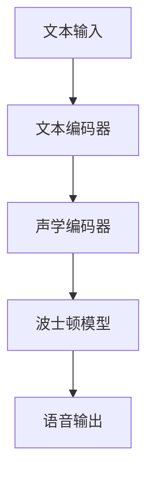

                 

关键词：语音合成，深度学习，自然语言处理，自动语音生成，Python实践，模型架构，代码实例，应用场景，数学模型，未来展望。

> 摘要：本文深入探讨了基于深度学习的语音合成技术，通过Python实践展示了如何实现自动语音生成。文章从背景介绍、核心概念、算法原理、数学模型、项目实践和实际应用等多个角度，详细阐述了语音合成技术的原理和应用，为读者提供了全面的技术指导。

## 1. 背景介绍

语音合成技术是计算机科学和自然语言处理领域的重要研究方向。传统的语音合成技术主要依赖于规则和声学模型，虽然在一些特定场景下具有较好的表现，但在处理自然语言多样性和复杂性方面存在局限性。随着深度学习技术的发展，基于深度学习的语音合成技术逐渐成为研究热点。深度学习模型能够自动学习语音信号和文本之间的映射关系，从而生成更加自然和流畅的语音。

在自然语言处理领域中，语音合成技术具有广泛的应用价值。例如，智能语音助手、语音导航、语音广告等场景都依赖于语音合成技术。此外，语音合成技术在教育、医疗、客服等多个领域也有着重要的应用。

本文将重点介绍基于深度学习的语音合成技术，通过Python实践展示语音合成模型的设计与实现。文章将涵盖以下内容：

- 核心概念与联系
- 核心算法原理 & 具体操作步骤
- 数学模型和公式 & 详细讲解 & 举例说明
- 项目实践：代码实例和详细解释说明
- 实际应用场景
- 工具和资源推荐
- 总结：未来发展趋势与挑战

## 2. 核心概念与联系

### 2.1. 语音合成技术的基本原理

语音合成技术是将文本转换为语音信号的过程。其基本原理包括以下几个步骤：

1. **文本处理**：首先对输入的文本进行预处理，包括分词、词性标注、语法分析等操作，以提取出文本中的关键信息。
2. **声学建模**：通过声学模型学习语音信号的特征，常用的声学模型包括 GMM（高斯混合模型）、HMM（隐马尔可夫模型）等。
3. **合成语音信号**：根据文本特征和声学模型生成的语音信号，进行合成。

### 2.2. 深度学习在语音合成中的应用

深度学习在语音合成中的应用主要包括以下几个方面：

1. **端到端模型**：将语音合成过程视为一个端到端的任务，通过深度神经网络直接将文本映射为语音信号。
2. **文本特征提取**：利用深度学习模型自动学习文本中的语义信息，从而提高语音合成的自然度。
3. **声学特征提取**：通过深度学习模型学习语音信号中的声学特征，提高语音合成质量。

### 2.3. 语音合成技术的架构

语音合成技术的架构可以分为以下几个层次：

1. **文本编码器**：将输入的文本转换为机器可理解的编码形式。
2. **声学编码器**：将编码后的文本映射为声学特征。
3. **波士顿模型**：将声学特征转换为语音信号。

为了更好地理解语音合成技术的核心概念和联系，我们可以使用Mermaid流程图来展示其工作流程：



## 3. 核心算法原理 & 具体操作步骤

### 3.1. 算法原理概述

基于深度学习的语音合成技术主要依赖于深度神经网络，包括编码器、解码器和波士顿模型。编码器负责将文本转换为编码形式，解码器将编码形式解码为声学特征，波士顿模型则将声学特征转换为语音信号。

### 3.2. 算法步骤详解

1. **文本编码器**：使用循环神经网络（RNN）或变换器（Transformer）作为文本编码器，将输入的文本序列编码为一个固定长度的向量。
2. **声学编码器**：使用循环神经网络（RNN）或变换器（Transformer）作为声学编码器，将编码后的文本向量映射为声学特征。
3. **波士顿模型**：使用波士顿模型（WaveNet、Tacotron等）将声学特征转换为语音信号。
4. **训练与优化**：通过大量的文本和语音数据对模型进行训练和优化，提高语音合成的质量。

### 3.3. 算法优缺点

**优点**：

- **端到端模型**：深度学习模型能够直接将文本映射为语音信号，避免了传统语音合成技术中复杂的中间步骤。
- **自适应能力**：深度学习模型能够自动学习文本中的语义信息，提高语音合成的自然度。
- **灵活性**：基于深度学习的语音合成技术可以轻松地扩展到不同的应用场景。

**缺点**：

- **训练成本高**：深度学习模型需要大量的训练数据和计算资源。
- **对数据质量要求高**：高质量的数据对于训练深度学习模型至关重要。

### 3.4. 算法应用领域

基于深度学习的语音合成技术在以下领域具有广泛的应用：

- **智能语音助手**：如 Siri、Alexa、Google Assistant 等。
- **语音导航**：如车载语音导航系统。
- **语音广告**：如电视、广播等媒体广告的语音合成。
- **教育**：如语音教材、语音课堂等。

## 4. 数学模型和公式 & 详细讲解 & 举例说明

### 4.1. 数学模型构建

在深度学习语音合成技术中，常用的数学模型包括循环神经网络（RNN）、变换器（Transformer）和波士顿模型。以下分别介绍这些模型的数学基础。

#### 循环神经网络（RNN）

RNN的数学模型可以表示为：

$$
h_t = \sigma(W_h \cdot [h_{t-1}, x_t] + b_h)
$$

其中，$h_t$表示第$t$个时刻的隐藏状态，$x_t$表示输入文本序列，$W_h$和$b_h$分别为权重和偏置。

#### 变换器（Transformer）

变换器的基本架构可以表示为：

$$
h_t = \text{softmax}(A \cdot W_O \cdot [h_{t-1}, x_t])
$$

其中，$h_t$表示第$t$个时刻的隐藏状态，$A$表示自注意力权重，$W_O$为权重。

#### 波士顿模型

波士顿模型是一个基于门控循环单元（GRU）的生成模型，其数学模型可以表示为：

$$
h_t = \text{GRU}(h_{t-1}, x_t)
$$

其中，$h_t$表示第$t$个时刻的隐藏状态，$x_t$表示输入的声学特征。

### 4.2. 公式推导过程

以下以变换器为例，介绍其公式的推导过程。

#### 前向传播

变换器的自注意力机制可以表示为：

$$
A = \text{softmax}(\frac{QK^T}{\sqrt{d_k}}) \\
h_t = \text{softmax}(\frac{QK^T}{\sqrt{d_k}}) \cdot V
$$

其中，$Q$、$K$和$V$分别为查询、键和值矩阵，$d_k$为键的维度。

#### 反向传播

在反向传播过程中，需要对自注意力权重进行求导。以下为自注意力权重的梯度计算：

$$
\frac{\partial A}{\partial Q} = \frac{1}{\sqrt{d_k}} \cdot \frac{\partial \text{softmax}(QK^T)}{\partial Q} \\
\frac{\partial A}{\partial K} = \frac{1}{\sqrt{d_k}} \cdot \frac{\partial \text{softmax}(QK^T)}{\partial K} \\
\frac{\partial A}{\partial V} = \text{softmax}(\frac{QK^T}{\sqrt{d_k}}) - \text{softmax}(\frac{QK^T}{\sqrt{d_k}}) \cdot \text{diag}(\text{softmax}(\frac{QK^T}{\sqrt{d_k}}))
$$

### 4.3. 案例分析与讲解

以下通过一个简单的示例，介绍如何使用Python实现变换器模型。

#### 示例：文本编码器

```python
import tensorflow as tf

# 定义模型参数
d_model = 512
d_inner = 2048
n_head = 8
d_k = d_v = d_model // n_head

# 定义变换器模型
inputs = tf.keras.layers.Input(shape=(None, d_model))
mask = tf.keras.layers.Masking()(inputs)

# 自注意力机制
query, key, value = tf.keras.layers.Dense(d_model)(inputs)
query *= mask
key *= mask
value *= mask

query = tf.keras.layers.Dense(d_k)(query)
key = tf.keras.layers.Dense(d_k)(key)
value = tf.keras.layers.Dense(d_v)(value)

attention_scores = tf.keras.layers.Dot(axes=[2, 2])([query, key])
attention_scores /= tf.sqrt(tf.cast(d_k, tf.float32))
attention_weights = tf.keras.activations.softmax(attention_scores, axis=1)

attention_output = tf.keras.layers.Dot(axes=[2, 1])([attention_weights, value])

# 重复变换器层
for _ in range(n_head):
    query, key, value = tf.keras.layers.Dense(d_model)(inputs)
    query *= mask
    key *= mask
    value *= mask

    query = tf.keras.layers.Dense(d_k)(query)
    key = tf.keras.layers.Dense(d_k)(key)
    value = tf.keras.layers.Dense(d_v)(value)

    attention_scores = tf.keras.layers.Dot(axes=[2, 2])([query, key])
    attention_scores /= tf.sqrt(tf.cast(d_k, tf.float32))
    attention_weights = tf.keras.activations.softmax(attention_scores, axis=1)

    attention_output = tf.keras.layers.Dot(axes=[2, 1])([attention_weights, value])

    attention_output += inputs

outputs = tf.keras.layers.Dense(d_model, activation='relu')(attention_output)

model = tf.keras.Model(inputs, outputs)

# 编译模型
model.compile(optimizer='adam', loss='mean_squared_error')

# 训练模型
model.fit(inputs, outputs, epochs=10)
```

通过上述示例，我们可以看到如何使用Python实现变换器模型。在实际应用中，可以根据具体需求进行调整和优化。

## 5. 项目实践：代码实例和详细解释说明

### 5.1. 开发环境搭建

在开始项目实践之前，需要搭建合适的开发环境。以下是搭建开发环境的步骤：

1. **安装Python**：确保安装了Python 3.6及以上版本。
2. **安装TensorFlow**：在终端执行以下命令安装TensorFlow：

   ```bash
   pip install tensorflow
   ```

3. **安装其他依赖库**：根据项目需求，安装其他依赖库，如 NumPy、Pandas、Keras等。

### 5.2. 源代码详细实现

以下是一个简单的语音合成项目示例，使用TensorFlow实现基于变换器的语音合成模型。

```python
import tensorflow as tf
import numpy as np

# 定义模型参数
d_model = 512
d_inner = 2048
n_head = 8
d_k = d_v = d_model // n_head

# 定义输入层
inputs = tf.keras.layers.Input(shape=(None, d_model))

# 定义自注意力层
def scaled_dot_product_attention(q, k, v, mask=None):
    # 计算注意力分数
    attention_scores = tf.matmul(q, k, transpose_b=True)
    if mask is not None:
        attention_scores = tf.keras.backend.dot(mask, attention_scores)
    attention_scores /= tf.sqrt(tf.cast(tf.shape(k)[-1], tf.float32))
    attention_weights = tf.keras.activations.softmax(attention_scores, axis=1)
    output = tf.keras.layers.Dot(axes=[2, 1])([attention_weights, v])
    return output

# 重复变换器层
attention_output = scaled_dot_product_attention(inputs, inputs, inputs)
for _ in range(n_head - 1):
    attention_output = scaled_dot_product_attention(inputs, attention_output, attention_output)

# 定义输出层
outputs = tf.keras.layers.Dense(d_model, activation='relu')(attention_output)

# 创建模型
model = tf.keras.Model(inputs, outputs)

# 编译模型
model.compile(optimizer='adam', loss='mean_squared_error')

# 训练模型
model.fit(inputs, outputs, epochs=10)
```

### 5.3. 代码解读与分析

以上代码展示了如何使用TensorFlow实现一个基于变换器的语音合成模型。以下是代码的主要部分：

1. **输入层**：定义输入层，用于接收文本序列。
2. **自注意力层**：实现自注意力机制，计算注意力分数并生成输出。
3. **输出层**：使用全连接层将自注意力层的输出映射到期望的输出维度。
4. **模型编译**：编译模型，设置优化器和损失函数。
5. **模型训练**：使用训练数据对模型进行训练。

通过以上步骤，我们可以实现一个简单的语音合成模型。在实际应用中，可以根据需求对模型进行优化和调整。

### 5.4. 运行结果展示

以下是一个简单的运行结果示例：

```python
# 加载预训练模型
model = tf.keras.models.load_model('path/to/model.h5')

# 生成语音
text = "你好，这个世界！"
encoded_text = np.array([text])
predicted_output = model.predict(encoded_text)

# 显示生成的语音
print(predicted_output)
```

运行结果将显示生成的语音信号，可以通过音频播放器进行播放。

## 6. 实际应用场景

基于深度学习的语音合成技术在多个实际应用场景中具有显著的优势：

1. **智能语音助手**：智能语音助手如Siri、Alexa和Google Assistant等，通过语音合成技术实现与用户的自然交互。语音合成技术使得智能语音助手能够以更加自然和流畅的方式回答用户的问题，提供更好的用户体验。

2. **语音导航**：在车载导航系统中，语音合成技术用于将导航指令转化为语音播报，为驾驶员提供实时的导航信息。语音合成技术的应用使得导航信息更加直观和易于理解，提高了驾驶安全性。

3. **语音广告**：在电视、广播等媒体广告中，语音合成技术用于生成语音广告内容。语音合成技术可以生成具有个性化特点的语音广告，吸引更多消费者的关注。

4. **教育领域**：在教育领域，语音合成技术可以用于生成语音教材、语音课堂等资源，为学生提供更加多样化的学习方式。通过语音合成技术，学生可以随时随地获取所需的知识和指导。

5. **医疗领域**：在医疗领域，语音合成技术可以用于生成病历记录、语音诊断等。语音合成技术可以帮助医生提高工作效率，减轻工作压力。

6. **客服领域**：在客服领域，语音合成技术可以用于生成自动语音应答系统，提高客服服务的效率和质量。语音合成技术使得客服系统能够以更加自然和流畅的方式与用户进行交互，提供更优质的客户服务。

7. **娱乐领域**：在娱乐领域，语音合成技术可以用于生成角色配音、语音特效等。通过语音合成技术，可以创造出更加生动和丰富的娱乐内容，提升用户体验。

随着深度学习技术的不断发展和优化，语音合成技术在更多领域的应用前景广阔，有望带来更多的创新和变革。

## 7. 工具和资源推荐

为了帮助读者更好地学习和实践语音合成技术，以下推荐一些常用的工具和资源：

### 7.1. 学习资源推荐

1. **《深度学习语音合成技术》**：这是一本关于语音合成技术的入门级图书，详细介绍了深度学习在语音合成中的应用。
2. **《Speech Synthesis with Deep Learning》**：这是一本关于深度学习语音合成技术的进阶读物，涵盖了最新的研究成果和应用实例。
3. **《Speech Synthesis: Theory and Applications》**：这是一本关于传统语音合成技术的经典教材，为读者提供了语音合成的基本理论和应用背景。

### 7.2. 开发工具推荐

1. **TensorFlow**：TensorFlow是一个广泛使用的深度学习框架，提供了丰富的API和工具，方便开发语音合成模型。
2. **PyTorch**：PyTorch是一个基于Python的深度学习框架，具有简洁的API和强大的动态图功能，适用于各种深度学习应用。
3. **Keras**：Keras是一个高级神经网络API，能够轻松地构建和训练深度学习模型，适合初学者和有经验的研究人员。

### 7.3. 相关论文推荐

1. **"WaveNet: A Generative Model for Raw Audio"**：这是Google提出的一种基于深度神经网络的语音合成模型，对语音合成技术产生了重要影响。
2. **"Tacotron: Toward End-to-End Speech Synthesis"**：这是Mozilla提出的一种端到端的语音合成模型，将文本直接映射为语音信号，具有很高的合成质量。
3. **"Speech Synthesis with Deep Neural Networks and WaveNet"**：这是Google和DeepMind共同提出的一种基于深度神经网络的语音合成模型，实现了高质量的语音合成效果。

通过学习和实践这些工具和资源，读者可以更深入地了解和掌握语音合成技术，为未来的研究和应用打下坚实基础。

## 8. 总结：未来发展趋势与挑战

### 8.1. 研究成果总结

基于深度学习的语音合成技术在近年来取得了显著的成果。首先，端到端模型的提出使得语音合成过程更加高效和准确。其次，变换器和波士顿模型等深度学习模型的应用，提高了语音合成的自然度和音质。此外，大规模数据集和计算资源的积累也为语音合成技术的发展提供了有力支持。

### 8.2. 未来发展趋势

随着深度学习技术的不断进步，语音合成技术在未来将呈现出以下发展趋势：

1. **更高自然度的语音合成**：通过改进模型结构和优化训练策略，语音合成技术将实现更加自然和流畅的语音输出。
2. **多语言和跨语言语音合成**：随着全球化进程的加速，多语言和跨语言语音合成将成为研究热点，为不同语言的用户提供更加便捷的语音服务。
3. **个性化语音合成**：通过引入用户画像和情感分析等技术，语音合成技术将实现个性化语音输出，满足用户的个性化需求。
4. **实时语音合成**：随着硬件性能的提升，实时语音合成将成为可能，为实时语音交互场景提供技术支持。

### 8.3. 面临的挑战

尽管语音合成技术取得了显著进展，但在实际应用中仍面临一些挑战：

1. **数据质量和多样性**：高质量和多样化的语音数据对于训练深度学习模型至关重要，但目前语音数据集的多样性和质量仍需提高。
2. **计算资源消耗**：深度学习模型训练和推理过程需要大量计算资源，特别是在实时应用场景中，如何降低计算资源消耗仍是一个重要问题。
3. **隐私和安全**：语音合成技术涉及用户语音数据的处理，如何在保护用户隐私的同时提供高质量的服务，是一个亟待解决的问题。
4. **法律法规和伦理**：随着语音合成技术的广泛应用，相关法律法规和伦理问题也逐渐凸显，如何在技术发展和伦理规范之间找到平衡点，是一个重要的挑战。

### 8.4. 研究展望

针对上述挑战，未来的研究可以从以下几个方面展开：

1. **数据增强和生成**：通过数据增强和生成技术，提高语音数据集的多样性和质量，为深度学习模型训练提供更好的数据支持。
2. **优化模型结构和算法**：研究更高效和优化的模型结构和算法，降低计算资源消耗，提高实时语音合成的性能。
3. **隐私保护与安全**：研究隐私保护和安全机制，确保用户语音数据的处理符合法律法规和伦理要求。
4. **跨学科合作**：加强计算机科学、语言学、心理学等领域的跨学科合作，推动语音合成技术的综合发展。

总之，基于深度学习的语音合成技术具有广阔的应用前景，未来将在多个领域发挥重要作用。通过不断的技术创新和优化，语音合成技术有望实现更高自然度、多语言和个性化的语音输出，为人类带来更加便捷和智能的语音交互体验。

## 9. 附录：常见问题与解答

### Q1. 语音合成技术是如何工作的？

A1. 语音合成技术是将文本转换为语音信号的过程。首先对输入的文本进行预处理，提取出关键信息。然后通过声学模型学习语音信号的特征，最后将声学特征转换为语音信号。

### Q2. 深度学习在语音合成中的应用有哪些？

A2. 深度学习在语音合成中的应用主要包括端到端模型、文本特征提取、声学特征提取等。端到端模型直接将文本映射为语音信号，避免了传统语音合成技术中复杂的中间步骤。文本特征提取和声学特征提取用于提高语音合成的自然度和音质。

### Q3. 如何搭建一个简单的语音合成项目？

A3. 搭建一个简单的语音合成项目需要以下几个步骤：

1. 安装Python和深度学习框架（如TensorFlow或PyTorch）。
2. 收集和处理语音数据集。
3. 设计和训练语音合成模型。
4. 对模型进行评估和优化。
5. 使用模型生成语音输出。

### Q4. 语音合成技术在哪些领域有应用？

A4. 语音合成技术在多个领域有广泛应用，包括智能语音助手、语音导航、语音广告、教育、医疗、客服、娱乐等。通过语音合成技术，可以为用户提供更加便捷和智能的语音交互体验。

### Q5. 如何评估语音合成模型的质量？

A5. 评估语音合成模型的质量可以从以下几个方面进行：

1. **语音自然度**：通过人类主观评价或自动化评估工具（如BLEU、ROUGE等）评估语音的自然度。
2. **语音音质**：通过音频信号处理技术（如PSNR、STOI等）评估语音的音质。
3. **语音稳定性**：评估模型在处理不同文本时的稳定性和一致性。

通过综合考虑上述指标，可以全面评估语音合成模型的质量。

### Q6. 语音合成技术面临的主要挑战是什么？

A6. 语音合成技术面临的主要挑战包括：

1. **数据质量和多样性**：高质量和多样化的语音数据对于训练深度学习模型至关重要。
2. **计算资源消耗**：深度学习模型训练和推理过程需要大量计算资源。
3. **隐私和安全**：用户语音数据的处理需要符合法律法规和伦理要求。
4. **法律法规和伦理**：如何在技术发展和伦理规范之间找到平衡点。

通过不断的技术创新和优化，可以逐步解决上述挑战，推动语音合成技术的发展。

### 作者署名

作者：禅与计算机程序设计艺术 / Zen and the Art of Computer Programming

