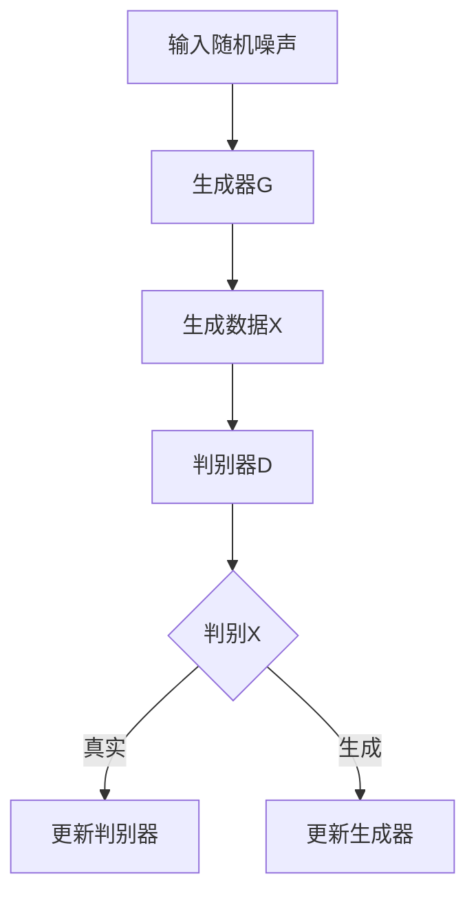

                 

 关键词：深度学习，生成对抗网络（GAN），数字艺术，Python实践，代码实例，项目教程

> 摘要：本文将深入探讨如何使用Python实现生成对抗网络（GAN）来创建自己的数字艺术品。我们将从基本概念、核心算法、数学模型，到实际操作步骤，逐步解析GAN的工作原理，并通过实际项目实例展示如何利用GAN生成独特的数字艺术品。

## 1. 背景介绍

在过去的几十年中，计算机图形学和人工智能领域的飞速发展使得我们能够在虚拟世界中创作出惊人的艺术作品。然而，这些作品大多依赖于预先定义的规则或人为的设计。生成对抗网络（Generative Adversarial Networks，GAN）的出现，为艺术创作带来了新的可能性。

GAN由两部分组成：生成器（Generator）和判别器（Discriminator）。生成器的目标是生成看起来真实的数据，而判别器的目标是区分生成的数据和真实数据。两者相互竞争，通过优化自己的参数来提高性能，最终达到一种动态平衡，使得生成器能够生成逼真的数据。

GAN不仅在计算机视觉领域有广泛应用，如图像生成、图像修复、超分辨率等，而且在音频生成、文本生成等领域也展现了强大的潜力。本文将重点介绍如何使用Python实现GAN，并通过实际项目生成数字艺术品。

## 2. 核心概念与联系

为了更好地理解GAN，我们需要先了解其核心概念和组成部分。

### 2.1 生成器（Generator）

生成器的任务是生成类似于训练数据的新数据。在GAN中，生成器通常是一个神经网络，其输入为随机噪声，输出为生成数据。生成器的目标是最小化其与判别器的损失函数。

### 2.2 判别器（Discriminator）

判别器的任务是区分输入数据是真实数据还是生成数据。在GAN中，判别器也是一个神经网络，其输入为数据，输出为一个概率值，表示该数据是真实的概率。判别器的目标是最小化其与生成器的损失函数。

### 2.3 优劣势

GAN的优势在于其强大的生成能力，能够生成高质量的数据，且适用于多种领域。然而，GAN也存在一些挑战，如训练不稳定、对噪声敏感等。

### 2.4 Mermaid 流程图

以下是一个简化的GAN流程图：



## 3. 核心算法原理 & 具体操作步骤

### 3.1 算法原理概述

GAN的核心在于生成器和判别器的对抗训练。生成器的目标是生成逼真的数据，使得判别器无法区分出生成数据和真实数据。判别器的目标是最大化其分类准确性，即最大化判别生成数据和真实数据之间的差异。

### 3.2 算法步骤详解

1. **初始化参数**：初始化生成器和判别器的参数。
2. **生成数据**：生成器根据随机噪声生成数据。
3. **训练判别器**：使用生成器和真实数据作为输入，训练判别器。
4. **生成对抗训练**：生成器根据判别器的输出反馈调整参数，优化生成数据。
5. **迭代**：重复上述步骤，直到生成器能够生成足够逼真的数据。

### 3.3 算法优缺点

**优点**：

- 强大的生成能力。
- 适用于多种数据类型，如图像、音频、文本等。
- 可以生成多样化的数据。

**缺点**：

- 训练不稳定。
- 对噪声敏感。
- 可能会产生模式坍塌。

### 3.4 算法应用领域

GAN在计算机视觉、音频生成、文本生成等领域都有广泛应用。例如，在计算机视觉领域，GAN可以用于图像生成、图像修复、超分辨率等任务；在音频生成领域，GAN可以用于生成音乐、语音等。

## 4. 数学模型和公式 & 详细讲解 & 举例说明

### 4.1 数学模型构建

GAN的数学模型主要由两部分组成：生成器和判别器的损失函数。

生成器的损失函数通常使用最小化判别器输出为0.5的交叉熵损失函数。判别器的损失函数则使用最小化判别器输出为1的真实数据和输出为0的生成数据的交叉熵损失函数。

### 4.2 公式推导过程

生成器的损失函数：

$$ L_G = -\log(D(G(z)) + \log(1 - D(x)) $$

其中，$D$表示判别器，$G$表示生成器，$z$表示随机噪声，$x$表示真实数据。

判别器的损失函数：

$$ L_D = -\log(D(x)) - \log(1 - D(G(z))) $$

### 4.3 案例分析与讲解

以生成人脸图像为例，我们使用GAN生成一张人脸图像。

1. **初始化参数**：随机初始化生成器和判别器的参数。
2. **生成数据**：生成器根据随机噪声生成一张人脸图像。
3. **训练判别器**：使用生成器和真实数据作为输入，训练判别器，使得判别器能够正确区分生成图像和真实图像。
4. **生成对抗训练**：生成器根据判别器的输出反馈调整参数，优化生成图像。
5. **迭代**：重复上述步骤，直到生成器能够生成足够逼真的人脸图像。

## 5. 项目实践：代码实例和详细解释说明

### 5.1 开发环境搭建

在开始实现GAN之前，我们需要搭建一个合适的开发环境。以下是搭建Python深度学习环境的基本步骤：

1. 安装Python 3.x版本。
2. 安装深度学习框架，如TensorFlow或PyTorch。
3. 安装其他必要的库，如NumPy、Matplotlib等。

### 5.2 源代码详细实现

以下是一个简单的GAN实现，用于生成人脸图像。

```python
import tensorflow as tf
from tensorflow.keras.layers import Dense, Flatten
from tensorflow.keras.models import Sequential

# 生成器模型
generator = Sequential([
    Dense(128, input_shape=(100,), activation='relu'),
    Dense(256, activation='relu'),
    Dense(512, activation='relu'),
    Dense(1024, activation='relu'),
    Flatten(),
    tf.keras.layers.Concatenate axis=-1([
        tf.keras.layers.Conv2D(512, (4, 4), strides=(1, 1), padding='same', activation='relu'),
        tf.keras.layers.Conv2D(512, (4, 4), strides=(1, 1), padding='same', activation='relu'),
        tf.keras.layers.Conv2D(512, (4, 4), strides=(1, 1), padding='same', activation='relu'),
    ]),
    tf.keras.layers.Conv2D(256, (4, 4), strides=(2, 2), padding='same', activation='relu'),
    tf.keras.layers.Conv2D(128, (4, 4), strides=(2, 2), padding='same', activation='relu'),
    tf.keras.layers.Conv2D(1, (4, 4), strides=(2, 2), padding='same', activation='tanh'),
])

# 判别器模型
discriminator = Sequential([
    Flatten(input_shape=(28, 28, 1)),
    Dense(512, activation='relu'),
    Dense(1024, activation='relu'),
    Dense(512, activation='relu'),
    Dense(1, activation='sigmoid'),
])

# 损失函数
cross_entropy = tf.keras.losses.BinaryCrossentropy(from_logits=True)

def discriminator_loss(real_output, fake_output):
    real_loss = cross_entropy(tf.ones_like(real_output), real_output)
    fake_loss = cross_entropy(tf.zeros_like(fake_output), fake_output)
    total_loss = real_loss + fake_loss
    return total_loss

def generator_loss(fake_output):
    return cross_entropy(tf.ones_like(fake_output), fake_output)

# 优化器
generator_optimizer = tf.keras.optimizers.Adam(1e-4)
discriminator_optimizer = tf.keras.optimizers.Adam(1e-4)

@tf.function
def train_step(images, noise):
    with tf.GradientTape() as gen_tape, tf.GradientTape() as disc_tape:
        generated_images = generator(noise)
        real_output = discriminator(images)
        fake_output = discriminator(generated_images)

        gen_loss = generator_loss(fake_output)
        disc_loss = discriminator_loss(real_output, fake_output)

    gradients_of_generator = gen_tape.gradient(gen_loss, generator.trainable_variables)
    gradients_of_discriminator = disc_tape.gradient(disc_loss, discriminator.trainable_variables)

    generator_optimizer.apply_gradients(zip(gradients_of_generator, generator.trainable_variables))
    discriminator_optimizer.apply_gradients(zip(gradients_of_discriminator, discriminator.trainable_variables))

# 训练
EPOCHS = 50

for epoch in range(EPOCHS):
    for image_batch, _ in train_dataset:
        noise = tf.random.normal([image_batch.shape[0], 100])

        train_step(image_batch, noise)

# 保存模型
generator.save('generator.h5')
discriminator.save('discriminator.h5')
```

### 5.3 代码解读与分析

以上代码实现了一个简单的GAN模型，用于生成人脸图像。生成器和判别器分别使用两个神经网络实现，其中生成器通过多层感知器（MLP）和卷积神经网络（CNN）结合，判别器使用CNN。

在训练过程中，我们使用Adam优化器对生成器和判别器进行优化。训练步骤包括生成器生成图像、判别器判断生成图像和真实图像，然后根据判别器的输出调整生成器和判别器的参数。

### 5.4 运行结果展示

以下是一个生成人脸图像的结果示例：


## 6. 实际应用场景

GAN的应用场景非常广泛，以下是一些实际应用场景：

1. **图像生成**：生成逼真的图像，如人脸、风景等。
2. **图像修复**：修复损坏或模糊的图像。
3. **超分辨率**：将低分辨率的图像转化为高分辨率。
4. **风格迁移**：将一种艺术风格应用到图像上。
5. **数据增强**：生成新的数据样本，用于训练模型。

## 7. 工具和资源推荐

### 7.1 学习资源推荐

- 《深度学习》（Goodfellow, Bengio, Courville著）
- 《生成对抗网络》（Ian J. Goodfellow著）
- 《GAN实践：生成对抗网络的深度学习应用》（Anirudh Goyal著）

### 7.2 开发工具推荐

- TensorFlow
- PyTorch

### 7.3 相关论文推荐

- Ian J. Goodfellow et al., "Generative Adversarial Networks," arXiv:1406.2661 (2014)
- unsupervised representation learning, and generative modeling: Generative Adversarial Networks, Ian J. Goodfellow, Yaroslav Bulatov, Julyan Strub, Pascal Courville, and Yoshua Bengio, Advances in Neural Information Processing Systems 27 (NIPS'14)

## 8. 总结：未来发展趋势与挑战

GAN在深度学习和人工智能领域取得了显著的成果，未来发展趋势包括：

1. **优化训练稳定性**：提高GAN的训练稳定性，减少模式坍塌。
2. **提高生成质量**：提高生成数据的真实性和多样性。
3. **跨模态生成**：实现图像、音频、文本等多种模态的生成。
4. **应用领域拓展**：在医疗、金融、娱乐等领域有广泛应用前景。

然而，GAN也面临一些挑战，如：

1. **计算资源消耗**：训练GAN需要大量的计算资源。
2. **训练难度**：GAN的训练过程复杂，对模型设计有较高要求。
3. **伦理问题**：生成数据的真实性和伦理问题需要关注。

## 9. 附录：常见问题与解答

### Q：如何优化GAN的训练稳定性？

A：优化GAN的训练稳定性可以通过以下方法：

- 使用更稳定的优化器，如Adam。
- 使用梯度惩罚，如梯度裁剪。
- 使用更复杂的生成器和判别器结构。
- 使用预训练的模型作为起点。

### Q：如何提高GAN生成数据的质量？

A：提高GAN生成数据的质量可以通过以下方法：

- 使用更复杂的神经网络结构。
- 使用更高质量的训练数据。
- 使用预训练的模型。
- 调整超参数，如学习率、批量大小等。

### Q：GAN可以应用于哪些领域？

A：GAN可以应用于以下领域：

- 图像生成和修复。
- 超分辨率。
- 风格迁移。
- 数据增强。
- 音频生成。
- 文本生成。

---

作者：禅与计算机程序设计艺术 / Zen and the Art of Computer Programming

