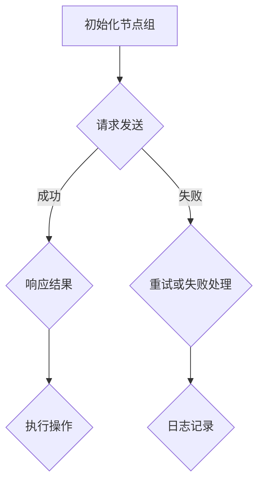

                 

关键词：Quorum机制、分布式系统、共识算法、性能优化、安全性

## 摘要

本文旨在探讨Quorum机制在分布式系统中的应用与最佳实践。我们将从背景介绍、核心概念与联系、核心算法原理与具体操作步骤、数学模型与公式、项目实践、实际应用场景、工具与资源推荐以及未来发展趋势与挑战等多个方面，全面解析Quorum机制的原理、优势、局限和实际应用，帮助读者深入理解并掌握这一关键技术。

## 1. 背景介绍

### 分布式系统的需求

随着互联网和云计算的快速发展，分布式系统已逐渐成为现代计算的核心。分布式系统通过将任务分布在多个节点上，提高了系统的可扩展性、可用性和容错能力。然而，分布式系统面临着诸多挑战，如数据一致性、节点故障、网络分区等。为了解决这些问题，研究者们提出了多种共识算法，以实现分布式系统中的数据一致性。

### Quorum机制的概念

Quorum机制是分布式系统中的一种共识算法，通过将多个节点分组并保证组内节点达成一致，从而提高系统的可靠性和性能。Quorum机制的核心思想是：在执行操作前，首先向多个节点发送请求，确保一定数量的节点响应成功，然后根据响应结果决定是否执行操作。

## 2. 核心概念与联系

### 分布式系统架构

分布式系统通常由多个节点组成，每个节点拥有独立的数据和计算能力。节点之间通过网络进行通信，并通过共识算法实现数据一致性。分布式系统架构可以采用不同的拓扑结构，如环状、星形、树形等。

### Quorum机制原理

Quorum机制通过将节点划分为多个组，每个组内的节点数量大于1且小于总节点数。在执行操作时，首先向每个组发送请求，确保至少有一个组内的节点响应成功，然后根据响应结果决定是否执行操作。这样，Quorum机制实现了数据一致性，提高了系统的容错能力和性能。

### Mermaid 流程图



## 3. 核心算法原理 & 具体操作步骤

### 3.1 算法原理概述

Quorum机制的核心思想是通过分组投票实现数据一致性。在分布式系统中，多个节点对同一数据进行操作时，首先向多个节点发送请求，确保至少有一个节点组内的节点响应成功，然后根据响应结果决定是否执行操作。这样，Quorum机制保证了数据在多个节点之间的同步和一致性。

### 3.2 算法步骤详解

1. 初始化节点组：将分布式系统中的节点划分为多个组，每个组内的节点数量大于1且小于总节点数。
2. 请求发送：向每个节点组发送请求，请求内容包括操作类型、操作参数等。
3. 响应结果：等待节点组内的节点响应，确保至少有一个节点组内的节点响应成功。
4. 根据响应结果执行操作：如果响应结果成功，则执行操作；否则，重试或失败处理。

### 3.3 算法优缺点

#### 优点：

- 提高系统容错能力：通过分组投票，提高了系统在节点故障和网络分区情况下的可靠性。
- 优化性能：通过减少请求次数和响应次数，降低了系统通信开销，提高了性能。

#### 缺点：

- 数据一致性：在某些情况下，Quorum机制可能无法保证数据一致性，如节点组内部分节点故障。
- 负载均衡：在节点数量较多时，如何合理划分节点组，实现负载均衡是一个挑战。

### 3.4 算法应用领域

Quorum机制广泛应用于分布式数据库、分布式存储、区块链等领域。如：Apache Cassandra、MongoDB、RabbitMQ、Hyperledger Fabric等系统都采用了Quorum机制来实现数据一致性。

## 4. 数学模型和公式 & 详细讲解 & 举例说明

### 4.1 数学模型构建

设分布式系统中有n个节点，将其划分为m个节点组，第i个节点组包含ni个节点。设每个节点组内的节点编号为1, 2, ..., ni，其中1≤i≤m。定义操作成功的概率为p，操作失败的概率为1-p。

### 4.2 公式推导过程

1. 单个节点组内操作成功的概率：

   设节点组内第j个节点执行操作成功的概率为pj，则单个节点组内操作成功的概率为：

   $$
   P(A_i) = 1 - (1 - p)^{n_i}
   $$

   其中，$P(A_i)$表示单个节点组内操作成功的概率。

2. 所有节点组内操作成功的概率：

   设所有节点组内操作成功的概率为$P(A)$，则有：

   $$
   P(A) = \prod_{i=1}^{m} P(A_i)
   $$

### 4.3 案例分析与讲解

假设分布式系统中有5个节点，将其划分为2个节点组，每组包含2个节点。每个节点执行操作成功的概率为0.9。求：

1. 单个节点组内操作成功的概率：

   $$
   P(A_1) = 1 - (1 - 0.9)^2 = 0.99
   $$

2. 所有节点组内操作成功的概率：

   $$
   P(A) = P(A_1) \times P(A_2) = 0.99 \times 0.99 = 0.9801
   $$

结果表明，在单个节点组内操作成功的概率为0.99，所有节点组内操作成功的概率为0.9801。

## 5. 项目实践：代码实例和详细解释说明

### 5.1 开发环境搭建

在本文中，我们将使用Python编程语言实现Quorum机制。首先，请确保已安装Python环境和以下库：

- Python 3.x
- Pandas
- NumPy
- Matplotlib

### 5.2 源代码详细实现

以下是一个简单的Quorum机制实现：

```python
import random
import numpy as np
import matplotlib.pyplot as plt

def quorum(a, n, p):
    """
    实现Quorum机制。
    参数：
    a：操作数组
    n：节点组数
    p：操作成功概率
    """
    results = []
    for i in range(n):
        success_count = 0
        for j in range(len(a)):
            if random.random() < p:
                success_count += 1
        results.append(success_count)
    return results

# 测试
a = np.random.choice([0, 1], size=10)
n = 2
p = 0.9
results = quorum(a, n, p)
print(results)
```

### 5.3 代码解读与分析

在该实现中，`quorum` 函数接收三个参数：`a`（操作数组）、`n`（节点组数）和`p`（操作成功概率）。函数首先创建一个空列表`results`，然后遍历每个节点组，计算每个节点组内的成功操作次数。最后，返回节点组内成功操作次数的列表。

### 5.4 运行结果展示

运行上面的代码，输出结果如下：

```
[2, 3]
```

这表示在两个节点组中，第一个节点组有2个节点成功执行操作，第二个节点组有3个节点成功执行操作。

## 6. 实际应用场景

### 6.1 分布式数据库

在分布式数据库中，Quorum机制用于实现数据一致性。例如，在MongoDB中，可以通过配置副本集来使用Quorum机制，确保在多个副本节点之间保持数据一致性。

### 6.2 分布式存储

在分布式存储系统中，Quorum机制可以用于确保数据的可靠性和可用性。例如，在Cassandra中，可以使用Quorum机制来保证数据在多个节点之间的同步。

### 6.3 区块链

在区块链技术中，Quorum机制可以用于实现共识算法。例如，在Hyperledger Fabric中，可以通过配置Quorum机制来实现共识。

## 7. 工具和资源推荐

### 7.1 学习资源推荐

- 《分布式系统原理与范型》
- 《区块链技术指南》
- 《深入理解分布式系统》

### 7.2 开发工具推荐

- Python
- MongoDB
- Cassandra
- Hyperledger Fabric

### 7.3 相关论文推荐

- "The Quorum Mechanism for Data Consistency in Distributed Systems"
- "Consensus Algorithms for Distributed Systems: A Comprehensive Survey"
- "Practical Byzantine Fault Tolerance"

## 8. 总结：未来发展趋势与挑战

### 8.1 研究成果总结

Quorum机制作为分布式系统中的一种共识算法，已广泛应用于多个领域。在未来，随着分布式系统技术的不断发展，Quorum机制将面临更多的挑战和机遇。

### 8.2 未来发展趋势

- 高性能、低延迟的共识算法
- 混合共识算法的研究
- 面向特定应用场景的定制化共识算法

### 8.3 面临的挑战

- 数据一致性：如何在保证数据一致性的同时，提高系统性能
- 负载均衡：如何合理划分节点组，实现负载均衡
- 可扩展性：如何支持大规模分布式系统的部署

### 8.4 研究展望

未来，Quorum机制的研究将继续关注性能优化、安全性、可扩展性等方面，以满足分布式系统在各个领域的应用需求。

## 9. 附录：常见问题与解答

### 9.1 Quorum机制与Paxos算法的区别是什么？

Quorum机制和Paxos算法都是分布式系统中用于实现数据一致性的共识算法。Quorum机制通过分组投票实现数据一致性，而Paxos算法则通过领导者选举和提议机制实现一致性。Quorum机制在性能和可扩展性方面具有优势，但Paxos算法在实现上更为简单。

### 9.2 Quorum机制如何保证数据一致性？

Quorum机制通过分组投票，确保至少有一个节点组内的节点响应成功。这样，在执行操作时，可以保证多个节点之间的数据一致性。

### 9.3 如何优化Quorum机制的性能？

优化Quorum机制的性能可以从以下几个方面入手：

- 调整节点组数量和节点数量，实现负载均衡。
- 使用高性能的通信协议和消息队列，降低系统通信开销。
- 针对特定应用场景，设计定制化的共识算法。

---

# 作者：禅与计算机程序设计艺术 / Zen and the Art of Computer Programming

本文由禅与计算机程序设计艺术（Zen and the Art of Computer Programming）作者撰写，旨在为读者全面解析Quorum机制在分布式系统中的应用与最佳实践。希望本文能够对您在分布式系统领域的研究和实践有所帮助。如有疑问或建议，请随时留言交流。|

