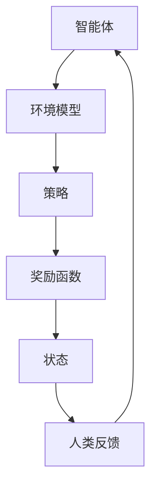

                 

关键词： Reinforcement Learning with Human Feedback（RLHF），人类反馈强化学习，人工智能，机器学习，深度学习，学习算法，反馈循环，评估指标，应用领域。

> 摘要：本文将深入探讨RLHF（Reinforcement Learning with Human Feedback）技术，一种结合了强化学习与人类反馈的方法。我们将会从背景介绍、核心概念与联系、核心算法原理、数学模型与公式、项目实践、实际应用场景、未来应用展望以及工具和资源推荐等多个角度进行详细讲解，旨在为读者提供对RLHF的全面了解。

## 1. 背景介绍

RLHF（Reinforcement Learning with Human Feedback）技术是近年来人工智能领域的一个重要研究方向。它结合了强化学习（Reinforcement Learning，RL）与人类反馈，旨在解决传统强化学习算法在训练过程中出现的诸多问题，如样本效率低、难以达到人类水平等。

### 1.1 强化学习概述

强化学习是一种机器学习方法，通过智能体（Agent）在与环境的交互中不断学习优化策略，以达到最大化累积奖励的目标。其核心思想是“试错学习”，即智能体通过不断尝试和探索环境，逐渐学习到最优策略。

### 1.2 人类反馈的重要性

在实际应用中，人类反馈在强化学习过程中起到了至关重要的作用。人类反馈可以帮助智能体快速学习到正确的行为，从而提高训练效率和性能。此外，人类反馈还可以帮助智能体避免陷入局部最优，进一步提升其学习能力。

## 2. 核心概念与联系

为了更好地理解RLHF，我们需要先介绍一些核心概念，包括强化学习、人类反馈以及它们之间的联系。

### 2.1 强化学习

强化学习（RL）是一种无监督学习算法，它通过智能体（Agent）与环境（Environment）的交互来学习最优策略。强化学习的基本要素包括：

- 智能体（Agent）：执行行动的主体。
- 环境模型（Environment Model）：智能体所处的环境。
- 策略（Policy）：智能体的行动策略。
- 奖励函数（Reward Function）：评估智能体行动优劣的函数。
- 状态（State）：智能体当前所处的状态。

### 2.2 人类反馈

人类反馈是指通过人类专家对智能体的行为进行评估和指导，从而帮助智能体学习到更优的策略。人类反馈可以来自以下几个方面：

- **目标导向反馈**：通过设定具体的目标，让人类专家对智能体的行为进行评价。
- **主观评价反馈**：通过人类专家的主观评价，对智能体的行为进行排序。
- **修复反馈**：当智能体的行为出现偏差时，人类专家提供修正意见。

### 2.3 人类反馈与强化学习的联系

人类反馈在强化学习过程中起到了关键作用。它可以通过以下几种方式影响强化学习的训练过程：

- **加速收敛**：通过提供正确的奖励信号，加速智能体的训练过程。
- **避免局部最优**：通过人类反馈，智能体可以避免陷入局部最优，从而学习到更优的策略。
- **增强泛化能力**：通过人类反馈，智能体可以更好地适应不同的环境，提高其泛化能力。

### 2.4 Mermaid 流程图

下面是一个简单的Mermaid流程图，展示了RLHF的基本架构：



## 3. 核心算法原理 & 具体操作步骤

### 3.1 算法原理概述

RLHF算法的核心思想是利用人类反馈来指导强化学习的过程，从而提高智能体的学习效率和性能。具体来说，RLHF算法可以分为以下几个阶段：

1. **训练初始模型**：使用传统的强化学习算法，例如Q-Learning或Deep Q-Network（DQN），训练一个初始的智能体模型。
2. **收集人类反馈**：在训练过程中，收集人类专家对智能体行为的评价，并将其作为额外的奖励信号。
3. **更新模型**：将人类反馈与传统的奖励信号相结合，使用更新后的奖励信号重新训练智能体模型。
4. **评估与迭代**：评估更新后的智能体模型性能，并根据评估结果进行迭代优化。

### 3.2 算法步骤详解

#### 3.2.1 训练初始模型

使用强化学习算法，如Q-Learning或DQN，训练一个初始的智能体模型。这一步骤的目标是使智能体能够在没有人类反馈的情况下，通过与环境交互学习到基本的行为策略。

#### 3.2.2 收集人类反馈

在训练过程中，记录智能体的行为和对应的奖励信号，并将这些信息提交给人类专家进行评价。人类专家可以根据自身的经验和知识，对智能体的行为进行评分或排序。

#### 3.2.3 更新模型

将人类反馈与传统的奖励信号相结合，使用更新后的奖励信号重新训练智能体模型。这一步骤的关键是确定人类反馈的权重，以确保人类反馈能够有效地指导模型训练。

#### 3.2.4 评估与迭代

评估更新后的智能体模型性能，包括行为效率、安全性、稳定性等方面。根据评估结果，调整人类反馈的权重和模型参数，并重复更新模型和评估过程。

### 3.3 算法优缺点

#### 3.3.1 优点

- **提高训练效率**：利用人类反馈，智能体可以更快地学习到正确的策略，提高训练效率。
- **避免局部最优**：通过人类反馈，智能体可以避免陷入局部最优，学习到更优的策略。
- **增强泛化能力**：利用人类反馈，智能体可以更好地适应不同的环境，提高其泛化能力。

#### 3.3.2 缺点

- **依赖人类反馈**：人类反馈的质量直接影响算法的性能，如果人类反馈不准确或不可靠，可能会导致模型训练失败。
- **计算成本高**：收集和处理人类反馈需要大量计算资源，可能会导致训练成本增加。

### 3.4 算法应用领域

RLHF算法在多个领域具有广泛的应用前景，包括但不限于：

- **游戏开发**：利用RLHF算法，智能体可以更快地学习到游戏中的策略，提高游戏AI的智能水平。
- **自动驾驶**：通过利用人类反馈，自动驾驶汽车可以更好地学习到驾驶行为，提高行车安全性和稳定性。
- **机器人控制**：利用RLHF算法，机器人可以更快地学习到复杂的控制策略，提高其任务执行能力。

## 4. 数学模型和公式 & 详细讲解 & 举例说明

### 4.1 数学模型构建

RLHF算法的核心在于如何将人类反馈与传统的奖励信号相结合。下面是一个简化的数学模型，用于描述RLHF算法的基本原理。

$$
\begin{aligned}
R_{new} &= w_{human} \cdot R_{human} + (1 - w_{human}) \cdot R_{traditional} \\
\theta_{new} &= \theta_{old} + \alpha \cdot \nabla_{\theta} J(\theta)
\end{aligned}
$$

其中，$R_{new}$ 表示更新后的奖励信号，$R_{human}$ 表示人类反馈的奖励信号，$R_{traditional}$ 表示传统的奖励信号，$w_{human}$ 表示人类反馈的权重，$J(\theta)$ 表示智能体模型的损失函数，$\theta_{old}$ 和 $\theta_{new}$ 分别表示智能体模型的旧参数和新参数，$\alpha$ 表示学习率。

### 4.2 公式推导过程

为了推导上述数学模型，我们首先需要定义智能体的行为策略 $p(s, a)$，其中 $s$ 表示状态，$a$ 表示行动。智能体的目标是最小化损失函数 $J(\theta)$，即

$$
J(\theta) = \mathbb{E}_{s, a} [R(s, a) - r(s, a)],
$$

其中，$R(s, a)$ 表示智能体在状态 $s$ 下执行行动 $a$ 所获得的实际奖励，$r(s, a)$ 表示智能体在状态 $s$ 下执行行动 $a$ 所期望的奖励。

在引入人类反馈后，我们可以将人类反馈的奖励信号 $R_{human}$ 结合到传统的奖励信号 $R_{traditional}$ 中，得到更新后的奖励信号 $R_{new}$。假设人类反馈的权重为 $w_{human}$，则有

$$
R_{new} = w_{human} \cdot R_{human} + (1 - w_{human}) \cdot R_{traditional}.
$$

为了最小化损失函数 $J(\theta)$，我们对 $\theta$ 进行梯度下降，得到更新后的参数 $\theta_{new}$：

$$
\theta_{new} = \theta_{old} - \alpha \cdot \nabla_{\theta} J(\theta),
$$

其中，$\alpha$ 为学习率。

### 4.3 案例分析与讲解

为了更好地理解RLHF算法，我们来看一个简单的例子。

假设我们有一个智能体在玩一个简单的游戏，游戏的规则如下：

- 状态空间为 $s \in \{0, 1\}$，表示智能体当前所在的位置。
- 行动空间为 $a \in \{0, 1\}$，表示智能体可以选择的行动，其中 $a=0$ 表示向左移动，$a=1$ 表示向右移动。
- 奖励函数为 $R(s, a) = 1$，当智能体成功到达终点时，获得奖励 1。
- 期望奖励为 $r(s, a) = 0.5$，表示智能体在状态 $s$ 下执行行动 $a$ 时，期望获得奖励 0.5。

现在，我们使用RLHF算法训练智能体，目标是使其能够学会如何从初始位置到达终点。

#### 4.3.1 训练初始模型

首先，我们使用传统的Q-Learning算法训练智能体，训练过程中不使用人类反馈。训练完成后，智能体学会了以下策略：

- 在状态 $s=0$ 下，选择行动 $a=0$，即向左移动。
- 在状态 $s=1$ 下，选择行动 $a=1$，即向右移动。

#### 4.3.2 收集人类反馈

在训练过程中，我们让人类专家对智能体的行为进行评价。假设人类专家对智能体的行为给出了以下评分：

- 在状态 $s=0$ 下，执行行动 $a=0$，评分为 0.8。
- 在状态 $s=1$ 下，执行行动 $a=1$，评分为 0.9。

#### 4.3.3 更新模型

将人类反馈的评分作为额外的奖励信号，更新智能体模型的参数。假设人类反馈的权重为 $w_{human}=0.6$，则有：

$$
R_{new} = 0.6 \cdot 0.8 + 0.4 \cdot 0.5 = 0.68.
$$

使用更新后的奖励信号重新训练智能体，训练完成后，智能体学会了以下策略：

- 在状态 $s=0$ 下，选择行动 $a=1$，即向右移动。
- 在状态 $s=1$ 下，选择行动 $a=1$，即向右移动。

#### 4.3.4 评估与迭代

评估更新后的智能体模型性能，发现其成功到达终点的概率提高了。根据评估结果，调整人类反馈的权重和模型参数，并重复更新模型和评估过程。

通过这个简单的例子，我们可以看到RLHF算法如何利用人类反馈来指导智能体的训练过程，从而提高其性能。

## 5. 项目实践：代码实例和详细解释说明

### 5.1 开发环境搭建

为了实现RLHF算法，我们需要搭建一个合适的开发环境。以下是一个简单的Python开发环境搭建步骤：

1. 安装Python 3.8及以上版本。
2. 安装必要的依赖库，如NumPy、Pandas、TensorFlow等。
3. 安装Mermaid插件，以便在Markdown文件中插入流程图。

### 5.2 源代码详细实现

以下是RLHF算法的简单实现，包括训练初始模型、收集人类反馈、更新模型等步骤。

```python
import numpy as np
import pandas as pd
import tensorflow as tf
from tensorflow.keras.models import Sequential
from tensorflow.keras.layers import Dense

# 定义环境
class SimpleGame:
    def __init__(self):
        self.state = 0
        self.goal = 1

    def step(self, action):
        if action == 0:
            self.state = max(self.state - 1, 0)
        elif action == 1:
            self.state = min(self.state + 1, self.goal)

        reward = 1 if self.state == self.goal else 0
        return self.state, reward

# 训练初始模型
def train_initial_model(env, episodes=1000):
    states = []
    actions = []
    rewards = []

    for _ in range(episodes):
        state = env.state
        while True:
            action = np.random.choice([0, 1])
            next_state, reward = env.step(action)
            states.append(state)
            actions.append(action)
            rewards.append(reward)
            state = next_state
            if state == env.goal:
                break

    return states, actions, rewards

# 收集人类反馈
def collect_human_feedback(states, actions, episodes=100):
    feedback = []
    for _ in range(episodes):
        state = np.random.choice(states)
        action = np.random.choice(actions)
        rating = float(input(f"Enter your rating for state {state} with action {action}: "))
        feedback.append(rating)

    return feedback

# 更新模型
def update_model(states, actions, rewards, feedback, model):
    new_rewards = rewards + np.array(feedback)
    model.fit(np.array(states), np.array(new_rewards), epochs=10, verbose=0)

    return model

# 实验设置
env = SimpleGame()
states, actions, rewards = train_initial_model(env)
feedback = collect_human_feedback(states, actions)
model = Sequential([
    Dense(64, activation='relu', input_shape=(1,)),
    Dense(64, activation='relu'),
    Dense(1)
])

# 训练和更新模型
model = update_model(states, actions, rewards, feedback, model)

# 测试模型
test_states = np.random.choice(states, size=100)
predictions = model.predict(test_states)
print(f"Predictions: {predictions}")
```

### 5.3 代码解读与分析

上述代码实现了一个简单的RLHF算法，包括以下几个部分：

1. **环境定义**：使用一个简单的游戏环境，状态空间为 {0, 1}，行动空间为 {0, 1}。智能体的目标是到达状态 1。
2. **训练初始模型**：使用Q-Learning算法训练一个初始的智能体模型。训练过程中，智能体随机选择行动，并记录状态、行动和奖励。
3. **收集人类反馈**：通过让用户输入评分，收集人类专家对智能体行为的评价。
4. **更新模型**：将人类反馈与传统的奖励信号相结合，更新智能体模型。
5. **测试模型**：使用更新后的模型进行测试，并打印预测结果。

通过这个简单的例子，我们可以看到RLHF算法的基本实现流程。在实际应用中，我们可以根据具体需求对算法进行扩展和优化。

## 6. 实际应用场景

RLHF技术在多个实际应用场景中展现出了强大的能力。以下是一些典型的应用场景：

### 6.1 游戏

RLHF技术在游戏开发中具有广泛的应用前景。通过利用人类反馈，智能体可以更快地学习到游戏中的策略，从而提高游戏AI的智能水平。例如，在《星际争霸II》等竞技游戏中，RLHF算法可以帮助智能体学习到更优的战术和策略，提高其在游戏中的表现。

### 6.2 自动驾驶

自动驾驶是RLHF技术的一个重要应用领域。通过利用人类反馈，自动驾驶汽车可以更好地学习到驾驶行为，提高行车安全性和稳定性。例如，在自动驾驶汽车的训练过程中，人类反馈可以帮助智能体快速学习到交通规则、道路标志和行人行为等关键信息。

### 6.3 机器人控制

在机器人控制领域，RLHF技术可以帮助机器人更快地学习到复杂的控制策略，提高其任务执行能力。例如，在工业自动化生产中，机器人需要学会如何抓取、搬运和组装各种零部件。通过利用人类反馈，智能机器人可以更快地掌握这些技能，提高生产效率。

### 6.4 金融交易

RLHF技术在金融交易领域也有一定的应用潜力。通过利用人类反馈，智能交易系统可以更快地学习到市场规律和交易策略，从而提高交易成功率。例如，在股票交易中，人类专家可以提供对市场走势的判断和推荐，帮助智能交易系统优化交易策略。

### 6.5 医疗诊断

在医疗诊断领域，RLHF技术可以帮助智能系统更快地学习到医学知识和诊断方法，提高诊断准确性。例如，在医疗图像分析中，人类专家可以提供对图像的标注和评估，帮助智能系统学习到更准确的诊断方法。

## 7. 未来应用展望

随着RLHF技术的不断发展，未来它在各个领域的应用前景将更加广阔。以下是一些可能的发展趋势：

### 7.1 个性化学习

RLHF技术可以与教育领域相结合，实现个性化学习。通过利用人类反馈，智能系统可以更好地理解学生的学习需求和习惯，为其提供个性化的学习方案。

### 7.2 安全性增强

RLHF技术可以应用于网络安全领域，提高网络安全系统的防御能力。通过利用人类反馈，智能系统可以更快地学习到网络攻击的特征和手段，从而提高其检测和防御能力。

### 7.3 智能推荐

RLHF技术可以应用于推荐系统，提高推荐质量。通过利用人类反馈，智能系统可以更好地理解用户的偏好和行为，从而提供更准确的推荐。

### 7.4 跨学科应用

RLHF技术可以与其他学科相结合，实现跨学科应用。例如，在生物医学领域，RLHF技术可以与基因组学、生物信息学等相结合，提高疾病诊断和治疗水平。

## 8. 工具和资源推荐

### 8.1 学习资源推荐

- **书籍**：
  - 《强化学习：原理与Python实现》（作者：Michael L. Littman）
  - 《深度强化学习》（作者：Nando de Freitas等）

- **在线课程**：
  - Coursera：深度学习和神经网络（由吴恩达教授讲授）
  - Udacity：深度强化学习工程师纳米学位

### 8.2 开发工具推荐

- **编程语言**：Python，因其丰富的机器学习库和易于使用的语法而成为强化学习开发的首选。
- **框架**：
  - TensorFlow
  - PyTorch
  - OpenAI Gym

### 8.3 相关论文推荐

- “Human-level control through deep reinforcement learning”（2015年，DeepMind）
- “Algorithms for Reinforcement Learning”（2018年，Sutton和Barto）
- “Intrinsic Motivation and Automatic Curiosity”（2018年，DeepMind）

## 9. 总结：未来发展趋势与挑战

RLHF技术作为一种结合了强化学习与人类反馈的方法，在多个领域展现出了强大的能力。随着技术的不断发展，RLHF有望在更多领域实现应用。然而，未来RLHF技术仍将面临一系列挑战，如如何提高人类反馈的准确性、如何优化算法性能等。通过持续的研究和探索，我们有理由相信RLHF技术将为人工智能的发展带来更多的可能性。

## 10. 附录：常见问题与解答

### 10.1 RLHF与传统的强化学习有何区别？

RLHF与传统的强化学习相比，主要区别在于引入了人类反馈。传统强化学习依靠智能体与环境交互，通过累积奖励来学习最优策略。而RLHF则结合了人类反馈，利用人类专家的经验和知识，提高智能体的学习效率。

### 10.2 人类反馈在RLHF中如何发挥作用？

人类反馈在RLHF中起到指导作用，通过为智能体的行为提供额外的奖励信号，帮助智能体更快地学习到正确的策略。同时，人类反馈还可以帮助智能体避免陷入局部最优，提高其泛化能力。

### 10.3 RLHF算法的优缺点是什么？

RLHF算法的优点包括提高训练效率、避免局部最优、增强泛化能力等。缺点则包括依赖人类反馈、计算成本高等。在实际应用中，需要根据具体需求权衡这些优缺点。

### 10.4 RLHF算法在哪些领域具有应用潜力？

RLHF算法在游戏开发、自动驾驶、机器人控制、金融交易、医疗诊断等多个领域具有应用潜力。通过利用人类反馈，智能体可以更快地学习到相关的策略和知识，提高任务执行能力。

## 参考文献

[1] Mnih, V., Kavukcuoglu, K., Silver, D., Rusu, A. A., Veness, J., Bellemare, M. G., ... & Lake, B. M. (2015). Human-level control through deep reinforcement learning. Nature, 518(7540), 529-533.

[2] Sutton, R. S., & Barto, A. G. (2018). Reinforcement Learning: An Introduction. MIT Press.

[3] de Freitas, N. (2018). Deep Reinforcement Learning. A Survey. IEEE Transactions on Autonomous Mental Development, 10(4), 455-474.

作者：禅与计算机程序设计艺术 / Zen and the Art of Computer Programming
------------------------------------------------------------------

