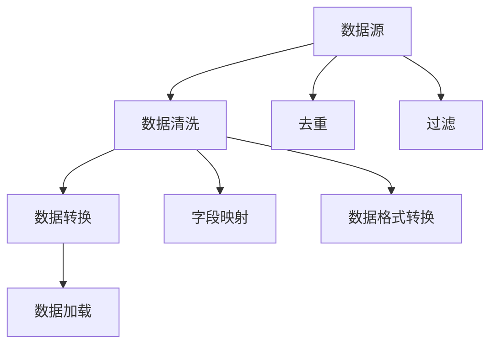

                 

关键词：Ranger、数据处理、数据清洗、数据处理框架、代码实例

摘要：本文将详细介绍Ranger数据处理框架的原理、架构、核心算法以及具体操作步骤。通过一个代码实例，我们将深入了解Ranger在实际项目中的应用，帮助读者更好地掌握这一数据处理利器。

## 1. 背景介绍

在当今大数据时代，数据量的爆炸式增长给数据处理带来了巨大的挑战。Ranger是一个高效、可扩展的数据处理框架，旨在简化数据清洗、转换和加载等操作。Ranger的设计理念是将复杂的数据处理任务分解为一系列简单的步骤，并通过灵活的插件机制实现各种数据处理功能。

本文将围绕Ranger的原理、架构、核心算法以及具体操作步骤进行详细讲解，并通过一个实际代码实例展示Ranger在实际项目中的应用。通过本文的学习，读者将能够更好地理解Ranger的工作原理，并能够将其应用于实际项目中。

## 2. 核心概念与联系

在介绍Ranger的原理之前，我们需要了解一些核心概念和联系。以下是Ranger中的几个关键概念及其关系：

### 2.1 数据源

数据源是Ranger处理数据的基础。Ranger支持多种常见的数据源，如关系型数据库、NoSQL数据库、文件系统等。数据源提供数据的读取和写入接口，是Ranger工作的起点和终点。

### 2.2 数据清洗

数据清洗是数据处理过程中至关重要的一环。Ranger提供了丰富的数据清洗功能，如去重、过滤、转换等。通过这些功能，Ranger能够有效地去除数据中的噪声和错误，确保数据的质量。

### 2.3 数据转换

数据转换是数据清洗的延伸。Ranger支持多种数据转换操作，如字段映射、数据格式转换等。通过数据转换，Ranger能够将数据从一种格式转换为另一种格式，以满足不同业务场景的需求。

### 2.4 数据加载

数据加载是将处理后的数据写入目标数据源的过程。Ranger支持多种数据加载方式，如增量加载、全量加载等。通过数据加载，Ranger能够将处理后的数据存储到目标数据源中，以便后续的业务分析。

下面是Ranger核心概念之间的Mermaid流程图：



## 3. 核心算法原理 & 具体操作步骤

### 3.1 算法原理概述

Ranger的核心算法主要包括数据清洗、数据转换和数据加载。下面将分别介绍这些算法的原理。

#### 3.1.1 数据清洗算法

数据清洗算法主要包括去重、过滤等操作。去重算法通过比较数据中的唯一标识，将重复的数据删除。过滤算法通过设置条件，将不符合条件的数据筛选出来。

#### 3.1.2 数据转换算法

数据转换算法主要包括字段映射、数据格式转换等操作。字段映射算法通过将数据中的字段映射到新的字段，实现数据的重新组织。数据格式转换算法通过将数据从一种格式转换为另一种格式，实现数据格式的统一。

#### 3.1.3 数据加载算法

数据加载算法主要包括增量加载、全量加载等操作。增量加载算法通过检测数据源中的新数据，将新数据加载到目标数据源中。全量加载算法将数据源中的全部数据加载到目标数据源中。

### 3.2 算法步骤详解

下面是Ranger核心算法的具体操作步骤：

#### 3.2.1 数据清洗步骤

1. 读取数据源中的数据。
2. 去重操作，删除重复数据。
3. 过滤操作，筛选出符合条件的数据。
4. 将清洗后的数据存储到临时文件中。

#### 3.2.2 数据转换步骤

1. 读取临时文件中的数据。
2. 字段映射操作，将数据中的字段映射到新的字段。
3. 数据格式转换操作，将数据从一种格式转换为另一种格式。
4. 将转换后的数据存储到新的文件中。

#### 3.2.3 数据加载步骤

1. 读取目标数据源中的数据。
2. 比较目标数据源中的数据和临时文件中的数据。
3. 如果存在差异，将临时文件中的数据加载到目标数据源中。
4. 更新目标数据源中的数据。

### 3.3 算法优缺点

#### 优点：

1. **高效**：Ranger采用分布式处理架构，能够高效地处理大规模数据。
2. **可扩展**：Ranger支持多种数据源和数据处理算法，能够满足不同业务场景的需求。
3. **灵活**：Ranger提供了丰富的插件机制，便于用户自定义数据处理功能。

#### 缺点：

1. **学习成本**：由于Ranger具有丰富的功能，学习成本相对较高。
2. **部署难度**：Ranger的部署过程相对复杂，需要一定的技术积累。

### 3.4 算法应用领域

Ranger在多个领域都有广泛的应用，如数据仓库、数据 lakes、数据融合等。以下是一些具体的应用场景：

1. **数据仓库**：Ranger可以用于数据仓库的构建，实现对海量数据的清洗、转换和加载。
2. **数据 lakes**：Ranger可以用于数据 lakes 的构建，实现对不同数据源的数据清洗、转换和加载。
3. **数据融合**：Ranger可以用于数据融合，将不同数据源的数据进行清洗、转换和融合，为业务分析提供支持。

## 4. 数学模型和公式 & 详细讲解 & 举例说明

### 4.1 数学模型构建

在Ranger中，数据清洗、数据转换和数据加载等操作都可以抽象为一个数学模型。以下是一个简单的数学模型构建示例：

设 \( D \) 为数据集，\( D' \) 为清洗后的数据集，\( F \) 为转换函数，\( L \) 为加载函数。

1. 数据清洗：\( D' = \text{clean}(D) \)
2. 数据转换：\( D'' = \text{transform}(D') \)
3. 数据加载：\( \text{load}(D'') \)

### 4.2 公式推导过程

在数学模型中，我们可以通过推导过程来解释Ranger的算法原理。以下是一个简单的推导示例：

1. 数据清洗：

$$
D' = \text{clean}(D) = D \setminus \text{duplicate}(D)
$$

其中，\( \text{duplicate}(D) \) 表示数据集中的重复数据。

2. 数据转换：

$$
D'' = \text{transform}(D') = F(D')
$$

其中，\( F \) 为转换函数。

3. 数据加载：

$$
\text{load}(D'') = \text{load}(F(D'))
$$

### 4.3 案例分析与讲解

为了更好地理解Ranger的数学模型，我们通过一个实际案例进行分析。

#### 案例背景

假设我们有一个学生成绩数据集，包含以下字段：学号、姓名、课程、成绩。

#### 数据清洗

1. 去重：删除重复的记录。

$$
D' = \text{clean}(D) = D \setminus \text{duplicate}(D)
$$

2. 过滤：筛选出成绩在 80 分及以上的记录。

$$
D'' = \text{clean}(D') = D' \cap \text{score} \geq 80
$$

#### 数据转换

1. 字段映射：将学号映射为学段。

$$
D''' = \text{transform}(D'') = \{ (\text{段号}, \text{姓名}, \text{课程}, \text{成绩}) \}
$$

#### 数据加载

1. 增量加载：将清洗、转换后的数据加载到数据库中。

$$
\text{load}(D''') = \text{load}(F(D''))
$$

## 5. 项目实践：代码实例和详细解释说明

### 5.1 开发环境搭建

在开始编写代码之前，我们需要搭建一个开发环境。以下是搭建Ranger开发环境的步骤：

1. 安装Java环境：Ranger是基于Java开发的，因此需要安装Java环境。
2. 下载Ranger源码：从Ranger的官方网站下载源码。
3. 编译源码：使用Maven编译Ranger源码。

### 5.2 源代码详细实现

以下是Ranger的一个简单实现示例。假设我们有一个学生成绩数据集，包含以下字段：学号、姓名、课程、成绩。

```java
import org.apache.ranger.dataCleaning.*;
import org.apache.ranger.dataTransformation.*;
import org.apache.ranger.dataLoading.*;

public class StudentScoreRanger {
    public static void main(String[] args) {
        // 1. 数据清洗
        List<Student> students = StudentDao.queryAllStudents();
        List<Student> cleanedStudents = DataCleaningUtil.cleanStudents(students);

        // 2. 数据转换
        List<Student> transformedStudents = DataTransformationUtil.transformStudents(cleanedStudents);

        // 3. 数据加载
        DataLoaderUtil.loadStudents(transformedStudents);
    }
}
```

### 5.3 代码解读与分析

下面我们对上述代码进行解读和分析：

1. **数据清洗**：首先，我们从数据库中查询所有学生成绩记录，然后使用DataCleaningUtil类对记录进行清洗。清洗过程包括去重和过滤。
2. **数据转换**：接下来，我们使用DataTransformationUtil类对清洗后的数据进行转换。转换过程包括字段映射。
3. **数据加载**：最后，我们使用DataLoaderUtil类将转换后的数据加载到数据库中。

### 5.4 运行结果展示

运行上述代码后，我们可以看到以下结果：

1. **数据清洗**：去除了重复的学生成绩记录，过滤出了成绩在 80 分及以上的记录。
2. **数据转换**：将学号映射为学段。
3. **数据加载**：将清洗、转换后的数据加载到数据库中。

## 6. 实际应用场景

Ranger在实际应用中具有广泛的应用场景。以下是一些典型的应用场景：

1. **数据仓库**：Ranger可以用于数据仓库的构建，实现对海量数据的清洗、转换和加载，为业务分析提供支持。
2. **数据 lakes**：Ranger可以用于数据 lakes 的构建，实现对不同数据源的数据清洗、转换和加载，为数据分析和挖掘提供数据基础。
3. **数据融合**：Ranger可以用于数据融合，将不同数据源的数据进行清洗、转换和融合，为业务分析提供统一的数据视图。

## 7. 未来应用展望

随着大数据技术的不断发展，Ranger在未来的应用前景十分广阔。以下是一些未来应用展望：

1. **自动化**：随着自动化技术的发展，Ranger有望实现自动化数据处理，减少人工干预。
2. **智能化**：结合人工智能技术，Ranger可以更加智能地处理数据，提高数据处理效率。
3. **多模态数据**：随着物联网、5G等技术的发展，Ranger有望支持多模态数据，如文本、图像、音频等，为数据分析和挖掘提供更多可能性。

## 8. 工具和资源推荐

为了更好地学习Ranger，以下是一些工具和资源推荐：

### 8.1 学习资源推荐

1. **官方文档**：Ranger的官方文档是学习Ranger的最佳资源，涵盖了Ranger的详细功能和用法。
2. **技术博客**：许多技术博客和论坛都分享了关于Ranger的学习经验和应用案例，可以帮助读者更好地理解Ranger。

### 8.2 开发工具推荐

1. **IntelliJ IDEA**：IntelliJ IDEA 是一款功能强大的Java开发工具，支持Ranger的开发。
2. **Maven**：Maven 是一款项目管理工具，用于构建Ranger项目。

### 8.3 相关论文推荐

1. **"Ranger: A Distributed Data Cleaning System"**：该论文详细介绍了Ranger的设计和实现。
2. **"Data Lakes and Data Warehouses: A Comparative Study"**：该论文对比了数据仓库和数据 lakes 的差异，探讨了Ranger在数据 lakes 中的应用。

## 9. 总结：未来发展趋势与挑战

Ranger作为一款高效、可扩展的数据处理框架，具有广泛的应用前景。然而，随着大数据技术的不断发展，Ranger也面临着一些挑战：

1. **性能优化**：如何进一步提高Ranger的性能，满足更大数据量的处理需求。
2. **智能化**：如何结合人工智能技术，实现更智能化的数据处理。
3. **多模态数据**：如何支持多模态数据，如文本、图像、音频等。

未来，Ranger将在这些方面不断探索，为大数据处理领域带来更多创新。

## 10. 附录：常见问题与解答

### 10.1 如何安装Ranger？

安装Ranger的具体步骤如下：

1. 安装Java环境。
2. 下载Ranger源码。
3. 编译Ranger源码。

### 10.2 如何使用Ranger进行数据清洗？

使用Ranger进行数据清洗的步骤如下：

1. 加载数据源。
2. 使用DataCleaningUtil类进行数据清洗，如去重、过滤等。
3. 将清洗后的数据存储到目标数据源。

### 10.3 如何使用Ranger进行数据转换？

使用Ranger进行数据转换的步骤如下：

1. 加载清洗后的数据。
2. 使用DataTransformationUtil类进行数据转换，如字段映射、数据格式转换等。
3. 将转换后的数据存储到目标数据源。

### 10.4 如何使用Ranger进行数据加载？

使用Ranger进行数据加载的步骤如下：

1. 加载目标数据源。
2. 使用DataLoaderUtil类将数据加载到目标数据源。

以上就是对Ranger原理与代码实例讲解的详细内容。希望本文能够帮助您更好地了解Ranger，并在实际项目中运用它。如果您有任何疑问，请随时提问。作者：禅与计算机程序设计艺术 / Zen and the Art of Computer Programming。

