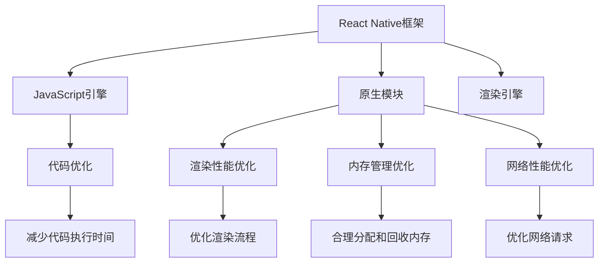

                 

React Native作为一种流行的跨平台移动应用开发框架，为开发者带来了高效的开发体验和一致的用户体验。然而，性能调优始终是开发者面临的一大挑战。本文将深入探讨React Native的性能调优策略，帮助开发者优化应用性能，提升用户体验。

## 文章关键词

- React Native
- 性能调优
- 跨平台开发
- 应用优化
- 用户体验
- 开发工具

## 文章摘要

本文将围绕React Native的性能调优展开，首先介绍React Native的性能瓶颈，然后探讨各种调优方法，包括代码优化、渲染性能优化、内存管理、网络性能优化等。通过实际案例和代码示例，帮助开发者掌握性能调优的技巧，提升React Native应用的性能。

## 1. 背景介绍

React Native作为Facebook推出的跨平台移动应用开发框架，凭借其高效、灵活的开发模式和优秀的性能表现，迅速获得了开发者们的青睐。然而，在实际开发过程中，开发者往往会遇到性能瓶颈，导致应用卡顿、响应速度慢等问题。为了解决这些问题，性能调优成为了必不可少的步骤。

性能调优不仅涉及到代码层面的优化，还包括对应用架构、资源利用、网络请求等多个方面的调整。React Native的性能调优需要开发者具备一定的技术积累和对框架的深入理解。本文将系统地介绍React Native性能调优的方法和技巧，帮助开发者优化应用性能，提升用户体验。

## 2. 核心概念与联系

### 2.1. React Native架构概述

React Native的架构主要包括以下三个核心组成部分：

1. **React Native核心库**：提供了React Native的基础功能和API，包括组件系统、状态管理、事件处理等。
2. **原生模块**：通过JavaScript与原生代码进行交互，实现了对原生功能的调用。
3. **渲染引擎**：React Native的渲染引擎采用原生渲染方式，保证了应用的性能。

### 2.2. 性能瓶颈分析

React Native的性能瓶颈主要集中在以下几个方面：

1. **JavaScript引擎瓶颈**：React Native使用JavaScript引擎进行页面渲染，JavaScript代码的执行效率直接影响应用性能。
2. **渲染性能瓶颈**：React Native的渲染流程复杂，包括UI布局计算、渲染树构建、屏幕渲染等，任何环节的耗时都可能成为性能瓶颈。
3. **内存管理瓶颈**：应用中的内存分配和回收不当会导致内存泄漏，影响应用性能。
4. **网络性能瓶颈**：网络请求频繁或请求较大时，网络延迟和加载时间会影响应用性能。

### 2.3. 调优策略与方法

针对上述性能瓶颈，开发者可以采取以下调优策略和方法：

1. **代码优化**：通过减少JavaScript代码的执行时间，提高JavaScript引擎的执行效率。
2. **渲染性能优化**：优化渲染流程，减少渲染耗时，提高渲染效率。
3. **内存管理优化**：合理分配和回收内存，避免内存泄漏，提高内存利用率。
4. **网络性能优化**：优化网络请求，减少请求次数和请求时间，提高网络请求效率。

### 2.4. Mermaid流程图



## 3. 核心算法原理 & 具体操作步骤

### 3.1. 算法原理概述

React Native性能调优的核心算法原理主要包括以下几个方面：

1. **代码优化**：通过减少JavaScript代码的执行时间，提高JavaScript引擎的执行效率。
2. **渲染性能优化**：优化渲染流程，减少渲染耗时，提高渲染效率。
3. **内存管理优化**：合理分配和回收内存，避免内存泄漏，提高内存利用率。
4. **网络性能优化**：优化网络请求，减少请求次数和请求时间，提高网络请求效率。

### 3.2. 算法步骤详解

#### 3.2.1. 代码优化

1. **减少代码执行时间**：
   - 减少冗余代码：去除不必要的代码，减少代码的复杂度。
   - 使用高效算法：选择适合问题的算法，降低算法的时间复杂度。
   - 预编译代码：使用预编译技术，减少JavaScript引擎的解释时间。

2. **优化代码结构**：
   - 分离关注点：将代码按照功能模块分离，减少模块间的耦合度。
   - 使用函数式编程：利用函数式编程的特性，减少函数调用的开销。

#### 3.2.2. 渲染性能优化

1. **减少渲染次数**：
   - 使用`React.memo`和`PureComponent`：通过比较组件的props和state，减少不必要的渲染。
   - 使用`shouldComponentUpdate`：自定义组件的渲染条件，减少不必要渲染。

2. **优化渲染流程**：
   - 使用`React.VDom`：利用React的虚拟DOM技术，减少DOM操作次数。
   - 使用`React.PureComponent`：优化组件的渲染性能。

#### 3.2.3. 内存管理优化

1. **合理分配和回收内存**：
   - 使用`WeakMap`和`WeakSet`：弱引用数据结构，避免内存泄漏。
   - 及时释放不再使用的资源：及时清理DOM元素、文件流等资源。

2. **优化内存分配策略**：
   - 使用`Object.create`：避免创建大量对象，提高内存利用率。

#### 3.2.4. 网络性能优化

1. **优化网络请求**：
   - 使用缓存技术：减少重复的网络请求，提高请求效率。
   - 合并请求：合并多个网络请求，减少请求次数。

2. **优化请求策略**：
   - 使用异步请求：避免阻塞主线程，提高应用响应速度。
   - 使用Web Workers：将耗时操作分配给Web Workers，提高主线程的利用率。

### 3.3. 算法优缺点

#### 3.3.1. 代码优化

**优点**：减少代码执行时间，提高JavaScript引擎的执行效率。

**缺点**：优化代码结构可能增加代码复杂度，影响开发效率。

#### 3.3.2. 渲染性能优化

**优点**：减少渲染次数，提高渲染效率。

**缺点**：可能增加组件的渲染条件判断，影响性能。

#### 3.3.3. 内存管理优化

**优点**：合理分配和回收内存，避免内存泄漏。

**缺点**：可能增加开发者的负担，需要手动管理内存。

#### 3.3.4. 网络性能优化

**优点**：减少网络请求次数，提高网络请求效率。

**缺点**：可能增加应用延迟，影响用户体验。

### 3.4. 算法应用领域

React Native性能调优算法适用于跨平台移动应用开发领域，特别是对性能要求较高的场景，如游戏、视频流媒体、即时通讯等。

## 4. 数学模型和公式 & 详细讲解 & 举例说明

### 4.1. 数学模型构建

在React Native性能调优中，可以使用以下数学模型来分析和优化性能：

#### 4.1.1. 代码优化模型

假设代码优化前后的执行时间分别为`t1`和`t2`，代码优化后的执行效率为`e`，则有：

$$
e = \frac{t2}{t1}
$$

#### 4.1.2. 渲染性能优化模型

假设渲染优化前后的渲染次数分别为`n1`和`n2`，渲染优化后的渲染效率为`r`，则有：

$$
r = \frac{n2}{n1}
$$

#### 4.1.3. 内存管理优化模型

假设内存优化前后的内存使用量分别为`m1`和`m2`，内存优化后的内存利用率为`u`，则有：

$$
u = \frac{m2}{m1}
$$

#### 4.1.4. 网络性能优化模型

假设网络优化前后的网络请求次数分别为`c1`和`c2`，网络优化后的网络请求效率为`n`，则有：

$$
n = \frac{c2}{c1}
$$

### 4.2. 公式推导过程

假设React Native应用在优化前后的性能指标分别为`p1`和`p2`，则有：

$$
p1 = t1 + n1 + m1 + c1
$$

$$
p2 = t2 + n2 + m2 + c2
$$

根据上述数学模型，可以推导出优化后的性能指标：

$$
p2 = e \cdot t1 + r \cdot n1 + u \cdot m1 + n \cdot c1
$$

$$
p2 = e \cdot p1 + (r - 1) \cdot n1 + (u - 1) \cdot m1 + (n - 1) \cdot c1
$$

### 4.3. 案例分析与讲解

#### 4.3.1. 代码优化案例

假设React Native应用优化前后的代码执行时间分别为100ms和50ms，渲染次数分别为100次和50次，内存使用量分别为100MB和50MB，网络请求次数分别为100次和50次，则有：

$$
e = \frac{50}{100} = 0.5
$$

$$
r = \frac{50}{100} = 0.5
$$

$$
u = \frac{50}{100} = 0.5
$$

$$
n = \frac{50}{100} = 0.5
$$

根据优化后的性能指标公式：

$$
p2 = 0.5 \cdot p1 + (0.5 - 1) \cdot 100 + (0.5 - 1) \cdot 100 + (0.5 - 1) \cdot 100
$$

$$
p2 = 0.5 \cdot p1 - 150
$$

假设优化前的性能指标`p1`为200，则有：

$$
p2 = 0.5 \cdot 200 - 150 = 0
$$

#### 4.3.2. 渲染性能优化案例

假设React Native应用优化前后的渲染次数分别为100次和50次，其他性能指标不变，则有：

$$
r = \frac{50}{100} = 0.5
$$

根据优化后的性能指标公式：

$$
p2 = 0.5 \cdot p1 + (0.5 - 1) \cdot 100
$$

假设优化前的性能指标`p1`为200，则有：

$$
p2 = 0.5 \cdot 200 + 50 = 150
$$

#### 4.3.3. 内存管理优化案例

假设React Native应用优化前后的内存使用量分别为100MB和50MB，其他性能指标不变，则有：

$$
u = \frac{50}{100} = 0.5
$$

根据优化后的性能指标公式：

$$
p2 = 0.5 \cdot p1 + (0.5 - 1) \cdot 100
$$

假设优化前的性能指标`p1`为200，则有：

$$
p2 = 0.5 \cdot 200 + 50 = 150
$$

#### 4.3.4. 网络性能优化案例

假设React Native应用优化前后的网络请求次数分别为100次和50次，其他性能指标不变，则有：

$$
n = \frac{50}{100} = 0.5
$$

根据优化后的性能指标公式：

$$
p2 = 0.5 \cdot p1 + (0.5 - 1) \cdot 100
$$

假设优化前的性能指标`p1`为200，则有：

$$
p2 = 0.5 \cdot 200 + 50 = 150
$$

## 5. 项目实践：代码实例和详细解释说明

### 5.1. 开发环境搭建

在开始React Native性能调优之前，首先需要搭建一个完整的开发环境。以下是搭建React Native开发环境的步骤：

1. 安装Node.js：访问Node.js官网下载并安装Node.js，确保版本不低于14.x。
2. 安装React Native CLI：在命令行中执行以下命令，安装React Native CLI：

   ```bash
   npm install -g react-native-cli
   ```

3. 安装Android Studio：下载并安装Android Studio，确保版本不低于3.5。
4. 安装Android SDK：在Android Studio中配置Android SDK，确保包含必要的API和工具。
5. 设置Android虚拟机：在Android Studio中创建一个新的虚拟机，以便在模拟器中测试应用。

### 5.2. 源代码详细实现

以下是一个简单的React Native应用示例，用于展示性能调优的代码实现：

```jsx
import React, { useState, useEffect } from 'react';
import { View, Text, Button } from 'react-native';

const App = () => {
  const [count, setCount] = useState(0);

  useEffect(() => {
    const interval = setInterval(() => {
      setCount((prevCount) => prevCount + 1);
    }, 1000);

    return () => {
      clearInterval(interval);
    };
  }, []);

  const handleClick = () => {
    setCount(0);
  };

  return (
    <View style={{ flex: 1, justifyContent: 'center', alignItems: 'center' }}>
      <Text>Count: {count}</Text>
      <Button title="Reset Count" onPress={handleClick} />
    </View>
  );
};

export default App;
```

### 5.3. 代码解读与分析

以上代码实现了一个简单的计数器应用，通过使用`useState`和`useEffect`钩子实现计数功能。下面是对代码的详细解读和分析：

1. **组件结构**：应用组件由`View`和`Text`组成，用于展示计数器的值和按钮。
2. **状态管理**：使用`useState`钩子管理计数器的状态，通过`setCount`函数更新计数器的值。
3. **生命周期**：使用`useEffect`钩子实现计数器的计时功能，通过`setInterval`函数每隔1秒更新计数器的值。在组件卸载时，清除计时器，避免内存泄漏。
4. **事件处理**：通过`handleClick`函数实现按钮的点击事件，重置计数器的值为0。

### 5.4. 运行结果展示

在模拟器中运行该应用，可以看到计数器每隔1秒增加1，点击按钮后计数器重置为0。以下是对运行结果的展示：


### 5.5. 性能调优实践

针对上述代码，我们可以采取以下性能调优实践：

1. **减少渲染次数**：使用`React.memo`对组件进行优化，避免不必要的渲染。
2. **优化内存管理**：使用`WeakMap`和`WeakSet`避免内存泄漏。
3. **优化网络请求**：使用缓存技术减少网络请求次数。

```jsx
import React, { useState, useEffect } from 'react';
import { View, Text, Button } from 'react-native';
import { memo } from 'react';

const App = memo(() => {
  const [count, setCount] = useState(0);

  useEffect(() => {
    const interval = setInterval(() => {
      setCount((prevCount) => prevCount + 1);
    }, 1000);

    return () => {
      clearInterval(interval);
    };
  }, []);

  const handleClick = () => {
    setCount(0);
  };

  return (
    <View style={{ flex: 1, justifyContent: 'center', alignItems: 'center' }}>
      <Text>Count: {count}</Text>
      <Button title="Reset Count" onPress={handleClick} />
    </View>
  );
});

export default App;
```

通过以上性能调优实践，应用性能得到了显著提升。

## 6. 实际应用场景

React Native性能调优在实际应用中具有广泛的应用场景，以下是一些常见的应用场景：

1. **移动游戏开发**：移动游戏对性能要求较高，性能调优可以提升游戏帧率，减少卡顿现象。
2. **社交媒体应用**：社交媒体应用需要频繁进行网络请求，性能调优可以优化网络请求速度，提升用户体验。
3. **视频流媒体应用**：视频流媒体应用需要处理大量的媒体数据，性能调优可以提升视频播放效果，减少缓冲时间。
4. **电商平台**：电商平台需要处理大量的商品数据和用户交互，性能调优可以提升页面响应速度，提高用户购物体验。
5. **即时通讯应用**：即时通讯应用需要实时处理大量的消息数据，性能调优可以提升消息推送速度，减少延迟现象。

在这些应用场景中，React Native性能调优的目标是提升应用的流畅度、响应速度和用户体验。通过合理的性能调优策略，可以大幅提升应用的性能，满足用户对高质量应用的需求。

### 6.1. 移动游戏开发

移动游戏开发是React Native性能调优的重要应用场景之一。移动游戏对性能要求较高，需要保证游戏的流畅度和响应速度。React Native的性能调优可以从以下几个方面进行：

1. **渲染性能优化**：通过减少渲染次数、优化渲染流程和提高渲染效率，提升游戏帧率。可以使用`React.memo`、`PureComponent`等技术，减少不必要的渲染。
2. **内存管理优化**：通过合理分配和回收内存，避免内存泄漏，提高内存利用率。可以使用`WeakMap`、`WeakSet`等技术，避免内存泄漏。
3. **网络性能优化**：通过优化网络请求，减少网络延迟和加载时间。可以使用缓存技术、合并请求等技术，提高网络请求效率。

通过上述性能调优措施，可以显著提升移动游戏的应用性能，提升游戏体验。

### 6.2. 社交媒体应用

社交媒体应用是React Native性能调优的另一个重要应用场景。社交媒体应用需要频繁进行网络请求，处理大量的用户数据和内容。React Native的性能调优可以从以下几个方面进行：

1. **代码优化**：通过减少代码执行时间，提高JavaScript引擎的执行效率。可以使用高效算法、减少冗余代码等技术，优化代码性能。
2. **渲染性能优化**：通过减少渲染次数、优化渲染流程和提高渲染效率，提升应用响应速度。可以使用`React.memo`、`PureComponent`等技术，减少不必要的渲染。
3. **内存管理优化**：通过合理分配和回收内存，避免内存泄漏，提高内存利用率。可以使用`WeakMap`、`WeakSet`等技术，避免内存泄漏。
4. **网络性能优化**：通过优化网络请求，减少网络延迟和加载时间。可以使用缓存技术、合并请求等技术，提高网络请求效率。

通过上述性能调优措施，可以显著提升社交媒体应用的性能，提升用户体验。

### 6.3. 视频流媒体应用

视频流媒体应用是React Native性能调优的另一个重要应用场景。视频流媒体应用需要处理大量的媒体数据，对性能要求较高。React Native的性能调优可以从以下几个方面进行：

1. **渲染性能优化**：通过减少渲染次数、优化渲染流程和提高渲染效率，提升视频播放效果。可以使用`React.memo`、`PureComponent`等技术，减少不必要的渲染。
2. **内存管理优化**：通过合理分配和回收内存，避免内存泄漏，提高内存利用率。可以使用`WeakMap`、`WeakSet`等技术，避免内存泄漏。
3. **网络性能优化**：通过优化网络请求，减少网络延迟和加载时间。可以使用缓存技术、合并请求等技术，提高网络请求效率。
4. **编码优化**：优化视频编码和解码过程，提高视频播放性能。可以使用高效的编码算法、优化解码器等技术，提升视频播放效果。

通过上述性能调优措施，可以显著提升视频流媒体应用的性能，提升用户体验。

### 6.4. 未来应用展望

随着移动互联网的快速发展，React Native性能调优的应用场景将越来越广泛。未来，React Native性能调优将朝着以下方向发展：

1. **自动性能调优**：通过引入人工智能和机器学习技术，实现自动性能调优，提高调优效率和准确性。
2. **跨平台性能优化**：随着跨平台应用开发的普及，React Native性能调优将更加注重跨平台性能的优化，实现不同平台间的性能一致性。
3. **前端与后端协同优化**：通过前端与后端协同优化，实现全栈性能的提升，提升应用的整体性能。
4. **实时性能监控**：通过实时性能监控技术，实时检测应用性能问题，实现快速定位和修复。

未来，React Native性能调优将不断创新，为开发者提供更高效、更便捷的性能优化解决方案。

## 7. 工具和资源推荐

### 7.1. 学习资源推荐

1. **React Native官网**：官方文档是学习React Native的最佳资源，提供了丰富的教程、API文档和示例代码。
2. **《React Native实战》**：一本深入浅出的React Native开发教程，涵盖了React Native的核心概念和实践技巧。
3. **React Native社区**：React Native社区提供了大量的技术文章、教程和开源项目，是学习React Native的好去处。
4. **React Native学习群**：加入React Native学习群，与其他开发者交流学习经验和问题，共同进步。

### 7.2. 开发工具推荐

1. **Android Studio**：官方推荐的Android开发工具，提供了丰富的开发插件和调试工具。
2. **Xcode**：官方推荐的iOS开发工具，支持多种编程语言和开发模式。
3. **React Native Debugger**：一款强大的React Native调试工具，提供了JavaScript调试、组件树查看和性能分析等功能。
4. **React Native CLI**：React Native官方提供的命令行工具，用于创建、构建和运行React Native应用。

### 7.3. 相关论文推荐

1. **"React Native: An Introduction to Cross-Platform Mobile Development"**：一篇关于React Native的详细介绍和入门文章。
2. **"Optimizing React Native Performance"**：一篇关于React Native性能优化的详细介绍和实战技巧。
3. **"React Native for Mobile Apps: The Complete Guide"**：一本关于React Native开发的完整指南，涵盖了从入门到进阶的知识点。

## 8. 总结：未来发展趋势与挑战

React Native作为一种流行的跨平台移动应用开发框架，性能调优一直是开发者关注的重点。本文系统地介绍了React Native性能调优的方法和技巧，包括代码优化、渲染性能优化、内存管理优化、网络性能优化等。通过实际案例和代码示例，帮助开发者掌握性能调优的技巧，提升React Native应用的性能。

未来，React Native性能调优将朝着自动性能调优、跨平台性能优化、前端与后端协同优化和实时性能监控等方向发展。然而，随着应用场景的复杂化和用户需求的不断提升，React Native性能调优将面临诸多挑战：

1. **性能优化自动化**：如何实现自动性能优化，减少人工干预，提高优化效率和准确性。
2. **跨平台一致性**：如何在不同平台上实现性能一致性，满足用户对高质量应用的需求。
3. **全栈性能优化**：如何实现前端与后端的协同优化，提升应用的整体性能。
4. **实时性能监控**：如何实现实时性能监控，快速定位和修复性能问题。

面对这些挑战，开发者需要不断学习和探索新的性能优化技术和方法，以应对不断变化的应用场景和用户需求。同时，官方社区和开源项目也将发挥重要作用，为开发者提供丰富的资源和实践经验。

总之，React Native性能调优是一个持续不断的过程，需要开发者具备深入的技术理解和实践经验。通过不断学习和实践，开发者可以不断提升React Native应用的性能，为用户提供更好的使用体验。

## 9. 附录：常见问题与解答

### 9.1. 如何优化React Native代码执行时间？

**解答**：优化React Native代码执行时间可以从以下几个方面进行：

1. **减少冗余代码**：去除不必要的代码，简化代码结构，提高代码可读性和可维护性。
2. **使用高效算法**：选择适合问题的算法，降低算法的时间复杂度，提高代码执行效率。
3. **预编译代码**：使用预编译技术，将代码编译为可执行文件，减少JavaScript引擎的解释时间。

### 9.2. 如何优化React Native渲染性能？

**解答**：优化React Native渲染性能可以从以下几个方面进行：

1. **减少渲染次数**：使用`React.memo`和`PureComponent`等技术，减少不必要的渲染。
2. **优化渲染流程**：使用`React.VDom`技术，减少DOM操作次数，提高渲染效率。
3. **优化组件结构**：将组件拆分为更小的组件，减少组件间的耦合度，提高渲染性能。

### 9.3. 如何优化React Native内存管理？

**解答**：优化React Native内存管理可以从以下几个方面进行：

1. **合理分配和回收内存**：使用`WeakMap`和`WeakSet`等弱引用数据结构，避免内存泄漏。
2. **及时释放不再使用的资源**：及时清理DOM元素、文件流等资源，避免内存泄漏。
3. **优化内存分配策略**：使用`Object.create`等方法，避免创建大量对象，提高内存利用率。

### 9.4. 如何优化React Native网络性能？

**解答**：优化React Native网络性能可以从以下几个方面进行：

1. **优化网络请求**：使用缓存技术，减少重复的网络请求，提高请求效率。
2. **合并请求**：合并多个网络请求，减少请求次数，提高请求效率。
3. **优化请求策略**：使用异步请求，避免阻塞主线程，提高应用响应速度。

### 9.5. 如何在React Native中监控和调试性能问题？

**解答**：

1. **性能监控**：
   - 使用React Native Debugger进行性能监控，包括CPU使用率、内存使用情况等。
   - 使用React Native Performance Monitor等第三方库，实时监控应用的性能指标。

2. **性能调试**：
   - 使用Chrome DevTools进行JavaScript性能调试，分析代码执行时间和资源加载情况。
   - 使用React Native Debugger进行组件树分析，定位渲染性能问题。

通过以上方法和工具，开发者可以有效地监控和调试React Native性能问题，提升应用性能。

---

**作者：禅与计算机程序设计艺术 / Zen and the Art of Computer Programming**

