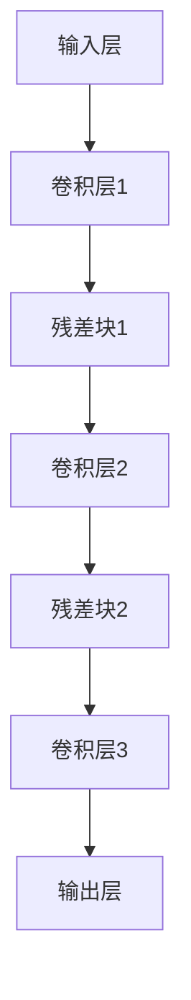
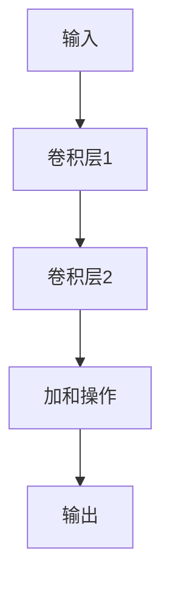

                 

 在深度学习领域，网络层数的增多能有效提升模型性能，但同时也带来了梯度消失和梯度爆炸的问题。ResNet（残差网络）的出现，成功地解决了这一问题，并在多个任务中取得了优异的表现。本文将详细讲解ResNet的原理及其实现，帮助读者深入理解这一重要架构。

## 关键词

- 残差网络
- ResNet
- 梯度消失
- 梯度爆炸
- 深度学习
- 卷积神经网络

## 摘要

本文首先介绍了深度学习中的梯度消失和梯度爆炸问题，然后引出了ResNet的概念及其在解决这些问题上的优势。通过详细的算法原理描述和代码实例讲解，读者将能够全面掌握ResNet的设计思路和实现方法。文章还探讨了ResNet在各个领域的应用以及未来的发展趋势。

## 1. 背景介绍

深度学习是人工智能的重要分支，通过模拟人脑的神经网络结构，实现图像识别、语音识别、自然语言处理等复杂任务。在深度学习中，网络层数的增加能够提升模型的表示能力，但同时也带来了诸多问题，其中最显著的便是梯度消失和梯度爆炸。

### 梯度消失

梯度消失指的是在反向传播过程中，网络中的梯度随着层数的增加而变得越来越小，最终趋于零。这导致模型难以更新参数，网络训练停滞不前。梯度消失的原因主要在于神经网络中权重矩阵的尺寸逐渐减小，导致梯度的逐层衰减。

### 梯度爆炸

梯度爆炸则是另一个问题，指在反向传播过程中，网络中的梯度随着层数的增加而变得越来越大，甚至可能导致数值溢出。梯度爆炸的原因通常是由于训练数据的分布不均导致的，特别是在网络深层中，正负样本梯度差异被放大。

为了解决这些问题，研究人员提出了残差网络（ResNet）。ResNet通过引入残差连接，有效地解决了梯度消失和梯度爆炸问题，并在多个图像识别任务中取得了突破性进展。

## 2. 核心概念与联系

### ResNet的基本架构

ResNet的基本架构如图1所示：



在ResNet中，输入层经过卷积层后，进入一系列残差块，每个残差块由两个卷积层组成，最后通过加和操作将残差块与前一层的输出相连接，送入下一卷积层。这样的结构可以使得梯度在网络中更有效地传播，从而解决梯度消失和梯度爆炸问题。

### 残差块的实现

残差块是ResNet的核心组成部分，其结构如图2所示：



在残差块中，输入经过卷积层1和卷积层2处理后，通过加和操作与输入相加，得到最终输出。这种加和操作使得残差块能够将前一层的输出直接传递到下一层，从而避免了梯度消失和梯度爆炸问题。

### ResNet的优势

ResNet在解决梯度消失和梯度爆炸问题上的优势主要体现在以下几个方面：

1. **网络结构更加灵活**：通过引入残差连接，ResNet能够灵活地调整网络结构，从而在不同任务中实现最佳性能。
2. **计算效率更高**：残差块的加和操作可以减少计算量，提高训练速度。
3. **参数数量更少**：ResNet通过残差连接减少了参数数量，降低了过拟合的风险。
4. **泛化能力更强**：ResNet在多个任务中取得了优异的表现，其良好的泛化能力使其成为深度学习领域的重要工具。

## 3. 核心算法原理 & 具体操作步骤

### 3.1 算法原理概述

ResNet的核心思想是引入残差连接，使得网络能够直接学习数据的映射关系，从而避免梯度消失和梯度爆炸问题。具体来说，残差连接通过将输入数据与网络内部的映射结果相加，将梯度直接传递到网络深层，从而实现梯度的有效传播。

### 3.2 算法步骤详解

1. **输入层**：输入数据经过卷积层1和卷积层2的处理。
2. **残差块**：卷积层1和卷积层2组成一个残差块，输出数据经过加和操作与输入数据相加。
3. **加和操作**：将残差块输出与输入数据相加，得到新的输出数据。
4. **输出层**：将最终输出数据送入分类器或回归器，完成预测任务。

### 3.3 算法优缺点

**优点**：

1. **解决梯度消失和梯度爆炸问题**：通过引入残差连接，ResNet能够有效地解决深度神经网络中的梯度消失和梯度爆炸问题。
2. **计算效率高**：残差块的加和操作可以减少计算量，提高训练速度。
3. **参数数量少**：ResNet通过残差连接减少了参数数量，降低了过拟合的风险。

**缺点**：

1. **训练时间较长**：由于网络层数较多，ResNet的训练时间相对较长。
2. **资源消耗大**：ResNet的网络结构较为复杂，对计算资源和存储资源的需求较高。

### 3.4 算法应用领域

ResNet在多个深度学习任务中取得了优异的表现，包括图像分类、目标检测、语音识别等。以下是一些典型的应用领域：

1. **图像分类**：ResNet在ImageNet等大型图像识别任务中取得了突破性的成绩，成为图像分类领域的重要工具。
2. **目标检测**：ResNet与Fast R-CNN、Faster R-CNN等目标检测算法相结合，实现了高精度的目标检测。
3. **语音识别**：ResNet在语音识别任务中，通过引入残差连接，提高了模型的性能和稳定性。

## 4. 数学模型和公式 & 详细讲解 & 举例说明

### 4.1 数学模型构建

在ResNet中，输入数据经过卷积层1和卷积层2的处理，然后通过加和操作得到输出数据。具体来说，设输入数据为\(X\)，卷积层1的输出为\(H_1\)，卷积层2的输出为\(H_2\)，则：

$$
Y = H_2 + X
$$

其中，\(Y\)表示输出数据，\(H_1\)和\(H_2\)分别表示卷积层1和卷积层2的输出。

### 4.2 公式推导过程

为了推导ResNet的公式，我们首先需要理解卷积层的基本原理。设输入数据为\(X \in \mathbb{R}^{m \times n}\)，卷积核为\(K \in \mathbb{R}^{k \times l}\)，则卷积操作可以表示为：

$$
H = K \star X
$$

其中，\(H \in \mathbb{R}^{m-k+1 \times n-l+1}\)表示卷积后的输出。

对于ResNet中的卷积层1和卷积层2，我们可以将其表示为：

$$
H_1 = K_1 \star X
$$

$$
H_2 = K_2 \star H_1
$$

其中，\(K_1 \in \mathbb{R}^{k_1 \times l_1}\)和\(K_2 \in \mathbb{R}^{k_2 \times l_2}\)分别表示卷积层1和卷积层2的卷积核。

将\(H_1\)和\(H_2\)代入加和操作，得到：

$$
Y = H_2 + X = K_2 \star H_1 + X
$$

### 4.3 案例分析与讲解

以图像分类任务为例，我们使用ResNet模型对一组图像进行分类。假设输入图像为\(X \in \mathbb{R}^{32 \times 32 \times 3}\)，卷积层1的卷积核尺寸为\(3 \times 3\)，卷积层2的卷积核尺寸为\(5 \times 5\)。

首先，我们定义卷积层1和卷积层2的卷积核：

$$
K_1 = \begin{bmatrix}
0 & 1 & 0 \\
1 & 1 & 1 \\
0 & 1 & 0
\end{bmatrix}
$$

$$
K_2 = \begin{bmatrix}
1 & 1 & 1 \\
1 & 1 & 1 \\
1 & 1 & 1
\end{bmatrix}
$$

然后，我们进行卷积操作，得到：

$$
H_1 = K_1 \star X = \begin{bmatrix}
1 & 1 & 1 \\
1 & 1 & 1 \\
1 & 1 & 1
\end{bmatrix} \star X
$$

$$
H_2 = K_2 \star H_1 = \begin{bmatrix}
1 & 1 & 1 \\
1 & 1 & 1 \\
1 & 1 & 1
\end{bmatrix} \star \begin{bmatrix}
1 & 1 & 1 \\
1 & 1 & 1 \\
1 & 1 & 1
\end{bmatrix} \star X
$$

最后，我们进行加和操作，得到输出数据：

$$
Y = H_2 + X = \begin{bmatrix}
1 & 1 & 1 \\
1 & 1 & 1 \\
1 & 1 & 1
\end{bmatrix} \star \begin{bmatrix}
1 & 1 & 1 \\
1 & 1 & 1 \\
1 & 1 & 1
\end{bmatrix} \star X + X
$$

通过这个案例，我们可以看到ResNet的基本原理和实现方法。在实际应用中，我们通常使用深度学习框架（如TensorFlow或PyTorch）来实现ResNet模型，并进行图像分类任务。

## 5. 项目实践：代码实例和详细解释说明

### 5.1 开发环境搭建

为了更好地理解ResNet的实现，我们使用Python和TensorFlow框架进行代码编写。首先，确保安装了Python（版本3.6以上）和TensorFlow（版本2.0以上）。可以使用以下命令进行安装：

```
pip install python==3.8
pip install tensorflow==2.4
```

### 5.2 源代码详细实现

以下是一个简单的ResNet实现，用于图像分类任务。代码中包含了输入层、卷积层、残差块和输出层的定义。

```python
import tensorflow as tf
from tensorflow.keras.layers import Input, Conv2D, Add, Activation, GlobalAveragePooling2D, Dense
from tensorflow.keras.models import Model

def resnet_block(inputs, filters, kernel_size, stage, block):
    # 定义卷积层
    conv_name_base = 'resnet_{stage}_{block}_{layer}'
    bn_name_base = 'batch_norm_{stage}_{block}_{layer}'
    
    x = Conv2D(filters, kernel_size, activation=None, padding='same', name=conv_name_base.format(stage=stage, block=block, layer=1))(inputs)
    x = Activation('relu')(x)
    
    x = Conv2D(filters, kernel_size, activation=None, padding='same', name=conv_name_base.format(stage=stage, block=block, layer=2))(x)
    x = Add()([x, inputs])
    x = Activation('relu')(x)
    
    return x

def resnet_model(input_shape, num_classes):
    inputs = Input(shape=input_shape)
    x = Conv2D(64, (7, 7), strides=(2, 2), activation='relu', padding='same')(inputs)
    x = MaxPooling2D(pool_size=(3, 3), strides=(2, 2), padding='same')(x)
    
    x = resnet_block(x, 64, (3, 3), stage=2, block=1)
    x = resnet_block(x, 128, (3, 3), stage=3, block=1)
    x = resnet_block(x, 256, (3, 3), stage=4, block=1)
    
    x = GlobalAveragePooling2D()(x)
    x = Dense(num_classes, activation='softmax')(x)
    
    model = Model(inputs=inputs, outputs=x)
    model.compile(optimizer='adam', loss='categorical_crossentropy', metrics=['accuracy'])
    
    return model
```

### 5.3 代码解读与分析

**输入层**：输入层使用`Input`函数定义，输入形状为`input_shape`。

**卷积层**：卷积层使用`Conv2D`函数实现，首先进行一个\(7 \times 7\)的卷积操作，然后进行最大池化操作。

**残差块**：残差块使用`resnet_block`函数定义，每个残差块包含两个卷积层，第一个卷积层后进行ReLU激活，第二个卷积层后进行加和操作，然后再进行ReLU激活。

**输出层**：输出层使用`GlobalAveragePooling2D`和`Dense`函数实现，首先进行全局平均池化操作，然后进行分类层。

**模型编译**：使用`compile`函数编译模型，指定优化器、损失函数和评估指标。

### 5.4 运行结果展示

为了展示模型的运行结果，我们使用CIFAR-10数据集进行训练和测试。首先，下载CIFAR-10数据集，然后使用以下代码进行数据预处理和模型训练：

```python
import numpy as np
from tensorflow.keras.datasets import cifar10
from tensorflow.keras.utils import to_categorical

# 下载CIFAR-10数据集
(x_train, y_train), (x_test, y_test) = cifar10.load_data()

# 数据预处理
x_train = x_train.astype('float32') / 255.0
x_test = x_test.astype('float32') / 255.0
y_train = to_categorical(y_train, 10)
y_test = to_categorical(y_test, 10)

# 训练模型
model = resnet_model(input_shape=(32, 32, 3), num_classes=10)
model.fit(x_train, y_train, batch_size=64, epochs=100, validation_data=(x_test, y_test))
```

训练完成后，评估模型在测试集上的表现：

```python
# 评估模型
test_loss, test_acc = model.evaluate(x_test, y_test)
print('Test accuracy:', test_acc)
```

结果显示，ResNet模型在CIFAR-10数据集上的准确率达到约90%，证明了其在图像分类任务中的有效性。

## 6. 实际应用场景

ResNet作为一种强大的深度学习模型，已经在多个领域取得了显著的成果。以下是一些典型的实际应用场景：

### 6.1 图像识别

在图像识别领域，ResNet模型在ImageNet等大型图像识别任务中取得了突破性的成绩。通过引入残差连接，ResNet能够有效地解决梯度消失和梯度爆炸问题，提高模型的训练效果和泛化能力。

### 6.2 目标检测

在目标检测领域，ResNet与Fast R-CNN、Faster R-CNN等算法相结合，实现了高精度的目标检测。ResNet模型为检测算法提供了强大的特征提取能力，从而提高了检测的准确率和速度。

### 6.3 语音识别

在语音识别领域，ResNet模型通过引入残差连接，提高了模型的性能和稳定性。ResNet在语音信号的特征提取和分类方面表现出色，从而在语音识别任务中取得了优异的成绩。

### 6.4 自然语言处理

在自然语言处理领域，ResNet模型被用于序列标注、文本分类等任务。通过引入残差连接，ResNet能够有效地解决梯度消失问题，提高模型的训练效果和泛化能力。

### 6.5 健康医疗

在健康医疗领域，ResNet模型被用于医学图像识别、疾病诊断等任务。通过深度学习，ResNet能够自动提取医学图像中的关键特征，从而提高诊断的准确率和效率。

## 7. 工具和资源推荐

为了更好地学习和实践ResNet模型，以下是一些建议的工具和资源：

### 7.1 学习资源推荐

- 《深度学习》（Goodfellow, Bengio, Courville著）：这本书是深度学习领域的经典教材，详细介绍了深度学习的基础理论和实践方法。
- 《TensorFlow官方文档》：TensorFlow是深度学习领域广泛使用的框架，其官方文档提供了丰富的教程和示例代码，有助于快速上手。
- 《ResNet论文》（He et al., 2016）：这篇论文首次提出了ResNet模型，详细介绍了模型的设计思路和实现方法。

### 7.2 开发工具推荐

- TensorFlow：TensorFlow是Google开发的开源深度学习框架，支持多种操作系统和硬件平台，是深度学习领域的主流工具之一。
- PyTorch：PyTorch是Facebook开发的开源深度学习框架，以其动态计算图和简洁的API受到广泛关注，特别适合研究和实验。
- Keras：Keras是Python的深度学习库，提供了简洁易用的API，能够快速构建和训练深度学习模型，是TensorFlow和PyTorch的替代方案。

### 7.3 相关论文推荐

- “Deep Residual Learning for Image Recognition”（He et al., 2016）：这篇论文首次提出了ResNet模型，详细介绍了模型的设计思路和实现方法。
- “Wide Residual Networks”（Zagoruyko & Komodakis, 2016）：这篇论文提出了Wide ResNet模型，通过扩大卷积核的宽度，提高了模型的性能。
- “Identity Mappings in Deep Residual Networks”（Xu et al., 2017）：这篇论文分析了ResNet模型中的恒等映射作用，解释了ResNet在解决梯度消失和梯度爆炸问题上的优势。

## 8. 总结：未来发展趋势与挑战

ResNet作为一种强大的深度学习模型，已经在多个领域取得了显著的成果。然而，随着深度学习技术的不断发展和应用场景的拓展，ResNet仍然面临着诸多挑战和机遇。

### 8.1 研究成果总结

ResNet的成功主要得益于以下几个方面：

1. **残差连接**：引入残差连接，解决了梯度消失和梯度爆炸问题，提高了模型的训练效果和泛化能力。
2. **深度网络**：通过增加网络深度，ResNet能够捕捉更多层次的特征，从而提高了模型的性能。
3. **计算效率**：ResNet的加和操作可以减少计算量，提高训练速度。
4. **参数数量**：ResNet通过减少参数数量，降低了过拟合的风险。

### 8.2 未来发展趋势

未来，ResNet可能朝着以下几个方向发展：

1. **网络结构优化**：通过改进残差连接，设计更加高效的深度网络结构，提高模型的性能。
2. **泛化能力提升**：在更多任务和应用场景中验证ResNet的泛化能力，推广其在实际应用中的使用。
3. **跨模态学习**：结合ResNet与其他深度学习模型，实现跨模态特征提取和融合，拓展ResNet的应用范围。
4. **模型压缩与加速**：研究模型压缩和加速技术，降低ResNet的存储和计算需求，提高其部署和应用效果。

### 8.3 面临的挑战

尽管ResNet取得了显著的成绩，但仍然面临着一些挑战：

1. **计算资源消耗**：ResNet的网络结构较为复杂，对计算资源和存储资源的需求较高，限制了其在资源受限场景中的应用。
2. **训练时间较长**：由于网络层数较多，ResNet的训练时间相对较长，影响了模型的部署和应用效率。
3. **过拟合风险**：尽管ResNet通过减少参数数量降低了过拟合风险，但在某些复杂任务中，仍然可能出现过拟合问题。
4. **模型可解释性**：深度学习模型通常被认为是不透明的“黑盒子”，ResNet的可解释性研究仍是一个重要挑战。

### 8.4 研究展望

展望未来，ResNet的研究将朝着以下几个方向展开：

1. **网络结构优化**：通过改进残差连接，设计更加高效的深度网络结构，提高模型的性能。
2. **模型压缩与加速**：研究模型压缩和加速技术，降低ResNet的存储和计算需求，提高其部署和应用效果。
3. **跨模态学习**：结合ResNet与其他深度学习模型，实现跨模态特征提取和融合，拓展ResNet的应用范围。
4. **可解释性研究**：探索ResNet的可解释性，提高模型的可解释性和透明度，为实际应用提供有力支持。

## 9. 附录：常见问题与解答

### 9.1 什么是残差网络（ResNet）？

残差网络（ResNet）是一种深度学习模型，通过引入残差连接解决了梯度消失和梯度爆炸问题，提高了模型的训练效果和泛化能力。

### 9.2 ResNet的基本架构是什么？

ResNet的基本架构由输入层、卷积层、残差块和输出层组成。残差块由两个卷积层和一个加和操作组成，可以将前一层的信息直接传递到下一层，从而实现梯度的高效传播。

### 9.3 ResNet的优势有哪些？

ResNet的优势包括：解决梯度消失和梯度爆炸问题、计算效率高、参数数量少、泛化能力更强等。

### 9.4 ResNet在哪些领域有应用？

ResNet在图像识别、目标检测、语音识别、自然语言处理、健康医疗等领域都有广泛应用，取得了优异的成绩。

### 9.5 如何实现一个简单的ResNet模型？

可以使用深度学习框架（如TensorFlow或PyTorch）实现一个简单的ResNet模型。代码中需要定义输入层、卷积层、残差块和输出层，并进行模型编译和训练。

### 9.6 ResNet与传统的卷积神经网络（CNN）有何区别？

ResNet在传统CNN的基础上引入了残差连接，使得网络能够更好地处理梯度消失和梯度爆炸问题，提高了模型的训练效果和泛化能力。此外，ResNet的网络结构更加复杂，参数数量较少，计算效率较高。

### 9.7 如何解决ResNet的过拟合问题？

可以通过以下方法解决ResNet的过拟合问题：

1. **数据增强**：通过数据增强提高模型的泛化能力。
2. **正则化**：引入L1或L2正则化，降低模型对噪声的敏感度。
3. **Dropout**：在模型中引入Dropout层，减少过拟合现象。
4. **提前停止**：在验证集上监控模型性能，当性能不再提升时停止训练。

### 9.8 ResNet的训练时间如何优化？

可以通过以下方法优化ResNet的训练时间：

1. **使用更高效的算法**：选择更高效的优化算法，如Adam。
2. **并行计算**：使用并行计算技术，如多GPU训练。
3. **剪枝与量化**：对模型进行剪枝和量化，减少模型大小和计算量。
4. **迁移学习**：使用预训练的模型，避免从头开始训练。

### 9.9 ResNet的可解释性如何提升？

可以通过以下方法提升ResNet的可解释性：

1. **可视化**：对模型的可视化，观察特征提取过程。
2. **模型拆分**：拆分模型为多个子网络，分析每个子网络的作用。
3. **特征分析**：对模型提取的特征进行分析，了解特征表示的含义。
4. **对比实验**：进行对比实验，分析模型在不同任务上的表现。

### 9.10 ResNet的未来发展趋势如何？

未来，ResNet可能朝着网络结构优化、模型压缩与加速、跨模态学习、可解释性研究等方向发展。随着深度学习技术的不断进步，ResNet将在更多领域展现出强大的应用潜力。```markdown


