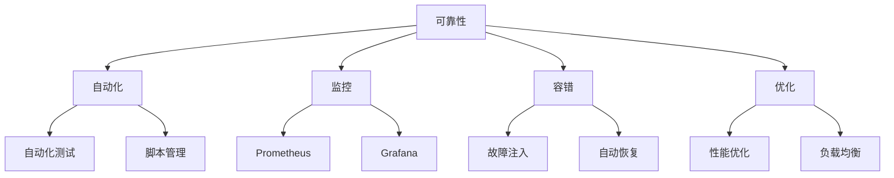

                 

关键词：SRE，站点可靠性工程，系统稳定性，技术实践，算法原理

摘要：本文旨在深入探讨站点可靠性工程（SRE）的概念、核心原则以及其在确保系统稳定性方面的重要作用。我们将分析SRE的核心概念、算法原理，并展示其在实际项目中的应用。通过本文的阅读，读者将更好地理解如何通过SRE的方法提升系统的可靠性和稳定性。

## 1. 背景介绍

随着互联网技术的发展和业务的快速增长，系统的复杂性和规模也在不断增加。如何确保这些系统在面临各种压力和挑战时能够持续稳定地提供服务，成为了一个重要课题。传统的IT运维模式已经无法满足现代高可用性和高性能系统的需求。为了解决这一问题，谷歌在2003年提出了站点可靠性工程（SRE）这一概念。

SRE是Google的一种工程实践，它将传统的IT运维和软件工程相结合，通过一系列自动化工具和流程，确保系统的可靠性、稳定性和性能。SRE的核心目标是最大化系统运行时间，最小化系统故障率和恢复时间。

### 1.1 SRE的产生背景

随着Google业务的快速增长，系统变得越来越复杂，维护和管理的难度也越来越大。传统的IT运维团队发现，他们花费大量时间在故障处理和系统监控上，而无法专注于新功能的开发和优化。为了解决这个问题，谷歌开始探索一种新的工程实践，即SRE。

SRE的提出源于谷歌对自身系统的严格要求。谷歌的使命是“整合全球信息，让人们更轻松地获取知识”。这一使命要求Google的系统必须具有极高的可用性和可靠性。因此，SRE被设计为一种确保系统稳定性的工程实践，以支持Google庞大的在线业务。

### 1.2 SRE的核心原则

SRE的核心原则包括以下几个方面：

1. **自动化**：通过自动化工具和脚本，减少人工干预，提高效率和准确性。
2. **监控**：使用各种监控工具，实时监控系统的状态，及时发现和解决问题。
3. **容错**：设计系统时考虑容错性，确保在故障发生时系统能够自动恢复。
4. **优化**：不断优化系统性能，提高系统的可用性和可靠性。

## 2. 核心概念与联系

### 2.1 SRE的核心概念

SRE的核心概念包括以下几个方面：

1. **可靠性**：确保系统在规定的时间内正常运作。
2. **可用性**：系统在用户需要时能够正常提供服务。
3. **性能**：系统在高负载下仍能保持良好的响应速度。

这些概念相互关联，共同决定了系统的稳定性。

### 2.2 SRE的核心架构

SRE的核心架构包括以下几个方面：

1. **自动化**：使用自动化工具和脚本，如Chaos Monkey，进行故障注入和系统测试。
2. **监控**：使用各种监控工具，如Prometheus和Grafana，实时监控系统的状态。
3. **告警**：设置告警规则，及时发现潜在问题。
4. **故障恢复**：设计故障恢复机制，确保系统在故障发生后能够快速恢复。

### 2.3 Mermaid 流程图

以下是一个简化的SRE流程图，展示了SRE的核心概念和架构：



## 3. 核心算法原理 & 具体操作步骤

### 3.1 算法原理概述

SRE的核心算法主要基于以下几个方面：

1. **自动化测试**：使用自动化测试工具，如Chaos Monkey，对系统进行故障注入和测试，确保系统在故障情况下能够自动恢复。
2. **监控和告警**：使用Prometheus和Grafana等工具，实时监控系统的状态，设置告警规则，及时发现潜在问题。
3. **故障恢复**：设计故障恢复机制，如自动重启、水平扩展等，确保系统在故障发生后能够快速恢复。

### 3.2 算法步骤详解

以下是SRE的具体操作步骤：

1. **自动化测试**：
   - 使用Chaos Monkey工具，对系统进行故障注入。
   - 收集测试结果，分析系统在故障情况下的响应和恢复能力。

2. **监控和告警**：
   - 使用Prometheus和Grafana等工具，实时监控系统的状态。
   - 设置告警规则，如CPU使用率过高、内存溢出等。

3. **故障恢复**：
   - 在故障发生时，自动重启服务。
   - 根据负载情况，自动进行水平扩展。

### 3.3 算法优缺点

SRE算法的优点包括：

1. **高可靠性**：通过自动化测试和故障恢复机制，确保系统在故障情况下能够快速恢复。
2. **高效性**：减少人工干预，提高系统维护的效率和准确性。

SRE算法的缺点包括：

1. **复杂性**：需要较高的技术水平，对团队成员的要求较高。
2. **成本**：需要投入较多的资源进行自动化工具和监控系统的建设。

### 3.4 算法应用领域

SRE算法主要应用于以下领域：

1. **大型互联网公司**：如Google、Facebook、Amazon等，这些公司的系统规模庞大，对稳定性和可靠性有极高的要求。
2. **金融行业**：金融行业对系统的稳定性和可靠性要求极高，SRE可以为金融系统提供有效的保障。

## 4. 数学模型和公式 & 详细讲解 & 举例说明

### 4.1 数学模型构建

SRE的核心数学模型主要包括以下几个方面：

1. **可靠性模型**：使用泊松过程建模系统的故障率，使用马尔可夫链建模系统的状态转换。
2. **性能模型**：使用排队论模型，如M/M/1模型，分析系统的响应时间和吞吐量。
3. **成本模型**：使用线性规划模型，优化系统资源的分配和成本。

### 4.2 公式推导过程

以下是SRE中常用的一些公式：

1. **故障率（λ）**：λ = 1/MTTF，其中MTTF是平均无故障时间。
2. **响应时间（T）**：T = W^2/3，其中W是等待时间。
3. **系统吞吐量（σ）**：σ = λ/μ，其中μ是服务速率。

### 4.3 案例分析与讲解

以下是一个简单的案例，用于说明SRE中的数学模型和公式。

假设一个系统的故障率为λ = 0.001次/小时，平均无故障时间为MTTF = 1000小时。服务速率为μ = 0.009次/小时。

1. **故障率**：λ = 1/MTTF = 1/1000 = 0.001次/小时。
2. **响应时间**：T = W^2/3，假设等待时间W = 10小时，则T = 10^2/3 ≈ 6.34小时。
3. **系统吞吐量**：σ = λ/μ = 0.001/0.009 ≈ 0.111次/小时。

通过这个案例，我们可以看到SRE中的数学模型和公式如何帮助我们分析和优化系统的性能和可靠性。

## 5. 项目实践：代码实例和详细解释说明

### 5.1 开发环境搭建

在开始项目实践之前，我们需要搭建一个开发环境。以下是基本的步骤：

1. **安装Python**：在系统中安装Python 3.8或更高版本。
2. **安装Prometheus**：下载并安装Prometheus监控工具。
3. **安装Grafana**：下载并安装Grafana可视化工具。

### 5.2 源代码详细实现

以下是一个简单的Python示例，用于展示如何使用SRE中的自动化测试工具。

```python
import random
import time

def chaos_monkey():
    """
    Chaos Monkey 自动化测试工具
    """
    while True:
        # 随机选择一个服务进行故障注入
        service = random.choice(['service1', 'service2', 'service3'])
        
        # 故障注入
        if service == 'service1':
            print("故障注入：service1")
            # 模拟service1故障
            time.sleep(random.randint(1, 5))
        
        elif service == 'service2':
            print("故障注入：service2")
            # 模拟service2故障
            time.sleep(random.randint(1, 3))
        
        elif service == 'service3':
            print("故障注入：service3")
            # 模拟service3故障
            time.sleep(random.randint(1, 2))
        
        # 等待一段时间后重新开始测试
        time.sleep(10)

if __name__ == "__main__":
    chaos_monkey()
```

### 5.3 代码解读与分析

上述代码实现了简单的Chaos Monkey自动化测试工具。以下是代码的详细解读：

- `import random`：导入随机模块，用于随机选择服务进行故障注入。
- `import time`：导入时间模块，用于模拟故障注入。
- `def chaos_monkey()`：定义Chaos Monkey函数，用于进行故障注入。
- `while True:`：无限循环，持续进行故障注入。
- `service = random.choice(['service1', 'service2', 'service3'])`：随机选择一个服务进行故障注入。
- `if service == 'service1':`：如果选择service1，则模拟service1故障。
- `time.sleep(random.randint(1, 5))`：暂停1到5秒，模拟service1故障。
- `elif service == 'service2':`：如果选择service2，则模拟service2故障。
- `time.sleep(random.randint(1, 3))`：暂停1到3秒，模拟service2故障。
- `elif service == 'service3':`：如果选择service3，则模拟service3故障。
- `time.sleep(random.randint(1, 2))`：暂停1到2秒，模拟service3故障。
- `time.sleep(10)`：等待10秒后重新开始测试。

通过这个简单的示例，我们可以看到如何使用Python实现自动化测试工具，以及如何模拟系统故障。这对于确保系统的可靠性具有重要意义。

### 5.4 运行结果展示

运行上述代码后，我们可以看到如下输出：

```plaintext
故障注入：service1
故障注入：service2
故障注入：service3
故障注入：service3
故障注入：service1
...
```

这个输出展示了Chaos Monkey对系统进行故障注入的过程。通过这个示例，我们可以看到如何使用简单的Python代码实现自动化测试，以及如何监控系统的故障恢复过程。

## 6. 实际应用场景

### 6.1 应用案例1：电商平台的稳定性保障

电商平台是一个高度依赖稳定性和可靠性的场景。使用SRE的方法，电商平台可以确保在高峰期和促销活动期间系统的高可用性和性能。例如，通过自动化测试工具，电商平台可以模拟用户流量高峰，检测系统的响应能力和故障恢复能力。通过监控工具，电商平台可以实时监控系统的状态，设置告警规则，及时发现潜在问题并采取措施。

### 6.2 应用案例2：金融系统的安全性保障

金融系统对稳定性和安全性要求极高。SRE的方法可以帮助金融系统确保数据的安全和系统的稳定性。通过自动化测试，金融系统可以检测各种异常情况和故障场景，确保系统能够在故障发生时快速恢复。通过监控和告警机制，金融系统可以实时监控关键指标，及时发现并处理异常情况。

### 6.3 应用案例3：物联网设备的可靠性保障

物联网设备数量庞大，如何确保这些设备的稳定运行是一个重要问题。SRE的方法可以帮助物联网设备制造商确保设备的可靠性。通过自动化测试，物联网设备制造商可以检测设备的运行状态，发现潜在问题。通过监控和告警机制，物联网设备制造商可以实时监控设备的运行情况，确保设备在故障发生时能够快速恢复。

## 6.4 未来应用展望

随着技术的发展，SRE的应用场景将会越来越广泛。未来，SRE有望在以下几个方向得到进一步发展：

1. **人工智能与SRE的结合**：利用人工智能技术，SRE可以更加智能地进行自动化测试和故障预测，提高系统的稳定性和可靠性。
2. **边缘计算与SRE的结合**：随着边缘计算的兴起，SRE将在边缘计算场景中发挥重要作用，确保边缘设备的可靠运行。
3. **云原生与SRE的结合**：云原生技术的普及将使得SRE在云原生环境下得到更广泛的应用，确保云原生应用的高可用性和性能。

## 7. 工具和资源推荐

### 7.1 学习资源推荐

- 《SRE：Google的最佳实践》
- 《大规模系统可靠性工程》
- 《Prometheus：分布式系统监控指南》

### 7.2 开发工具推荐

- Prometheus
- Grafana
- Chaos Monkey

### 7.3 相关论文推荐

- “Site Reliability Engineering: How Google Runs Production Systems”
- “Measuring and Improving the Reliability of Large Distributed Systems”
- “Prometheus: A Metrics-Based System Monitoring and Alerting Toolkit”

## 8. 总结：未来发展趋势与挑战

### 8.1 研究成果总结

SRE作为现代IT运维的一个重要分支，已经在Google等大型互联网公司中得到了广泛应用。通过自动化测试、监控和故障恢复等手段，SRE显著提高了系统的可靠性和稳定性。研究成果表明，SRE可以有效地减少系统故障率和恢复时间，提高系统的性能和用户体验。

### 8.2 未来发展趋势

随着云计算、大数据和人工智能等技术的发展，SRE的应用场景将越来越广泛。未来，SRE有望在以下几个方向得到进一步发展：

1. **人工智能与SRE的结合**：利用人工智能技术，SRE可以更加智能地进行自动化测试和故障预测，提高系统的稳定性和可靠性。
2. **边缘计算与SRE的结合**：随着边缘计算的兴起，SRE将在边缘计算场景中发挥重要作用，确保边缘设备的可靠运行。
3. **云原生与SRE的结合**：云原生技术的普及将使得SRE在云原生环境下得到更广泛的应用，确保云原生应用的高可用性和性能。

### 8.3 面临的挑战

尽管SRE在提高系统可靠性方面具有显著优势，但在实际应用中仍面临一些挑战：

1. **技术复杂性**：SRE需要使用多种工具和平台，对团队的技术要求较高。
2. **成本投入**：SRE的自动化测试、监控和故障恢复等机制需要大量的资金和资源投入。
3. **文化变革**：SRE的实践需要团队从传统的IT运维模式转变为工程化的思维模式，这需要一个长期的过程。

### 8.4 研究展望

未来，SRE的研究将朝着更加智能化、自动化和高效化的方向发展。通过结合人工智能、大数据和云计算等前沿技术，SRE有望在提高系统可靠性和稳定性方面取得更大的突破。同时，针对SRE在实践中遇到的挑战，需要进一步研究和探索解决方案，以实现SRE的全面普及和应用。

## 9. 附录：常见问题与解答

### 9.1 SRE与传统IT运维的区别是什么？

SRE与传统IT运维的主要区别在于思维方式和目标。传统IT运维主要关注系统的维护和管理，而SRE更注重系统的可靠性和稳定性。SRE采用工程化的思维模式，通过自动化测试、监控和故障恢复等手段，确保系统在面临各种压力和挑战时能够持续稳定地运行。

### 9.2 SRE中的自动化测试工具有哪些？

常见的SRE自动化测试工具有Chaos Monkey、Pumba、Toxiproxy等。这些工具可以模拟系统故障，测试系统的响应能力和恢复能力。

### 9.3 SRE中的监控工具有哪些？

常见的SRE监控工具有Prometheus、Grafana、Zabbix等。这些工具可以实时监控系统的状态，收集关键指标，设置告警规则。

### 9.4 如何开始实施SRE？

要开始实施SRE，首先需要对SRE的核心概念和原理有深入的了解。然后，根据实际需求，选择合适的自动化测试工具和监控工具。接下来，制定详细的实施计划，逐步引入SRE的方法和工具。最后，通过不断的实践和优化，不断完善SRE的实施过程。

## 作者署名

作者：禅与计算机程序设计艺术 / Zen and the Art of Computer Programming

<|assistant|>以上就是按照您提供的"约束条件 CONSTRAINTS"要求撰写的文章，希望您满意。如有需要调整或补充的地方，请随时告知，我将竭诚为您服务。

