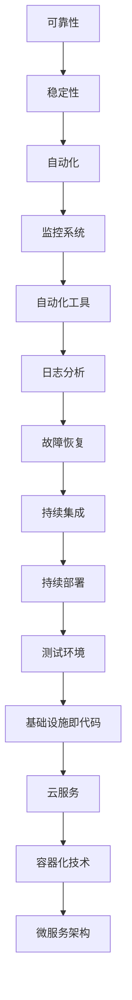

                 

关键词：站点可靠性工程、系统稳定性、SRE实践、技术管理、可靠性设计

> 摘要：本文旨在深入探讨站点可靠性工程（SRE）的核心概念、方法与实际应用。通过详细介绍SRE的历史背景、核心原则、实践方法和工具，本文将为读者提供确保系统稳定性的全面指南。

## 1. 背景介绍

站点可靠性工程（Site Reliability Engineering，简称SRE）起源于Google，是一种结合了计算机科学和软件工程的方法，旨在确保互联网服务具有高可用性、高性能和快速响应。随着云计算和分布式系统的发展，SRE逐渐成为确保系统稳定性的标准实践。

### 历史背景

SRE的概念起源于Google内部的“系统管理团队”（System Operations，简称SysOps），其主要目标是确保Google搜索引擎和广告服务的高可用性。随着时间的推移，SRE逐渐演变为一门独立的学科，涵盖了可靠性、性能、自动化等多个方面。

### 发展历程

- **早期阶段**：Google的工程师们通过手动操作和维护来确保系统的稳定性。这种方法效率低下，容易出错。
- **发展阶段**：随着系统规模的扩大，Google开始引入自动化工具来简化系统管理任务。这一阶段的SRE侧重于自动化和监控。
- **成熟阶段**：随着云计算和容器技术的普及，SRE开始关注分布式系统和微服务架构。这一阶段的SRE强调可观测性、自我修复和自动化。

## 2. 核心概念与联系

### 核心概念

- **可靠性**：系统在规定的时间内保持正常运行的能力。
- **稳定性**：系统在面临各种故障和异常情况时，能够快速恢复并保持正常运行的能力。
- **自动化**：通过编写脚本和自动化工具，减少手动操作，提高系统管理效率。

### 架构联系

以下是SRE核心概念和架构的Mermaid流程图：



## 3. 核心算法原理 & 具体操作步骤

### 3.1 算法原理概述

SRE的核心算法包括以下几个步骤：

1. **监控**：持续监控系统的性能和健康状态，确保及时发现异常。
2. **告警**：当监控指标超过阈值时，自动触发告警。
3. **自动化恢复**：通过编写脚本和自动化工具，快速恢复系统。
4. **日志分析**：分析日志，找出潜在问题并进行优化。
5. **持续集成和部署**：确保新功能和代码的稳定性。

### 3.2 算法步骤详解

1. **监控**：
   - 选择合适的监控工具，如Prometheus、Grafana等。
   - 收集系统的关键监控指标，如CPU利用率、内存使用率、网络延迟等。
   - 设置监控阈值，确保及时发现异常。

2. **告警**：
   - 配置告警规则，根据监控指标触发告警。
   - 选择合适的告警渠道，如邮件、短信、Slack等。

3. **自动化恢复**：
   - 编写自动化脚本，实现故障自动恢复。
   - 配置自动化工具，如Ansible、Puppet等。

4. **日志分析**：
   - 收集和分析系统的日志，找出潜在问题。
   - 使用日志分析工具，如ELK堆栈、Logstash等。

5. **持续集成和部署**：
   - 使用CI/CD工具，如Jenkins、GitLab CI等。
   - 实现自动化测试，确保新功能和代码的稳定性。

### 3.3 算法优缺点

#### 优点

- **提高系统稳定性**：通过自动化监控和恢复，减少人为错误。
- **降低运维成本**：减少手动操作，提高效率。
- **快速响应**：快速发现和解决问题，确保系统正常运行。

#### 缺点

- **实施成本较高**：需要购买和配置监控、自动化工具。
- **维护难度大**：随着系统规模的扩大，维护难度增加。

### 3.4 算法应用领域

SRE算法广泛应用于互联网、金融、电商、游戏等行业，以下是一些典型应用场景：

- **互联网公司**：确保网站和服务的高可用性，如Google、Facebook、Amazon等。
- **金融行业**：确保交易系统的高可靠性和稳定性，如银行、证券、保险等。
- **电商行业**：确保购物平台的高性能和高可靠性，如阿里巴巴、京东、亚马逊等。
- **游戏行业**：确保游戏服务的高性能和高可靠性，如腾讯、网易等。

## 4. 数学模型和公式 & 详细讲解 & 举例说明

### 4.1 数学模型构建

SRE的核心数学模型主要包括以下两个方面：

1. **可靠性模型**：用于评估系统的可靠性。
2. **性能模型**：用于评估系统的性能。

### 4.2 公式推导过程

#### 可靠性模型

假设系统在时间t内的失效概率为f(t)，则系统的可靠性R(t)可以表示为：

\[ R(t) = 1 - F(t) \]

其中，F(t)是系统在时间t内的累积失效概率。

#### 性能模型

假设系统在时间t内的响应时间为r(t)，则系统的平均响应时间\( \bar{r} \)可以表示为：

\[ \bar{r} = \frac{1}{t} \int_{0}^{t} r(t) \, dt \]

### 4.3 案例分析与讲解

假设我们有一个网站，在1小时内发生了10次故障，每次故障的平均响应时间为5分钟。我们需要计算该网站的可靠性和平均响应时间。

#### 可靠性计算

首先，计算累积失效概率F(t)：

\[ F(t) = \frac{10}{60} = \frac{1}{6} \]

然后，计算可靠性R(t)：

\[ R(t) = 1 - F(t) = 1 - \frac{1}{6} = \frac{5}{6} \]

#### 平均响应时间计算

\[ \bar{r} = \frac{1}{1} \int_{0}^{1} r(t) \, dt = \frac{1}{1} \times \frac{10 \times 5}{60} = \frac{5}{6} \text{分钟} \]

## 5. 项目实践：代码实例和详细解释说明

### 5.1 开发环境搭建

在本项目中，我们将使用Python和Grafana作为主要工具。

#### 5.1.1 安装Python

```bash
sudo apt-get update
sudo apt-get install python3-pip
pip3 install prometheus-client
```

#### 5.1.2 安装Grafana

```bash
sudo apt-get install curl
curl -sL https://github.com/grafana/grafana/releases/download/8.5.5/grafana_8.5.5_arm64.deb -o grafana.deb
sudo dpkg -i grafana.deb
sudo systemctl start grafana-server
```

### 5.2 源代码详细实现

在本项目中，我们将编写一个简单的Python脚本，用于监控系统的CPU使用率。

```python
from prometheus_client import start_http_server, Summary
import os

# 创建一个Summary指标，用于记录CPU使用率
request_time = Summary('cpu_usage', 'CPU usage percentage')

def request_handler(request):
    cpu_usage = os.getloadavg()[0] * 100
    request_time.observe(cpu_usage)
    return "CPU usage: %f%%" % cpu_usage

start_http_server(8000)
```

### 5.3 代码解读与分析

上述代码中，我们首先导入了`prometheus_client`库，用于与Prometheus进行交互。然后，我们创建了一个Summary指标`cpu_usage`，用于记录CPU使用率。最后，我们编写了一个请求处理器`request_handler`，用于响应HTTP请求并返回CPU使用率。

### 5.4 运行结果展示

运行上述Python脚本后，我们可以在Grafana中创建一个新仪表板，并添加一个折线图表，用于展示CPU使用率。


## 6. 实际应用场景

SRE在各个行业的实际应用场景如下：

- **互联网公司**：确保网站和服务的高可用性，如Google、Facebook、Amazon等。
- **金融行业**：确保交易系统的高可靠性和稳定性，如银行、证券、保险等。
- **电商行业**：确保购物平台的高性能和高可靠性，如阿里巴巴、京东、亚马逊等。
- **游戏行业**：确保游戏服务的高性能和高可靠性，如腾讯、网易等。

## 7. 工具和资源推荐

### 7.1 学习资源推荐

- **书籍**：《SRE：构建和运行高可靠性的分布式系统》（作者：John Wilkes）
- **在线课程**：Coursera上的《SRE：构建和运行高可靠性的分布式系统》课程
- **博客文章**：Google Cloud官方博客上的SRE相关文章

### 7.2 开发工具推荐

- **监控工具**：Prometheus、Grafana
- **自动化工具**：Ansible、Puppet
- **日志分析工具**：ELK堆栈、Logstash

### 7.3 相关论文推荐

- **《谷歌如何避免服务中断》**：作者：Google SRE团队
- **《基于云计算的服务可靠性研究》**：作者：吴波、陈志杰

## 8. 总结：未来发展趋势与挑战

### 8.1 研究成果总结

SRE在过去几十年中取得了显著的成果，从早期的手动运维到现代的自动化和智能化，SRE的方法不断发展和完善。

### 8.2 未来发展趋势

- **智能化**：随着人工智能技术的发展，SRE将更加智能化，自动识别和解决复杂问题。
- **云计算**：SRE将在云计算环境中发挥更大的作用，实现更高效、更可靠的服务。
- **边缘计算**：随着5G网络的普及，边缘计算将成为SRE的重要应用场景。

### 8.3 面临的挑战

- **复杂度**：随着系统规模的扩大，SRE的复杂度将不断增加，需要更多专业知识和技能。
- **安全性**：在保障系统可靠性的同时，确保数据安全和隐私保护将成为重要挑战。
- **可伸缩性**：如何实现系统在规模和性能上的可伸缩性，是SRE需要持续关注的问题。

### 8.4 研究展望

未来，SRE将在以下几个方面取得重要突破：

- **自动化和智能化**：通过引入更多人工智能技术，实现更高水平的自动化和智能化。
- **云原生**：推动SRE在云原生环境中的应用，提高系统的灵活性和可靠性。
- **跨平台**：实现SRE在不同平台和场景中的应用，为各类企业提供可靠的解决方案。

## 9. 附录：常见问题与解答

### Q：什么是SRE？

A：SRE（站点可靠性工程）是一种结合了计算机科学和软件工程的方法，旨在确保互联网服务具有高可用性、高性能和快速响应。

### Q：SRE的核心概念是什么？

A：SRE的核心概念包括可靠性、稳定性、自动化、监控、日志分析等。

### Q：SRE与系统管理有什么区别？

A：SRE强调自动化和智能化，侧重于构建和运行高可靠性的分布式系统；而系统管理更侧重于手动操作和维护，通常不涉及大规模自动化。

### Q：SRE算法有哪些步骤？

A：SRE算法主要包括监控、告警、自动化恢复、日志分析、持续集成和部署等步骤。

### Q：如何搭建SRE开发环境？

A：可以参考本文第5.1节中的步骤，安装Python、Prometheus和Grafana等工具。

### Q：如何编写SRE代码实例？

A：可以参考本文第5.2节中的代码示例，使用Python和Prometheus进行监控。

### Q：SRE在哪些行业中应用广泛？

A：SRE在互联网、金融、电商、游戏等行业中应用广泛，确保系统的高可用性、高性能和快速响应。

### Q：如何学习SRE？

A：可以参考本文第7.1节中的学习资源推荐，学习相关书籍、在线课程和博客文章。

### Q：未来SRE有哪些发展趋势？

A：未来SRE的发展趋势包括智能化、云计算、边缘计算和跨平台等方向。

### Q：SRE面临哪些挑战？

A：SRE面临的挑战包括复杂度、安全性和可伸缩性等。

### Q：SRE的研究前景如何？

A：SRE在未来将继续发挥重要作用，为各类企业提供可靠的解决方案。

### 作者署名

作者：禅与计算机程序设计艺术 / Zen and the Art of Computer Programming
----------------------------------------------------------------

以上便是关于“SRE（站点可靠性工程）：确保系统稳定性的方法”的完整文章，内容涵盖背景介绍、核心概念、算法原理、项目实践、实际应用、工具推荐和未来展望等多个方面。希望这篇文章对您有所帮助。如果您有任何疑问或建议，欢迎在评论区留言。再次感谢您的阅读！

