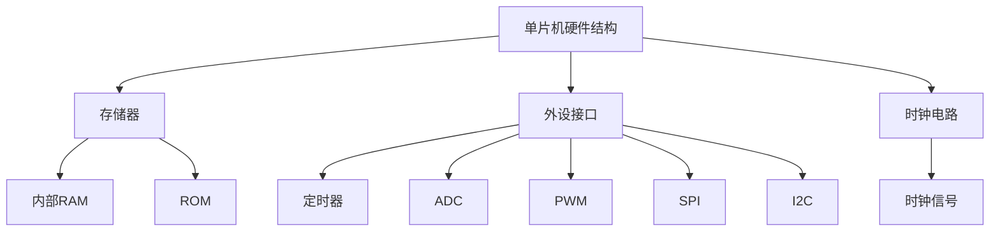

                 

关键词：STM32单片机、嵌入式系统、LED控制、单片机编程、电路设计、硬件编程、控制系统、开发工具、项目实践

> 摘要：本文旨在介绍STM32单片机的开发过程，从基础的单片机点亮LED到实现复杂的控制系统，详细阐述了STM32单片机的硬件结构、编程方法、开发工具以及实际应用场景。通过对STM32单片机开发的深入探讨，帮助读者掌握从零开始的开发技能，为未来的项目实践奠定坚实基础。

## 1. 背景介绍

### 1.1 单片机的发展历史

单片机（Microcontroller Unit，MCU）作为嵌入式系统的核心组件，其发展历程可以追溯到20世纪60年代末。最早的单片机主要用于简单的电子设备，如电子表、玩具等。随着集成电路技术的不断发展，单片机的性能逐渐提高，应用领域也越来越广泛。

### 1.2 STM32单片机的优势

STM32单片机是意法半导体公司推出的一款高性能、低成本的单片机系列，具有以下优势：

- **高性能**：STM32单片机采用ARM Cortex-M处理器核心，性能强劲，能够满足各种复杂应用的需求。
- **低功耗**：STM32单片机具有低功耗特性，适合于电池供电的便携式设备。
- **丰富的外设资源**：STM32单片机集成了多种外设，如定时器、ADC、PWM、SPI、I2C等，便于实现复杂的控制系统。
- **开源生态系统**：STM32单片机拥有强大的开源生态系统，包括丰富的开发工具、库函数和社区支持。

### 1.3 嵌入式系统的应用场景

嵌入式系统广泛应用于各种领域，如智能家居、物联网、工业自动化、医疗设备等。随着技术的不断进步，嵌入式系统的应用场景越来越广泛，对单片机的性能和功能要求也越来越高。

## 2. 核心概念与联系

为了更好地理解STM32单片机的开发过程，我们首先需要了解一些核心概念和联系。

### 2.1 单片机的硬件结构

单片机的硬件结构主要包括以下几个部分：

- **CPU**：中央处理器，负责执行指令和运算。
- **存储器**：包括内部RAM和ROM，用于存储程序和数据。
- **外设接口**：如定时器、ADC、PWM、SPI、I2C等，用于与外部设备进行通信。
- **时钟电路**：为单片机提供稳定的时钟信号。

### 2.2 单片机的编程方法

单片机的编程方法主要包括以下几个方面：

- **汇编语言**：直接操作单片机的硬件资源，性能高但可读性差。
- **C语言**：面向过程的高级编程语言，易于理解和维护。
- **库函数**：封装了单片机外设的底层操作，方便开发者使用。

### 2.3 单片机的开发工具

单片机的开发工具主要包括以下几种：

- **集成开发环境（IDE）**：如Keil、IAR、STM32CubeIDE等，提供代码编辑、编译、调试等功能。
- **仿真器**：用于模拟单片机的工作过程，帮助开发者调试程序。
- **硬件调试器**：如JTAG、SWD等，用于直接调试单片机。

### 2.4 单片机的应用领域

单片机的应用领域非常广泛，主要包括以下几个方面：

- **消费电子**：如智能手表、智能家居等。
- **工业控制**：如生产线自动化、机器人控制等。
- **医疗设备**：如医疗监护仪、便携式心电图仪等。
- **汽车电子**：如车载音响、导航系统等。

### 2.5 Mermaid 流程图

以下是一个简单的 Mermaid 流程图，展示了单片机的核心概念和联系：



## 3. 核心算法原理 & 具体操作步骤

### 3.1 算法原理概述

在STM32单片机开发中，核心算法主要涉及以下几个方面：

- **定时控制**：通过定时器实现精确的时间控制，如LED闪烁、电机控制等。
- **中断处理**：通过中断机制实现实时响应外部事件，如按键、传感器信号等。
- **通信协议**：实现单片机与其他设备之间的数据传输，如UART、SPI、I2C等。

### 3.2 算法步骤详解

以下是实现一个简单的STM32单片机点亮LED灯的核心算法步骤：

#### 3.2.1 初始化硬件资源

1. 初始化LED灯连接的GPIO端口为输出模式。
2. 初始化定时器，设置定时周期。

```c
// 初始化LED灯连接的GPIO端口
GPIO_InitTypeDef GPIO_InitStruct = {0};
__HAL_RCC_GPIOA_CLK_ENABLE();
GPIO_InitStruct.Pin = GPIO_PIN_5;
GPIO_InitStruct.Mode = GPIO_MODE_OUTPUT_PP;
GPIO_InitStruct.Pull = GPIO_NOPULL;
GPIO_InitStruct.Speed = GPIO_SPEED_FREQ_LOW;
HAL_GPIO_Init(GPIOA, &GPIO_InitStruct);

// 初始化定时器
TIM_HandleTypeDef htim2;
__HAL_RCC_TIM2_CLK_ENABLE();
htim2.Instance = TIM2;
htim2.Init.Prescaler = 8000 - 1;
htim2.Init.CounterMode = TIM_COUNTERMODE_UP;
htim2.Init.Period = 1000 - 1;
htim2.Init.ClockDivision = TIM_CLOCKDIVISION_DIV1;
htim2.Init.RepetitionCounter = 0;
HAL_TIM_Base_Init(&htim2);
```

#### 3.2.2 定时器中断处理

1. 在定时器中断处理函数中，控制LED灯的开关状态。

```c
void HAL_TIM_PeriodElapsedCallback(TIM_HandleTypeDef *htim)
{
    if (htim->Instance == TIM2)
    {
        // 控制LED灯的开关状态
        HAL_GPIO_TogglePin(GPIOA, GPIO_PIN_5);
    }
}
```

#### 3.2.3 主循环

1. 在主循环中，启动定时器并等待中断处理。

```c
int main(void)
{
    // 初始化硬件资源
    HAL_Init();

    // 配置定时器中断
    HAL_TIM_Base_Start_IT(&htim2);

    // 主循环
    while (1)
    {
        // 等待中断处理
    }
}
```

### 3.3 算法优缺点

#### 优点：

- **实时性**：通过定时器和中断机制，实现实时控制。
- **简洁性**：简化了编程流程，易于理解和维护。

#### 缺点：

- **复杂性**：涉及中断处理和硬件资源初始化，对开发者要求较高。
- **稳定性**：中断处理可能会受到其他任务的影响，导致程序不稳定。

### 3.4 算法应用领域

- **消费电子**：如智能手表、智能手环等。
- **工业控制**：如电机控制、生产线自动化等。
- **智能家居**：如智能灯泡、智能插座等。

## 4. 数学模型和公式

在STM32单片机开发过程中，涉及到一些基本的数学模型和公式，以下简要介绍：

### 4.1 数学模型构建

#### 定时器周期计算

定时器周期 \( T \) 与定时器计数寄存器值 \( C \) 和时钟频率 \( F \) 之间的关系为：

$$ T = \frac{C \times F}{\text{定时器分频系数}} $$

其中，定时器分频系数一般为 1，即不分频。

#### 中断频率计算

中断频率 \( f \) 与定时器周期 \( T \) 之间的关系为：

$$ f = \frac{1}{T} $$

### 4.2 公式推导过程

#### 定时器周期计算

定时器周期 \( T \) 的计算公式为：

$$ T = \frac{C \times F}{\text{定时器分频系数}} $$

其中：

- \( C \) 为定时器计数寄存器值。
- \( F \) 为时钟频率。
- 定时器分频系数一般为 1，即不分频。

#### 中断频率计算

中断频率 \( f \) 的计算公式为：

$$ f = \frac{1}{T} $$

其中：

- \( T \) 为定时器周期。

### 4.3 案例分析与讲解

#### 案例一：定时器周期计算

假设定时器时钟频率为 8MHz，定时器计数寄存器值为 1000，定时器分频系数为 1。计算定时器周期 \( T \)：

$$ T = \frac{1000 \times 8MHz}{1} = 8ms $$

#### 案例二：中断频率计算

根据定时器周期 \( T \) 为 8ms，计算中断频率 \( f \)：

$$ f = \frac{1}{T} = \frac{1}{8ms} = 125Hz $$

## 5. 项目实践：代码实例和详细解释说明

### 5.1 开发环境搭建

为了更好地进行STM32单片机开发，我们需要搭建一个合适的开发环境。以下是一个简单的开发环境搭建步骤：

1. 安装STM32CubeIDE：从官方网站下载并安装STM32CubeIDE。
2. 安装STM32CubeMX：STM32CubeMX是一个用于配置STM32单片机外设的图形化工具。
3. 配置开发板：选择一款支持STM32单片机的开发板，如STM32F103C8T6。
4. 连接开发板：将开发板连接到电脑，确保开发板上的电源指示灯亮。

### 5.2 源代码详细实现

以下是一个简单的STM32单片机点亮LED灯的源代码实例：

```c
#include "stm32f1xx_hal.h"

void SystemClock_Config(void);
static void MX_GPIO_Init(void);

int main(void)
{
    HAL_Init();
    SystemClock_Config();
    MX_GPIO_Init();

    while (1)
    {
        // 点亮LED灯
        HAL_GPIO_WritePin(GPIOA, GPIO_PIN_5, GPIO_PIN_SET);

        // 等待一段时间
        HAL_Delay(1000);

        // 关闭LED灯
        HAL_GPIO_WritePin(GPIOA, GPIO_PIN_5, GPIO_PIN_RESET);

        // 等待一段时间
        HAL_Delay(1000);
    }
}

void SystemClock_Config(void)
{
    RCC_OscInitTypeDef RCC_OscInitStruct = {0};
    RCC_ClkInitTypeDef RCC_ClkInitStruct = {0};

    RCC_OscInitStruct.OscillatorType = RCC_OSCILLATORTYPE_HSI;
    RCC_OscInitStruct.HSIState = RCC_HSI_ON;
    RCC_OscInitStruct.HSICalibrationValue = RCC_HSICALIBRATION_DEFAULT;
    RCC_OscInitStruct.PLL.PLLState = RCC_PLL_ON;
    RCC_OscInitStruct.PLL.PLLSource = RCC_PLLSOURCE_HSI;
    RCC_OscInitStruct.PLL.PLLMUL = RCC_PLL_MUL9;
    if (HAL_RCC_OscConfig(&RCC_OscInitStruct) != HAL_OK)
    {
        Error_Handler();
    }

    RCC_ClkInitStruct.ClockType = RCC_CLOCKTYPE_HCLK | RCC_CLOCKTYPE_SYSCLK | RCC_CLOCKTYPE_PCLK1 | RCC_CLOCKTYPE_PCLK2;
    RCC_ClkInitStruct.SYSCLKSource = RCC_SYSCLKSOURCE_PLLCLK;
    RCC_ClkInitStruct.AHBCLKDivider = RCC_HCLK_DIV1;
    RCC_ClkInitStruct.APB1CLKDivider = RCC_APB1CLK_DIV2;
    RCC_ClkInitStruct.APB2CLKDivider = RCC_APB2CLK_DIV1;
    if (HAL_RCC_ClockConfig(&RCC_ClkInitStruct, FLASH_LATENCY_1) != HAL_OK)
    {
        Error_Handler();
    }
}

static void MX_GPIO_Init(void)
{
    GPIO_InitTypeDef GPIO_InitStruct = {0};

    __HAL_RCC_GPIOA_CLK_ENABLE();

    GPIO_InitStruct.Pin = GPIO_PIN_5;
    GPIO_InitStruct.Mode = GPIO_MODE_OUTPUT_PP;
    GPIO_InitStruct.Pull = GPIO_NOPULL;
    GPIO_InitStruct.Speed = GPIO_SPEED_FREQ_LOW;
    HAL_GPIO_Init(GPIOA, &GPIO_InitStruct);
}

void Error_Handler(void)
{
    // 处理错误
}
```

### 5.3 代码解读与分析

1. **系统初始化**：首先调用`HAL_Init()`函数进行系统初始化，包括时钟、中断、外设等。
2. **时钟配置**：通过`SystemClock_Config()`函数配置系统时钟，包括主时钟、时钟分频等。
3. **GPIO初始化**：通过`MX_GPIO_Init()`函数初始化LED灯连接的GPIO端口，配置为输出模式。
4. **主循环**：在主循环中，通过`HAL_GPIO_WritePin()`函数控制LED灯的开关状态，实现LED灯的闪烁效果。

### 5.4 运行结果展示

将源代码烧写到STM32单片机中，运行程序后，开发板上的LED灯将实现闪烁效果。

## 6. 实际应用场景

### 6.1 消费电子

在消费电子领域，STM32单片机广泛应用于智能手表、智能手环等设备中。例如，智能手表需要实时监测用户的心率、运动数据等，STM32单片机可以高效地完成这些任务，并通过蓝牙等无线通信技术与其他设备进行数据传输。

### 6.2 工业控制

在工业控制领域，STM32单片机可以用于电机控制、生产线自动化等。例如，在一个电机控制系统中，STM32单片机可以通过控制PWM信号调节电机的速度，同时监测电机的运行状态，确保系统的稳定运行。

### 6.3 智能家居

在智能家居领域，STM32单片机可以用于智能灯泡、智能插座等设备中。例如，智能灯泡可以通过STM32单片机实现调光、色温调节等功能，同时支持手机APP控制，实现远程控制。

### 6.4 未来应用展望

随着技术的不断进步，STM32单片机的应用领域将继续扩大。未来，STM32单片机有望在自动驾驶、智能家居、医疗设备等更多领域发挥重要作用，为人们的生活带来更多便利。

## 7. 工具和资源推荐

### 7.1 学习资源推荐

1. **《STM32CubeMX用户手册》**：提供STM32CubeMX的详细使用方法和教程。
2. **《STM32参考手册》**：涵盖STM32单片机的所有外设功能、寄存器定义等。
3. **STM32官方社区**：提供丰富的开发教程、问答、资源下载等。

### 7.2 开发工具推荐

1. **STM32CubeIDE**：一款集成的开发环境，包括代码编辑、编译、调试等功能。
2. **Keil**：一款流行的嵌入式开发工具，支持STM32单片机。
3. **IAR**：一款高性能的嵌入式开发工具，支持多种单片机架构。

### 7.3 相关论文推荐

1. **《基于STM32的智能家居系统设计》**：介绍如何使用STM32单片机实现智能家居系统。
2. **《STM32单片机在工业控制中的应用》**：探讨STM32单片机在工业控制领域的应用。
3. **《STM32单片机的开发与优化》**：介绍STM32单片机开发的优化技巧。

## 8. 总结：未来发展趋势与挑战

### 8.1 研究成果总结

本文介绍了STM32单片机的开发过程，包括硬件结构、编程方法、开发工具、实际应用场景等。通过对STM32单片机的深入探讨，为读者提供了从零开始的开发技能，为未来的项目实践奠定了坚实基础。

### 8.2 未来发展趋势

随着物联网、智能制造等技术的发展，STM32单片机的应用领域将进一步扩大。未来，STM32单片机将在更多领域发挥重要作用，如智能家居、智能交通、医疗设备等。

### 8.3 面临的挑战

1. **性能提升**：随着应用场景的不断变化，对STM32单片机性能的要求越来越高，如何提升单片机的性能成为一大挑战。
2. **功耗优化**：在便携式设备中，功耗成为制约单片机应用的关键因素，如何优化功耗成为开发人员的重要任务。
3. **安全性**：随着物联网的普及，单片机的安全性成为亟待解决的问题，如何确保单片机的安全性将成为未来发展的重要方向。

### 8.4 研究展望

未来，STM32单片机将在更多领域发挥重要作用，为实现智能化的生活和工作提供有力支持。同时，随着技术的不断发展，STM32单片机也将不断优化和完善，为开发者提供更好的开发体验。

## 9. 附录：常见问题与解答

### 9.1 如何选择合适的STM32单片机？

1. 根据应用场景确定性能需求，如处理速度、存储容量等。
2. 考虑功耗需求，选择低功耗单片机。
3. 根据外设需求选择具有所需外设的单片机。

### 9.2 如何解决STM32单片机编程中的问题？

1. 查阅相关文档和资料，如STM32参考手册、官方社区等。
2. 参考现有项目代码，借鉴成熟的应用方案。
3. 在遇到问题时，可以通过调试工具进行定位和解决。

### 9.3 如何优化STM32单片机的性能？

1. 合理规划代码，减少不必要的数据传输和处理。
2. 使用高效算法和数据结构，提高代码执行效率。
3. 优化硬件资源的使用，如合理配置外设、优化时钟配置等。

----------------------------------------------------------------

作者：禅与计算机程序设计艺术 / Zen and the Art of Computer Programming


