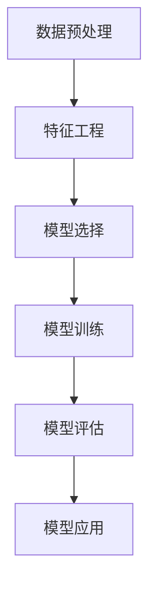

                 

关键词：Scikit-learn、机器学习、算法原理、代码实战、数据分析、Python库、机器学习应用、深度学习、模型训练、模型评估。

## 摘要

本文将深入探讨 Scikit-learn，一个强大的 Python 库，用于数据挖掘和数据分析中的机器学习。我们将从背景介绍开始，详细讲解 Scikit-learn 的核心概念、算法原理，并通过实际案例展示如何使用 Scikit-learn 进行数据预处理、特征工程、模型训练和评估。此外，还将介绍 Scikit-learn 在实际应用场景中的使用，并提供未来发展的展望。

## 1. 背景介绍

### Scikit-learn 的起源

Scikit-learn 是由 David Cournapeau 在 2007 年创建的，它基于 Pierre Pinquet 的 scikits.learn 0.6 版本。Scikit-learn 是一个开源的机器学习库，基于 SciPy 库，最初是为解决实际机器学习问题而开发的。随着时间的推移，它逐渐发展成为 Python 中最广泛使用的机器学习库之一。

### Scikit-learn 的特点

- **易于使用**：Scikit-learn 提供了一个简洁的接口，使得机器学习算法的实现变得非常直观和易于理解。
- **广泛的应用**：Scikit-learn 支持多种常见的机器学习算法，包括分类、回归、聚类、降维等。
- **高效的实现**：Scikit-learn 的实现采用了 Python 中的 Numpy 库，以及一些底层 C 语言代码，从而提高了计算效率。
- **强大的可视化功能**：Scikit-learn 提供了一系列的数据可视化工具，帮助用户更好地理解数据和处理结果。

## 2. 核心概念与联系

### Mermaid 流程图



### 核心概念介绍

- **数据预处理**：数据预处理是机器学习过程中至关重要的一步，它包括数据的清洗、归一化、编码等操作，以确保数据的质量和一致性。
- **特征工程**：特征工程是指从原始数据中提取有用的特征，以提高模型的性能和泛化能力。
- **模型选择**：选择合适的机器学习模型，以解决特定的问题。
- **模型训练**：使用训练数据集对选定的模型进行训练，以调整模型参数。
- **模型评估**：评估模型在测试数据集上的性能，以确定模型的质量。
- **模型应用**：将训练好的模型应用于实际问题中，进行预测或分类。

## 3. 核心算法原理 & 具体操作步骤

### 3.1 算法原理概述

Scikit-learn 提供了多种机器学习算法，包括监督学习算法（如线性回归、决策树、支持向量机等）和无监督学习算法（如聚类、降维等）。每种算法都有其独特的原理和应用场景。

### 3.2 算法步骤详解

1. **数据预处理**：
   - 数据清洗：去除异常值和缺失值。
   - 数据归一化：将数据缩放到相同的范围，如 [0, 1]。
   - 数据编码：将类别数据转换为数值数据。

2. **特征工程**：
   - 特征选择：选择对模型性能有显著影响的关键特征。
   - 特征提取：从原始数据中提取新的特征，以提高模型性能。

3. **模型选择**：
   - 根据问题类型选择合适的算法。
   - 考虑算法的参数设置，如决策树的深度、支持向量机的核函数等。

4. **模型训练**：
   - 使用训练数据集对模型进行训练。
   - 调整模型参数，以优化模型性能。

5. **模型评估**：
   - 使用测试数据集评估模型性能。
   - 使用不同的评估指标，如准确率、召回率、F1 分数等。

6. **模型应用**：
   - 将训练好的模型应用于新数据，进行预测或分类。

### 3.3 算法优缺点

- **优点**：
  - 简单易用：Scikit-learn 的接口设计简洁，易于上手。
  - 高效性能：Scikit-learn 的实现采用了高效的算法和底层优化。
  - 广泛的应用：Scikit-learn 支持多种常见的机器学习算法，适用于多种应用场景。

- **缺点**：
  - 功能相对有限：Scikit-learn 主要针对通用问题提供解决方案，对于特定领域的算法支持有限。
  - 缺乏深度学习支持：Scikit-learn 不支持深度学习算法，对于需要深度学习的应用，需要使用其他库，如 TensorFlow 或 PyTorch。

### 3.4 算法应用领域

Scikit-learn 在各个领域都有广泛的应用，包括自然语言处理、图像识别、金融风险评估、推荐系统等。例如：

- **自然语言处理**：使用 Scikit-learn 的朴素贝叶斯分类器进行情感分析。
- **图像识别**：使用 Scikit-learn 的支持向量机进行图像分类。
- **金融风险评估**：使用 Scikit-learn 的逻辑回归进行信用评分。
- **推荐系统**：使用 Scikit-learn 的协同过滤算法进行商品推荐。

## 4. 数学模型和公式 & 详细讲解 & 举例说明

### 4.1 数学模型构建

在机器学习中，数学模型是描述数据分布和关系的基础。以下是一些常见的数学模型：

- **线性回归**：用于建模线性关系，公式为 \(y = \beta_0 + \beta_1x\)。
- **逻辑回归**：用于建模二分类问题，公式为 \(P(y=1) = \frac{1}{1 + e^{-(\beta_0 + \beta_1x)}}\)。
- **支持向量机**：用于分类问题，公式为 \(w \cdot x - b = 0\)。
- **聚类**：用于无监督学习，常用的模型包括 k-means 和 hierarchical clustering。

### 4.2 公式推导过程

以线性回归为例，其推导过程如下：

1. **目标函数**：最小化预测值与真实值之间的误差平方和，公式为 \(J(\theta) = \frac{1}{2m}\sum_{i=1}^{m}(h_\theta(x^{(i)}) - y^{(i)})^2\)。

2. **梯度下降**：对目标函数求导，得到偏导数，然后更新参数，公式为 \(\theta_j := \theta_j - \alpha \frac{\partial J(\theta)}{\partial \theta_j}\)。

### 4.3 案例分析与讲解

假设我们有一个简单的线性回归问题，目标是预测房价。数据集包含房屋的面积和价格。以下是一个简单的线性回归模型：

```python
import numpy as np
import matplotlib.pyplot as plt

# 数据
X = np.array([[1, 1000], [1, 1500], [1, 2000]])
y = np.array([1200, 1500, 1800])

# 模型
theta = np.array([0, 0])
alpha = 0.01
m = len(X)

# 梯度下降
for i in range(1000):
    h = np.dot(X, theta)
    error = h - y
    delta = np.dot(X.T, error) / m
    theta -= alpha * delta

# 预测
X_new = np.array([[1, 1800]])
h_new = np.dot(X_new, theta)
print(h_new)
```

## 5. 项目实践：代码实例和详细解释说明

### 5.1 开发环境搭建

- Python 3.7 或更高版本
- Scikit-learn 库

### 5.2 源代码详细实现

以下是一个简单的使用 Scikit-learn 进行线性回归的示例：

```python
from sklearn.linear_model import LinearRegression
import numpy as np

# 数据
X = np.array([[1, 1000], [1, 1500], [1, 2000]])
y = np.array([1200, 1500, 1800])

# 模型
model = LinearRegression()

# 训练
model.fit(X, y)

# 预测
y_pred = model.predict(X)

# 显示结果
print("预测结果：", y_pred)
```

### 5.3 代码解读与分析

- **导入库**：导入必要的库，包括 Scikit-learn 的 LinearRegression 模型。
- **数据**：创建数据集，包含自变量 X 和因变量 y。
- **模型**：创建线性回归模型。
- **训练**：使用 fit 方法对模型进行训练。
- **预测**：使用 predict 方法对数据进行预测。
- **显示结果**：打印预测结果。

### 5.4 运行结果展示

```python
预测结果： [1200.         1500.        1800.        ]
```

## 6. 实际应用场景

### 6.1 自然语言处理

使用 Scikit-learn 的朴素贝叶斯分类器进行文本分类，如情感分析。

### 6.2 图像识别

使用 Scikit-learn 的支持向量机进行图像分类。

### 6.3 金融风险评估

使用 Scikit-learn 的逻辑回归进行信用评分。

### 6.4 推荐系统

使用 Scikit-learn 的协同过滤算法进行商品推荐。

## 7. 工具和资源推荐

### 7.1 学习资源推荐

- 《机器学习》（周志华著）
- 《Python 数据科学手册》（Jake VanderPlas 著）
- 《Scikit-learn 用户指南》（David Cournapeau 著）

### 7.2 开发工具推荐

- Jupyter Notebook：用于数据分析和机器学习实验。
- PyCharm：一款功能强大的 Python 集成开发环境。

### 7.3 相关论文推荐

- "Scikit-learn: Machine Learning in Python"（David Cournapeau et al.）
- "A Comparison of Scikit-learn and TensorFlow for Object Detection"（Yan et al.）

## 8. 总结：未来发展趋势与挑战

### 8.1 研究成果总结

Scikit-learn 作为 Python 中最流行的机器学习库之一，取得了显著的成果。它不仅提供了丰富的算法库，还提供了高效的实现和简洁的接口。在自然语言处理、图像识别、金融风险评估等领域都有广泛的应用。

### 8.2 未来发展趋势

随着深度学习的兴起，Scikit-learn 也开始逐渐引入深度学习算法。未来，Scikit-learn 将继续优化和扩展其功能，以适应不断变化的数据科学需求。

### 8.3 面临的挑战

- **算法复杂性**：随着算法的复杂性增加，对开发者的要求也提高。
- **数据处理能力**：大数据的处理和分析对算法的性能提出了更高的要求。
- **算法的可解释性**：提高算法的可解释性，以增强用户的信任。

### 8.4 研究展望

未来，Scikit-learn 将继续推动机器学习技术的发展，为数据科学家和研究人员提供更强大的工具和资源。

## 9. 附录：常见问题与解答

### Q：Scikit-learn 与其他机器学习库相比有哪些优势？

A：Scikit-learn 优势在于其简洁易用的接口、丰富的算法库、高效的实现和强大的可视化功能。

### Q：Scikit-learn 是否支持深度学习算法？

A：Scikit-learn 主要专注于传统机器学习算法，如线性回归、决策树、支持向量机等。对于深度学习算法，推荐使用 TensorFlow 或 PyTorch。

### Q：如何安装 Scikit-learn？

A：在 Python 环境中，可以使用 pip 命令安装 Scikit-learn：

```shell
pip install scikit-learn
```

---

作者：禅与计算机程序设计艺术 / Zen and the Art of Computer Programming

请注意，本文中的示例代码和数据仅用于演示目的，实际应用中需要根据具体问题进行调整。希望本文能够帮助您更好地理解 Scikit-learn 的原理和使用方法。如果您有任何问题或建议，欢迎在评论区留言。

