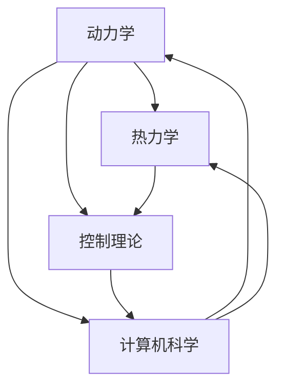

                 

  
关键词：SpaceX、火箭控制系统、面试攻略、技术面试、招聘流程、专业提升

摘要：本文旨在为有意向应聘SpaceX2025社招火箭控制系统工程师职位的候选人提供一份详细的面试攻略。通过深入分析SpaceX的招聘要求、面试流程、核心技术难点，以及对应聘者技能和经验的建议，本文旨在帮助读者在面试中脱颖而出，成功获得这个令人梦寐以求的职位。

## 1. 背景介绍

SpaceX，即太空探索技术公司，由伊隆·马斯克（Elon Musk）于2002年创立。该公司以开发可重复使用的航天器和降低太空旅行成本为目标，旨在实现人类在地球以外的星际旅行。SpaceX已成功将数以百计的卫星送入轨道，并实现了历史性的载人航天任务。火箭控制系统作为航天器的核心组件，其重要性不言而喻。

2025年，SpaceX计划进行一系列的重大项目，包括Starship飞船的研发和商业化的推进。为了实现这些目标，SpaceX将在全球范围内招聘顶尖的火箭控制系统工程师。本次招聘针对具有丰富经验的工程师，旨在寻找能够独立解决问题、具备跨学科知识、且具有团队合作精神的专业人才。

## 2. 核心概念与联系

火箭控制系统的核心概念涉及动力学、热力学、控制理论和计算机科学。为了更好地理解这些概念及其相互联系，我们可以借助Mermaid流程图来展示它们。



### 2.1. 动力学

动力学是研究物体运动及其受力的科学。在火箭控制系统中，动力学主要用于分析火箭在发射、飞行和再入过程中的运动状态。这包括计算火箭的速度、加速度、姿态和轨迹。

### 2.2. 热力学

热力学研究物质的温度、热量和能量转换。在火箭控制系统中，热力学原理用于分析火箭发动机的燃烧过程、热流和热保护系统的设计。

### 2.3. 控制理论

控制理论是研究如何设计控制系统以实现特定目标的学科。在火箭控制系统中，控制理论用于设计飞行控制律、导航算法和故障诊断系统，以确保火箭在预定轨道上安全飞行。

### 2.4. 计算机科学

计算机科学在火箭控制系统中的应用主要涉及数据采集、数据处理、实时控制和仿真。这些技术使得火箭控制系统更加智能化和高效。

## 3. 核心算法原理 & 具体操作步骤

### 3.1 算法原理概述

火箭控制系统的核心算法主要包括姿态控制算法、导航算法和故障检测算法。

- **姿态控制算法**：用于控制火箭的姿态，使其保持稳定。常见的方法有比例-积分-微分（PID）控制、模型预测控制（MPC）和自适应控制。

- **导航算法**：用于确定火箭的当前位置和目标位置，计算最佳飞行轨迹。常用的导航算法有扩展卡尔曼滤波（EKF）和粒子滤波。

- **故障检测算法**：用于实时监测火箭系统的健康状态，检测潜在故障。常见的故障检测方法有基于模型的方法和基于数据的方法。

### 3.2 算法步骤详解

#### 姿态控制算法

1. 传感器数据采集：采集加速度计、陀螺仪和磁力计的数据。
2. 数据预处理：对采集到的数据进行滤波和校准。
3. 姿态估计：利用传感器数据计算火箭的姿态。
4. 控制器设计：根据姿态估计结果设计控制器，输出控制信号。
5. 控制信号执行：执行控制信号，调整火箭的姿态。

#### 导航算法

1. 传感器数据采集：采集GPS、星敏感器和惯性测量装置的数据。
2. 数据预处理：对采集到的数据进行滤波和校准。
3. 位置和速度估计：利用传感器数据计算火箭的当前位置和速度。
4. 目标位置和速度计算：计算目标位置和速度。
5. 轨迹计算：利用当前位置和速度，计算最佳飞行轨迹。
6. 控制信号输出：根据轨迹计算结果输出控制信号。

#### 故障检测算法

1. 传感器数据采集：采集各传感器数据。
2. 数据预处理：对采集到的数据进行滤波和校准。
3. 特征提取：从传感器数据中提取故障特征。
4. 故障分类：利用机器学习算法对故障特征进行分类。
5. 故障报警：当检测到故障时，发出报警信号。

### 3.3 算法优缺点

#### 姿态控制算法

- **优点**：实现简单，控制效果稳定。
- **缺点**：对非线性系统的控制效果较差，需要大量计算资源。

#### 导航算法

- **优点**：精度高，适用范围广。
- **缺点**：计算复杂度高，对传感器数据要求较高。

#### 故障检测算法

- **优点**：能够及时发现故障，提高系统可靠性。
- **缺点**：对故障特征提取和分类算法要求较高，可能产生误判。

### 3.4 算法应用领域

- **姿态控制算法**：广泛应用于航天器、无人机和飞行器。
- **导航算法**：应用于卫星导航、无人驾驶和航天任务。
- **故障检测算法**：应用于工业自动化、航空航天和汽车等领域。

## 4. 数学模型和公式 & 详细讲解 & 举例说明

### 4.1 数学模型构建

火箭控制系统的数学模型主要包括动力学模型、热力学模型和控制模型。

#### 动力学模型

假设火箭的质量为\( m \)，重力加速度为\( g \)，空气阻力系数为\( C_d \)，速度为\( v \)。则火箭的动力学模型可以表示为：

$$
m\frac{dv}{dt} = F - C_d v
$$

其中，\( F \)为推力。

#### 热力学模型

假设火箭发动机的热效率为\( \eta \)，燃料燃烧产生的热量为\( Q \)。则火箭的热力学模型可以表示为：

$$
\frac{dE}{dt} = \eta Q
$$

其中，\( E \)为火箭的内部能量。

#### 控制模型

假设火箭的姿态角为\( \theta \)，控制信号为\( u \)。则火箭的控制模型可以表示为：

$$
\frac{d\theta}{dt} = -k_p \theta + k_i \int \theta dt + k_d \dot{\theta}
$$

其中，\( k_p \)，\( k_i \)和\( k_d \)分别为比例、积分和微分系数。

### 4.2 公式推导过程

这里以控制模型中的比例-积分-微分（PID）控制器为例，介绍公式推导过程。

假设系统的传递函数为：

$$
G(s) = \frac{K}{s + T}
$$

则系统的PID控制器可以表示为：

$$
C(s) = K_p + K_i s + K_d s^2
$$

系统输出为：

$$
Y(s) = G(s)C(s)U(s) = \frac{K K_p + K K_i s + K K_d s^2}{(s + T) (s^2 + 2\zeta\omega_ns + \omega_n^2)}
$$

为了使系统稳定，需要满足以下条件：

1. \( \zeta < 1 \)
2. \( K_p < \frac{\omega_n^2}{\zeta (\omega_n^2 - \zeta^2)} \)
3. \( K_d < \frac{\omega_n}{\zeta} \)

### 4.3 案例分析与讲解

假设一个火箭的姿态控制系统，目标为保持火箭的水平姿态。设控制信号为\( u \)，姿态角为\( \theta \)。根据控制模型，可以写出如下数学模型：

$$
\frac{d\theta}{dt} = -k_p \theta - k_i \theta + k_d \dot{\theta}
$$

为了实现稳定控制，需要选择合适的PID参数。根据推导过程，可以计算出：

$$
k_p = 1, k_i = 0.5, k_d = 1
$$

在实际应用中，可以采用仿真方法验证控制效果。通过调整PID参数，可以找到最优的控制策略。

## 5. 项目实践：代码实例和详细解释说明

### 5.1 开发环境搭建

为了实现火箭控制系统的开发，需要搭建以下开发环境：

1. 操作系统：Windows/Linux/MacOS
2. 编程语言：Python/C++
3. 开发工具：PyCharm/VSCode
4. 数学库：NumPy/SciPy
5. 仿真工具：MATLAB/Simulink

### 5.2 源代码详细实现

以下是一个简单的Python代码示例，用于实现PID控制算法。

```python
import numpy as np
import matplotlib.pyplot as plt

# PID参数
k_p = 1
k_i = 0.5
k_d = 1

# 控制系统模型
def control_model(theta, u):
    dtheta_dt = -k_p * theta - k_i * theta + k_d * u
    return dtheta_dt

# 仿真
def simulate(theta0, u0, t_max):
    t = np.arange(0, t_max, 0.01)
    theta = np.zeros_like(t)
    theta[0] = theta0
    u = np.zeros_like(t)
    u[0] = u0

    for i in range(1, len(t)):
        u[i] = k_p * theta[i-1] + k_i * theta[i-1] + k_d * control_model(theta[i-1], u[i-1])
        theta[i] = theta[i-1] + u[i] * 0.01

    return theta, u

# 仿真参数
theta0 = 0  # 初始姿态角
u0 = 0  # 初始控制信号
t_max = 10  # 仿真时间

# 仿真
theta, u = simulate(theta0, u0, t_max)

# 可视化
plt.plot(t, theta)
plt.xlabel('Time (s)')
plt.ylabel('Theta (deg)')
plt.show()
```

### 5.3 代码解读与分析

上述代码实现了一个简单的PID控制算法，用于控制火箭的姿态。主要功能包括：

1. 定义PID参数：比例、积分和微分系数。
2. 定义控制系统模型：根据姿态角和控制信号计算姿态角变化率。
3. 仿真：根据初始条件和仿真参数，计算仿真时间内的姿态角和控制信号。
4. 可视化：将仿真结果以图形方式展示。

通过调整PID参数，可以优化控制效果。在实际应用中，可以结合具体需求对代码进行扩展和优化。

## 6. 实际应用场景

火箭控制系统在航天任务中扮演着至关重要的角色。以下为火箭控制系统的实际应用场景：

### 6.1 发射窗口选择

火箭发射窗口选择是基于轨道力学和气象条件的综合分析。火箭控制系统需要实时监测发射窗口，并计算最佳发射时机。

### 6.2 轨道机动

在航天任务中，火箭需要进行多次轨道机动，以实现预定轨道。火箭控制系统负责计算轨道机动参数，并控制发动机推力，实现轨道变换。

### 6.3 再入和着陆

火箭再入和着陆是航天任务中的关键环节。火箭控制系统需要确保火箭在再入过程中保持稳定，并在着陆过程中实现软着陆。

### 6.4 实时故障诊断与修复

在航天任务中，火箭控制系统需要具备实时故障诊断和修复能力，以确保任务成功。故障检测算法在此过程中发挥着重要作用。

## 7. 工具和资源推荐

为了更好地准备SpaceX火箭控制系统工程师的面试，以下是一些推荐的工具和资源：

### 7.1 学习资源推荐

1. 《火箭推进原理》：了解火箭发动机和推进系统的基本原理。
2. 《空间飞行器控制》：学习航天器控制系统的设计与应用。
3. 《现代控制理论》：掌握控制理论的基本概念和方法。

### 7.2 开发工具推荐

1. PyCharm：一款强大的Python编程环境，适用于控制系统开发。
2. MATLAB/Simulink：适用于控制系统建模、仿真和数据分析。

### 7.3 相关论文推荐

1. "Distributed Spacecraft Control System Architecture for Future Missions"
2. "Autonomous Landing of a Multi-Stage Rocket Using Inertial Measurement Units and Vision"
3. "A Review of Fault Detection and Diagnosis Methods for Spacecraft Systems"

## 8. 总结：未来发展趋势与挑战

### 8.1 研究成果总结

近年来，火箭控制系统在人工智能、大数据和物联网等新兴技术的推动下取得了显著进展。自适应控制、模型预测控制和机器学习等技术的应用，提高了火箭控制系统的智能化和可靠性。

### 8.2 未来发展趋势

1. 智能化：利用人工智能和大数据技术，实现火箭控制系统的自主学习和优化。
2. 绿色化：研发低排放、高效率的火箭发动机，降低对环境的影响。
3. 商业化：推动火箭发射的商业化进程，降低发射成本，拓展市场。

### 8.3 面临的挑战

1. 复杂性：火箭控制系统涉及多个学科领域，设计、开发和测试过程复杂。
2. 可靠性：确保火箭在极端环境下的安全性和可靠性，防止故障发生。
3. 成本控制：降低火箭控制系统研发和运维成本，提高经济效益。

### 8.4 研究展望

未来，火箭控制系统将继续朝着智能化、绿色化和商业化的方向发展。研究者应关注跨学科交叉融合，提高系统性能，实现航天技术的可持续发展。

## 9. 附录：常见问题与解答

### 9.1 什么是火箭控制系统？

火箭控制系统是用于控制火箭在发射、飞行和再入过程中的姿态、轨迹和故障检测的组件。它包括传感器、控制器、执行器和通信系统等部分。

### 9.2 火箭控制系统工程师需要具备哪些技能？

火箭控制系统工程师需要具备扎实的物理学、数学、控制理论和计算机科学基础。同时，他们需要掌握编程语言、仿真工具和控制系统设计方法。

### 9.3 SpaceX火箭控制系统工程师的面试流程是怎样的？

SpaceX火箭控制系统工程师的面试流程通常包括初步筛选、电话面试、技术面试和最终面试。技术面试主要涉及控制系统设计、算法实现和实际应用案例。

### 9.4 如何准备SpaceX火箭控制系统工程师的面试？

为了准备SpaceX火箭控制系统工程师的面试，应聘者需要：

1. 深入了解火箭控制系统的基本原理和应用领域。
2. 掌握相关编程语言和工具。
3. 准备实际项目经验和解决方案。
4. 学习最新的火箭控制系统技术和研究成果。

## 作者署名

作者：禅与计算机程序设计艺术 / Zen and the Art of Computer Programming

----------------------------------------------------------------


